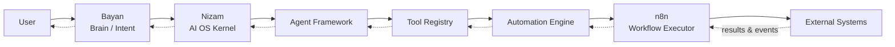

# Nizam — the Bayan AI Operating System

> The execution operating system that safely turns AI intent into real, observable actions across every system a business runs on.

**Status: Approved (Phase 1) | Version: 1.0.0 | Last updated: 2026-07-01 | Owner: Architecture (Nizam Core)**

---

## What Nizam Is

**Nizam** (Arabic نظام — "system / order") is the **AI Operating System** that sits between an AI brain and the real world. Its single job is **execution**: it receives structured **intents** from **Bayan** (the AI brain) and carries them out safely, observably, and multi-tenant — across agents, tools, workflow automation, and external systems.

Nizam is deliberately **not** several things it is often mistaken for:

- **Not a chatbot.** It has no conversational surface of its own. Conversation and reasoning belong to Bayan. Nizam acts.
- **Not a RAG system.** It does not retrieve documents to answer questions. It executes work. Retrieval, if ever needed, is a tool Nizam can *call*, not the point of Nizam.
- **Not a brain.** It does no planning or natural-language reasoning on its own behalf. It takes an already-formed intent and turns it into governed, auditable actions.
- **Not a sales-only CRM.** CRM-style products (like HalaOps) are *applications that run on Nizam*, not Nizam itself.

Put plainly: **Bayan decides *what* should happen. Nizam makes it *actually* happen — correctly, once, with a receipt.**

### The Layer Chain

Every request in the system travels the same canonical chain. Memorize it; it appears identically throughout the documentation:

```
User → Bayan (Brain) → Nizam (AI OS) → Agent Framework → Tool Registry → Automation Engine → n8n → External Systems
```



---

## Relationship to HalaOps / Hala Career

The host business/product family is **Hala Career / HalaOps**. HalaOps — the Operational Intelligence CRM (tasks, performance, gamification, Truth Index, AI copilot) — is a **product that runs on Nizam**, not a competitor to it or a replacement for it.

- **Nizam** provides the shared execution substrate: identity, agents, tools, automation, integrations, billing, observability, notifications, administration.
- **HalaOps** is one tenant-facing application whose AI-driven actions (smart assignment, voice-to-action, workflow triggers, integrations) are executed *through* Nizam.
- Future Hala Career products, and third-party plugin authors, sit on the same substrate.

The prior HalaOps CRM blueprint (`00-MASTER-BLUEPRINT.md`, `01-database-schema.sql`, `02-api-spec.md`, `03-gamification-and-kpi.md`) remains the product-level design for HalaOps. This repository now documents the **platform beneath it**.

---

## Documentation Index

Phase 1 is architecture and documentation only. The full document set:

| # | Document | Purpose |
|---|----------|---------|
| 00 | [docs/00-Vision.md](./docs/00-Vision.md) | Vision, north star, guiding principles, non-goals |
| 01 | [docs/01-System-Overview.md](./docs/01-System-Overview.md) | High-level system overview, layers, contexts, request flow |
| 02 | [docs/02-Business-Goals.md](./docs/02-Business-Goals.md) | Business drivers, OKRs, KPIs, value proposition, monetization |
| 03 | [docs/03-Architecture.md](./docs/03-Architecture.md) | Clean/Hexagonal architecture, layering, dependency rule |
| 04 | [docs/04-Domain-Driven-Design.md](./docs/04-Domain-Driven-Design.md) | Strategic + tactical DDD, context map, aggregates |
| 05 | [docs/05-Bounded-Contexts.md](./docs/05-Bounded-Contexts.md) | The 12 bounded contexts, boundaries, events, ownership |
| 06 | [docs/06-Agent-Architecture.md](./docs/06-Agent-Architecture.md) | Agent Framework: definitions, runtime, guardrails (executor, not reasoner) |
| 07 | [docs/07-Tool-Architecture.md](./docs/07-Tool-Architecture.md) | Tool Registry: manifests, JSON Schema, versioning, sandboxing |
| 08 | [docs/08-Automation-Architecture.md](./docs/08-Automation-Architecture.md) | Automation Engine wrapping n8n: triggers, retries, idempotency |
| 09 | [docs/09-Multi-Tenant.md](./docs/09-Multi-Tenant.md) | RLS, Pool/Bridge/Silo tiers, tenant context propagation |
| 10 | [docs/10-Security-Strategy.md](./docs/10-Security-Strategy.md) | Threat model, AuthN/Z, secrets, agent/tool safety, mTLS |
| 11 | [docs/11-API-Strategy.md](./docs/11-API-Strategy.md) | OpenAPI 3.1 REST, webhooks, WS/SSE, gRPC, GraphQL BFF |
| 12 | [docs/12-Event-Architecture.md](./docs/12-Event-Architecture.md) | Outbox, NATS JetStream, sagas, event sourcing, AsyncAPI |
| 13 | [docs/13-Coding-Standards.md](./docs/13-Coding-Standards.md) | Enforceable engineering standards, layering, testing, DoD |
| 14 | [docs/14-Folder-Structure.md](./docs/14-Folder-Structure.md) | Full monorepo tree, every folder explained |
| 15 | [docs/15-Project-Roadmap.md](./docs/15-Project-Roadmap.md) | Phases 1–8, exit criteria, STOP gate |
| 16 | [docs/16-ADR.md](./docs/16-ADR.md) | Architecture Decision Records (ADR-0001…0013) |
| 17 | [docs/17-Glossary.md](./docs/17-Glossary.md) | Ubiquitous language dictionary |
| 18 | [docs/18-Risks.md](./docs/18-Risks.md) | Risk register (20 risks, mitigations, owners) |
| 19 | [docs/19-Assumptions.md](./docs/19-Assumptions.md) | Open assumptions and recorded gaps |
| 20 | [docs/20-Project-State.md](./docs/20-Project-State.md) | Current state, what is done, what is pending |
| — | [docs/NEXT_PHASE.md](./docs/NEXT_PHASE.md) | Phase 2 plan and entry criteria |
| 21 | [docs/21-Database-Design.md](./docs/21-Database-Design.md) | ERD, tables, constraints (design only) |
| 22 | [docs/22-UIUX-Guidelines.md](./docs/22-UIUX-Guidelines.md) | Non-technical UX, wizards, Basic/Advanced mode, AR/EN |
| A | [docs/audit/Architecture-Audit-Report.md](./docs/audit/Architecture-Audit-Report.md) | Independent architecture audit |
| A | [docs/audit/Missing-Items-Report.md](./docs/audit/Missing-Items-Report.md) | Gap analysis / missing items |
| A | [docs/audit/Risks-Report.md](./docs/audit/Risks-Report.md) | Risk register and mitigations |

> All documents listed above (00–22, `NEXT_PHASE.md`, and the three audit reports) are authored and approved as part of the Phase 1 deliverable set. This index is the complete, canonical map of the architecture.

---

## Tech Stack Summary

| Concern | Choice |
|---------|--------|
| Runtime / language | Node.js 22 LTS, TypeScript 5.x (strict) |
| Backend | NestJS (modular monolith first, service-extractable) |
| Frontend | Next.js 15 (App Router), React 19, TailwindCSS, bilingual AR/EN RTL/LTR |
| Primary DB | PostgreSQL 16 with Row-Level Security (RLS) + `pgvector` |
| Cache / ephemeral | Redis 7 |
| Queue / jobs | BullMQ (on Redis) |
| Event backbone | Transactional Outbox → NATS JetStream (primary), Redis Streams (dev fallback) |
| Automation | Internal Automation Engine driving self-hosted **n8n** |
| AI brain access | **Bayan Gateway** Anti-Corruption Layer over a stable Intent contract |
| Nizam's own LLM calls | Claude models via Anthropic API, behind an `LlmProvider` port |
| Observability | OpenTelemetry → Prometheus + Grafana + Loki + Tempo; pino JSON logs |
| AuthN | OAuth2 / OIDC, JWT access + refresh, mTLS service-to-service |
| AuthZ | RBAC + ABAC, enforced at API and DB (RLS) |
| Secrets | Vault-style manager (HashiCorp Vault or cloud KMS), abstracted |
| Deploy | Docker, Kubernetes (Helm), horizontal pod autoscaling |
| API contracts | OpenAPI 3.1 (REST), AsyncAPI 2.6 (events) |

---

## How to Navigate

1. **Start with vision.** Read [00-Vision.md](./docs/00-Vision.md) to understand *why* Nizam exists.
2. **Get the map.** Read [01-System-Overview.md](./docs/01-System-Overview.md) for the layers, the 12 bounded contexts, and how a request flows end to end.
3. **Understand the business.** Read [02-Business-Goals.md](./docs/02-Business-Goals.md) for objectives, KPIs, and monetization.
4. **Go deep by concern.** Architecture (03), contexts (04), domain (05), events (06), then the pillar contexts (07–14), then the cross-cutting concerns (15–18).
5. **Check state and next steps.** [20-Project-State.md](./docs/20-Project-State.md), [NEXT_PHASE.md](./docs/NEXT_PHASE.md), and the [audit reports](./docs/audit/).

---

## Current Phase Status

**Phase 1 — Architecture: COMPLETE.**

Phase 1 produces *architecture and documentation only*. No application, business, or product code is written in this phase. Every significant decision is captured in a document and traced back to the canonical decisions. Illustrative diagrams and schema *designs* are allowed; runnable code is not. Phase 2 (build) is scoped in [NEXT_PHASE.md](./docs/NEXT_PHASE.md).

---

## The Constitution (Principles in Brief)

Nizam is governed by a small, fixed set of principles that every document and every future decision must uphold:

1. **AI does the work, humans supervise.** The system executes; people set intent, review, and approve high-consequence actions.
2. **Execution, not conversation.** Nizam acts on intents; it is not a chatbot, brain, or RAG.
3. **Safe by construction.** Multi-tenant isolation (RLS), least privilege (RBAC/ABAC), idempotency, and compensation are defaults, not add-ons.
4. **Observable by default.** Every step emits events, traces, metrics, and audit records. Nothing happens silently.
5. **Clean, modular, replaceable.** Clean Architecture, DDD bounded contexts, hexagonal ports — every external dependency (Bayan, n8n, LLM, secrets) is behind a port and swappable.
6. **Event-driven.** State changes flow through a transactional outbox to NATS JetStream; contexts react asynchronously.
7. **Human language for humans.** Target users are non-technical; every surface is plain-language and bilingual AR/EN.
8. **Design for scale from day one.** Modular monolith now, service extraction later, with no rewrite.

---

## Related Documents

- [docs/00-Vision.md](./docs/00-Vision.md) — Vision & north star
- [docs/01-System-Overview.md](./docs/01-System-Overview.md) — System overview
- [docs/02-Business-Goals.md](./docs/02-Business-Goals.md) — Business goals & objectives
- [docs/20-Project-State.md](./docs/20-Project-State.md) — Project state
- [docs/NEXT_PHASE.md](./docs/NEXT_PHASE.md) — Next phase
- Legacy HalaOps blueprint: `00-MASTER-BLUEPRINT.md` and companions (product-level design for the HalaOps application)

---

## Change Log

| Version | Date | Author | Change |
|---------|------|--------|--------|
| 1.0.0 | 2026-07-01 | Architecture (Nizam Core) | Replaced HalaOps CRM README with Nizam AI OS top-level entry point; added documentation index, tech stack, layer chain, and constitution. |
