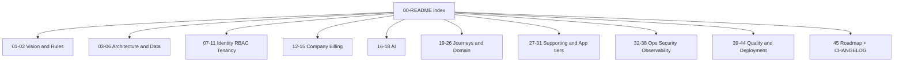
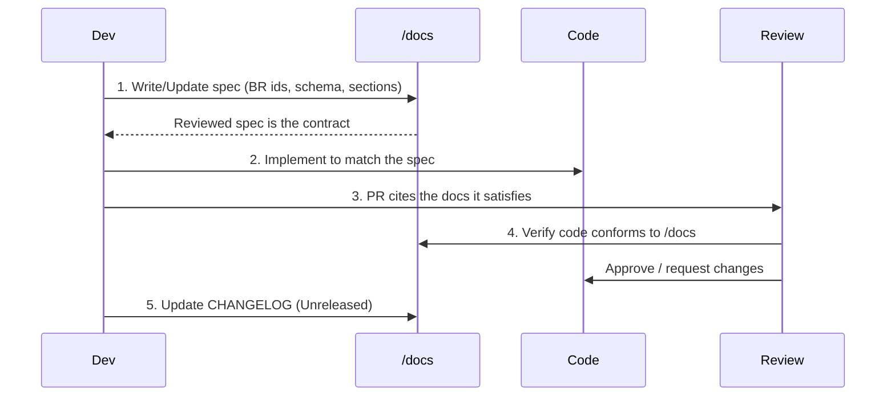
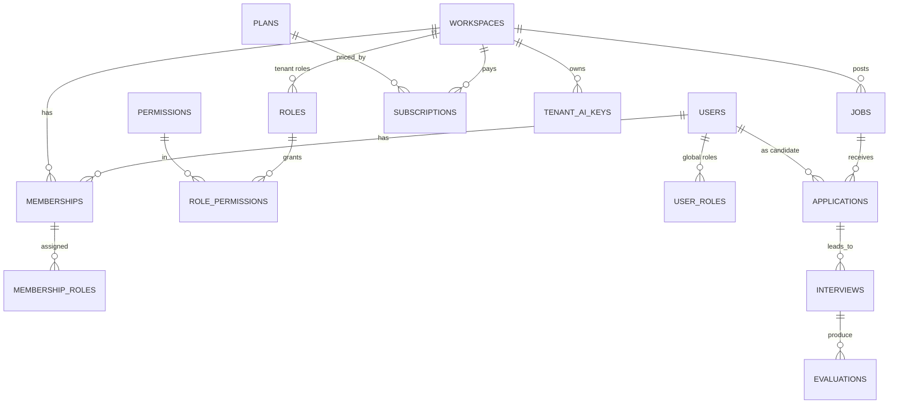

# 00 — Documentation Index (فهرس التوثيق)

The entry point and single source of truth for HalaOps. This `/docs` folder — not the code, not tribal knowledge — is authoritative; code is written to match these documents.

## Related Documents

- [01-Project-Vision](01-Project-Vision.md)
- [02-Business-Rules](02-Business-Rules.md)
- [05-Database-Architecture](05-Database-Architecture.md)
- [06-ERD](06-ERD.md)
- [45-Future-Roadmap](45-Future-Roadmap.md)
- [CHANGELOG](CHANGELOG.md)

## Purpose (الهدف)

This document explains what the `/docs` folder is, how to use it, the conventions every doc follows, and how all 53 numbered documents (00–51, 53) fit together. It is the map; the other documents are the territory. Read this first.

## Why It Exists (سبب وجوده)

A production SaaS sold to thousands of companies needs one place where the truth lives. When code and documentation disagree, ambiguity creeps in and bugs follow. HalaOps adopts a **documentation-first** rule: the spec in `/docs` is written or updated *before* the code, and code is then made to conform. This index exists so any contributor can find the relevant spec in seconds and so reviewers can verify code against a known reference.

## Architecture

The documentation set is organized into thematic ranges. Every file follows the same mandatory section template, so once you know the shape of one doc you know them all.

### How `/docs` is the single source of truth

1. **Documentation-first development** — no feature is built until its behavior is specified here. The canonical context and these docs define the stack, schema, RBAC, tenancy, and conventions.
2. **No contradictions** — facts (table names, columns, permission keys, statuses) appear once and are referenced elsewhere. The cross-reference map below keeps docs linked rather than duplicated.
3. **Cite, don't restate** — business rules carry stable IDs (`BR-001…`) in [02-Business-Rules](02-Business-Rules.md); other docs cite the ID.
4. **Code conforms to docs** — when code and a doc disagree, the doc wins; either the code is fixed or the doc is consciously updated (and recorded in [CHANGELOG](CHANGELOG.md)).

## Workflow

The lifecycle of any change to HalaOps:

### Reading order (recommended)

1. [01-Project-Vision](01-Project-Vision.md) — why we build this and for whom.
2. [02-Business-Rules](02-Business-Rules.md) — the enumerated invariants everything cites.
3. [03-System-Architecture](03-System-Architecture.md) → [06-ERD](06-ERD.md) — how the system and data are shaped.
4. [07-RBAC](07-RBAC.md) → [11-Permissions-Matrix](11-Permissions-Matrix.md) — identity, tenancy, authorization.
5. [12-Workspace-Management](12-Workspace-Management.md) → [18-AI-Interview-Engine](18-AI-Interview-Engine.md) — companies, billing, AI.
6. [19-Candidate-Journey](19-Candidate-Journey.md) → [26-Notification-System](26-Notification-System.md) — journeys and recruitment domain.
7. [27-Storage-System](27-Storage-System.md) → [38-Audit-System](38-Audit-System.md) — supporting systems, app tiers, ops.
8. [39-Testing-Strategy](39-Testing-Strategy.md) → [45-Future-Roadmap](45-Future-Roadmap.md) and [CHANGELOG](CHANGELOG.md) — quality, deployment, roadmap.

## Business Rules

The documentation process itself follows a few rules (the platform's product/business rules live in [02-Business-Rules](02-Business-Rules.md)):

- **DOC-R1** Every doc begins with an H1 title and a one-line summary, then a "Related Documents" list, then the 14 mandatory H2 sections (see Conventions).
- **DOC-R2** Every section contains real, specific, HalaOps-accurate content — no placeholders, no "TODO", no "coming soon", no empty headings.
- **DOC-R3** Facts are stated once and referenced; table/column/permission names match the canonical schema exactly.
- **DOC-R4** Business rules are cited by their `BR-xxx` ID, never paraphrased into a new rule.
- **DOC-R5** Diagrams use Mermaid; Arabic terms appear in parentheses where the spec used them.

### Documentation conventions

Mandatory section template for every doc (H2 headings, in order): Purpose, Why It Exists, Architecture, Workflow, Business Rules, Database Relations, Permissions, Validation, Edge Cases, Security, Performance, Testing, Future Expansion, Open Questions. Files are typically 150–400+ lines and reference real paths under `/home/user/crm` (e.g. `app/Core/Model.php`, `config/rbac.php`, `database/migrations/0010_create_subscriptions_table.php`).

### The complete document set (53 documents)

| # | Document | One-line description |
|---|----------|----------------------|
| 00 | [00-README](00-README.md) | This index; how to use `/docs` as the single source of truth |
| 01 | [01-Project-Vision](01-Project-Vision.md) | Vision, mission, market, personas, success metrics, non-goals |
| 02 | [02-Business-Rules](02-Business-Rules.md) | Enumerated platform rules (BR-001…) cited everywhere |
| 03 | [03-System-Architecture](03-System-Architecture.md) | High-level architecture of the pure-PHP micro-framework |
| 04 | [04-Folder-Structure](04-Folder-Structure.md) | Repository layout and what each directory contains |
| 05 | [05-Database-Architecture](05-Database-Architecture.md) | Schema design, conventions, constraints, tenancy columns |
| 06 | [06-ERD](06-ERD.md) | Entity-relationship diagram of built and planned tables |
| 07 | [07-RBAC](07-RBAC.md) | Roles, permissions, inheritance, policy gates |
| 08 | [08-Multi-Tenant](08-Multi-Tenant.md) | Row-level tenant isolation, fail-closed scoping, trade-offs |
| 09 | [09-Authentication](09-Authentication.md) | Login, register, password reset, sessions, throttling |
| 10 | [10-Authorization](10-Authorization.md) | Permission checks, policy gates, middleware enforcement |
| 11 | [11-Permissions-Matrix](11-Permissions-Matrix.md) | Role × permission matrix for every default role |
| 12 | [12-Workspace-Management](12-Workspace-Management.md) | Company creation, provisioning, membership management |
| 13 | [13-Subscription-System](13-Subscription-System.md) | Data-driven plans and subscription lifecycle |
| 14 | [14-Billing-System](14-Billing-System.md) | Invoices, payments, payment methods |
| 15 | [15-Payment-Gateways](15-Payment-Gateways.md) | Pluggable gateways (Moyasar, Tap, HyperPay…) and webhooks |
| 16 | [16-AI-Architecture](16-AI-Architecture.md) | Bring-your-own-keys AI layer overview |
| 17 | [17-AI-Providers](17-AI-Providers.md) | Provider interface, registry, supported providers |
| 18 | [18-AI-Interview-Engine](18-AI-Interview-Engine.md) | Question generation, conducting, scoring, analysis |
| 19 | [19-Candidate-Journey](19-Candidate-Journey.md) | The candidate's experience end to end |
| 20 | [20-Recruiter-Journey](20-Recruiter-Journey.md) | The recruiter's day-to-day workflow |
| 21 | [21-HR-Journey](21-HR-Journey.md) | The HR manager's hiring-process ownership |
| 22 | [22-SuperAdmin-Journey](22-SuperAdmin-Journey.md) | Platform staff operating across tenants |
| 23 | [23-Interview-Workflow](23-Interview-Workflow.md) | Scheduling, conducting, scoring interviews |
| 24 | [24-Job-Lifecycle](24-Job-Lifecycle.md) | Job from draft through open to closed/archived |
| 25 | [25-Application-Lifecycle](25-Application-Lifecycle.md) | Application through pipeline stages to decision |
| 26 | [26-Notification-System](26-Notification-System.md) | In-app and email notifications, preferences |
| 27 | [27-Storage-System](27-Storage-System.md) | Files table, disk abstraction, validation, visibility |
| 28 | [28-Search-System](28-Search-System.md) | Tenant-filtered FULLTEXT search behind an abstraction |
| 29 | [29-API-Architecture](29-API-Architecture.md) | Token-authenticated, versioned REST API |
| 30 | [30-Frontend-Architecture](30-Frontend-Architecture.md) | Server-rendered templates, Tailwind, vanilla JS |
| 31 | [31-Backend-Architecture](31-Backend-Architecture.md) | Core framework: router, container, models, services |
| 32 | [32-Setup-Installer](32-Setup-Installer.md) | Browser installer with live console and recovery |
| 33 | [33-System-Diagnostics](33-System-Diagnostics.md) | Health checks and environment reporting |
| 34 | [34-Security](34-Security.md) | Platform-wide security model and mitigations |
| 35 | [35-Performance](35-Performance.md) | Indexes, caching, pagination, hot paths |
| 36 | [36-Scalability](36-Scalability.md) | Horizontal scale, replicas, tenant sharding path |
| 37 | [37-Logging](37-Logging.md) | Leveled file logging and request/error logs |
| 38 | [38-Audit-System](38-Audit-System.md) | `activity_log` audit trail of security/business events |
| 39 | [39-Testing-Strategy](39-Testing-Strategy.md) | Unit, feature, and security testing approach |
| 40 | [40-QA-Checklist](40-QA-Checklist.md) | Per-feature manual QA checklist |
| 41 | [41-Coding-Standards](41-Coding-Standards.md) | PSR-12, strict types, conventions |
| 42 | [42-Code-Review-Checklist](42-Code-Review-Checklist.md) | What reviewers verify on every PR |
| 43 | [43-Deployment](43-Deployment.md) | Shipping and installing the package |
| 44 | [44-Production-Checklist](44-Production-Checklist.md) | Go-live readiness checklist |
| 45 | [45-Future-Roadmap](45-Future-Roadmap.md) | Phased roadmap and 5-year scalability outlook |
| 46 | [46-Architecture-Review](46-Architecture-Review.md) | Independent self-audit: verification results, strengths, weaknesses, gaps, risks, 5-year outlook |
| 47 | [47-Enterprise-Architecture-Standards](47-Enterprise-Architecture-Standards.md) | Binding standard: layers, SOLID, DI, Repository/Service/DTO, Events, Cache/Storage/Search/Queue/AI/Notification contracts, Settings, Feature Flags, Audit, Soft Delete, UUID, Policies |
| 48 | [48-Multi-Tenant-RBAC-Bible](48-Multi-Tenant-RBAC-Bible.md) | System constitution: one identity, many workspaces, roles+permissions+memberships, current tenant, fail-closed isolation, impersonation, the Golden Rule |
| 49 | [49-Development-Workflow](49-Development-Workflow.md) | Binding development lifecycle: the 16-stage per-feature workflow, feature completeness, Definition of Done, self/regression testing, routing/DB/API/security/performance/refactoring rules, stop conditions, no fake completion |
| 50 | [50-Continuous-Project-Audit](50-Continuous-Project-Audit.md) | Binding quality gate: after every phase, audit the WHOLE project (broken pages/routes/buttons, unused APIs, missing permissions, multi-tenant/RBAC/security/performance/DB/UI issues, doc↔code drift) and fix before the next phase |
| 51 | [51-AI-Interview-Engine](51-AI-Interview-Engine.md) | Enterprise AI Interview Platform architecture: Orchestrator, 9-agent layer, Memory Engine, Interview State Machine, Blueprint Engine + Library, Workflow Builder, Decision Engine, Evaluation Templates, Question Bank, Knowledge Engine, model routing/fallback, prompt-injection protection, explainable AI, anti-cheating, observability, versioning/sandbox/benchmark, phased roadmap |
| 53 | [53-ATS-Recruitment-Workflow](53-ATS-Recruitment-Workflow.md) | The core ATS engine: per-job pipelines + stages, application lifecycle + movement (status-history audited), offers, interview scheduling, talent pool, advanced search, candidate timeline, recruiter tasks, rejection — all event-emitting into the Automation Engine, with the AI Interview Engine as interview stages |
| — | [CHANGELOG](CHANGELOG.md) | Versioned record of changes (Keep a Changelog) |

That is 53 numbered documents (00–51, 53) plus the CHANGELOG.

### Database blueprint (`/docs/database/`)

The complete, scale-ready database design (the **Final Database Blueprint**, now
**fully realized** — migrations `0018`–`0032`; see the Bible's "Migration Status —
Blueprint Realized") lives under [`database/`](database/00-Database-Bible.md):
the [Database Bible](database/00-Database-Bible.md) (standard + inventory), 11
domain designs + [12 Workspace/Modules/Registries](database/12-Workspace-Types-Modules-Registries.md)
(Revision R1), the consolidated [99-ERD-Blueprint](database/99-ERD-Blueprint.md)
(166 business tables; 167 incl. the `migrations` ledger), and the
external-architect [98-Validation-Report](database/98-Validation-Report.md).

## Database Relations

This index does not own data, but it summarizes the schema so newcomers have orientation before diving into [05-Database-Architecture](05-Database-Architecture.md) and [06-ERD](06-ERD.md).

The full 166-table schema is realized (migrations `0001`–`0032`). A small slice of
the identity/tenancy + recruitment core:

- **Identity & tenancy**: `users`, `workspaces` (typed via `workspace_types`), `memberships`, `roles`, `permissions`, `role_permissions`, `membership_roles`, `user_roles`.
- **Commercial & config**: `plans`, `subscriptions`, `tenant_ai_keys`, `settings`, `onboarding_progress`, plus the D4 billing tables.
- **Infra & audit**: `password_resets`, `activity_logs`, `system_modules`, the D0 lookups/reference + polymorphic tables, `migrations`.
- **Recruitment**: `jobs`, `pipelines`, `pipeline_stages`, `applications`, `interviews`, `interview_sessions`, `evaluations`, … (full D5–D9 set).
- **Supporting**: `files`, `notifications`, `invoices`, `payments`, `queued_jobs`, `failed_jobs`, analytics + logs.

Statuses/types are configuration-driven (per-entity `*_statuses` tables / `lookup_values` FKs — **no ENUM columns**). Every tenant table carries a `workspace_id` FK and index; uniqueness is per-workspace where relevant. See [05-Database-Architecture](05-Database-Architecture.md) and the [Database Bible](database/00-Database-Bible.md) for authoritative definitions.

## Permissions

This index is for everyone and gates nothing, but it points to where authorization is specified:

- The permission catalogue and default roles are defined in [07-RBAC](07-RBAC.md) (data-driven in `config/rbac.php`).
- The role × permission matrix is in [11-Permissions-Matrix](11-Permissions-Matrix.md).
- Built permission modules today: `dashboard.*`, `recruitment.*` (the ATS — jobs, applications, pipeline board, offers), `workspace.*`, `members.*`, `roles.*`, `billing.*`, `ai.*`, `settings.*`, and `system.manage` (platform ops, super-admin). Permissions bind to a `system_modules.module_id` (the module is the group). Further per-entity permissions (interviews, evaluations, candidates, notifications, files) are added as those features ship.

## Validation

To keep the docs trustworthy, every document is validated against:

- Presence of the H1 + one-line summary, Related Documents, and all 14 mandatory sections (DOC-R1).
- No placeholders/TODO/empty sections (DOC-R2).
- Table, column, permission, and status names that match the canonical schema exactly (DOC-R3).
- Correct cross-reference links per the map below (DOC-R4/DOC-R5).
- Valid Mermaid syntax in diagrams.

## Edge Cases

- **A doc references a fact not yet in the canonical context** — the author infers it consistently and records it under that doc's "Open Questions"; it is reconciled into the canonical context later.
- **Two docs appear to define the same rule** — that is a defect; consolidate into [02-Business-Rules](02-Business-Rules.md) and reference it.
- **A module ships before its doc** — not allowed under documentation-first; the doc is written first (DOC-R-process).
- **A planned table changes shape during implementation** — update [05-Database-Architecture](05-Database-Architecture.md)/[06-ERD](06-ERD.md) and note it in [CHANGELOG](CHANGELOG.md).

## Security

- The docs themselves describe security but must not contain secrets — no real API keys, passwords, connection strings, or customer data ever appear in `/docs`.
- Security-relevant behavior is specified centrally in [34-Security](34-Security.md) and cited, so a single review surface covers it.
- Examples use placeholders (e.g. `base64:...` for `APP_KEY`) that are obviously non-functional.

## Performance

- The index is a static Markdown file; it has no runtime cost.
- Keeping facts centralized (cite-don't-restate) reduces the maintenance "read amplification" when something changes — one edit instead of many.
- The cross-reference map lets tooling build a link graph to detect orphaned or broken references quickly.

## Testing

- A docs linter (CI) checks: every numbered file (00–51 and 53) plus CHANGELOG exists; each has the mandatory sections; internal links resolve; Mermaid blocks parse.
- A consistency check verifies that table/column/permission names used in docs exist in the canonical schema.
- A "no placeholder" check fails the build on `TODO`, `coming soon`, or empty sections.

## Future Expansion

- New documents are appended with the next number and added to the table above and the cross-reference map.
- If a document grows too large, it is split (e.g. a domain area) and the parent links to the children.
- The roadmap in [45-Future-Roadmap](45-Future-Roadmap.md) and the [CHANGELOG](CHANGELOG.md) together track how the spec evolves over time.

## Open Questions

- None at this time. The document set, conventions, and cross-reference map are fully specified above; open product/technical questions live in their respective documents' "Open Questions" sections.
