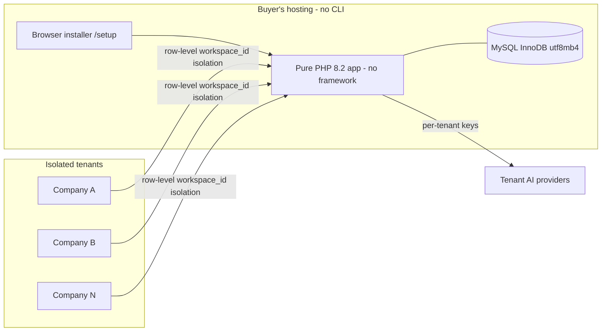
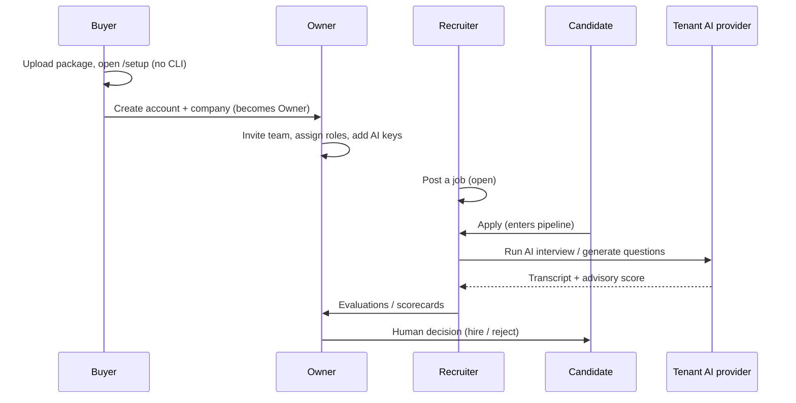
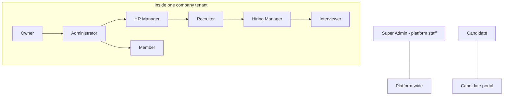

# 01 — Project Vision (رؤية المشروع)

The vision, mission, target market, and product strategy for HalaOps — a bilingual, multi-tenant SaaS platform for HR and recruitment with AI-powered interviewing.

## Related Documents

- [02-Business-Rules](02-Business-Rules.md)
- [45-Future-Roadmap](45-Future-Roadmap.md)
- [00-README](00-README.md)
- [16-AI-Architecture](16-AI-Architecture.md)
- [08-Multi-Tenant](08-Multi-Tenant.md)

## Purpose (الهدف)

This document defines **why HalaOps exists**, **who it is for**, and **what success looks like**. It is the north star that every other document, feature, and trade-off is measured against. When a design decision is ambiguous, the resolution is the one that best serves the vision and personas described here.

## Why It Exists (سبب وجوده)

Small and mid-sized companies in the Arabic-speaking market are underserved by recruitment software:

- Most leading Applicant Tracking Systems (ATS) are English-first; Arabic and RTL are bolt-ons, if present at all.
- AI interviewing tools are emerging but typically force the customer to trust the vendor's AI keys and send candidate data through the vendor's account.
- SaaS deployment usually assumes DevOps skills (CLI, containers, cloud consoles) that many regional buyers and resellers do not have.

HalaOps solves these simultaneously: it is **Arabic/English native (RTL/LTR)**, it lets each tenant **bring its own AI keys** (the platform stores none), and it installs **entirely from the browser** with no command line. The name *HalaOps* pairs the welcoming Arabic greeting *Hala* (هلا) with *Ops* — operations made welcoming.

## Architecture

The vision is realized through a deliberately simple, dependency-free technical foundation so the product can be sold to thousands of companies and run on inexpensive shared hosting:

The strategic pillars map to concrete architecture choices documented elsewhere: one users table and RBAC ([07-RBAC](07-RBAC.md)), fail-closed multi-tenancy ([08-Multi-Tenant](08-Multi-Tenant.md)), and a bring-your-own-keys AI layer ([16-AI-Architecture](16-AI-Architecture.md)).

## Workflow

The end-to-end product story, from a buyer discovering HalaOps to a candidate being hired:

## Business Rules

The vision is bound by these platform rules (full list in [02-Business-Rules](02-Business-Rules.md)):

- One users table; capability from roles only (BR-001, BR-060). The same human can be an Owner of one company, a Member of another, and a Candidate to a third — on a single account (BR-045).
- Strict, fail-closed tenant isolation (BR-040) — a customer's data is never visible to another customer.
- The platform holds **no** AI keys; every tenant brings its own (BR-160, BR-161).
- Plans are data, shipping with one plan at 50 SAR/month, 14-day trial (BR-070).
- AI is advisory; humans make hiring decisions (BR-144).

### Mission

> Give every company in the region a recruitment and AI-interviewing platform that speaks their language, respects their data sovereignty, and installs without a single command line.

### Value proposition

| Buyer pain | HalaOps answer |
|------------|----------------|
| English-only ATS tools | Arabic/English native, full RTL/LTR |
| Must trust vendor's AI | Bring-your-own AI keys, encrypted per tenant |
| DevOps required to deploy | Browser installer, zero CLI, zero Composer/npm |
| Per-seat lock-in | Data-driven plans, unlimited plans without code |
| Opaque AI decisions | AI is advisory; auditable human-in-the-loop |

### Product pillars

1. **Bilingual & RTL-first** — Arabic (العربية) and English are equal citizens, not an afterthought.
2. **True multi-tenancy** — one codebase, thousands of isolated companies, fail-closed isolation.
3. **Bring-your-own AI** — tenant-supplied, encrypted provider keys; pluggable providers.
4. **No-CLI deployment** — install, configure, migrate, and seed from the browser.
5. **RBAC, not user types** — capability from roles, permissions, inheritance, and policies.
6. **Production-ready by default** — no placeholders, no dead routes, real constraints, real tests.

## Personas (الشخصيات)

These are **role assignments**, not user types or tables (BR-001). One person may hold several across companies.

- **Super Admin (مدير المنصة)** — platform staff. Operates across all tenants via the explicit escape hatch, manages plans, companies, users, and diagnostics. Holds the global `super-admin` role (BR-062).
- **Owner (المالك)** — created a company; full control including billing and ownership transfer. System role, cannot be removed while sole owner (BR-051, BR-057).
- **Administrator (المسؤول)** — runs the company day to day; everything except billing changes and ownership.
- **HR Manager (مدير الموارد البشرية)** — owns the hiring process: jobs, pipelines, team coordination, reporting.
- **Recruiter (الموظِّف)** — sources and screens candidates, moves applications through stages, schedules interviews.
- **Hiring Manager (مدير التوظيف)** — the role owner requesting the hire; reviews shortlists and evaluations, participates in decisions.
- **Interviewer (المُحاوِر)** — conducts interviews and submits scorecards/evaluations.
- **Member (عضو)** — a standard company member with baseline visibility.
- **Candidate (مرشّح)** — applies to jobs, completes AI/human interviews, manages their own profile and applications through the candidate portal (`candidate.apply`, `candidate.profile`).

## Database Relations

The personas and pillars are expressed entirely through the identity and RBAC schema (full schema in [05-Database-Architecture](05-Database-Architecture.md)):

- `users` (one global table) — every person, regardless of persona (BR-001).
- `workspaces` — the tenant root; `owner_id` records the Owner persona.
- `memberships` — a user's belonging to a workspace; the bridge that makes someone "in" a tenant.
- `roles` / `permissions` / `role_permissions` / `membership_roles` / `user_roles` — encode all persona capabilities; no persona is a column or table.
- `plans` / `subscriptions` — encode the commercial model behind the value proposition.
- `tenant_ai_keys` — encodes the bring-your-own-keys pillar.

No table named `candidate`, `recruiter`, `owner`, or `super_admin` exists — this is a defining architectural commitment.

## Permissions

Personas are realized as role→permission bundles (see [07-RBAC](07-RBAC.md), [11-Permissions-Matrix](11-Permissions-Matrix.md)):

- Super Admin → all permissions including `platform.*`.
- Owner → all tenant permissions (including `billing.manage`).
- Administrator → all tenant permissions except billing/ownership.
- HR Manager → jobs/applications/interviews/evaluations management plus members visibility.
- Recruiter → `jobs.*` (no delete), `applications.*`, `interviews.schedule`.
- Hiring Manager → `applications.view`, `interviews.view`, `evaluations.view/create`.
- Interviewer → `interviews.conduct`, `evaluations.create`.
- Member → `dashboard.view`, `workspace.view`, `members.view`, baseline reads.
- Candidate → `candidate.apply`, `candidate.profile`.

## Validation

Vision-level guardrails that keep the product honest:

- Every new feature must be expressible without adding a user-type column (validates BR-001).
- Every tenant-bound feature must scope by `workspace_id` and fail closed (validates BR-040).
- Every AI feature must work only with tenant-supplied keys (validates BR-160).
- Every installable artifact must be deployable with no CLI (validates the no-CLI pillar).
- Every UI must render correctly in both LTR and RTL.

## Edge Cases

- **A reseller deploying for many clients** — each client is a separate install or a separate tenant; isolation holds either way.
- **A user who is simultaneously Owner, Member, and Candidate** — supported by design via multiple memberships and an active-tenant context (BR-045).
- **A tenant with no AI keys configured** — AI features are simply unavailable for that tenant; the rest of the product works fully (BR-161).
- **A buyer on cheap shared hosting** — shared-DB row-level tenancy keeps cost low; the scalability path to heavier isolation is documented ([36-Scalability](36-Scalability.md)).
- **Arabic-only company** — entire UX, emails, and notifications render RTL with Arabic copy.

## Security

The vision treats security as a feature, not a layer:

- Data sovereignty: tenants own their AI keys; the platform stores none (BR-160).
- Isolation: fail-closed tenancy is the headline security guarantee (BR-040).
- Trust: human-in-the-loop AI (BR-144) avoids opaque automated rejections, which is both ethical and a market differentiator.
- Auditability: privileged platform actions are logged (BR-200), reassuring enterprise buyers.

## Performance

The vision targets affordability and responsiveness on modest hardware:

- Zero runtime dependencies and OPcache-friendly pure PHP keep per-request overhead low.
- Pre-compiled Tailwind CSS means no build step on the buyer's server.
- Indexed tenant scoping and pagination keep the experience fast as tenants grow.
- AI and email work is offloadable to the queue so interactive pages stay snappy.

## Testing

Vision is validated by acceptance-level tests:

- A fresh install via the browser flow yields a working Owner + company + trial.
- The same UI renders and is fully usable in both `ar` (RTL) and `en` (LTR).
- A tenant without AI keys can still post jobs, receive applications, and run human interviews.
- Cross-tenant access attempts are rejected (isolation acceptance test).

## Future Expansion

The vision deliberately leaves room to grow without rewrites (see [45-Future-Roadmap](45-Future-Roadmap.md)):

- More AI providers via the provider registry (BR-163).
- More payment gateways via the gateway registry (BR-182), prioritizing the Saudi market.
- A public REST API ([29-API-Architecture](29-API-Architecture.md)) and, later, mobile apps.
- Analytics and reporting on top of the existing audit and recruitment data.
- A heavier tenant-isolation tier (DB-per-tenant / sharding) for large customers.

### Success metrics

| Dimension | Metric | Target signal |
|-----------|--------|---------------|
| Adoption | Active companies (tenants) | Thousands of isolated tenants on one codebase |
| Activation | % of new companies that post a job within 7 days | Onboarding works |
| AI engagement | % of tenants configuring at least one AI provider | BYO-keys pillar resonates |
| Hiring outcome | Time-from-application-to-decision | Pipeline + AI shorten cycle |
| Reliability | Cross-tenant data incidents | Zero |
| Deployability | Installs completed without support tickets | No-CLI pillar works |
| Localization | Share of tenants using Arabic UI | Validates RTL-first bet |

### Non-goals (ما ليس ضمن النطاق)

- Not a general-purpose CRM or full HRIS (payroll, attendance) — focus is hiring + AI interviews.
- Not a framework-based app; no Laravel/Symfony, no Composer runtime dependencies.
- Not a vendor-hosted AI service; the platform never owns or resells AI keys.
- Not a DevOps product; no requirement for CLI, containers, or cloud consoles to install.
- Not multiple user-type tables; capability is always role-derived (BR-001).

## Open Questions

- Final pricing tiers beyond the shipped "Standard" plan are a commercial decision tracked in [13-Subscription-System](13-Subscription-System.md).
- The exact priority order for additional AI providers and payment gateways will be confirmed in [45-Future-Roadmap](45-Future-Roadmap.md).
