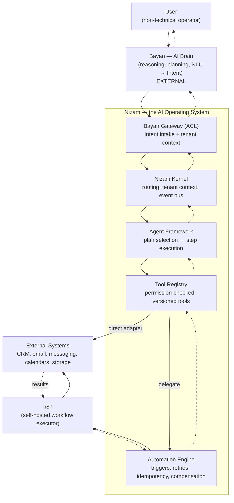
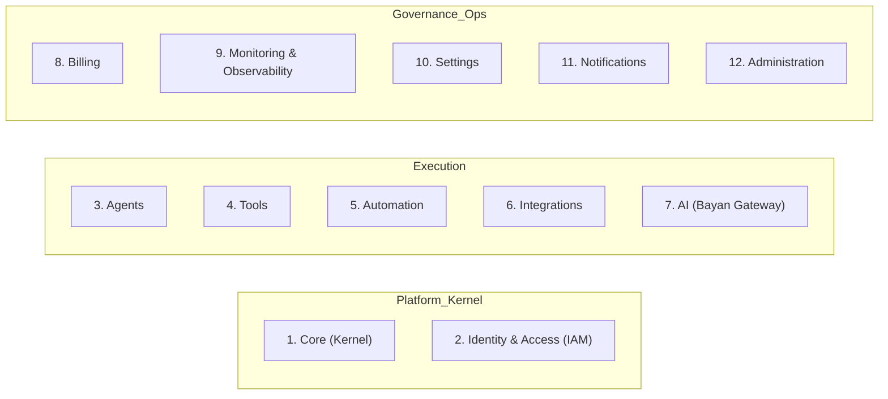
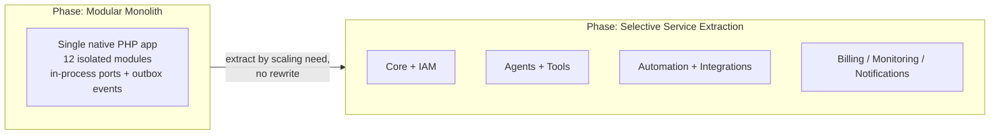
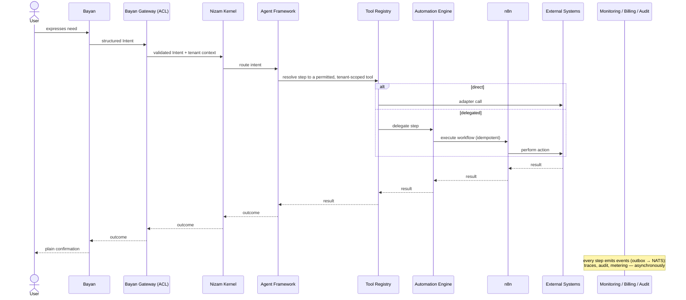

# System Overview

> A high-level map of Nizam for a mixed audience: the layers, what each does, the 12 bounded contexts, the deployment shape, and how a single request flows end to end.

**Status: Approved (Phase 1) | Version: 1.0.0 | Last updated: 2026-07-01 | Owner: Architecture (Nizam Core)**

---

## The Big Picture

Nizam is the **execution operating system** that turns AI intent into real, governed action. An AI brain (**Bayan**) decides *what* should happen and emits a structured **intent**. Nizam takes that intent and makes it *actually happen* — choosing an agent, resolving each step to a permitted tool, driving workflow automation, and reaching out to external systems — while keeping every step isolated per tenant, observable, and reversible.

The whole system is a chain of well-defined layers. Every request travels it in the same order:

```
User → Bayan (Brain) → Nizam (AI OS) → Agent Framework → Tool Registry → Automation Engine → n8n → External Systems
```



---

## What Each Layer Does

| Layer | Responsibility | Boundary note |
|-------|----------------|---------------|
| **User** | The non-technical operator who expresses a need and supervises outcomes. | Interacts through plain-language, bilingual (AR/EN) surfaces. |
| **Bayan (Brain)** | Reasoning, planning, and natural-language understanding. Produces a structured **Intent**. | **External. Already exists.** Nizam does not build or contain it. |
| **Nizam (AI OS Kernel)** | Receives intents; owns tenant context, routing, the event bus, identity, and cross-cutting governance. Orchestrates the layers below. | The heart of this project. Speaks a stable Intent contract, never Bayan's internals. |
| **Agent Framework** | Selects a plan for an intent and drives it step by step, applying guardrails and memory scoping. Internally organized as a **two-tier hierarchy**: one **Department Manager Agent** per department (HR, Marketing, Sales, Finance, Support, Developer, CEO) orchestrating multiple **Worker Agents**, with a **Manager Audit** loop gating the final response. | Each step resolves to a tool; the framework decides *which* and *in what order*. Only a Manager returns the final result upward — see [23-Agent-Hierarchy.md](./23-Agent-Hierarchy.md). |
| **Tool Registry** | The catalog of callable capabilities. Each tool has a JSON-Schema contract, version, and permission scope. Invocations are permission-checked and tenant-scoped. | A tool may call an adapter directly or delegate to the Automation Engine. |
| **Automation Engine** | Owns and drives workflow execution: triggers, run history, retries, idempotency, and compensation. | The governed wrapper around n8n — the product never talks to n8n directly. |
| **n8n** | The actual workflow executor that runs the steps against the outside world. | Self-hosted; driven only via the Automation Engine adapter. |
| **External Systems** | The real systems where work lands: CRMs, email, messaging, calendars, storage. | Reached through Integration connectors (Anti-Corruption Layers). |

---

## Key Capabilities

- **Intent execution** — accept a structured intent and carry it out end to end.
- **Agentic orchestration** — plan-to-execution with guardrails, retries, and scoped memory.
- **Governed tooling** — a versioned, permission-scoped, sandboxed registry of callable capabilities.
- **Workflow automation** — durable, idempotent, compensatable execution via n8n.
- **External integration** — pluggable connectors to outside systems with credential binding and health checks.
- **Multi-tenancy** — shared DB with Row-Level Security as the enforcing boundary, plus Silo/Bridge/Pool scaling tiers.
- **Security & access** — OAuth2/OIDC AuthN, RBAC + ABAC AuthZ enforced at both API and DB layers, mTLS between services.
- **Observability** — OpenTelemetry traces/metrics/logs into Prometheus/Grafana/Loki/Tempo; append-only audit and domain events.
- **Metering & billing** — usage of agent runs, tool calls, automation executions, and tokens metered for quotas and invoices.
- **Extensibility** — tools, integrations, and agent skills are hot-loadable, versioned plugins against stable contracts.

---

## The 12 Bounded Contexts

Nizam is decomposed into twelve DDD bounded contexts, each realized as a PHP module. Named exactly:



1. **Core (Kernel)** — shared kernel: base entities, value objects, event-bus abstractions, result/error types, clock, ID generation, tenant context. No business rules.
2. **Identity & Access (IAM)** — tenants, users, orgs, roles, permissions, sessions, RBAC/ABAC policy; owns AuthN/AuthZ.
3. **Agents** — the Agent Framework: agent definitions, runtime/orchestration, planning-to-execution, agent runs, memory scoping, guardrails.
4. **Tools** — the Tool Registry: tool definitions, JSON-Schema contracts, capability metadata, versioning, permission scopes, sandboxed invocation.
5. **Automation** — the Automation Engine: workflow definitions, triggers, the n8n adapter, run history, retries, idempotency, compensation.
6. **Integrations** — external connectors (ACLs) for CRM, email, messaging, calendars, storage; credential binding, connection health.
7. **AI (Bayan Gateway)** — ACL to the Bayan brain plus the `LlmProvider` port; intent intake, context assembly, response shaping. No reasoning of its own.
8. **Billing** — plans, subscriptions, metering/usage (agent runs, tool calls, automation executions, tokens), quotas, invoices.
9. **Monitoring & Observability** — health, metrics, traces, audit read models, SLO tracking, alerting rules (read side).
10. **Settings** — tenant/user configuration, feature flags, Basic/Advanced mode, localization preferences.
11. **Notifications** — multi-channel delivery (in-app, email, push, webhook), templates, preferences, digests.
12. **Administration** — platform/back-office: tenant lifecycle, global feature flags, audited impersonation, announcements, plugin/marketplace approval.

---

## Deployment Shape: Modular Monolith → Services

Nizam ships first as a **modular monolith**: one deployable native PHP application in which each bounded context is a strongly isolated module with its own domain, application, infrastructure, and interface layers, communicating through in-process ports and asynchronous domain events.

This is a deliberate choice, not a compromise:

- **Clear seams from day one.** Contexts already communicate via events and stable ports, so a module can be lifted into its own service later **without a rewrite**.
- **Operational simplicity now.** One thing to deploy, trace, and reason about while the platform stabilizes.
- **Scale where it hurts.** When a context (for example, Automation or Monitoring) needs independent scaling, it is extracted into its own service. The transactional outbox → NATS JetStream backbone means in-process events become network events transparently.



Both phases run on Docker + Kubernetes (Helm) with horizontal pod autoscaling; PostgreSQL 16 (RLS + pgvector), Redis 7 (cache + Redis-backed PHP queue workers), and NATS JetStream (event backbone) sit behind the application.

---

## How a Request Flows (Plain Language)

Consider an operator who wants a follow-up email scheduled for a client after a call. Here is the canonical journey.

1. **The operator expresses the need.** They speak or click; **Bayan** interprets it and emits a structured **Intent** ("schedule a follow-up email to this client tomorrow morning").
2. **The Bayan Gateway takes it in.** Nizam's ACL validates the Intent against a stable contract and attaches the correct **tenant context** — which workspace, which permissions.
3. **The Kernel routes it.** Nizam hands the intent to the **Agent Framework**.
4. **An agent picks a plan.** The agent breaks the intent into steps. Each step resolves to a specific **Tool** from the Tool Registry — and each tool call is **permission-checked and tenant-scoped** before it runs.
5. **A tool acts or delegates.** A simple step may call an integration adapter directly; a multi-step one delegates to the **Automation Engine**.
6. **Automation runs it via n8n.** The Automation Engine drives **n8n**, which talks to the **External Systems** (the email/calendar system) to actually schedule the message.
7. **Everything is observed.** Each step emits domain/integration events through the outbox to NATS. **Monitoring** records traces and audit, **Billing** meters the agent run and tool calls, **Notifications** can inform the operator — all asynchronously.
8. **The result flows back up.** n8n → Automation → Tool → Agent → Gateway → Bayan → the operator, who sees a plain confirmation of what was done.
9. **Failures are handled, not hidden.** If a step fails, idempotency keys prevent duplicates on retry, and a Saga compensates any partial work — and all of it is visible in the audit trail.



---

## Related Documents

- [../README.md](../README.md) — Project entry point
- [00-Vision.md](./00-Vision.md) — Vision & north star
- [02-Business-Goals.md](./02-Business-Goals.md) — Business goals & objectives
- [03-Architecture.md](./03-Architecture.md) — Detailed architecture
- [05-Bounded-Contexts.md](./05-Bounded-Contexts.md) — Bounded contexts in depth
- [06-Agent-Architecture.md](./06-Agent-Architecture.md) — Agent Framework
- [08-Automation-Architecture.md](./08-Automation-Architecture.md) — Automation Engine
- [03-Architecture.md](./03-Architecture.md) — Deployment

---

## Change Log

| Version | Date | Author | Change |
|---------|------|--------|--------|
| 1.0.0 | 2026-07-01 | Architecture (Nizam Core) | Initial system overview: layers, 12 contexts, deployment shape, request flow. |
