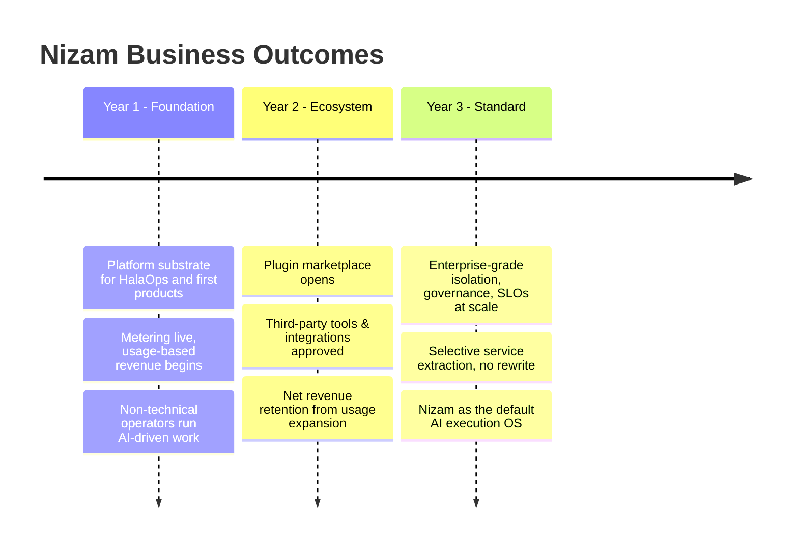

# Business Goals & Objectives

> The business case for Nizam: drivers, measurable objectives and OKRs, KPIs, target segments, value per stakeholder, monetization, and phased outcomes.

**Status: Approved (Phase 1) | Version: 1.0.0 | Last updated: 2026-07-01 | Owner: Architecture (Nizam Core)**

---

## Business Drivers

Nizam exists to convert a strategic bet — that AI will do a large share of operational work — into a durable, monetizable platform. The drivers:

1. **Leverage across products.** Hala Career is building multiple products (starting with HalaOps). Each one needs identity, agents, tools, automation, integrations, metering, and audit. Building these once, as a shared AI OS, avoids re-implementing the same plumbing per product and compounds every improvement across the portfolio.
2. **Safe monetization of AI action.** The market will pay for AI that *does work*, not just chats. But un-governed AI action is a liability. A safe, metered execution layer is what makes AI-driven work sellable to businesses.
3. **Speed to value for non-technical customers.** The addressable market is operators who cannot script. A platform that lets them put AI to work through plain-language, wizard-driven surfaces dramatically widens who can buy.
4. **Defensible platform economics.** Metered execution (agent runs, tool calls, automation executions, tokens) aligns revenue with value delivered and creates a usage-based, expandable revenue base rather than flat seat licensing alone.
5. **Ecosystem gravity.** Stable plugin contracts for tools, integrations, and agent skills let third parties extend the platform, turning Nizam into a marketplace rather than a closed product.

---

## Measurable Objectives & OKRs

OKRs are framed for the first year post-build; Phase 1 (architecture) is a prerequisite objective in its own right.

**Objective 0 — Establish a production-ready architecture (Phase 1).**
- KR0.1: All 12 bounded contexts specified with boundaries and ownership.
- KR0.2: End-to-end execution flow documented with no gaps.
- KR0.3: Multi-tenancy, security, observability, and billing designed as first-class concerns.
- KR0.4: Zero application code produced; 100% of decisions traced to canon.

**Objective 1 — Prove that non-technical operators can put AI to work.**
- KR1.1: A new operator completes a real cross-system action, AI-driven, in under 10 minutes with no code.
- KR1.2: ≥ 80% of new tenants complete guided onboarding (connect ≥ 1 external system) without support.
- KR1.3: ≥ 90% of operator-facing screens pass the plain-language / per-field-help UX bar.

**Objective 2 — Make AI-driven execution safe and observable.**
- KR2.1: 100% of executed actions produce a traceable audit record.
- KR2.2: 100% of high-consequence actions pass through an approval gate.
- KR2.3: Zero cross-tenant data-access incidents (RLS-enforced).

**Objective 3 — Establish usage-based monetization.**
- KR3.1: Metering live for agent runs, tool calls, automation executions, and tokens.
- KR3.2: ≥ 95% billing accuracy (metered vs. invoiced) reconciliation.
- KR3.3: Net revenue retention ≥ 110% from usage expansion within existing tenants.

**Objective 4 — Seed the ecosystem.**
- KR4.1: Plugin contracts (manifest + JSON Schema) published and versioned.
- KR4.2: First third-party tool/integration approved through Administration's marketplace flow.

---

## KPIs

| Category | KPI | Definition / target intent |
|----------|-----|-----------------------------|
| **Adoption** | Monthly active operators; tenants with ≥ 1 live automation | Breadth of real usage, not sign-ups |
| **Automation coverage** | % of eligible operational actions executed by Nizam vs. done manually | The core value metric — how much work AI actually does |
| **Time-to-value** | Median time from tenant creation to first successful AI-driven action | Onboarding effectiveness for non-technical users |
| **Cost per automated action** | Fully-loaded infra + LLM cost per executed action | Unit economics; must trend down with scale |
| **Reliability SLOs** | Execution success rate; p95 intent-to-result latency; automation run success | See SLO targets below |
| **Metering integrity** | Metered-to-invoiced reconciliation accuracy | Trust in the billing model |
| **Retention / expansion** | Logo retention; net revenue retention | Durability and usage-based growth |

### Reliability SLOs (targets)

| SLO | Target |
|-----|--------|
| Control-plane API availability | 99.9% monthly |
| Intent acceptance → acknowledged | p95 < 500 ms |
| End-to-end intent → result (single-tool) | p95 < 5 s |
| Automation run success (excluding external-system faults) | ≥ 99% |
| Event delivery (outbox → NATS, at-least-once) | ≥ 99.99% |
| Cross-tenant isolation incidents | 0 |

---

## Target Market & Segments

- **Primary — Hala Career's own products.** HalaOps and subsequent products are the first, guaranteed tenants. Nizam's first job is to make them faster, safer, and cheaper to build and run.
- **SMB operations teams.** Small and mid-sized businesses that run on a patchwork of CRMs, inboxes, messaging, and calendars and want AI to do the connective work without hiring engineers.
- **Bilingual (AR/EN) markets.** First-class Arabic/English RTL-LTR support targets a market underserved by English-only automation platforms.
- **Plugin developers / partners (Year 2+).** Builders who extend the platform through stable contracts and monetize their tools and integrations.
- **Enterprise (Year 3).** Larger organizations needing tenant isolation, governance, audit, and SLOs at scale, served by the same platform with service extraction where required.

---

## Value Proposition per Stakeholder

| Stakeholder | Pain today | What Nizam delivers |
|-------------|-----------|----------------------|
| **Operator** | Drowning in repetitive cross-system busywork | AI does the work; plain-language screens; nothing to configure or script |
| **Manager** | No trustworthy view of what AI/staff actually did | Honest, auditable record of every action; approval gates on sensitive steps; reliability metrics |
| **Admin** | Connecting systems and setting permissions is technical and risky | Wizard-driven setup, least-privilege access, cost/quota controls, Basic/Advanced mode |
| **Developer / plugin author** | Every integration means rebuilding plumbing and fighting a closed core | Stable manifest + JSON-Schema contracts, hot-loadable versioned plugins, no core access needed |

---

## Monetization Alignment

Monetization ties directly to the **Billing** bounded context, which owns plans, subscriptions, metering, quotas, and invoices. Revenue is aligned to **value delivered**, measured as **metered execution**:

- **Metered agent runs** — each agent execution driving an intent to completion.
- **Metered tool calls** — each permission-checked invocation from the Tool Registry.
- **Metered automation executions** — each Automation Engine / n8n workflow run.
- **Metered tokens** — LLM tokens consumed when Nizam itself calls a model (e.g., tool-argument synthesis) via the `LlmProvider` port.

These metrics flow as domain/integration events from the execution contexts (Agents, Tools, Automation, AI Gateway) through the outbox to Billing, where they are aggregated against **plans and quotas** and turned into **invoices**. Pricing structure combines:

- **Platform subscription** (per tenant / plan tier) for baseline access, seats, and support level.
- **Usage-based metering** for agent runs, tool calls, automation executions, and tokens beyond plan allowances.
- **Ecosystem revenue share** (Year 2+) on paid third-party plugins approved via Administration's marketplace flow.

Because metering is event-sourced and reconciled (KR3.2), the business can trust the numbers, and quotas give customers cost predictability while protecting platform unit economics (cost-per-automated-action KPI).

---

## Phased Business Outcomes

**Year 1 — Foundation.** Nizam powers HalaOps and the first Hala Career products. Usage-based revenue begins as metering goes live. Success = non-technical operators completing real AI-driven work and unit economics (cost per automated action) trending down.

**Year 2 — Ecosystem.** The plugin marketplace opens; partners extend the platform; revenue share begins. Success = net revenue retention ≥ 110% and the first approved third-party plugins in production.

**Year 3 — Standard.** Enterprise adoption with isolation, governance, and SLOs at scale; services extracted where scale demands without rewrite. Success = Nizam positioned as the default way organizations put AI to work on their real systems.

---

## Related Documents

- [../README.md](../README.md) — Project entry point
- [00-Vision.md](./00-Vision.md) — Vision & north star
- [01-System-Overview.md](./01-System-Overview.md) — System overview
- [05-Bounded-Contexts.md](./05-Bounded-Contexts.md) — Billing & metering
- [03-Architecture.md](./03-Architecture.md) — Observability & SLOs
- [20-Project-State.md](./20-Project-State.md) — Project state

---

## Change Log

| Version | Date | Author | Change |
|---------|------|--------|--------|
| 1.0.0 | 2026-07-01 | Architecture (Nizam Core) | Initial business goals: drivers, OKRs, KPIs, segments, value props, monetization, phased outcomes. |
