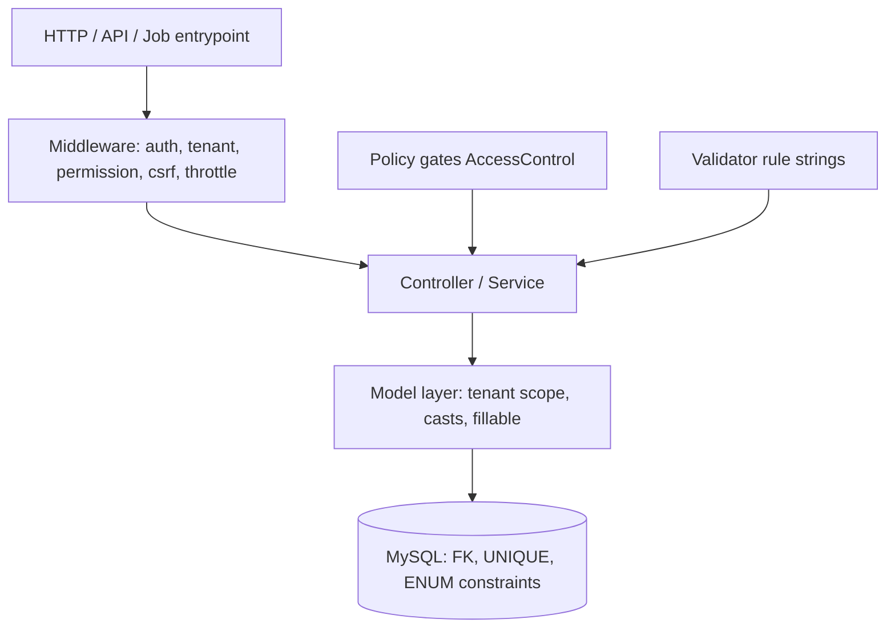
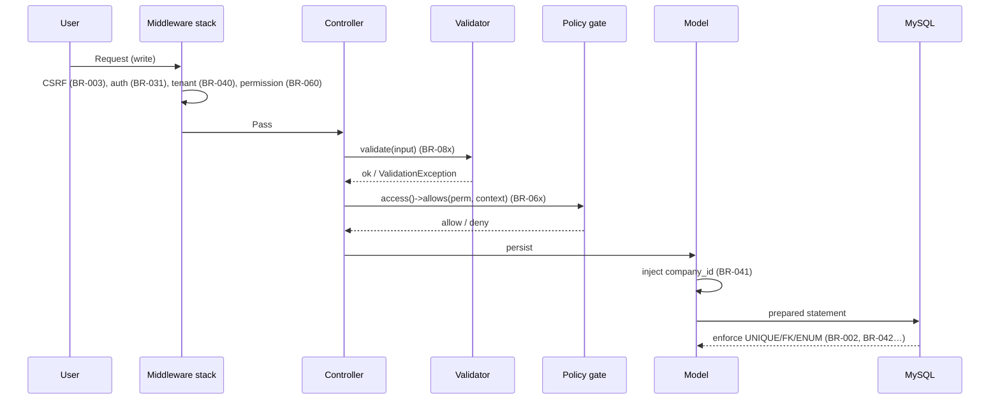

# 02 — Business Rules (قواعد العمل)

The authoritative, enumerated catalogue of every cross-cutting business rule that governs the HalaOps platform. Other documents cite these rules by their stable identifier (e.g. `BR-014`).

## Related Documents

- [07-RBAC](07-RBAC.md)
- [08-Multi-Tenant](08-Multi-Tenant.md)
- [12-Workspace-Management](12-Workspace-Management.md)
- [13-Subscription-System](13-Subscription-System.md)
- [24-Job-Lifecycle](24-Job-Lifecycle.md)
- [25-Application-Lifecycle](25-Application-Lifecycle.md)
- [01-Project-Vision](01-Project-Vision.md)
- [05-Database-Architecture](05-Database-Architecture.md)
- [16-AI-Architecture](16-AI-Architecture.md)

## Purpose (الهدف)

This document is the single, numbered source of truth for the platform's business rules (قواعد العمل). Every other specification — RBAC, tenancy, subscriptions, jobs, applications, interviews, AI, billing — references these rules instead of restating them. When a rule changes, it changes here once and propagates by reference. A business rule in this document is a binding constraint on system behavior that holds regardless of which UI, controller, API endpoint, or background job triggers it.

## Why It Exists (سبب وجوده)

A platform sold to thousands of companies cannot have its invariants scattered across controllers and views. Without a central catalogue, the same rule (for example "a user can only act inside their active tenant") gets re-implemented inconsistently, drifts, and creates security holes. Enumerating the rules with stable IDs gives us:

- A contract that code, tests, and reviewers check against (cite `BR-xxx` in a test name or PR).
- A way to detect contradictions between documents — two docs cannot both define the same rule differently.
- A migration aid: when a rule is deprecated we mark its ID rather than silently deleting behavior.

## Architecture

Rules are grouped by domain. Each rule is enforced at the **lowest reliable layer** so that no entry point can bypass it:

| Layer | Where it lives | Rules it guarantees |
|-------|----------------|---------------------|
| Database | `database/migrations/*` | Uniqueness, referential integrity, enum domains, NOT NULL |
| Model | `app/Core/Model.php` + `app/Models/*` | Tenant scoping (fail-closed), casts, hidden fields |
| Middleware | `app/Http/Middleware/*` | Authentication, active tenant, permission, CSRF, throttling |
| Policy gates | `app/Services/Rbac/AccessControl.php` | Context-aware ("own record", "in my company") rules |
| Validator | `app/Core/Validator.php` | Input shape, required/length/format, uniqueness pre-check |
| Service | `app/Services/*` | Multi-step transactional invariants (e.g. company provisioning) |

A rule is only "enforced" when at least one of these layers makes the illegal state impossible. UI hints (disabled buttons) are never the enforcement point.

## Workflow

How a request is validated against the rules, end to end:

## Business Rules

### Identity & accounts (الهوية)

- **BR-001** There is exactly **one** `users` table. No `candidates`, `hr_users`, `owners`, or `super_admins` tables exist. A person is always a single `users` row; capability is derived only from roles, permissions, and memberships.
- **BR-002** `users.email` is globally unique (case-insensitive at the application layer) and is the login identifier. Two accounts may never share an email.
- **BR-003** Every state-changing request (POST/PUT/PATCH/DELETE) must carry a valid CSRF token or it is rejected before the controller runs.
- **BR-004** Passwords are stored only as Argon2id hashes (bcrypt fallback) — never plaintext, never reversible. A hash is transparently re-hashed on next successful login if its parameters are outdated.
- **BR-005** A user has one of three statuses in `users.status`: `active`, `suspended`, `pending`. Only `active` users may authenticate. `suspended` users are denied login with a generic message; `pending` users must complete verification first.
- **BR-006** A user's `locale` is `ar` or `en`; it controls UI language and text direction (RTL for `ar`). Absent a preference, the platform default locale applies.
- **BR-007** Self-registration is allowed and may optionally create a company in the same step; the registrant then becomes that company's Owner (see BR-050).
- **BR-008** Password reset is anti-enumeration: the "forgot password" response is identical whether or not the email exists. Reset tokens are stored hashed in `password_resets`, are single-use, and expire after `auth.reset_token_ttl` (60) minutes.
- **BR-009** A successful login regenerates the session id, records `last_login_at` and `last_login_ip`, and clears any login-throttle counter for that identity.

### Tenancy & isolation (العزل بين المستأجرين)

- **BR-040** Every tenant-scoped query is automatically constrained by the active company id (`company_id`). A tenant-scoped model query with **no active tenant fails closed** (throws) — it never silently returns all rows.
- **BR-041** On insert, tenant-scoped models inject the active `company_id` automatically; application code must not set it to a different company.
- **BR-042** Cross-tenant data access is possible **only** through the explicit `withoutTenantScope()` escape hatch, which is restricted to platform/super-admin and system code and is auditable.
- **BR-043** The `companies` table is the tenant root and is global; it cannot scope to itself. All other tenant tables carry a `company_id` foreign key with an index.
- **BR-044** Uniqueness of tenant data is per-company, not global, wherever a value is naturally tenant-local — e.g. `companies` slug is global, but role slug is unique per company `(company_id, slug)`, settings key is `(company_id, key)`, and a candidate may apply once per job `(company_id, job_id, user_id)`.
- **BR-045** A user may belong to multiple companies via multiple `memberships` rows; exactly one company is "active" per request, resolved from the session `active_company_id` and validated against an `active` membership.
- **BR-046** Switching the active company requires the user to hold an `active` membership in the target company; otherwise the switch is denied.
- **BR-047** Deleting a company cascades to its tenant-owned rows (memberships, tenant roles, subscriptions, AI credentials, settings, and all recruitment data) via `ON DELETE CASCADE`; a company cannot be deleted while it is referenced as an `owner` constraint requires (RESTRICT on `companies.owner_id`).

### RBAC & authorization (الصلاحيات)

- **BR-060** Authorization is permission-based. Code and middleware reference permissions by **key** (e.g. `members.invite`); they never branch on a user "type".
- **BR-061** A user's **effective permissions** in the active tenant are the union of: (a) permissions of their global roles in `user_role`, and (b) permissions of the tenant roles attached to their active `membership`; each role is expanded up its `parent_id` inheritance chain.
- **BR-062** A user holding the global `super-admin` role implicitly has **all** permissions and bypasses tenant scoping; this is the only blanket bypass and must be logged when used cross-tenant.
- **BR-063** `roles.company_id = NULL` denotes a **global** role (assigned via `user_role`); a non-null `company_id` denotes a **tenant** role (assigned via `membership_role`). The two assignment paths never mix.
- **BR-064** A role with `is_system = 1` cannot be deleted or renamed by tenant users; its permission set may be adjusted only within platform rules. The Owner role of a company is always a system role.
- **BR-065** Role inheritance is single-parent (`parent_id`) and must be acyclic; the platform rejects any edit that would create a cycle.
- **BR-066** Permission keys are a closed catalogue (`permissions` table, seeded from `config/rbac.php`). Only permissions that are actually enforced exist — there are no unused permissions.
- **BR-067** Policy gates (`AccessControl::define`) layer context-aware rules on top of flat permissions (e.g. "edit own profile", "manage an application that belongs to my active company"). A deny from a gate overrides a granted permission.
- **BR-068** Middleware `permission:a,b` grants access if the user holds **any** of the listed permissions (any-of semantics).

### Companies & memberships (الشركات والعضويات)

- **BR-050** Any authenticated user may create a company. Creation is **atomic**: it inserts the `companies` row, the owner `membership`, the default tenant roles, assigns the Owner role, and starts a trial subscription — all in one transaction. If any step fails, none persist.
- **BR-051** The creator of a company becomes its Owner and is recorded in `companies.owner_id`. A company always has exactly one owner reference.
- **BR-052** A new company starts in status `trial`; valid `companies.status` values are `trial`, `active`, `suspended`, `canceled`.
- **BR-053** A member's status (`memberships.status`) is `active`, `invited`, or `suspended`. Only `active` members can use the tenant; `invited` members must accept first.
- **BR-054** A user cannot have two memberships in the same company — `(company_id, user_id)` is unique.
- **BR-055** Invitations record `invited_by` and `invited_at`; acceptance sets `joined_at` and flips status to `active`.
- **BR-056** Removing a member deletes their membership (and its role links) but never deletes the underlying `users` row, which may still belong to other companies.
- **BR-057** The Owner cannot be removed or demoted below ownership while they remain the sole owner; ownership must be transferred first.

### Subscriptions (الاشتراكات)

- **BR-070** Plans are **data**, not code (`plans` table). New plans are added by INSERT; no plan is hard-coded. The platform ships exactly one plan: "Standard", 50.00 SAR, monthly, 14-day trial.
- **BR-071** A subscription's status lifecycle is `trialing → active → past_due → canceled → expired`; transitions never skip backward except via explicit reactivation rules defined in [13-Subscription-System](13-Subscription-System.md).
- **BR-072** The price (`amount`) and `currency` are **snapshotted** onto the `subscriptions` row at subscribe time; later edits to the plan never retroactively change an existing subscription's price.
- **BR-073** A trial lasts `plans.trial_days` days from `starts_at`; at `trial_ends_at` the subscription either converts to `active` (on successful payment) or moves to `past_due`/`expired`.
- **BR-074** Plan feature flags and numeric limits (`plans.features`, `plans.limits`) gate functionality at runtime (e.g. `limits.max_members`). Exceeding a limit is blocked with a clear upgrade prompt; it never silently drops data.
- **BR-075** A company has at most one non-terminal subscription at a time. A `canceled`/`expired` subscription may be superseded by a new one.

### Jobs (الوظائف)

- **BR-100** A job (`jobs`) belongs to exactly one company and is tenant-scoped. Its `status` is one of `draft`, `open`, `paused`, `closed`, `archived`.
- **BR-101** Only a job in `open` status accepts new applications. Applying to a `draft`, `paused`, `closed`, or `archived` job is rejected.
- **BR-102** A job's slug is unique per company `(company_id, slug)`, enabling stable public posting URLs without colliding across tenants.
- **BR-103** Publishing a job (moving to `open`) requires the `jobs.publish` permission and sets `published_at`; closing sets `closed_at`.
- **BR-104** `employment_type` is constrained to `full_time`, `part_time`, `contract`, `intern`, `remote`. `openings` must be a positive integer.
- **BR-105** Deleting a job cascades to its applications, pipeline stages, interviews, and related records; archiving is preferred over deletion to preserve audit history.

### Applications & pipeline (الطلبات وخط الأنابيب)

- **BR-120** An application (`applications`) links one candidate `user` to one `job` within a company. A candidate may apply to a given job at most once — `(company_id, job_id, user_id)` is unique.
- **BR-121** Application `status` is one of `applied`, `in_review`, `interviewing`, `offer`, `hired`, `rejected`, `withdrawn`. `hired`, `rejected`, and `withdrawn` are terminal.
- **BR-122** An application always references a current pipeline stage (`current_stage_id`); moving stages is permission-gated (`applications.move`) and records an `application_events` row with `from_stage_id`/`to_stage_id` and the actor.
- **BR-123** A candidate (the applicant) may always view and withdraw their own application but may never change its stage, score, or decision.
- **BR-124** Rejecting an application requires `applications.reject`, sets `status = rejected` and `decided_at`, and triggers a candidate notification per [26-Notification-System](26-Notification-System.md).
- **BR-125** The applicant's identity in an application is a normal `users` row (BR-001); there is no separate candidate table. A candidate's portal capabilities come from the `candidate` role's permissions (`candidate.apply`, `candidate.profile`).
- **BR-126** Every consequential change to an application (stage move, score change, decision) is recorded immutably in `application_events` for audit.

### Interviews & evaluations (المقابلات والتقييمات)

- **BR-140** An interview (`interviews`) is tied to one application and one job within a company; its `type` is `ai`, `human`, or `panel`, and its `mode` is `video`, `phone`, `onsite`, or `ai_async`.
- **BR-141** Interview `status` is `scheduled`, `in_progress`, `completed`, `canceled`, or `no_show`. Scheduling requires `interviews.schedule`; conducting requires `interviews.conduct`.
- **BR-142** Interview participants (`interview_participants`) have a `role` of `interviewer`, `observer`, or `candidate`; a person appears at most once per interview `(interview_id, user_id)`.
- **BR-143** An evaluation/scorecard (`evaluations`) records a structured `criteria` JSON, a numeric `rating`, and a `recommendation` in `strong_yes`, `yes`, `neutral`, `no`, `strong_no`. Creating evaluations requires `evaluations.create`; managing/overriding requires `evaluations.manage`.
- **BR-144** AI evaluation output is **advisory only**. A hiring decision (hire/reject) must be taken by a human holding `evaluations.manage`; the system never auto-rejects or auto-hires based solely on an AI score.

### AI layer (الذكاء الاصطناعي)

- **BR-160** The platform stores **no** AI provider keys of its own. Each company stores its own credentials in `ai_credentials`, encrypted at rest with AES-256-GCM.
- **BR-161** Every AI call resolves the provider and key **from the current tenant's** credentials only. There is no shared/system fallback key; if the tenant has no active credential for a capability, the AI feature is unavailable for that tenant.
- **BR-162** A tenant has at most one credential row per provider — `(company_id, provider)` is unique — and may mark one as `is_default`.
- **BR-163** Adding a new AI provider is a new class implementing `AiProviderInterface` plus a registry entry; no other code changes. Supported providers include OpenAI, Anthropic, Gemini, DeepSeek, Azure OpenAI, and HeyGen (video).
- **BR-164** AI interview sessions record the `provider`, `model`, `status`, `transcript`, structured `analysis`, `score`, and `tokens_used` in `ai_interview_sessions`; failures are captured in `error` and surfaced, never swallowed.
- **BR-165** AI-generated content (questions, transcripts, analyses) is clearly attributable as AI-produced (`interview_questions.ai_generated`, AI score/feedback fields) so humans can weigh it appropriately.

### Billing & payments (الفوترة والمدفوعات)

- **BR-180** Invoices (`invoices`) are tenant-scoped, carry a globally unique `number`, and have a `status` of `draft`, `open`, `paid`, `void`, or `uncollectible`. Totals (`subtotal`, `tax`, `total`) and `currency` are stored explicitly.
- **BR-181** Payments (`payments`) reference a `gateway` and a `gateway_reference`; payment `status` is `pending`, `succeeded`, `failed`, or `refunded`. `(company_id, gateway_reference)` is indexed for reconciliation.
- **BR-182** No payment gateway is hard-coded. Gateways implement `PaymentGatewayInterface` and are resolved from a registry; Moyasar, Tap, and HyperPay are first-class for the Saudi market, with Stripe/PayPal as future options.
- **BR-183** Gateway webhooks are logged to `gateway_events` with `gateway`, `event_type`, `reference`, raw `payload`, and a `processed` flag; webhook processing is **idempotent** — the same event reference is never applied twice.
- **BR-184** A successful payment for a subscription invoice transitions the subscription toward `active` per BR-071; a failed/charged-back payment can transition it to `past_due`.
- **BR-185** Stored payment methods (`payment_methods`) keep only gateway tokens and non-sensitive metadata (`brand`, `last4`, `exp_month`, `exp_year`) — never full card numbers (PCI scope minimization).

### Audit, notifications & files (التدقيق والإشعارات والملفات)

- **BR-200** Security- and business-significant events are written to `activity_log` with the actor (`user_id`), `action`, `subject_type`/`subject_id`, `ip`, and `user_agent`. Audit rows are append-only.
- **BR-201** Notifications (`notifications`) are delivered over `in_app` and/or `email` channels honoring per-user `notification_preferences`; a user can disable a notification type per channel but security-critical notices may be non-optional.
- **BR-202** Files (`files`) are tenant-scoped, validated by mime and size, checksummed, and carry a `visibility` of `private`, `company`, or `public`; a tenant can never read another tenant's private files.

## Database Relations

These rules are backed by concrete schema constraints (full schema in [05-Database-Architecture](05-Database-Architecture.md) and [06-ERD](06-ERD.md)):

| Rule(s) | Table | Constraint enforcing it |
|---------|-------|-------------------------|
| BR-002 | `users` | `UNIQUE(email)` |
| BR-044, BR-054 | `memberships` | `UNIQUE(company_id, user_id)` |
| BR-044, BR-063 | `roles` | `UNIQUE(company_id, slug)`, `company_id` nullable FK→`companies` |
| BR-061, BR-066 | `permission_role`, `membership_role`, `user_role` | composite PKs, FK→`roles`/`permissions` |
| BR-072 | `subscriptions` | `amount`, `currency` columns (snapshot), `plan_id` FK→`plans` RESTRICT |
| BR-102, BR-103 | `jobs` | `UNIQUE(company_id, slug)`, `status` ENUM, `published_at`/`closed_at` |
| BR-120 | `applications` | `UNIQUE(company_id, job_id, user_id)` |
| BR-126 | `application_events` | FK→`applications` CASCADE, append-only |
| BR-162 | `ai_credentials` | `UNIQUE(company_id, provider)`, `credentials` encrypted TEXT |
| BR-180, BR-183 | `invoices`, `gateway_events` | `UNIQUE(invoices.number)`, `IDX(gateway, reference)` |

## Permissions

Each domain rule is gated by the catalogue permissions defined in [07-RBAC](07-RBAC.md) and tabulated in [11-Permissions-Matrix](11-Permissions-Matrix.md):

- Companies/members: `company.view/update`, `members.view/invite/update/remove`.
- Roles: `roles.view/manage` (BR-064, BR-065).
- Billing: `billing.view/manage` (BR-070, BR-180).
- AI: `ai.view/manage` (BR-160, BR-162).
- Jobs: `jobs.view/create/update/delete/publish` (BR-100–BR-105).
- Applications: `applications.view/update/move/reject/export` (BR-120–BR-126).
- Interviews: `interviews.view/schedule/conduct/cancel` (BR-140–BR-142).
- Evaluations: `evaluations.view/create/manage` (BR-143, BR-144).
- Candidate self-service: `candidate.apply`, `candidate.profile` (BR-125).
- Platform: `platform.companies.*`, `platform.users.*`, `platform.plans.manage`, `platform.diagnostics` (BR-062).

## Validation

Validation rules that back the business rules, enforced via `app/Core/Validator.php`:

- Email: `required|email|unique:users,email` on registration (BR-002); `required|email` on login.
- Password: `required|min:8|confirmed` on registration/reset (BR-004).
- Company name: `required|max:120`; slug auto-derived and checked unique global (BR-043).
- Role slug: `required|max:120|unique:roles,slug` scoped per company (BR-044).
- Plan amount: server trusts the plan row, never the client-submitted price (BR-072).
- Job: `title required|max:...`, `employment_type in:full_time,part_time,contract,intern,remote`, `openings integer|min:1` (BR-104).
- Application: server rejects a second application from the same user to the same job before insert, in addition to the DB unique constraint (BR-120).
- AI credentials: `provider in:<registry keys>`, credential payload validated by the provider class before encryption (BR-161, BR-163).

## Edge Cases

- **No active tenant on a tenant route**: middleware redirects to company selection; a tenant-scoped model accessed with no tenant throws (BR-040) — fail closed, never leak.
- **Super-admin with no active company**: allowed to operate platform-wide; tenant-scoped reads must use `withoutTenantScope()` explicitly (BR-042, BR-062).
- **Concurrent company creation** with a colliding slug: the unique index rejects the loser; the service retries with a suffixed slug inside the transaction (BR-050).
- **Race on duplicate application**: two simultaneous applies hit `UNIQUE(company_id, job_id, user_id)`; one succeeds, the other is caught and reported as "already applied" (BR-120).
- **Plan deleted while companies subscribe to it**: `plan_id` FK is RESTRICT, so deletion is blocked; deprecate via `is_active = 0` instead (BR-070).
- **Webhook replay/duplicate**: idempotency on `gateway_events.reference` prevents double-applying a payment (BR-183).
- **AI provider key revoked upstream**: the call fails; the session records `error`, the feature degrades gracefully, and the tenant is prompted to update credentials (BR-164).
- **Trial expiry at midnight**: a scheduled job evaluates `trial_ends_at`; if no payment, status moves to `past_due`/`expired` deterministically (BR-073).

## Security

- All write paths are CSRF-protected (BR-003) and permission-gated (BR-060) before any mutation.
- Tenant isolation is fail-closed at the model layer (BR-040) — the strongest defense against cross-tenant leakage.
- Secrets (AI keys, gateway tokens) are encrypted at rest with AES-256-GCM (BR-160, authenticated encryption) and never logged.
- Anti-enumeration on auth flows (BR-008) prevents account discovery.
- Audit logging (BR-200) makes privileged actions, especially super-admin cross-tenant access, traceable.
- Payment data minimization (BR-185) keeps the platform out of full PCI scope.

## Performance

- Permission resolution (BR-061) is computed once per request and cached in memory for the request lifecycle; role→permission expansion uses indexed join tables.
- Tenant scoping relies on the `company_id` index present on every tenant table, so the mandatory filter is index-backed (BR-040).
- Uniqueness checks (BR-002, BR-120, BR-162) are served by unique indexes rather than full scans.
- Audit and notification writes (BR-200, BR-201) are lightweight inserts and can be moved to the queue for hot paths.

## Testing

- **Unit**: effective-permission union and inheritance (BR-061), inheritance cycle rejection (BR-065), price snapshotting (BR-072), webhook idempotency (BR-183).
- **Feature**: registration creating a company makes the user an Owner with a trial (BR-007, BR-050, BR-052); applying twice to one job is rejected (BR-120); applying to a non-open job is rejected (BR-101).
- **Security**: a member of company A cannot read company B's rows (BR-040, BR-042); a tenant-scoped query with no tenant throws (BR-040); CSRF-less write is rejected (BR-003); non-permitted user cannot move an application stage (BR-122).
- **Regression**: deleting a plan with active subscriptions is blocked (BR-070); AI feature is disabled when the tenant has no credential (BR-161).

## Future Expansion

- New domains add a new `BR-2xx`/`BR-3xx` block here first (documentation-first), then code referencing those IDs.
- Rules that become configurable per plan migrate their threshold into `plans.limits` (data-driven) without changing the rule's intent (BR-074).
- A future public API ([29-API-Architecture](29-API-Architecture.md)) inherits every rule unchanged — same middleware, same tenant scope, same permissions — proving the rules are entry-point agnostic.
- Deprecated rules are marked `DEPRECATED` in place (never deleted) so historical citations stay resolvable.

## Open Questions

- Whether trial-to-paid conversion should allow a grace window beyond `past_due` before `expired` is a product decision tracked in [13-Subscription-System](13-Subscription-System.md).
- Exact non-optional notification types (BR-201) need a final list once the notification taxonomy in [26-Notification-System](26-Notification-System.md) is locked.
