# 03 — System Architecture

> The master architecture reference for **Nizam — the Bayan AI Operating System**: the layered structure, runtime components, flows, and cross-cutting strategies that every module must obey.

**Status:** Approved (Phase 1) | **Version:** 1.0.0 | **Last updated:** 2026-07-01 | **Owner:** Architecture (Nizam Core)

---

## 0. How to read this document

Nizam is the **execution layer** of the Bayan AI Operating System. **Bayan** (the AI Brain) already exists and is external to this project; it performs reasoning, planning, and natural-language understanding and emits structured **Intents**. Nizam receives those Intents and executes them **safely, observably, and multi-tenant**.

The canonical layer chain — used identically across every document — is:

```
User → Bayan (Brain) → Nizam (AI OS) → Agent Framework → Tool Registry → Automation Engine → n8n → External Systems
```

This document is the source of truth for *structure and flow*. Data shapes live in `21-Database-Design.md`; API contracts in `11-API-Strategy.md`; event contracts in `12-Event-Architecture.md`.

---

## 1. High Level Architecture

Nizam is a **modular monolith** (native PHP) that is *service-extractable*: every module is a DDD **bounded context** with its own domain, application, infrastructure, and interface layers, communicating with other contexts **only** through integration events or explicit contracts — never through a shared database.

### 1.1 Full layer chain (component view)

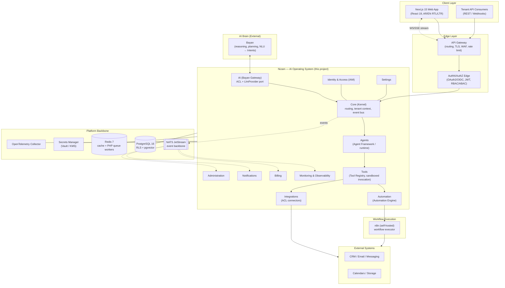

### 1.2 The 12 bounded contexts

Nizam is composed of exactly **twelve** bounded contexts. Each is a DDD context and a PHP module. Names are fixed and used verbatim everywhere.

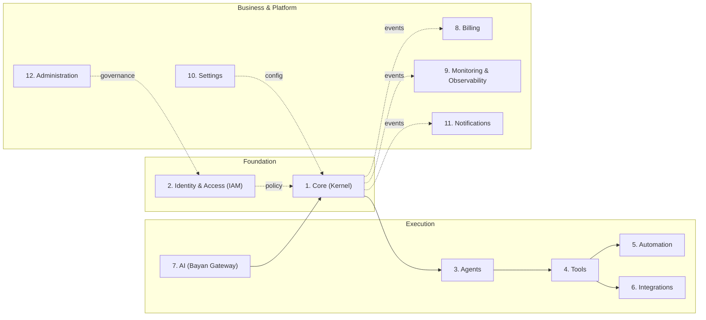

| # | Context | One-line responsibility |
|---|---------|--------------------------|
| 1 | **Core (Kernel)** | Shared kernel: base entities, value objects, event-bus abstractions, Result/error types, clock, ID generation, tenant context. No business rules. |
| 2 | **Identity & Access (IAM)** | Tenants, users, orgs, roles, permissions, sessions, RBAC/ABAC policy; owns AuthN/AuthZ. |
| 3 | **Agents** | Agent Framework: definitions, runtime/orchestration, planning-to-execution, agent runs, memory scoping, guardrails. |
| 4 | **Tools** | Tool Registry: definitions, JSON Schemas, capability metadata, versioning, permission scopes, sandboxed invocation contracts. |
| 5 | **Automation** | Automation Engine: workflow definitions, triggers, the n8n adapter, run history, retries, idempotency, compensation. |
| 6 | **Integrations** | External connectors (ACLs): CRM, email, messaging, calendars, storage; credential binding, connection health. |
| 7 | **AI (Bayan Gateway)** | ACL to Bayan + `LlmProvider` port; intent intake, context assembly, response shaping. No reasoning of its own. |
| 8 | **Billing** | Plans, subscriptions, metering/usage, quotas, invoices. |
| 9 | **Monitoring & Observability** | Health, metrics, traces, audit read models, SLO tracking, alerting (read-side). |
| 10 | **Settings** | Tenant + user configuration, feature flags, Basic/Advanced mode, localization. |
| 11 | **Notifications** | Multi-channel delivery (in-app, email, push, webhook), templates, preferences, digests. |
| 12 | **Administration** | Platform back-office: tenant lifecycle, global flags, audited impersonation, announcements, plugin/marketplace approval. |

---

## 2. Low Level Architecture

Every module follows **Clean Architecture** with the **Dependency Rule**: dependencies point **inward only**. The domain knows nothing about frameworks, databases, or transports; the outer layers depend on it through **ports** (interfaces) implemented by **adapters** (Hexagonal / Ports & Adapters).

### 2.1 Layering inside a module

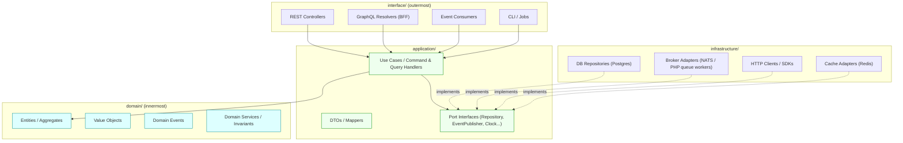

**The dependency rule in one sentence:** `interface → application → domain`, and `infrastructure → (implements ports declared in) application/domain`. Nothing inner ever imports anything outer.

### 2.2 Ports & Adapters

| Port (declared in application/domain) | Example adapters (in infrastructure) |
|---------------------------------------|--------------------------------------|
| `Repository<TAggregate>` | Postgres repository (with RLS-aware session) |
| `EventPublisher` | Outbox writer → NATS JetStream publisher |
| `CachePort` | Redis cache-aside adapter |
| `LlmProvider` | Anthropic Claude adapter (default) — replaceable |
| `SecretsProvider` | Vault / cloud KMS adapter |
| `Clock` / `IdGenerator` | System clock, UUID v7 generator |
| `AutomationExecutor` | n8n adapter |

Because adapters implement ports, any adapter is replaceable without touching the domain — the core guarantee behind "everything modular, replaceable."

---

## 3. System Components

| Component | Runtime nature | Responsibility |
|-----------|----------------|----------------|
| **API Gateway** | Stateless edge | TLS termination, routing, WAF, global rate limiting, request correlation ID injection. |
| **AuthN/AuthZ Edge** | Stateless | Validates OAuth2/OIDC JWTs, resolves tenant, enforces RBAC/ABAC before requests reach a context. |
| **Bayan Gateway (AI context)** | Stateless service | ACL to Bayan; validates the Intent contract, assembles tenant context, shapes responses. Hosts the `LlmProvider` port for Nizam's own LLM calls. |
| **Core Kernel** | In-process shared library + router | Routes Intents to Agents, provides tenant context, event-bus abstractions, Result/error types, clock, UUID v7 generation. |
| **Agent Framework (Agents)** | Stateful orchestration (event-sourced runs) | Selects/executes plans, resolves each step to a Tool, enforces guardrails, records agent runs. |
| **Tool Registry (Tools)** | Stateless + registry store | Holds versioned tool definitions & JSON Schemas; performs permission-checked, sandboxed invocation. |
| **Automation Engine (Automation)** | Stateful (event-sourced runs) | Owns and drives **n8n**; manages triggers, retries, idempotency, compensation. |
| **n8n** | External executor (self-hosted) | Executes workflow graphs against external systems. Driven only via the Automation Engine adapter. |
| **Integrations connectors** | Stateless ACL adapters | Translate external system APIs into Nizam domain terms; manage credentials & connection health. |
| **PostgreSQL 16** | Stateful store | Primary DB with RLS multi-tenancy + pgvector for embeddings. |
| **Redis 7** | Stateful store | Cache-aside store and Redis-backed PHP queue-worker job backend. |
| **NATS JetStream** | Event backbone | Durable, at-least-once integration-event delivery between contexts. |
| **Secrets Manager** | External | Vault-style secret storage, abstracted behind `SecretsProvider`. |
| **OpenTelemetry stack** | Sidecar/collector | Traces/metrics/logs → Prometheus, Grafana, Loki, Tempo. |

---

## 4. Execution Flow

The canonical **9-step execution flow** (reused across sequence and data-flow diagrams):

1. **User** speaks/acts → **Bayan** (brain) interprets → emits a structured **Intent**.
2. **Bayan Gateway** validates the Intent contract and attaches **tenant context**.
3. **Nizam Kernel** routes the Intent to the **Agent Framework**, which dispatches it to the responsible **Department Manager Agent** (HR, Marketing, Sales, Finance, Support, Developer, or CEO).
4. The **Manager** decomposes the intent into tasks and dispatches **Worker Agents**; each worker resolves its steps to a **Tool** from the **Tool Registry** (permission-checked, tenant-scoped) and picks the best automation via the **Automation Selector**.
5. A Tool call may be a **direct adapter call** OR **delegate to the Automation Engine** (selected automation).
6. The **Automation Engine** executes via **n8n**, which talks to **External Systems**; workers collect **evidence** of what was done.
7. Every step **emits domain/integration events** (outbox → NATS) → **Monitoring**, **Billing** (metering), **Notifications**, **Audit** react asynchronously.
8. Workers return evidence to the **Manager**, which runs the **Manager Audit** (Approve / Reject / Retry / Request More Information / Run Another Worker). Only on **Approve** does the **result flow back up**: Manager → Agent Framework → Gateway → Bayan → User.
9. **Failures** trigger retries (idempotency keys), Manager-driven re-dispatch, and **Saga compensation**; everything is observable. The full hierarchy and audit state machine are specified in [23-Agent-Hierarchy.md](./23-Agent-Hierarchy.md).

---

## 5. Data Flow

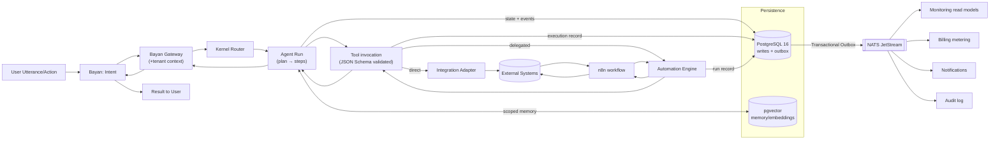

**Key data-flow rules:** writes and their outbox events share **one DB transaction**; read models (Monitoring, Billing usage) are built **only** from events; embeddings/memory live in `pgvector`, scoped by `tenant_id`.

---

## 6. Sequence Flow

```mermaid
sequenceDiagram
    autonumber
    actor User
    participant Bayan
    participant Nizam as Nizam Kernel
    participant Agent as Agent Framework
    participant Tool as Tool Registry
    participant Auto as Automation Engine
    participant n8n
    participant Ext as External System
    participant Bus as NATS JetStream
    participant Mon as Monitoring
    participant Bill as Billing
    participant Notif as Notifications

    User->>Bayan: Utterance / action
    Bayan->>Nizam: Intent (via Bayan Gateway, +tenant ctx)
    Nizam->>Agent: Route Intent
    Agent->>Agent: Select plan, start Agent Run (event-sourced)
    Agent->>Tool: Resolve step → invoke Tool (permission-checked)
    alt Direct adapter
        Tool->>Ext: Adapter call
    else Delegated automation
        Tool->>Auto: Delegate execution
        Auto->>n8n: Trigger workflow
        n8n->>Ext: Execute against external system
        Ext-->>n8n: Response
        n8n-->>Auto: Run result
        Auto-->>Tool: Result
    end
    Ext-->>Tool: Result
    Tool-->>Agent: Tool result

    par Async event fan-out
        Agent-->>Bus: agent.run.step.completed.v1
        Bus-->>Mon: metrics / traces
        Bus-->>Bill: metered usage (runs, tool calls, tokens)
        Bus-->>Notif: user-facing notification
    end

    Agent-->>Nizam: Aggregated result
    Nizam-->>Bayan: Response payload
    Bayan-->>User: Natural-language answer

    Note over Agent,Auto: On failure → retry (idempotency key)<br/>then Saga compensation; all steps observable
```

---

## 7. Communication Flow

Nizam uses **synchronous** transport only for direct request/response user actions and **asynchronous** events for everything else.

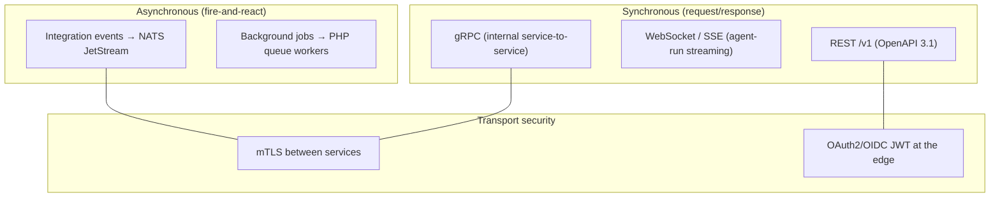

| Channel | Sync/Async | Use |
|---------|-----------|-----|
| REST `/v1` | Sync | External tenant API, primary contract. |
| WebSocket / SSE | Sync (streaming) | Realtime agent-run progress to the Next.js UI. |
| gRPC | Sync | Internal service-to-service once contexts are extracted; secured by **mTLS**. |
| NATS JetStream | Async | Cross-context integration events. |
| Redis-backed PHP queue workers | Async | Intra-system background jobs (retries, digests, metering rollups). |

**Rule:** cross-context communication is **async events by default**; synchronous cross-context calls are avoided to prevent coupling and cascading failure.

---

## 8. Module Responsibilities

| Module | Owns (writes) | Consumes (reads/events) | Publishes |
|--------|---------------|-------------------------|-----------|
| Core (Kernel) | Nothing business; kernel primitives | — | Infrastructure signals only |
| IAM | Tenants, users, roles, sessions, policy | — | `iam.user.*`, `iam.tenant.*` |
| Agents | Agent definitions, agent runs (event-sourced) | Intents, tool results | `agent.run.*`, `agent.step.*` |
| Tools | Tool definitions, executions (event-sourced) | Agent step requests | `tool.execution.*` |
| Automation | Workflow defs, automation runs (event-sourced) | Tool delegations | `automation.run.*` |
| Integrations | Connectors, credentials, health | Tool/automation calls | `integration.connection.*` |
| AI (Bayan Gateway) | Intent envelopes, response shapes | Bayan I/O | `ai.intent.received.v1` |
| Billing | Plans, subscriptions, usage, invoices | All metered events | `billing.quota.*`, `billing.invoice.*` |
| Monitoring | Health, metrics, audit read models | All events | Alerts |
| Settings | Tenant/user config, feature flags | — | `settings.changed.*` |
| Notifications | Delivery records, templates, prefs | User-facing events | `notification.dispatched.*` |
| Administration | Platform governance, plugin approvals | Cross-context read models | `admin.*` |

---

## 9. Dependency Rules

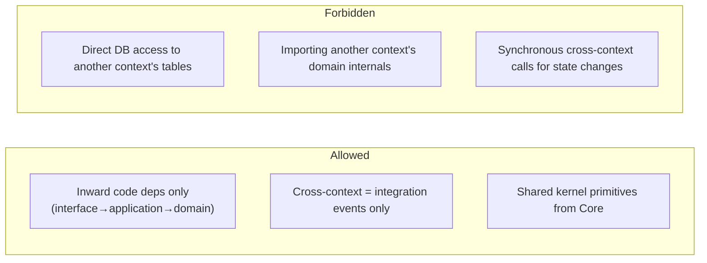

1. **Inward-only** dependencies within a module (Clean Architecture).
2. **No shared database ownership**: a context reads/writes only its own tables; cross-context state travels as **integration events**.
3. **Cross-context contact = events**, or a published, versioned contract — never internal imports.
4. **Core** may be depended on by all; **Core depends on none**.
5. Each context enforces its own **invariants**; no context reaches into another's aggregates.

---

## 10. Integration Strategy

External systems are reached through **Anti-Corruption Layer (ACL) adapters** in the Integrations context, so external models never leak into Nizam's domain.

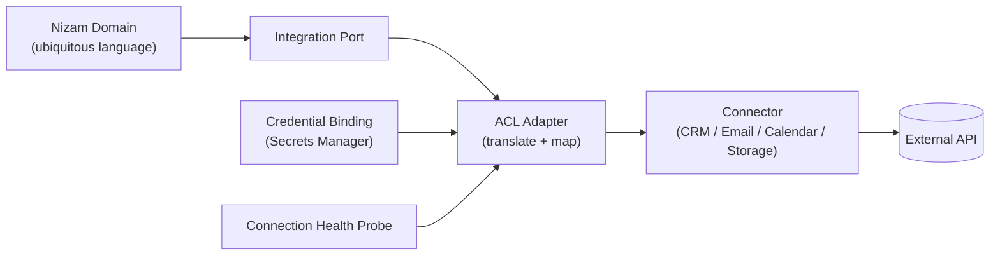

- **ACL adapters** map external payloads to/from domain value objects.
- **Connectors** are versioned plugins (see §11), each with a manifest and credential binding.
- **Health probes** monitor connection state and publish `integration.connection.degraded.v1`.
- Heavy or multi-step external flows are delegated to the **Automation Engine → n8n** rather than hand-coded.

---

## 11. Plugin Strategy

**Tools**, **Integrations (connectors)**, and **Agent skills** are **plugins** registered against stable contracts. Each is **versioned (SemVer)**, **sandboxed**, and described by a **manifest + JSON Schema**.

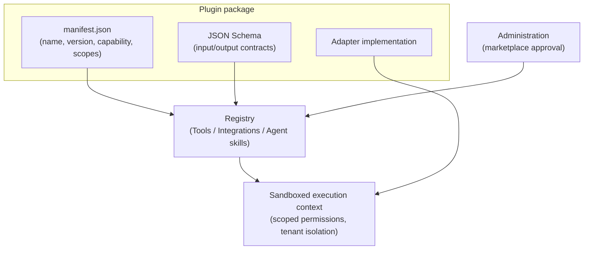

- **Manifest** declares identity, version, required permission scopes, and capability metadata.
- **JSON Schema** defines validated input/output; invalid calls are rejected at the boundary.
- **Sandboxing** enforces least-privilege: a plugin sees only its granted scopes and the current `tenant_id`.
- **Hot-loadable & versioned**: multiple versions can coexist; consumers pin a version.
- **Governance**: the Administration context approves marketplace/plugin publication.

---

## 12. Scaling Strategy

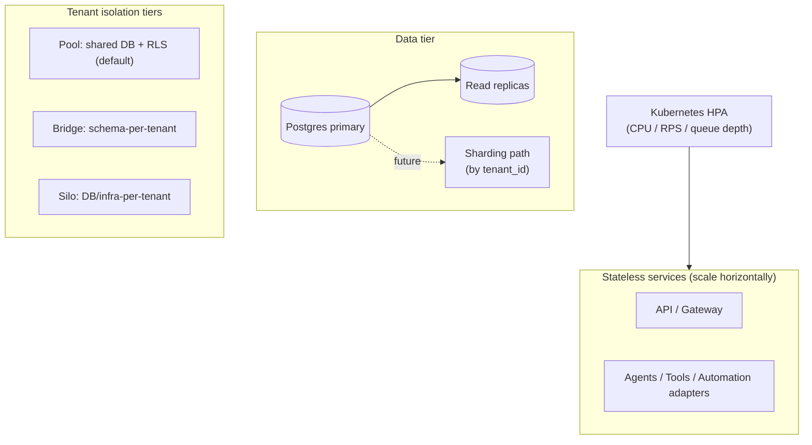

- **Stateless services** scale out via **Kubernetes HPA** on CPU, request rate, and **queue depth**.
- **Read replicas** absorb query/read-model load; writes stay on the primary.
- **Tenant tiers** (progressive isolation): **Pool** (shared DB + RLS, default) → **Bridge** (schema-per-tenant) → **Silo** (dedicated DB/infra) for large or regulated tenants.
- **Sharding path**: partition by `tenant_id` when a single primary is saturated; UUID v7 keys keep inserts time-ordered per shard.
- Event and job workers scale independently from request-serving pods.

---

## 13. Caching Strategy

Redis 7 is the cache layer, using **cache-aside** with **per-tenant namespacing** and **event-driven invalidation**.

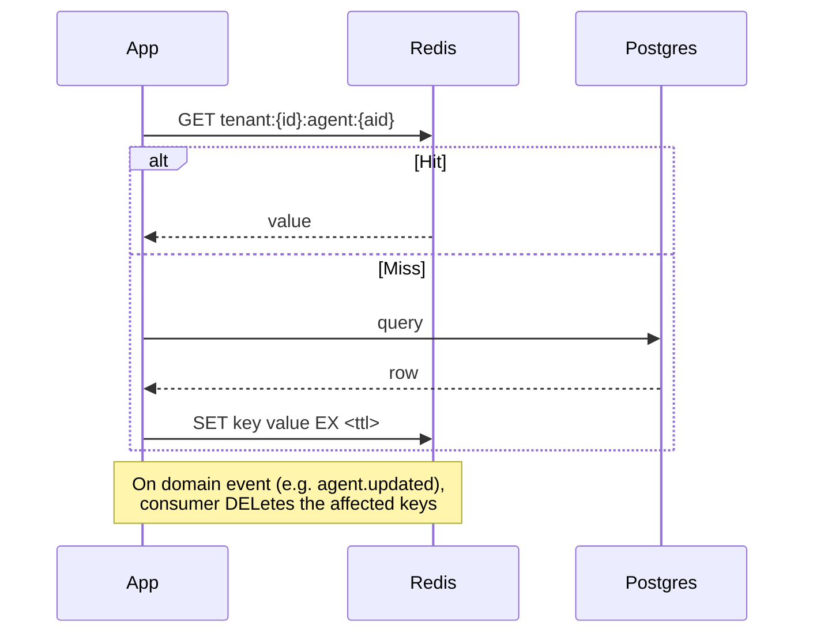

- **Key namespacing:** every key is prefixed with `tenant:{tenant_id}:` to guarantee isolation.
- **TTLs:** short for volatile reads (30–120s), longer for stable reference data (hours), tuned per read model.
- **Invalidation:** driven by domain/integration events (`*.updated`, `*.deleted`) — not by guesswork.
- **What is cached:** hot read models, permission decisions, tool/agent definitions, rate-limit counters. Never cache secrets or PII beyond policy.

---

## 14. Queue Strategy

Two async substrates with distinct jobs: **Redis-backed PHP queue workers** for intra-system jobs, **NATS JetStream** for integration events. The **Transactional Outbox** bridges DB writes to the event backbone.

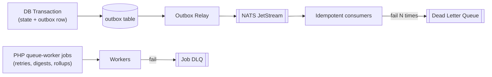

- **Redis-backed PHP queue workers** (on Redis): background jobs — retries with backoff, notification digests, usage rollups.
- **NATS JetStream**: durable integration events, **at-least-once** delivery, durable consumers.
- **Transactional Outbox**: events are written in the same transaction as state, then relayed — no lost or phantom events.
- **Idempotency**: every consumer/job carries an idempotency key; duplicates are safely ignored.
- **DLQ**: poison messages route to a dead-letter stream for inspection and replay.

Full detail lives in `12-Event-Architecture.md`.

---

## 15. Logging Strategy

- **Structured JSON logs via Monolog (PSR-3)**, one event per line.
- Every log carries **correlation ID** and **trace/span IDs** (propagated from the gateway) plus **`tenant_id`** tagging.
- **PII redaction** at the logger boundary: sensitive fields (emails, tokens, credentials) are masked before serialization.
- Log levels are consistent (`error/warn/info/debug`); `debug` is off in production by default.
- Logs ship to **Loki**; traces to **Tempo**; both are correlated by trace ID for one-click drill-down.

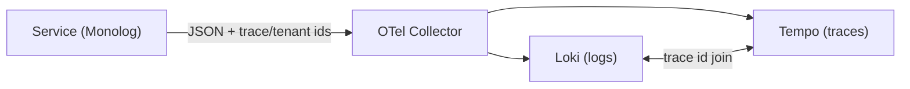

---

## 16. Monitoring Strategy

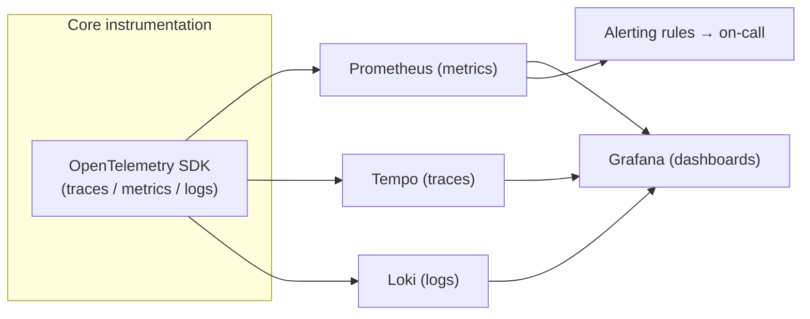

- **OpenTelemetry** is the single instrumentation standard; instrumentation lives in **Core**, read-side dashboards/alerts in **Monitoring & Observability**.
- **Metrics** → Prometheus; **traces** → Tempo; **logs** → Loki; visualized in **Grafana**.
- **SLOs** are defined per critical flow (e.g., agent-run latency, tool-execution success rate, event-delivery lag) with **error budgets**.
- **Alerting** fires on SLO burn, DLQ growth, quota breaches, and connection degradation.

---

## 17. Error Handling Strategy

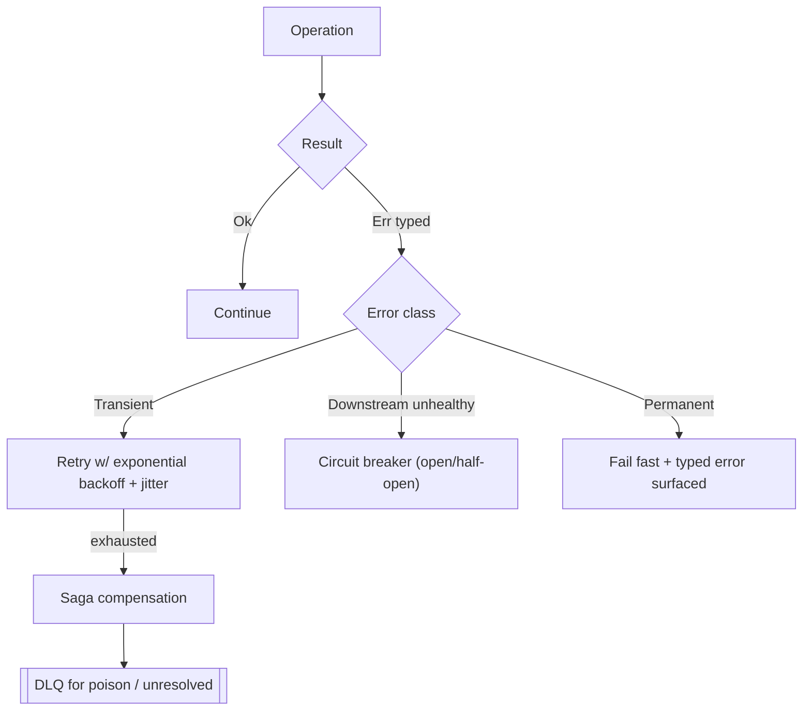

- **Typed errors** + the **Result pattern** (`Result<T, E>`) instead of throwing across boundaries; errors are explicit values.
- **Retries** use exponential backoff with jitter, gated by **idempotency keys**.
- **Circuit breakers** protect against failing downstreams (external systems, n8n).
- **Sagas / process managers** coordinate multi-step cross-context flows and run **compensating actions** on failure.
- **DLQ** captures poison messages for inspection and replay.
- Every failure emits an event → observable in Monitoring.

---

## 18. Versioning Strategy

- **SemVer** for modules and tool/agent/connector manifests.
- **REST**: URL-versioned **`/v1`**; breaking changes → new major path; non-breaking additive changes are backward compatible.
- **Events**: schema versioned in the subject (`nizam.<context>.<aggregate>.<event>.vN`), governed by **AsyncAPI 2.6** and a schema registry.
- **Database**: **expand/contract** migrations — add new columns/tables (expand), migrate, then remove old ones (contract) so deploys are zero-downtime.
- Consumers pin versions; multiple versions coexist during transition windows.

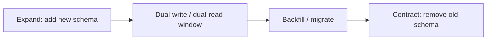

---

## Related Documents

- `00-Vision.md` — product vision and positioning of Nizam within HalaOps.
- `11-API-Strategy.md` — REST/gRPC/GraphQL/Webhook/streaming contracts and edge concerns.
- `12-Event-Architecture.md` — event taxonomy, outbox, JetStream topology, sagas, event sourcing.
- `21-Database-Design.md` — data model, RLS, ERD, audit and event-sourcing tables.
- `22-UIUX-Guidelines.md` — Next.js UI, bilingual AR/EN, Basic/Advanced modes.
- `audit/Architecture-Audit-Report.md`, `audit/Missing-Items-Report.md`, `audit/Risks-Report.md` — review artifacts.

## Change Log

| Version | Date | Author | Change |
|---------|------|--------|--------|
| 1.0.0 | 2026-07-01 | Architecture (Nizam Core) | Initial approved Phase 1 master architecture. |
