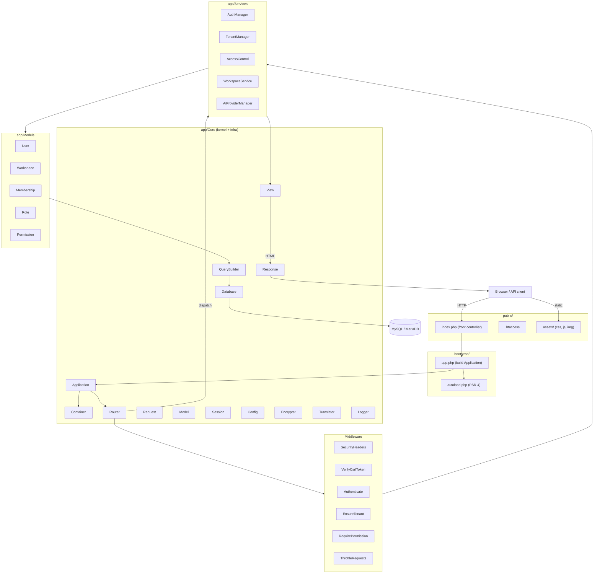
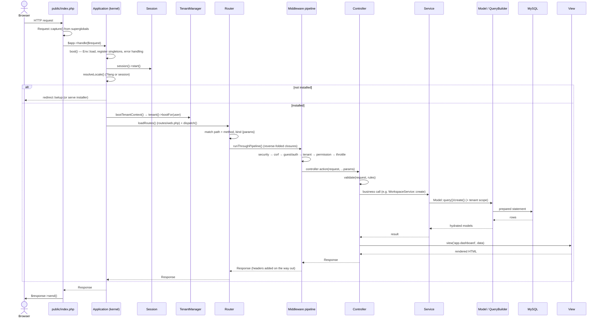

# 03 — System Architecture (معمارية النظام)

High-level architecture of HalaOps: a framework-free, multi-tenant PHP modular monolith with a front-controller request lifecycle, a small service container, strict row-level tenancy, and a per-tenant AI layer.

## Related Documents

- [04 — Folder Structure](04-Folder-Structure.md)
- [05 — Database Architecture](05-Database-Architecture.md)
- [29 — API Architecture](29-API-Architecture.md)
- [30 — Frontend Architecture](30-Frontend-Architecture.md)
- [31 — Backend Architecture](31-Backend-Architecture.md)
- [07 — RBAC](07-RBAC.md)
- [08 — Multi-Tenant](08-Multi-Tenant.md)
- [16 — AI Architecture](16-AI-Architecture.md)
- [34 — Security](34-Security.md)
- [36 — Scalability](36-Scalability.md)

---

## Purpose (الهدف)

This document describes the **whole-system architecture** of HalaOps: how an HTTP request enters the application, flows through the kernel, router, middleware pipeline, controllers, services, and models, and is rendered back as HTML or JSON. It is the map that every other architecture document (`04`, `29`, `30`, `31`) hangs off. It defines the macro-shape — a **modular monolith** — and the seams along which the system is allowed to grow.

It is deliberately concrete: every component named here corresponds to a real class on disk (e.g. `App\Core\Application`, `App\Core\Router`, `App\Core\Container`), and every flow described matches the actual code in `public/index.php`, `bootstrap/app.php`, and `routes/web.php`.

## Why It Exists (سبب وجوده)

HalaOps is sold to **thousands of companies**, many of whom deploy it on **cheap shared hosting** with no SSH, no Composer, no Node, and no terminal. That single constraint drives the entire architecture:

- **No framework / zero runtime Composer dependencies** — the app must run from an uploaded folder. So we built a tiny, purpose-fit core (`app/Core`) instead of pulling in Laravel/Symfony.
- **Modular monolith, not microservices** — one deployable unit keeps operations trivial for the buyer (one database, one document root) while the internal module boundaries (auth, tenancy, RBAC, billing, AI, recruitment) keep the code maintainable and give us a clean extraction path later.
- **A single front controller** gives one auditable entry point where security headers, CSRF, sessions, locale, install-gating, and tenant boot are applied uniformly — there is no way to "route around" the kernel.
- **A service container with singletons** avoids global state and `new` sprawl while staying readable; it is the spine that lets multi-tenancy and RBAC be wired once and consulted everywhere.

The rationale is captured at the top of `app/Core/Application.php`: the kernel is *deliberately tolerant of the "not yet installed" state* so the browser installer can run on a fresh upload with no `.env`.

## Architecture

HalaOps is layered. Each layer depends only on the layer beneath it; nothing reaches "up".

```
            ┌─────────────────────────────────────────────────────────────┐
            │  Presentation: resources/views (View engine) · public/assets │
            └─────────────────────────────────────────────────────────────┘
                                      ▲
            ┌─────────────────────────────────────────────────────────────┐
            │  HTTP layer: Request · Router · Middleware pipeline · Response│
            └─────────────────────────────────────────────────────────────┘
                                      ▲
            ┌─────────────────────────────────────────────────────────────┐
            │  Controllers (app/Controllers) — thin, HTTP-only             │
            └─────────────────────────────────────────────────────────────┘
                                      ▲
            ┌─────────────────────────────────────────────────────────────┐
            │  Services (app/Services) — business logic, orchestration      │
            │  Auth · Tenancy · Rbac · Install · AI                         │
            └─────────────────────────────────────────────────────────────┘
                                      ▲
            ┌─────────────────────────────────────────────────────────────┐
            │  Domain models (app/Models) — active record + tenant scope    │
            └─────────────────────────────────────────────────────────────┘
                                      ▲
            ┌─────────────────────────────────────────────────────────────┐
            │  Core infrastructure (app/Core): Application · Container ·     │
            │  Config · Database · QueryBuilder · Session · View · etc.     │
            └─────────────────────────────────────────────────────────────┘
                                      ▲
            ┌─────────────────────────────────────────────────────────────┐
            │  Platform: PHP 8.2 runtime · MySQL/MariaDB · filesystem       │
            └─────────────────────────────────────────────────────────────┘
```

### Component diagram



### Component responsibilities

| Component | File | Responsibility |
|---|---|---|
| **Front controller** | `public/index.php` | Single entry point. Captures the request, hands it to the kernel, sends the response. |
| **Bootstrap** | `bootstrap/app.php`, `bootstrap/autoload.php` | Registers the PSR-4 autoloader, loads helpers, builds the `Application` rooted at the project directory. |
| **Application (kernel)** | `app/Core/Application.php` | Boots env+config, registers container singletons, runs the request lifecycle, gates on install state, resolves locale, boots tenant context, performs central error handling. |
| **Container** | `app/Core/Container.php` | Minimal DI container with `bind`/`singleton`/`instance`/`make`. Holds the shared services. |
| **Router** | `app/Core/Router.php` + `Route.php` | Route registration with groups (prefix/middleware/name/namespace), named routes, `{param}` matching, the middleware pipeline, and `alias:arg` middleware resolution. |
| **Request / Response** | `app/Core/Request.php`, `Response.php` | Immutable-ish value objects over PHP superglobals; method spoofing, JSON detection, header extraction; buffered response with headers/cookies. |
| **Middleware** | `app/Core/Middleware/*`, `app/Http/Middleware/*` | Cross-cutting concerns applied in a pipeline (security headers, CSRF, auth, tenancy, permissions, throttling). |
| **Controllers** | `app/Controllers/**` | Thin HTTP adapters: validate input, call a service, return a `Response`. |
| **Services** | `app/Services/**` | All business logic and orchestration (e.g. `WorkspaceService::create()` provisions a tenant atomically). |
| **Models** | `app/Models/**` | Active-record data access via `app/Core/Model`, with automatic tenant scoping. |
| **View** | `app/Core/View.php` + `resources/views/**` | Plain-PHP templates with layout inheritance and sections; no compile step. |

### Where multi-tenancy, RBAC, and AI slot in

- **Multi-tenancy** is enforced at the **model layer**, not sprinkled through controllers. `App\Services\Tenancy\TenantManager` holds the active workspace id for the request; `App\Core\Model::query()` consults it and injects `WHERE workspace_id = :active`, **failing closed** if a tenant-scoped model is queried with no active tenant. The kernel calls `tenant()->bootFor($user)` in `bootTenantContext()` right after authentication. See [08 — Multi-Tenant](08-Multi-Tenant.md).
- **RBAC** is enforced at the **middleware + service layer**. `App\Http\Middleware\RequirePermission` (`permission:...`) calls `access()->allows()`, and `App\Services\Rbac\AccessControl` computes the user's effective permission set (global roles ∪ tenant roles, expanded up the `parent_id` chain). See [07 — RBAC](07-RBAC.md).
- **AI** is a **service module** (`app/Services/AI`) that resolves a provider strictly from the **current tenant's** `tenant_ai_keys` — the platform holds no keys. See [16 — AI Architecture](16-AI-Architecture.md).

## Workflow

### Request lifecycle (end to end)

The full path from socket to HTML is implemented across `public/index.php` → `bootstrap/app.php` → `Application::handle()` → `Router::dispatch()`.



### Boot sequence (cold request)

1. `bootstrap/autoload.php` registers the PSR-4 autoloader and `require`s `app/Support/helpers.php`.
2. `bootstrap/app.php` constructs `new Application(dirname(__DIR__))`.
3. `Application::boot()` (idempotent via the `$booted` flag): registers the error/exception handlers, loads `.env` via `Env::load()`, registers the path bindings (`path.base`, `path.storage`, …) and the **core singletons** (`config`, `log`, `encrypter`, `session`, `translator`, `view`, `db`, `router`, `tenant`, `auth`, `access`, `mailer`), then sets the default timezone and `mb_internal_encoding('UTF-8')`.
4. The container shares view globals (`appName`) so templates can render before any controller runs.

### Middleware pipeline construction

`Router::runThroughPipeline()` builds an onion: it `array_reduce`s the **reversed** middleware list into nested closures around the controller call, so middleware run **outer-to-inner on the way in** and **inner-to-outer on the way out**. The `alias:arg` form (`permission:dashboard.view`, `throttle:10,60`) is split in `resolveMiddleware()` and the argument is passed to the middleware constructor.

## Business Rules

1. **One entry point.** Every dynamic request is served by `public/index.php`. The root/`public` `.htaccess` rewrites all non-file requests to it. No controller is reachable except through the kernel and router.
2. **Install gate is absolute.** Until `storage/framework/installed` **and** `.env` both exist (`Application::isInstalled()`), all traffic except `/setup*` (legacy `/install*` redirects to it) and `/assets*` is redirected to the installer.
3. **Services own business logic; controllers do not.** A controller may validate, call one service, and return a response. Anything more (multi-step writes, cross-model orchestration) lives in a service. Example: `WorkspaceController::store()` delegates the whole provisioning transaction to `WorkspaceService::create()`.
4. **Tenant scope is established once, centrally**, in `bootTenantContext()`, and enforced by the model layer for the rest of the request.
5. **Singletons are shared per request.** `Container` caches shared bindings; each request gets a fresh process (PHP-FPM), so there is no cross-request state leakage.
6. **Responses are objects, not echoes.** Controllers/handlers return a `Response`; only `Response::send()` (called once, from `index.php`) writes to the client. This lets middleware mutate the response (e.g. `SecurityHeaders` adds headers on the way out).
7. **Errors never leak in production.** `APP_DEBUG=false` ⇒ exceptions render the generic error view; `true` ⇒ a debug page. JSON requests always get a JSON error envelope.

## Database Relations

The architecture itself is schema-agnostic, but the kernel touches a few tables directly during boot and dispatch (full schema in [05 — Database Architecture](05-Database-Architecture.md) §11 of the canonical context):

- **`migrations`** — the kernel's `isInstalled()` does not read it, but the installer uses `Migrator` to populate it; the app assumes its presence post-install.
- **`users`** — `auth()->user()` loads the authenticated `User` (global, not tenant-scoped).
- **`workspaces`** — `TenantManager::workspace()` resolves the active `Workspace` (the tenant root; global table).
- **`memberships`** — `TenantManager::bootFor()` and `userBelongsTo()` validate that the user has an **active** membership in the chosen workspace.
- **`roles`, `permissions`, `role_permissions`, `membership_roles`, `user_roles`** — read by `AccessControl` to compute effective permissions per request.

Every tenant-bound table carries `workspace_id BIGINT UNSIGNED` (FK → `workspaces`, indexed). The model layer adds the `WHERE workspace_id = ?` filter to all of them automatically.

## Permissions

The architecture layer is where RBAC is *plugged in*, not where individual permissions are defined. Relevant gates at this level:

- `dashboard.view` — gates the one tenant-scoped route shipped today (`GET /dashboard`).
- The `permission:<key>` middleware can guard any route; it implements **any-of** semantics (`permission:members.view,members.invite`).
- **Super Admin** short-circuits all checks in `AccessControl::allows()` (`$user->isSuperAdmin()` ⇒ `true`) and may operate with **no active tenant**.

See [07 — RBAC](07-RBAC.md) and [11 — Permissions Matrix](11-Permissions-Matrix.md) for the full catalogue.

## Validation

At the architectural seam, validation is the controller's first responsibility and is centralised:

- `Controller::validate()` delegates to `App\Core\Validator::make(...)->validate()`, returning only the validated subset.
- A failed validation throws `App\Core\Exceptions\ValidationException`, caught centrally in `Application::handle()` → for HTML it flashes `errors` + old input and redirects `back()`; for JSON it returns `422` with `{message, errors}`.
- `Request` provides the typed accessors validation builds on: `input()`, `all()`, `only()`, `filled()`, `boolean()`, `file()`, `bearerToken()`.

## Edge Cases

| Case | Handling |
|---|---|
| App not installed, request to a normal page | Redirect to `/setup` (`handleNotInstalled()`). |
| App not installed, request to `/setup` (or legacy `/install`) or `/assets` | Routes loaded and dispatched normally so the installer can run. |
| Missing `.env` / `APP_KEY` during install | `encrypter` singleton uses a throwaway key so the installer can boot; real key written at finalize. |
| Route path matches but method does not | `Router::dispatch()` throws `HttpException(405)`. |
| No route matches | `HttpException(404)`. |
| Middleware alias unknown / not a `MiddlewareInterface` | `RuntimeException` from `resolveMiddleware()` (developer error, surfaced in debug). |
| Tenant-scoped model queried with no active tenant | `Model::query()` throws a loud `RuntimeException` — **fail closed**, never a silent unscoped query. |
| Authenticated user with no workspace hits a tenant route | `EnsureTenant` redirects to `workspaces/select` (or `409` for JSON). |
| Uncaught `Throwable` | Logged via `Logger`, rendered as `errors.500` (or debug page); fatal-of-fatal falls back to a plain 500 string. |
| Headers already sent | `Response::send()` guards with `headers_sent()` and still echoes the body. |

## Security

- **Single choke point.** All requests pass `SecurityHeaders` and `VerifyCsrfToken` (applied to the whole web group in `routes/web.php`), so hardening cannot be bypassed.
- **CSRF** on every non-`GET/HEAD/OPTIONS` request via constant-time `hash_equals` against the session token (`419` on mismatch).
- **Security headers** on every response: `X-Content-Type-Options`, `X-Frame-Options: SAMEORIGIN`, `Referrer-Policy`, `Permissions-Policy`, and HSTS over HTTPS.
- **Prepared statements only** through `Database`/`QueryBuilder`; identifiers backtick-quoted, values always bound.
- **Fail-closed tenancy** and **RBAC** are structural, not optional.
- **Secrets encrypted** with AES-256-GCM (`Encrypter`); passwords hashed with Argon2id (`Hash`).
- **Throttling** on auth endpoints (`throttle:10,60`, `throttle:5,60`) via `ThrottleRequests`.
- Detailed threat model in [34 — Security](34-Security.md).

## Performance

- **PHP-FPM + OPcache**: each request is short-lived; OPcache keeps the compiled core hot. No bootstrap I/O beyond `.env` and config files.
- **Lazy services**: container singletons are built on first `make()`; the DB connection is opened lazily in `Database::pdo()` only when a query runs (the installer's requirements step never touches MySQL).
- **Per-request permission cache** in `AccessControl` keyed by `userId:workspaceId` avoids recomputing the effective permission set within a request.
- **Compiled CSS** (`public/assets/css/app.css`) and `defer`-loaded JS — no server-side build, no per-request asset compilation.
- **Indexed tenant column** on every tenant table makes the injected `WHERE workspace_id` filter cheap.
- See [35 — Performance](35-Performance.md).

## Testing

- **Unit (core):** `Container` binding/resolution and singleton caching; `Router` group merging, `{param}` matching, `alias:arg` resolution, 404/405 selection; `Request::method()` spoofing and `wantsJson()`; `Response` header/cookie buffering.
- **Unit (pipeline):** middleware order — assert `SecurityHeaders` runs last on the way out (headers present), CSRF rejects bad tokens, `RequirePermission` any-of semantics.
- **Feature (HTTP):** install-gating redirect; full authenticated dashboard render; locale switch via `?lang=ar` flips `dir="rtl"`.
- **Security:** tenant fail-closed (querying a scoped model with no tenant throws); CSRF `419`; unauthorized route → `403`; unauthenticated → redirect/`401`.
- **Integration:** `WorkspaceService::create()` provisions workspace + membership + roles + trial subscription atomically and rolls back on failure.
- See [39 — Testing Strategy](39-Testing-Strategy.md).

## Future Expansion

- **API surface** ([29](29-API-Architecture.md)): a sibling `routes/api.php` loaded under an `/api/v1` group reusing the same kernel, middleware, and tenant/RBAC machinery — only the auth middleware (token vs session) and the response envelope differ.
- **Queue/cron worker** (`queued_jobs`, `failed_jobs`): the same container/services invoked from a protected cron URL to offload AI and email work without blocking requests.
- **Module extraction**: because each domain lives behind a service interface, a heavy module (e.g. the AI interview engine) can later move to its own process/service while the monolith calls it over HTTP — the seam already exists.
- **Stateless scale-out**: sessions can move from the file store to DB/Redis (`Session` is an injected singleton), enabling horizontal scaling behind a load balancer. See [36 — Scalability](36-Scalability.md).
- **Provider registry growth**: new AI/payment providers are added by dropping a class + registry entry, with no kernel changes.

## Open Questions

None at this time. The shared-database multi-tenancy trade-offs and the eventual sharding/DB-per-tenant path are tracked in [08 — Multi-Tenant](08-Multi-Tenant.md) and [36 — Scalability](36-Scalability.md).
