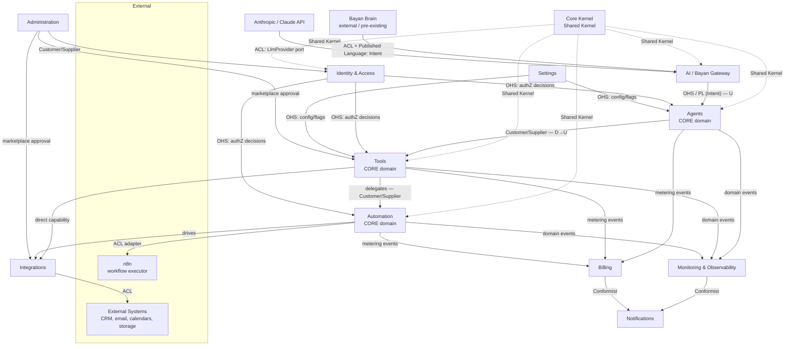
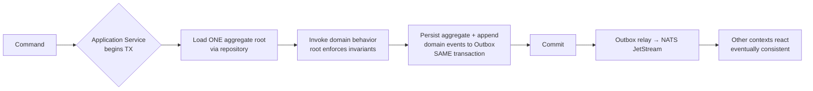
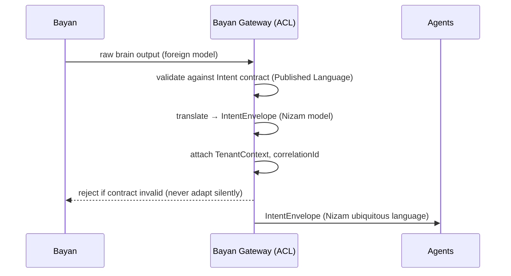

# Domain-Driven Design (DDD)

> How Nizam — the Bayan AI Operating System — is modeled: its ubiquitous language, strategic bounded-context map, and the tactical building blocks (aggregates, entities, value objects, events, ports) that every module must follow.

**Status:** Approved (Phase 1) | **Version:** 1.0.0 | **Last updated:** 2026-07-01 | **Owner:** Architecture (Nizam Core)

---

## 1. Purpose & scope

This document defines the **Domain-Driven Design** discipline for **Nizam** — the execution layer of the Bayan AI Operating System. It is normative: it fixes *how* we model the domain so that every NestJS module, every aggregate, and every event contract is designed consistently.

DDD is chosen deliberately. Nizam is not a CRUD application; it is a **safe, observable, multi-tenant execution substrate** that turns *intents* produced by the **Bayan** brain into real-world effects across agents, tools, automations and external systems. That complexity is *behavioral* and *policy-driven*, which is exactly the class of problem DDD is built for.

The layer chain that anchors the whole model:

```
User → Bayan (Brain) → Nizam (AI OS) → Agent Framework → Tool Registry → Automation Engine → n8n → External Systems
```

Bayan is **external and pre-existing**; Nizam does not model Bayan's internals. Nizam models everything from the **Intent** contract inward.

---

## 2. Ubiquitous language — the principle

The **ubiquitous language** is a single, shared, precise vocabulary used identically by domain experts, product, and code. It is the backbone of DDD.

Principles we enforce:

1. **One term, one meaning, one context.** A word means exactly one thing inside a bounded context. If the same word means something different elsewhere (e.g., "Run" in Agents vs. Automation), it is a *different concept* and must be named or namespaced distinctly.
2. **Code mirrors language.** Class names, aggregate names, event names, and method names are the ubiquitous language rendered in code — no translation layer between how we speak and how we type. Naming follows the canon: `PascalCase` aggregates, `camelCase` members, `snake_case` DB columns.
3. **The glossary is authoritative.** [`17-Glossary.md`](./17-Glossary.md) is the canonical dictionary. Any new term enters the glossary before it enters a diagram or a module.
4. **Bilingual by design.** Product names and user-facing terms carry AR/EN definitions (**Bayan** = بيان, "a clear statement/exposition"; **Nizam** = نظام, "system/order"). Internal code identifiers remain English.
5. **Refine, don't accumulate.** When a term becomes ambiguous, we split it. Ambiguity is a modeling smell, not a documentation problem.

---

## 3. Domain vision statement

> **For** organizations that want AI to *do work*, not just talk — **Nizam** is an AI Operating System that receives high-level *intents* from the Bayan brain and executes them **safely, observably, and per-tenant** by orchestrating agents, tools, and automations over real external systems. **Unlike** raw agent frameworks or workflow tools, Nizam provides a hardened execution substrate: strict multi-tenant isolation (RLS), permissioned tools, event-sourced audit of every action, saga-based compensation, and metered billing — so non-technical users can trust that "make it happen" actually happens, correctly and accountably.

**Core domain (highest value, hardest, our competitive edge):**
- **Agents** (Agent Framework) — plan-to-execution orchestration of intents.
- **Tools** (Tool Registry) — permissioned, versioned, sandboxed capability catalog.
- **Automation** (Automation Engine) — durable, idempotent, compensable execution over n8n.

**Supporting domains** (necessary, distinctive but not the edge): Integrations, AI/Bayan Gateway, Identity & Access, Billing.

**Generic domains** (buy/standardize where possible): Notifications, Monitoring & Observability, Settings, Administration.

---

## 4. Strategic design — bounded contexts

A **bounded context** is an explicit boundary within which a model and its ubiquitous language are consistent. Nizam has **exactly 12** bounded contexts, each realized as a NestJS module. The definitive per-context contract lives in [`05-Bounded-Contexts.md`](./05-Bounded-Contexts.md); this section fixes the *strategic relationships* between them.

| # | Bounded Context | Type | Role in the layer chain |
|---|-----------------|------|-------------------------|
| 1 | Core (Kernel) | Generic / Shared Kernel | Cross-cutting primitives; no business rules |
| 2 | Identity & Access (IAM) | Supporting | Tenants, users, RBAC/ABAC, sessions |
| 3 | Agents | **Core** | Agent Framework: plan → execute intents |
| 4 | Tools | **Core** | Tool Registry: permissioned capabilities |
| 5 | Automation | **Core** | Automation Engine: durable execution over n8n |
| 6 | Integrations | Supporting | External-system ACL connectors |
| 7 | AI (Bayan Gateway) | Supporting | ACL to Bayan + `LlmProvider` port |
| 8 | Billing | Supporting | Plans, metering, quotas, invoices |
| 9 | Monitoring & Observability | Generic | Health, metrics, traces, SLO read models |
| 10 | Settings | Generic | Tenant/user config, feature flags, mode |
| 11 | Notifications | Generic | Multi-channel delivery |
| 12 | Administration | Generic | Back-office, tenant lifecycle, marketplace approval |

### 4.1 DDD integration patterns (definitions used below)

- **Shared Kernel** — a small model shared by multiple contexts by explicit agreement; changes require consent of all sharers. *Core* is our Shared Kernel.
- **Anti-Corruption Layer (ACL)** — a translation boundary that protects our model from an external/foreign model. Used by *AI/Bayan Gateway* (toward Bayan) and *Integrations* (toward external systems).
- **Customer/Supplier** — upstream (supplier) provides; downstream (customer) has negotiating power over the interface. Planning direction of dependency.
- **Conformist** — downstream simply conforms to the upstream model with no translation (accepted coupling).
- **Open Host Service (OHS)** — a context exposes a well-defined, stable protocol/API for many consumers.
- **Published Language (PL)** — a shared, versioned interchange format (here: the **Intent** contract, plus AsyncAPI event schemas and OpenAPI DTOs).

### 4.2 Context map



### 4.3 Relationship catalogue (normative)

| Upstream (supplier) | Downstream (customer) | Integration pattern | Interchange |
|--------------------|----------------------|--------------------|-------------|
| Bayan (external) | AI/Bayan Gateway | **Anti-Corruption Layer** + Published Language | Intent contract |
| Anthropic/Claude | AI/Bayan Gateway | **Anti-Corruption Layer** (`LlmProvider` port) | Prompt/response DTO |
| External systems | Integrations | **Anti-Corruption Layer** per connector | Connector-specific |
| n8n | Automation | **Anti-Corruption Layer** (n8n adapter) | Workflow API |
| AI/Bayan Gateway | Agents | **Open Host Service** + **Published Language** | Validated Intent |
| Agents | Tools | **Customer/Supplier** | Tool invocation contract |
| Tools | Automation | **Customer/Supplier** | Automation run request |
| IAM | Agents, Tools, Automation, Admin | **Open Host Service** | AuthZ decision API |
| Settings | Agents, Tools, others | **Open Host Service** | Config/flag reads |
| Core | IAM, Agents, Tools, Automation, Gateway | **Shared Kernel** | Base types, event bus |
| Monitoring, Billing, Notifications | (consume from all) | **Conformist** (event consumers) | Integration events |
| Administration | IAM, Tools, Integrations | **Customer/Supplier** | Lifecycle/approval APIs |

**Rule:** No context reaches into another context's tables or in-memory model. Cross-context communication is **only** via (a) Open Host Service APIs, (b) integration events on NATS JetStream, or (c) the Shared Kernel primitives. Everything else is a boundary violation.

---

## 5. Tactical design — building blocks

Every module is layered per Clean Architecture (`domain/` → `application/` → `infrastructure/` → `interface/`) with the **Dependency Rule** pointing inward. The tactical patterns below live in specific layers.

### 5.1 The patterns, defined and placed

| Pattern | Definition | Layer |
|---------|-----------|-------|
| **Entity** | Object with a stable identity (`id`, UUID v7) and a lifecycle; equality by identity, not attributes. | `domain/` |
| **Value Object (VO)** | Immutable, identity-less concept defined only by its attributes (e.g., `Money`, `TenantId`, `JsonSchemaRef`, `IntentType`); self-validating. | `domain/` |
| **Aggregate & Aggregate Root** | A cluster of entities + VOs treated as one consistency unit. External references target the **root** only; the root guards all invariants. | `domain/` |
| **Domain Event** | An immutable record that *something happened* in the domain (past tense: `AgentRunCompleted`). Emitted by aggregates. | `domain/` |
| **Repository (port)** | An interface (port) that abstracts persistence of an aggregate; collection-like. Implementations live outside the domain. | port in `domain/`, adapter in `infrastructure/` |
| **Domain Service** | Stateless domain logic that doesn't belong to a single aggregate (e.g., `PlanResolver`, `PermissionEvaluator`). | `domain/` |
| **Application Service** | Use-case orchestrator: opens transaction, loads aggregates via repositories, invokes domain behavior, publishes events. Holds no business rules. | `application/` |
| **Factory** | Encapsulates complex creation of aggregates/VOs, guaranteeing a valid initial state. | `domain/` (or `application/` for infra-dependent assembly) |
| **Specification** | An encapsulated, composable predicate expressing a business rule (selection/validation), reusable across query and validation. | `domain/` |

### 5.2 Aggregate design rules (normative)

1. **One aggregate = one transaction.** A single command mutates exactly one aggregate instance and commits atomically. No multi-aggregate writes in one transaction.
2. **Reference other aggregates by identity only** (store the `id`, never the object graph).
3. **Cross-aggregate / cross-context consistency is eventual**, achieved via domain events → **Transactional Outbox** → NATS JetStream integration events. See §7.
4. **Aggregates are small.** Prefer more, smaller aggregates over one large one; large aggregates cause contention and violate rule 1.
5. **Invariants are enforced inside the root**, never by callers.
6. **Optimistic concurrency** via a `version` column where concurrent updates are expected.

### 5.3 Concrete aggregates per context

| Context | Aggregate root(s) | Notable entities / VOs | Key invariant example |
|---------|-------------------|------------------------|-----------------------|
| **Core (Kernel)** | *(no business aggregates)* — provides `AggregateRoot`, `Entity`, `ValueObject` base types, `DomainEvent`, `TenantContext`, `Clock`, `IdGenerator (UUID v7)`, `Result/Error` | VOs: `TenantId`, `UserId`, `Money`, `CorrelationId` | Every tenant-scoped operation carries a non-null `TenantId` |
| **Identity & Access** | `Tenant`, `User`, `Role` | Entities: `Session`, `Permission`, `OrgUnit`; VOs: `Email`, `PasswordHash`, `PolicyStatement` (ABAC) | A `User` belongs to exactly one `Tenant`; a `Role` grants only permissions defined in its tenant |
| **Agents** | `AgentDefinition`, `AgentRun` | `AgentDefinition` entities: `SkillBinding`, `Guardrail`; `AgentRun` entities: `PlanStep`, `RunMemoryScope`; VOs: `PlanId`, `RunStatus`, `IntentRef` | An `AgentRun` cannot transition to `Completed` while any `PlanStep` is `Pending` |
| **Tools** | `ToolDefinition`, `ToolExecution` | `ToolDefinition` entities: `ToolVersion`, `PermissionScope`; VOs: `JsonSchema`, `CapabilityTag`, `SemVer`; `ToolExecution` VOs: `IdempotencyKey`, `ExecutionStatus` | A `ToolExecution` must reference a `published` `ToolVersion` and pass input JSON-Schema validation before running |
| **Automation** | `WorkflowDefinition`, `AutomationRun` | `WorkflowDefinition` entities: `Trigger`, `StepBinding`; `AutomationRun` entities: `RunStep`, `CompensationStep`; VOs: `IdempotencyKey`, `RetryPolicy`, `RunStatus` | An `AutomationRun` with a failed step must have either a scheduled retry or a queued compensation before it is `Failed` |
| **Integrations** | `Connector`, `Connection` | `Connector` entities: `ConnectorVersion`, `AuthScheme`; `Connection` VOs: `CredentialRef` (vault handle, never the secret), `HealthStatus` | A `Connection` never stores a raw secret — only a `CredentialRef` to the secrets manager |
| **AI (Bayan Gateway)** | `IntentEnvelope`, `LlmInvocation` | `IntentEnvelope` VOs: `IntentType`, `IntentPayload`, `TenantContext`; `LlmInvocation` VOs: `PromptSpec`, `TokenUsage`, `ModelId` | An `IntentEnvelope` is rejected if it fails Published-Language contract validation; no Bayan internal type leaks past the ACL |
| **Billing** | `Subscription`, `UsageRecord`, `Invoice` | `Subscription` entities: `PlanBinding`, `Quota`; VOs: `Money`, `MeterType`, `BillingPeriod` | Recorded usage cannot exceed a hard quota without a `QuotaExceeded` event; metering is append-only |
| **Monitoring & Observability** | `SloDefinition`, `AlertRule` (read-side models: `RunReadModel`, `AuditView`) | VOs: `Slo`, `ErrorBudget`, `Threshold`, `TraceId` | An `AlertRule` fires only when its `Threshold` breach persists beyond its evaluation window |
| **Settings** | `TenantSettings`, `UserSettings` | Entities: `FeatureFlag`; VOs: `LocalePref`, `AppMode` (Basic/Advanced) | A tenant-disabled feature flag cannot be enabled at user level |
| **Notifications** | `NotificationTemplate`, `NotificationDelivery` | `Delivery` entities: `ChannelAttempt`; VOs: `Channel`, `DeliveryStatus`, `Recipient` | A `NotificationDelivery` respects the recipient's channel preferences and quiet hours |
| **Administration** | `TenantLifecycle`, `MarketplaceSubmission` | Entities: `Announcement`, `ImpersonationSession`; VOs: `ApprovalStatus`, `GlobalFlag` | Every `ImpersonationSession` is time-boxed and produces an immutable audit event |

### 5.4 Domain events (naming & shape)

- **Past tense, context-qualified:** `agents.AgentRunCompleted`, `tools.ToolExecutionFailed`, `automation.AutomationRunCompensated`.
- **Immutable payload** of VOs + identities only (never whole aggregates).
- Carry envelope metadata: `eventId (UUID v7)`, `occurredAt`, `tenantId`, `aggregateId`, `aggregateVersion`, `correlationId`, `causationId`, `schemaVersion`.
- **Domain events** are internal to a context; **integration events** are the externally-published (AsyncAPI) subset. Domain events are translated to integration events at the module boundary (Published Language).

### 5.5 Repositories, factories, specifications, services

- **Repositories** are *ports* declared in `domain/` (`AgentRunRepository`), implemented as adapters in `infrastructure/` (Postgres + RLS). One repository per aggregate root.
- **Factories** guarantee valid construction: e.g., `AgentRun.start(intentRef, plan)` yields a valid run in `Planning` state and raises `AgentRunStarted`.
- **Specifications** encode reusable rules: `PublishedToolVersionSpec`, `WithinQuotaSpec`, `ActiveTenantSpec` — usable both to filter queries and to validate commands.
- **Domain services** hold cross-aggregate domain logic without state: `PlanResolver` (Agents), `PermissionEvaluator` (IAM/RBAC+ABAC), `RetryPolicyEvaluator` (Automation).
- **Application services** are the only components that begin transactions, and they enforce **one-aggregate-per-transaction**.

---

## 6. Invariants & consistency boundaries



- **Strong consistency** exists only *inside* an aggregate boundary.
- **Eventual consistency** governs *everything between* aggregates and contexts, mediated by the Outbox → broker.
- The **Outbox** and the aggregate write share **one transaction**, guaranteeing "state change ⇔ event emitted" atomicity (no lost/ghost events).
- **Sagas / Process Managers** coordinate multi-context flows (e.g., Intent → Agent → Tool → Automation → Integration) and drive **compensation** on failure. A saga owns *no* business invariants of its own; it orchestrates aggregates and reacts to their events. Idempotency keys make every step safe to retry.

---

## 7. Anti-Corruption Layer detail

The ACL is where Nizam's clean model meets messy foreign models. Two ACLs are mandated by the canon.

### 7.1 Bayan ACL (AI/Bayan Gateway)

Bayan is external and evolving. Nizam must **never** couple to Bayan's internal representation. The Gateway is a strict ACL + Published Language boundary.



Responsibilities of the Bayan ACL:
- **Translate** Bayan output into the internal `IntentEnvelope` — no Bayan type crosses the boundary.
- **Validate** against the versioned **Intent contract** (Published Language). Reject non-conforming input; never coerce silently.
- **Enrich** with `TenantContext`, correlation/causation IDs, and authorization scope.
- **Isolate versioning:** Bayan version changes are absorbed here; downstream contexts are unaffected.
- The `LlmProvider` port (for when Nizam itself calls Claude, e.g., tool-argument synthesis) is a second ACL inside this context, keeping model-vendor specifics replaceable.

### 7.2 External-systems ACL (Integrations & Automation→n8n)

Each **Connector** in Integrations is an ACL that maps a foreign external-system model (CRM, email, calendar, storage) into Nizam's `Connection`/capability model. Secrets are held only as `CredentialRef` handles to the secrets manager. The **Automation Engine's n8n adapter** is likewise an ACL: Nizam speaks its own `WorkflowDefinition`/`AutomationRun` language and translates to/from n8n's API, so n8n remains a replaceable executor behind a port.

**Golden rule:** foreign concepts stop at the ACL. Inside Nizam, only Nizam's ubiquitous language exists.

---

## Related Documents

- [`00-Vision.md`](./00-Vision.md) — product vision & positioning
- [`05-Bounded-Contexts.md`](./05-Bounded-Contexts.md) — the definitive per-context contract
- [`17-Glossary.md`](./17-Glossary.md) — ubiquitous language dictionary
- [`21-Database-Design.md`](./21-Database-Design.md) — persistence design (RLS, event sourcing, ERD)
- [`22-UIUX-Guidelines.md`](./22-UIUX-Guidelines.md) — Basic/Advanced mode, wizards
- [`19-Assumptions.md`](./19-Assumptions.md) — recorded gaps & assumptions

## Change Log

| Version | Date | Author | Change |
|---------|------|--------|--------|
| 1.0.0 | 2026-07-01 | Architecture (Nizam Core) | Initial approved DDD strategy and tactical model for Phase 1. |
