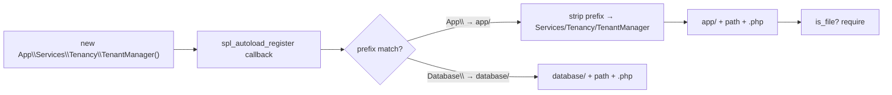

# 04 — Folder Structure (هيكل المجلدات)

An exhaustive tour of every directory and key file in the HalaOps codebase, the naming conventions, where new code belongs, and how the zero-dependency PSR-4 autoloader maps namespaces to files.

## Related Documents

- [03 — System Architecture](03-System-Architecture.md)
- [31 — Backend Architecture](31-Backend-Architecture.md)
- [41 — Coding Standards](41-Coding-Standards.md)
- [05 — Database Architecture](05-Database-Architecture.md)
- [30 — Frontend Architecture](30-Frontend-Architecture.md)

---

## Purpose (الهدف)

This document is the authoritative reference for **where everything lives** in HalaOps and **where new things should go**. It maps the directory tree on disk to the architectural layers in [03 — System Architecture](03-System-Architecture.md), explains the responsibility of each folder and the most important files inside it, states the naming conventions every contributor must follow, and documents the custom PSR-4 autoloader that ties the namespaces to the filesystem.

## Why It Exists (سبب وجوده)

A framework gives you a folder layout for free (and an army of online tutorials explaining it). HalaOps has **no framework**, so the structure is ours to define and ours to keep disciplined. Documenting it explicitly:

- prevents drift — without a documented convention, "where does this class go?" gets answered five different ways;
- makes the **layering enforceable** — the folder a class sits in tells you what it may depend on (a controller in `app/Controllers` must not contain SQL; that belongs to a model in `app/Models`);
- supports the **upload-only deployment model** — the autoloader and structure must work with nothing but files copied to a server, no `composer install`, so the mapping has to be simple and explicit (`bootstrap/autoload.php`).

## Architecture

### Top-level tree

```
crm/                          ← project root (base path)
├── app/                      ← all PHP application code (namespace App\)
│   ├── Core/                 ← the framework-free kernel + infrastructure
│   ├── Http/                 ← HTTP-layer glue (route middleware)
│   ├── Controllers/          ← thin HTTP controllers
│   ├── Models/               ← active-record domain models
│   ├── Services/             ← business logic / orchestration
│   └── Support/              ← global helpers + small utilities
├── bootstrap/                ← autoloader + application factory
├── config/                   ← plain-PHP config arrays
├── database/                 ← migrations, seeders, migration engine (namespace Database\)
├── public/                   ← web root: front controller + compiled assets
├── resources/                ← views, source CSS, language files
├── routes/                   ← route definitions
├── storage/                  ← writable runtime data (logs, cache, sessions, framework flags)
└── docs/                     ← this documentation (single source of truth)
```

### Namespace → directory mapping

Two PSR-4 prefixes are registered in `bootstrap/autoload.php`:

| Namespace prefix | Base directory |
|---|---|
| `App\` | `app/` |
| `Database\` | `database/` |

So `App\Core\Router` → `app/Core/Router.php`, `App\Services\Tenancy\TenantManager` → `app/Services/Tenancy/TenantManager.php`, `Database\Migrator` → `database/Migrator.php`. There is **no `vendor/` directory** and no Composer autoloader.



### `app/Core/` — the kernel and infrastructure

Everything framework-like lives here. These classes have **no knowledge of the business domain**; they are reusable plumbing.

| File | Role |
|---|---|
| `Application.php` | The kernel: boots config/env, registers container singletons, runs the request lifecycle, gates install state, central error handling. |
| `Container.php` | Minimal DI container (`bind`/`singleton`/`instance`/`make`/`has`). |
| `Config.php` | Loads and dot-accesses `config/*.php`. |
| `Env.php` | Reads `.env` into the environment. |
| `Router.php` / `Route.php` | Route registration, groups, named routes, `{param}` matching, middleware pipeline. |
| `Request.php` / `Response.php` | HTTP value objects. |
| `Session.php` | Hardened file-based sessions, flash, old-input, CSRF token. |
| `Database.php` | Single lazy PDO connection, prepared-statement helpers, nested transactions via savepoints. |
| `QueryBuilder.php` | Fluent, fully-parameterised SQL builder; the single read/write choke point. |
| `Model.php` | Active-record base class; **automatic tenant scoping** lives here. |
| `View.php` | Plain-PHP template engine (`extends`/`section`/`yield`/`include`). |
| `Validator.php` | Rule-string validation; throws `ValidationException`. |
| `Hash.php` | Argon2id hashing with bcrypt fallback and needs-rehash. |
| `Encrypter.php` | AES-256-GCM authenticated encryption. |
| `Mailer.php` | Mail dispatch (logs to `storage/logs` by default). |
| `Logger.php` | Leveled file logging. |
| `Translator.php` | AR/EN translation + RTL detection. |
| `Controller.php` | Base controller with `view()`, `json()`, `redirect()`, `validate()`, flash helpers. |
| `Exceptions/` | `HttpException`, `ValidationException`. |
| `Middleware/` | Framework-level middleware: `MiddlewareInterface`, `SecurityHeaders`, `VerifyCsrfToken`. |

### `app/Http/Middleware/` — application middleware

HTTP middleware that knows about the **application's** concerns (auth, tenancy, RBAC) rather than generic HTTP. Kept separate from `app/Core/Middleware` so the line between "framework" and "app" stays visible.

- `Authenticate.php` — require a logged-in user (`auth` alias).
- `RedirectIfAuthenticated.php` — keep guests-only pages guest-only (`guest` alias).
- `EnsureTenant.php` — require an active company context (`tenant` alias).
- `RequirePermission.php` — RBAC gate, `permission:key1,key2` (any-of).
- `ThrottleRequests.php` — fixed-window rate limiter, `throttle:max,seconds`.

All are registered as aliases in `config/middleware.php` and referenced by name in `routes/web.php`.

### `app/Controllers/` — thin HTTP controllers

Grouped by area, namespaced to match:

```
app/Controllers/
├── Auth/      LoginController, RegisterController, PasswordController
├── App/       HomeController, DashboardController, CompanyController, ProfileController
└── Setup/     InstallController
```

Controllers extend `App\Core\Controller`, validate input, call **one** service, and return a `Response`. They contain no SQL and no multi-step business logic.

### `app/Models/` — domain models

Active-record classes extending `App\Core\Model`, one per table:
`User`, `Company`, `Membership`, `Role`, `Permission`, `Plan`, `Subscription`, `AiCredential`, `Setting`, `OnboardingProgress`, `ActivityLog`.

Each declares its `$table`, `$fillable`, `$hidden`, `$casts`, and — critically — `$tenantScoped` (true for tenant-bound tables like `memberships`, false for global tables like `users`/`companies`). Model-specific query helpers (e.g. `User::companies()`, `Company::uniqueSlug()`) live here.

### `app/Services/` — business logic

Where the real work happens. Organised by domain:

```
app/Services/
├── Auth/      AuthManager
├── Tenancy/   TenantManager, CompanyService
├── Rbac/      AccessControl, RbacManager
├── Install/   InstallManager
└── AI/        AiProviderInterface, AiProviderManager, Providers/
```

A service is the right home for anything that spans multiple models, runs inside a transaction, or encodes a business rule (e.g. `CompanyService::create()` provisions a whole tenant atomically). New domain modules (Jobs, Applications, Interviews, Billing) add a subfolder here.

### `app/Support/` — helpers and utilities

- `helpers.php` — the global function layer (`app()`, `config()`, `env()`, `view()`, `redirect()`, `back()`, `url()`, `asset()`, `route_to()`, `e()`, `old()`, `csrf_field()`, `method_field()`, `auth()`, `tenant()`, `access()`, `can()`, `__()`, `encrypt_value()`, `decrypt_value()`, `abort()`, …). `require`d by the autoloader so it is always available.
- `RateLimiter.php` — file-cache fixed-window counter backing `ThrottleRequests`.

### `bootstrap/`

- `autoload.php` — the custom PSR-4 autoloader (detailed below) and the `require` of `helpers.php`.
- `app.php` — constructs and returns the `Application` instance rooted at the project directory.

### `config/`

Plain-PHP files returning arrays, read through `Config`:

| File | Contents |
|---|---|
| `app.php` | name, env, debug, url, key, timezone, locale, `supported_locales`, `asset_version`, currency. |
| `database.php` | default connection + MySQL connection params. |
| `session.php` | cookie name, lifetime, secure flag. |
| `auth.php` | login throttle, lockout, `tenant_key` session key. |
| `rbac.php` | **data-driven** role catalogue + permission groups (the source for `RbacManager::provisionCompanyRoles()`). |
| `mail.php` | from-address/from-name and transport. |
| `middleware.php` | route middleware alias → class map. |

### `database/`

```
database/
├── Migration.php     base class for a migration
├── Migrator.php      runs/rolls back migrations, tracks the migrations table
├── migrations/       NNNN_description.php (ordered, 0001–0015 today)
└── seeders/          permission/role/plan seeders
```

Namespace `Database\`. Migrations do **not** run inside transactions (MySQL auto-commits on DDL) — documented in [05 — Database Architecture](05-Database-Architecture.md).

### `public/` — the web root

The only directory a web server should expose.

```
public/
├── index.php        front controller (the single entry point)
├── .htaccess        rewrites non-file requests to index.php; denies dotfiles
└── assets/
    ├── css/app.css  compiled Tailwind output (committed; no server build)
    ├── js/app.js    vanilla progressive-enhancement script
    └── img/         favicon and static images
```

### `resources/` — non-PHP-code application resources

```
resources/
├── views/
│   ├── layouts/     app.php (authenticated shell), guest.php (auth/installer/public)
│   ├── auth/        login, register, forgot-password, reset-password
│   ├── app/         dashboard, dashboard-platform, profile, companies/{create,select}
│   ├── setup/       install.php (installer wizard)
│   ├── errors/      403, 404, 419, 500, generic
│   ├── partials/    alerts.php (flash messages)
│   └── welcome.php  public landing
├── css/app.css      Tailwind source (compiled offline → public/assets/css/app.css)
└── lang/
    ├── en/          English strings
    └── ar/          Arabic strings
```

Views use dot notation that the `View` engine maps to files: `app.companies.create` → `resources/views/app/companies/create.php`. See [30 — Frontend Architecture](30-Frontend-Architecture.md).

### `routes/`

- `web.php` — all browser routes, wrapped in a `['security','csrf']` group with nested `guest`/`auth`/`tenant` groups. A planned `api.php` (see [29](29-API-Architecture.md)) will sit beside it.

### `storage/` — writable runtime data

```
storage/
├── logs/            leveled application + error logs
├── cache/           file cache (rate-limiter buckets, etc.)
├── sessions/        file-based session store
└── framework/       runtime flags, including the `installed` lock file
```

Must be writable by the web server. The presence of `storage/framework/installed` (plus `.env`) is what `Application::isInstalled()` checks.

## Workflow

### The custom PSR-4 autoloader

```mermaid
sequenceDiagram
    participant PHP as PHP engine
    participant AL as autoload.php callback
    participant FS as Filesystem
    PHP->>AL: class App\Controllers\App\DashboardController referenced
    AL->>AL: iterate prefixes [App\ → app/, Database\ → database/]
    AL->>AL: App\ matches; strip prefix → Controllers/App/DashboardController
    AL->>AL: build path: app/ + str_replace('\\','/') + '.php'
    AL->>FS: is_file(app/Controllers/App/DashboardController.php)?
    FS-->>AL: yes
    AL->>PHP: require the file; return
```

`bootstrap/autoload.php`:
1. Computes `$basePath = dirname(__DIR__)`.
2. Registers the prefix map `['App\\' => …/app, 'Database\\' => …/database]`.
3. Registers a single `spl_autoload_register` callback that, for each prefix, checks `strncmp`, strips the prefix, converts `\` to `/`, appends `.php`, and `require`s the file if it exists.
4. `require`s `app/Support/helpers.php` so global functions exist before anything else runs.

### Where new code goes (decision guide)

| You are adding… | Put it in… | Namespace |
|---|---|---|
| A new page/endpoint | a controller under `app/Controllers/<Area>/` | `App\Controllers\<Area>` |
| Business logic / a multi-step operation | a service under `app/Services/<Domain>/` | `App\Services\<Domain>` |
| A new table's data access | a model in `app/Models/` | `App\Models` |
| A cross-cutting request concern | middleware in `app/Http/Middleware/` + alias in `config/middleware.php` | `App\Http\Middleware` |
| Reusable framework plumbing | `app/Core/` (rare — reserved for true infrastructure) | `App\Core` |
| A global helper function | `app/Support/helpers.php` (guarded by `function_exists`) | global |
| A schema change | a new `database/migrations/NNNN_*.php` | `Database` |
| A new screen | a template under `resources/views/...` | — |
| A config value | the appropriate `config/*.php` (read via `config()`) | — |

## Business Rules

1. **Namespace must match path.** `App\Foo\Bar` lives at `app/Foo/Bar.php`, case-sensitively (Linux servers are case-sensitive — a mismatch fails silently in dev on macOS and breaks in production).
2. **One class per file**, file named exactly after the class.
3. **`app/Core` is off-limits to domain logic.** Nothing in `Core` may reference a model or a controller; it only knows about itself and the platform.
4. **Controllers stay thin.** No SQL in controllers; data access goes through models, orchestration through services.
5. **Only `public/` is web-exposed.** `app/`, `config/`, `database/`, `storage/`, `bootstrap/` must never be served directly.
6. **`storage/` is the only writable tree** the app needs at runtime; nothing else should be written to during a normal request.
7. **No `vendor/`.** Adding a runtime Composer dependency is forbidden by the canonical principles; pull in code by writing it under `app/`.
8. **Compiled assets are committed.** `public/assets/css/app.css` ships in the repo; the source (`resources/css/app.css`) is compiled offline, never on the buyer's server.

## Database Relations

This document concerns the filesystem, not the schema, but two folders are schema-adjacent:

- **`database/migrations/`** defines every table listed in the canonical schema (§11). Files are ordered `0001`–`0015` for the built tables (`users`, `companies`, `memberships`, `roles`, `permissions`, `permission_role`, `membership_role`, `user_role`, `plans`, `subscriptions`, `ai_credentials`, `password_resets`, `settings`, `onboarding_progress`, `activity_log`) plus the `migrations` tracking table.
- **`database/seeders/`** populates the global `permissions` catalogue and default `roles` from `config/rbac.php`.

See [05 — Database Architecture](05-Database-Architecture.md) and [06 — ERD](06-ERD.md).

## Permissions

Folder structure is not itself permission-gated. The relevant convention is that the **navigation registry** in `resources/views/layouts/app.php` pairs each section with its permission key and a `built?` flag, so the UI only ever renders links to shipped, authorised features (no dead links). Permission keys themselves are defined in the seeders/`config/rbac.php`, not in the folder layout. See [11 — Permissions Matrix](11-Permissions-Matrix.md).

## Validation

The only "validation" at the structure level is the autoloader's `is_file()` check before `require` — a missing file simply isn't loaded (and a later `class_exists()` in the router yields a clear `RuntimeException`). Contributors are expected to keep the path/namespace invariant; a CI/lint step (see [42 — Code Review Checklist](42-Code-Review-Checklist.md)) verifies every PHP file declares a namespace matching its path.

## Edge Cases

| Case | Outcome |
|---|---|
| Class name/path case mismatch | Autoload fails on Linux; surfaces as `RuntimeException("Controller [...] not found")` from the router. Caught in review/CI. |
| File placed under wrong prefix (e.g. a `Database\` class in `app/`) | Autoloader never finds it; fatal at first use. |
| Two prefixes could match | Loop order in `autoload.php` is deterministic (`App\` then `Database\`); prefixes are disjoint so no conflict. |
| `storage/` not writable | Sessions/logs/cache fail; the installer's requirements step flags it before install. |
| Someone exposes the project root instead of `public/` | The root `.htaccess` forwards to `public/index.php`; still, document-root = `public/` is the recommended deployment (see `public/index.php` header comment). |
| New helper collides with an existing function | All helpers are wrapped in `if (! function_exists(...))`, so redefinition is impossible; the first definition wins. |

## Security

- **Web root isolation**: only `public/` is served, keeping source, config, secrets (`.env`), and the writable `storage/` out of reach. The `.htaccess` files deny dotfiles and direct PHP execution outside the front controller.
- **`.env` lives at the project root**, never under `public/`, so credentials are never web-accessible.
- **`storage/framework/installed`** acts as an install lock; the installer refuses to re-run once it exists.
- **No autoloaded third-party code** means no transitive supply-chain surface — every file under `app/` is first-party and reviewable.
- See [34 — Security](34-Security.md).

## Performance

- **Flat, explicit prefix map** means autoloading is `O(prefixes)` per class with a single `is_file()` stat — negligible, and fully OPcache-friendly.
- **`helpers.php` loaded once** at bootstrap; functions are then resident in OPcache.
- **Compiled CSS/JS** in `public/assets` are served as static files by the web server (with `?v=` cache-busting from `asset()`), bypassing PHP entirely.
- Keeping `app/Core` free of domain code keeps the hot kernel classes small and cache-resident. See [35 — Performance](35-Performance.md).

## Testing

- **Autoloader test:** assert representative classes from each prefix resolve (`App\Core\Router`, `App\Services\Tenancy\TenantManager`, `Database\Migrator`) and that a non-existent class returns without fatal.
- **Convention test (CI):** scan every `*.php` under `app/` and `database/` and assert the declared `namespace` + class name maps to the file path.
- **Structure smoke test:** assert required runtime dirs exist and are writable (`storage/logs`, `storage/cache`, `storage/sessions`, `storage/framework`).
- **No-vendor test:** assert no `vendor/` directory and no `composer.json` `require` of runtime packages.
- See [39 — Testing Strategy](39-Testing-Strategy.md) and [40 — QA Checklist](40-QA-Checklist.md).

## Future Expansion

- **`routes/api.php`** added beside `web.php` for the versioned REST API ([29](29-API-Architecture.md)); the autoloader and structure need no change.
- **`app/Services/AI/Providers/`** grows one class per provider (OpenAI, Anthropic, Gemini, DeepSeek, Azure OpenAI, HeyGen) — drop-in, registry-driven.
- **`app/Console/`** (new) for queue/cron worker entry points triggered via a protected URL, keeping the upload-only model intact.
- **`tests/`** mirroring `app/` (`tests/Unit`, `tests/Feature`, `tests/Security`) when the test suite lands.
- A future third PSR-4 prefix (e.g. `Modules\` for optional add-on packs) is a one-line addition to `bootstrap/autoload.php`.

## Open Questions

None at this time.
