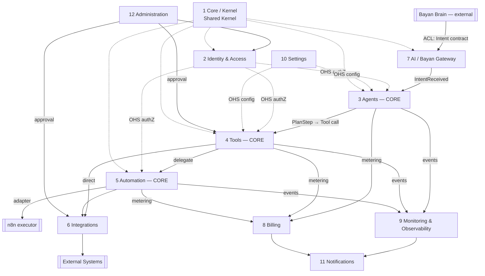
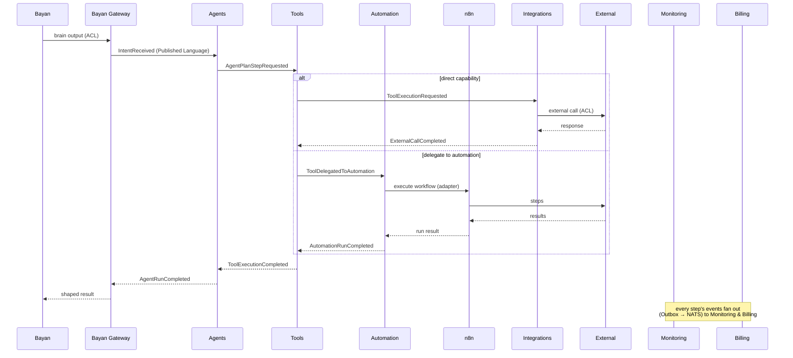

# Bounded Contexts

> The definitive contract for Nizam's module boundaries: the 12 bounded contexts, what each owns, the events each publishes and consumes, its ports/adapters, and its boundary rules.

**Status:** Approved (Phase 1) | **Version:** 1.0.0 | **Last updated:** 2026-07-01 | **Owner:** Architecture (Nizam Core)

---

## 1. Purpose

This document is the **authoritative boundary contract** for **Nizam — the Bayan AI Operating System**. Where [`04-Domain-Driven-Design.md`](./04-Domain-Driven-Design.md) explains *how* we model, this document fixes *what each context is responsible for* and *how contexts talk*. Each context is one **bounded context** and one **PHP module**, layered per Clean Architecture (`domain/ → application/ → infrastructure/ → interface/`).

**Non-negotiable boundary rules (apply to all 12):**

1. A context owns its data. No other context reads its tables or in-memory model directly.
2. Cross-context communication is **only** via (a) an **Open Host Service** API, (b) **integration events** on NATS JetStream (published through the Transactional **Outbox**), or (c) **Core** Shared-Kernel primitives.
3. Every tenant-scoped operation carries a non-null `tenant_id`; isolation is enforced by **RLS** at the DB.
4. State changes emit domain events; the externally-visible subset becomes integration events (Published Language, AsyncAPI-described).
5. Dependencies point inward (Dependency Rule); adapters implement ports.

The canonical execution flow these contexts collaborate on:

```
User → Bayan (Brain) → Nizam → Agent Framework → Tool Registry → Automation Engine → n8n → External Systems
```

---

## 2. Summary table

| # | Context | Domain type | Owns (aggregates) | Publishes | Consumes | Key upstream / downstream |
|---|---------|-------------|-------------------|-----------|----------|---------------------------|
| 1 | **Core (Kernel)** | Shared Kernel | *(base types only)* | — | — | Shared by all |
| 2 | **Identity & Access** | Supporting | Tenant, User, Role | `UserProvisioned`, `RoleAssigned`, `TenantSuspended` | `TenantLifecycleChanged` (Admin) | ← Admin; → all (OHS authZ) |
| 3 | **Agents** | Core | AgentDefinition, AgentRun | `AgentRunStarted/Completed/Failed`, `PlanStepResolved` | `IntentReceived` (Gateway); `ToolExecution*` (Tools) | ← Gateway; → Tools |
| 4 | **Tools** | Core | ToolDefinition, ToolExecution | `ToolExecutionStarted/Completed/Failed`, `ToolPublished` | `AgentPlanStepRequested` (Agents); `AutomationRun*` (Automation) | ← Agents; → Automation / Integrations |
| 5 | **Automation** | Core | WorkflowDefinition, AutomationRun | `AutomationRunStarted/Completed/Failed/Compensated` | `ToolDelegatedToAutomation` (Tools) | ← Tools; → n8n / Integrations |
| 6 | **Integrations** | Supporting | Connector, Connection | `ConnectionEstablished`, `ConnectionHealthChanged`, `ExternalCallCompleted` | `ToolExecutionRequested`, `AutomationStepRequested` | ← Tools / Automation; → External |
| 7 | **AI (Bayan Gateway)** | Supporting | IntentEnvelope, LlmInvocation | `IntentReceived`, `IntentRejected`, `LlmInvocationCompleted` | Bayan output (ACL, external) | ← Bayan / Claude; → Agents |
| 8 | **Billing** | Supporting | Subscription, UsageRecord, Invoice | `UsageRecorded`, `QuotaExceeded`, `InvoiceIssued` | all `*Completed` metering events | ← Agents/Tools/Automation; → Notifications |
| 9 | **Monitoring & Observability** | Generic | SloDefinition, AlertRule (+ read models) | `AlertRaised`, `SloBreached` | all domain/integration events | ← all; → Notifications |
| 10 | **Settings** | Generic | TenantSettings, UserSettings | `FeatureFlagChanged`, `ModeChanged` | `TenantProvisioned` (IAM) | ← IAM; → all (OHS config) |
| 11 | **Notifications** | Generic | NotificationTemplate, NotificationDelivery | `NotificationDelivered/Failed` | `AlertRaised`, `QuotaExceeded`, `AgentRunCompleted`, etc. | ← Monitoring/Billing/Agents |
| 12 | **Administration** | Generic | TenantLifecycle, MarketplaceSubmission | `TenantLifecycleChanged`, `MarketplaceItemApproved`, `ImpersonationStarted` | `ConnectionEstablished`, `ToolPublished` | ← Tools/Integrations; → IAM |

---

## 3. Context map



---

## 4. Context specifications

### 4.1 Core (Kernel)

- **Purpose:** Provide cross-cutting primitives shared by all contexts by explicit agreement. It is the **Shared Kernel** and contains **no business rules**.
- **Responsibilities:** Base classes (`AggregateRoot`, `Entity`, `ValueObject`, `DomainEvent`); `Result`/`Error` types; `Clock`; `IdGenerator` (UUID v7); `TenantContext` propagation; event-bus and Outbox abstractions; `CorrelationId`/`CausationId` VOs; base repository/port interfaces; OpenTelemetry instrumentation helpers.
- **Key aggregates/entities:** None (framework primitives only).
- **Events published:** None (defines the envelope, does not emit).
- **Events consumed:** None.
- **Ports/adapters owned:** `EventPublisher` port, `OutboxStore` port, `Clock` port, `IdGenerator` port — with default infrastructure adapters shared platform-wide.
- **Upstream/downstream:** Upstream to *every* context via Shared Kernel; depends on nothing.
- **Boundary rules:** Changes require consent of all sharing contexts (Shared-Kernel contract). Never encode domain logic here.

### 4.2 Identity & Access (IAM)

- **Purpose:** Own authentication and authorization for the whole platform.
- **Responsibilities:** Tenants, users, org units, roles, permissions, sessions; OAuth2/OIDC, JWT access+refresh, mTLS trust for service-to-service; **RBAC + ABAC** policy evaluation; RLS tenant-context issuance.
- **Key aggregates/entities:** `Tenant`, `User`, `Role` (roots); `Session`, `Permission`, `OrgUnit`, `PolicyStatement` (ABAC) entities/VOs; VOs `Email`, `PasswordHash`.
- **Events published:** `iam.UserProvisioned`, `iam.RoleAssigned`, `iam.PermissionGranted/Revoked`, `iam.TenantProvisioned`, `iam.TenantSuspended`, `iam.SessionRevoked`.
- **Events consumed:** `admin.TenantLifecycleChanged` (create/suspend/close a tenant).
- **Ports/adapters owned:** `IdentityProvider` port (OIDC adapter), `PolicyEngine` port (RBAC/ABAC evaluator), `SessionStore` port (Redis adapter), `SecretsManager` port (Vault/KMS adapter). Exposes an **Open Host Service** authorization-decision API.
- **Upstream/downstream:** Downstream of Administration (Customer/Supplier). Upstream (OHS) to Agents, Tools, Automation, and all guarded actions.
- **Boundary rules:** The single source of truth for identity and authZ decisions. No context implements its own permission checks; they call IAM's OHS. Secrets never leave the secrets manager as plaintext.

### 4.3 Agents (Agent Framework) — **Core domain**

- **Purpose:** Turn a validated **Intent** into executed work by planning and orchestrating tool calls under guardrails.
- **Responsibilities:** Agent definitions and skill bindings; run orchestration (plan → execution); memory scoping per run; guardrails/policy enforcement; run history (event-sourced).
- **Key aggregates/entities:** `AgentDefinition` (root; entities `SkillBinding`, `Guardrail`), `AgentRun` (root; entities `PlanStep`, `RunMemoryScope`; VOs `PlanId`, `RunStatus`, `IntentRef`).
- **Events published:** `agents.AgentRunStarted`, `agents.PlanStepResolved`, `agents.AgentPlanStepRequested` (→ Tools), `agents.AgentRunCompleted`, `agents.AgentRunFailed`.
- **Events consumed:** `gateway.IntentReceived` (trigger); `tools.ToolExecutionCompleted/Failed` (advance the plan).
- **Ports/adapters owned:** `AgentRunRepository`, `AgentDefinitionRepository` ports (Postgres+RLS adapters); `LlmProvider` port (used via Gateway) for plan/argument synthesis; `PlanResolver` domain service.
- **Upstream/downstream:** Downstream of AI/Bayan Gateway (OHS + Published Language). Upstream to Tools (Customer/Supplier — Agents dictate the tool-invocation contract).
- **Boundary rules:** Never call external systems directly; every effect goes through a **Tool**. Owns *no* tool logic. Uses IAM (OHS) for authZ and Settings (OHS) for mode/flags. Guardrails are enforced inside `AgentRun`.

### 4.4 Tools (Tool Registry) — **Core domain**

- **Purpose:** Be the permissioned, versioned catalog of capabilities that agents (and automations) can invoke safely.
- **Responsibilities:** Tool definitions and versions; input/output JSON-Schema contracts; capability metadata and permission scopes; sandboxed invocation; plugin registration via manifest; idempotent execution records (event-sourced).
- **Key aggregates/entities:** `ToolDefinition` (root; entities `ToolVersion`, `PermissionScope`; VOs `JsonSchema`, `CapabilityTag`, `SemVer`), `ToolExecution` (root; VOs `IdempotencyKey`, `ExecutionStatus`, `ToolArgs`).
- **Events published:** `tools.ToolPublished`, `tools.ToolExecutionStarted`, `tools.ToolExecutionCompleted`, `tools.ToolExecutionFailed`, `tools.ToolDelegatedToAutomation` (→ Automation).
- **Events consumed:** `agents.AgentPlanStepRequested` (invoke a tool); `automation.AutomationRunCompleted/Failed` (finish a delegated execution).
- **Ports/adapters owned:** `ToolDefinitionRepository`, `ToolExecutionRepository` ports; `ToolRuntime`/sandbox port; `PluginLoader` port (manifest-driven, hot-loadable); `PublishedToolVersionSpec`, `WithinScopeSpec` specifications.
- **Upstream/downstream:** Downstream of Agents (Customer/Supplier). Upstream to Automation and Integrations (a tool call either invokes an Integration adapter directly or delegates to Automation).
- **Boundary rules:** A `ToolExecution` runs only against a `published` version, only after JSON-Schema validation and IAM permission-scope check. Execution is idempotent (idempotency key). No business orchestration lives here — a tool is a single capability.

### 4.5 Automation (Automation Engine) — **Core domain**

- **Purpose:** Execute multi-step workflows durably, idempotently, and with compensation, driving **n8n** as the executor.
- **Responsibilities:** Workflow definitions and triggers; the **n8n adapter (ACL)**; run history; retries with backoff; idempotency; saga/compensation for multi-step failures.
- **Key aggregates/entities:** `WorkflowDefinition` (root; entities `Trigger`, `StepBinding`), `AutomationRun` (root; entities `RunStep`, `CompensationStep`; VOs `IdempotencyKey`, `RetryPolicy`, `RunStatus`).
- **Events published:** `automation.AutomationRunStarted`, `automation.AutomationRunCompleted`, `automation.AutomationRunFailed`, `automation.AutomationRunCompensated`, `automation.AutomationStepRequested` (→ Integrations).
- **Events consumed:** `tools.ToolDelegatedToAutomation` (trigger); `integrations.ExternalCallCompleted` (advance/finish a step).
- **Ports/adapters owned:** `WorkflowRepository`, `AutomationRunRepository` ports; `WorkflowExecutor` port with the **n8n adapter**; `RetryPolicyEvaluator` domain service; Redis-backed PHP queue-worker job adapter for scheduling.
- **Upstream/downstream:** Downstream of Tools (Customer/Supplier). Upstream to Integrations and to n8n (ACL). Participates in cross-context **sagas**.
- **Boundary rules:** n8n is hidden behind the `WorkflowExecutor` port — n8n must be replaceable. Every run is idempotent and compensable; a failed step yields either a scheduled retry or a queued compensation before the run is marked `Failed`.

### 4.6 Integrations

- **Purpose:** Connect Nizam to external systems (CRM, email, messaging, calendars, storage) behind **Anti-Corruption Layers**.
- **Responsibilities:** Connector catalog and versions; connection/credential binding (via secrets manager); connection health monitoring; per-connector request/response translation.
- **Key aggregates/entities:** `Connector` (root; entities `ConnectorVersion`, `AuthScheme`), `Connection` (root; VOs `CredentialRef`, `HealthStatus`, `Endpoint`).
- **Events published:** `integrations.ConnectionEstablished`, `integrations.ConnectionHealthChanged`, `integrations.ExternalCallCompleted/Failed`.
- **Events consumed:** `tools.ToolExecutionRequested` (direct capability), `automation.AutomationStepRequested`.
- **Ports/adapters owned:** One `ConnectorAdapter` (ACL) per external system; `SecretsManager` port (shared with IAM); `HealthProbe` port; `PluginLoader` for connector plugins.
- **Upstream/downstream:** Downstream of Tools and Automation. Upstream to external systems (ACL). Submissions governed by Administration (marketplace approval).
- **Boundary rules:** Foreign models stop at the connector ACL. `Connection` stores only a `CredentialRef` — never a raw secret. Health degradation is surfaced as events, not exceptions leaking outward.

### 4.7 AI (Bayan Gateway)

- **Purpose:** Be the **Anti-Corruption Layer** to the Bayan brain and the replaceable access point to LLMs. It performs **no reasoning of its own**.
- **Responsibilities:** Intent intake and contract validation (Published Language); context assembly (tenant, correlation, authZ scope); response shaping back toward Bayan; `LlmProvider` access for Nizam-internal model calls (default: Anthropic/Claude).
- **Key aggregates/entities:** `IntentEnvelope` (root; VOs `IntentType`, `IntentPayload`, `TenantContext`), `LlmInvocation` (root; VOs `PromptSpec`, `TokenUsage`, `ModelId`).
- **Events published:** `gateway.IntentReceived`, `gateway.IntentRejected`, `gateway.LlmInvocationCompleted`.
- **Events consumed:** Bayan output and Claude API responses (external, via ACL — not NATS events).
- **Ports/adapters owned:** `BayanAdapter` (ACL to the brain); `LlmProvider` port (Anthropic/Claude adapter, replaceable); `IntentValidator` (Published-Language schema).
- **Upstream/downstream:** Downstream of Bayan and the LLM vendor (both via ACL). Upstream (OHS + Published Language) to Agents.
- **Boundary rules:** No Bayan or vendor type crosses this boundary. Invalid intents are rejected, never coerced. Bayan/model version changes are absorbed here.

### 4.8 Billing

- **Purpose:** Turn usage into plans, quotas, metering, and invoices.
- **Responsibilities:** Plans and subscriptions; metering of agent runs, tool calls, automation executions, and tokens; quota enforcement; invoicing.
- **Key aggregates/entities:** `Subscription` (root; entities `PlanBinding`, `Quota`), `UsageRecord` (root; append-only; VOs `MeterType`, `Money`, `BillingPeriod`), `Invoice` (root).
- **Events published:** `billing.UsageRecorded`, `billing.QuotaExceeded`, `billing.InvoiceIssued`, `billing.SubscriptionChanged`.
- **Events consumed:** `agents.AgentRunCompleted`, `tools.ToolExecutionCompleted`, `automation.AutomationRunCompleted`, `gateway.LlmInvocationCompleted` (metering sources).
- **Ports/adapters owned:** `UsageMeter` port; `PaymentProvider` port (adapter, replaceable); `InvoiceRepository`, `SubscriptionRepository` ports; **CQRS** read model for usage dashboards.
- **Upstream/downstream:** Downstream (Conformist consumer) of the three core contexts and Gateway. Upstream to Notifications (quota/invoice alerts).
- **Boundary rules:** Metering is append-only and idempotent per source event. Quota breaches raise events; enforcement points (Agents/Tools) consult Billing/Settings, they don't reach into Billing tables.

### 4.9 Monitoring & Observability

- **Purpose:** Provide the read-side view of system health, metrics, traces, audit, SLOs, and alerting. Instrumentation itself lives in **Core**.
- **Responsibilities:** Health and metrics aggregation; trace/span correlation; audit read models; SLO tracking and error budgets; alerting rules.
- **Key aggregates/entities:** `SloDefinition`, `AlertRule` (roots); read models `RunReadModel`, `AuditView`; VOs `Slo`, `ErrorBudget`, `Threshold`, `TraceId`.
- **Events published:** `monitoring.AlertRaised`, `monitoring.SloBreached`.
- **Events consumed:** *All* domain/integration events (read-side projection) plus OpenTelemetry signals.
- **Ports/adapters owned:** `MetricsSink` (Prometheus), `TraceSink` (Tempo), `LogSink` (Loki) ports; `AlertNotifier` port; **CQRS** projections. Read-only over other contexts' event streams.
- **Upstream/downstream:** Downstream (Conformist) of everything. Upstream to Notifications.
- **Boundary rules:** Read-only. Never mutates another context's state; it projects events into its own read models. Alerts fire only on sustained threshold breaches.

### 4.10 Settings

- **Purpose:** Own tenant and user configuration, feature flags, and Basic/Advanced mode.
- **Responsibilities:** Tenant/user configuration; feature flags (with tenant→user precedence); **Basic Mode** (default) / **Advanced Mode**; localization preferences (AR/EN, RTL/LTR).
- **Key aggregates/entities:** `TenantSettings`, `UserSettings` (roots); entity `FeatureFlag`; VOs `LocalePref`, `AppMode`.
- **Events published:** `settings.FeatureFlagChanged`, `settings.ModeChanged`, `settings.LocaleChanged`.
- **Events consumed:** `iam.TenantProvisioned` (seed defaults), `admin.GlobalFlagChanged`.
- **Ports/adapters owned:** `SettingsRepository` port; `FeatureFlagProvider` port; exposes an **Open Host Service** config-read API (cache-friendly).
- **Upstream/downstream:** Downstream of IAM and Administration. Upstream (OHS) to all contexts that read config/flags.
- **Boundary rules:** A tenant-disabled flag cannot be enabled at user level. Config reads go through the OHS; contexts don't cache-couple to Settings' storage.

### 4.11 Notifications

- **Purpose:** Deliver messages across channels reliably, respecting preferences.
- **Responsibilities:** In-app, email, push, and webhook delivery; templates; recipient preferences and quiet hours; digests.
- **Key aggregates/entities:** `NotificationTemplate` (root), `NotificationDelivery` (root; entity `ChannelAttempt`; VOs `Channel`, `DeliveryStatus`, `Recipient`).
- **Events published:** `notifications.NotificationDelivered`, `notifications.NotificationFailed`.
- **Events consumed:** `monitoring.AlertRaised`, `billing.QuotaExceeded`, `billing.InvoiceIssued`, `agents.AgentRunCompleted`, and other user-relevant events.
- **Ports/adapters owned:** `ChannelAdapter` per channel (email/push/webhook/in-app) ports; `TemplateRenderer` port; Redis-backed PHP queue-worker delivery jobs; DLQ for exhausted retries.
- **Upstream/downstream:** Downstream (Conformist) of Monitoring, Billing, Agents, and others. Upstream to external delivery providers (via channel adapters).
- **Boundary rules:** Deliveries respect recipient preferences/quiet hours and are idempotent per triggering event. Exhausted retries route to a DLQ, not silent loss.

### 4.12 Administration

- **Purpose:** Platform/back-office control plane for operators.
- **Responsibilities:** Tenant lifecycle (create/suspend/close); global feature flags; **audited impersonation**; system announcements; plugin/marketplace approval for tools and connectors.
- **Key aggregates/entities:** `TenantLifecycle`, `MarketplaceSubmission` (roots); entities `Announcement`, `ImpersonationSession`; VOs `ApprovalStatus`, `GlobalFlag`.
- **Events published:** `admin.TenantLifecycleChanged`, `admin.MarketplaceItemApproved/Rejected`, `admin.GlobalFlagChanged`, `admin.ImpersonationStarted/Ended`, `admin.AnnouncementPublished`.
- **Events consumed:** `tools.ToolPublished`, `integrations.ConnectionEstablished` (submission review triggers).
- **Ports/adapters owned:** `TenantLifecycleRepository`, `MarketplaceRepository` ports; `ImpersonationAuditor` port (append-only audit).
- **Upstream/downstream:** Upstream (Customer/Supplier) to IAM (drives tenant lifecycle) and to Tools/Integrations (approval gates marketplace publication).
- **Boundary rules:** Every impersonation is time-boxed and produces an immutable audit event. Administration acts through IAM's OHS for identity changes; it does not mutate IAM tables directly.

---

## 5. Cross-context flow (reference)



Failures at any step trigger idempotent retries and, for multi-step flows, **saga compensation** driven by Automation. All steps are observable via Monitoring.

---

## Related Documents

- [`04-Domain-Driven-Design.md`](./04-Domain-Driven-Design.md) — strategic & tactical DDD, context map
- [`17-Glossary.md`](./17-Glossary.md) — ubiquitous language dictionary
- [`21-Database-Design.md`](./21-Database-Design.md) — persistence, RLS, event sourcing, ERD
- [`22-UIUX-Guidelines.md`](./22-UIUX-Guidelines.md) — Basic/Advanced mode & wizards
- [`19-Assumptions.md`](./19-Assumptions.md) — recorded gaps & assumptions

## Change Log

| Version | Date | Author | Change |
|---------|------|--------|--------|
| 1.0.0 | 2026-07-01 | Architecture (Nizam Core) | Initial approved boundary contract for the 12 Phase-1 bounded contexts. |
