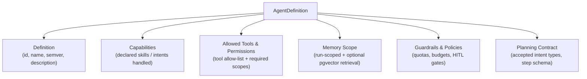
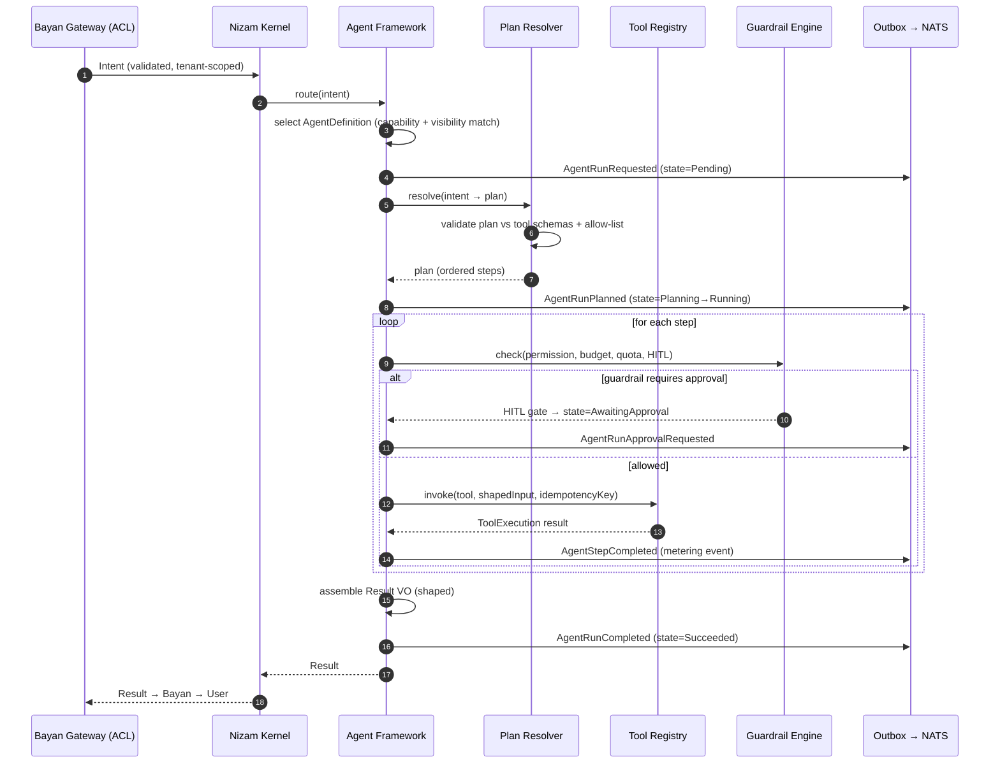
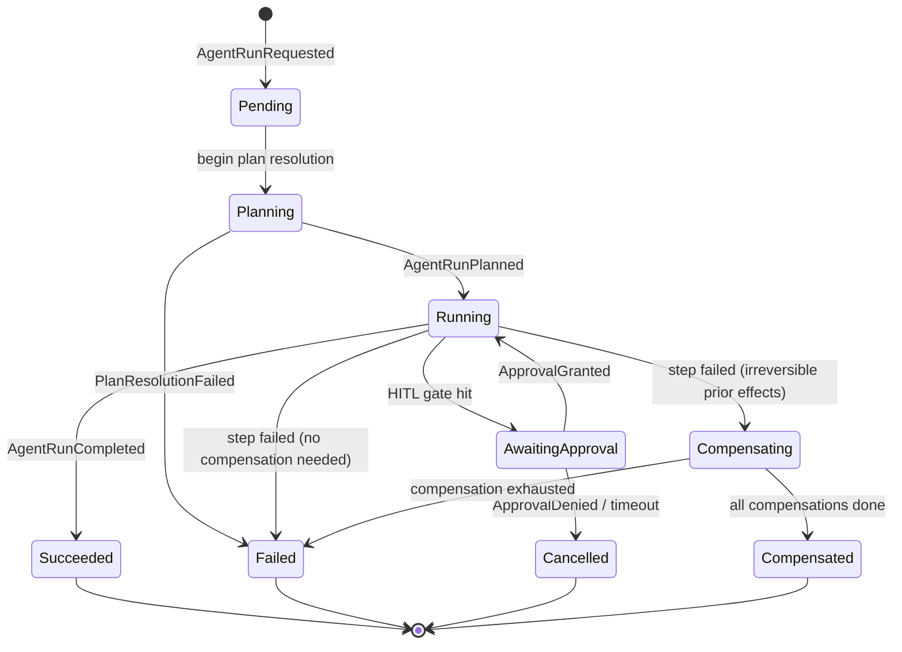
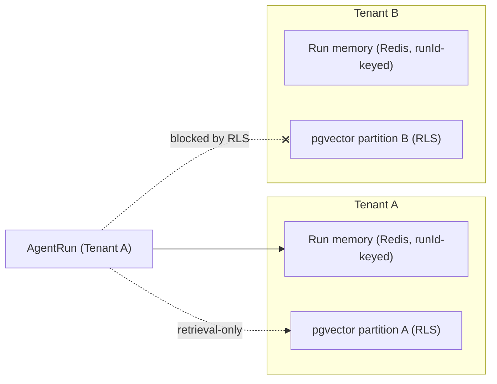
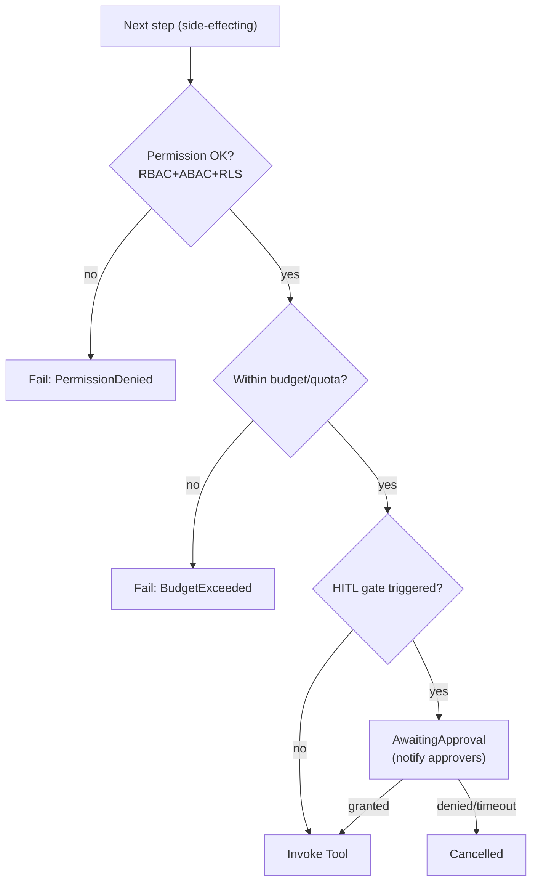

# 06 — Agent Architecture (The Agent Framework)

> The Agents bounded context: how Nizam turns a Bayan **intent** into a safe, observable, tenant-isolated **execution** — where the agent is an *executor*, never a *reasoner*.

**Status:** Approved (Phase 1) | **Version:** 1.0.0 | **Last updated:** 2026-07-01 | **Owner:** Architecture (Nizam Core)

---

## 1. Purpose & Position in the Layer Chain

The Agent Framework is the third link in the canonical layer chain:

```
User → Bayan (Brain) → Nizam (AI OS) → Agent Framework → Tool Registry → Automation Engine → n8n → External Systems
```

Bayan does the thinking (NLU, reasoning, planning) and emits a structured **Intent**. Nizam's Agent Framework does the *doing*: it receives that intent, resolves it into a concrete plan of tool calls, executes those steps under strict guardrails, and streams the result back up. The Agent Framework is the disciplined, deterministic hands of an intelligent brain that lives elsewhere.

This distinction is the single most important architectural decision in this document and it is repeated deliberately: **an agent in Nizam is an executor of Bayan intents, not a reasoner.** No open-ended chain-of-thought loops run here. No emergent goal-seeking. Every action an agent takes is traceable to an intent, a plan, a permission, and a tool.

---

## 2. What an Agent *Is* (and Is Not) in Nizam

| Aspect | An agent **IS** | An agent **is NOT** |
|---|---|---|
| Role | A bounded executor of a declared capability set | A free-form autonomous reasoner |
| Cognition | Resolves a plan and sequences bounded local steps | The source of the plan or of NLU |
| Tools | Restricted to an explicit allow-list | Able to call anything it can reach |
| Memory | Scoped, tenant-isolated, retrieval-only | A learning loop or a RAG product |
| State | Event-sourced, replayable, auditable | Opaque or ephemeral |
| Autonomy | Bounded local sequencing within a plan step | Goal invention or plan mutation |

An agent is best understood as a **typed, permissioned runtime process** that binds a declarative `AgentDefinition` (what it *may* do) to an `AgentRun` (a single execution of what it *did* do).

> Why so constrained? Because Nizam is a multi-tenant Enterprise AI Operating System. Determinism, auditability, budget control, and blast-radius containment are non-negotiable. Reasoning is intentionally externalized to Bayan so that the execution layer can be held to operating-system-grade guarantees.

---

## 2A. Agent Organization: Department Managers & Workers

Agents in Nizam are organized as a **two-tier hierarchy**, not a flat pool. This is the
governing structure for how intents are executed and audited:

- **Department Manager Agents** — exactly one per department (HR, Marketing, Sales,
  Finance, Support, Developer, CEO). A Manager receives the intent routed to its
  department, decomposes it into worker tasks, dispatches Worker Agents, coordinates
  their collaboration, runs the **Manager Audit**, and is the **only** agent permitted to
  return the final result upward.
- **Worker Agents** — each owned by exactly one Manager (e.g., the HR Manager owns CV
  Screening, Recruitment, Interview, Offer, and Onboarding agents). Workers execute
  independently, may collaborate, choose the best automation via the **Automation
  Selector**, and return **evidence** of what they did.

The canonical internal execution chain is therefore:

`Bayan → Nizam → Department Manager Agent → Worker Agents → Tool Registry → Automation Selector → n8n → Results → Manager Audit → Return Response`

The `AgentDefinition`/`AgentRun` model in this document is the substrate: a Manager and a
Worker are agent **kinds/roles**, and a Manager-led execution is an `AgentRun` composed of
Worker sub-runs. The full specification of departments, workers, collaboration, the
Automation Selector, and the Manager Audit state machine lives in
**[23-Agent-Hierarchy.md](./23-Agent-Hierarchy.md)** — read it alongside this document.

---

## 3. Agent Anatomy

An agent is defined by six declarative facets. Together they form the `AgentDefinition` aggregate (see §6).



1. **Definition** — identity and versioning: `id` (UUID v7), human name, SemVer `version`, owner tenant/global visibility, description. Definitions are immutable per version; changes produce a new version.
2. **Capabilities** — the declared set of intent types the agent can execute (e.g. `crm.contact.enrich`, `messaging.send`). Capabilities are the contract Bayan/Nizam route against; an agent will refuse an intent outside its declared capabilities.
3. **Allowed Tools & Permissions** — an explicit allow-list of Tool Registry entries the agent may invoke, plus the required permission scopes it must hold. This is enforced twice: at plan resolution (can this agent even reference this tool?) and at invocation (does the calling principal hold the scope?).
4. **Memory Scope** — the boundary of what the agent may read and write (see §7). Always tenant-isolated.
5. **Guardrails & Policies** — budget/quota ceilings, rate limits, and human-in-the-loop (HITL) approval gate rules (see §8).
6. **Planning Contract** — the schema of intents the agent accepts and the step shape it emits, so plan resolution is fully validatable.

> The following is **illustrative — design only**. It is a shape sketch, not a runtime artifact.

```yaml
# illustrative — design only
agentDefinition:
  id: "0198f3c2-...-v7"
  name: "contact-enrichment-agent"
  version: "1.4.0"
  visibility: "tenant"          # tenant | global
  capabilities:
    - "crm.contact.enrich"
    - "crm.contact.dedupe"
  allowedTools:
    - tool: "crm.contact.read"      # >=1.0.0 <2.0.0
      scopes: ["crm:contact:read"]
    - tool: "enrichment.lookup"
      scopes: ["integration:enrichment:invoke"]
    - tool: "crm.contact.update"
      scopes: ["crm:contact:write"]
  memory:
    runMemory: true               # short-term, per-run
    retrieval:
      enabled: true
      store: "pgvector"           # retrieval-only, tenant-partitioned
      readOnly: true
  guardrails:
    maxToolCalls: 25
    maxTokenBudget: 50000
    maxWallClockSeconds: 120
    humanInTheLoop:
      - onSideEffectClass: "write"
        threshold: "bulk>50"
```

---

## 4. Agent Lifecycle & Runtime

An agent run moves through four macro-phases: **Intent Intake → Plan Resolution → Step Execution → Result**. The runtime is event-sourced end to end (canon §3, §5).

### 4.1 The four phases

1. **Intent Intake.** The Bayan Gateway (AI context) has already validated the Intent contract and attached tenant context (canon §6.2). The Nizam Kernel routes the intent to the Agent Framework, which selects an `AgentDefinition` whose capabilities match the intent type and whose visibility includes the tenant. An `AgentRun` aggregate is created (`Pending`) and the first event `AgentRunRequested` is appended to the outbox.
2. **Plan Resolution.** The agent resolves the intent into an ordered **plan** — a list of steps, each of which names a tool from its allow-list plus the input to shape. *The plan does not come from the agent's imagination.* It comes from one of three sources, in priority order: (a) a plan supplied by Bayan inside the intent, (b) a declarative plan template bound to the capability, or (c) — only when explicitly permitted — a bounded `LlmProvider` call to synthesize tool arguments from the intent (canon §2, "tool arg synthesis"). The plan is validated against every step's tool input JSON Schema and against the agent's tool allow-list *before* any execution begins.
3. **Step Execution.** Steps are executed under the planning/execution boundary of §5. Each step invokes a Tool (§ Tool Architecture doc) via the invocation contract of §5.3. Guardrail checks (permission, budget, quota, HITL) run *before* each side-effecting step. Every step transition emits a domain event.
4. **Result.** On success the run transitions to `Succeeded`, a `Result` value object is assembled and shaped for the Gateway, and `AgentRunCompleted` is emitted. The result flows back up the layer chain: Agent → Gateway → Bayan → User (canon §6.8).

### 4.2 Sequence of an agent run



---

## 5. The Planning vs Execution Boundary

This is a governing principle, restated precisely:

> **Bayan plans. Nizam executes. An agent may perform bounded local sequencing only.**

### 5.1 What "bounded local sequencing" means

Within a *single resolved plan step*, an agent may perform deterministic control flow that does not invent new goals: iterating over a known collection (e.g. "update these 12 contacts"), retrying a transient failure per policy, short-circuiting on a validated precondition, or mapping outputs of one tool into the input schema of the next. It may **not**: add new capabilities, call tools outside its allow-list, escalate its own permissions, invent a new plan branch not derivable from the intent, or loop unboundedly. All local sequencing is bounded by the guardrails of §8 (`maxToolCalls`, `maxWallClockSeconds`, budget).

### 5.2 The boundary as a table

| Concern | Owner | Enforcement point |
|---|---|---|
| Understanding the user | Bayan (Brain) | Bayan Gateway ACL |
| Choosing *what to accomplish* (the goal) | Bayan → Intent | Intent contract validation |
| Choosing *how* (the plan) | Bayan template, or bounded arg-synthesis | Plan Resolver + JSON Schema |
| Choosing *whether allowed* | Nizam (Agents + IAM) | Guardrail Engine + RLS |
| Doing the work | Nizam (Agents → Tools → Automation) | AgentRun step execution |
| Iterating within one step | Agent (bounded local sequencing) | Guardrail ceilings |

### 5.3 Agent-to-Tool invocation contract

Every tool call an agent makes carries a stable envelope. Full tool-side semantics live in **07-Tool-Architecture.md**; the agent's obligation is:

> Illustrative — design only.

```yaml
# illustrative — design only
toolInvocation:
  runId: "<AgentRun.id>"           # correlates to event stream
  stepIndex: 3
  tenantId: "<tenant UUID>"
  principal: "agent:<AgentDefinition.id>@v1.4.0"
  tool: { name: "crm.contact.update", version: ">=1.0.0 <2.0.0" }
  requiredScopes: ["crm:contact:write"]
  idempotencyKey: "<runId>:<stepIndex>:<hash(input)>"
  input: { ... }                   # must satisfy tool input JSON Schema
  budget: { tokens: 4000, deadlineMs: 8000 }
```

The Tool Registry rejects any invocation whose principal lacks the declared scopes, whose input fails schema validation, or whose idempotency key replays a completed effect.

---

## 6. Aggregates: AgentDefinition & AgentRun

Two aggregates own the context's invariants. Both follow canon §3 (UUID v7 `id`, `tenant_id`, soft delete, audit columns, event sourcing for runs) and Clean Architecture layering (canon §5).

### 6.1 AgentDefinition (configuration aggregate)

- **Invariants:** version is immutable once published; `allowedTools` must reference existing, non-deprecated Tool versions; declared capabilities are unique per name+version; visibility respects tenant boundaries.
- **Lifecycle:** `Draft → Published → Deprecated → Retired`. Only `Published` definitions may back a run.
- **Persistence:** classic aggregate with `version INT` optimistic concurrency; changes emit `AgentDefinitionPublished` / `AgentDefinitionDeprecated` domain events.

### 6.2 AgentRun (event-sourced aggregate)

- **Invariants:** a run belongs to exactly one tenant and one published definition version; steps execute in order; the run cannot exceed its guardrail ceilings; a `Succeeded`/`Failed`/`Cancelled` run is terminal.
- **State is derived by replaying its event stream** — the run is the fold of its events, giving free auditability and time-travel debugging (canon §3).



---

## 7. Agent Memory (Scoped, Tenant-Isolated, Retrieval-Only)

Memory in Nizam is deliberately modest. **Nizam is not a RAG product.** Memory exists to make execution coherent and correct, not to be a knowledge platform.

### 7.1 Two tiers

- **Short-term run memory.** Ephemeral, lives for the duration of one `AgentRun`. Holds intermediate step outputs, resolved variables, and the working plan cursor. Backed by Redis 7 keyed by `runId`, TTL-bounded, discarded on terminal state (the event stream remains the durable record).
- **Longer-term retrieval memory.** Optional, opt-in per definition. Backed by PostgreSQL 16 + `pgvector` (canon §2), partitioned by `tenant_id` with **RLS as the enforcing boundary**. It is **retrieval-only**: the agent may *read* relevant prior context (e.g. embeddings of past summaries the tenant chose to persist) but the Agent Framework does not train, mutate, or grow this store as a side effect of a run. Writes to retrieval memory are explicit, governed operations owned elsewhere, never an emergent behavior of an agent.

### 7.2 Isolation guarantees



No agent run can read another tenant's run memory or retrieval memory; RLS enforces this at the database boundary in addition to application-level tenant context (canon §3).

---

## 8. Guardrails & Policies

Guardrails are evaluated by a **Guardrail Engine** invoked before every side-effecting step and at run admission. They are declarative on the `AgentDefinition` and enforced by the runtime.

- **Permission checks.** Every tool invocation is checked against IAM's RBAC + ABAC policy and DB RLS (canon §2). An agent's *effective* permissions are the intersection of the definition's declared scopes and the invoking principal's granted scopes — never a superset.
- **Budget / quota limits.** Per-run ceilings (`maxToolCalls`, `maxTokenBudget`, `maxWallClockSeconds`) and per-tenant quotas (enforced with Billing metering, canon §4.8). Exceeding a ceiling transitions the run to `Failed` with a typed reason; approaching one emits a warning event.
- **Human-in-the-loop (HITL) approval gates.** Configurable rules (e.g. any `write` side-effect class above a threshold, or any irreversible action) pause the run in `AwaitingApproval`, emit `AgentRunApprovalRequested`, and notify approvers via the Notifications context. Approval/denial is itself an audited domain event.



---

## 9. Concurrency & Isolation

- **Run isolation.** Each `AgentRun` is an independent unit of work carrying its own tenant context; there is no shared mutable state between runs beyond the explicitly scoped stores of §7.
- **Execution.** Runs are scheduled as BullMQ jobs (canon §2). Per-tenant concurrency caps prevent one tenant from starving others; global caps protect the platform. Long-running or delegated steps (e.g. Automation) are non-blocking — the run parks and resumes on an integration event.
- **Idempotency.** Every side-effecting step carries an idempotency key (`runId:stepIndex:hash(input)`), so a retried or replayed step produces exactly-once effect (canon §6.9).
- **Optimistic concurrency.** The `AgentDefinition` uses a `version` column; `AgentRun` conflicts are impossible by construction because each run owns its own stream.

---

## 10. Observability of Agent Runs (Event-Sourced)

Because `AgentRun` is event-sourced, observability is a first-class property, not an afterthought.

- **Event stream** — the ordered, append-only sequence (`AgentRunRequested`, `AgentRunPlanned`, `AgentStepCompleted`, `AgentRunApprovalRequested/Granted`, `AgentRunCompleted/Failed/Compensated`) is the audit log and the debugging timeline. Events publish via the Transactional Outbox → NATS JetStream (canon §2, §5).
- **Distributed tracing** — every run and step is wrapped in OpenTelemetry spans (traces → Tempo; metrics → Prometheus/Grafana; logs → Loki), correlated by `runId` (canon §2).
- **Read models** — the Monitoring & Observability context builds CQRS read models (run status, latency, cost, failure rates, SLO tracking) by consuming the run events (canon §4.9, §5).
- **Metering** — `AgentStepCompleted` and `AgentRunCompleted` events feed Billing's usage metering (agent runs, tool calls, tokens) (canon §4.8).

---

## 11. Failure, Retry & Compensation

- **Transient failures** (timeouts, rate limits) are retried per policy with backoff, gated by the idempotency key so retries never double-apply effects.
- **Permanent failures** transition the run to `Failed` with a typed, human-readable reason surfaced back through the Gateway.
- **Compensation.** When a run has already produced irreversible effects and a later step fails, the run enters `Compensating` and executes compensating actions in reverse order (Saga / Process Manager pattern, canon §5). Cross-context flows (Agents → Tools → Automation → Integrations) participate in the same Saga so compensation is consistent end to end.
- **Observability of failure** — every retry, compensation, and terminal transition is an event, so failures are fully replayable and auditable.

---

## 12. Extensibility: Agent Skills as Plugins

Agent capabilities are extended through **skills** registered as plugins against stable contracts (canon §5, plugin strategy).

- A **skill** bundles a capability declaration, a plan template (or arg-synthesis prompt), and its required tool allow-list + scopes.
- Skills are **manifest + JSON Schema** described, **versioned** (SemVer), **hot-loadable**, and **sandboxed** — a skill cannot broaden an agent's permissions beyond what IAM grants.
- Third-party / marketplace skills pass the **Administration** context's plugin approval workflow (canon §4.12) before becoming available, and inherit the same guardrail and metering machinery.
- Because skills are declarative and versioned, an agent can be recomposed without code changes to the runtime — the runtime stays fixed; capability grows via configuration. This is the SOLID/DDD payoff: the executor is closed for modification, open for extension.

---

## Related Documents

- **[23-Agent-Hierarchy.md](23-Agent-Hierarchy.md)** — Department Managers, Worker Agents, Automation Selector, and the Manager Audit loop (deepens this doc).
- **[00-Vision.md](00-Vision.md)** — Nizam vision and the Bayan/Nizam split.
- **[05-Bounded-Contexts.md](05-Bounded-Contexts.md)** — Intent contract & the ACL that feeds this context (intent intake).
- **[07-Tool-Architecture.md](07-Tool-Architecture.md)** — the Tool Registry that agent steps invoke.
- **[08-Automation-Architecture.md](08-Automation-Architecture.md)** — where tool steps may delegate to n8n.
- **[05-Bounded-Contexts.md](05-Bounded-Contexts.md)** — RBAC/ABAC and RLS enforcing agent permissions.
- **[05-Bounded-Contexts.md](05-Bounded-Contexts.md)** — metering of agent runs, tool calls, tokens.
- **[05-Bounded-Contexts.md](05-Bounded-Contexts.md)** — read models and SLOs over agent-run events.
- **[21-Database-Design.md](21-Database-Design.md)** — AgentDefinition / AgentRun / pgvector schema design.
- **[19-Assumptions.md](19-Assumptions.md)** — recorded gaps and assumptions.

## Change Log

| Version | Date | Author | Change |
|---|---|---|---|
| 1.0.0 | 2026-07-01 | Architecture (Nizam Core) | Initial approved Phase 1 architecture for the Agent Framework (Agents bounded context). |
