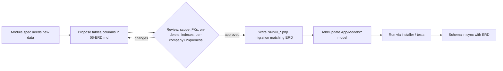

# 06 — Entity-Relationship Diagram (ERD)

The complete, authoritative Entity-Relationship Diagram for HalaOps: a full Mermaid `erDiagram` of all 36 tables (16 BUILT, 20 PLANNED) plus a per-table breakdown of columns, types, constraints, foreign keys (with ON DELETE behavior), and indexes. This ERD must be approved before any migration is written.

## Related Documents

- [05 — Database Architecture](05-Database-Architecture.md) — the design principles, naming conventions, and migration system behind this schema.
- [08 — Multi-Tenant Architecture](08-Multi-Tenant.md) — how `workspace_id` enforces isolation across these tables.
- [13 — Subscription System](13-Subscription-System.md) — `plans` / `subscriptions`.
- [14 — Billing System](14-Billing-System.md) — `invoices` / `payments` / `payment_methods` / `gateway_events`.
- [18 — AI Interview Engine](18-AI-Interview-Engine.md) — `interviews` / `interview_questions` / `interview_responses` / `ai_interview_sessions`.
- [25 — Application Lifecycle](25-Application-Lifecycle.md) — `applications` / `application_events` / `pipeline_stages`.
- [27 — Storage System](27-Storage-System.md) — `files`.
- [28 — Search System](28-Search-System.md) — FULLTEXT on `jobs` / `applications`.

---

## Purpose (الهدف)

This document is the **single visual + tabular contract** for the HalaOps relational schema. It shows how every entity relates to every other, and pins down each table's exact columns, types, keys, foreign keys, and indexes. Engineers read it before writing a migration; reviewers approve it before the migration merges. It is intentionally exhaustive: both the **16 built tables** (already migrated, `database/migrations/0001–0015` + `migrations`) and the **20 planned tables** (17–36, created as each module ships) are documented, each clearly marked **BUILT** or **PLANNED**.

## Why It Exists (سبب وجوده)

A multi-tenant SaaS lives and dies by data integrity. If the relationships are wrong — a missing `workspace_id`, a CASCADE where it should be RESTRICT, a non-unique slug — the consequences are data leakage between tenants or destructive deletes. To prevent that, HalaOps treats the ERD as a **gate**: nothing touches the database until the relationship and its delete behavior are agreed here. This document also gives every other doc a stable reference for table/column names, so the whole `/docs` set stays consistent. It mirrors §11 of the canonical context exactly and never contradicts it.

## Architecture

The schema is organized into cohesive clusters that map to the product's bounded contexts:

- **Identity & tenancy**: `users`, `workspaces`, `memberships`.
- **RBAC**: `roles`, `permissions`, `role_permissions`, `membership_roles`, `user_roles`.
- **Billing & plans**: `plans`, `subscriptions`, (planned) `invoices`, `payments`, `payment_methods`, `gateway_events`.
- **AI**: `tenant_ai_keys` (built as `ai_credentials`), (planned) `ai_interview_sessions`.
- **Recruitment** (planned): `jobs`, `pipeline_stages`, `applications`, `application_events`, `interviews`, `interview_participants`, `interview_questions`, `interview_responses`, `evaluations`.
- **Platform/support**: `settings`, `onboarding_progress`, `activity_logs`, `password_resets`, `migrations`, (planned) `files`, `notifications`, `notification_preferences`, `api_tokens`, `queued_jobs`, `failed_jobs`.

Every relationship below is a **real InnoDB foreign key** with an explicit `ON DELETE` rule (CASCADE / SET NULL / RESTRICT) and `ON UPDATE CASCADE`, exactly as in the migrations.

## Workflow

The ERD is used in this approval flow:

## Business Rules

1. The ERD must match the migrations **byte-for-byte** in intent — same columns, types, keys, FK behaviors. Discrepancies are bugs in one or the other and are reconciled before merge.
2. Every **TENANT** table has `workspace_id BIGINT UNSIGNED` → `workspaces(id)` with an index; **GLOBAL** tables do not.
3. ON DELETE rules are fixed: **CASCADE** for owned children, **SET NULL** for optional links, **RESTRICT** to block destructive deletes.
4. Per-workspace uniqueness uses composite unique keys leftmost-prefixed on `workspace_id`.
5. Each table is labeled **BUILT** (migrated now) or **PLANNED** (ships with its module). PLANNED tables are documented at the same fidelity so the ERD is complete and "approvable" ahead of implementation.

## Database Relations

### Full Entity-Relationship Diagram (all 36 tables)

> Legend: PK = primary key, FK = foreign key, UK = unique key. Relationship lines read parent ‖--o{ child (one-to-many) or ‖--o| (one-to-one/optional). Pivot tables sit between their two parents. Tables marked PLANNED in the per-table sections below are included here so the diagram is complete.

```mermaid
erDiagram
    users ||--o{ workspaces : "owns (owner_id, RESTRICT)"
    users ||--o{ memberships : "has (CASCADE)"
    workspaces ||--o{ memberships : "has (CASCADE)"
    users ||--o{ memberships : "invited_by (SET NULL)"
    workspaces ||--o{ roles : "defines (CASCADE, NULL=global)"
    roles ||--o{ roles : "parent_id (SET NULL)"
    roles ||--o{ role_permissions : "grants (CASCADE)"
    permissions ||--o{ role_permissions : "granted_in (CASCADE)"
    memberships ||--o{ membership_roles : "assigned (CASCADE)"
    roles ||--o{ membership_roles : "assigned (CASCADE)"
    users ||--o{ user_roles : "global grant (CASCADE)"
    roles ||--o{ user_roles : "global grant (CASCADE)"
    plans ||--o{ subscriptions : "subscribed (RESTRICT)"
    workspaces ||--o{ subscriptions : "has (CASCADE)"
    workspaces ||--o{ tenant_ai_keys : "has (CASCADE)"
    workspaces ||--o{ settings : "has (CASCADE)"
    users ||--o{ onboarding_progress : "progresses (CASCADE)"
    workspaces ||--o{ onboarding_progress : "context (CASCADE, NULL)"
    workspaces ||--o{ activity_logs : "scoped (CASCADE, NULL)"
    users ||--o{ activity_logs : "actor (SET NULL)"

    workspaces ||--o{ jobs : "posts (CASCADE)"
    users ||--o{ jobs : "created_by (SET NULL)"
    workspaces ||--o{ pipeline_stages : "owns (CASCADE)"
    jobs ||--o{ pipeline_stages : "job stages (CASCADE, NULL=template)"
    workspaces ||--o{ applications : "receives (CASCADE)"
    jobs ||--o{ applications : "for (CASCADE)"
    users ||--o{ applications : "candidate (CASCADE)"
    pipeline_stages ||--o{ applications : "current_stage (SET NULL)"
    files ||--o{ applications : "resume (SET NULL)"
    applications ||--o{ application_events : "timeline (CASCADE)"
    users ||--o{ application_events : "actor (SET NULL)"
    workspaces ||--o{ interviews : "holds (CASCADE)"
    applications ||--o{ interviews : "for (CASCADE)"
    jobs ||--o{ interviews : "for (CASCADE)"
    users ||--o{ interviews : "created_by (SET NULL)"
    interviews ||--o{ interview_participants : "has (CASCADE)"
    users ||--o{ interview_participants : "participates (CASCADE)"
    interviews ||--o{ interview_questions : "asks (CASCADE, NULL=template)"
    interviews ||--o{ interview_responses : "collects (CASCADE)"
    interview_questions ||--o{ interview_responses : "answers (CASCADE)"
    users ||--o{ interview_responses : "by (CASCADE)"
    files ||--o{ interview_responses : "attachment (SET NULL)"
    interviews ||--o{ ai_interview_sessions : "runs (CASCADE)"
    applications ||--o{ evaluations : "scored (CASCADE)"
    interviews ||--o{ evaluations : "from (SET NULL)"
    users ||--o{ evaluations : "evaluator (SET NULL)"

    workspaces ||--o{ files : "stores (CASCADE)"
    users ||--o{ files : "uploaded_by (SET NULL)"
    workspaces ||--o{ notifications : "scoped (CASCADE, NULL)"
    users ||--o{ notifications : "recipient (CASCADE)"
    users ||--o{ notification_preferences : "prefers (CASCADE)"
    workspaces ||--o{ invoices : "billed (CASCADE)"
    subscriptions ||--o{ invoices : "for (SET NULL)"
    workspaces ||--o{ payments : "pays (CASCADE)"
    invoices ||--o{ payments : "settles (SET NULL)"
    workspaces ||--o{ payment_methods : "saves (CASCADE)"
    users ||--o{ api_tokens : "owns (CASCADE)"

    users {
        bigint id PK
        varchar email UK
        varchar password
        bigint user_status_id FK
    }
    workspaces {
        bigint id PK
        varchar slug UK
        bigint owner_id FK
        bigint workspace_type_id FK
        bigint workspace_status_id FK
        json settings
    }
    memberships {
        bigint id PK
        bigint workspace_id FK
        bigint user_id FK
        bigint invited_by FK
        bigint membership_status_id FK
    }
    roles {
        bigint id PK
        bigint workspace_id FK
        bigint parent_id FK
        varchar slug
        tinyint is_system
    }
    permissions {
        bigint id PK
        varchar key UK
        bigint module_id FK
        varchar action
    }
    role_permissions {
        bigint role_id PK_FK
        bigint permission_id PK_FK
    }
    membership_roles {
        bigint membership_id PK_FK
        bigint role_id PK_FK
    }
    user_roles {
        bigint user_id PK_FK
        bigint role_id PK_FK
    }
    plans {
        bigint id PK
        varchar slug UK
        decimal price
        bigint interval_id FK
        json features
        json limits
    }
    subscriptions {
        bigint id PK
        bigint workspace_id FK
        bigint plan_id FK
        bigint subscription_status_id FK
        decimal amount
    }
    tenant_ai_keys {
        bigint id PK
        bigint workspace_id FK
        varchar provider
        text credentials
    }
    password_resets {
        varchar email PK
        varchar token
    }
    settings {
        bigint id PK
        bigint workspace_id FK
        varchar key
        text value
    }
    onboarding_progress {
        bigint id PK
        bigint user_id FK
        bigint workspace_id FK
        varchar flow
    }
    activity_logs {
        bigint id PK
        bigint workspace_id FK
        bigint user_id FK
        varchar action
        json properties
    }
    migrations {
        bigint id PK
        varchar migration UK
        int batch
    }
    jobs {
        bigint id PK
        bigint workspace_id FK
        varchar slug
        bigint job_status_id FK
        bigint created_by FK
    }
    pipeline_stages {
        bigint id PK
        bigint workspace_id FK
        bigint job_id FK
        bigint stage_type_id FK
    }
    applications {
        bigint id PK
        bigint workspace_id FK
        bigint job_id FK
        bigint user_id FK
        bigint current_stage_id FK
        bigint resume_file_id FK
        bigint application_status_id FK
    }
    application_events {
        bigint id PK
        bigint workspace_id FK
        bigint application_id FK
        bigint actor_id FK
        varchar type
    }
    interviews {
        bigint id PK
        bigint workspace_id FK
        bigint application_id FK
        bigint job_id FK
        bigint interview_type_id FK
        bigint interview_status_id FK
    }
    interview_participants {
        bigint id PK
        bigint workspace_id FK
        bigint interview_id FK
        bigint user_id FK
        bigint participant_role_id FK
    }
    interview_questions {
        bigint id PK
        bigint workspace_id FK
        bigint interview_id FK
        bigint question_type_id FK
    }
    interview_responses {
        bigint id PK
        bigint workspace_id FK
        bigint interview_id FK
        bigint question_id FK
        bigint user_id FK
        bigint response_file_id FK
    }
    ai_interview_sessions {
        bigint id PK
        bigint workspace_id FK
        bigint interview_id FK
        varchar provider
        bigint session_status_id FK
    }
    evaluations {
        bigint id PK
        bigint workspace_id FK
        bigint application_id FK
        bigint interview_id FK
        bigint evaluator_id FK
        bigint recommendation_id FK
    }
    files {
        bigint id PK
        bigint workspace_id FK
        bigint user_id FK
        varchar path
        bigint visibility_id FK
    }
    notifications {
        bigint id PK
        bigint workspace_id FK
        bigint user_id FK
        varchar type
        timestamp read_at
    }
    notification_preferences {
        bigint id PK
        bigint user_id FK
        bigint workspace_id FK
        varchar type
        varchar channel
    }
    invoices {
        bigint id PK
        bigint workspace_id FK
        bigint subscription_id FK
        varchar number UK
        bigint invoice_status_id FK
    }
    payments {
        bigint id PK
        bigint workspace_id FK
        bigint invoice_id FK
        varchar gateway
        bigint payment_status_id FK
    }
    payment_methods {
        bigint id PK
        bigint workspace_id FK
        varchar gateway
        varchar token
    }
    gateway_events {
        bigint id PK
        varchar gateway
        varchar reference
        tinyint processed
    }
    api_tokens {
        bigint id PK
        bigint user_id FK
        bigint workspace_id FK
        varchar token_hash UK
    }
    queued_jobs {
        bigint id PK
        varchar queue
        longtext payload
    }
    failed_jobs {
        bigint id PK
        varchar uuid UK
        longtext payload
    }
```

---

### Per-table breakdown

Each subsection lists columns, types, constraints, foreign keys (with ON DELETE), and indexes — matching §11 and the real migrations.

#### 1. `users` — **BUILT** (GLOBAL)
The single identity table. No user-type column.

| Column | Type | Notes |
|--------|------|-------|
| id | BIGINT UNSIGNED AI | **PK** |
| name | VARCHAR(150) | NOT NULL |
| email | VARCHAR(190) | NOT NULL, **UNIQUE** `users_email_unique` |
| password | VARCHAR(255) | NOT NULL (Argon2id) |
| phone | VARCHAR(40) | NULL |
| avatar | VARCHAR(255) | NULL |
| locale | VARCHAR(5) | NOT NULL DEFAULT `en` |
| timezone | VARCHAR(64) | NOT NULL DEFAULT `Asia/Riyadh` |
| user_status_id | BIGINT UNSIGNED | NOT NULL, **FK → lookup_values RESTRICT** (`user_status`) |
| email_verified_at | TIMESTAMP NULL | |
| last_login_at | TIMESTAMP NULL | |
| last_login_ip | VARCHAR(45) | NULL |
| remember_token | VARCHAR(100) | NULL |
| created_at / updated_at | TIMESTAMP NULL | |

**Indexes:** PK(id), UNIQUE(email), KEY `users_user_status_id_index`(user_status_id). **FKs:** user_status_id RESTRICT → lookup_values (otherwise referenced by most tables).

#### 2. `workspaces` — **BUILT** (GLOBAL / tenant root)
Built as `companies`; renamed to `workspaces` at cutover.

| Column | Type | Notes |
|--------|------|-------|
| id | BIGINT UNSIGNED AI | **PK** |
| name | VARCHAR(150) | NOT NULL |
| slug | VARCHAR(160) | NOT NULL, **UNIQUE** `workspaces_slug_unique` |
| owner_id | BIGINT UNSIGNED | NOT NULL, **FK → users(id) RESTRICT** |
| workspace_type_id | BIGINT UNSIGNED | NOT NULL, **FK → workspace_types RESTRICT** |
| logo | VARCHAR(255) | NULL |
| locale | VARCHAR(5) | DEFAULT `en` |
| timezone | VARCHAR(64) | DEFAULT `Asia/Riyadh` |
| workspace_status_id | BIGINT UNSIGNED | NOT NULL, **FK → workspace_statuses RESTRICT** |
| settings | JSON | NULL |
| created_at / updated_at | TIMESTAMP NULL | |

**Indexes:** PK, UNIQUE(slug), KEY(owner_id), KEY(workspace_type_id), KEY(workspace_status_id). **FKs:** `workspaces_owner_id_foreign` → users(id) RESTRICT; workspace_type_id RESTRICT; workspace_status_id RESTRICT.

#### 3. `memberships` — **BUILT** (TENANT)
User↔workspace link; the per-workspace seat.

| Column | Type | Notes |
|--------|------|-------|
| id | BIGINT UNSIGNED AI | **PK** |
| workspace_id | BIGINT UNSIGNED | NOT NULL, **FK → workspaces CASCADE** |
| user_id | BIGINT UNSIGNED | NOT NULL, **FK → users CASCADE** |
| membership_status_id | BIGINT UNSIGNED | NOT NULL, **FK → lookup_values RESTRICT** (`membership_status`) |
| title | VARCHAR(120) | NULL |
| invited_by | BIGINT UNSIGNED NULL | **FK → users SET NULL** |
| invited_at / joined_at | TIMESTAMP NULL | |
| created_at / updated_at | TIMESTAMP NULL | |

**Indexes:** PK, **UNIQUE `memberships_workspace_user_unique`(workspace_id,user_id)**, KEY(user_id), KEY(membership_status_id). **FKs:** workspace_id CASCADE, user_id CASCADE, invited_by SET NULL, membership_status_id RESTRICT.

#### 4. `roles` — **BUILT** (GLOBAL when workspace_id NULL, else TENANT)

| Column | Type | Notes |
|--------|------|-------|
| id | BIGINT UNSIGNED AI | **PK** |
| workspace_id | BIGINT UNSIGNED NULL | **FK → workspaces CASCADE** (NULL = global role) |
| parent_id | BIGINT UNSIGNED NULL | **FK → roles SET NULL** (single-parent inheritance) |
| name | VARCHAR(120) | NOT NULL |
| slug | VARCHAR(120) | NOT NULL |
| description | VARCHAR(255) | NULL |
| is_system | TINYINT(1) | DEFAULT 0 (protected from deletion) |
| priority | INT | DEFAULT 0 |
| created_at / updated_at | TIMESTAMP NULL | |

**Indexes:** PK, **UNIQUE `roles_workspace_slug_unique`(workspace_id,slug)**, KEY(parent_id). **FKs:** workspace_id CASCADE, parent_id SET NULL.

#### 5. `permissions` — **BUILT** (GLOBAL)

| Column | Type | Notes |
|--------|------|-------|
| id | BIGINT UNSIGNED AI | **PK** |
| key | VARCHAR(120) | NOT NULL, **UNIQUE** `permissions_key_unique` |
| module_id | BIGINT UNSIGNED | NOT NULL, **FK → system_modules RESTRICT** (the permission group) |
| action | VARCHAR(60) | NOT NULL (derived from the key suffix) |
| name | VARCHAR(150) | NOT NULL |
| description | VARCHAR(255) | NULL |
| created_at / updated_at | TIMESTAMP NULL | |

**Indexes:** PK, UNIQUE(key), KEY `permissions_module_id_index`(module_id). **FKs:** module_id RESTRICT → system_modules.

#### 6. `role_permissions` — **BUILT** (GLOBAL pivot)
Built as `role_permissions`; renamed to `role_permissions` at cutover.

| Column | Type | Notes |
|--------|------|-------|
| role_id | BIGINT UNSIGNED | **PK part**, **FK → roles CASCADE** |
| permission_id | BIGINT UNSIGNED | **PK part**, **FK → permissions CASCADE** |

**Indexes:** **PK(role_id,permission_id)**, KEY(permission_id). **FKs:** both CASCADE.

#### 7. `membership_roles` — **BUILT** (TENANT pivot, via membership)
Built as `membership_roles`; renamed to `membership_roles` at cutover.

| Column | Type | Notes |
|--------|------|-------|
| membership_id | BIGINT UNSIGNED | **PK part**, **FK → memberships CASCADE** |
| role_id | BIGINT UNSIGNED | **PK part**, **FK → roles CASCADE** |

**Indexes:** **PK(membership_id,role_id)**, KEY(role_id). **FKs:** both CASCADE.

#### 8. `user_roles` — **BUILT** (GLOBAL pivot)
Built as `user_roles`; renamed to `user_roles` at cutover. Direct grants of global roles (e.g. super-admin) to users.

| Column | Type | Notes |
|--------|------|-------|
| user_id | BIGINT UNSIGNED | **PK part**, **FK → users CASCADE** |
| role_id | BIGINT UNSIGNED | **PK part**, **FK → roles CASCADE** |

**Indexes:** **PK(user_id,role_id)**, KEY(role_id). **FKs:** both CASCADE.

#### 9. `plans` — **BUILT** (GLOBAL)

| Column | Type | Notes |
|--------|------|-------|
| id | BIGINT UNSIGNED AI | **PK** |
| name | VARCHAR(120) | NOT NULL |
| slug | VARCHAR(120) | NOT NULL, **UNIQUE** `plans_slug_unique` |
| description | VARCHAR(500) | NULL |
| price | DECIMAL(10,2) | DEFAULT 0.00 |
| currency | VARCHAR(3) | DEFAULT `SAR` |
| interval_id | BIGINT UNSIGNED | NOT NULL, **FK → lookup_values RESTRICT** (`billing_interval`) |
| trial_days | INT | DEFAULT 0 |
| features | JSON | NULL |
| limits | JSON | NULL |
| is_active | TINYINT(1) | DEFAULT 1 |
| is_public | TINYINT(1) | DEFAULT 1 |
| sort_order | INT | DEFAULT 0 |
| created_at / updated_at | TIMESTAMP NULL | |

**Indexes:** PK, UNIQUE(slug), KEY `plans_is_active_index`(is_active), KEY(interval_id). **FKs:** interval_id RESTRICT → lookup_values. Seeded with `Standard` (50.00 SAR, monthly, 14-day trial).

#### 10. `subscriptions` — **BUILT** (TENANT)

| Column | Type | Notes |
|--------|------|-------|
| id | BIGINT UNSIGNED AI | **PK** |
| workspace_id | BIGINT UNSIGNED | NOT NULL, **FK → workspaces CASCADE** |
| plan_id | BIGINT UNSIGNED | NOT NULL, **FK → plans RESTRICT** |
| subscription_status_id | BIGINT UNSIGNED | NOT NULL, **FK → subscription_statuses RESTRICT** |
| amount | DECIMAL(10,2) | DEFAULT 0.00 (snapshotted) |
| currency | VARCHAR(3) | DEFAULT `SAR` (snapshotted) |
| trial_ends_at / starts_at / ends_at / canceled_at | TIMESTAMP NULL | |
| created_at / updated_at | TIMESTAMP NULL | |

**Indexes:** PK, KEY(workspace_id), KEY(plan_id), KEY(subscription_status_id). **FKs:** workspace_id CASCADE, plan_id RESTRICT, subscription_status_id RESTRICT.

#### 11. `tenant_ai_keys` — **BUILT** (TENANT)
Built as `ai_credentials`; renamed to `tenant_ai_keys` at cutover.

| Column | Type | Notes |
|--------|------|-------|
| id | BIGINT UNSIGNED AI | **PK** |
| workspace_id | BIGINT UNSIGNED | NOT NULL, **FK → workspaces CASCADE** |
| provider | VARCHAR(40) | NOT NULL (openai, anthropic, gemini, deepseek, azure, heygen, …) |
| label | VARCHAR(120) | NULL |
| credentials | TEXT | NOT NULL (AES-256-GCM ciphertext) |
| meta | JSON | NULL |
| is_active | TINYINT(1) | DEFAULT 1 |
| is_default | TINYINT(1) | DEFAULT 0 |
| last_used_at | TIMESTAMP NULL | |
| created_at / updated_at | TIMESTAMP NULL | |

**Indexes:** PK, **UNIQUE `tenant_ai_keys_workspace_provider_unique`(workspace_id,provider)**. **FK:** workspace_id CASCADE.

#### 12. `password_resets` — **BUILT** (GLOBAL)

| Column | Type | Notes |
|--------|------|-------|
| email | VARCHAR(190) | **PK** |
| token | VARCHAR(255) | NOT NULL (hashed) |
| created_at | TIMESTAMP | NOT NULL DEFAULT CURRENT_TIMESTAMP |

**Indexes:** PK(email), KEY `password_resets_token_index`(token). **FKs:** none.

#### 13. `settings` — **BUILT** (TENANT)

| Column | Type | Notes |
|--------|------|-------|
| id | BIGINT UNSIGNED AI | **PK** |
| workspace_id | BIGINT UNSIGNED | NOT NULL, **FK → workspaces CASCADE** |
| key | VARCHAR(120) | NOT NULL |
| value | TEXT | NULL |
| created_at / updated_at | TIMESTAMP NULL | |

**Indexes:** PK, **UNIQUE `settings_workspace_key_unique`(workspace_id,key)**. **FK:** workspace_id CASCADE.

#### 14. `onboarding_progress` — **BUILT** (TENANT, nullable workspace)

| Column | Type | Notes |
|--------|------|-------|
| id | BIGINT UNSIGNED AI | **PK** |
| user_id | BIGINT UNSIGNED | NOT NULL, **FK → users CASCADE** |
| workspace_id | BIGINT UNSIGNED NULL | **FK → workspaces CASCADE** |
| flow | VARCHAR(60) | NOT NULL (owner, hr, candidate, super-admin, …) |
| current_step | INT | DEFAULT 0 |
| completed_steps | JSON | NULL |
| is_completed | TINYINT(1) | DEFAULT 0 |
| completed_at | TIMESTAMP NULL | |
| created_at / updated_at | TIMESTAMP NULL | |

**Indexes:** PK, **UNIQUE `onboarding_user_workspace_flow_unique`(user_id,workspace_id,flow)**. **FKs:** user_id CASCADE, workspace_id CASCADE.

#### 15. `activity_logs` — **BUILT** (TENANT, nullable workspace / audit)
Built as `activity_log`; renamed to `activity_logs` at cutover.

| Column | Type | Notes |
|--------|------|-------|
| id | BIGINT UNSIGNED AI | **PK** |
| workspace_id | BIGINT UNSIGNED NULL | **FK → workspaces CASCADE** |
| user_id | BIGINT UNSIGNED NULL | **FK → users SET NULL** (actor) |
| action | VARCHAR(120) | NOT NULL |
| subject_type | VARCHAR(120) | NULL |
| subject_id | BIGINT UNSIGNED | NULL |
| description | VARCHAR(255) | NULL |
| properties | JSON | NULL |
| ip | VARCHAR(45) | NULL |
| user_agent | VARCHAR(255) | NULL |
| created_at | TIMESTAMP NULL | (append-only) |

**Indexes:** PK, KEY(workspace_id), KEY(user_id), KEY(action). **FKs:** workspace_id CASCADE, user_id SET NULL.

#### 16. `migrations` — **BUILT** (GLOBAL / system)

| Column | Type | Notes |
|--------|------|-------|
| id | BIGINT UNSIGNED AI | **PK** |
| migration | VARCHAR(255) | NOT NULL, **UNIQUE** `migrations_migration_unique` |
| batch | INT | NOT NULL |
| executed_at | TIMESTAMP | NOT NULL DEFAULT CURRENT_TIMESTAMP |

**Indexes:** PK, UNIQUE(migration). **FKs:** none. Managed by `Database\Migrator`.

---

#### 17. `jobs` — **PLANNED** (TENANT)

| Column | Type | Notes |
|--------|------|-------|
| id | BIGINT UNSIGNED AI | **PK** |
| workspace_id | BIGINT UNSIGNED | **FK → workspaces CASCADE** |
| title | VARCHAR | NOT NULL |
| slug | VARCHAR | NOT NULL |
| description | TEXT | (FULLTEXT candidate) |
| department | VARCHAR | NULL |
| location | VARCHAR | NULL |
| employment_type_id | BIGINT UNSIGNED | **FK → lookup_values** (`employment_type`) |
| job_status_id | BIGINT UNSIGNED | **FK → job_statuses** |
| openings | INT | |
| salary_min / salary_max | DECIMAL(10,2) | NULL |
| currency | VARCHAR(3) | |
| is_remote | TINYINT(1) | |
| created_by | BIGINT UNSIGNED NULL | **FK → users SET NULL** |
| published_at / closed_at | TIMESTAMP NULL | |
| created_at / updated_at | TIMESTAMP NULL | |

**Indexes:** **UNIQUE(workspace_id,slug)**, KEY(workspace_id,job_status_id), FULLTEXT(title,description). **FKs:** workspace_id CASCADE, created_by SET NULL.

#### 18. `pipeline_stages` — **PLANNED** (TENANT)

| Column | Type | Notes |
|--------|------|-------|
| id | BIGINT UNSIGNED AI | **PK** |
| workspace_id | BIGINT UNSIGNED | **FK → workspaces CASCADE** |
| job_id | BIGINT UNSIGNED NULL | **FK → jobs CASCADE** (NULL = workspace default template) |
| name | VARCHAR | NOT NULL |
| stage_type_id | BIGINT UNSIGNED | **FK → lookup_values** (`pipeline_stage_type`) |
| sort_order | INT | |
| created_at / updated_at | TIMESTAMP NULL | |

**Indexes:** KEY(workspace_id,job_id). **FKs:** workspace_id CASCADE, job_id CASCADE.

#### 19. `applications` — **PLANNED** (TENANT)

| Column | Type | Notes |
|--------|------|-------|
| id | BIGINT UNSIGNED AI | **PK** |
| workspace_id | BIGINT UNSIGNED | **FK → workspaces CASCADE** |
| job_id | BIGINT UNSIGNED | **FK → jobs CASCADE** |
| user_id | BIGINT UNSIGNED | **FK → users CASCADE** (the candidate) |
| current_stage_id | BIGINT UNSIGNED NULL | **FK → pipeline_stages SET NULL** |
| application_status_id | BIGINT UNSIGNED | **FK → application_statuses** |
| source | VARCHAR | NULL |
| resume_file_id | BIGINT UNSIGNED NULL | **FK → files SET NULL** |
| cover_letter | TEXT | (FULLTEXT candidate) |
| score | DECIMAL(5,2) | NULL |
| applied_at / decided_at | TIMESTAMP NULL | |
| created_at / updated_at | TIMESTAMP NULL | |

**Indexes:** **UNIQUE(workspace_id,job_id,user_id)**, KEY(workspace_id,job_id,application_status_id,current_stage_id), FULLTEXT(cover_letter). **FKs:** workspace_id CASCADE, job_id CASCADE, user_id CASCADE, current_stage_id SET NULL, resume_file_id SET NULL.

#### 20. `application_events` — **PLANNED** (TENANT)

| Column | Type | Notes |
|--------|------|-------|
| id | BIGINT UNSIGNED AI | **PK** |
| workspace_id | BIGINT UNSIGNED | **FK → workspaces** |
| application_id | BIGINT UNSIGNED | **FK → applications CASCADE** |
| actor_id | BIGINT UNSIGNED NULL | **FK → users SET NULL** |
| type | VARCHAR | NOT NULL |
| from_stage_id / to_stage_id | BIGINT UNSIGNED NULL | (stage transition) |
| note | TEXT | NULL |
| properties | JSON | NULL |
| created_at | TIMESTAMP NULL | (append-only) |

**Indexes:** KEY(application_id). **FKs:** application_id CASCADE, actor_id SET NULL.

#### 21. `interviews` — **PLANNED** (TENANT)

| Column | Type | Notes |
|--------|------|-------|
| id | BIGINT UNSIGNED AI | **PK** |
| workspace_id | BIGINT UNSIGNED | **FK → workspaces** |
| application_id | BIGINT UNSIGNED | **FK → applications CASCADE** |
| job_id | BIGINT UNSIGNED | **FK → jobs CASCADE** |
| interview_type_id | BIGINT UNSIGNED | **FK → lookup_values** (`interview_type`) |
| mode_id | BIGINT UNSIGNED | **FK → lookup_values** (`interview_mode`) |
| interview_status_id | BIGINT UNSIGNED | **FK → interview_statuses** |
| scheduled_at | TIMESTAMP NULL | |
| duration_minutes | INT | |
| location_or_link | VARCHAR | NULL |
| created_by | BIGINT UNSIGNED NULL | **FK → users SET NULL** |
| created_at / updated_at | TIMESTAMP NULL | |

**Indexes:** KEY(workspace_id,application_id,interview_status_id). **FKs:** application_id CASCADE, job_id CASCADE, created_by SET NULL.

#### 22. `interview_participants` — **PLANNED** (TENANT)

| Column | Type | Notes |
|--------|------|-------|
| id | BIGINT UNSIGNED AI | **PK** |
| workspace_id | BIGINT UNSIGNED | **FK → workspaces** |
| interview_id | BIGINT UNSIGNED | **FK → interviews CASCADE** |
| user_id | BIGINT UNSIGNED | **FK → users CASCADE** |
| participant_role_id | BIGINT UNSIGNED | **FK → lookup_values** (`interview_participant_role`) |
| response_id | BIGINT UNSIGNED | **FK → lookup_values** (`interview_invite_response`) |

**Indexes:** **UNIQUE(interview_id,user_id)**. **FKs:** interview_id CASCADE, user_id CASCADE.

#### 23. `interview_questions` — **PLANNED** (TENANT)

| Column | Type | Notes |
|--------|------|-------|
| id | BIGINT UNSIGNED AI | **PK** |
| workspace_id | BIGINT UNSIGNED | **FK → workspaces** |
| interview_id | BIGINT UNSIGNED NULL | **FK → interviews CASCADE** (NULL = template) |
| text | TEXT | NOT NULL |
| question_type_id | BIGINT UNSIGNED | **FK → lookup_values** (`question_type`) |
| options | JSON | NULL |
| expected | JSON | NULL |
| ai_generated | TINYINT(1) | |
| sort_order | INT | |
| created_at / updated_at | TIMESTAMP NULL | |

**Indexes:** KEY(workspace_id,interview_id). **FK:** interview_id CASCADE.

#### 24. `interview_responses` — **PLANNED** (TENANT)

| Column | Type | Notes |
|--------|------|-------|
| id | BIGINT UNSIGNED AI | **PK** |
| workspace_id | BIGINT UNSIGNED | **FK → workspaces** |
| interview_id | BIGINT UNSIGNED | **FK → interviews CASCADE** |
| question_id | BIGINT UNSIGNED | **FK → interview_questions CASCADE** |
| user_id | BIGINT UNSIGNED | **FK → users CASCADE** |
| response_text | TEXT | NULL |
| response_file_id | BIGINT UNSIGNED NULL | **FK → files SET NULL** |
| ai_score | DECIMAL(5,2) | NULL |
| ai_feedback | JSON | NULL |
| created_at | TIMESTAMP NULL | |

**FKs:** interview_id CASCADE, question_id CASCADE, user_id CASCADE, response_file_id SET NULL.

#### 25. `ai_interview_sessions` — **PLANNED** (TENANT)

| Column | Type | Notes |
|--------|------|-------|
| id | BIGINT UNSIGNED AI | **PK** |
| workspace_id | BIGINT UNSIGNED | **FK → workspaces** |
| interview_id | BIGINT UNSIGNED | **FK → interviews CASCADE** |
| provider | VARCHAR | (tenant's AI provider) |
| model | VARCHAR | |
| session_status_id | BIGINT UNSIGNED | **FK → lookup_values** (`ai_session_status`) |
| transcript | LONGTEXT | |
| analysis | JSON | |
| score | DECIMAL(5,2) | NULL |
| tokens_used | INT | |
| error | VARCHAR/TEXT | NULL |
| started_at / completed_at | TIMESTAMP NULL | |
| created_at / updated_at | TIMESTAMP NULL | |

**FK:** interview_id CASCADE.

#### 26. `evaluations` — **PLANNED** (TENANT / scorecards)

| Column | Type | Notes |
|--------|------|-------|
| id | BIGINT UNSIGNED AI | **PK** |
| workspace_id | BIGINT UNSIGNED | **FK → workspaces** |
| application_id | BIGINT UNSIGNED | **FK → applications CASCADE** |
| interview_id | BIGINT UNSIGNED NULL | **FK → interviews SET NULL** |
| evaluator_id | BIGINT UNSIGNED NULL | **FK → users SET NULL** |
| criteria | JSON | (scorecard fields) |
| rating | DECIMAL(3,1) | |
| recommendation_id | BIGINT UNSIGNED | **FK → lookup_values** (`evaluation_recommendation`) |
| notes | TEXT | NULL |
| created_at / updated_at | TIMESTAMP NULL | |

**Indexes:** KEY(workspace_id,application_id). **FKs:** application_id CASCADE, interview_id SET NULL, evaluator_id SET NULL.

#### 27. `files` — **PLANNED** (TENANT)

| Column | Type | Notes |
|--------|------|-------|
| id | BIGINT UNSIGNED AI | **PK** |
| workspace_id | BIGINT UNSIGNED | **FK → workspaces CASCADE** |
| user_id | BIGINT UNSIGNED NULL | **FK → users SET NULL** (uploader) |
| disk | VARCHAR | (`local`, `s3`, …) |
| path | VARCHAR | tenant-scoped relative path |
| original_name | VARCHAR | |
| mime | VARCHAR | |
| size | BIGINT UNSIGNED | bytes |
| checksum | VARCHAR | (e.g. SHA-256) |
| visibility_id | BIGINT UNSIGNED | **FK → lookup_values** (`file_visibility`) |
| created_at | TIMESTAMP NULL | |

**Indexes:** KEY(workspace_id,user_id). **FKs:** workspace_id CASCADE, user_id SET NULL. See [27-Storage-System.md](27-Storage-System.md).

#### 28. `notifications` — **PLANNED** (TENANT, nullable workspace)

| Column | Type | Notes |
|--------|------|-------|
| id | BIGINT UNSIGNED AI | **PK** |
| workspace_id | BIGINT UNSIGNED NULL | **FK → workspaces CASCADE** |
| user_id | BIGINT UNSIGNED | **FK → users CASCADE** (recipient) |
| type | VARCHAR | |
| title | VARCHAR | |
| body | TEXT | |
| data | JSON | |
| channel_id | BIGINT UNSIGNED | **FK → lookup_values** (`notification_channel`) |
| read_at | TIMESTAMP NULL | |
| created_at | TIMESTAMP NULL | |

**Indexes:** KEY(user_id,read_at). **FKs:** workspace_id CASCADE, user_id CASCADE.

#### 29. `notification_preferences` — **PLANNED** (TENANT, nullable workspace)

| Column | Type | Notes |
|--------|------|-------|
| id | BIGINT UNSIGNED AI | **PK** |
| user_id | BIGINT UNSIGNED | **FK → users CASCADE** |
| workspace_id | BIGINT UNSIGNED NULL | |
| type | VARCHAR | |
| channel | VARCHAR | (`in_app`/`email`) |
| enabled | TINYINT(1) | |

**Indexes:** **UNIQUE(user_id,workspace_id,type,channel)**. **FK:** user_id CASCADE.

#### 30. `invoices` — **PLANNED** (TENANT)

| Column | Type | Notes |
|--------|------|-------|
| id | BIGINT UNSIGNED AI | **PK** |
| workspace_id | BIGINT UNSIGNED | **FK → workspaces CASCADE** |
| subscription_id | BIGINT UNSIGNED NULL | **FK → subscriptions SET NULL** |
| number | VARCHAR | **UNIQUE** |
| invoice_status_id | BIGINT UNSIGNED | **FK → invoice_statuses** |
| subtotal / tax / total | DECIMAL(10,2) | |
| currency | VARCHAR(3) | |
| due_at / paid_at | TIMESTAMP NULL | |
| line_items | JSON | |
| created_at / updated_at | TIMESTAMP NULL | |

**Indexes:** UNIQUE(number). **FKs:** workspace_id CASCADE, subscription_id SET NULL.

#### 31. `payments` — **PLANNED** (TENANT)

| Column | Type | Notes |
|--------|------|-------|
| id | BIGINT UNSIGNED AI | **PK** |
| workspace_id | BIGINT UNSIGNED | **FK → workspaces CASCADE** |
| invoice_id | BIGINT UNSIGNED NULL | **FK → invoices SET NULL** |
| gateway | VARCHAR | (moyasar, tap, hyperpay, stripe, …) |
| gateway_reference | VARCHAR | |
| amount | DECIMAL(10,2) | |
| currency | VARCHAR(3) | |
| payment_status_id | BIGINT UNSIGNED | **FK → payment_statuses** |
| paid_at | TIMESTAMP NULL | |
| raw | JSON | (gateway response) |
| created_at / updated_at | TIMESTAMP NULL | |

**Indexes:** KEY(workspace_id,gateway_reference). **FKs:** workspace_id CASCADE, invoice_id SET NULL.

#### 32. `payment_methods` — **PLANNED** (TENANT)

| Column | Type | Notes |
|--------|------|-------|
| id | BIGINT UNSIGNED AI | **PK** |
| workspace_id | BIGINT UNSIGNED | **FK → workspaces CASCADE** |
| gateway | VARCHAR | |
| token | VARCHAR | (tokenized, never raw PAN) |
| brand | VARCHAR | |
| last4 | VARCHAR(4) | |
| exp_month / exp_year | INT | |
| is_default | TINYINT(1) | |
| created_at / updated_at | TIMESTAMP NULL | |

**FK:** workspace_id CASCADE.

#### 33. `gateway_events` — **PLANNED** (GLOBAL / webhook log)

| Column | Type | Notes |
|--------|------|-------|
| id | BIGINT UNSIGNED AI | **PK** |
| gateway | VARCHAR | |
| event_type | VARCHAR | |
| reference | VARCHAR | |
| payload | JSON | |
| processed | TINYINT(1) | (idempotency) |
| received_at | TIMESTAMP NULL | |

**Indexes:** KEY(gateway,reference). **FKs:** none (raw log).

#### 34. `api_tokens` — **PLANNED** (GLOBAL, nullable workspace)

| Column | Type | Notes |
|--------|------|-------|
| id | BIGINT UNSIGNED AI | **PK** |
| user_id | BIGINT UNSIGNED | **FK → users CASCADE** |
| workspace_id | BIGINT UNSIGNED NULL | (token scoped to a workspace) |
| name | VARCHAR | |
| token_hash | VARCHAR | **UNIQUE** (hashed, never raw) |
| abilities | JSON | |
| last_used_at / expires_at | TIMESTAMP NULL | |
| created_at | TIMESTAMP NULL | |

**Indexes:** UNIQUE(token_hash). **FK:** user_id CASCADE.

#### 35. `queued_jobs` — **PLANNED** (GLOBAL / system)

| Column | Type | Notes |
|--------|------|-------|
| id | BIGINT UNSIGNED AI | **PK** |
| queue | VARCHAR | |
| payload | LONGTEXT | |
| attempts | INT | |
| available_at / reserved_at | TIMESTAMP NULL | |
| created_at | TIMESTAMP NULL | |

**Indexes:** KEY(queue,available_at). **FKs:** none.

#### 36. `failed_jobs` — **PLANNED** (GLOBAL / system)

| Column | Type | Notes |
|--------|------|-------|
| id | BIGINT UNSIGNED AI | **PK** |
| uuid | VARCHAR | **UNIQUE** |
| connection / queue | VARCHAR | |
| payload | LONGTEXT | |
| exception | LONGTEXT | |
| failed_at | TIMESTAMP NULL | |

**Indexes:** UNIQUE(uuid). **FKs:** none.

## Permissions

The ERD itself documents data; access to that data is governed by RBAC ([07-RBAC.md](07-RBAC.md)). Mapping of tables to the permission groups that gate them: identity/workspace (`workspace.view/update`, `members.*`), RBAC (`roles.view/manage`), billing (`billing.view/manage`, plus planned invoices/payments), AI (`ai.view/manage`), settings (`settings.view/manage`), system operations (`system.manage`), and the planned domain groups `jobs.*`, `applications.*`, `interviews.*`, `evaluations.*`, `files.*`, `notifications.view`, `candidate.*`, and `platform.*` for super-admin/global tables. Tenant tables are additionally protected by the fail-closed `workspace_id` scope.

## Validation

Schema-level validation enforced by this ERD: `NOT NULL` columns, config-driven status/type sets via `<entity>_status_id` / lookup FKs (no hard-coded `ENUM`s), `UNIQUE`/composite-unique keys (e.g. `(workspace_id, slug)`, `(workspace_id, user_id)`, `(workspace_id, job_id, user_id)`, `(interview_id, user_id)`, `(user_id, workspace_id, type, channel)`), and FK existence checks. Application-level validation (`App\Core\Validator`) sits on top with `required/email/unique/exists/in/regex` rules per the owning module's doc. JSON column contents are validated in PHP.

## Edge Cases

1. **Self-referential FK** (`roles.parent_id → roles`): SET NULL on delete; the inheritance chain re-roots rather than cascading deletes through children.
2. **Nullable tenant FKs** (`activity_logs.workspace_id`, `onboarding_progress.workspace_id`, `notifications.workspace_id`): represent platform-level rows; queries must tolerate NULL.
3. **`pipeline_stages.job_id NULL`** and **`interview_questions.interview_id NULL`** mean "workspace-level template"; these rows are reused across jobs/interviews.
4. **`files` referenced by SET NULL** from `applications.resume_file_id` and `interview_responses.response_file_id`: deleting a file leaves the owning row intact with a NULL pointer (see [27-Storage-System.md](27-Storage-System.md) for orphan cleanup).
5. **RESTRICT pairs** (`workspaces.owner_id`, `subscriptions.plan_id`): deletes are blocked; the app must transfer ownership / deactivate the plan instead.
6. **Composite-unique races**: concurrent duplicate applies/invites are rejected by the DB's unique key, not just the app check.

## Security

- Real FK constraints prevent orphaned, cross-referencing, or dangling rows.
- `workspace_id` on every tenant table is the backbone of tenant isolation (fail-closed at the Model layer; see [08-Multi-Tenant.md](08-Multi-Tenant.md)).
- Sensitive columns are protected by type/handling, not the relational shape: `users.password` (Argon2id), `tenant_ai_keys.credentials` (AES-256-GCM), `password_resets.token` and `api_tokens.token_hash` (hashed), `payment_methods.token` (tokenized).
- ON DELETE rules are chosen to avoid both data leakage (orphans) and accidental destruction (RESTRICT where needed).

## Performance

Indexes are declared per table above; the strategy (every FK indexed, status/filter columns indexed, composite keys leftmost-prefixed on `workspace_id`, FULLTEXT on `jobs`/`applications`, hot-path composites on `applications`/`interviews`/`notifications`/`payments`) is detailed in [05-Database-Architecture.md](05-Database-Architecture.md) and [35-Performance.md](35-Performance.md). All list endpoints paginate; large append-only tables are time-ordered and indexed for retention.

## Testing

- **Schema-vs-ERD parity**: an automated check compares live `INFORMATION_SCHEMA` against this document's columns/keys for the built tables; drift fails CI.
- **FK behavior**: tests assert each ON DELETE rule (CASCADE/SET NULL/RESTRICT) behaves as drawn.
- **Uniqueness**: tests assert each composite unique key rejects duplicates.
- **Diagram validity**: the Mermaid block is lint-checked so the ERD renders.
- As planned tables ship, each adds the same parity/FK/uniqueness tests before merge.

## Future Expansion

This ERD already includes the planned tables 17–36, so the schema's full intended shape is visible and approvable today. New entities are added by (1) extending this diagram and the per-table list, (2) approving the change, then (3) writing the next `NNNN_*` migration. Larger evolutions — read replicas, tenant sharding by `workspace_id`, search/queue offload, partitioning of append-only tables — keep this ERD as the logical model while the physical deployment changes (see [36-Scalability.md](36-Scalability.md)).

## Open Questions

None at this time. All 36 tables are specified consistently with §11 of the canonical context. Fine-grained JSON shapes for planned columns (`evaluations.criteria`, `invoices.line_items`, `interview_questions.options/expected`) will be finalized in each owning module's document and reflected back here when those migrations are written.
