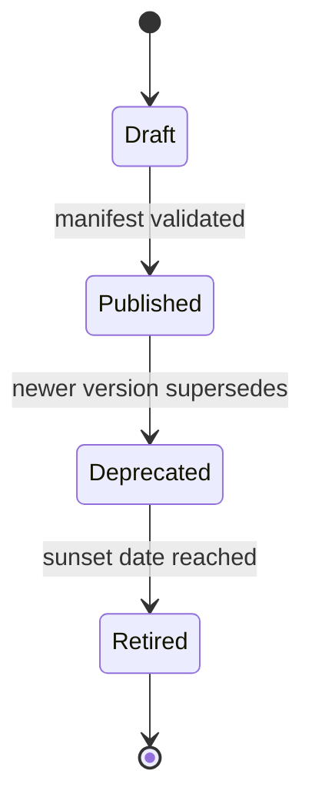
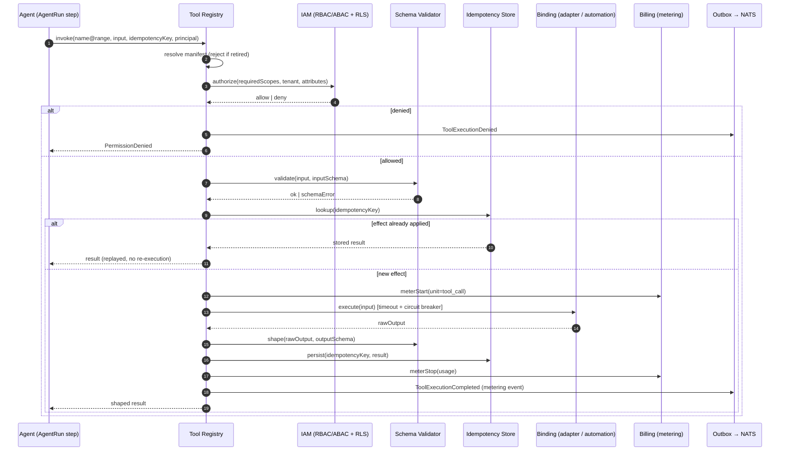
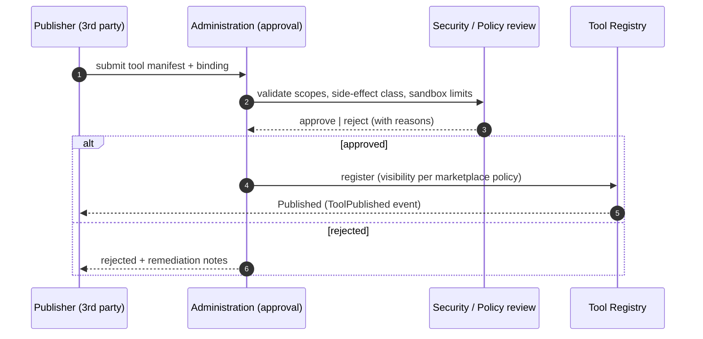
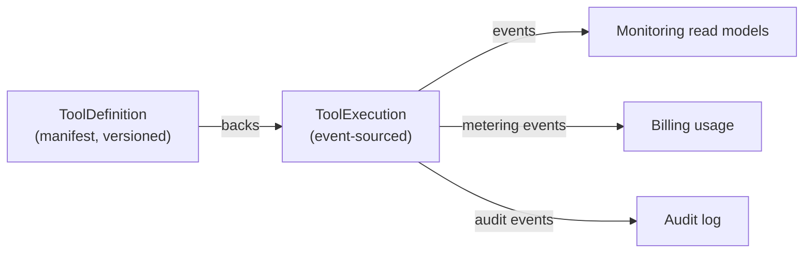
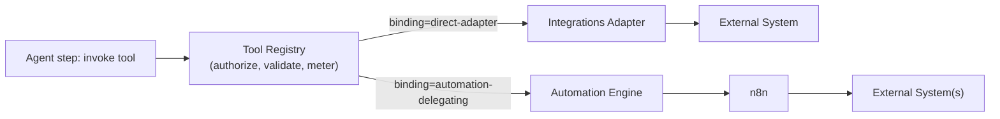

# 07 — Tool Architecture (The Tool Registry)

> The Tools bounded context: how Nizam exposes every capability as a **versioned, permissioned, schema-defined tool** that agents invoke safely, meter, and audit.

**Status:** Approved (Phase 1) | **Version:** 1.0.0 | **Last updated:** 2026-07-01 | **Owner:** Architecture (Nizam Core)

---

## 1. Purpose & Position in the Layer Chain

The Tool Registry sits between the Agent Framework and the Automation Engine in the canonical layer chain:

```
User → Bayan (Brain) → Nizam (AI OS) → Agent Framework → Tool Registry → Automation Engine → n8n → External Systems
```

Every concrete thing Nizam can *do* — read a CRM contact, send a message, kick off a workflow — is expressed as a **tool**. Agents never call adapters, HTTP clients, or n8n directly; they call tools. The Tool Registry is therefore the single, governed surface through which capability enters the system. It is Nizam's equivalent of an operating system's syscall table: a curated, permissioned, versioned catalog of everything that can affect the world.

---

## 2. What a Tool Is

A **tool** is a *versioned, permissioned, schema-defined capability*. Concretely, a tool binds:

- a **stable name** and **SemVer version**;
- an **input JSON Schema** and an **output JSON Schema** (the contract);
- the **permission scopes** a caller must hold;
- a **side-effect class** (read vs write vs delegating);
- **idempotency** semantics, **rate limits**, **timeouts**, and **tenant visibility**;
- a bound **implementation** — either a direct adapter or a delegation to the Automation Engine.

A tool is *declarative first*: its manifest fully describes its contract independent of its implementation, so agents, IAM, Billing, and Monitoring can all reason about it without executing it.

---

## 3. The Tool Manifest

The manifest is the aggregate of record for a tool's contract. It is what the registry stores, what discovery returns, and what validation and metering read.

> The following is **illustrative — design only**. It documents the intended shape; it is not a runtime artifact.

```yaml
# illustrative — design only
toolManifest:
  name: "crm.contact.update"
  version: "1.2.0"                 # SemVer
  title: "Update CRM Contact"
  description: "Applies field changes to an existing contact."
  category: "write-action"        # see §4
  sideEffectClass: "write"        # read | write | delegating | integration
  visibility: "tenant"            # tenant | global | plan-gated
  requiredScopes: ["crm:contact:write"]
  idempotency:
    supported: true
    keyStrategy: "caller-supplied"   # caller-supplied | derived
  rateLimits:
    perTenant: { limit: 120, windowSec: 60 }
    perAgentRun: { limit: 25 }
  timeoutMs: 8000
  retry:
    maxAttempts: 3
    backoff: "exponential"
    retryOn: ["transient", "timeout"]
  circuitBreaker:
    failureThreshold: 0.5
    samplingWindowSec: 30
    openStateSec: 15
  metering:
    unit: "tool_call"
    billable: true
  binding:
    kind: "direct-adapter"        # direct-adapter | automation-delegating
    adapter: "integrations.crm.contactWriter"
  input:                          # JSON Schema (draft 2020-12)
    $schema: "https://json-schema.org/draft/2020-12/schema"
    type: object
    required: ["contactId", "fields"]
    properties:
      contactId: { type: string, format: uuid }
      fields:
        type: object
        additionalProperties: false
        properties:
          fullName: { type: string, maxLength: 200 }
          email: { type: string, format: email }
  output:
    $schema: "https://json-schema.org/draft/2020-12/schema"
    type: object
    required: ["contactId", "updatedAt"]
    properties:
      contactId: { type: string, format: uuid }
      updatedAt: { type: string, format: date-time }
```

Manifest fields, summarized:

| Field | Meaning |
|---|---|
| `name` / `version` | Stable identity + SemVer contract version |
| `input` / `output` | JSON Schema contracts for validation & shaping |
| `requiredScopes` | Permission scopes a caller must hold (RBAC/ABAC) |
| `sideEffectClass` | `read` \| `write` \| `delegating` \| `integration` — drives guardrails/HITL |
| `idempotency` | Whether exactly-once effect is guaranteed and how the key is formed |
| `rateLimits` | Per-tenant and per-run ceilings |
| `timeoutMs` / `retry` / `circuitBreaker` | Safe-invocation controls |
| `metering` | Billing unit and billability |
| `visibility` | Which tenants/plans can see and call the tool |
| `binding` | Direct adapter vs automation-delegating implementation |

---

## 4. Tool Categories

| Category | Side-effect class | Description | Typical binding |
|---|---|---|---|
| **Read / Query** | `read` | Fetches data with no state change; safe to retry freely | direct-adapter |
| **Write / Action** | `write` | Mutates state in Nizam or an external system; guardrail- and HITL-sensitive | direct-adapter or delegating |
| **Automation-Delegating** | `delegating` | Hands off to the Automation Engine → n8n for multi-step / connector-heavy work | automation-delegating |
| **Integration-Bound** | `integration` | Talks to a specific external connector via an Integrations ACL; health- and credential-aware | direct-adapter (Integrations) |

Categories are not merely labels: the side-effect class drives whether HITL approval gates apply (canon Agents §8), how aggressively retries may fire (reads retry freely, writes require idempotency), and how executions meter.

---

## 5. Registration, Discovery & Versioning

### 5.1 Registration

Tools register against a stable manifest contract (canon §5, plugin strategy). First-party tools register at boot; third-party tools register through the Administration approval workflow (§11). Registration validates the manifest (schema well-formedness, scope existence, binding resolvability) and publishes a `ToolPublished` domain event.

### 5.2 Discovery

The Agent Framework and Bayan Gateway discover tools by **capability query**: "which tools satisfy scope X, are visible to tenant T, and are non-deprecated?" Discovery returns manifests only — never implementations — preserving the declarative boundary.

### 5.3 Versioning & deprecation (SemVer)

- **SemVer** governs every manifest (canon §5). MAJOR = breaking contract change (new tool version, callers pin ranges); MINOR = backward-compatible additions; PATCH = fixes.
- Callers (agents) pin a **range** (e.g. `>=1.0.0 <2.0.0`), so MINOR/PATCH roll forward automatically while MAJOR requires an explicit migration.
- **Deprecation lifecycle:** `Published → Deprecated → Retired`. Deprecated versions still execute but emit a `ToolInvokedDeprecated` warning event and are excluded from new discovery; retired versions reject invocation.



---

## 6. Permission Model

Authorization is enforced at two layers (canon §2): the **API/application layer** (RBAC + ABAC) and the **database layer** (RLS).

- Each manifest declares `requiredScopes`. A caller — an agent principal or a user — must hold *all* of them.
- The **effective permission** of an agent-invoked tool is the intersection of the agent definition's declared scopes and the invoking principal's granted scopes; a tool can never elevate privilege.
- **ABAC attributes** (tenant, plan tier, data classification, time-of-day, record ownership) refine RBAC — e.g. a `crm:contact:write` scope may still be denied for records outside the caller's territory.
- **RLS** guarantees that even a correctly-scoped call cannot touch another tenant's rows.

If any check fails, the invocation is rejected before execution with a typed `PermissionDenied`, recorded as a `ToolExecutionDenied` event.

---

## 7. Sandboxed & Safe Invocation Contract

Every tool call flows through a uniform, safe invocation envelope. The registry enforces the following, in order, on each call:

1. **Resolve** the manifest for the requested name+version range; reject if retired/unknown.
2. **Authorize** — RBAC + ABAC + RLS (§6).
3. **Validate input** against the input JSON Schema (reject on failure — no partial execution).
4. **Rate-limit / circuit-break** — check per-tenant + per-run limits and breaker state.
5. **Idempotency** — look up the idempotency key; if a completed effect exists, return the stored result (§9).
6. **Meter (pre)** — record start; open Billing usage span.
7. **Execute** the binding (direct adapter or delegation) inside a timeout, in a sandbox that cannot exceed declared scopes.
8. **Shape output** against the output JSON Schema; strip anything undeclared.
9. **Meter (post)** + emit `ToolExecutionCompleted` / `ToolExecutionFailed`.

Sandboxing means: a tool implementation receives only the tenant context and inputs it declared, may only reach the adapters/scopes in its manifest, and its output is validated and stripped to the declared schema so no accidental data escapes.

### 7.1 Sequence: tool invocation with permission + metering



---

## 8. Input Validation & Output Shaping

- **Input validation** is mandatory and total: an input that fails the JSON Schema is rejected atomically — no side effect occurs. This is the primary defense that lets agents (and Bayan-synthesized arguments) call tools safely.
- **Output shaping** validates the raw result against the output schema and *strips* any field not declared. This gives callers a stable contract and prevents accidental leakage of internal or cross-tenant data.
- Both schemas are the versioned contract: a breaking change to either is a MAJOR version bump (§5.3).

---

## 9. Idempotency, Timeouts, Retries & Circuit Breakers

- **Idempotency keys.** Write and delegating tools require a caller-supplied key (agents form it as `runId:stepIndex:hash(input)`, canon Agents §5.3). The registry records `(tenant, tool, key) → result`; a replay returns the stored result rather than re-executing, delivering **exactly-once effect** even under retries (canon §6.9).
- **Timeouts.** Every execution runs under `timeoutMs`; a breach fails fast with a `Timeout` typed error that is retry-eligible.
- **Retries.** Governed by the manifest `retry` policy (max attempts, exponential backoff, retry-on classes). Retries are safe precisely because of idempotency.
- **Circuit breakers.** Per-binding breakers track failure rates; when open, calls fail fast with `CircuitOpen` and shed load off a failing dependency, protecting the platform and the tenant's budget. Breaker transitions emit events for Monitoring.

---

## 10. Cost / Metering Hooks (Billing)

Metering is woven into the invocation contract (§7 steps 6 & 9). Each execution emits a metering event carrying `tenant_id`, tool name+version, `unit` (e.g. `tool_call`, and where applicable token usage from any `LlmProvider` sub-call), duration, and outcome. Billing consumes these to enforce **quotas** and produce **usage-based invoices** (canon §4.8). Because executions are event-sourced (§12), metering is reconcilable and auditable — usage can be recomputed by replaying the execution stream.

---

## 11. Plugin Strategy for Third-Party Tools

Third-party tools are first-class plugins registered against the same manifest contract (canon §5), but they pass a governed approval workflow owned by the **Administration** context (canon §4.12).



Approved third-party tools inherit the entire safety envelope (permissions, validation, idempotency, metering, breakers) — there is no privileged path around the registry.

---

## 12. Aggregates & Event Sourcing

Two aggregates own the context's invariants; both follow canon §3 (UUID v7 `id`, `tenant_id` where scoped, soft delete, audit columns) and Clean Architecture layering (canon §5).

### 12.1 ToolDefinition (configuration aggregate)

- Holds the manifest; **invariants:** version immutable once published; `requiredScopes` reference existing IAM scopes; binding is resolvable; input/output are valid JSON Schema.
- Lifecycle `Draft → Published → Deprecated → Retired` (§5.3); optimistic concurrency via `version INT`.

### 12.2 ToolExecution (event-sourced aggregate)

- One record per invocation; **event-sourced** — its state is the fold of `ToolExecutionRequested`, `ToolExecutionDenied`, `ToolExecutionCompleted`, `ToolExecutionFailed`, `ToolExecutionRetried`, `CircuitOpened` events (canon §3, §5).
- Provides audit, metering reconciliation, and CQRS read models for Monitoring.



---

## 13. Contrast: Direct-Adapter Tool vs Automation-Delegating Tool

Both are invoked identically by the agent; they differ only in their `binding`.

| Aspect | Direct-adapter tool | Automation-delegating tool |
|---|---|---|
| Binding | Calls an in-process adapter / Integrations ACL | Delegates to the Automation Engine → n8n |
| Latency | Synchronous, low latency | May be async / long-running; run parks and resumes on event |
| Best for | Single, well-typed operation (read a contact, send one email) | Multi-step, connector-heavy, operator-authored flows |
| Idempotency | Enforced in the registry | Enforced in the registry **and** carried into n8n via idempotency key (see 08-Automation) |
| Failure model | Retry / circuit-break at the adapter | Retry + Saga compensation across the workflow |
| Metering | One `tool_call` unit | `tool_call` unit + automation-execution units (Billing) |



The registry keeps both paths behind one uniform contract, so an agent — and Bayan's plan — never needs to know *how* a capability is fulfilled, only *that* it is available, permitted, and metered.

---

## Related Documents

- **[06-Agent-Architecture.md](06-Agent-Architecture.md)** — the Agent Framework that invokes tools.
- **[08-Automation-Architecture.md](08-Automation-Architecture.md)** — the Automation Engine that delegating tools call.
- **[05-Bounded-Contexts.md](05-Bounded-Contexts.md)** — the ACL adapters that back integration-bound tools.
- **[05-Bounded-Contexts.md](05-Bounded-Contexts.md)** — RBAC/ABAC scopes and RLS enforcing tool permissions.
- **[05-Bounded-Contexts.md](05-Bounded-Contexts.md)** — metering, quotas, and usage-based invoicing.
- **[05-Bounded-Contexts.md](05-Bounded-Contexts.md)** — read models and SLOs over ToolExecution events.
- **[05-Bounded-Contexts.md](05-Bounded-Contexts.md)** — third-party tool approval workflow.
- **[21-Database-Design.md](21-Database-Design.md)** — ToolDefinition / ToolExecution schema design.
- **[19-Assumptions.md](19-Assumptions.md)** — recorded gaps and assumptions.

## Change Log

| Version | Date | Author | Change |
|---|---|---|---|
| 1.0.0 | 2026-07-01 | Architecture (Nizam Core) | Initial approved Phase 1 architecture for the Tool Registry (Tools bounded context). |
