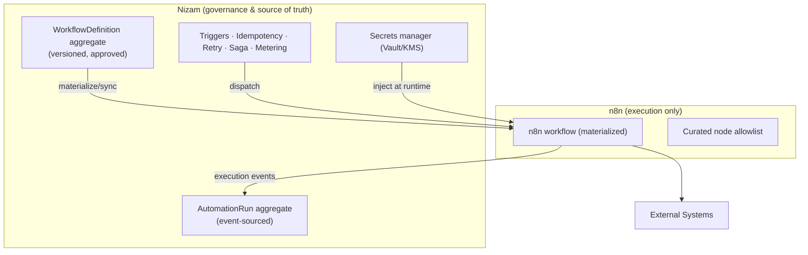
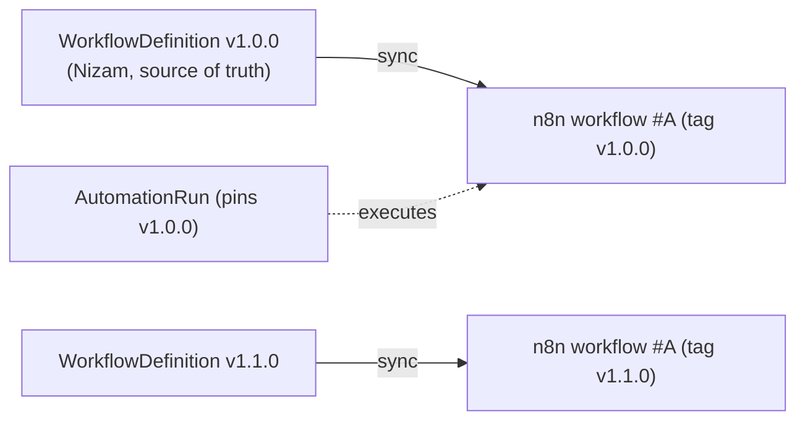
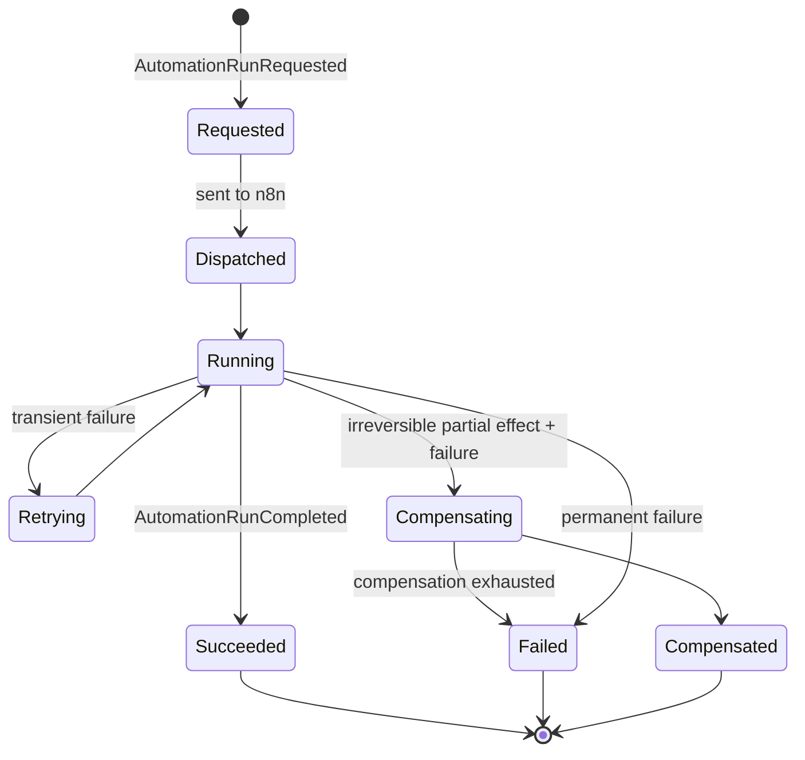
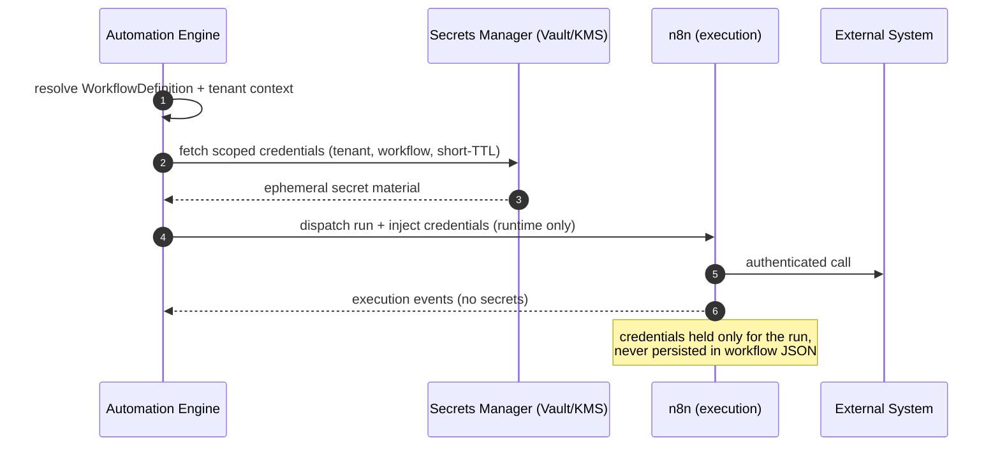
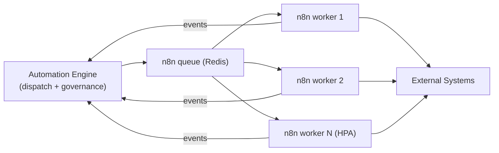
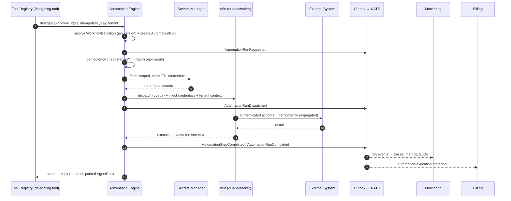

# 08 — Automation Architecture (The Automation Engine wrapping n8n)

> The Automation bounded context: how Nizam owns, governs, and drives a self-hosted **n8n** as its workflow execution substrate — with definitions, isolation, idempotency, and observability owned by Nizam, not by n8n.

**Status:** Approved (Phase 1) | **Version:** 1.0.0 | **Last updated:** 2026-07-01 | **Owner:** Architecture (Nizam Core)

---

## 1. Purpose & Position in the Layer Chain

The Automation Engine is the link between the Tool Registry and external systems:

```
User → Bayan (Brain) → Nizam (AI OS) → Agent Framework → Tool Registry → Automation Engine → n8n → External Systems
```

The **Automation Engine** is an internal Nizam service (a PHP module, canon §2, §4.5) that is the sole owner and driver of a **self-hosted n8n** instance. When a tool needs multi-step, connector-heavy, operator-authored work done, it delegates to the Automation Engine, which governs and dispatches the corresponding n8n workflow, then reports results and events back into Nizam.

---

## 2. Why n8n

n8n is the **execution substrate** for automations because it uniquely combines two things Nizam needs and should not rebuild:

- **Visual workflows for non-technical operators.** Canon §7 mandates non-technical target users. n8n's visual, node-based editor lets operators compose and adjust automations without code — matching Nizam's UX philosophy (Basic/Advanced mode, wizards).
- **A huge connector library.** n8n ships hundreds of maintained integrations, giving Nizam broad reach into external SaaS without hand-writing every adapter.

n8n is chosen for *execution and authoring ergonomics*. It is deliberately **not** trusted with governance, tenancy, secrets, or observability — those remain Nizam's responsibility (§3).

---

## 3. The Boundary: Nizam Governs, n8n Executes

This is the governing principle of this context:

> **Nizam owns the `WorkflowDefinition` and `AutomationRun` aggregates and all governance. n8n is the execution substrate — nothing more.**

| Concern | Owner |
|---|---|
| Workflow definition of record, versioning, approval | **Nizam** (Automation Engine) |
| Multi-tenancy, isolation, RLS on run metadata | **Nizam** |
| Triggers, idempotency, retries, compensation policy | **Nizam** |
| Credential/secret resolution & injection | **Nizam** (secrets manager) |
| Metering, audit, observability, SLOs | **Nizam** (Monitoring/Billing) |
| Node execution, connector library, visual editor | **n8n** |

n8n never becomes a source of truth. If the n8n instance were rebuilt from scratch, Nizam could re-materialize every workflow from its own `WorkflowDefinition` aggregates.



---

## 4. How Tools & Agents Delegate to Automations

An **automation-delegating tool** (07-Tool-Architecture §13) binds to the Automation Engine instead of a direct adapter. The agent invokes the tool exactly as any other; the Tool Registry authorizes, validates, meters, and then hands the shaped input plus the idempotency key to the Automation Engine. The Engine resolves the target `WorkflowDefinition`, creates an `AutomationRun`, and dispatches n8n. Long-running automations are **non-blocking**: the calling `AgentRun` parks and resumes on an `AutomationRunCompleted` integration event (canon §6). The agent never talks to n8n directly — the boundary of §3 is preserved.

---

## 5. Triggers

A `WorkflowDefinition` declares one or more trigger types:

| Trigger | Description | Governance note |
|---|---|---|
| **Event** | Fires on a Nizam domain/integration event (NATS JetStream) | Subscription owned by the Engine; tenant-scoped |
| **Schedule** | Cron-like recurring execution | Scheduled per tenant; quota-aware |
| **Manual** | Operator- or agent-initiated (via a delegating tool) | Permission-checked at the tool boundary |
| **Webhook** | Inbound HTTP from an external system | Authenticated, tenant-routed, rate-limited by the Engine (not by raw n8n) |

All triggers pass through the Automation Engine so that tenant context, permission, quota, and idempotency are applied *before* n8n runs.

---

## 6. Workflow Versioning & Nizam ↔ n8n Mapping

- **Versioning.** `WorkflowDefinition` is SemVer-versioned (canon §5). A published version is immutable; edits produce a new version. Runs pin the version they executed for reproducibility.
- **Mapping.** Nizam maintains a mapping between each `WorkflowDefinition` version and its materialized n8n workflow (by stable external id + version tag). Publishing a definition **syncs** it into n8n; the n8n workflow is a *projection* of the Nizam definition, never edited out-of-band as a source of truth.



- **Lifecycle:** `Draft → Published → Deprecated → Retired`, aligned with tool/agent versioning. Publishing to production may itself require an approval step (Administration).

---

## 7. Idempotency & Exactly-Once Effect

- Every delegated automation carries an **idempotency key** originating from the calling tool/agent (`runId:stepIndex:hash(input)`, canon Agents §5.3 / Tools §9).
- The Automation Engine records `(tenant, workflowDefinition, idempotencyKey) → AutomationRun`; a replay with the same key returns the prior run's result instead of re-executing — delivering **exactly-once effect** across retries and redelivery (canon §6.9).
- The key is propagated into n8n as execution metadata and, where a node performs an external write, into the downstream request (e.g. as an idempotency header) so external systems also dedupe.

---

## 8. Retries, Backoff, Error Handling & Compensation

- **Retries & backoff.** Transient node failures retry per the definition's policy (max attempts, exponential backoff). Retries are safe because of §7.
- **Error handling.** n8n error paths surface back to the Engine as typed failures; the Engine, not n8n, decides retry vs fail vs compensate.
- **Compensation / Saga.** Multi-step automations that produce irreversible external effects participate in the Nizam **Saga / Process Manager** (canon §5). On failure after partial effects, the Engine drives compensating actions in reverse order and records them as events — consistent with cross-context compensation initiated by an `AgentRun` (06-Agent §11).

---

## 9. Run History & Observability (Event-Sourced AutomationRun)

`AutomationRun` is an **event-sourced** aggregate (canon §3, §5): its state is the fold of `AutomationRunRequested`, `AutomationRunDispatched`, `AutomationStepCompleted`, `AutomationRunRetried`, `AutomationRunCompensating`, `AutomationRunCompleted`/`Failed`/`Compensated` events.



Events publish via the Transactional Outbox → NATS JetStream and are consumed by Monitoring (traces via OpenTelemetry → Tempo; metrics → Prometheus/Grafana; logs → Loki) and Billing (automation-execution metering) (canon §2, §4.8, §4.9). Run history is fully replayable and auditable — the n8n execution log is a convenience, not the record of truth.

---

## 10. Credential & Secret Injection

Secrets are **never** stored in workflow JSON. n8n workflows reference secrets by logical name only.



Credentials are resolved per-tenant from the abstracted secrets manager (canon §2), scoped and short-TTL, injected into the n8n execution context at runtime, and never written into the workflow definition or exported logs.

---

## 11. Multi-Tenant Isolation of n8n Executions

- **Per-tenant execution context.** Every dispatch carries `tenant_id`; the Engine tags each n8n execution with its tenant and refuses cross-tenant references.
- **RLS on run metadata.** All `AutomationRun` metadata lives in PostgreSQL 16 under Row-Level Security keyed by `tenant_id` (canon §3), so no tenant can read another's run history.
- **Scaling tiers.** Isolation follows the Silo/Bridge/Pool model (canon §3): shared workers with strict per-tenant context by default; dedicated worker pools (or dedicated n8n instances) offered as higher isolation tiers.
- Credentials are tenant-scoped (§10), so even a shared worker cannot reach another tenant's external systems.

---

## 12. Scaling n8n (Queue Mode, Workers)

n8n runs in **queue mode** with a Redis-backed queue and a horizontally scalable pool of **worker** processes, deployed on Kubernetes with horizontal pod autoscaling (canon §2). The Automation Engine dispatches through this queue, giving backpressure, per-tenant concurrency caps, and elastic throughput without changing the governance model. Workers are stateless with respect to source of truth; the durable record remains the Nizam `AutomationRun` event stream.



---

## 13. Security & Node Governance

- **n8n is locked down.** No public editor exposure; the instance is reachable only by the Automation Engine over the internal network with mTLS (canon §2).
- **No arbitrary code nodes for tenants.** Function/Code nodes and other arbitrary-execution nodes are disabled for tenant-authored workflows to prevent sandbox escape and untrusted code execution.
- **Curated node allowlist.** Only vetted connector nodes are enabled; new nodes are added via the Administration approval workflow (canon §4.12), matching the third-party tool/plugin governance in 07-Tool-Architecture §11.
- **Least privilege.** Workers hold no standing credentials; secrets are injected per run (§10) and scoped per tenant (§11).

---

## 14. End-to-End Sequence: Automation Engine → n8n → External System



---

## Related Documents

- **[06-Agent-Architecture.md](06-Agent-Architecture.md)** — agents whose steps delegate to automations; Saga compensation.
- **[07-Tool-Architecture.md](07-Tool-Architecture.md)** — automation-delegating tools and the invocation contract.
- **[05-Bounded-Contexts.md](05-Bounded-Contexts.md)** — external connectors and connection health.
- **[10-Security-Strategy.md](10-Security-Strategy.md)** — secrets manager, mTLS, node lockdown.
- **[05-Bounded-Contexts.md](05-Bounded-Contexts.md)** — automation-execution metering and quotas.
- **[05-Bounded-Contexts.md](05-Bounded-Contexts.md)** — read models and SLOs over AutomationRun events.
- **[05-Bounded-Contexts.md](05-Bounded-Contexts.md)** — node allowlist and workflow approval governance.
- **[21-Database-Design.md](21-Database-Design.md)** — WorkflowDefinition / AutomationRun schema and RLS design.
- **[19-Assumptions.md](19-Assumptions.md)** — recorded gaps and assumptions.

## Change Log

| Version | Date | Author | Change |
|---|---|---|---|
| 1.0.0 | 2026-07-01 | Architecture (Nizam Core) | Initial approved Phase 1 architecture for the Automation Engine wrapping n8n (Automation bounded context). |
