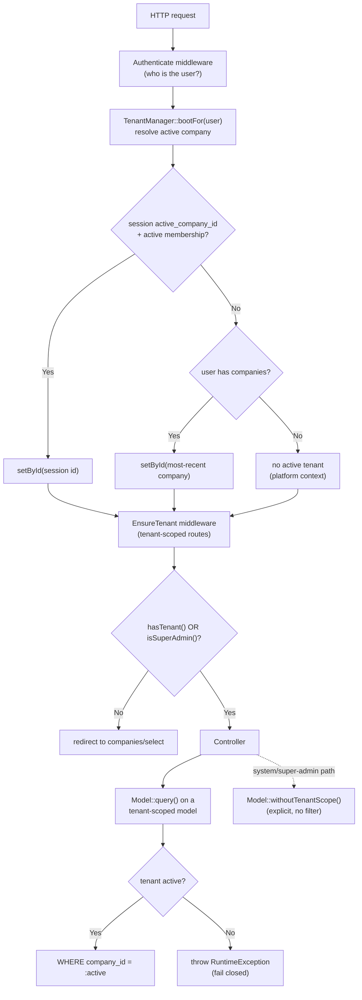

# 08 — Multi-Tenancy (العزل بين المستأجرين)

How HalaOps isolates thousands of customer companies in a single shared database using row-level `company_id` scoping enforced at the model layer, with **fail-closed** guarantees.

## Related Documents

- [05 — Database Architecture](05-Database-Architecture.md) — schema conventions, `company_id` columns, FKs and indexes.
- [07 — RBAC](07-RBAC.md) — tenant roles resolve against the active tenant established here.
- [34 — Security](34-Security.md) — isolation as a security property; the threat model for cross-tenant leakage.
- [36 — Scalability](36-Scalability.md) — the sharding/evolution path beyond a single shared database.

---

## Purpose (الهدف)

This document specifies HalaOps's **multi-tenancy model**: a shared MySQL database with **row-level isolation by `company_id`**, enforced automatically at the model layer and failing closed when no tenant is active. It covers tenant resolution, the `withoutTenantScope()` escape hatch, the super-admin platform context, the isolation guarantees and how leakage is prevented, the trade-offs versus database-per-tenant, and the evolution path toward sharding.

The model is implemented by:

- `App\Services\Tenancy\TenantManager` (`app/Services/Tenancy/TenantManager.php`) — holds the active company id for the request and is the single authority the model layer consults.
- `App\Core\Model` (`app/Core/Model.php`) — auto-scopes every tenant-bound query and stamps `company_id` on insert; throws if scoped with no active tenant.
- `App\Services\Tenancy\CompanyService` (`app/Services/Tenancy/CompanyService.php`) — provisions a complete tenant atomically.
- `App\Http\Middleware\EnsureTenant` (`app/Http/Middleware/EnsureTenant.php`) — guarantees a tenant context for tenant-scoped areas.

## Why It Exists (سبب وجوده)

HalaOps is delivered as a buyer-installed SaaS that must run on **cheap shared hosting with no CLI** (no SSH/Composer/Artisan/npm). A database-per-tenant design would require provisioning a new schema for every signup — impossible to do safely from a browser installer on shared hosting, and operationally heavy at "thousands of companies". A **single shared database with a `company_id` column on every tenant table** provisions a new tenant with a handful of `INSERT`s inside one transaction (`CompanyService::create()`), needs no DBA, and scales to many tenants on modest infrastructure.

The risk of shared-DB tenancy is well known: one forgotten `WHERE company_id = ?` leaks another customer's data. HalaOps removes that class of bug structurally by moving the scope **into the model layer** and making the *absence* of a tenant a hard error rather than an unscoped query. Developers do not write the tenant filter; they cannot forget it; and if they try to query a tenant table with no tenant set, the request throws instead of leaking. That is the central design bet of this document.

## Architecture

### Component responsibilities

| Component | File | Responsibility |
|-----------|------|----------------|
| `TenantManager` | `app/Services/Tenancy/TenantManager.php` | Single source of the active tenant. `id()`, `company()`, `hasTenant()`, `shouldScope()`, `setTenant()`, `setById()`, `clear()`, `bootFor()`, `userBelongsTo()`. Container singleton (alias `tenant`). |
| `Model` (base) | `app/Core/Model.php` | `query()` auto-adds `WHERE company_id = :active` for tenant-scoped models and **throws** if none is set; `create()` stamps `company_id`; `withoutTenantScope()` returns an unscoped builder. |
| `CompanyService` | `app/Services/Tenancy/CompanyService.php` | Atomic tenant provisioning (company row, owner membership, default roles, owner assignment, trial subscription) using the raw connection with explicit ids. |
| `EnsureTenant` | `app/Http/Middleware/EnsureTenant.php` | Middleware `tenant`: requires an active company for tenant-scoped routes; lets super admins through; redirects others to company selection. |
| `Company` / `Membership` models | `app/Models/` | `companies` is the global tenant root (cannot scope to itself); `memberships` link users to companies and gate which tenant a user may activate. |

### Tenant-scoped vs global models

A model opts into scoping with `protected static bool $tenantScoped = true;` and `protected static string $tenantColumn = 'company_id';`. Global models (`User`, `Company`, `Plan`, `Permission`, the global `roles`, `password_resets`) leave `$tenantScoped = false`. The `companies` table is the **tenant root** and is global by necessity — a tenant cannot scope to itself.

### The model-layer scope (the load-bearing code)

`Model::query()` is the choke point every tenant read/write passes through:

```php
public static function query(): QueryBuilder
{
    $builder = static::db()->table(static::$table);

    if (static::shouldApplyTenantScope()) {
        $tenantId = static::currentTenantId();
        if ($tenantId === null) {
            // Fail closed AND loud.
            throw new \RuntimeException(
                static::class . ' is tenant-scoped but no active tenant is set. '
                . 'Use ' . static::class . '::withoutTenantScope() for cross-tenant access.'
            );
        }
        $builder->where(static::$tenantColumn, '=', $tenantId);
    }

    return $builder;
}
```

`shouldApplyTenantScope()` is true only when the model is tenant-scoped, the container has a `tenant` binding, and `TenantManager::shouldScope()` returns true (it always does — scoping is permanent for tenant models). On insert, `create()` stamps `company_id` from `currentTenantId()` if the caller didn't supply it. The only way to bypass this is `withoutTenantScope()`, which returns a raw `QueryBuilder` with no filter.

### Diagram — request lifecycle and where scoping applies



## Workflow

### Tenant resolution (`TenantManager::bootFor(User $user)`)

Resolution runs once per request after authentication, guarded by a `booted` flag so it cannot double-run:

1. Read `session('active_company_id')` (key from `config('auth.tenant_key')`).
2. If it is numeric **and** `userBelongsTo($user, $id)` — i.e. the user still has an **active** membership in that company — adopt it via `setById()`. This is the "stay where I was" path across requests.
3. Otherwise, take the user's companies (active memberships, most-recent first via `User::companies()`); if any exist, adopt the first.
4. Otherwise leave no active tenant. A fresh super admin (no memberships) or a brand-new registrant simply has `id() === null` and operates in **platform context**.

`setTenant()`/`setById()` persist the chosen id back into the session, so an explicit company switch (`companies/switch`) is remembered. `clear()` removes it (used on logout).

### Tenant provisioning (`CompanyService::create()`)

Creating a company is **one transaction** producing a fully-functional tenant:

1. Insert the `companies` row (`status = 'trial'`, unique slug via `Company::uniqueSlug()`).
2. Insert the creator's `memberships` row (`status = 'active'`, `title = 'Owner'`).
3. `RbacManager::provisionCompanyRoles($companyId)` — create the company's default roles and wire inheritance.
4. Assign the `owner` role to the owner membership (`assignMembershipRole`).
5. `startTrialSubscription()` — attach a trial subscription on the first active plan.
6. Write an `activity_log` entry (`company.created`).

All writes use the raw `Database` with **explicit `company_id`** values, never the tenant scope — because the company being created is, by definition, not yet the active tenant. If any step fails, the transaction rolls back and no half-tenant survives.

### Switching / selecting a tenant

`companies/select` and `companies/switch` (see `routes/web.php`) let a multi-company user pick the active tenant. `switch` validates membership (`userBelongsTo`) before calling `setById()`, so a user can never activate a company they don't belong to.

## Business Rules

1. **Every tenant-bound table carries `company_id`** with an FK to `companies` (indexed). Companies are the tenant root; `companies` itself is global.
2. **Tenant scoping is always on for tenant-scoped models.** `TenantManager::shouldScope()` returns `true` unconditionally; there is no per-request toggle to weaken it.
3. **Fail closed.** Querying a tenant-scoped model with no active tenant throws a `RuntimeException` — never an unscoped query. Reads and writes are equally protected.
4. **The only escape is explicit.** `Model::withoutTenantScope()` is the single opt-out, reserved for super-admin/system/installer code paths and used deliberately (e.g. `User::withoutTenantScope()` during login, `CompanyService` provisioning).
5. **Resolution order is session → active membership → most-recent company → none.** Only an **active** membership lets a user adopt a company.
6. **Super admins may operate with no tenant.** `EnsureTenant` lets `isSuperAdmin()` through even without an active company, enabling platform-wide work via global roles + `withoutTenantScope()`.
7. **A user can only activate a company they actively belong to.** `userBelongsTo()` checks for `status = 'active'`; switching is validated against it.
8. **Inserts auto-stamp `company_id`** from the active tenant when not supplied, so created rows always land in the right tenant.
9. **Uniqueness is per-company where relevant** (e.g. `roles (company_id, slug)`, `settings (company_id, key)`, `ai_credentials (company_id, provider)`, planned `jobs (company_id, slug)`), so two tenants can use the same slug/key independently.
10. **Logout clears the tenant** (`AuthManager::logout()` forgets `active_company_id`) so a recycled session never carries a stale tenant.

## Database Relations

Consistent with §11 of the canonical context. The tenancy mechanism relies on:

| Table | Role in tenancy | Key constraints |
|-------|-----------------|-----------------|
| `companies` | Tenant root (global) | `id` PK, `slug` UNIQUE, `owner_id`→`users` (RESTRICT), `status[trial|active|suspended|canceled]`, `settings JSON`. |
| `memberships` | User↔tenant link gating activation | `UNIQUE(company_id, user_id)`, `INDEX(user_id, status)`; FK `company_id`→`companies` CASCADE. Only `status='active'` activates a tenant. |
| Every tenant table | Scoped rows | `company_id BIGINT UNSIGNED` FK→`companies` (CASCADE for child rows), **indexed**. Examples (built): `subscriptions`, `ai_credentials`, `settings`, `onboarding_progress`, `activity_log`; tenant `roles`. Examples (planned): `jobs`, `applications`, `interviews`, `evaluations`, `files`, `invoices`, `payments`. |

Deleting a company cascades all its child rows via the `ON DELETE CASCADE` FKs, so removing a tenant cleanly removes its data — a property that depends on every tenant table actually declaring the FK (enforced by the schema conventions in [05 — Database Architecture](05-Database-Architecture.md)).

## Permissions

Multi-tenancy is the substrate beneath RBAC, not itself a permissioned feature, but it interacts with [07 — RBAC](07-RBAC.md):

- **Which tenant is active** decides **which tenant roles** contribute to a user's effective permissions (`AccessControl` resolves `membership_role` for the active `company_id`).
- **Selecting/switching a company** requires only an active membership (no permission key), enforced by `userBelongsTo()`.
- **`withoutTenantScope()`** is effectively a privileged operation: it is only reached by super-admin/system code, and any user-facing cross-tenant view is additionally gated by platform permissions (`platform.companies.view`, `platform.companies.manage`).
- Per-company features (members, billing, AI, settings) are gated by their own permission keys *within* the active tenant.

## Validation

- **Company creation**: `name` required, max 150 (`companies.name VARCHAR(150)`); slug is system-generated and made unique (`Company::uniqueSlug()`), never user-supplied raw.
- **Company switch**: target `company_id` must be numeric and must correspond to an **active** membership of the current user (`userBelongsTo`); otherwise the switch is rejected and the active tenant is unchanged.
- **Session tenant value**: validated as numeric and re-checked against membership on every `bootFor()` — a tampered `active_company_id` cookie/session is ignored if the user lacks an active membership there.
- **Tenant id on writes**: when callers pass `company_id` explicitly (system paths), it must reference an existing company (FK enforced); otherwise the model stamps the active tenant.

## Edge Cases

- **No active tenant + tenant-scoped query** → `RuntimeException` (fail closed). Caught by central error handling; surfaces as a 500/diagnostic in debug, never as leaked data.
- **User removed from a company they had active** → next `bootFor()` finds the session id but `userBelongsTo()` is now false, so it falls back to another company or platform context; `EnsureTenant` then routes them to selection.
- **User belongs to zero companies** → platform context; tenant-scoped routes redirect to `companies/select`/`companies/create` (super admins excepted).
- **Super admin with no membership** → allowed through `EnsureTenant`; tenant-scoped *models* still require either an active tenant or `withoutTenantScope()`, so platform screens use the unscoped builder deliberately.
- **Stale session tenant after company deletion** → `Company::find()` in `setById()` returns null → `setById()` returns false → no tenant adopted; user is routed to selection.
- **Cross-tenant id in a request param** (e.g. `/jobs/{id}` for another company's job) → the scoped `Model::find()` adds `WHERE company_id = :active`, so the foreign id simply isn't found → 404, not a leak.
- **Concurrent company switch** → tenant lives in `TenantManager` (request-scoped) and session; last write wins per request, with no cross-request bleed because the app tier is stateless.

## Security

Isolation is the headline security property of HalaOps; threats and mitigations:

- **Threat: forgotten `WHERE company_id`** → **Mitigation:** the filter is added by `Model::query()`, not by hand. Developers cannot omit it.
- **Threat: querying with no tenant (mass data exposure)** → **Mitigation:** fail-closed `RuntimeException`. No tenant ⇒ no rows, by exception, not by empty filter.
- **Threat: tampered `active_company_id`** → **Mitigation:** every adoption is re-validated against an **active** membership (`userBelongsTo`); a forged id for a company the user doesn't belong to is ignored.
- **Threat: IDOR across tenants** (guessing another company's row id) → **Mitigation:** scoped lookups can't see other tenants' rows → 404. Per-company uniqueness avoids id collisions of meaning.
- **Threat: privileged escape hatch misuse** → **Mitigation:** `withoutTenantScope()` is greppable, reserved for system/super-admin code, and any user-facing cross-tenant view is additionally gated by `platform.*` permissions and the super-admin bypass.
- **Threat: residual tenant after logout/session reuse** → **Mitigation:** `logout()` clears `active_company_id` and invalidates the session.
- **Defence in depth:** FK constraints + per-company unique keys mean even a raw mistake cannot create a row pointing at a non-existent company, and cannot collide two tenants' unique values.
- **Audit:** `activity_log` carries `company_id` so security/business events are attributable to a tenant (§13, [38 — Audit System](34-Security.md)).

## Performance

- **Indexed scoping.** Every tenant table indexes `company_id` (alone and as the leading column of composite indexes like `applications(company_id, job_id, status, current_stage_id)`), so the auto-added `WHERE company_id = ?` is selective and cheap — queries touch only one tenant's slice.
- **No cross-tenant scans** in normal flow: scoped queries never read another tenant's rows, keeping working sets small.
- **One resolution per request:** `bootFor()` runs once (guarded by `booted`); `company()` lazy-loads and memoises the `Company`.
- **Connection efficiency:** a single shared PDO connection serves all tenants (no per-tenant connection pool), which is exactly what makes shared-hosting deployment viable.
- **Hot paths:** dashboards and list views rely on the leading `company_id` index plus pagination (§13/§35) to stay fast as tenant count grows.

### Trade-offs vs database-per-tenant

| Dimension | Shared DB + `company_id` (HalaOps) | Database-per-tenant |
|-----------|-----------------------------------|---------------------|
| Provisioning | A few `INSERT`s in one transaction; instant, browser-installable | Create/migrate a schema per tenant; needs DBA/CLI |
| Cost at scale | One DB serves thousands of tenants | DB/schema per tenant — expensive |
| Migrations | Run once for everyone | Run N times, must track per-tenant state |
| Noisy-neighbour | Possible; mitigated by indexes, pagination, queues | Strong physical isolation |
| Blast radius of a bug | Higher in theory — mitigated by fail-closed model scope | Lower (physical) |
| Per-tenant backup/restore | Harder (row-level export) | Trivial (per DB) |
| Fit for HalaOps's no-CLI, shared-hosting target | Excellent | Poor |

HalaOps chooses shared-DB for deployability and cost, and buys back the isolation guarantee in software (fail-closed model scope + validated resolution + FK/unique constraints).

## Testing

**Unit (`Model` scoping):**
- Tenant-scoped model with active tenant → generated SQL includes `WHERE company_id = :active`.
- Tenant-scoped model with **no** tenant → `query()` throws `RuntimeException`.
- `create()` stamps `company_id` from the active tenant when omitted; respects an explicit value.
- `withoutTenantScope()` produces SQL with **no** tenant filter.
- Global model (`User`) never adds a tenant filter.

**Unit (`TenantManager`):**
- `bootFor` prefers a valid session id; ignores a session id with no active membership; falls back to most-recent company; leaves none when the user has no companies.
- `userBelongsTo` is false for `invited`/`suspended` memberships.
- `setTenant`/`clear` write/forget the session key.

**Feature / security (the important ones):**
- Tenant A user cannot read Tenant B's row by id (scoped `find` → 404).
- Switching company changes which rows are visible and which tenant roles apply.
- Tampered `active_company_id` for a non-member company is ignored.
- `CompanyService::create` is atomic: forcing a failure mid-transaction leaves **no** company/membership/roles/subscription.
- Super admin can read across tenants only via `withoutTenantScope()`/platform screens, and a non-super-admin cannot reach those paths.

## Future Expansion

- **Tenant sharding.** Because the active tenant is centralised in `TenantManager` and the connection is resolved through the container, HalaOps can map `company_id → shard` and have `Model::db()`/the container hand back a shard-specific connection without touching call sites. The `company_id` already present on every row is the shard key.
- **Read replicas.** Route scoped reads to replicas while writes go to the primary; the model layer is the natural place to choose the connection.
- **Per-tenant data residency / large-tenant promotion.** A "noisy" or regulated tenant can be migrated to its own database; the scope abstraction means application code is unchanged.
- **Tenant-aware caching.** Cache keys can be namespaced by `company_id` for safe per-tenant cache invalidation.
- **Soft-delete / suspend at the tenant level.** `companies.status` already models `suspended`/`canceled`; middleware can short-circuit suspended tenants. See [36 — Scalability](36-Scalability.md).

## Open Questions

None at this time. The shared-DB, row-level, fail-closed model is fully implemented in `Model`, `TenantManager`, `CompanyService`, and `EnsureTenant`. The sharding evolution is intentionally deferred (documented above) and does not require schema or call-site changes when undertaken.
