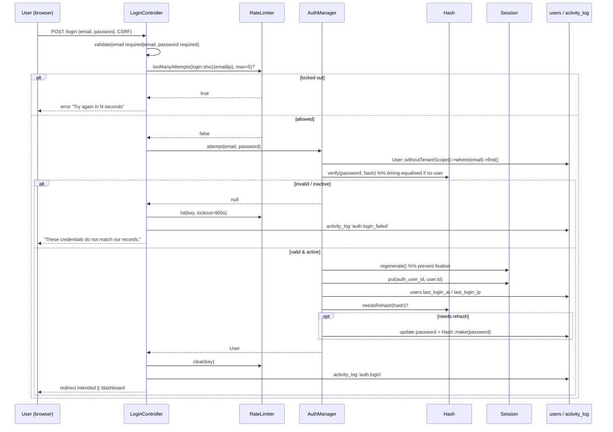
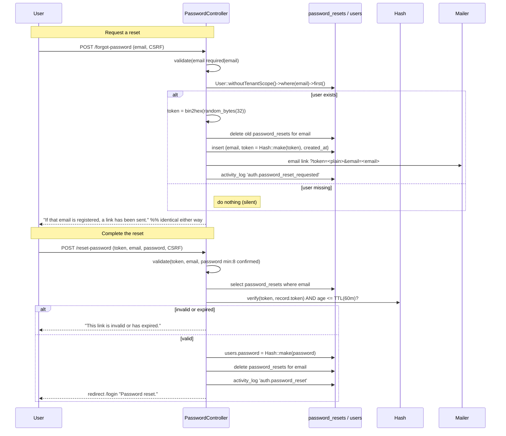

# 09 — Authentication (المصادقة)

The single platform-wide login, registration, and password-reset flow — Argon2id hashing with transparent rehash, hardened sessions, login throttling, and anti-enumeration reset tokens.

## Related Documents

- [07 — RBAC](07-RBAC.md) — what a user can do *after* authentication is decided entirely by roles, not by login.
- [10 — Authorization](10-Authorization.md) — the difference between authentication (who you are) and authorization (what you may do).
- [34 — Security](34-Security.md) — the platform-wide security posture this flow contributes to.

---

## Purpose (الهدف)

This document specifies HalaOps **authentication**: one login / register / forgot / reset flow for the entire platform; password hashing with Argon2id (bcrypt fallback) and transparent rehash; session security (regeneration, hardened cookies); login throttling; anti-enumeration password reset with hashed, time-limited tokens; optional company creation during registration; and logout.

Implemented by:

- `App\Services\Auth\AuthManager` (`app/Services/Auth/AuthManager.php`) — session-backed identity: `attempt()`, `validate()`, `login()`, `logout()`, `user()`, `check()`, `id()`.
- `App\Controllers\Auth\LoginController`, `RegisterController`, `PasswordController` (`app/Controllers/Auth/`) — the HTTP endpoints.
- `App\Core\Hash` — Argon2id/bcrypt hashing and `needsRehash`.
- `App\Core\Session` — hardened session and CSRF.
- `App\Support\RateLimiter` (`app/Support/RateLimiter.php`) — file-backed login throttle.
- `config/auth.php` — TTLs, attempt limits, session/tenant keys.

## Why It Exists (سبب وجوده)

HalaOps has **one users table** and **one identity** per person (see [07 — RBAC](07-RBAC.md)). It would be wrong to build separate logins for "candidate", "recruiter", "admin" — the same human is different roles in different companies. So there is exactly **one** authentication surface, and everything downstream (which company is active, what the user may do) is decided by tenancy and RBAC, not by *how* they logged in.

Authentication is also the front door for a multi-tenant SaaS sold to thousands of companies, installed on shared hosting with no CLI. That raises concrete threats the flow must answer out of the box: credential stuffing (→ throttling), offline cracking of a stolen database (→ Argon2id), session fixation/hijacking (→ regeneration + hardened cookies), account enumeration via the reset form (→ uniform responses + hashed tokens), and stale privileged sessions (→ re-validate the account on every resolve, clear tenant on logout). Each is addressed below.

## Architecture

### Component responsibilities

| Component | File | Responsibility |
|-----------|------|----------------|
| `AuthManager` | `app/Services/Auth/AuthManager.php` | Verify credentials (`validate`), authenticate (`attempt`), establish/clear the session identity (`login`/`logout`), resolve the current `User` (`user`) and re-check it's still active. Container singleton (alias `auth`). |
| `LoginController` | `app/Controllers/Auth/LoginController.php` | `show`, `login` (with throttle + audit), `logout`. |
| `RegisterController` | `app/Controllers/Auth/RegisterController.php` | `show`, `register` (create user, optional company, auto-login). |
| `PasswordController` | `app/Controllers/Auth/PasswordController.php` | `showForgot`, `sendReset` (anti-enumeration), `showReset`, `reset`. |
| `Hash` | `app/Core/Hash.php` | `make()` (Argon2id, bcrypt fallback), `verify()`, `needsRehash()`. |
| `Session` | `app/Core/Session.php` | Hardened cookie store, `regenerate()`, `invalidate()`, CSRF token, flash/old-input. |
| `RateLimiter` | `app/Support/RateLimiter.php` | `tooManyAttempts`, `hit`, `availableIn`, `clear` — fixed-window, file-backed. |
| Middleware | `Authenticate`, `RedirectIfAuthenticated`, `ThrottleRequests` | Gate authenticated/guest areas; HTTP-level throttle on auth POSTs. |

### Routes (from `routes/web.php`)

All auth routes sit behind `security` + `csrf`. Guest-only pages are wrapped in the `guest` middleware (`RedirectIfAuthenticated`) and each POST carries an HTTP-level `throttle`:

- `GET/POST login` (`throttle:10,60`), `POST logout` (auth-only)
- `GET/POST register` (`throttle:10,60`)
- `GET/POST forgot-password` (`throttle:5,60`), `GET/POST reset-password` (`throttle:5,60`)

So login is throttled twice over: a coarse IP+route HTTP throttle (`ThrottleRequests`) and a fine email+IP credential throttle (`RateLimiter` in `LoginController`).

## Workflow

### Login (sequence)

Key points, as implemented in `LoginController::login()` and `AuthManager::attempt()`:

- The **credential throttle** key is `login:sha1(lower(email)|ip)`; after `max_login_attempts` (5) failures it locks for `lockout_seconds` (900). A *successful* login clears the key.
- `AuthManager::validate()` looks the user up with `withoutTenantScope()` (login happens before any tenant exists) and **equalises timing** when the email is unknown by running a dummy `Hash::verify`, so response time doesn't reveal account existence.
- `login()` **regenerates the session id** (anti-fixation), stores `auth_user_id`, and records `last_login_at`/`last_login_ip`.
- Legacy hashes are **transparently upgraded**: if `Hash::needsRehash()` is true after a successful verify, the password is re-hashed with the current Argon2id parameters and saved.
- After login the user is sent to the remembered `url.intended` (set by `Authenticate`) or `/dashboard`. Tenant resolution then runs (see [08 — Multi-Tenant](08-Multi-Tenant.md)).

### Registration

`RegisterController::register()`:

1. Validate `name` (2–150), `email` (`email|max:190|unique:users,email`), `password` (`min:8|confirmed`), `company_name` (optional, max 150).
2. Insert the `users` row with `withoutTenantScope()` (`status = 'active'`, `locale` from the request, password hashed via `Hash::make`).
3. Record `user.registered` in `activity_log`; `auth()->login($user)` (regenerates session, signs them in).
4. **If a company name was given**, `CompanyService::create()` provisions a full tenant (company, owner membership, default roles, owner role, trial subscription — see [08 — Multi-Tenant](08-Multi-Tenant.md)), sets it active, and redirects to `/dashboard`. Otherwise redirect to `companies/create`.

The registrant who names a company becomes its **Owner** — not because of a "type", but because they are granted the `owner` role on their membership.

### Forgot / reset password (sequence)

The **only** information returned by `sendReset()` is the uniform message "If that email is registered, a password reset link has been sent." — sent whether or not the email exists (anti-enumeration). The stored token is the **hash** of the random value; the plaintext exists only in the emailed link. On `reset()`, validity requires the record to exist, `Hash::verify(submitted, stored)` to pass, and the record's age to be within `reset_token_ttl` (60 minutes). On success the password is re-hashed and the reset record is consumed (deleted), so a token is strictly single-use.

### Logout

`AuthManager::logout()` forgets `auth_user_id`, forgets `active_workspace_id` (clears the tenant), invalidates the session, and drops the in-memory user. `LoginController::logout()` then audits `auth.logout` and redirects to `/login`.

### Resolving the current user

`AuthManager::user()` resolves the id from the session once per request (`resolved` flag), loads the `User`, and — critically — **logs the session out if the account is missing or no longer `active`**. A suspended or deleted account therefore cannot keep acting on a live cookie.

## Business Rules

1. **One login for the whole platform.** Identity is not segmented by persona; post-auth behaviour is RBAC + tenancy.
2. **Passwords are hashed with Argon2id**, bcrypt as fallback; never stored or logged in plaintext (`users.password` is `$hidden`).
3. **Transparent rehash on login.** If a stored hash no longer matches current parameters, it is upgraded after a successful verify.
4. **Sessions regenerate on every login** and are invalidated on logout (anti-fixation, anti-reuse).
5. **Login is throttled** per `(email, ip)`: `max_login_attempts = 5`, `lockout_seconds = 900`; a successful login clears the counter. An additional HTTP throttle (`throttle:10,60`) guards the route.
6. **Password reset is anti-enumeration**: identical response regardless of email existence; timing equalised on login lookups.
7. **Reset tokens are random (32 bytes), stored hashed, single-use, and expire after `reset_token_ttl` (60 min).** Requesting a new token deletes the previous one for that email (one active token per email; `password_resets.email` is the PK).
8. **Registration may create a company**; the registrant becomes its Owner via the `owner` role.
9. **Email is canonicalised** to lowercase on register/login/reset (`mb_strtolower`) so identity is case-insensitive and unique (`users.email` UNIQUE).
10. **Inactive accounts cannot authenticate or stay authenticated.** `attempt()`/`user()` both require `status = 'active'`.
11. **All auth writes are CSRF-protected** (the `csrf` middleware wraps every web route).

## Database Relations

Consistent with §11 of the canonical context:

| Table | Columns used | Notes |
|-------|--------------|-------|
| `users` (global) | `email` (UNIQUE), `password`, `status[active|suspended|pending]`, `locale`, `last_login_at`, `last_login_ip`, `email_verified_at`, `remember_token` | `INDEX(status)`. `password`/`remember_token` are `$hidden`. Looked up via `withoutTenantScope()` (global model). |
| `password_resets` | `email` (PK), `token` (hashed), `created_at` | `INDEX(token)`. One active token per email; consumed on use. |
| `companies` / `memberships` | via `CompanyService` on registration | Owner provisioning (see [08 — Multi-Tenant](08-Multi-Tenant.md)). |
| `activity_log` | `action`, `user_id`, `ip`, `description` | Records `auth.login`, `auth.login_failed`, `auth.logout`, `auth.password_reset_requested`, `auth.password_reset`, `user.registered`. |

## Permissions

Authentication is **pre-authorization** and therefore gated by *middleware state*, not permission keys:

- **Guest-only** pages (`login`, `register`, `forgot/reset`) use `RedirectIfAuthenticated` — an authenticated user is bounced to `/dashboard`.
- **`logout`** sits behind `Authenticate` (`auth`).
- No `permission:*` key guards login itself; permissions only begin to matter *after* a session exists (see [10 — Authorization](10-Authorization.md)). The relationship is: authentication establishes the `User` that [07 — RBAC](07-RBAC.md) then resolves permissions for.

## Validation

| Endpoint | Rules |
|----------|-------|
| `POST /login` | `email: required|email`, `password: required`. |
| `POST /register` | `name: required|min:2|max:150`, `email: required|email|max:190|unique:users,email`, `password: required|min:8|confirmed`, `company_name: nullable|max:150`. |
| `POST /forgot-password` | `email: required|email`. |
| `POST /reset-password` | `token: required`, `email: required|email`, `password: required|min:8|confirmed`. |

All validation runs through the core `Validator`, which throws `ValidationException` → errors + old input flashed back (passwords never re-flashed). `password|confirmed` requires a matching `password_confirmation` field.

## Edge Cases

- **Unknown email on login** → generic failure, timing equalised by a dummy `Hash::verify`, attempt counted toward the throttle.
- **Correct password, suspended account** → `attempt()` returns null (fails `isActive()`); treated as invalid credentials.
- **Account suspended *after* login** → next `AuthManager::user()` detects non-active status and forces logout.
- **Expired / already-used reset token** → "invalid or has expired"; the record was deleted on first successful use, so reuse fails.
- **Reset requested for a non-existent email** → silent no-op + uniform success message (no row written, no email sent).
- **Multiple reset requests** → each deletes the prior token for that email; only the latest works.
- **Login while already authenticated** → `RedirectIfAuthenticated` sends them to `/dashboard` before the controller runs.
- **Registration race on the same email** → `unique:users,email` plus the DB `UNIQUE` index reject the second insert.
- **Throttle lockout** → both the credential throttle (per email+ip) and the HTTP throttle (per route+ip) can trip; users see a "try again in N seconds" message with `Retry-After` on JSON.
- **CSRF token missing/invalid** → rejected by the `csrf` middleware before the controller.

## Security

- **Offline-cracking resistance:** Argon2id (memory-hard) with bcrypt fallback; transparent rehash keeps the whole user base on current parameters over time.
- **Credential stuffing / brute force:** dual throttling (fine-grained email+ip in `LoginController`, coarse route+ip in `ThrottleRequests`); failed attempts audited.
- **Session fixation:** `Session::regenerate()` on every `login()`.
- **Session hijacking:** hardened cookies (`httponly`, `samesite=Lax`, `secure` over HTTPS) from `App\Core\Session` / `config/session.php`.
- **Privilege persistence after suspension/deletion:** `user()` re-validates `status` each request and logs out stale sessions; `logout()` invalidates and clears the tenant.
- **Account enumeration:** uniform reset response + equalised login timing.
- **Reset-token theft:** tokens stored hashed (a DB leak doesn't yield usable tokens), single-use, 60-minute TTL, delivered only over the emailed link.
- **CSRF:** every state-changing auth POST is CSRF-protected.
- **PII / secret hygiene:** passwords and `remember_token` are `$hidden`; emails lowercased; reset emails escape user-supplied content (`e()`).
- **Audit trail:** all auth events recorded in `activity_log` with actor and IP for incident response ([34 — Security](34-Security.md)).

## Performance

- **O(1) credential lookup** on `users.email` (UNIQUE index); a single row read per login attempt.
- **File-backed throttle** (`RateLimiter` over `storage/cache`) needs no Redis — appropriate for shared hosting — and uses cheap `sha1` keys.
- **Lazy, memoised user resolution:** `AuthManager::user()` resolves once per request (`resolved` flag) and caches the model.
- **Hashing cost is intentional** (Argon2id is slow by design); it runs only on login/register/reset, not on every request, and is the deliberate trade for cracking resistance.
- **Stateless app tier:** sessions are the only per-user server state and can be moved to DB/Redis for horizontal scale (§13/§36) without changing this flow.

## Testing

**Unit (`AuthManager`):**
- `validate` returns the user for correct credentials, null otherwise; runs the dummy verify for unknown emails (timing).
- `attempt` rejects inactive accounts; triggers rehash when `needsRehash` is true.
- `login` regenerates the session and stores `auth_user_id`; `logout` clears `auth_user_id` + `active_workspace_id` and invalidates.
- `user` forces logout when the account is missing/suspended.

**Feature (HTTP flows):**
- Login success → redirect to intended/`/dashboard`; failure → error + counted attempt.
- Throttle: 5 failures lock the 6th with a "try again" message; success resets the counter.
- Register without company → redirect to `companies/create`; with company → tenant provisioned, owner role assigned, redirect to `/dashboard`.
- Forgot-password returns the same message for known and unknown emails; writes a hashed token only for known emails.
- Reset with a valid token changes the password and consumes the token; expired/used token is rejected.
- Authenticated user visiting `login`/`register` is redirected to `/dashboard`.

**Security:**
- DB never stores plaintext passwords or plaintext reset tokens.
- Response timing for known vs unknown email on login is comparable.
- CSRF-less auth POSTs are rejected.
- Session id changes across login (fixation test).

## Future Expansion

- **Email verification enforcement** — `users.email_verified_at` exists; a verification step and a "verified" gate can be layered without schema change.
- **Two-factor authentication (TOTP / WebAuthn)** — slot a second-factor step after `attempt()` succeeds; store factors on the user.
- **"Remember me"** — `users.remember_token` is present for a long-lived, rotated remember cookie.
- **SSO / OAuth / SAML** for enterprise tenants — a new authentication adapter that still resolves to the one `users` table and RBAC.
- **Login notifications & device/session management** — leverage `last_login_at`/`last_login_ip` + `activity_log` to surface and revoke sessions.
- **Configurable password policy & breach-list checks** — extend the `Validator` rules; centralised because all password entry funnels through these three controllers.
- **Token-based API auth** (`api_tokens`, §12) reuses the same identity/RBAC, keeping web and API consistent.

## Open Questions

None at this time. The login/register/forgot/reset flow, hashing/rehash, session hardening, throttling, and anti-enumeration reset are fully implemented in `AuthManager`, the three `Auth` controllers, `Hash`, `Session`, and `RateLimiter`. Email verification and 2FA are intentionally deferred (the schema already accommodates them) and are listed under Future Expansion rather than as gaps.
