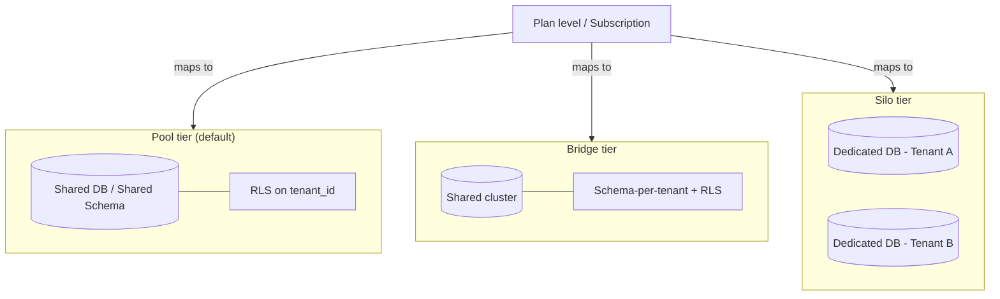
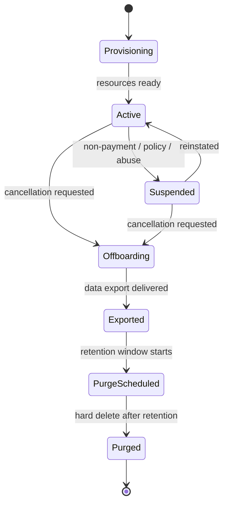

# Multi-Tenancy Strategy

One-line purpose: Defines how Nizam AIOS isolates, propagates, and enforces tenant boundaries end-to-end so that a single deployment safely serves many tenants with strong isolation guarantees.

> Status: Approved (Phase 1) | Version: 1.0.0 | Last updated: 2026-07-01 | Owner: Architecture (Nizam Core)

---

## 1. Overview

Nizam — the Bayan AI Operating System — is a **multi-tenant** platform. A *tenant* is a customer organization that consumes the OS: it owns users, agents, tools bindings, automations, integrations, billing, and data. Every piece of state and every unit of execution in Nizam is attributable to exactly one tenant.

The **default and canonical isolation model** is:

> **Shared database + shared schema + PostgreSQL Row-Level Security (RLS)** as the enforcing boundary.

Higher isolation is offered as **scaling/compliance tiers** (Pool → Bridge → Silo) mapped to plan levels, without changing the application data model. The application code path is identical across tiers; only the physical placement of data changes. This is deliberate: it keeps the domain model tier-agnostic (Clean Architecture — infrastructure concern only) and lets a tenant be promoted between tiers by an operational migration, not a rewrite.

### Design principles

- **Isolation by default, not by discipline.** The database refuses cross-tenant reads/writes via RLS even if application code has a bug. Application-layer filtering is defense-in-depth, never the sole guard.
- **`tenant_id` is ubiquitous.** Every tenant-scoped row carries `tenant_id UUID NOT NULL`. It participates in primary/foreign keys' composite indexes and every unique constraint (see `21-Database-Design.md`).
- **Context flows, it is never re-derived.** Tenant identity is established once (from the authenticated principal) and propagated verbatim through the request, DB session, events, jobs, cache keys, and automation runs. No downstream component "guesses" the tenant.
- **Tenant is a security boundary.** Multi-tenancy is treated as a first-class security control, cross-referenced from `10-Security-Strategy.md`.

---

## 2. Tenancy Tiers (Pool / Bridge / Silo)

The same logical schema is deployed in three physical isolation tiers. Tiers map to plan levels defined in Billing (`08-Billing` context / `21-Database-Design.md` — `Plan`, `Subscription`).

| Tier | Physical isolation | Enforcing mechanism | Mapped plan level | Trade-offs |
|------|--------------------|---------------------|-------------------|------------|
| **Pool** (default) | Shared DB, shared schema; many tenants per table | RLS + `tenant_id` on every row | Free, Starter, Growth | Highest density & lowest cost; noisy-neighbor risk managed by quotas; strongest reliance on RLS correctness |
| **Bridge** | Shared DB cluster, **schema-per-tenant** (or dedicated partition set) | RLS still on; schema search_path scoping adds a second wall | Business / Scale | Moderate density; per-tenant maintenance (vacuum, indexes) possible; simpler per-tenant export |
| **Silo** | **Dedicated database / instance** per tenant | Physical separation; RLS retained as belt-and-suspenders | Enterprise / Regulated / Data-residency | Strongest isolation & residency control; highest cost; slower provisioning |

Key rule: **application queries never branch on tier.** A repository issues the same tenant-scoped query; the infrastructure layer resolves connection routing (which cluster/schema/database) from the tenant's placement record held in the Administration context. Promotion Pool → Bridge → Silo is an operational data move plus a placement-record update.



---

## 3. The `tenant_id` Convention

Every tenant-scoped table includes:

| Column | Type | Rule |
|--------|------|------|
| `tenant_id` | `UUID NOT NULL` | Present on **every** tenant-scoped table; never nullable |
| `id` | `UUID` (v7) | Primary key; unique globally, but always queried with `tenant_id` |

Conventions (see `21-Database-Design.md` for the full data design):

- `tenant_id` is the **leading column** of every per-tenant composite index (`(tenant_id, ...)`), so the planner prunes to a tenant's slice first.
- Every **unique constraint** is scoped by tenant, e.g. uniqueness of a user email is `UNIQUE (tenant_id, email_normalized)`, never global.
- Every **foreign key** between tenant-scoped tables is validated to point within the same tenant (composite FK including `tenant_id`, or a `CHECK`/trigger asserting same-tenant), preventing "dangling reference into another tenant".
- **Platform-global tables** (e.g. `plan`, feature-flag catalog, system announcements owned by Administration) are the *only* tables without `tenant_id`; they are explicitly enumerated and are read-only to tenants.

> Illustrative — design only:
> ```sql
> -- illustrative — design only (not a runnable product schema)
> ALTER TABLE agent_run
>   ADD CONSTRAINT agent_run_tenant_fk
>   FOREIGN KEY (tenant_id, agent_definition_id)
>   REFERENCES agent_definition (tenant_id, id);
> ```

---

## 4. RLS Policy Approach

RLS is the enforcing boundary in Pool and a retained safety net in Bridge/Silo.

### 4.1 Session context via GUC

The tenant for the current DB session is carried in a session-scoped configuration setting (GUC): **`app.current_tenant`**. It is set at connection checkout by the infrastructure layer from the request's tenant context (§6), inside the same transaction, before any tenant query runs.

> Illustrative — design only:
> ```sql
> -- illustrative — design only
> -- set once per unit of work, inside the transaction:
> SELECT set_config('app.current_tenant', $1 /* tenant uuid */, true);
> -- 'true' => local to the transaction, auto-reset on commit/rollback
> ```

A companion setting **`app.bypass_rls`** (default off) is reserved for narrowly-scoped platform operations (migrations, Administration back-office jobs) and is only settable by privileged roles; its use is audited.

### 4.2 Force RLS and policies

- RLS is **enabled AND forced** on every tenant-scoped table (`FORCE ROW LEVEL SECURITY`), so even the table owner is subject to policies — the application role never bypasses them accidentally.
- The application connects as a **non-superuser, non-owner** role that has no `BYPASSRLS`.
- Distinct policies for **SELECT / INSERT / UPDATE / DELETE** are defined so that reads *and* writes are constrained. `USING` guards visibility; `WITH CHECK` guards that new/updated rows cannot be written to another tenant.

> Illustrative — design only:
> ```sql
> -- illustrative — design only
> ALTER TABLE agent_run ENABLE ROW LEVEL SECURITY;
> ALTER TABLE agent_run FORCE ROW LEVEL SECURITY;
>
> CREATE POLICY agent_run_select ON agent_run FOR SELECT
>   USING (tenant_id = current_setting('app.current_tenant')::uuid);
>
> CREATE POLICY agent_run_modify ON agent_run FOR ALL
>   USING      (tenant_id = current_setting('app.current_tenant')::uuid)
>   WITH CHECK (tenant_id = current_setting('app.current_tenant')::uuid);
> ```

| Policy command | `USING` (row visible/affectable) | `WITH CHECK` (row writable) | Purpose |
|----------------|----------------------------------|------------------------------|---------|
| SELECT | `tenant_id = current_tenant` | — | Prevent reading other tenants |
| INSERT | — | `tenant_id = current_tenant` | Prevent inserting rows for another tenant |
| UPDATE | `tenant_id = current_tenant` | `tenant_id = current_tenant` | Prevent editing others / re-parenting a row to another tenant |
| DELETE | `tenant_id = current_tenant` | — | Prevent deleting others' rows |

Guarantee: if `app.current_tenant` is **unset**, `current_setting(...)` errors (or resolves to a non-matching value), so a query with no tenant context returns **zero rows / fails closed**, never "all tenants".

### 4.3 Soft-delete interplay

RLS constrains *which tenant's* rows are visible; soft delete (`deleted_at IS NULL`) constrains *which live rows*. These are orthogonal: RLS policies gate `tenant_id`; the application and partial indexes filter `deleted_at`. RLS is not overloaded to hide soft-deleted rows, keeping the security policy simple and auditable.

---

## 5. Tenant Lifecycle

Owned by the **Administration** context, with events consumed by IAM, Billing, Integrations, and Monitoring.



| Phase | Actions | Isolation / safety notes |
|-------|---------|--------------------------|
| **Provisioning** | Create `tenant` row; assign tier/placement; seed default roles & settings; issue tenant-scoped secrets namespace; allocate cache namespace, queue prefixes, quota records | Idempotent (idempotency key = tenant provisioning request id); Silo tier also provisions a dedicated DB before activation |
| **Active** | Normal operation under RLS + quotas | — |
| **Suspension** | Flip `tenant.status = suspended`; block new agent/automation runs at the API and gateway; keep data intact; optionally revoke short-lived tokens | Read paths may be preserved for a grace period per plan; enforced centrally so no context can act on a suspended tenant |
| **Offboarding / Export** | Generate a tenant-scoped, verifiable data export (per-tenant dump respecting RLS/placement); notify tenant | Export runs under the tenant's own RLS context so it cannot leak other tenants |
| **Delete / Purge** | Soft-delete tenant; after contractual retention window, **hard delete**: rows, secrets namespace, cache namespace, object storage prefix, event/audit archives per retention policy | Purge is auditable and irreversible; crypto-shredding (destroying the tenant's data-encryption key) is used where supported for fast, verifiable erasure |

Every lifecycle transition emits a domain event (`tenant.provisioned`, `tenant.suspended`, `tenant.offboarding.started`, `tenant.purged`) via the Transactional Outbox so all contexts converge.

---

## 6. Tenant Context Propagation (End-to-End)

Tenant identity originates from the authenticated principal and flows, unbroken, through every layer. It is set **once** at ingress and read everywhere else.

```mermaid
sequenceDiagram
    autonumber
    participant U as User
    participant Bayan as Bayan (Brain)
    participant GW as Bayan Gateway (ACL)
    participant API as Nizam API / Kernel
    participant Agent as Agent Framework
    participant Tool as Tool Registry
    participant Auto as Automation Engine
    participant N8N as n8n
    participant DB as PostgreSQL (RLS)
    participant Bus as Outbox → NATS JetStream
    participant Cache as Redis (namespaced)

    U->>Bayan: utterance / action
    Bayan->>GW: Intent (contract)
    Note over GW: Validate JWT; extract tenant_id claim<br/>attach TenantContext to Intent
    GW->>API: Intent + TenantContext
    Note over API: per-request RequestContext/TenantContext service<br/>{ tenantId, userId, roles, requestId, traceId }
    API->>DB: BEGIN; set_config('app.current_tenant', tenantId)
    API->>Agent: dispatch (context in-band)
    Agent->>Tool: resolve tool (tenant-scoped, permission-checked)
    Tool->>Auto: delegate (tenant_id in job payload + PHP queue-worker key prefix)
    Auto->>N8N: execute workflow (tenant_id in execution context + credentials scoped)
    N8N-->>Auto: result
    Auto-->>Tool-->>Agent-->>API: result
    API->>Bus: domain events (envelope carries tenant_id)
    API->>Cache: read/write keys prefixed tenant:{tenantId}:...
    API->>GW-->>Bayan-->>U: response
```

### 6.1 Propagation chain in detail

| Hop | Carrier of tenant identity | Notes |
|-----|----------------------------|-------|
| **JWT** | `tenant_id` claim (and `org_id`, `roles`, `scopes`) | Signed by IAM; verified at every service boundary |
| **Bayan Gateway** | Attaches `TenantContext` to the validated Intent envelope | ACL ensures Bayan cannot spoof a tenant; gateway re-derives tenant from the JWT, not from Intent body |
| **Request context** | A per-request `RequestContext`/`TenantContext` service holds `{ tenantId, userId, roles, requestId, traceId }` | Immutable per request; not passed as loose function args |
| **DB session** | `app.current_tenant` GUC set per transaction | Drives RLS; unset ⇒ fail-closed |
| **Domain/integration events** | Event envelope field `tenantId` (and `causationId`, `correlationId`) | Outbox row includes `tenant_id`; consumers set their own DB session tenant from it |
| **PHP queue-worker jobs** | `tenantId` in payload **and** queue/job key prefix | Enables per-tenant concurrency limits |
| **n8n execution** | `tenant_id` injected into workflow execution context; credentials resolved per tenant | Automation Engine never runs a workflow without a tenant context |
| **Cache (Redis)** | Key namespace `tenant:{tenantId}:{context}:{key}` | Guarantees no cross-tenant cache hit |
| **Object storage** | Per-tenant prefix / bucket (`{tenantId}/...`) | Enforced at the storage adapter |
| **Observability** | `tenant_id` as a trace attribute, log field, and metric label (bounded cardinality) | See §9 |

**Anti-corruption rule:** the tenant used for authorization and RLS is **always** the one from the verified JWT, never a `tenant_id` supplied in a request body, Intent payload, or event body. Body-level `tenant_id` is validated to *equal* the context tenant, otherwise the request is rejected.

---

## 7. Noisy-Neighbor Controls & Per-Tenant Quotas

Density (especially Pool tier) requires active fairness controls so one tenant cannot starve others.

| Control | Mechanism | Enforced at |
|---------|-----------|-------------|
| **API rate limits** | Token-bucket per `(tenant, plan)` and per user | API gateway / middleware (Redis-backed) |
| **Concurrency caps** | Max concurrent agent runs / tool calls / automation executions per tenant | Agent Framework + Automation Engine + PHP queue-worker per-tenant queue prefixes |
| **Usage quotas** | Metered units — agent runs, tool calls, automation executions, LLM tokens — checked against plan quotas before admitting work | Billing context (quota check), enforced pre-execution |
| **Resource weighting / fair scheduling** | Weighted queue draining so large tenants can't monopolize workers | Automation Engine scheduler |
| **DB guardrails** | `statement_timeout`, per-role connection limits, work_mem bounds; heavy tenants can be promoted to Bridge/Silo | PostgreSQL role config + placement |
| **Circuit breakers / bulkheads** | Isolate failing external integrations per tenant so one tenant's failing connector doesn't exhaust shared pools | Integrations context |

Quota exhaustion returns a typed, plain-language error (per UI/UX rules) and emits a `quota.exceeded` event for Notifications and Billing (upsell/alert). Quotas are defined by `Plan` and tracked via `UsageRecord` (see `21-Database-Design.md`).

---

## 8. Per-Tenant Encryption, Secrets & Data Residency

### 8.1 Secret scoping

- Every tenant has a **dedicated secrets namespace** in the Vault-style secrets manager (e.g. `nizam/tenants/{tenantId}/...`). Policies deny cross-namespace access; a service can only read the namespace of the tenant in its current context.
- **No secrets in code, workflows, or n8n node definitions.** n8n credentials are references resolved at run time from the tenant's namespace (see `10-Security-Strategy.md`).
- Integration credentials (`Credential` — reference only in the DB) store *pointers* to secret-manager entries, never plaintext.

### 8.2 Encryption

- **In transit:** TLS everywhere; mTLS for service-to-service.
- **At rest:** database and object storage encrypted; additionally, **field-level / envelope encryption** for classified PII using a **per-tenant Data Encryption Key (DEK)** wrapped by a KMS-managed Key Encryption Key (KEK).
- Per-tenant DEKs enable **crypto-shredding**: destroying a tenant's DEK renders its encrypted data unrecoverable, giving fast, provable erasure at offboarding.

### 8.3 Data residency

- Tenants requiring residency guarantees are placed in **region-pinned Silo (or Bridge) tiers**; placement record records the region.
- The Administration/placement layer routes DB connections, object storage, and (where applicable) automation execution to the tenant's region.
- Residency requirements are surfaced at provisioning and are immutable without an explicit, audited migration. Cross-region replication for such tenants is disabled or region-constrained.

---

## 9. Tenant-Aware Caching, Queues & Observability

| Concern | Tenant-aware design |
|---------|---------------------|
| **Caching (Redis)** | All keys namespaced `tenant:{tenantId}:...`; cache invalidation events carry `tenantId`; no shared cache entries across tenants; TTLs and memory budgets can be per-tenant on high tiers |
| **Queues (PHP queue workers / NATS)** | Job keys and JetStream subjects encode tenant (`nizam.{tenant}.{context}.{event}` pattern); per-tenant concurrency and priority; poison-message handling scoped per tenant |
| **Observability (OTel)** | `tenant_id` attached as a span attribute and structured-log field on every record; used as a **bounded** metric label (or exemplar) to avoid cardinality blow-up; per-tenant dashboards, SLOs, and alerting in the Monitoring context |
| **Audit** | `audit_log` rows carry `tenant_id`; audit read models are tenant-scoped and RLS-protected |

Observability data is itself tenant-partitioned so that support/impersonation views (audited, via Administration) only expose the target tenant.

---

## 10. Cross-Tenant Safety Guarantees & Testing

### Guarantees

1. **Fail-closed:** absent tenant context ⇒ no data (RLS returns zero rows / errors), never all tenants.
2. **No cross-tenant reference:** FKs/constraints prevent a row in tenant A from referencing tenant B.
3. **No cross-tenant cache/queue leakage:** namespacing makes a cross-tenant key structurally impossible.
4. **No trust in caller-supplied tenant:** authorization/RLS always use the verified JWT tenant.
5. **Forced RLS:** even the app role cannot bypass policies.

### How they are tested (design-level test strategy)

| Test type | What it asserts |
|-----------|-----------------|
| **RLS unit/integration tests** | With `app.current_tenant = A`, every table returns/writes only A's rows; setting B never exposes A |
| **Negative/adversarial tests** | Attempts to read/insert/update/delete another tenant's row are rejected; body-supplied `tenant_id ≠ context` is rejected |
| **Missing-context tests** | Queries with no `app.current_tenant` fail closed |
| **Property/fuzz tests** | Randomized tenant pairs across all tenant-scoped tables assert zero cross-tenant visibility |
| **Cache/queue isolation tests** | Assert key namespaces never collide; a cache poisoned for A never serves B |
| **Migration tests** | Expand/contract migrations preserve RLS and `tenant_id` invariants |
| **Placement/promotion tests** | Pool→Bridge→Silo migration preserves data and isolation; residency routing verified |

These are enforced in CI as a **tenant-isolation gate**: a schema change adding a tenant-scoped table without `tenant_id`, RLS policies, and tenant-scoped indexes fails the build (see `21-Database-Design.md`).

---

## Related Documents

- `00-Vision.md` — Product vision and the Bayan/Nizam relationship.
- `10-Security-Strategy.md` — Security strategy; tenant isolation as a security boundary.
- `21-Database-Design.md` — Data design: `tenant_id`, RLS, indexes, constraints, ERD.
- `08-Billing` context docs — Plans, subscriptions, quotas, usage metering.
- `19-Assumptions.md` — Recorded assumptions and gaps.
- `20-Project-State.md` — Phase 1 status.

## Change Log

| Version | Date | Author | Change |
|---------|------|--------|--------|
| 1.0.0 | 2026-07-01 | Architecture (Nizam Core) | Initial approved Phase 1 multi-tenancy strategy. |
