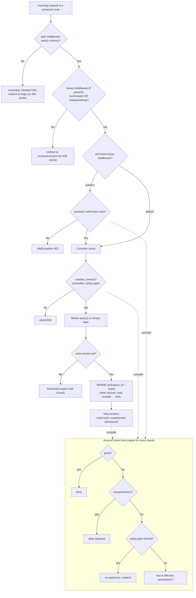

# 10 — Authorization (التفويض)

How HalaOps enforces "what a user may do" at every layer — route middleware, controller checks, policy gates, view gating, and the model tenant scope — and why that is distinct from authentication.

## Related Documents

- [07 — RBAC](07-RBAC.md) — the engine (`AccessControl`) that *decides* authorization; this doc covers where those decisions are *enforced*.
- [11 — Permissions Matrix](11-Permissions-Matrix.md) — the authoritative permission-key ↔ role mapping the checks reference.
- [09 — Authentication](09-Authentication.md) — establishes identity; authorization is everything that happens after.

---

## Purpose (الهدف)

This document specifies **how authorization is enforced** across HalaOps. Authentication ([09 — Authentication](09-Authentication.md)) answers *who are you*; authorization answers *are you allowed to do this, here, to this thing*. The answer is computed by the RBAC engine ([07 — RBAC](07-RBAC.md)) and enforced in **five layers**:

1. **Route middleware** — `permission:…` (`RequirePermission`) and `auth`/`tenant` gates on routes.
2. **Controller checks** — `can()` / `access()->allows()` / `abort_unless()` inside actions.
3. **Policy gates** — context-aware closures registered via `AccessControl::define()` ("own record", "in my company").
4. **View gating** — `can()` in templates to hide/show UI affordances.
5. **Model tenant scope** — `Model::query()` constrains every tenant query to the active company and fails closed ([08 — Multi-Tenant](08-Multi-Tenant.md)).

These layers are **defence in depth**: a missing UI check is still caught by the controller; a missing controller check is still caught by middleware; and even a permitted action can only ever touch the active tenant's rows because of the model scope.

## Why It Exists (سبب وجوده)

A single authorization check in one place is fragile: a new route added without a middleware, a button left ungated, or a controller that trusts the UI all become privilege-escalation or data-leak bugs. HalaOps therefore enforces authorization **redundantly and at different altitudes**, so no single omission is sufficient to grant access.

It also separates the two questions cleanly. Authentication is binary and global (you have a valid session or you don't). Authorization is contextual: it depends on *which tenant is active* (different tenant roles apply) and sometimes on *which object* is being acted upon (you may edit your own profile but not someone else's). Conflating them — e.g. trusting "logged in" to mean "allowed" — is exactly the mistake this layering prevents. Finally, because the underlying decision is **role-driven, never type-driven**, every enforcement point asks the same question through the same engine, keeping behaviour consistent and auditable.

## Architecture

### Authentication vs Authorization

| | Authentication | Authorization |
|---|----------------|---------------|
| Question | Who are you? | What may you do (here, to this)? |
| Where decided | `AuthManager` (session) | `AccessControl` (RBAC engine) |
| Inputs | session `auth_user_id`, credentials | user + active tenant + permission key (+ optional context) |
| Outcome | a `User` or a guest | allow / deny |
| Enforced by | `Authenticate` middleware, `user()` re-check | the five layers below |
| Failure | redirect to `login` / 401 | 403 (or hidden UI) |

### The five enforcement layers

| Layer | Mechanism | File(s) | Failure mode |
|-------|-----------|---------|--------------|
| Route middleware | `auth`, `tenant`, `permission:keys` (any-of) | `app/Http/Middleware/{Authenticate,EnsureTenant,RequirePermission}.php`, `config/middleware.php`, `routes/web.php` | redirect to login / 409 no-tenant / **403** |
| Controller checks | `can($key, $ctx)`, `access()->allows()`, `abort_unless()`, `findOrFail()` | `app/Controllers/**`, `app/Support/helpers.php` | **403** / 404 |
| Policy gates | `access()->define($ability, fn(User, $ctx) => bool)` | `app/Services/Rbac/AccessControl.php` | gate returns false → deny |
| View gating | `<?php if (can('key')): ?> … <?php endif; ?>` | `resources/views/**` | element hidden (cosmetic only) |
| Model tenant scope | `Model::query()` auto `WHERE workspace_id = :active`, fail-closed | `app/Core/Model.php`, `app/Services/Tenancy/TenantManager.php` | 404 (not found) / `RuntimeException` if no tenant |

All five route every decision through the **same** `AccessControl` instance (container alias `access`), so the super-admin bypass, role union, inheritance, and policy gates behave identically everywhere — there is one authorization brain.

### Decision flow



## Workflow

A typical authorized action (e.g. updating the company profile) traverses the layers in order:

1. **`auth`** confirms a session user exists (else redirect to `login`, remembering the intended URL).
2. **`tenant`** (`EnsureTenant`) confirms an active company (or super admin) for tenant-scoped routes; otherwise routes to company selection.
3. **`permission:workspace.update`** (`RequirePermission`) calls `access()->allows('workspace.update')`. The engine applies the super-admin bypass, else resolves effective permissions for the active tenant (union of global + membership roles, expanded up `parent_id`) and checks the key. Any-of semantics if several keys are listed. Failure → **403**.
4. **Controller** may add a finer check, e.g. `abort_unless(can('workspace.update'), 403)` or a context check for object-level rules, then loads the record with the **tenant-scoped** `Model::findOrFail()` — which can only find rows in the active company.
5. **Model** writes through `Model::query()`, which re-applies `WHERE workspace_id = :active`, so even a permitted write cannot touch another tenant.
6. **View** renders, using `can('workspace.update')` to show the "Edit" button only to users who actually have it — purely cosmetic, never the security boundary.

### Worked example — middleware (from `routes/web.php`)

```php
$router->group(['middleware' => ['tenant']], function ($router): void {
    $router->get('dashboard', [DashboardController::class, 'index'])
        ->middleware('permission:dashboard.view')
        ->name('dashboard');
});
```

The dashboard requires authentication (outer `auth` group), an active tenant (`tenant`), and the `dashboard.view` permission. A member has it; a user with no roles does not and receives 403.

### Worked example — controller + policy gate

```php
// Registering a context-aware gate once (e.g. in a service provider/bootstrap):
access()->define('profile.update', fn ($user, $ctx) => $ctx instanceof User && $ctx->getKey() === $user->getKey());

// In the controller:
public function update(Request $request): Response
{
    $target = User::findOrFail((int) $request->input('id'));
    abort_unless(can('profile.update', $target), 403); // gate decides "is it me?"
    // ...persist...
}
```

Here a flat permission flag cannot express "edit *your own* profile"; the gate inspects the `$context` object. Because gates take precedence in `AccessControl::allows()`, this rule overrides any flat-permission interpretation of the same ability.

## Business Rules

1. **Deny by default.** Every layer returns deny unless something explicitly allows. `RequirePermission` 403s unless a listed key matches; `AccessControl` returns false for guests and absent keys.
2. **Authentication precedes authorization.** `RequirePermission` itself first checks `auth()->check()` and redirects guests, so permission checks only run for authenticated users.
3. **`permission:a,b` is any-of.** The request is allowed if the user holds *any* listed key.
4. **Authorization is tenant-relative.** The same user can be authorized for an action in company A and denied in company B, because tenant roles resolve against the active `workspace_id`.
5. **Policy gates beat flat permissions** for the same ability and are the mechanism for object-level ("own record", "in my company") rules.
6. **Super admins are authorized for everything** (engine bypass) — but cross-tenant *data* still requires `withoutTenantScope()` ([08 — Multi-Tenant](08-Multi-Tenant.md)), so the bypass grants permission, not silent cross-tenant reads through scoped models.
7. **View checks are cosmetic.** Hiding a button is UX, never enforcement; the controller/middleware/model are the real boundaries.
8. **The model scope is non-negotiable.** Even an authorized action cannot read/write outside the active tenant; with no tenant, tenant-scoped queries throw.
9. **Object lookups go through scoped finders.** Using `Model::findOrFail()` (scoped) for request-supplied ids turns cross-tenant access attempts into 404s rather than leaks.
10. **One engine, everywhere.** All layers consult the same `AccessControl`, so authorization semantics are identical across web routes, controllers, views, and (future) API.

## Database Relations

Authorization reads from the RBAC and tenancy tables (consistent with §11; full detail in [07 — RBAC](07-RBAC.md) and [08 — Multi-Tenant](08-Multi-Tenant.md)):

| Table | Used for |
|-------|----------|
| `user_roles` | global role grants (super-admin and other platform roles). |
| `memberships` (`status='active'`) | which tenant roles apply for the active company. |
| `membership_roles` | tenant role grants. |
| `roles` (`parent_id`, `workspace_id`, `is_system`) | inheritance + global/tenant distinction. |
| `role_permissions` + `permissions.key` | the keys each role grants; the final allow/deny lookup. |
| every tenant table's `workspace_id` | the model scope that bounds *what data* an authorized action can touch. |

## Permissions

This document is about *enforcing* permissions rather than defining new ones; the keys it references are the built catalogue from [07 — RBAC](07-RBAC.md) (`dashboard.view`, `workspace.view/update`, `members.view/invite/update/remove`, `roles.view/manage`, `billing.view/manage`, `ai.view/manage`, `settings.view/manage`) plus the planned domain groups. The authoritative mapping of every key to every role lives in [11 — Permissions Matrix](11-Permissions-Matrix.md). Enforcement contracts to remember:

- A route guarded by `permission:X` requires `X` (or super-admin).
- A controller calling `can('X', $obj)` requires `X` **or** a passing gate for `X` with `$obj`.
- A view using `can('X')` only *displays* the affordance; access is still enforced server-side.

## Validation

Authorization composes with input validation but is separate:

- **Validation** (core `Validator`) ensures the *shape* of input is acceptable (required/email/min/exists/…); it runs in the controller before or alongside authorization.
- **Authorization** ensures the *actor* may perform the action on the (validated) target.
- **`exists`/`unique` rules** are evaluated within the tenant scope where the underlying model is tenant-scoped, so a validation rule cannot be used to probe another tenant's data.
- Request ids used for object-level checks should be cast/validated (`(int)`) and resolved through scoped `findOrFail()` so a malformed or cross-tenant id fails as 404 before any gate runs.

## Edge Cases

- **Authenticated but no tenant** on a tenant-scoped route → `EnsureTenant` redirects to `companies/select` (super admins pass). Reaching a tenant model anyway → fail-closed `RuntimeException`.
- **Route missing a `permission:` guard** → controller `can()`/`abort_unless()` and the model scope still apply (defence in depth); the QA checklist (§14/[40 — QA Checklist](40-QA-Checklist.md)) requires verifying every route's guards.
- **UI shows a button the user can't use** (stale cache / template bug) → clicking it still 403s server-side; cosmetic only.
- **Permission granted but object belongs to another tenant** → scoped lookup returns nothing → 404, never another tenant's record.
- **Super admin acting without a tenant** → authorized everywhere; data access uses platform screens / `withoutTenantScope()`.
- **Role/permission changed mid-request** → flush the per-request `AccessControl` cache (`flushCache()`) so later checks in the same request see the change ([07 — RBAC](07-RBAC.md)).
- **JSON vs HTML clients** → middleware returns 401/403/409 JSON for `wantsJson()` requests and redirects/`HttpException` pages otherwise.
- **Any-of misuse** → listing `permission:a,b` grants access with either; if *all* are required, use separate guards/controller checks.

## Security

- **Defence in depth:** five independent layers; no single omission grants access.
- **Server-side authority:** view gating never substitutes for controller/middleware/model checks — the client is untrusted.
- **Fail-closed data boundary:** the model scope means an authorization mistake at most exposes the *user's own tenant*, and a no-tenant state exposes nothing (it throws).
- **No type-based shortcuts:** every check goes through role-resolved permissions, eliminating `if ($type === …)` escalation paths.
- **Consistent 403 semantics:** unauthorized actions raise `HttpException(403)` (or 403 JSON), distinct from 401 (unauthenticated) and 404 (not found / cross-tenant), so behaviour is predictable and testable.
- **Auditability:** sensitive authorized actions are recorded in `activity_log` with actor and IP; denied attempts (e.g. failed logins) are logged too ([34 — Security](34-Security.md)).
- **IDOR resistance:** scoped finders + per-company uniqueness turn cross-tenant id guessing into 404s.
- **CSRF + authorization:** state-changing routes are also CSRF-protected (the `csrf` middleware), so authorization is not the only guard on writes.

## Performance

- **Single resolution per request:** `AccessControl` caches the effective permission map per `userId:companyId`, so middleware + multiple controller checks + dozens of view `can()` calls share **one** resolution ([07 — RBAC](07-RBAC.md)).
- **Cheap enforcement points:** middleware and `can()` are array lookups after the first resolution; the model scope is a single indexed `WHERE workspace_id = ?`.
- **No redundant DB work across layers:** because all layers hit the same cached engine, adding checks (defence in depth) is nearly free.
- **Hot paths:** dashboards/list views that gate many elements benefit most from the cache; keep object-level gate closures cheap (avoid per-call queries; resolve the object once and pass it as context).

## Testing

**Unit:**
- `RequirePermission` allows when any listed key is present, 403s otherwise, redirects guests.
- Policy gate via `access()->define()` returns true for the owning object, false for others; gate precedence over flat permission verified.
- `EnsureTenant` passes for active tenant / super admin, redirects/409s otherwise.

**Feature (HTTP):**
- `member` → 403 on `permission:roles.manage` route; `admin`/`owner` → 200.
- Authenticated user with no roles → 403 on a permissioned route but 200 on an unguarded own-profile route.
- Switching tenant flips authorization for a tenant-scoped action (allowed in A, denied in B).
- Editing another user's profile is denied by the gate even with general permissions.

**Security:**
- A route with a `permission:` guard cannot be reached by a user lacking the key, regardless of UI state.
- Cross-tenant object id → 404 (scoped finder), not another tenant's data.
- Removing a route's middleware in a test still fails the action via controller/model checks (defence-in-depth regression test).
- 401 vs 403 vs 404 are returned for the correct conditions (unauthenticated / unauthorized / not-found).

## Future Expansion

- **More policy gates** as the recruitment domain lands (e.g. `applications.move` only within the recruiter's pipeline, `evaluations.manage` only for the assigned evaluator) — registered via `AccessControl::define()` with no new enforcement plumbing.
- **API authorization parity:** token-authenticated `/api/v1` (§12) reuses the same middleware-style permission checks and the same `AccessControl`, returning the JSON error envelope.
- **Field-level / attribute-based rules** layered on top of gates for fine-grained data exposure.
- **Centralised gate registry** (a dedicated provider) as the number of gates grows, keeping definitions discoverable.
- **Declarative per-controller authorization** (a base-controller `authorize()` helper) to make controller checks uniform and lint-able.
- **Authorization audit hooks** — record denied attempts on sensitive abilities for anomaly detection ([38 — Audit System](34-Security.md)).

## Open Questions

None at this time. The five enforcement layers are implemented (`Authenticate`, `EnsureTenant`, `RequirePermission`, the `can()`/`access()` helpers, `AccessControl::define()`, and `Model::query()` scoping). Additional policy gates and API enforcement are additive and already supported by the existing engine and helpers.
