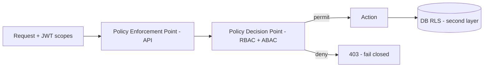
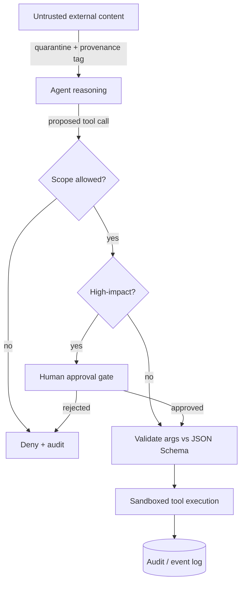

# Security Strategy

One-line purpose: Defines the end-to-end security architecture of Nizam AIOS — threat model, authentication, authorization, secrets, data protection, agent/tool safety, automation hardening, API security, auditing, supply-chain, and compliance posture.

> Status: Approved (Phase 1) | Version: 1.0.0 | Last updated: 2026-07-01 | Owner: Architecture (Nizam Core)

---

## 1. Overview & Security Principles

Nizam — the Bayan AI Operating System — executes actions on behalf of tenants, often against **external systems** and on **untrusted content** (Bayan and agents reason over data pulled from the outside world). Security is therefore not a perimeter concern but a property of every layer, from JWT verification to RLS to tool capability scoping.

Guiding principles:

- **Zero trust between components.** Every service verifies identity (JWT / mTLS); nothing is trusted because it is "internal".
- **Least privilege everywhere.** Users, agents, tools, workflows, and DB roles get the minimum capabilities required.
- **Defense in depth.** API validation, AuthZ, RLS, quotas, sandboxing, and auditing are independent layers; any single failure does not breach isolation.
- **Fail closed.** Missing context, unknown scope, or failed validation denies the action.
- **Tenant is a security boundary.** Isolation is enforced structurally (see `09-Multi-Tenant.md`).
- **Untrusted-content assumption.** Any content an agent reads (emails, web pages, documents, integration payloads) is treated as potentially adversarial (prompt injection) and never as a trusted instruction source.
- **Auditability & non-repudiation.** Security-relevant actions are recorded append-only.

---

## 2. Threat Model (STRIDE per major flow)

Nizam's major flows: **(A) User → Bayan → Gateway → API** (intent intake & auth), **(B) Agent → Tool → Automation → n8n → External** (execution), **(C) Events → Monitoring/Billing/Notifications/Audit** (async reactions), **(D) Data at rest in PostgreSQL/Redis/Object storage**.

| STRIDE threat | Flow(s) | Example | Primary mitigations |
|---------------|---------|---------|---------------------|
| **Spoofing** | A, B | Forged tenant/user; service impersonation | OIDC/JWT signature verification; mTLS between services; tenant from verified claim only (§ `09` §6) |
| **Tampering** | A, B, D | Modified intent, event, or row; re-parenting a row to another tenant | Signed JWTs; event envelope integrity; RLS `WITH CHECK`; optimistic `version`; append-only audit |
| **Repudiation** | A, B, C | "I never launched that automation" | Append-only `audit_log`, event sourcing for critical aggregates, `created_by`/`correlation_id` chains |
| **Information disclosure** | A, B, C, D | Cross-tenant read; secret leak in logs; PII exposure | RLS + forced RLS; field-level encryption; log redaction; per-tenant secret namespaces; least-privilege scopes |
| **Denial of service** | A, B | Noisy neighbor; runaway agent loop; expensive tool | Per-tenant rate limits & quotas; concurrency caps; agent step/iteration budgets; circuit breakers; statement timeouts |
| **Elevation of privilege** | A, B | User invoking an unauthorized tool; agent escaping its capability set; n8n arbitrary code | RBAC+ABAC scopes on tools/agents; capability scoping; n8n node allowlist / no arbitrary code for tenants; non-BYPASSRLS DB role |
| **Prompt injection / untrusted-content abuse** *(AI-specific extension)* | B | External page instructs agent to exfiltrate data or call a destructive tool | Content quarantine, provenance tagging, tool allowlists per agent, human-in-the-loop approval gates, output constraints (§8) |

---

## 3. Authentication (AuthN)

Owned by the **Identity & Access (IAM)** context.

| Mechanism | Design |
|-----------|--------|
| **OAuth2 / OIDC** | Standard authorization-code + PKCE for user login; federation with tenant IdPs (SAML/OIDC) on higher tiers |
| **JWT access + refresh** | Short-lived signed access tokens (tenant_id, user_id, roles, scopes claims); rotating refresh tokens; asymmetric signing (JWKS) so services verify without shared secrets |
| **MFA** | TOTP / WebAuthn; step-up authentication required for sensitive operations (credential binding, tenant admin, impersonation) |
| **Service-to-service** | **mTLS** with short-lived certificates (SPIFFE-style identities); no static service passwords |
| **Session management** | Server-side session/refresh registry allows revocation; token binding to device where available; suspended tenants' tokens revoked (see `09-Multi-Tenant.md`) |
| **Impersonation** | Administration back-office impersonation is explicit, scoped, time-boxed, and fully audited |

Tokens are validated at **every** boundary (API, gateway, event consumers where applicable). Verification failures fail closed.

---

## 4. Authorization (AuthZ)

Layered **RBAC + ABAC**, enforced at the API layer **and** the DB layer (RLS), so authorization is never single-point.

- **RBAC:** Users hold `Role`s composed of `Permission`s (see `21-Database-Design.md` — `Role`, `Permission`, `UserRole`). Roles are tenant-scoped.
- **ABAC / policy engine:** A policy decision point evaluates attributes (tenant, plan tier, resource owner, data classification, environment, time) against declarative policies. Enables contextual rules RBAC alone cannot express (e.g., "advanced tools only in Advanced Mode", "residency-restricted tenants cannot use cross-region tools").
- **Permission scopes for tools/agents:** Every `ToolDefinition` and `AgentDefinition` declares required **capability scopes** (e.g. `tool:email.send`, `integration:crm.read`, `automation:run`). Invocation is denied unless the acting principal (user or agent-on-behalf-of-user) holds the scope. Agents run with a **derived, reduced** scope set (never broader than the delegating user).
- **Least privilege:** Default deny. Scopes are additive and explicitly granted. Dangerous scopes (delete, external send, financial) require elevated roles and may trigger approval gates (§8).

---

## 5. Secrets Management

| Rule | Design |
|------|--------|
| **Central manager** | Vault-style secrets manager / cloud KMS, abstracted behind a port so it is replaceable |
| **No secrets in code, config repos, workflows, or n8n nodes** | Enforced by secret-scanning in CI (§12) and by referencing secrets by handle only |
| **Per-tenant namespacing** | `nizam/tenants/{tenantId}/...`; policies deny cross-tenant access (see `09-Multi-Tenant.md`) |
| **Integration credentials** | `Credential` rows store *references* to secret-manager entries, never plaintext; resolved at run time under the tenant's context |
| **Rotation** | Automated rotation for keys, DB roles, service certs, and integration tokens; short-lived credentials preferred; rotation events audited |
| **Encryption keys** | KMS-managed KEK wraps per-tenant DEKs; DEK destruction enables crypto-shredding at offboarding |

---

## 6. Data Protection

| Aspect | Design |
|--------|--------|
| **In transit** | TLS 1.2+; mTLS service-to-service |
| **At rest** | Encrypted DB volumes and object storage; encrypted backups |
| **PII classification** | Data classified (Public / Internal / Confidential / Restricted-PII). Classification drives encryption, retention, redaction, and access policy (ABAC input) |
| **Field-level encryption** | Restricted-PII fields (e.g. national IDs, tokens, sensitive contact data) encrypted with per-tenant DEK (envelope encryption) beyond disk encryption |
| **Redaction in logs** | Structured logging (Monolog / PSR-3) passes through a redaction layer; classified fields and secrets are masked/omitted; deny-list + allow-list of loggable fields; no raw request bodies for sensitive endpoints |
| **Data minimization & retention** | Retain only what is needed; per-classification retention windows; purge on offboarding (crypto-shred) |
| **Backups** | Encrypted, access-controlled, tenant-attributable; restore paths preserve RLS |

---

## 7. Tenant Isolation as a Security Boundary

Multi-tenancy is a core security control, specified in `09-Multi-Tenant.md`. Security-relevant summary:

- Shared DB + shared schema + **forced RLS** with session GUC `app.current_tenant`; app role has no `BYPASSRLS`.
- `tenant_id` in every table, every composite index, every unique constraint, every FK check.
- Authorization and RLS always use the **verified JWT tenant**, never caller-supplied `tenant_id`.
- Cache/queue/storage/observability all tenant-namespaced.
- Cross-tenant isolation is verified by an adversarial test gate in CI.

---

## 8. Agent & Tool Safety (AI-Specific Controls)

Because Bayan and Nizam agents act autonomously on **external, untrusted content**, agent safety is a dedicated security domain.

| Control | Design |
|---------|--------|
| **Capability scoping** | Each agent runs with an explicit, minimal set of tool scopes, derived from and never exceeding the delegating user's permissions; scopes are checked per tool call |
| **Human-in-the-loop approval gates** | High-impact actions (external message send, data deletion, financial/billing changes, credential creation, irreversible operations) require an explicit human approval step; the run pauses and records the decision |
| **Sandboxing** | Tool invocations execute against constrained adapters with no ambient authority; no direct filesystem/network egress beyond declared integration endpoints; resource/time budgets per tool call |
| **Prompt-injection defense** | Untrusted content is **quarantined and provenance-tagged**; it is presented to the model as *data*, not *instructions*; system/tool policies take precedence; the model cannot self-escalate scopes or invoke tools outside its allowlist regardless of what content instructs |
| **Untrusted-content handling** | Content from integrations/web/email is sanitized, size-bounded, and never directly interpolated into privileged commands; outputs that would trigger destructive tools require approval |
| **Loop / cost guards** | Per-run step limits, iteration budgets, and token/cost budgets; runaway detection halts and flags the run |
| **Output constraints** | Structured/validated outputs; tool arguments validated against JSON Schema before execution (Tool Registry contract) |
| **Full traceability** | Every `AgentRun` / `AgentRunStep` / `ToolExecution` is recorded (event-sourced) for audit and replay (see `21-Database-Design.md`) |

---

## 9. Automation / n8n Hardening

The **Automation Engine** owns and drives self-hosted n8n; tenants never touch n8n directly.

| Control | Design |
|---------|--------|
| **Node allowlist** | Only vetted, approved n8n node types are permitted; a governed allowlist per plan tier |
| **No arbitrary code for tenants** | Code/Function/exec-style nodes and raw HTTP-to-anywhere are disabled for tenant-authored workflows; parameterized, vetted nodes only |
| **Credential injection at run time** | n8n workflows reference tenant credentials by handle; secrets injected from the tenant's namespace at execution, never stored in workflow JSON |
| **Tenant context in execution** | Every execution carries `tenant_id`; egress and credentials scoped to that tenant |
| **Egress control** | Outbound calls restricted to declared integration endpoints (allowlisted hosts) |
| **Isolation & limits** | Per-tenant concurrency, timeouts, and resource limits; failures isolated via bulkheads/circuit breakers; idempotency keys prevent duplicate side effects |
| **Change control** | Workflow definitions versioned; publishing high-privilege workflows may require approval (Administration) |

---

## 10. API Security

| Control | Design |
|---------|--------|
| **Rate limiting & throttling** | Per-tenant, per-user, per-endpoint token buckets (Redis-backed); quota enforcement pre-execution |
| **Input validation** | Strict schema validation (OpenAPI 3.1 contracts; DTO validation); reject unknown fields; canonicalize before use |
| **OWASP API Top 10 coverage** | BOLA/object-level auth via RLS + ownership checks; broken-auth via OIDC/JWT/mTLS; excessive-data-exposure via response DTOs + redaction; mass-assignment blocked by explicit DTOs; SSRF prevention via egress allowlists; injection prevention via parameterized queries + validation; security misconfiguration via hardened defaults |
| **Transport** | HTTPS/TLS only; HSTS; secure headers |
| **CORS & CSRF** | Strict CORS allowlists; anti-CSRF for cookie-based flows; prefer bearer tokens for APIs |
| **Error hygiene** | Typed, non-leaky errors (plain-language for users per UI/UX rules); no stack traces or internal identifiers to clients |
| **Idempotency** | Idempotency keys on state-changing endpoints to prevent replay-induced duplication |

---

## 11. Auditing & Non-Repudiation

- **Append-only `audit_log`** (tenant-scoped) records security-relevant events: authN/authZ decisions, scope grants, tool executions, credential access, impersonation, admin actions, lifecycle transitions. Writes only; no updates/deletes.
- **Event sourcing** for critical aggregates (Agent runs, Tool executions, Automations) via `EventStore`, giving a replayable, tamper-evident history.
- **Transactional Outbox** (`OutboxEvent`) guarantees that audit/domain events are emitted atomically with state changes (no lost or ghost audit records).
- **Correlation & causation IDs** chain a user intent to every downstream action for forensic reconstruction.
- **Integrity:** append-only storage; optional hash-chaining of audit records for tamper evidence; audit read models are RLS-protected.

---

## 12. Supply-Chain Security

| Control | Design |
|---------|--------|
| **Dependency scanning** | Automated SCA in CI for known vulnerabilities; block/flag on severity thresholds |
| **SBOM** | Software Bill of Materials generated per build/release; stored and diffable |
| **Pinned & verified dependencies** | Lockfiles; provenance/signature verification where available; minimal base images |
| **Secret scanning** | CI scans block secrets in code/config/workflows |
| **Container hardening** | Non-root, read-only rootfs where possible, distroless/minimal images, image signing; Kubernetes with least-privilege service accounts and network policies |
| **Plugin vetting** | Tools/Integrations/agent-skill plugins are reviewed and approved (Administration marketplace approval) before availability; signed manifests |

---

## 13. Compliance Posture

| Area | Approach |
|------|----------|
| **GDPR-style data rights** | Right to access/export (tenant & subject export), rectification, erasure (crypto-shred + purge), data portability; lawful-basis & consent tracking at the data layer |
| **Data residency** | Region-pinned Silo/Bridge placement for regulated tenants (see `09-Multi-Tenant.md`) |
| **SOC 2-readiness controls** | Change management, access reviews, least privilege, audit logging, encryption, incident response, vendor management, monitoring/alerting mapped to Trust Services Criteria |
| **PII governance** | Classification-driven handling, retention, and redaction |
| **Auditability** | Comprehensive, append-only audit trail supporting evidence collection |

Compliance is treated as **continuous** (controls enforced in code/CI), not a point-in-time exercise.

---

## 14. Incident Response & Key Rotation

- **Detection:** Security signals (auth anomalies, RLS-denied spikes, quota abuse, unusual tool/automation patterns) feed Monitoring alerts and SLO breach rules.
- **Response lifecycle:** Detect → triage/classify severity → contain (revoke tokens/keys, disable affected tools/nodes, suspend tenant if needed) → eradicate → recover → post-incident review.
- **Containment levers:** token/refresh revocation, credential & key rotation, tool/node disablement, tenant suspension, feature-flag kill switches.
- **Key rotation:** Scheduled rotation for signing keys (JWKS), service certs (mTLS), tenant DEKs/KEKs, and integration credentials; emergency rotation runbook; every rotation audited.
- **Communication:** Breach-notification workflow (Notifications context) with tenant and regulatory notification paths per compliance obligations.

---

## 15. Controls Matrix

| # | Control | Category | Enforcement point | STRIDE / risk addressed |
|---|---------|----------|-------------------|--------------------------|
| C1 | OIDC/JWT + MFA + step-up | AuthN | IAM / API | Spoofing, EoP |
| C2 | mTLS service-to-service | AuthN | Service mesh | Spoofing, Tampering |
| C3 | RBAC + ABAC policy engine | AuthZ | API PEP/PDP | EoP, Info disclosure |
| C4 | Tool/agent capability scopes | AuthZ | Agent/Tool runtime | EoP |
| C5 | Forced RLS + `tenant_id` everywhere | Isolation | PostgreSQL | Info disclosure, Tampering |
| C6 | Per-tenant secret namespaces | Secrets | Secrets manager | Info disclosure |
| C7 | Secret references, no plaintext | Secrets | DB / n8n / code | Info disclosure |
| C8 | Automated rotation | Secrets | KMS/Vault | Spoofing, Info disclosure |
| C9 | TLS + at-rest + field-level encryption | Data protection | Transport / DB / storage | Info disclosure, Tampering |
| C10 | PII classification + log redaction | Data protection | Logging / policy | Info disclosure, Repudiation |
| C11 | Human-in-the-loop approval gates | Agent safety | Agent runtime | EoP, DoS, Injection |
| C12 | Prompt-injection quarantine & provenance | Agent safety | Agent runtime | Injection, Info disclosure |
| C13 | Tool sandboxing + budgets | Agent safety | Tool runtime | DoS, EoP |
| C14 | n8n node allowlist / no arbitrary code | Automation hardening | Automation Engine | EoP, DoS |
| C15 | Egress allowlists | Automation/API | Adapters / n8n | SSRF, Info disclosure |
| C16 | Rate limits + quotas + concurrency caps | Availability | API / Billing / queues | DoS |
| C17 | Input validation (OpenAPI/DTO) | API security | API | Tampering, Injection |
| C18 | Idempotency keys | API/Automation | API / Automation | Tampering (replay) |
| C19 | Append-only audit_log + event sourcing | Auditing | Audit / EventStore | Repudiation |
| C20 | Transactional Outbox | Auditing | DB | Repudiation |
| C21 | SCA + SBOM + secret scanning | Supply chain | CI/CD | Tampering, supply-chain |
| C22 | Container hardening + network policies | Infra | Kubernetes | EoP, Tampering |
| C23 | Plugin vetting + signed manifests | Supply chain | Administration | EoP, Tampering |
| C24 | Incident response + key rotation runbooks | Resilience | Cross-cutting | All |
| C25 | GDPR rights + crypto-shred + residency | Compliance | Data layer / placement | Info disclosure, legal |

---

## Related Documents

- `09-Multi-Tenant.md` — Tenant isolation as a security boundary.
- `21-Database-Design.md` — RLS, `audit_log`, `OutboxEvent`, `EventStore`, encryption columns.
- `00-Vision.md` — Product vision and Bayan/Nizam layering.
- Architecture docs — Bounded contexts (IAM, Agents, Tools, Automation).
- `19-Assumptions.md` — Recorded assumptions and gaps.
- `docs/audit/Risks-Report.md` — Risk register.

## Change Log

| Version | Date | Author | Change |
|---------|------|--------|--------|
| 1.0.0 | 2026-07-01 | Architecture (Nizam Core) | Initial approved Phase 1 security strategy. |
