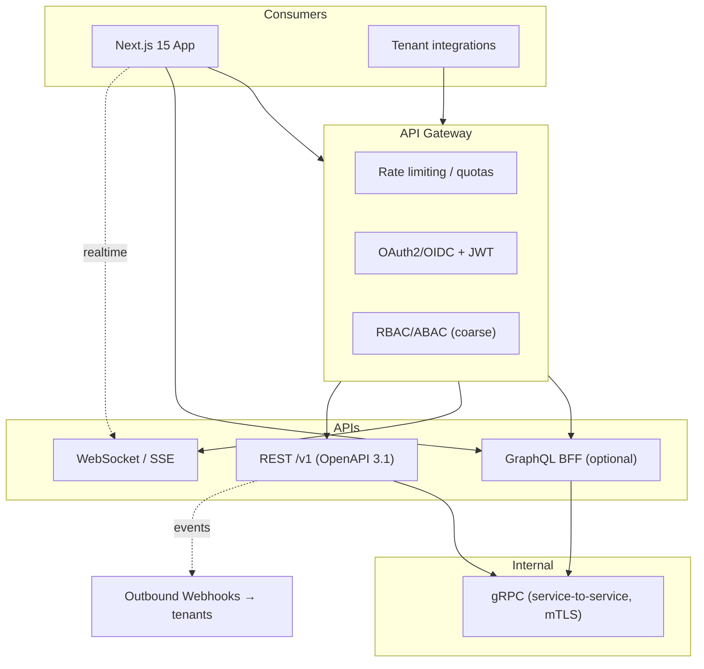
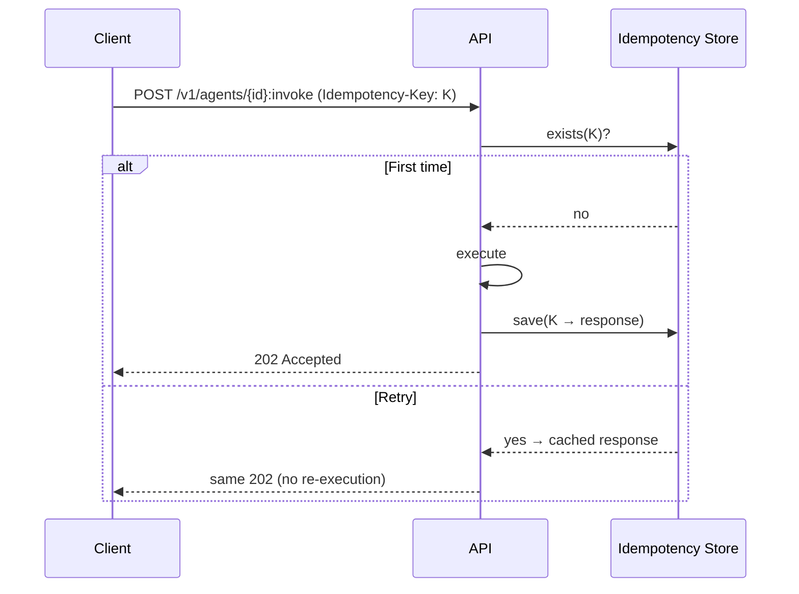
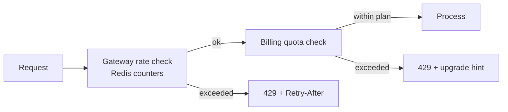
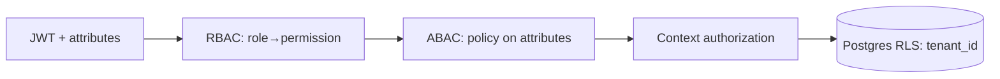
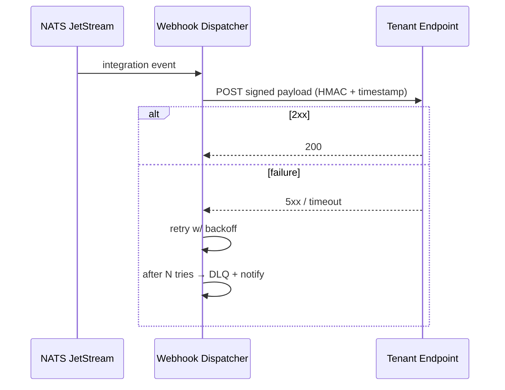
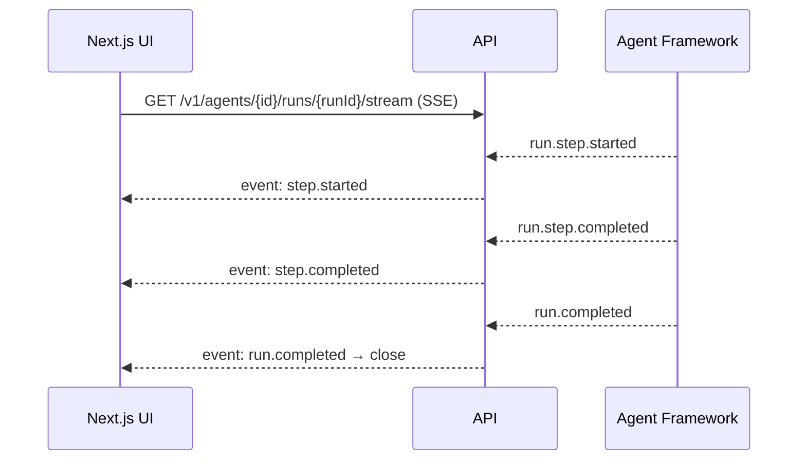

# 11 — API Strategy

> How **Nizam — the Bayan AI Operating System** exposes and secures its APIs: REST as the primary external contract, plus internal gRPC, realtime streaming, outbound webhooks, and an optional GraphQL BFF.

**Status:** Approved (Phase 1) | **Version:** 1.0.0 | **Last updated:** 2026-07-01 | **Owner:** Architecture (Nizam Core)

---

## 1. Principles

1. **REST (OpenAPI 3.1) is the primary external contract.** Everything a tenant can do programmatically is expressed as versioned REST resources.
2. **Contract-first.** The OpenAPI 3.1 document is authored/reviewed before implementation; SDKs and docs are generated from it.
3. **Async by default internally.** Cross-context state changes travel as events (`12-Event-Architecture.md`); synchronous APIs serve request/response user actions.
4. **Secure at the edge.** AuthN (OAuth2/OIDC/JWT) and coarse AuthZ (RBAC/ABAC) are enforced before a request reaches a context; fine-grained checks and RLS happen inside.
5. **Everything is tenant-scoped.** Every request resolves a `tenant_id`; no cross-tenant reads are ever possible.



---

## 2. REST — resource design & conventions

- **Nouns, not verbs**; plural collection names: `/v1/agents`, `/v1/agents/{agentId}/runs`.
- **Standard verbs**: `GET` (read), `POST` (create/action), `PATCH` (partial update), `PUT` (full replace, rare), `DELETE` (soft delete).
- **Resource IDs** are UUID v7 (time-sortable), surfaced as opaque strings.
- **camelCase** JSON field names; timestamps are ISO-8601 UTC.
- **Sub-resources** express ownership: `/v1/automations/{id}/runs`.
- **Actions that aren't CRUD** use a `POST` to a named sub-path: `POST /v1/agents/{id}:invoke` (or `/actions/invoke`).
- **HTTP status codes** are used precisely: `200/201/202/204`, `400/401/403/404/409/422/429`, `500/503`.

---

## 3. Versioning (`/v1`)

- **URL-versioned**: all external endpoints live under `/v1`.
- **Additive, non-breaking** changes (new optional fields, new endpoints) ship within `/v1`.
- **Breaking** changes introduce `/v2`; `/v1` remains supported through the deprecation window (§13).
- REST versioning aligns with **SemVer** at the product level and with event schema versioning (`12-Event-Architecture.md`).

---

## 4. Pagination, filtering, sorting

- **Cursor pagination** (default, stable under writes): `?limit=50&cursor=<opaque>`; responses return `nextCursor` and `hasMore`. Cursors leverage UUID v7 ordering.
- **Filtering**: explicit query params (`?status=running&createdAfter=2026-06-01T00:00:00Z`); no arbitrary query DSL at the edge.
- **Sorting**: `?sort=createdAt&order=desc` (allow-listed sortable fields only).

```jsonc
// Illustrative — design only
{
  "data": [ { "id": "0190f...", "status": "running" } ],
  "pageInfo": { "nextCursor": "eyJpZCI6...", "hasMore": true, "limit": 50 }
}
```

---

## 5. Error envelope

A single, typed error envelope across all REST endpoints (maps to the domain's typed errors / Result pattern):

```jsonc
// Illustrative — design only
{
  "error": {
    "code": "AGENT_RUN_QUOTA_EXCEEDED",   // stable, machine-readable
    "message": "Monthly agent-run quota reached for this plan.",
    "status": 429,
    "correlationId": "b3-4bf92...-01",     // == trace id
    "details": [ { "field": "plan", "issue": "upgrade_required" } ],
    "docsUrl": "https://developers.nizam.app/errors/AGENT_RUN_QUOTA_EXCEEDED"
  }
}
```

- `code` is stable and documented; `message` is human-readable (localizable AR/EN).
- `correlationId` equals the trace ID for cross-referencing in Tempo/Loki.
- Validation failures (`422`) list per-field `details`.

---

## 6. Idempotency keys

- All non-idempotent `POST` requests accept an **`Idempotency-Key`** header (client-supplied UUID).
- The server stores the key → first response for a retention window; retries return the original result instead of re-executing.
- This aligns with the platform-wide idempotency used by queues and sagas (`03-Architecture.md` §14, §17).



---

## 7. Rate limiting & quotas (tied to Billing)

- **Rate limits** protect the platform (per-tenant, per-token, per-endpoint) and are enforced at the gateway using Redis counters.
- **Quotas** are business limits (metered agent runs, tool calls, automation executions, tokens) owned by the **Billing** context and derived from the tenant's plan.
- Exhausted rate limit → **`429`** with `Retry-After`; exhausted quota → **`429`** with `error.code = *_QUOTA_EXCEEDED` and an upgrade hint.
- Standard headers: `RateLimit-Limit`, `RateLimit-Remaining`, `RateLimit-Reset`.



---

## 8. Authentication (OAuth2 / OIDC / JWT)

- **OAuth2 / OIDC** for user and machine identities; **JWT access tokens** (short-lived) + **refresh tokens**.
- Tokens carry `tenant_id`, subject, roles, and scopes; validated at the edge on every request.
- **Service-to-service** calls use **mTLS** (plus scoped tokens) rather than user JWTs.
- Token issuance, sessions, and refresh are owned by **IAM**.

---

## 9. Authorization (RBAC / ABAC) at the edge

- **RBAC**: roles → permissions checked at the gateway for coarse gating (can this role touch this resource class?).
- **ABAC**: attribute/policy-based checks for context-sensitive rules (ownership, tenant tier, feature flag, data classification).
- **Defense in depth**: edge RBAC/ABAC + in-context authorization + **Postgres RLS** as the final enforcing boundary.



---

## 10. Webhooks (outbound events to tenants)

Tenants subscribe to platform events; Nizam delivers signed HTTP callbacks.

- **Subscription**: tenant registers a URL + event types + secret.
- **Signing**: each delivery includes an HMAC signature header and timestamp (replay protection).
- **Delivery**: at-least-once with retries + exponential backoff; failures after N attempts route to a per-tenant **DLQ** and raise a Notification.
- **Payloads** mirror integration events (`nizam.<context>.<aggregate>.<event>.vN`) but are the tenant-facing projection.



---

## 11. WebSocket / SSE — realtime agent-run streaming

- **Agent runs** stream progress to the Next.js UI so users watch plans execute step-by-step.
- **SSE** for one-way server→client streams (run status, tokens, tool results); **WebSocket** where bidirectional control (cancel, input) is needed.
- Streams are authenticated (JWT), tenant-scoped, and carry the run's correlation ID.
- Backed by the same events the async fan-out uses (`agent.run.step.*`).



---

## 12. Internal gRPC, GraphQL BFF, and gateway concerns

### 12.1 Internal gRPC
- **Service-to-service** communication once contexts are extracted from the modular monolith.
- Strongly-typed contracts, low latency, secured by **mTLS**.
- Not exposed to external consumers.

### 12.2 GraphQL BFF (optional)
- An **optional Backend-for-Frontend** for the Next.js app to aggregate multiple resources in one round-trip (e.g., dashboard view models).
- Read-optimized; it composes existing REST/gRPC/read models — it does not become a second source of truth.
- Guarded by the same AuthN/AuthZ; per-field authorization respects RBAC/ABAC.

### 12.3 API gateway concerns
Routing, TLS termination, WAF, global rate limiting, request/correlation-ID injection, request/response size limits, CORS, and edge caching of safe `GET`s.

---

## 13. Deprecation policy

- Announce deprecations in the changelog and via the `Deprecation` + `Sunset` response headers.
- **Minimum window** before removal; breaking changes move consumers to `/v2`.
- Deprecated endpoints keep working (with warnings) until the sunset date; usage is monitored so heavy consumers are contacted.

---

## 14. Example endpoint map (illustrative only)

> Illustrative — design only. Not an exhaustive contract; the OpenAPI 3.1 document is authoritative.

| Context | Method & Path | Purpose |
|---------|---------------|---------|
| IAM | `POST /v1/auth/token` | Exchange credentials/refresh for JWT. |
| IAM | `GET /v1/users/{userId}` | Read a user (tenant-scoped). |
| Agents | `GET /v1/agents` | List agent definitions (cursor-paginated). |
| Agents | `POST /v1/agents/{agentId}:invoke` | Start an agent run (idempotent). |
| Agents | `GET /v1/agents/{agentId}/runs/{runId}/stream` | SSE stream of run progress. |
| Tools | `GET /v1/tools` | List registered tools + versions. |
| Tools | `GET /v1/tools/{toolId}/schema` | Fetch a tool's JSON Schema. |
| Automation | `POST /v1/automations/{id}:run` | Trigger a workflow (delegates to n8n). |
| Automation | `GET /v1/automations/{id}/runs` | List automation runs. |
| Integrations | `POST /v1/integrations/{connector}/connections` | Bind credentials, create a connection. |
| Integrations | `GET /v1/integrations/connections/{id}/health` | Connection health. |
| Billing | `GET /v1/billing/usage` | Metered usage vs quota. |
| Notifications | `POST /v1/webhooks/subscriptions` | Register an outbound webhook. |
| Settings | `PATCH /v1/settings` | Update tenant/user config & feature flags. |
| Monitoring | `GET /v1/monitoring/slo` | SLO status (read model). |

---

## Related Documents

- `03-Architecture.md` — layered architecture, communication flow, versioning, security context.
- `12-Event-Architecture.md` — event taxonomy that webhooks and streams project from.
- `21-Database-Design.md` — RLS, tenant scoping, idempotency store design.
- `22-UIUX-Guidelines.md` — how the Next.js UI consumes REST/GraphQL/streams.

## Change Log

| Version | Date | Author | Change |
|---------|------|--------|--------|
| 1.0.0 | 2026-07-01 | Architecture (Nizam Core) | Initial approved Phase 1 API strategy. |
