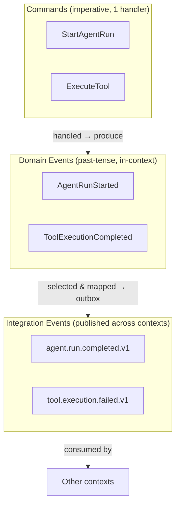
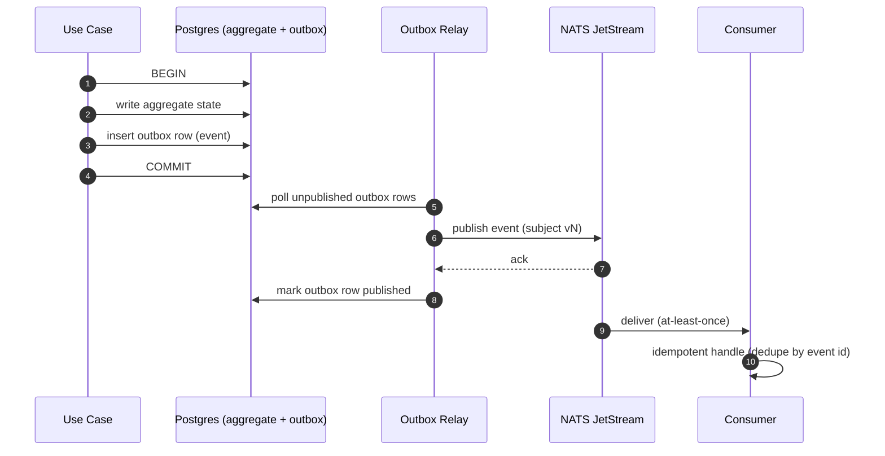
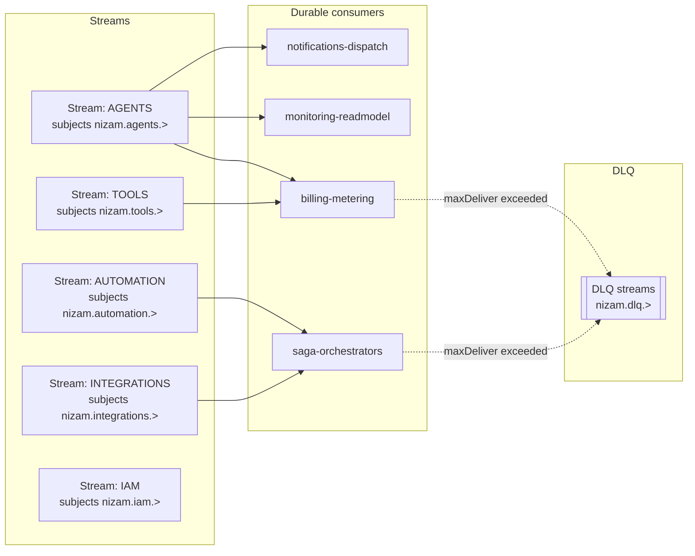
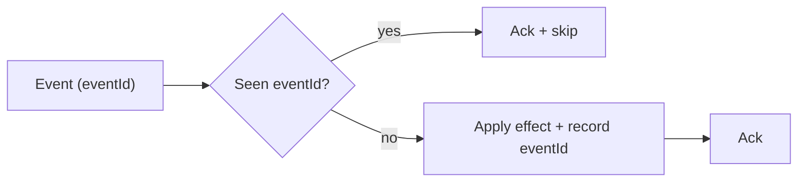
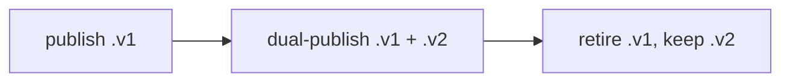
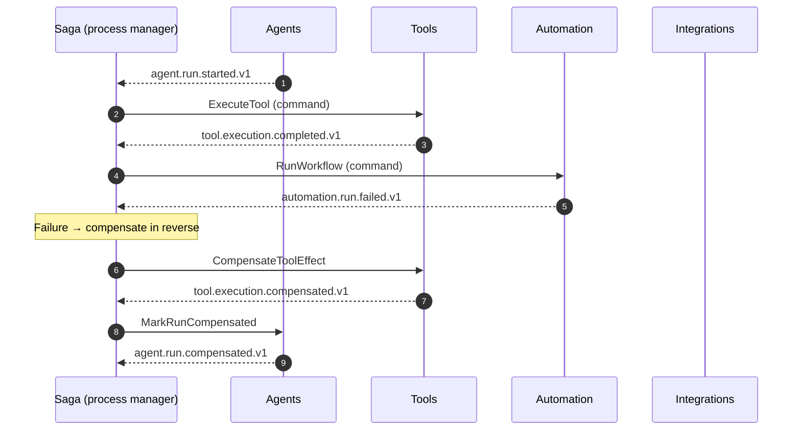
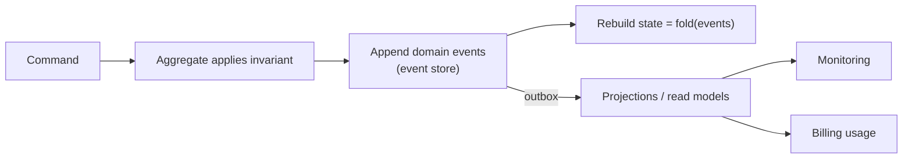
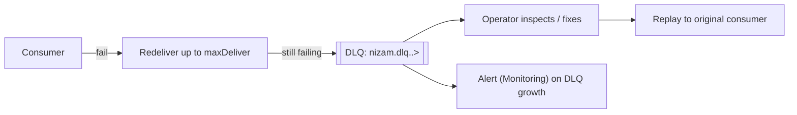

# 12 — Event Architecture

> The event-driven backbone of **Nizam — the Bayan AI Operating System**: taxonomy, the Transactional Outbox, NATS JetStream topology, delivery guarantees, sagas, event sourcing, and evolution.

**Status:** Approved (Phase 1) | **Version:** 1.0.0 | **Last updated:** 2026-07-01 | **Owner:** Architecture (Nizam Core)

---

## 1. Why events

Nizam is **event-driven by default**. State changes in one bounded context become facts that other contexts react to — asynchronously, decoupled, and observably. Synchronous calls are reserved for direct request/response user actions (`11-API-Strategy.md`); everything else flows as events over **NATS JetStream**, sourced from a **Transactional Outbox**.

This gives us loose coupling (contexts never share a database), resilience (at-least-once delivery + retries), and auditability (every state change is a recorded fact).

---

## 2. Event taxonomy



| Type | Direction | Tense/mood | Consumers | Notes |
|------|-----------|-----------|-----------|-------|
| **Command** | Request into a context | Imperative (`StartAgentRun`) | Exactly one handler | May be rejected; not a fact. |
| **Domain event** | Inside a context | Past tense (`AgentRunStarted`) | In-context handlers | Internal to the aggregate; not all are published. |
| **Integration event** | Across contexts | Past tense, versioned (`agent.run.completed.v1`) | Many contexts | The public contract; governed by AsyncAPI + schema registry. |

**Rule:** other contexts consume **integration events only** — never another context's raw domain events or tables.

---

## 3. Transactional Outbox

State and its outgoing events are written in **one database transaction**, then relayed to JetStream. No lost events, no phantom events.



- The **outbox table** lives beside the aggregate; the relay is at-least-once, so consumers must be idempotent.
- For local/dev, **Redis Streams** is the lightweight fallback broker (same publisher port).

---

## 4. NATS JetStream topology

### 4.1 Subject naming convention

```
nizam.<context>.<aggregate>.<event>.vN
```

Examples: `nizam.agents.run.completed.v1`, `nizam.tools.execution.failed.v1`, `nizam.automation.run.compensated.v1`.

### 4.2 Streams, consumers, durable subscriptions



- **Streams** are grouped per bounded context (`nizam.<context>.>`) with retention and replica settings sized per volume.
- **Durable consumers** (one per subscriber concern, e.g. `billing-metering`) keep their own cursor; restarts resume where they left off.
- **Ack policy**: explicit ack; `maxDeliver` bounds redelivery before routing to DLQ.

---

## 5. Delivery guarantees, ordering, idempotency

- **At-least-once** delivery (outbox relay + JetStream redelivery). Duplicates are possible by design.
- **Idempotent consumers**: each event has a stable `eventId`; consumers dedupe on `(eventId)` or a business idempotency key before applying effects.
- **Ordering**: guaranteed **per subject/partition** (per aggregate), not globally. Handlers tolerate out-of-order arrival across aggregates and use version/sequence checks where order matters.
- **Exactly-once effect** is achieved via idempotent handling on top of at-least-once delivery — never assumed from the broker.



---

## 6. Event schema, AsyncAPI & schema registry

- Every integration event has a **published schema** (envelope + payload), governed by **AsyncAPI 2.6** and stored in a **schema registry**.
- **Envelope (illustrative — design only):**

```jsonc
{
  "eventId": "0190f2...",          // UUID v7
  "type": "nizam.agents.run.completed.v1",
  "occurredAt": "2026-07-01T10:22:31Z",
  "tenantId": "0190a1...",
  "correlationId": "b3-4bf92...", // == trace id
  "causationId": "0190ee...",     // event/command that caused this
  "version": 1,
  "payload": { "runId": "0190...", "status": "succeeded" }
}
```

- Producers validate outgoing events against the registered schema; consumers validate on intake.

---

## 7. Versioning & evolution

- Version is encoded **in the subject** (`.vN`) and the envelope.
- **Backward-compatible** changes (adding optional fields) stay within the same version.
- **Breaking** changes publish a new version (`.v2`); producers **dual-publish** `v1` and `v2` during a transition window while consumers migrate, then `v1` is retired.
- Aligns with REST `/v1` versioning and DB expand/contract migrations (`03-Architecture.md` §18).



---

## 8. Sagas / process managers (cross-context flows)

Multi-step flows that span contexts (e.g. an Intent that runs **Agents → Tools → Automation → Integrations**) are coordinated by **sagas / process managers** that react to events and issue compensating actions on failure.



- Sagas hold their own persistent state and are **idempotent** and **resumable**.
- Compensation runs in **reverse order** of the completed steps.

---

## 9. Event sourcing for critical aggregates

Critical aggregates — **Agent runs**, **Tool executions**, and **Automations** — are **event-sourced**: their state is the fold of an append-only event log, giving full history, replay, and audit.



- Non-critical aggregates use classic state storage + outbox (no full sourcing).
- Read models are **projections** rebuilt by replaying events — recoverable and CQRS-friendly.

---

## 10. DLQ, poison handling, and replay



- After `maxDeliver` redeliveries, a message is a **poison** message and moves to a per-context **DLQ**.
- **Replay**: JetStream retention allows re-consuming from a sequence/time to rebuild projections or reprocess after a fix.
- DLQ depth is an **alerting SLO** in Monitoring.

---

## 11. Eventual consistency implications

- Read models lag writes by the propagation delay; the UI communicates "processing" states rather than assuming instant consistency.
- Cross-context invariants are enforced by **sagas + compensation**, not distributed transactions.
- Cache invalidation is event-driven (`03-Architecture.md` §13), so caches converge as events arrive.
- Clients must treat webhook/stream events as at-least-once and idempotent (`11-API-Strategy.md`).

---

## 12. Event catalog (key events per bounded context)

> Illustrative — design only. The AsyncAPI document + schema registry are authoritative.

| Context | Event (subject) | Meaning |
|---------|-----------------|---------|
| IAM | `nizam.iam.tenant.created.v1` | A new tenant was provisioned. |
| IAM | `nizam.iam.user.role.changed.v1` | A user's role/permissions changed. |
| AI (Bayan Gateway) | `nizam.ai.intent.received.v1` | A validated Intent entered Nizam. |
| Agents | `nizam.agents.run.started.v1` | An agent run began. |
| Agents | `nizam.agents.run.step.completed.v1` | A plan step finished. |
| Agents | `nizam.agents.run.completed.v1` | An agent run succeeded. |
| Agents | `nizam.agents.run.compensated.v1` | An agent run was rolled back. |
| Tools | `nizam.tools.execution.started.v1` | A tool invocation began. |
| Tools | `nizam.tools.execution.completed.v1` | A tool invocation succeeded. |
| Tools | `nizam.tools.execution.failed.v1` | A tool invocation failed. |
| Automation | `nizam.automation.run.started.v1` | An n8n-backed workflow started. |
| Automation | `nizam.automation.run.completed.v1` | A workflow finished. |
| Automation | `nizam.automation.run.compensated.v1` | A workflow was compensated. |
| Integrations | `nizam.integrations.connection.degraded.v1` | A connector's health dropped. |
| Billing | `nizam.billing.usage.recorded.v1` | Metered usage was recorded. |
| Billing | `nizam.billing.quota.exceeded.v1` | A tenant hit a plan quota. |
| Notifications | `nizam.notifications.dispatched.v1` | A notification was delivered. |
| Settings | `nizam.settings.changed.v1` | Tenant/user config or a flag changed. |
| Administration | `nizam.admin.plugin.approved.v1` | A plugin/connector was approved for the marketplace. |
| Monitoring | `nizam.monitoring.slo.breached.v1` | An SLO error budget was breached. |

---

## Related Documents

- `03-Architecture.md` — queue strategy, error handling, sagas, versioning, data flow.
- `11-API-Strategy.md` — webhooks and realtime streams that project from these events.
- `21-Database-Design.md` — outbox table, event store, audit log design.
- `audit/Risks-Report.md` — eventual-consistency and delivery risks.

## Change Log

| Version | Date | Author | Change |
|---------|------|--------|--------|
| 1.0.0 | 2026-07-01 | Architecture (Nizam Core) | Initial approved Phase 1 event architecture. |
