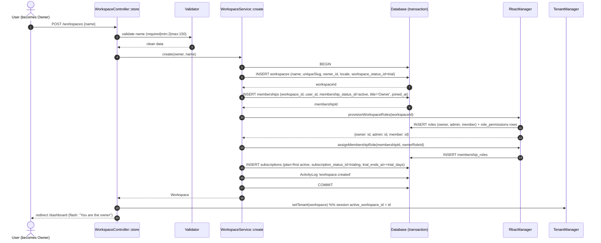

# 12 — Workspace Management

Workspaces are the tenants of HalaOps; this document defines how a workspace is created, provisioned, switched, governed, and retired across its whole lifecycle.

## Related Documents

- [08 — Multi-Tenant Architecture](08-Multi-Tenant.md) — how `workspace_id` isolation is enforced at the model layer.
- [13 — Subscription System](13-Subscription-System.md) — the trial subscription attached at workspace creation and the plan limits a workspace runs under.
- [07 — RBAC](07-RBAC.md) — the roles (`owner`, `admin`, `member`, …) and permissions that gate workspace operations.
- [14 — Billing System](14-Billing-System.md) — invoices/payments tied to a workspace's subscription.
- [05 — Database Architecture](05-Database-Architecture.md) and [06 — ERD](06-ERD.md) — the canonical schema for `workspaces`, `memberships`, `roles`.

---

## Purpose (الهدف)

A **workspace** (مساحة العمل) is the root tenant object in HalaOps. Every business that buys HalaOps gets exactly one workspace row that owns all of its data: members, roles, jobs, applications, interviews, AI credentials, subscription, invoices and settings. This document specifies:

- How any authenticated user creates a workspace and atomically becomes its **Owner** (المالك).
- How a **Super Admin** (مدير المنصة) provisions workspaces on behalf of customers and assigns an owner.
- How a user who belongs to several workspaces switches the active tenant.
- Membership and invitation management, ownership transfer, workspace settings, suspension/cancellation, and deletion with its data-lifecycle guarantees.

The single implementation that creates a workspace lives in `app/Services/Tenancy/WorkspaceService.php`; the HTTP surface lives in `app/Controllers/App/WorkspaceController.php`; the active-tenant authority is `app/Services/Tenancy/TenantManager.php`.

## Why It Exists (سبب وجوده)

HalaOps is sold to thousands of companies on shared infrastructure. The workspace object is what makes "multi-tenant" concrete: it is the value that every tenant-scoped query filters on (`WHERE workspace_id = :active`), the unit a subscription is billed against, and the boundary a Super Admin manages.

Provisioning a tenant is not a single INSERT. A usable tenant needs, all at once: the workspace row, the creator's active membership, the default role set for that workspace, the Owner role assigned to the creator, and a trial subscription so billing state is never null. If any of these steps fails, a half-created workspace would leave a user "in" a workspace they cannot administer, or a workspace with no billing state. Centralising this in one atomic service (one source of truth, run identically for self-service registration, the in-app "new workspace" flow, and Super Admin provisioning) is the reason `WorkspaceService` exists.

## Architecture

| Component | File | Responsibility |
|-----------|------|----------------|
| `WorkspaceService` | `app/Services/Tenancy/WorkspaceService.php` | Atomic tenant provisioning (`create()`), trial subscription bootstrap (`startTrialSubscription()`). |
| `WorkspaceController` | `app/Controllers/App/WorkspaceController.php` | HTTP: `create()` form, `store()`, `select()`, `switch()`. |
| `TenantManager` | `app/Services/Tenancy/TenantManager.php` | Holds the active `workspace_id` for the request; `setTenant()`, `setById()`, `bootFor()`, `userBelongsTo()`, `clear()`. |
| `Workspace` model | `app/Models/Workspace.php` | Global (non-tenant-scoped) model; `owner()`, `isActive()`, `activeSubscription()`, `membersCount()`, `uniqueSlug()`. |
| `Membership` model | `app/Models/Membership.php` | Tenant-scoped user↔workspace link with `roles()`, `syncRoles()`. |
| `RbacManager` | `app/Services/Rbac/RbacManager.php` | `provisionWorkspaceRoles()` and `assignMembershipRole()` from `config/rbac.php`. |
| `EnsureTenant` middleware | `app/Http/Middleware/EnsureTenant.php` | Forces an active tenant for tenant-scoped routes; redirects to the chooser otherwise. |
| `ActivityLog` | `app/Models/ActivityLog.php` | Records `workspace.created`, ownership transfer, suspension, deletion. |

**How it fits the system.** The `workspaces` table is global because a tenant cannot scope to itself; therefore `Workspace`, `User`, `Plan` and `ActivityLog` declare `protected static bool $tenantScoped = false`, while `Membership` and `Subscription` declare `true`. Cross-workspace reads needed during provisioning (e.g. uniqueness of a slug, counting members of another workspace) go through the explicit `withoutTenantScope()` escape hatch, never the implicit scope.

## Workflow

### 1. Self-service workspace creation

A logged-in user submits the "Create workspace" form (`resources/views/app/workspaces/create.php`) with a single field, `name`. `WorkspaceController::store()` validates it and calls `WorkspaceService::create(auth()->user(), $name)`. The service runs everything inside one database transaction.

The transaction guarantees all-or-nothing: a failure anywhere rolls back the workspace, membership, roles and subscription together, so there is never a partially provisioned tenant.

### 2. Super Admin provisioning with owner assignment

A Super Admin can create a workspace for any existing user (the customer's primary contact). The same `WorkspaceService::create($targetUser, $name)` is reused so the rules cannot drift; the only difference is that the *acting* user is the Super Admin while the *owner* is the target user passed as the first argument. Platform-side this is exposed through the planned `platform.workspaces.manage` permission (see [11 — Permissions Matrix](11-Permissions-Matrix.md)). Because `WorkspaceService` writes with explicit workspace ids and `withoutTenantScope()`, the Super Admin does not need an active tenant to provision one.

### 3. Workspace selection and switching

After login, `TenantManager::bootFor($user)` resolves the active tenant in this order: (a) the `active_workspace_id` stored in the session, **if** the user still has an *active* membership there; otherwise (b) the user's most-recent workspace (`User::workspaces()` ordered by `workspaces.created_at DESC`). A user with no workspaces (e.g. a fresh Super Admin) has no active tenant and operates platform-wide.

- `GET /workspaces/select` → if the user belongs to no workspaces they are redirected to `/workspaces/create`; otherwise they pick from `auth()->user()->workspaces()`.
- `POST /workspaces/switch` validates `workspace_id`, calls `TenantManager::userBelongsTo()`, and only then `setById()`. Switching rewrites `session.active_workspace_id` and redirects to the dashboard.

### 4. Members and invitations

Membership rows link users to a workspace with a config-driven status (`memberships.membership_status_id` → `lookup_values`, category `membership_status`): `active`, `invited`, or `suspended`. Inviting a member creates (or reactivates) a `memberships` row with an `invited` status, `invited_by`, and `invited_at`; accepting the invite flips it to `active` and stamps `joined_at`. Roles for the member are attached through `Membership::syncRoles()` which rewrites the `membership_roles` pivot. (The invitation UI/controller is a planned module gated by `members.invite`; the data model is built today.)

### 5. Ownership transfer

The Owner (or a Super Admin) may transfer ownership to another **active member** of the same workspace. The operation, run in a transaction: set `workspaces.owner_id` to the new user's id, ensure the new owner's membership holds the `owner` role, optionally demote the previous owner to `admin`, and write an `ownership.transferred` activity-log entry. The previous owner is never auto-removed from the workspace.

### 6. Suspension, cancellation, deletion

A workspace's config-driven status (`workspaces.workspace_status_id` → `workspace_statuses`: `trial`, `active`, `suspended`, `canceled`) drives access. Suspension and cancellation are reversible administrative states; deletion is the terminal, irreversible action governed by the data-lifecycle rules below.

## Business Rules

1. **Any authenticated user may create a workspace** and becomes its Owner; there is no separate "owner" account type — ownership is `workspaces.owner_id` plus the tenant `owner` role on the creator's membership.
2. **Provisioning is atomic.** Workspace row + owner membership (`active` status, `title='Owner'`) + default roles + Owner role assignment + trial subscription are created in one transaction or not at all.
3. **A new workspace starts in `trial` status** (`workspaces.workspace_status_id`) with a `trialing` subscription on the first active plan ordered by `sort_order`. If `trial_days = 0` the subscription is created `active` instead (see [13](13-Subscription-System.md)).
4. **If no active plan exists**, the workspace is still created but without a subscription row (`startTrialSubscription()` returns early). This only happens on a misconfigured install; the default seeder always inserts the Standard plan.
5. **Slugs are globally unique.** `Workspace::uniqueSlug()` slugifies the name and appends `-2`, `-3`, … until unique across all workspaces (`UNIQUE(slug)`).
6. **A user may belong to many workspaces**; capabilities are per-membership, never global, except the platform `super-admin` role.
7. **Owner cannot be removed or demoted while still the owner.** Ownership must be transferred first; this keeps `workspaces.owner_id` pointing at a real, active member (the FK is `ON DELETE RESTRICT`).
8. **Switching tenants requires an active membership** in the target workspace; `userBelongsTo()` rejects `invited`/`suspended` memberships.
9. **Suspension** sets the workspace's `workspace_status_id` to `suspended`: members can still authenticate to the platform but the workspace's tenant routes are blocked (see Edge Cases) until reactivated.
10. **Cancellation** sets the workspace's `workspace_status_id` to `canceled` and is typically driven by the subscription lifecycle (a `canceled`/`expired` subscription). Data is retained read-only during a grace period.
11. **Super Admins** may create, view, suspend, reactivate, cancel and delete any workspace regardless of active tenant, via platform permissions and `withoutTenantScope()`.

## Database Relations

Consistent with [§11 of the canonical schema](05-Database-Architecture.md):

- **`workspaces`** (GLOBAL): `id`, `name VARCHAR(150)`, `slug VARCHAR(160) UNIQUE`, `owner_id → users(id) ON DELETE RESTRICT`, `logo`, `locale`, `timezone DEFAULT 'Asia/Riyadh'`, `workspace_status_id → workspace_statuses(id)` (config-driven, no ENUM; default `trial`), `settings JSON`, `created_at`, `updated_at`. Indexed on `owner_id` and `workspace_status_id`.
- **`memberships`** (tenant): `id`, `workspace_id → workspaces(id) ON DELETE CASCADE`, `user_id → users(id) ON DELETE CASCADE`, `membership_status_id → lookup_values(id)` (config-driven, category `membership_status`: `active`/`invited`/`suspended`), `title`, `invited_by → users(id) ON DELETE SET NULL`, `invited_at`, `joined_at`. `UNIQUE(workspace_id, user_id)`, indexes on `user_id` and `membership_status_id`.
- **`roles`** (`workspace_id` set = tenant role) and pivots **`membership_roles`** (membership↔role) and **`role_permissions`** wire RBAC to the workspace.
- **`subscriptions`** (tenant): one row per workspace linking to `plans` (see [13](13-Subscription-System.md)).
- **`settings`** (tenant): `UNIQUE(workspace_id, key)` for per-workspace key/value configuration.
- **`activity_logs`**: nullable `workspace_id` records workspace events.

Because `owner_id` is `RESTRICT`, a user who owns a workspace cannot be deleted until ownership is transferred or the workspace is deleted. Because child tables CASCADE on `workspace_id`, deleting a workspace removes its memberships, roles, subscriptions, settings, and all domain data automatically.

## Permissions

Built permission groups gate workspace operations (from `config/rbac.php`):

| Action | Permission | Default roles holding it |
|--------|-----------|--------------------------|
| View workspace profile | `workspace.view` | owner, admin, member |
| Edit workspace / logo / locale | `workspace.update` | owner, admin |
| View members | `members.view` | owner, admin, member |
| Invite members | `members.invite` | owner, admin |
| Edit member roles/details | `members.update` | owner, admin |
| Remove members | `members.remove` | owner, admin |
| Manage roles | `roles.manage` | owner, admin |
| View settings | `settings.view` | owner, admin, member |
| Manage settings | `settings.manage` | owner, admin |

Ownership transfer, suspension, cancellation and deletion of one's own workspace are **Owner-only** (the `owner` role holds `'*'` — every tenant permission — and is the only tenant role with billing/ownership authority). Cross-workspace platform operations use the planned super-admin group `platform.workspaces.view` / `platform.workspaces.manage`, and platform-ops screens (`/system/*`) are gated by the built super-admin-only `system.manage` permission (see [22 — Super Admin Journey](22-SuperAdmin-Journey.md)). Permissions are enforced by `RequirePermission` middleware (`permission:workspace.update`) and `access()->allows()`.

## Validation

- **Workspace name** (`store()`): `required|min:2|max:150`. Trimmed before insert.
- **Slug**: not user-supplied; generated and de-duplicated by `Workspace::uniqueSlug()`.
- **`locale`**: inherited from the owner's `locale` (fallback `en`); when editable it is constrained to `in:en,ar`.
- **`workspace_id`** (switch): `required|integer`, then membership-validated via `userBelongsTo()` (defence in depth — validation alone is not authorization).
- **Logo upload** (settings): `mimes:png,jpg,jpeg,svg`, max size, stored through the files/storage abstraction (see [27 — Storage System](27-Storage-System.md)).
- **Ownership transfer**: target `user_id` must be an existing **active member** of the workspace (`exists` against `memberships` with an `active` membership status).
- **Settings keys**: constrained to a known allow-list per the settings module; values length-limited.

## Edge Cases

1. **Concurrent creation with the same name** — the slug uniqueness loop plus the `UNIQUE(slug)` constraint serialise the conflict; a duplicate insert raises a PDO exception that rolls back the transaction and the user can retry.
2. **No active plan at creation** — `startTrialSubscription()` returns early; the workspace exists with no subscription. Surfaced as "no subscription" in billing and resolved by an admin assigning a plan.
3. **Switching to a workspace where membership was just revoked** — `userBelongsTo()` re-checks the live membership status, so a stale session `active_workspace_id` cannot be used; `bootFor()` falls back to the most-recent valid workspace or none.
4. **Super Admin with zero workspaces** — `EnsureTenant` lets them through with no active tenant; tenant-scoped models that are actually touched must use `withoutTenantScope()` or they fail closed.
5. **Suspended/canceled workspace** — tenant routes are blocked for members while platform routes remain open to Super Admins; the user sees a clear "workspace suspended" state rather than a raw error.
6. **Deleting a user who owns a workspace** — blocked by the `RESTRICT` FK; the system instructs the operator to transfer ownership or delete the workspace first.
7. **Owner tries to leave their own workspace** — rejected with a message to transfer ownership first.
8. **Re-inviting an already-active member** — the `UNIQUE(workspace_id, user_id)` constraint prevents a duplicate membership; the flow updates the existing row instead.

## Security

- **Strict tenant isolation**: all tenant-bound reads/writes go through tenant-scoped models that fail closed when no tenant is active; cross-workspace access during provisioning is explicit (`withoutTenantScope()`), auditable, and confined to system/super-admin paths (see [08](08-Multi-Tenant.md), [34 — Security](34-Security.md)).
- **Authorization vs validation**: `switch()` validates the id *and* verifies membership; permission middleware guards every mutating route. Never trust a `workspace_id` from the request as proof of access.
- **CSRF**: all POST/PUT routes run through the `csrf` middleware (`VerifyCsrfToken`); forms emit `csrf_field()`.
- **Audit trail**: creation, ownership transfer, suspension and deletion write `activity_logs` rows with actor, subject, ip and user-agent for forensic review (see [38 — Audit System](38-Audit-System.md)).
- **Least privilege**: only the `owner` role (and Super Admins) can perform destructive workspace-level actions; `admin` deliberately lacks billing/ownership.
- **Output escaping**: workspace name/slug rendered via `e()` to prevent stored XSS from a malicious workspace name.

## Performance

- **Hot path — tenant resolution per request**: `bootFor()` runs once (guarded by a `$booted` flag) and issues at most one indexed lookup on `memberships(user_id, workspace_id)`.
- **Workspace switcher**: `User::workspaces()` joins `workspaces`↔`memberships` filtered by `memberships.user_id` and an `active` membership status, served by `memberships_user_id_index`.
- **Member counts**: `Workspace::membersCount()` is a single `COUNT` on the indexed `(workspace_id, membership_status_id)`; cache per workspace if shown on high-traffic pages.
- **Provisioning** is a short transaction with a bounded number of inserts (workspace, membership, ≤3 roles × their permissions, one subscription); no N+1 because role/permission maps are loaded once in `RbacManager`.
- All FKs (`owner_id`, `workspace_id`, `user_id`) are indexed, keeping joins and cascade deletes efficient.

## Testing

**Unit**
- `WorkspaceService::create()` provisions workspace + owner membership + roles + Owner assignment + trial subscription in one transaction; a forced failure (e.g. duplicate slug) rolls everything back (no orphan rows).
- `Workspace::uniqueSlug()` returns `acme`, then `acme-2`, `acme-3` for collisions.
- `TenantManager::userBelongsTo()` returns false for `invited`/`suspended` memberships and true for `active`.

**Feature (HTTP)**
- `POST /workspaces` with valid name creates a workspace and sets the session tenant; redirects to `/dashboard` with the owner flash.
- `GET /workspaces/select` redirects to `/workspaces/create` when the user has no workspaces.
- `POST /workspaces/switch` to a workspace the user does not belong to returns 403.
- Editing the workspace without `workspace.update` returns 403.

**Security**
- A member of company A cannot read or mutate company B's data even by forging `workspace_id` (tenant scope fails closed).
- Deleting an owner user is blocked by the `RESTRICT` FK.
- All mutating routes reject requests without a valid CSRF token.
- Super Admin can provision a workspace and assign an owner without an active tenant.

## Future Expansion

- **Workspace-level invitations module**: email-based invites with hashed, expiring tokens (mirrors password-reset anti-enumeration) layered on the existing `memberships` `invited`-status model.
- **Multiple owners / co-owners**: model already supports many memberships; add an `is_owner` flag or rely on the `owner` role for several members, with `workspaces.owner_id` as the billing-responsible party.
- **Sub-workspaces / sub-tenants**: a future `parent_workspace_id` could express org hierarchies without breaking row-level isolation.
- **DB-per-tenant migration path**: because every query is already `workspace_id`-scoped, a workspace can be relocated to a dedicated database/shard with minimal application change (see [36 — Scalability](36-Scalability.md)).
- **Soft-delete + scheduled hard-delete**: add `deleted_at` and a queue job to purge after the retention window (see Data Lifecycle below and [27](27-Storage-System.md)).

### Data Lifecycle (deletion)

1. **Suspend** (`workspace_status_id` = `suspended`) — immediate, reversible; blocks tenant access, preserves all data.
2. **Cancel** (`workspace_status_id` = `canceled`) — subscription ended; data kept read-only through a configurable grace period (e.g. 30 days) so the customer can re-subscribe or export.
3. **Export** — before hard deletion the owner/Super Admin can export workspace data (members, jobs, applications, invoices) via the storage/export tooling.
4. **Hard delete** — removes the `workspaces` row; `ON DELETE CASCADE` on every child table (`memberships`, `roles`, `subscriptions`, `settings`, `invoices`, `payments`, all domain tables) purges tenant data atomically. `activity_logs` and `payments` references that must outlive the tenant for accounting use `SET NULL` where the schema specifies it. The deletion itself is recorded (platform-level `activity_logs`).

## Open Questions

None at this time. The data-lifecycle grace-period length and whether deletion is soft-then-hard vs immediate-hard are configurable policy decisions to confirm with the business, but the schema and flow above support either.
