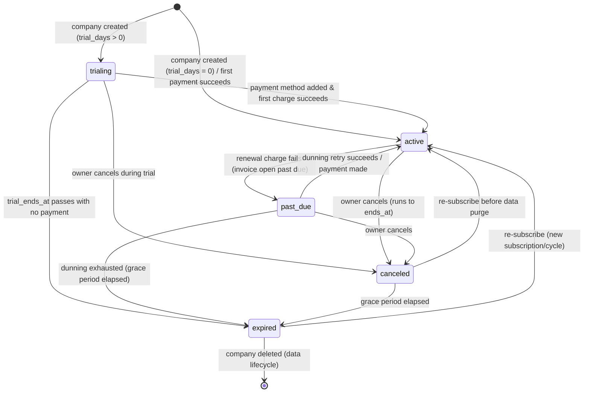

# 13 — Subscription System (نظام الاشتراكات)

Data-driven subscription plans and a strict per-company subscription lifecycle (trialing → active → past_due → canceled → expired) that gate what each tenant may do.

## Related Documents

- [12 — Workspace Management](12-Workspace-Management.md) — the trial subscription is created atomically when a workspace is provisioned.
- [14 — Billing System](14-Billing-System.md) — invoices, payments, taxes and dunning that move subscriptions between states.
- [15 — Payment Gateways](15-Payment-Gateways.md) — how recurring charges are taken to keep a subscription `active`.
- [07 — RBAC](07-RBAC.md) — `billing.view` / `billing.manage` gate subscription operations.
- [05 — Database Architecture](05-Database-Architecture.md) — canonical `plans` and `subscriptions` schema.

---

## Purpose (الهدف)

The subscription system answers two questions for every tenant: **"which plan are they on?"** and **"what is their current billing standing?"** Plans (الخطط) are catalogue rows describing price, billing interval, trial length, feature flags and numeric limits. A subscription (الاشتراك) is the live link between one company and one plan, carrying a lifecycle status and the billing window.

This document specifies the data-driven plan model, the subscription state machine, how plan **limits** (e.g. `max_members`) are enforced, upgrades/downgrades and the proration concept, and trial handling. The implementation today is `app/Models/Plan.php`, `app/Models/Subscription.php`, the trial bootstrap in `app/Services/Tenancy/WorkspaceService.php`, and the default plan in `database/seeders/DatabaseSeeder.php`.

## Implementation status (built — Phase 16)

The **read side** and a **manual subscribe path** are built; the automated lifecycle (renewal, dunning, proration) remains design. `App\Services\Billing\BillingService` works over the existing `subscriptions` / `plans` / `invoices` tables (reusing the `Plan` and `Subscription` models) to:

- show the workspace's **current subscription** (`currentSubscription()` — latest non-deleted row, tenant-scoped),
- list **active + public** plans for the pricing/upgrade screen (`availablePlans()`),
- list the workspace's **invoices** (`invoices()`, read-only, status joined for display), and
- **`subscribe($planId)`** — the **in-app / manual path that always works with ZERO gateway keys**. It enforces that the plan is active **and** public, then upserts **one subscription row per workspace** (updates the existing row on a plan switch, else creates it), snapshotting `amount`/`currency`. Status is **`trialing`** only for a paid plan that defines trial days, otherwise **`active`** immediately (including free plans).

`App\Controllers\App\BillingController` (`index` / `subscribe` / `webhook`) renders the `app/billing` view; routes `GET /billing` and `POST /billing/subscribe` are gated by `billing.view` / `billing.manage` (the `webhook` is covered in [15](15-Payment-Gateways.md)). **No new tables** were added.

**Honest scope.** What is **not** built: the billing-layer **invoice generation**, the renewal/dunning worker, **proration**, and upgrade/downgrade validation against usage. Those stay as the design described below (and in [14 — Billing System](14-Billing-System.md)). Online checkout is an optional, inert-without-keys enhancement — see [15 — Payment Gateways](15-Payment-Gateways.md).

## Why It Exists (سبب وجوده)

HalaOps is sold as recurring SaaS, so a tenant must always have a well-defined billing state — there is no "free-forever, no record" mode. The business also needs to change pricing and packaging (new plans, new limits, annual options, promotions) **without shipping code**, because the product runs on buyers' shared hosting with no CLI/Composer/build step. Storing plans as data with JSON `features`/`limits` means a new plan is an `INSERT`, and gating a feature is a lookup, never an `if ($plan === 'pro')`. A canonical state machine prevents the classic SaaS bugs (a "canceled" account that still bills, a "past_due" account with full access forever) by making every transition explicit and auditable.

## Architecture

| Component | File | Responsibility |
|-----------|------|----------------|
| `BillingService` (**built**) | `app/Services/Billing/BillingService.php` | Read side + manual subscribe: `currentSubscription()`, `availablePlans()`, `invoices()`, `subscribe()` (zero-gateway upsert of the workspace's single subscription row). |
| `BillingController` (**built**) | `app/Controllers/App/BillingController.php` | `index` (current sub + plans + invoices) / `subscribe` (manual path) / `webhook`; `app/billing` view. |
| `Plan` model | `app/Models/Plan.php` | Global catalogue; `active()`, `feature()`, `limit()`, `formattedPrice()`. JSON `features`/`limits` cast to arrays. |
| `Subscription` model | `app/Models/Subscription.php` | Tenant-scoped; `plan()`, `isActive()`, `onTrial()`; status + snapshotted `amount`/`currency`. |
| `WorkspaceService::startTrialSubscription()` | `app/Services/Tenancy/WorkspaceService.php` | Bootstraps the trial subscription on the first active plan at workspace creation. |
| `DatabaseSeeder` | `database/seeders/DatabaseSeeder.php` | Idempotently seeds the **Standard** plan (50.00 SAR / monthly / 14-day trial). |
| `Workspace::activeSubscription()` | `app/Models/Workspace.php` | Resolves the current `trialing|active` subscription for a workspace. |
| Billing layer | see [14](14-Billing-System.md) | Generates invoices and applies payments that drive state transitions. |

**How it fits.** A subscription is **tenant-scoped** (`Subscription::$tenantScoped = true`), so reading "my subscription" is automatically isolated by `workspace_id`; platform-wide queries (a Super Admin reviewing all subscriptions, or `Workspace::activeSubscription()` for an arbitrary workspace) use `withoutTenantScope()`. Plans are **global** (`Plan::$tenantScoped = false`) because the same catalogue is shared by every tenant. Crucially, `amount` and `currency` are **snapshotted onto the subscription** at subscribe time, so later edits to a plan's price never retroactively change an existing subscription.

## Workflow

### Lifecycle state machine

The five states are exactly the `key`s seeded in the `subscription_statuses` table that `subscriptions.subscription_status_id` points at: `trialing`, `active`, `past_due`, `canceled`, `expired`. `Subscription::isActive()` treats `trialing` and `active` as "in good standing"; `onTrial()` is true only for `trialing`.

### State meanings

| Status | Meaning | Access |
|--------|---------|--------|
| `trialing` | Inside the trial window (`now < trial_ends_at`); no payment required yet. | Full access to the plan's features/limits. |
| `active` | Paid and current; renews each billing cycle. | Full access. |
| `past_due` | A renewal charge failed; invoice is `open` and overdue; dunning in progress. | Access continues during a grace period, then is restricted. |
| `canceled` | Owner cancelled; remains usable until `ends_at`, then stops renewing. | Access through `ends_at`, then read-only grace. |
| `expired` | Trial lapsed unpaid, or dunning/grace exhausted. | No access; data retained for the retention window. |

### Subscribe / trial start

At workspace creation, `startTrialSubscription()` selects the first plan with `is_active = 1` ordered by `sort_order`, then inserts a subscription resolved to the `trialing` status (`subscription_status_id`) with `trial_ends_at = now + plan.trial_days` when `trial_days > 0`, or the `active` status immediately when `trial_days = 0`. `amount` and `currency` are copied from the plan.

### Upgrade / downgrade

Changing plans updates `subscriptions.plan_id` and re-snapshots `amount`/`currency`. **Upgrades** take effect immediately (the tenant gets the higher limits at once) and generate a prorated charge for the remainder of the cycle. **Downgrades** are validated against current usage (you cannot downgrade to a plan whose `max_members` is below the company's current active member count) and typically take effect at the next renewal, applying a prorated credit where the billing policy allows. Proration is a billing-layer computation (see [14](14-Billing-System.md)); the subscription simply records the resulting plan and amount.

## Business Rules

1. **Plans are data.** The catalogue grows by inserting `plans` rows — never by code. `features` and `limits` are JSON so packaging changes need no migration.
2. **Ships with one plan: "Standard"**, slug `standard`, **50.00 SAR**, `interval_id` → `billing_interval`/`monthly`, `trial_days=14`, `features={ai_providers,members,roles,activity_log: true}`, `limits={max_members:25}`. Seeded idempotently (skips if `slug='standard'` exists).
3. **Every workspace has at most one effective subscription in good standing.** `Workspace::activeSubscription()` returns the latest `trialing|active` row.
4. **Amount/currency are snapshotted** at subscribe/upgrade time; changing a plan's price never alters existing subscriptions retroactively.
5. **Trial length comes from the plan.** `trial_days > 0` → start `trialing` with `trial_ends_at`; `trial_days = 0` → start `active`.
6. **State transitions are explicit** and follow the diagram above. No code may skip from `trialing` straight to `expired` without the trial actually lapsing, nor keep billing a `canceled` subscription.
7. **`canceled` runs to `ends_at`.** Cancellation is not instant termination; the tenant keeps access until the paid period ends, then stops renewing.
8. **Plan limits are enforced at the action boundary**, not just in the UI. Example: inviting a member checks `plan.limit('max_members')` against `Workspace::membersCount()` before creating the membership.
9. **Only `is_active && is_public` plans are offered** on pricing/upgrade screens (`Plan::active()`); inactive or private plans may still back existing subscriptions but are not selectable.
10. **`plan_id` is `RESTRICT`** — a plan that backs any subscription cannot be deleted; deactivate it (`is_active=0`) instead.
11. **A company with no active plan at creation** simply has no subscription row; this is a misconfiguration handled gracefully (see [12](12-Workspace-Management.md)).

## Database Relations

Consistent with [§11 of the canonical schema](05-Database-Architecture.md):

- **`plans`** (GLOBAL): `id`, `name`, `slug VARCHAR(120) UNIQUE`, `description`, `price DECIMAL(10,2)`, `currency VARCHAR(3) DEFAULT 'SAR'`, `interval_id → lookup_values(id)` (category `billing_interval`: `monthly`/`yearly`), `trial_days INT`, `features JSON`, `limits JSON`, `is_active TINYINT(1)`, `is_public TINYINT(1)`, `sort_order INT`, timestamps. Index `plans_is_active_index`.
- **`subscriptions`** (tenant): `id`, `workspace_id → workspaces(id) ON DELETE CASCADE`, `plan_id → plans(id) ON DELETE RESTRICT`, `subscription_status_id → subscription_statuses(id) ON DELETE RESTRICT` (config-driven; `key`s `trialing`/`active`/`past_due`/`canceled`/`expired`), `amount DECIMAL(10,2)`, `currency`, `trial_ends_at`, `starts_at`, `ends_at`, `canceled_at`, timestamps. Indexes on `workspace_id`, `plan_id`, `subscription_status_id`.
- Links forward to **`invoices`** (`invoices.subscription_id → subscriptions(id) ON DELETE SET NULL`) — billing artifacts outlive a deleted subscription for accounting (see [14](14-Billing-System.md)).

`features`/`limits` are stored as JSON and cast to PHP arrays via the model `$casts`, read through `Plan::feature($key)` / `Plan::limit($key)`.

## Permissions

| Action | Permission | Default roles |
|--------|-----------|---------------|
| View subscription & plan | `billing.view` | owner, admin |
| Change plan / cancel / re-subscribe | `billing.manage` | **owner only** |

`admin` deliberately holds `billing.view` but **not** `billing.manage` (see `config/rbac.php`) — day-to-day administrators can see standing but cannot change the commercial relationship. Platform staff manage the plan catalogue via the planned `platform.plans.manage` permission (see [22 — Super Admin Journey](22-SuperAdmin-Journey.md)). As built, `GET /billing` is guarded by `permission:billing.view` and `POST /billing/subscribe` by `permission:billing.manage`.

## Validation

- **Plan selection** (upgrade/downgrade): `plan_id` `required|integer|exists:plans,id`, and the plan must be `is_active=1 && is_public=1`.
- **Downgrade guard**: target `plan.limit('max_members')` must be `>= Workspace::membersCount()`; otherwise rejected with a clear message to remove members first.
- **Cancellation**: confirmation required; sets `canceled_at=now`, computes `ends_at` from the current cycle.
- **Plan authoring** (platform): `slug` unique, `price >= 0`, `currency` ISO-4217 (3 chars), `interval_id` `exists:lookup_values,id` (category `billing_interval`), `trial_days >= 0`, `features`/`limits` valid JSON objects.
- **Currency consistency**: a subscription's `currency` must match its plan's currency at subscribe time.

## Edge Cases

1. **Trial expires with no payment method** → transition `trialing → expired`; tenant access restricted, data retained.
2. **Renewal charge fails** → `active → past_due`; dunning begins (see [14](14-Billing-System.md)); access continues during the grace period.
3. **Downgrade below current usage** → blocked at validation; the subscription is unchanged.
4. **Upgrade mid-cycle** → immediate higher limits + prorated charge; on payment failure the upgrade is rolled back to the prior plan and the subscription returns to its previous good-standing state.
5. **Plan price changed by platform** → existing subscriptions keep their snapshotted `amount`; only new subscribes/upgrades pick up the new price.
6. **Two rapid plan changes** → each writes `plan_id` + amount transactionally; the latest wins; activity log captures the sequence.
7. **Re-subscribe after `expired`** → a fresh subscription cycle (new `starts_at`, status `active` on successful payment), not a silent reuse of the dead row.
8. **No active plan during provisioning** → no subscription row; billing surfaces "no plan" and prompts assignment.
9. **Clock/timezone skew on `trial_ends_at`** → all timestamps stored UTC-consistently via `now()`; comparisons are server-side, never client-trusted.

## Security

- **Tenant isolation**: subscriptions are tenant-scoped and fail closed; one company can never read or mutate another's subscription. Platform reviews use the audited `withoutTenantScope()` path (see [08](08-Multi-Tenant.md)).
- **Authorization**: state-changing operations require `billing.manage` (owner); viewing requires `billing.view`. Enforced by middleware and `access()->allows()`.
- **No client-trusted state**: a subscription's status is derived from server-side billing events and timestamps, never set from a request parameter. The lifecycle transition methods are the only writers of `status`.
- **CSRF** on every mutating route; **audit** every plan change/cancellation to `activity_logs` with actor and before/after plan.
- **Integrity**: `plan_id` `RESTRICT` and `workspace_id` `CASCADE` keep referential integrity; snapshotting prevents price-tampering disputes.

## Performance

- **Hot path — "is this tenant in good standing?"**: a single indexed lookup on `subscriptions(workspace_id, subscription_status_id)`; cache the active subscription per request after the first resolve.
- **Limit checks**: `plan.limit('max_members')` reads already-loaded JSON (no extra query); the usage side (`membersCount()`) is one indexed `COUNT`.
- **Pricing page**: `Plan::active()` is a small, fully-indexed query over `plans` filtered by `is_active`/`is_public` and ordered by `sort_order`; cacheable since the catalogue changes rarely.
- JSON `features`/`limits` avoid a join-per-flag and avoid schema churn; decoded once per load.
- All FKs (`workspace_id`, `plan_id`, `subscription_status_id`) are indexed for fast renewal/dunning sweeps.

## Testing

**Unit**
- `Plan::feature()` / `limit()` read JSON correctly and honour defaults for missing keys.
- `Plan::formattedPrice()` renders `"50.00 SAR"`.
- `Subscription::isActive()` true for `trialing`/`active`, false otherwise; `onTrial()` only for `trialing`.
- `startTrialSubscription()` sets `trialing` + `trial_ends_at` for `trial_days=14`, and `active` for `trial_days=0`.
- `DatabaseSeeder` is idempotent — re-running does not duplicate the Standard plan.

**Feature (HTTP)**
- Upgrading applies the new `plan_id` and re-snapshots amount; downgrading below current member count is rejected.
- Cancelling sets `canceled_at` and `ends_at`; access persists until `ends_at`.
- A non-owner (admin) with `billing.view` but not `billing.manage` cannot change the plan (403).

**Security / lifecycle**
- A tenant cannot read another tenant's subscription.
- Subscription `status` cannot be set via a request field.
- Forced trial-expiry transitions `trialing → expired`; forced failed renewal transitions `active → past_due`; dunning success returns `past_due → active`.

## Future Expansion

- **Annual plans & promotions**: already supported by `interval_id` → `billing_interval`/`yearly` and additional plan rows; add coupon/discount tables without touching the lifecycle.
- **Metered / usage-based add-ons** (e.g. per-AI-interview): a `subscription_items` table layered on the existing subscription, with `limits` extended for usage caps.
- **Multiple concurrent products** per company: relax "one effective subscription" by scoping subscriptions to a product key.
- **Automated lifecycle worker**: the DB-backed queue (`queued_jobs`) and the token-gated cron URL (`GET /cron/run`) that would drive it **are built** (see [27 — Storage System](27-Storage-System.md) and [33 — Diagnostics](33-System-Diagnostics.md) for the cron heartbeat); the queued job that sweeps trials/renewals to drive transitions and dunning is **not yet registered** — the built subscribe path is manual/in-app only.
- **Grandfathering**: snapshotting already enables it; add a `legacy` flag on subscriptions to exclude them from forced migrations.

## Open Questions

None at this time. Exact proration formula and downgrade timing (immediate vs next-cycle credit) are billing-policy choices finalised in [14 — Billing System](14-Billing-System.md); the subscription schema and state machine support both.
