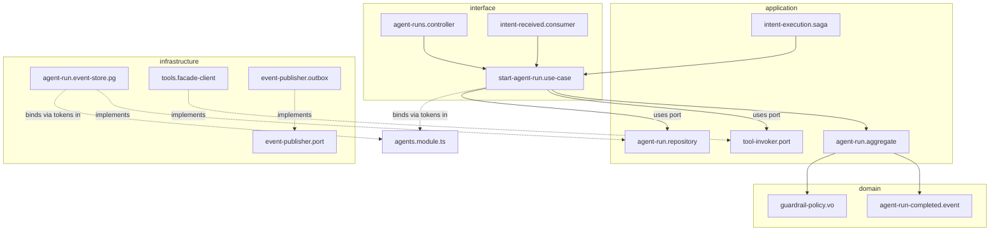

# Folder Structure

> The canonical production folder layout for the Nizam monorepo — where every app, package, bounded context, spec, migration, and deployment artifact lives, and why.

**Status: Approved (Phase 1) | Version: 1.0.0 | Last updated: 2026-07-01 | Owner: Architecture (Nizam Core)**

---

## 1. Principles Encoded by This Layout

The structure is designed to make the architecture inescapable:

- **Modular monolith first, service-extractable.** All bounded contexts ship in one deployable API today; each context is a self-contained folder with its own layers, so it can be lifted into its own service later with no rewrite.
- **Clean Architecture per module.** Every bounded context has `domain/ → application/ → infrastructure/ → interface/`. Folders make the dependency rule visible; a boundary linter enforces it.
- **12 bounded contexts (FIXED)** — Core, IAM, Agents, Tools, Automation, Integrations, AI (Bayan Gateway), Billing, Monitoring, Settings, Notifications, Administration. Each is one folder under `apps/api/src/modules/`.
- **Contracts are first-class.** OpenAPI/AsyncAPI specs, event schemas, and n8n workflow definitions live in versioned, reviewable folders — not scattered in code.
- **Shared, not duplicated.** Truly cross-cutting types/utilities live in `packages/`; business rules never do.

---

## 2. Monorepo Top-Level Tree

```
nizam/
├── apps/                          # Deployable applications (one build target each)
│   ├── api/                       # NestJS modular monolith — all 12 bounded contexts
│   ├── web/                       # Next.js 15 frontend (App Router, AR/EN RTL/LTR)
│   └── worker/                    # Background processors: outbox relay, BullMQ jobs, sagas, schedulers
│
├── packages/                      # Shared, versioned libraries (no business rules)
│   ├── kernel/                    # Shared kernel: Result/Either, base VOs, ids (UUIDv7), clock, tenant-context types
│   ├── contracts/                 # Generated TS types from OpenAPI/AsyncAPI + integration-event contracts
│   ├── config/                    # 12-factor env schema (zod) + typed config loader
│   ├── observability/             # OpenTelemetry setup, pino logger, correlation-id propagation
│   ├── eventing/                  # EventBus port + NATS JetStream / Redis Streams adapters, outbox helpers
│   ├── testing/                   # Shared test utilities: fakes, Testcontainers helpers, fixtures builders
│   └── ui/                        # Shared React UI kit (design system, Help Popup, Wizard, form primitives)
│
├── infra/                         # Everything to run & deploy Nizam
│   ├── docker/                    # Dockerfiles per app + local docker-compose (Postgres, Redis, NATS, n8n)
│   ├── helm/                      # Helm charts (api, web, worker, n8n) + values per environment
│   ├── k8s/                       # Raw manifests / kustomize overlays not owned by Helm
│   ├── terraform/                 # Cloud infra: cluster, DB, Redis, secrets manager, networking
│   ├── n8n/                       # n8n self-hosted config + exported workflow definitions (JSON, versioned)
│   └── observability/             # Prometheus/Grafana/Loki/Tempo config, dashboards, alert rules
│
├── migrations/                    # Expand/contract SQL migrations (design source; run by tooling, not app)
│   ├── <context>/                 # Migrations grouped by owning bounded context
│   └── shared/                    # Cross-cutting (audit_log, outbox, RLS policies, extensions: pgvector)
│
├── docs/                          # Architecture & product documentation (this phase's output)
│   ├── adr/                       # Architecture Decision Records
│   ├── openapi/                   # OpenAPI 3.1 REST specs (source of truth), per context
│   ├── asyncapi/                  # AsyncAPI 2.6 event specs (source of truth), per context
│   ├── diagrams/                  # Exported Mermaid/architecture diagrams
│   └── audit/                     # Architecture-Audit, Missing-Items, Risks reports
│
├── test/                          # Cross-app e2e & contract test suites (per-module unit tests stay colocated)
│   ├── e2e/                       # Full-stack intent-flow tests against a running system
│   └── contract/                  # Pact / schema-conformance suites (provider & consumer)
│
├── scripts/                       # Repo tooling: codegen, migration runner, seeders, lint helpers
├── .github/                       # CI/CD workflows, PR templates, CODEOWNERS
├── .dependency-cruiser.cjs        # Clean-Architecture boundary rules (CI-enforced)
├── eslint.config.mjs · .prettierrc · commitlint.config.cjs
├── tsconfig.base.json             # Strict TS base extended by every app/package
├── turbo.json  ·  pnpm-workspace.yaml
└── package.json  ·  README.md
```

---

## 3. Every Folder Explained

### Top level

| Path | Responsibility |
|------|----------------|
| `apps/` | Independently deployable applications; each has exactly one build/deploy target. |
| `apps/api/` | The NestJS modular monolith hosting all 12 bounded contexts behind one process. |
| `apps/web/` | Next.js 15 frontend for non-technical users; bilingual AR/EN, RTL/LTR. |
| `apps/worker/` | Out-of-request processing: transactional-outbox relay, BullMQ consumers, saga/process managers, scheduled jobs. |
| `packages/` | Cross-cutting shared libraries consumed by apps; contain infrastructure/utility only, never business rules. |
| `packages/kernel/` | Shared kernel primitives: `Result`, base `Entity`/`ValueObject`, UUIDv7 ids, `ClockPort`, tenant-context type. Mirrors the **Core (Kernel)** context's *shareable* pieces. |
| `packages/contracts/` | TS types generated from OpenAPI/AsyncAPI + hand-authored integration-event payload contracts; the typed boundary between contexts and clients. |
| `packages/config/` | The single 12-factor env schema and typed config loader; the only code allowed to read `process.env`. |
| `packages/observability/` | OpenTelemetry init, pino structured logger, correlation-id/trace propagation, redaction serializers. |
| `packages/eventing/` | `EventBus`/`EventPublisher` ports and their NATS JetStream (primary) + Redis Streams (fallback) adapters, plus outbox read/relay helpers. |
| `packages/testing/` | Shared fakes, Testcontainers setup, fixture/builder helpers used across suites. |
| `packages/ui/` | Design-system React components: Help Popup, Wizard, form field + `(!)` help icon, Basic/Advanced toggle. |
| `infra/` | All build, deploy, and run artifacts. |
| `infra/docker/` | Per-app Dockerfiles and the local `docker-compose.yml` (Postgres 16, Redis 7, NATS JetStream, n8n). |
| `infra/helm/` | Helm charts for `api`, `web`, `worker`, `n8n`; per-env `values-*.yaml`; HPA definitions. |
| `infra/k8s/` | Manifests/kustomize overlays not covered by Helm (namespaces, network policies). |
| `infra/terraform/` | Provisioning of cluster, managed Postgres/Redis, secrets manager, networking. |
| `infra/n8n/` | Self-hosted n8n configuration and **exported workflow definitions** (versioned JSON) that the Automation Engine drives. |
| `infra/observability/` | Prometheus scrape config, Grafana dashboards, Loki/Tempo config, alerting rules. |
| `migrations/` | Expand/contract DB migrations as the design source of record; applied by the migration runner in CI/CD, never by the app at runtime. |
| `migrations/<context>/` | Migrations owned by a single bounded context (that context owns its tables). |
| `migrations/shared/` | Cross-cutting schema: `audit_log`, `outbox`, RLS policies, extensions (`pgvector`), common trigger functions. |
| `docs/` | All architecture and product documentation (Phase 1 deliverables). |
| `docs/adr/` | Architecture Decision Records — one file per non-obvious decision. |
| `docs/openapi/` | OpenAPI 3.1 REST contracts (source of truth), organized per context. |
| `docs/asyncapi/` | AsyncAPI 2.6 event contracts (source of truth), organized per context. |
| `docs/diagrams/` | Rendered/exported diagrams referenced by docs. |
| `docs/audit/` | Architecture-Audit, Missing-Items, and Risks reports. |
| `test/e2e/` | Full-stack, intent-flow end-to-end suites against a running system. |
| `test/contract/` | Consumer/provider contract suites validating OpenAPI/AsyncAPI conformance. |
| `scripts/` | Repo automation: type/codegen from specs, migration runner, tenant seeders. |
| `.github/` | CI/CD pipelines, PR template, `CODEOWNERS` (per-context ownership). |
| `.dependency-cruiser.cjs` | Machine-enforced Clean-Architecture layer + cross-context boundary rules. |

> **Note on per-module unit tests:** `*.spec.ts` files are **colocated** with their source inside each module (see §5). Only cross-app `e2e/` and `contract/` suites live in the top-level `test/`.

---

## 4. `apps/api/` Internals

```
apps/api/
├── src/
│   ├── main.ts                    # Bootstrap: config validate → OTel → Nest app → listen (fail-fast)
│   ├── app.module.ts              # Root composition root — imports every context module
│   ├── modules/                   # The 12 bounded contexts (each = one folder, one NestJS module)
│   │   ├── core/                  # Kernel context: base types, event-bus abstractions, tenant context
│   │   ├── iam/                   # Identity & Access: tenants, users, roles, RBAC/ABAC, AuthN/AuthZ
│   │   ├── agents/                # Agent Framework (detailed in §5)
│   │   ├── tools/                 # Tool Registry: definitions, JSON Schemas, versioning, scopes
│   │   ├── automation/            # Automation Engine: workflows, triggers, n8n adapter, retries, compensation
│   │   ├── integrations/          # External connectors (ACLs): CRM, email, messaging, calendars, storage
│   │   ├── ai/                    # Bayan Gateway ACL + LlmProvider port; intent intake, context assembly
│   │   ├── billing/               # Plans, subscriptions, metering, quotas, invoices
│   │   ├── monitoring/            # Health, metrics, traces, audit read models, SLOs, alerts (read-side)
│   │   ├── settings/              # Tenant/user config, feature flags, Basic/Advanced mode, localization
│   │   ├── notifications/         # Multi-channel delivery, templates, preferences, digests
│   │   └── administration/        # Back-office: tenant lifecycle, global flags, audited impersonation
│   └── shared/                    # API-app-local wiring only (global filters, guards, interceptors, pipes)
├── test/                          # API-scoped e2e specs
├── Dockerfile → (see infra/docker)
├── nest-cli.json · tsconfig.json · project.json
└── README.md                      # Required per-app README (constitution)
```

Each folder under `modules/` is a complete bounded context and follows the identical Clean-Architecture layout shown next.

---

## 5. Anatomy of ONE Bounded Context — `modules/agents/`

This is the reference layout **every** context copies. Agents (the Agent Framework) is shown in full.

```
modules/agents/
├── agents.module.ts               # Composition root: binds ports→adapters via tokens, registers controllers/consumers
├── index.ts                       # Public surface: the ONLY thing other contexts may import (facade + event types)
├── README.md                      # Required: purpose, public contract, layer map (constitution)
│
├── domain/                        # ← innermost. Imports: kernel only. No frameworks, no I/O.
│   ├── aggregates/
│   │   ├── agent.aggregate.ts             # Agent definition aggregate root
│   │   └── agent-run.aggregate.ts         # Event-sourced run aggregate (critical aggregate)
│   ├── entities/
│   │   └── plan-step.entity.ts            # Non-root entity within a run
│   ├── value-objects/
│   │   ├── agent-id.vo.ts                 # Immutable, self-validating
│   │   ├── guardrail-policy.vo.ts
│   │   └── memory-scope.vo.ts
│   ├── events/
│   │   ├── agent-run-started.event.ts     # Past-tense, immutable domain events
│   │   ├── agent-run-completed.event.ts
│   │   └── agent-run-failed.event.ts
│   ├── services/
│   │   └── plan-resolution.domain-service.ts   # Rule spanning aggregates, stateless
│   ├── ports/
│   │   ├── agent.repository.ts            # Repository PORT (interface only)
│   │   ├── agent-run.repository.ts
│   │   └── guardrail-evaluator.port.ts
│   └── errors/
│       └── agents.errors.ts               # Typed domain errors (AGENTS.* codes)
│
├── application/                   # ← use cases. Imports: domain + kernel. No infra.
│   ├── use-cases/
│   │   ├── start-agent-run/
│   │   │   ├── start-agent-run.use-case.ts
│   │   │   └── start-agent-run.spec.ts    # Colocated unit test (fake ports)
│   │   ├── advance-plan-step/
│   │   └── query-agent-run/               # CQRS read path
│   ├── dtos/
│   │   ├── start-agent-run.command.ts
│   │   └── agent-run.view.dto.ts
│   ├── ports/
│   │   ├── tool-invoker.port.ts           # Outbound port to the Tools context (via its facade)
│   │   └── event-publisher.port.ts
│   └── sagas/
│       └── intent-execution.saga.ts       # Process manager: Agents→Tools→Automation→Integrations, with compensation
│
├── infrastructure/                # ← adapters. Imports: application + domain + SDKs. No interface.
│   ├── persistence/
│   │   ├── agent.repository.pg.ts         # Postgres adapter implementing the domain port
│   │   ├── agent-run.event-store.pg.ts    # Event-sourced store for run aggregate
│   │   └── agent.mapper.ts                # Domain ↔ row mapping
│   ├── messaging/
│   │   └── agents.event-publisher.outbox.ts   # Writes domain events to the transactional outbox
│   ├── clients/
│   │   └── tools.facade-client.ts         # Adapter over the Tools context public facade
│   └── config/
│       └── agents.config.ts               # Context-scoped config slice (from packages/config)
│
├── interface/                     # ← outermost. Imports: application (+ domain types). No direct I/O.
│   ├── http/
│   │   ├── agent-runs.controller.ts       # REST /v1/agent-runs; maps HTTP ↔ use case
│   │   └── dtos/                           # Request/response DTOs (camelCase wire types)
│   ├── events/
│   │   └── intent-received.consumer.ts    # Reacts to integration events from AI/Bayan Gateway
│   └── cli/
│       └── replay-agent-run.command.ts    # Operational CLI command
│
└── test/
    └── agent-runs.e2e-spec.ts             # Context-level e2e
```

### How the layers depend (Agents context)



Solid arrows are compile-time imports (always inward). Dotted arrows are runtime bindings wired in the composition root — the only place inner ports meet outer adapters.

---

## 6. `apps/web/` and `apps/worker/` (brief)

```
apps/web/                          apps/worker/
├── src/                           ├── src/
│   ├── app/        # App Router   │   ├── main.ts        # Worker bootstrap
│   │   ├── (basic)/# Basic Mode   │   ├── outbox/        # Outbox → NATS relay
│   │   └── (advanced)/            │   ├── jobs/          # BullMQ consumers
│   ├── components/ # + packages/ui│   ├── sagas/         # Long-running process managers
│   ├── i18n/       # AR/EN, RTL   │   └── schedulers/    # Cron/interval triggers
│   └── lib/                       └── README.md
└── README.md
```

`apps/web` consumes typed clients from `packages/contracts`; it never talks to the DB. `apps/worker` shares the same `modules/*` code as `apps/api` (imported as libraries), differing only in which entrypoints it activates — this is what keeps the monolith service-extractable.

---

## 7. Where the Named Artifacts Live (quick index)

| Artifact | Location |
|----------|----------|
| n8n config + exported workflows | `infra/n8n/` |
| The internal Automation Engine (owns n8n) | `apps/api/src/modules/automation/` |
| DB migrations (expand/contract) | `migrations/<context>/`, `migrations/shared/` |
| Helm charts | `infra/helm/` |
| OpenAPI 3.1 specs | `docs/openapi/` |
| AsyncAPI 2.6 specs | `docs/asyncapi/` |
| Integration-event TS contracts | `packages/contracts/` |
| Transactional outbox relay | `apps/worker/src/outbox/` + `packages/eventing/` |
| Sagas / process managers | `modules/<context>/application/sagas/` + `apps/worker/src/sagas/` |
| Per-module unit tests | Colocated `*.spec.ts` inside each module layer |
| Cross-app e2e / contract tests | `test/e2e/`, `test/contract/` |
| Module README (required) | `modules/<context>/README.md` |

---

## Related Documents

- [13-Coding-Standards.md](./13-Coding-Standards.md) — Rules the layout enforces
- [01-System-Overview.md](./01-System-Overview.md) — Contexts & execution chain
- [README.md — Project Constitution](../README.md) — README-per-module & docs-per-task rule
- [21-Database-Design.md](./21-Database-Design.md) — Migrations, tenancy, audit tables
- [03-Architecture.md](./03-Architecture.md) — How `infra/` is deployed
- [../README.md](../README.md) — Project entry point

---

## Change Log

| Version | Date | Author | Change |
|---------|------|--------|--------|
| 1.0.0 | 2026-07-01 | Architecture (Nizam Core) | Initial canonical monorepo folder structure for Phase 1. |
