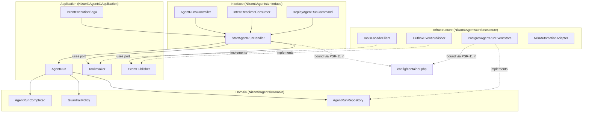

# Folder Structure

> The canonical production folder layout for the Nizam monorepo — a **native PHP 8.3+ modular monolith** (Composer, PSR-4, framework-agnostic) — showing where every module, bounded context, spec, migration, and deployment artifact lives, and why.

**Status: Approved (Phase 1) | Version: 1.0.0 | Last updated: 2026-07-01 | Owner: Architecture (Nizam Core)**

---

## 1. Principles Encoded by This Layout

The structure is designed to make the architecture inescapable:

- **Native PHP, framework-agnostic.** PHP 8.3+ with `declare(strict_types=1)` everywhere, Composer for dependency management, **PSR-4 autoloading** under the root vendor namespace `Nizam\`. Built on PSR standards (PSR-7/15 HTTP, PSR-11 container, PSR-3 logging via Monolog); **no full-stack framework lock-in** (no Laravel/Symfony-full). Select Composer components are used only behind ports.
- **Modular monolith first, service-extractable.** All bounded contexts ship in one deployable process today; each context is a self-contained module namespace with its own layers, so it can be lifted into its own service later with no rewrite.
- **Clean Architecture per module.** Every bounded context has `Domain/ → Application/ → Infrastructure/ → Interface/`. Folders make the dependency rule visible; static analysis (PHPStan/Psalm) plus an architecture ruleset enforce it.
- **12 bounded contexts (FIXED)** — Core (Kernel), IAM, Agents, Tools, Automation, Integrations, AI (Bayan Gateway), Billing, Monitoring, Settings, Notifications, Administration. Each is one folder under `src/Modules/` (Core lives in `src/Kernel/`).
- **One class per file.** `ClassName.php` matches its PascalCase class; the PSR-4 path mirrors the namespace exactly.
- **Contracts are first-class.** OpenAPI/AsyncAPI specs and n8n workflow definitions live in versioned, reviewable folders (`contracts/`, `infra/n8n/`) — not scattered in code.
- **README per folder (constitution rule 16).** Every module and every layer folder carries a `README.md` stating its purpose, public surface, and layer map.

---

## 2. Monorepo Top-Level Tree

```
nizam/
├── composer.json                  # PSR-4 autoload map (Nizam\ → src/), require/require-dev, scripts
├── composer.lock                  # Pinned dependency graph (committed)
├── phpunit.xml.dist               # PHPUnit suites: Unit, Integration, Contract, E2E
├── phpstan.neon                   # PHPStan level max + architecture/boundary rules
├── psalm.xml                      # Psalm config (taint + type coverage) — second static gate
├── .php-cs-fixer.dist.php         # PER/PSR-12 coding-style ruleset (replaces ESLint/Prettier)
├── .editorconfig · .gitattributes
│
├── public/                        # Web root — the ONLY publicly exposed directory
│   └── index.php                  # Front controller: PSR-7 request → PSR-15 middleware pipe → emit response
│
├── bin/                           # Console entrypoints (long-running workers & operational commands)
│   ├── console                    # Command bus dispatcher (PSR-11 resolved commands)
│   ├── queue-worker               # Redis-backed queue consumer (jobs, sagas)
│   ├── outbox-relay               # Transactional-outbox → NATS JetStream relay loop
│   └── scheduler                  # Cron/interval trigger loop
│
├── config/                        # 12-factor configuration (the only place env is read)
│   ├── container.php              # PSR-11 container definitions (port → adapter bindings)
│   ├── config.php                 # Typed config aggregation from env
│   ├── env.schema.php             # Env validation/typing at bootstrap (fail-fast)
│   ├── routes.php                 # PSR-15 route table (context controllers → paths)
│   └── middleware.php             # Global middleware pipeline order
│
├── src/                           # All application source (PSR-4 root: Nizam\ → src/)
│   ├── Kernel/                    # Core (Kernel) shared kernel — Nizam\Kernel\...
│   └── Modules/                   # The 11 business bounded contexts, one folder each
│       ├── Iam/                   # Nizam\Iam\...
│       ├── Agents/                # Nizam\Agents\...        (detailed in §5)
│       ├── Tools/                 # Nizam\Tools\...
│       ├── Automation/            # Nizam\Automation\...
│       ├── Integrations/          # Nizam\Integrations\...
│       ├── Ai/                    # Nizam\Ai\...            (Bayan Gateway ACL)
│       ├── Billing/               # Nizam\Billing\...
│       ├── Monitoring/            # Nizam\Monitoring\...
│       ├── Settings/              # Nizam\Settings\...
│       ├── Notifications/         # Nizam\Notifications\...
│       └── Administration/        # Nizam\Administration\...
│
├── tests/                         # PHPUnit — mirrors src/ (Nizam\Tests\... in composer autoload-dev)
│   ├── Unit/                      # Pure domain/application, no I/O (fakes for ports)
│   ├── Integration/               # Real Postgres/Redis/NATS via Testcontainers
│   ├── Contract/                  # OpenAPI/AsyncAPI conformance (provider & consumer)
│   └── E2E/                       # Full intent-flow against a running system
│
├── migrations/                    # Expand/contract SQL migrations (design source; run by tooling, not app)
│   ├── <context>/                 # Migrations grouped by owning bounded context
│   └── shared/                    # Cross-cutting: audit_log, outbox, RLS policies, extensions (pgvector)
│
├── contracts/                     # Interface contracts (source of truth, versioned)
│   ├── openapi/                   # OpenAPI 3.1 REST specs, per context
│   └── asyncapi/                  # AsyncAPI 2.6 event specs, per context
│
├── infra/                         # Everything to run & deploy Nizam
│   ├── docker/                    # Dockerfiles (php-fpm/cli) + local docker-compose (Postgres, Redis, NATS, n8n)
│   ├── k8s/                       # Raw manifests / kustomize overlays not owned by Helm
│   ├── helm/                      # Helm charts (api, worker, n8n) + values per environment
│   ├── n8n/                       # n8n self-hosted config + exported workflow definitions (JSON, versioned)
│   └── otel/                      # OpenTelemetry Collector config + Prometheus/Grafana/Loki/Tempo assets
│
├── apps/                          # Decoupled clients (orthogonal to the PHP backend)
│   └── web/                       # Next.js 15 operator console — consumes the PHP REST API only
│
├── docs/                          # Architecture & product documentation (this phase's output)
│   ├── adr/                       # Architecture Decision Records
│   ├── diagrams/                  # Exported Mermaid/architecture diagrams
│   └── audit/                     # Architecture-Audit, Missing-Items, Risks reports
│
├── .github/                       # CI/CD workflows, PR templates, CODEOWNERS (per-context ownership)
└── README.md                      # Repo entry point (Project Constitution rules apply repo-wide)
```

> **Naming:** PHP folders/namespaces are **PascalCase** (`src/Modules/Agents/Domain/`); non-PHP asset folders (docs, infra, contracts, migrations) are **kebab-case/lowercase**. One class per file, `ClassName.php`, path mirrors namespace.

---

## 3. Every Folder Explained

### Top level

| Path | Responsibility |
|------|----------------|
| `composer.json` | PSR-4 autoload map (`Nizam\` → `src/`, `Nizam\Tests\` → `tests/`), runtime/dev requirements, and dev scripts (test, stan, psalm, cs-fix). |
| `composer.lock` | The pinned, committed dependency graph — reproducible installs across environments. |
| `phpunit.xml.dist` | Test-runner config declaring the Unit/Integration/Contract/E2E suites that mirror `src/`. |
| `phpstan.neon` | PHPStan at max level plus custom rules enforcing the inward dependency rule and cross-context boundaries. |
| `psalm.xml` | Second static-analysis gate: type coverage and taint analysis for security-sensitive flows. |
| `.php-cs-fixer.dist.php` | PER/PSR-12 coding-style ruleset applied in CI and pre-commit (replaces ESLint/Prettier). |
| `public/` | The only web-exposed directory; contains nothing but the front controller. |
| `public/index.php` | Front controller: builds the PSR-7 request, runs the PSR-15 middleware pipeline, dispatches to a context controller, emits the response. No business logic. |
| `bin/` | Console/CLI entrypoints, including long-running background workers. |
| `bin/console` | Command dispatcher resolving console commands from the PSR-11 container. |
| `bin/queue-worker` | Redis-backed queue consumer processing jobs and saga steps behind the `Queue` port. |
| `bin/outbox-relay` | Reads the transactional `outbox` table and publishes integration events to NATS JetStream (Redis Streams fallback). |
| `bin/scheduler` | Cron/interval loop firing time-based triggers (Automation schedules, digests). |
| `config/` | 12-factor configuration; the only code permitted to read the environment. |
| `config/container.php` | PSR-11 container wiring — the single composition root binding domain ports to infrastructure adapters. |
| `config/config.php` | Typed, immutable config object assembled from validated env. |
| `config/env.schema.php` | Declares and validates required env vars at bootstrap; process fails fast if invalid. |
| `config/routes.php` | The PSR-15 route table mapping URL paths (`/v1/...`) to context controllers. |
| `config/middleware.php` | Global middleware order (tenant context, auth, correlation-id, error mapping). |
| `src/` | All PHP source; PSR-4 root namespace `Nizam\`. |
| `src/Kernel/` | The **Core (Kernel)** context: base `Entity`/`ValueObject`, `Result`/error types, UUIDv7 id generation, `ClockPort`, event-bus abstractions, `TenantContext`/`RequestContext`. No business rules. |
| `src/Modules/` | The 11 business bounded contexts; each is one folder = one namespace = one Clean-Architecture module. |
| `src/Modules/Iam/` | Identity & Access: tenants, users, orgs, roles, permissions, sessions, RBAC/ABAC; owns AuthN/AuthZ. |
| `src/Modules/Agents/` | Agent Framework: agent definitions, runtime/orchestration, agent runs, guardrails, memory scoping (see §5). |
| `src/Modules/Tools/` | Tool Registry: tool definitions, JSON Schemas, capability metadata, versioning, permission scopes. |
| `src/Modules/Automation/` | Automation Engine: workflow definitions, triggers, the n8n adapter, run history, retries, idempotency, compensation. |
| `src/Modules/Integrations/` | External connectors (ACLs): CRM, email, messaging, calendars, storage; credential binding, health. |
| `src/Modules/Ai/` | Bayan Gateway ACL + `LlmProvider` port; intent intake, context assembly, response shaping. No reasoning. |
| `src/Modules/Billing/` | Plans, subscriptions, metering/usage, quotas, invoices. |
| `src/Modules/Monitoring/` | Health, metrics, traces, audit read models, SLO tracking, alerting (read-side). |
| `src/Modules/Settings/` | Tenant/user config, feature flags, Basic/Advanced mode, localization prefs. |
| `src/Modules/Notifications/` | Multi-channel delivery (in-app, email, push, webhook), templates, preferences, digests. |
| `src/Modules/Administration/` | Back-office: tenant lifecycle, global flags, audited impersonation, announcements, marketplace approval. |
| `tests/` | PHPUnit suites mirroring `src/` (`Nizam\Tests\` autoloaded via `autoload-dev`). |
| `tests/Unit/` | Pure domain/application tests with fake ports; no I/O, no containers. |
| `tests/Integration/` | Adapter tests against real Postgres 16/Redis/NATS via Testcontainers. |
| `tests/Contract/` | Provider/consumer conformance to the OpenAPI/AsyncAPI specs in `contracts/`. |
| `tests/E2E/` | Full-stack intent-flow suites against a running system. |
| `migrations/` | Expand/contract DB migrations as the design source of record; applied by the migration runner in CI/CD, never by the app at runtime. |
| `migrations/<context>/` | Migrations owned by a single bounded context (that context owns its tables). |
| `migrations/shared/` | Cross-cutting schema: `audit_log`, `outbox`, RLS policies, extensions (`pgvector`), common trigger functions. |
| `contracts/` | First-class interface contracts, versioned and reviewed. |
| `contracts/openapi/` | OpenAPI 3.1 REST contracts (source of truth), per context. |
| `contracts/asyncapi/` | AsyncAPI 2.6 event contracts (source of truth), per context. |
| `infra/` | All build, deploy, and run artifacts. |
| `infra/docker/` | php-fpm/php-cli Dockerfiles and the local `docker-compose.yml` (Postgres 16, Redis 7, NATS JetStream, n8n). |
| `infra/k8s/` | Manifests/kustomize overlays not covered by Helm (namespaces, network policies). |
| `infra/helm/` | Helm charts for `api`, `worker`, `n8n`; per-env `values-*.yaml`; HPA definitions. |
| `infra/n8n/` | Self-hosted n8n configuration and **exported workflow definitions** (versioned JSON) that the Automation Engine drives. |
| `infra/otel/` | OpenTelemetry Collector config plus Prometheus/Grafana/Loki/Tempo dashboards and alerting rules. |
| `apps/` | Decoupled client applications; orthogonal to the PHP backend and deployed separately. |
| `apps/web/` | Next.js 15 operator console for non-technical users (AR/EN, RTL/LTR); consumes the PHP REST API only — never the DB. |
| `docs/` | All architecture and product documentation (Phase 1 deliverables). |
| `docs/adr/` | Architecture Decision Records — one file per non-obvious decision. |
| `docs/diagrams/` | Rendered/exported diagrams referenced by docs. |
| `docs/audit/` | Architecture-Audit, Missing-Items, and Risks reports. |
| `.github/` | CI/CD pipelines, PR template, `CODEOWNERS` (per-context ownership). |
| `README.md` | Repo entry point; the Project Constitution (README-per-folder, docs-per-task) applies repo-wide. |

> **README per folder:** Every module (`src/Modules/<Context>/README.md`) and each layer folder carries a README with purpose, public surface, and layer map — constitution rule 16.

---

## 4. Bounded-Context Module Shape

Each context under `src/Modules/` is a complete Clean-Architecture module. The namespace is `Nizam\<Context>\{Domain,Application,Infrastructure,Interface}` and every file is one PascalCase class, path-mirroring the namespace.

```
src/Modules/<Context>/
├── README.md                      # Required: purpose, public contract, layer map (constitution)
├── Domain/                        # ← innermost. Depends on Nizam\Kernel only. No frameworks, no I/O.
├── Application/                   # ← use cases. Depends on Domain + Kernel. No infra.
├── Infrastructure/                # ← adapters. Depends on Application + Domain + Composer SDKs.
└── Interface/                     # ← outermost. PSR-15 controllers, event consumers, console commands.
```

The next section shows the **Agents** context in full; every other context copies this exact shape.

---

## 5. Anatomy of ONE Bounded Context — `src/Modules/Agents/`

This is the reference layout **every** context copies. Namespace root: `Nizam\Agents\`. One class per file.

```
src/Modules/Agents/
├── README.md                              # Required: purpose, public surface, layer map (constitution)
│
├── Domain/                                # Nizam\Agents\Domain — pure PHP, imports Nizam\Kernel only
│   ├── AgentDefinition.php                # Aggregate root: an agent's configuration & guardrails
│   ├── AgentRun.php                       # Event-sourced run aggregate (critical aggregate)
│   ├── PlanStep.php                       # Non-root entity within a run
│   ├── ValueObject/
│   │   ├── AgentId.php                     # UUIDv7-backed, immutable, self-validating
│   │   ├── GuardrailPolicy.php
│   │   └── MemoryScope.php
│   ├── Event/
│   │   ├── AgentRunStarted.php             # Past-tense, immutable domain events
│   │   ├── AgentRunCompleted.php
│   │   └── AgentRunFailed.php
│   ├── Service/
│   │   └── PlanResolutionService.php       # Stateless rule spanning aggregates
│   ├── Port/                               # Repository/collaborator PORTS (interfaces only)
│   │   ├── AgentRepository.php             # interface — persistence contract
│   │   ├── AgentRunRepository.php          # interface — event-store contract
│   │   └── GuardrailEvaluator.php          # interface — policy evaluation contract
│   └── Exception/
│       └── AgentDomainException.php        # Typed domain errors (AGENTS.* codes)
│
├── Application/                           # Nizam\Agents\Application — use cases; imports Domain + Kernel
│   ├── Command/
│   │   ├── StartAgentRun/
│   │   │   ├── StartAgentRunCommand.php    # Input DTO
│   │   │   └── StartAgentRunHandler.php    # Command handler (depends on Domain ports)
│   │   └── AdvancePlanStep/
│   │       ├── AdvancePlanStepCommand.php
│   │       └── AdvancePlanStepHandler.php
│   ├── Query/                              # CQRS read path
│   │   ├── GetAgentRun/
│   │   │   ├── GetAgentRunQuery.php
│   │   │   └── GetAgentRunHandler.php
│   ├── Dto/
│   │   └── AgentRunView.php                # Read-model DTO returned to Interface layer
│   ├── Port/                               # Outbound application ports
│   │   ├── ToolInvoker.php                 # interface — outbound to Tools context facade
│   │   └── EventPublisher.php              # interface — outbound to the event backbone
│   └── Saga/
│       └── IntentExecutionSaga.php         # Process manager: Agents→Tools→Automation→Integrations, w/ compensation
│
├── Infrastructure/                        # Nizam\Agents\Infrastructure — adapters; imports Application + Domain
│   ├── Persistence/
│   │   ├── PostgresAgentRepository.php     # Implements Domain\Port\AgentRepository (PDO/Postgres 16, RLS-aware)
│   │   ├── PostgresAgentRunEventStore.php  # Implements Domain\Port\AgentRunRepository (event-sourced)
│   │   └── AgentRowMapper.php              # Domain ↔ row mapping
│   ├── Messaging/
│   │   ├── OutboxEventPublisher.php        # Implements Application\Port\EventPublisher (writes to outbox)
│   │   └── NatsAgentEventPublisher.php     # NATS JetStream publisher used by the outbox relay
│   ├── Client/
│   │   ├── ToolsFacadeClient.php           # Implements Application\Port\ToolInvoker (calls Tools facade)
│   │   └── N8nAutomationAdapter.php        # Adapter driving n8n via the Automation context
│   └── Config/
│       └── AgentsConfig.php                # Context-scoped config slice (from config/)
│
├── Interface/                             # Nizam\Agents\Interface — outermost; imports Application (+ Domain types)
│   ├── Http/
│   │   ├── AgentRunsController.php         # PSR-15 handler for /v1/agent-runs; maps HTTP ↔ command/query
│   │   └── Request/
│   │       └── StartAgentRunRequest.php    # Wire DTO (camelCase) → Application command
│   ├── Consumer/
│   │   └── IntentReceivedConsumer.php      # Consumes integration events from AI (Bayan Gateway)
│   └── Console/
│       └── ReplayAgentRunCommand.php       # Operational console command (invoked via bin/console)
│
└── (tests mirror this tree under tests/Unit|Integration|Contract|E2E/Modules/Agents/)
```

### What lives in each layer (Agents)

| Layer | Namespace | Contents | May depend on |
|-------|-----------|----------|---------------|
| **Domain** | `Nizam\Agents\Domain` | `AgentDefinition`, `AgentRun`, `PlanStep`; value objects (`AgentId`, `GuardrailPolicy`, `MemoryScope`); domain events; domain service; **repository/collaborator interfaces (ports)**; typed exceptions. | `Nizam\Kernel` only. No frameworks, no I/O. |
| **Application** | `Nizam\Agents\Application` | Command/query handlers, input/output **DTOs**, outbound ports (`ToolInvoker`, `EventPublisher`), the `IntentExecutionSaga`. Orchestrates domain via ports. | Domain + Kernel. No infrastructure. |
| **Infrastructure** | `Nizam\Agents\Infrastructure` | Postgres repositories/event store, outbox + **NATS JetStream** publisher, **n8n adapter**, Tools facade client, config slice — concrete implementations of the ports. | Application + Domain + Composer SDKs. |
| **Interface** | `Nizam\Agents\Interface` | **PSR-15 controllers**, **event consumers**, **console commands**; wire DTOs. Translates transport ↔ use cases. | Application (+ Domain types). No direct I/O. |

Binding of ports to adapters happens once, in `config/container.php` (the PSR-11 composition root) — the only place inner ports meet outer adapters.

### How the layers depend (Agents context)



Solid arrows are compile-time `use` imports — **always inward** (Interface → Application → Domain). Dotted arrows are runtime bindings wired in `config/container.php`. Domain depends on nothing but `Nizam\Kernel`; Infrastructure and Interface never depend on each other.

---

## 6. `public/`, `bin/`, and `apps/web/` (brief)

```
public/                     bin/                          apps/web/  (decoupled — orthogonal)
└── index.php               ├── console                   ├── src/
   PSR-7 request →          ├── queue-worker  # jobs      │   ├── app/        # App Router
   PSR-15 pipeline →        ├── outbox-relay  # outbox→   │   │   ├── (basic)/# Basic Mode
   context controller →     │                  NATS       │   │   └── (advanced)/
   emit PSR-7 response      └── scheduler     # cron       │   ├── components/
                                                           │   ├── i18n/       # AR/EN, RTL
                                                           │   └── lib/apiClient # OpenAPI-typed REST
                                                           └── README.md
```

`public/index.php` is the single HTTP entrypoint; the workers in `bin/` share the exact same `src/Modules/*` code (autoloaded via Composer), differing only in which entrypoints they activate — this is what keeps the monolith **service-extractable**. `apps/web` is a separate Next.js deployment that consumes only the PHP REST API described in `contracts/openapi/`; it never talks to the database and shares no PHP code.

---

## 7. Where the Named Artifacts Live (quick index)

| Artifact | Location |
|----------|----------|
| n8n config + exported workflows | `infra/n8n/` |
| The internal Automation Engine (owns n8n) | `src/Modules/Automation/` |
| n8n adapter (drives n8n from a context) | `src/Modules/<Context>/Infrastructure/Client/` (e.g., `Automation/Infrastructure/`) |
| DB migrations (expand/contract) | `migrations/<context>/`, `migrations/shared/` |
| Helm charts | `infra/helm/` |
| OpenAPI 3.1 specs | `contracts/openapi/` |
| AsyncAPI 2.6 specs | `contracts/asyncapi/` |
| Queue workers (Redis-backed) | `bin/queue-worker` + `Queue` port impl in `src/Kernel/` / context Infrastructure |
| Transactional outbox relay | `bin/outbox-relay` (reads `migrations/shared/` outbox table → NATS) |
| Sagas / process managers | `src/Modules/<Context>/Application/Saga/` (driven by `bin/queue-worker`) |
| Front controller (PSR-7/15 entry) | `public/index.php` |
| PSR-11 container / composition root | `config/container.php` |
| Static-analysis config | `phpstan.neon`, `psalm.xml`, `.php-cs-fixer.dist.php` |
| Tests (Unit/Integration/Contract/E2E) | `tests/` (mirrors `src/`), configured by `phpunit.xml.dist` |
| Module README (required) | `src/Modules/<Context>/README.md` (+ per-layer READMEs) |

---

## Related Documents

- [13-Coding-Standards.md](./13-Coding-Standards.md) — PHP/PSR rules the layout enforces
- [01-System-Overview.md](./01-System-Overview.md) — Contexts & execution chain
- [README.md — Project Constitution](../README.md) — README-per-folder & docs-per-task rule
- [21-Database-Design.md](./21-Database-Design.md) — Migrations, tenancy, audit tables
- [03-Architecture.md](./03-Architecture.md) — How `infra/` is deployed
- [../README.md](../README.md) — Project entry point

---

## Change Log

| Version | Date | Author | Change |
|---------|------|--------|--------|
| 1.0.0 | 2026-07-01 | Architecture (Nizam Core) | Initial canonical monorepo folder structure for Phase 1 — native PHP 8.3+ (Composer, PSR-4, framework-agnostic) layout. |
