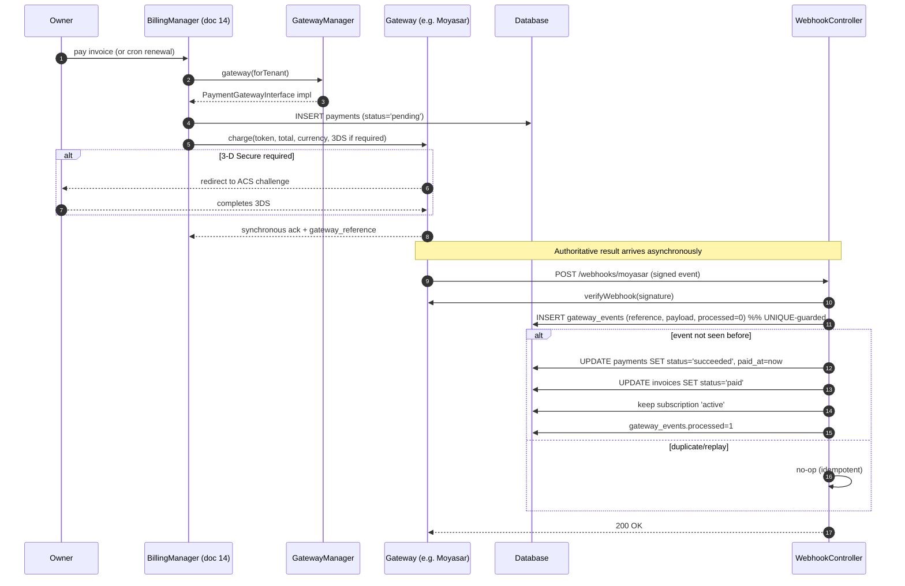

# 15 — Payment Gateways (بوابات الدفع)

A pluggable payment-gateway layer behind a single `PaymentGatewayInterface` with a registry, Saudi-friendly providers (Moyasar, Tap, HyperPay), tokenized methods, idempotent webhooks, and PCI-conscious design — no gateway is ever hard-coded.

## Related Documents

- [14 — Billing System](14-Billing-System.md) — invoices/payments this layer settles; receipts and refunds it executes.
- [13 — Subscription System](13-Subscription-System.md) — charges keep subscriptions `active`; failures trigger `past_due`/dunning.
- [34 — Security](34-Security.md) — PCI, secret encryption (AES-256-GCM), webhook verification.
- [05 — Database Architecture](05-Database-Architecture.md) — canonical `payments`, `payment_methods`, `gateway_events` schema.
- [12 — Workspace Management](12-Workspace-Management.md) — per-tenant gateway configuration via workspace settings.

---

## Purpose (الهدف)

This layer is how HalaOps actually **moves money**: it charges a card to settle an invoice, stores a reusable **token** for renewals, processes asynchronous **webhooks** to confirm outcomes, and issues refunds. The whole capability sits behind one contract, `PaymentGatewayInterface`, with a **registry** that resolves the configured gateway at runtime. Adding a provider is a new class plus a registry entry — never an edit to billing logic or an `if ($gateway === 'stripe')`. It ships oriented to **Saudi-friendly** gateways (Moyasar, Tap, HyperPay) with Stripe and PayPal documented as future, and is designed so **no card PAN is ever stored** by HalaOps.

The schema is `payments`, `payment_methods`, `gateway_events` (canonical [§11](05-Database-Architecture.md)).

## Implementation status (built — Phase 16)

A first concrete gateway seam exists, and it is **optional and inert without keys** — billing is fully usable with **zero** gateway configuration because the **manual in-app path is the verified flow** (see [13](13-Subscription-System.md)). What is built:

- **`App\Contracts\Billing\CheckoutGateway`** (`app/Contracts/Billing/CheckoutGateway.php`) — a small hosted-checkout seam: `isConfigured()` and `createCheckoutSession()`. This is the built abstraction (narrower than the full `PaymentGatewayInterface` design below).
- **`App\Services\Billing\StripeGateway`** (`app/Services/Billing/StripeGateway.php`) — implements `CheckoutGateway`. It reads its API secret and webhook signing secret **only from config/env** (`STRIPE_SECRET` / `STRIPE_WEBHOOK_SECRET`); secrets are **never stored in the DB or logged**. `isConfigured()` is false with no secret, so online checkout is simply never offered.
- **`BillingService::checkoutUrl()`** — returns a hosted-checkout URL for a **paid** plan **only when a gateway is configured**; otherwise it returns `null` and `BillingController::subscribe` falls back to the manual in-app path (graceful degrade — never throws).
- **Webhook** (`POST /billing/webhook`, **no auth, CSRF-exempt**) — authenticates via the **Stripe signature** (HMAC-SHA256 over `t.payload`, compared with `hash_equals`), **records every event to `gateway_events`** (`is_verified` flag), **verifies only when a signing secret is set** (else accept-but-flag-unverified and return 200), and **rejects a non-JSON body with 400** (and an invalid signature with 400 when a signing secret *is* configured).

**Honest limitations.**
- The hosted-checkout **session params are a starter mapping** — they only take effect with a real Stripe key and depend on the merchant's product setup; offline they are **inert/untested**. The **manual path is the verified, tested flow**.
- **Moyasar, Tap and HyperPay are catalogued, NOT implemented** — there is no class for them. (Note: this inverts the original plan below, where those three were the "primary" gateways and Stripe was "future"; the built starter seam is Stripe-shaped.)
- There is **no** `PaymentGatewayInterface` / `GatewayManager` registry, no tokenization/`payment_methods` flow, no refunds, and no 3-D Secure in code yet — all of that remains the design described below. **No new tables** were added (`gateway_events` already existed).

## Why It Exists (سبب وجوده)

Different markets and merchants use different processors; a Saudi customer may use Moyasar or HyperPay, another may prefer Tap, and an international tenant might want Stripe. Hard-coding any one of them would make HalaOps unsellable to the others and would scatter gateway-specific quirks (auth, tokenization, webhook signatures, refund semantics) across the codebase. A single interface + registry isolates those differences so the billing system ([14](14-Billing-System.md)) speaks one abstract language. Tokenization + "never store PAN" keeps HalaOps out of the heaviest **PCI-DSS** scope. Idempotent webhook handling via `gateway_events` makes payment confirmation reliable even when networks retry or the app crashes mid-charge.

## Architecture

| Component | Where | Responsibility |
|-----------|-------|----------------|
| `CheckoutGateway` (**built**) | `app/Contracts/Billing/CheckoutGateway.php` | The built hosted-checkout seam: `isConfigured()`, `createCheckoutSession()`. Lets `BillingService` choose online-vs-manual with no network call in tests. |
| `StripeGateway` (**built — optional/inert**) | `app/Services/Billing/StripeGateway.php` | Implements `CheckoutGateway`; secret + webhook secret from **config/env only**; `verifyWebhook()` (HMAC-SHA256 over `t.payload`); `createCheckoutSession()` (the one network method, only when configured). Never stores/logs secrets. |
| Webhook handler (**built**) | `app/Controllers/App/BillingController::webhook` | `POST /billing/webhook`, no auth, CSRF-exempt. Verifies the Stripe signature when a signing secret is set, records every event to `gateway_events`, rejects non-JSON (400). |
| `PaymentGatewayInterface` | `app/Services/Billing/Gateways/PaymentGatewayInterface.php` (planned) | The fuller design contract: `charge()`, `refund()`, `tokenize()`, `verifyWebhook()`, `parseEvent()`, capability flags. **Not built** (the narrower `CheckoutGateway` is what exists). |
| Gateway registry | `app/Services/Billing/GatewayManager` (planned) | Would map a gateway key (`moyasar`,`tap`,`hyperpay`,…) to its class and resolve the active gateway. **Not built.** |
| Concrete gateways | `…/{Moyasar,Tap,HyperPay,PayPal}Gateway.php` (planned, **NOT implemented**) | Provider-specific HTTP/tokenization/refunds. Catalogued only; only the Stripe checkout seam exists. |
| `payments` | table (**exists**) | Records each charge/refund result. **Not written by built code yet** (no charge flow). |
| `payment_methods` | table (**exists**) | Tokenized cards on file. **No tokenization flow built.** |
| `gateway_events` | table (**exists**) | Webhook log; **written by the built webhook** (`payment_gateway_id`, `external_event_id`, `event_type`, `payload`, `signature`, `is_verified`, `received_at`). |
| `Encrypter` | `app/Core/Encrypter.php` | AES-256-GCM for per-tenant secrets in the design. Not used by the built Stripe seam, which reads secrets from config/env only. |

This mirrors the proven **provider pattern** already used for AI (`AiProviderInterface` + `AiProviderManager`, [17 — AI Providers](17-AI-Providers.md)): an interface, a manager/registry, and swappable implementations.

```mermaid
flowchart LR
    BM[BillingManager] -->|charge/refund| GM[GatewayManager registry]
    GM -->|resolves active| GI[PaymentGatewayInterface]
    GI --> M[MoyasarGateway]
    GI --> T[TapGateway]
    GI --> H[HyperPayGateway]
    GI -. future .-> S[StripeGateway]
    GI -. future .-> P[PayPalGateway]
    WH[Webhook POST /webhooks/&#123;gateway&#125;] --> GE[(gateway_events)]
    GE --> BM
```



### The interface (conceptual signature)

```php
interface PaymentGatewayInterface
{
    public function key(): string;                                   // 'moyasar' | 'tap' | ...
    public function charge(ChargeRequest $r): ChargeResult;          // token or one-off source -> reference
    public function refund(string $reference, float $amount): RefundResult;
    public function tokenize(TokenRequest $r): PaymentToken;         // store card -> reusable token
    public function verifyWebhook(Request $r): bool;                 // signature/HMAC check
    public function parseEvent(Request $r): GatewayEvent;            // normalized event_type + reference + status
    public function supports(string $capability): bool;             // '3ds' | 'tokenization' | 'refunds' | 'recurring'
}
```

## Workflow

### Charge + webhook (settling an invoice)



### Tokenizing a payment method

The card is collected by the gateway's hosted fields / SDK on the client and exchanged for a **token**; HalaOps receives only the token plus display metadata (`brand`, `last4`, `exp_month`, `exp_year`) and stores them in `payment_methods`. The PAN/CVV never touch HalaOps servers.

### Refund

`BillingManager` calls `gateway->refund(reference, amount)`; on success it writes a `payments` row with `status='refunded'` and updates/voids the related invoice ([14](14-Billing-System.md)).

### Per-tenant sandbox/live configuration

Each workspace stores its own gateway credentials and mode (`sandbox`/`live`) in workspace `settings` (encrypted secret keys via `Encrypter`, AES-256-GCM), mirroring how AI keys are stored per tenant ([16 — AI Architecture](16-AI-Architecture.md)). Public/publishable keys are stored plainly; secret keys are encrypted at rest. A platform-default gateway can also be configured for tenants that don't bring their own.

## Business Rules

1. **No gateway is hard-coded.** Billing depends only on `PaymentGatewayInterface`; the concrete gateway is resolved by the registry from configuration. Adding one = new class + registry entry.
2. **Saudi-friendly first.** Moyasar, Tap and HyperPay are the primary supported gateways (SAR, mada, Apple Pay where applicable); **Stripe and PayPal are documented as future** behind the same interface.
3. **Never store PAN or CVV.** Only gateway **tokens** and non-sensitive `brand`/`last4`/`exp_*` are persisted (`payment_methods`).
4. **Webhooks are idempotent** *(design)*. Every event should be logged in `gateway_events` keyed by `(gateway, reference)`/event id so a duplicate is a no-op. *Built today:* the webhook records every event (with an `is_verified` flag) but does not yet dedupe; the webhook is intended as the authoritative source of final payment state once the charge/reconcile flow lands.
5. **Webhooks are verified** *(built)*. `StripeGateway::verifyWebhook()` checks the Stripe HMAC-SHA256 signature; when a signing secret **is** configured an invalid signature is rejected (400), and when **none** is configured the event is accepted-but-flagged-unverified and returned 200 (inert-but-safe). A non-JSON body is rejected (400).
6. **Secrets stay out of the database** *(built for Stripe)*. The built `StripeGateway` reads its secret + webhook signing secret **only from config/env** and never stores or logs them. *(Design:* per-tenant gateway secrets encrypted at rest via `Encrypter` AES-256-GCM — not yet built.)
7. **3-D Secure (SCA)** is supported: when a gateway/issuer requires it, the charge flow performs the challenge redirect and resumes on return.
8. **One default method per company** (`is_default`) is used for renewals; setting a new default unsets the previous.
9. **Sandbox vs live** is explicit per tenant; sandbox transactions never hit live processors and are visibly flagged.
10. **Payments are tenant-scoped**; `gateway_events` is a global webhook log (events arrive before any tenant context is known) and is reconciled to a tenant via the stored `payment`/`reference`.
11. **Refunds and tokens** are only meaningful if the active gateway `supports()` them; capability flags are checked before offering the action.

## Database Relations

Consistent with [§11 of the canonical schema](05-Database-Architecture.md):

- **`payment_methods`** (tenant): `id`, `workspace_id → workspaces(id) ON DELETE CASCADE`, `gateway`, `token`, `brand`, `last4`, `exp_month`, `exp_year`, `is_default`, timestamps. The `token` is the gateway's reusable reference — **not** a card number.
- **`payments`** (tenant): `id`, `workspace_id → workspaces(id) ON DELETE CASCADE`, `invoice_id → invoices(id) ON DELETE SET NULL`, `gateway`, `gateway_reference`, `amount`, `currency`, `payment_status_id → payment_statuses(id) ON DELETE RESTRICT` (config-driven; `key`s `pending`/`succeeded`/`failed`/`refunded`), `paid_at`, `raw JSON`, timestamps. Index `payments(workspace_id, gateway_reference)`.
- **`gateway_events`** (GLOBAL webhook log, **written by the built webhook**): `id`, `uuid`, `payment_gateway_id → payment_gateways(id)`, `workspace_id` (nullable — null at webhook time), `payment_id` (nullable), `external_event_id`, `event_type`, `payload JSON` (CHECK valid JSON — the built handler rejects a non-JSON body with 400 before insert), `signature`, `is_verified`, `received_at`. (The design's idempotency dedupe on `(gateway, reference)`/event id is not yet enforced by the built handler — it currently logs every event; see Edge Cases.)
- Upstream: **`invoices`**/**`subscriptions`** ([14](14-Billing-System.md), [13](13-Subscription-System.md)). Tenant gateway credentials live in **`settings`** (encrypted).

`raw` and `payload` retain verbatim gateway data for audit/reconciliation. `gateway_events` is deliberately **not** tenant-scoped because an inbound webhook has no session/tenant; the handler maps it to a tenant through the referenced `payment`/invoice.

## Permissions

| Action | Permission | Default roles |
|--------|-----------|---------------|
| View payment methods & payment history | `billing.view` | owner, admin |
| Add/remove/set-default payment method, charge, refund, configure gateway | `billing.manage` | **owner only** |
| Configure tenant gateway keys (also touches AI-style secret storage) | `billing.manage` (+ `settings.manage` for the settings surface) | owner |
| **Webhook endpoint** `POST /billing/webhook` (**built**) | **No user auth** — authenticated by gateway **signature** instead | n/a (machine-to-machine) |

Platform-level gateway defaults/diagnostics use `platform.diagnostics` (see [22 — Super Admin Journey](22-SuperAdmin-Journey.md)). All interactive routes use CSRF; the built webhook route (`POST /billing/webhook`, registered outside the auth/tenant group) is CSRF-exempt by necessity and instead relies on signature verification. (The design's per-gateway `POST /webhooks/{gateway}` is superseded by the single built Stripe webhook.)

## Validation

- **Add payment method**: a `token` from the gateway is required (never a raw PAN); `brand`, `last4` (exactly 4 digits), `exp_month` (1–12), `exp_year` (>= current year). `gateway` must be a registered key.
- **Charge**: `amount > 0`, `currency` ISO-4217 matching the invoice; a valid `payment_method.token` or a one-off source.
- **Refund**: `amount > 0` and `<= original payment amount`; original payment `status='succeeded'`; gateway must `supports('refunds')`.
- **Gateway config**: `gateway` in the registry; mode `in:sandbox,live`; secret key non-empty (encrypted before persist); webhook secret stored for verification.
- **Webhook**: signature **must** verify; `event_type` and `reference` present; payload size-limited; otherwise rejected (and logged) before any DB mutation.

## Edge Cases

1. **Duplicate / replayed webhook** — `gateway_events` unique on `(gateway, reference)`/event id makes reprocessing a no-op; payment state is never double-applied.
2. **Charge succeeds but synchronous response is lost** (timeout/crash) — the webhook reconciles: the `pending` payment is promoted to `succeeded` and the invoice to `paid` from the event.
3. **Webhook arrives before the synchronous ack** — handler upserts on `reference`; order independence is guaranteed by the idempotency key.
4. **Unverified/forged webhook** — `verifyWebhook()` fails; event is rejected with `processed=0` recorded for audit; no state change.
5. **3-D Secure abandoned** by the user — charge stays `pending`/`failed`; subscription unaffected until a successful attempt; dunning may retry ([14](14-Billing-System.md)).
6. **Gateway outage** — `charge()` failure is caught; the payment is `failed`, the invoice stays `open`, and the renewal enters dunning; the owner is notified.
7. **Tenant switches gateways** — old tokens are gateway-specific and cannot be used with a new gateway; the owner re-adds a method; historical payments retain their original `gateway`.
8. **Expired card token** — gateway rejects the charge; flagged on the `payment_methods` row and surfaced to the owner to update.
9. **Refund larger than original** — rejected at validation.
10. **Currency mismatch** between token/gateway and invoice — rejected before charging.
11. **Sandbox key used in live mode (or vice-versa)** — caught at config validation / first call; transactions are clearly mode-flagged to prevent mixing.

## Security

- **PCI-DSS minimisation**: hosted fields/SDK tokenization means cardholder data never reaches HalaOps; storing only tokens + `last4`/`brand` keeps the deployment in the lightest PCI scope (SAQ-A-style) (see [34 — Security](34-Security.md)).
- **Never store PAN/CVV** — enforced by validation (only a `token` is accepted) and by schema (no PAN column exists).
- **Secret-key encryption**: gateway secret/webhook keys stored AES-256-GCM (`Encrypter`, authenticated encryption) per tenant; never logged, never sent to the browser.
- **Webhook authenticity**: signature/HMAC verification per gateway before any mutation; idempotent processing via `gateway_events`; raw payload retained for forensics.
- **Transport security**: all gateway calls over TLS; the webhook endpoint is HTTPS-only.
- **Tenant isolation**: `payments`/`payment_methods` are tenant-scoped and fail closed; the global `gateway_events` log is reconciled to a tenant only through verified references.
- **Authorization**: charging/refunding/configuring requires `billing.manage` (owner); the webhook route is machine-authenticated by signature, not by a user session.
- **Audit**: every charge, refund, method change and gateway (re)configuration is recorded in `activity_logs`; secrets are redacted in logs.

## Performance

- **Webhook hot path**: verify → upsert `gateway_events` (unique key) → update the referenced `payment`/`invoice`, all served by `gateway_events(gateway, reference)` and `payments(workspace_id, gateway_reference)`; respond `200` fast and defer heavy follow-up (receipts/emails) to the queue.
- **Charge calls are network-bound**: executed from the queued renewal worker, not the user request path, so dunning sweeps don't block web traffic.
- **Token reuse** avoids re-collecting cards and keeps renewals to a single gateway round-trip.
- **Registry resolution** is an in-memory map lookup; gateway objects are lightweight and constructed on demand.
- **Indexes** on every reference/lookup column keep reconciliation O(log n); `raw`/`payload` JSON is read only when an item is inspected.

## Testing

**Unit**
- Registry resolves `moyasar`/`tap`/`hyperpay` to the right class and throws on an unknown key.
- `verifyWebhook()` accepts a correctly signed payload and rejects a tampered one (per gateway).
- `parseEvent()` normalises each gateway's payload to a common `{event_type, reference, status}`.
- Idempotency: processing the same event twice updates state once.

**Feature (HTTP)**
- A successful charge marks the payment `succeeded` and the invoice `paid` (driven by the webhook).
- A failed charge leaves the invoice `open` and moves the subscription to `past_due`.
- `POST /webhooks/{gateway}` with a valid signature updates state; with an invalid signature returns an error and changes nothing.
- Adding a payment method stores only token + `last4`/`brand`; no PAN is ever persisted.

**Security**
- Forged/replayed webhooks cause no state change / no double-apply.
- Secret keys are encrypted at rest and absent from logs and HTTP responses.
- A non-owner cannot charge, refund, or change gateway config (403).
- Sandbox and live transactions never cross.

## Future Expansion

- **Stripe & PayPal** implementations behind the same interface (international expansion) — no billing changes required.
- **Apple Pay / mada / STC Pay** surfaced through the Saudi gateways' capability flags.
- **Saved-method management UI** and automatic card-expiry reminders (account updater where supported).
- **Multi-gateway routing/failover**: try a secondary gateway when the primary is down, selected by the registry and `supports()` flags.
- **Webhook event bus**: fan `gateway_events` into the notification/audit systems for richer reconciliation dashboards ([26](26-Notification-System.md), [38 — Audit System](38-Audit-System.md)).
- **PSP-level recurring/mandates**: delegate scheduling to gateways that support native subscriptions, while HalaOps remains the source of truth for plan/limits.

## Open Questions

None at this time. Which Saudi gateway is the shipped default and whether tenants must bring their own keys vs use a platform account are deployment/business choices; the registry + per-tenant encrypted config supports both, and Stripe/PayPal are tracked as future work above.
