# Project Roadmap — Nizam AIOS

One-line purpose: The phased delivery plan for **Nizam — the Bayan AI Operating System**, sequencing the full 12-phase program from the completed Architecture Foundation through the Digital Employee Framework, dependency-ordered and shipped in verified increments.

> **Status: Active (incremental build) | Version: 2.0.0 | Last updated: 2026-07-01 | Owner: Architecture (Nizam Core)**

---

## 1. Purpose & Reading Guide

This roadmap sequences the construction of Nizam — the execution operating system that lets a business build an **AI Workforce without programming** (see [CONSTITUTION.md](./CONSTITUTION.md) §1). It exists so that every stakeholder shares one mental model of *what is being built, in what order, and why*.

The [Constitution](./CONSTITUTION.md) is the supreme governing document; this roadmap obeys it. Non-technical stakeholders should read [PRODUCT_PRINCIPLES.md](./PRODUCT_PRINCIPLES.md) first for the product/UX principles restated in plain language.

The canonical layer chain governs the entire program:

```
User → Bayan (Brain) → Nizam (AI OS) → Master Orchestrator → Agent Runtime → Tool Platform → Automation/Integration → n8n → External Systems
```

### Delivery discipline (per Constitution §10)

The program is delivered as **verified, dependency-ordered increments**. Because §10 forbids unfinished or placeholder work, **each phase ships only when it is real, compiled, test-green, and documented in the same change** — every new folder carries a `README.md`, every class is documented, and the docs are updated alongside the behavior. We favor a smaller *fully-finished* slice over a larger *unfinished* one. Scope is sequenced; quality is never traded away for the appearance of breadth.

---

## 2. Phase Overview

| Phase | Name | Status |
|-------|------|--------|
| **1** | Architecture Foundation | **Complete** |
| **2** | Core Infrastructure Platform (self-built native-PHP framework) | **In progress** — foundation spine done & test-green; **Professional Behavior Engine** (Behavior bounded context) delivered & test-green |
| 3 | AI Runtime Engine + Plugin Architecture + Master Orchestrator | Planned |
| 4 | Identity + Multi-Tenancy + Capability Engine | Planned |
| 5 | Tool Platform / SDK | Planned |
| 6 | Integration + Automation Platforms + n8n adapter | Planned |
| 7 | Department Framework (SDK + empty templates) | Planned |
| 8 | AI Organization Designer | Planned |
| 9 | AI Providers + Knowledge Platform + Memory Engine | Planned |
| 10 | Enterprise Platform + Marketplace + Billing + Observability + Release v1.0 | Planned |
| 11 | Business Operating System Intelligence | Planned |
| 12 | Digital Employee Framework | Planned |

The ordering is deliberately **dependency-driven**: no phase begins until the substrate it stands on exists and is test-green. The Core Infrastructure Platform (Phase 2) precedes everything because the container, events, HTTP, DB, and configuration are prerequisites for the AI Runtime, and the Runtime + Plugin architecture (Phase 3) precedes identity, tools, integrations, departments, and every higher capability.

---

## 3. Phase Details

### Phase 1 — Architecture Foundation (COMPLETE)

**Goal.** Establish the single source of truth for architecture, naming, principles, and technology, and prove the design satisfies SOLID, DDD, Clean/Hexagonal Architecture, event-driven design, and multi-tenant isolation *before code exists*.

**Key deliverables.**
- The [Constitution](./CONSTITUTION.md) (supreme governing document) and [PRODUCT_PRINCIPLES.md](./PRODUCT_PRINCIPLES.md).
- Vision, system overview, architecture, bounded-context, domain, data, and UX documents (`docs/00`–`docs/23`).
- Architecture Decision Records ([16-ADR.md](./16-ADR.md)), including ADR-0015 (self-built native-PHP platform), ADR-0016 (plugin architecture), ADR-0017 (Master Orchestrator), ADR-0018 (AI Runtime state machine).
- Risk register, assumptions/open-questions register, and the Phase-1 completeness audit.

**Exit criteria.** All Phase-1 documents approved; no open contradictions; every gap recorded as an assumption or open question (never a silent TODO); zero application code produced in this phase.

**Dependencies.** None (foundational).

---

### Phase 2 — Core Infrastructure Platform (IN PROGRESS)

**Goal.** Build the **self-built, framework-independent native-PHP 8.4 platform** that *is* our framework (per [ADR-0015](./16-ADR.md#adr-0015)). No Laravel, no Symfony, no micro-framework on the runtime spine — only PSR **interface** packages, with every cross-cutting concern behind a PSR contract we own and can replace.

**Key deliverables.** The platform's cross-cutting infrastructure under `Nizam\Platform\*` and the shared DDD `Nizam\Kernel\*`:
- Service **container** (PSR-11), **configuration**, **events** (PSR-14), **logging** (PSR-3).
- **HTTP** (PSR-7/17 messages + factories), **routing**, **middleware** pipeline, HTTP kernel (PSR-15).
- **Database** layer (connection, query builder, schema, migrations, data-mapper repositories, unit of work, tenant session/RLS), **cache** (PSR-16), **queue**, **scheduler**.
- **Validation**, **storage**/filesystem, **localization**, **notifications** (mail/SMS/webhook/database channels), and **monitoring** (health checks + metrics).
- The **DDD Kernel**: identifiers (UUID v7), aggregates/entities/value objects, domain events, command/query buses, and `TenantContext`; plus the `Bootstrap\Application` composition root.

**Foundation spine — DONE and TEST-GREEN.** The Wave-1 spine is implemented, verified, and committed: `Support` (`Result`, `Uuid` v7, `SystemClock`, `Assert`, `Str`, `Json`), `Exception` (typed hierarchy), `Container` (PSR-11 autowiring), `Config` + `Env`, `Event` (PSR-14 dispatcher/listener provider), `Logging` (PSR-3 `LogManager` + JSON-line handlers), the `Kernel\Domain` DDD base, `Kernel\Application` command/query buses, `Kernel\Tenancy\TenantContext`, and the `Bootstrap\Application` composition root — **all unit-tested green on PHP 8.4 + PHPUnit 11**. The remaining Phase-2 platform infrastructure (HTTP/routing/DB/cache/queue/scheduler/validation/storage/localization/notifications/monitoring) is the forward work of this phase.

**Professional Behavior Engine — DELIVERED and TEST-GREEN.** The **Behavior** bounded context (`Nizam\Behavior\*`, `src/Behavior/`) is implemented as a full Clean/Hexagonal increment on the Kernel: a pure Domain layer (role-bound `BehaviorProfile`/`BehaviorChangeProposal` aggregates, immutable versioned revisions, self-validating `BehaviorTraits`, explainable `BehaviorRecommendation`, consolidator/recommender domain services, ports, `BEHAVIOR.*` exceptions); a CQRS Application layer (draft/propose/approve/reject/rollback/archive + get/history/list/explain, read-model DTOs, and a `BehaviorLearningService` that produces a **proposal only** and never auto-applies); and an Infrastructure layer (tenant-scoped InMemory + PDO adapters, a Postgres-16 migration plus runnable `SqliteSchema`, a dispatching event publisher, and the `BehaviorServiceProvider`/`BehaviorModule` facade). Behavior profiles are per-**role** (never per-person), evolve only from **approved** observations, and are versioned, explainable, reversible, and approval-gated. The suite is green at **169 tests / 628 assertions** on PHP 8.4.19 + PHPUnit 11.5.55 (93 Behavior tests added over the 76-test baseline). The Interface (HTTP/Console) layer is deferred until the HTTP platform lands, and the PDO adapters are validated on sqlite pending a Postgres integration environment. See [audit/PHASE_16_AUDIT.md](./audit/PHASE_16_AUDIT.md).

**Exit criteria.** Every listed platform component compiles (`php -l` clean), is unit-tested green (`vendor/bin/phpunit`), passes static analysis, and carries a `README.md` per folder; the composition root boots the full platform; documentation is updated in the same change.

**Dependencies.** Phase 1 (approved architecture and ADRs).

---

### Phase 3 — AI Runtime Engine + Plugin Architecture + Master Orchestrator

**Goal.** Stand up the execution core: the plugin subsystem (everything extensible is a versioned plugin), the single Master Orchestrator entry point, and the AI Runtime execution engine with an explicit state machine.

**Key deliverables.**
- **Plugin architecture** ([ADR-0016](./16-ADR.md#adr-0016)): manifest, discovery, SemVer versioning, dependency resolution, permission/capability declarations, lifecycle (install/enable/disable/update/uninstall), isolation, and a stable Plugin SDK contract.
- **Master Orchestrator** ([ADR-0017](./16-ADR.md#adr-0017)): the sole execution entry point that validates, authorizes, tenant-scopes, loads Manager/Worker plugins, coordinates them, merges results, and returns the Manager's decision.
- **AI Runtime Execution Engine** ([ADR-0018](./16-ADR.md#adr-0018)): a persisted, event-sourced state machine (Pending → Planning → Assigned → Waiting → Running → Retrying → Review → Approved/Rejected/Cancelled → Completed/Failed/Recovered) with cost/performance trackers, retry/timeout/lock managers, and recovery/replay.

**Exit criteria.** An execution routes through the one Orchestrator, drives a plugin through the state machine with only legal transitions, emits a transition event per step, and is replayable/auditable — all test-green (unit, replay, recovery, concurrency).

**Dependencies.** Phase 2 (container, events, queue, persistence, config).

---

### Phase 4 — Identity + Multi-Tenancy + Capability Engine

**Goal.** Implement identity, tenant isolation, and the capability/permission engine that governs every plugin and execution.

**Key deliverables.**
- Identity: tenants, users, orgs, sessions, authentication, JWT access+refresh.
- Multi-tenancy: tenant provisioning and isolation enforced at the data layer (RLS), Pool/Bridge/Silo tiering hooks ([ADR-0002](./16-ADR.md#adr-0002)/[ADR-0013](./16-ADR.md#adr-0013)).
- **Capability Engine**: RBAC+ABAC ([ADR-0008](./16-ADR.md#adr-0008)) resolving the permissions/capabilities that plugins declare and the Orchestrator enforces on every execution.

**Exit criteria.** A tenant can be provisioned; users authenticate; isolation provably prevents cross-tenant access; the Orchestrator authorizes executions against the capability engine — all test-green.

**Dependencies.** Phases 2–3 (platform, Orchestrator, plugin permission model).

---

### Phase 5 — Tool Platform / SDK

**Goal.** Deliver the Tool Platform so capabilities can be exposed as permission-scoped, versioned, sandboxed **Tool plugins** built against a stable SDK.

**Key deliverables.**
- Tool SDK and typed Tool contract; tool manifests with JSON-Schema argument contracts and capability metadata.
- Tool registry (versioned, hot-loadable), permission scopes, and a sandboxed invocation contract driven only through the Runtime/Orchestrator.

**Exit criteria.** A Worker plugin, via the Orchestrator, resolves and invokes a permission-checked, tenant-scoped tool end-to-end (mock externals); tool executions are audited and metered-ready — all test-green.

**Dependencies.** Phases 3–4 (plugin architecture, Runtime, capability engine).

---

### Phase 6 — Integration + Automation Platforms + n8n Adapter

**Goal.** Implement the Integration platform (external connectors as plugins) and the Automation platform that drives self-hosted **n8n** behind a replaceable adapter ([ADR-0005](./16-ADR.md#adr-0005)).

**Key deliverables.**
- Integration platform: connector plugins with credential binding (via the abstracted secrets manager) and connection-health monitoring.
- Automation platform: workflow definitions, triggers, run history, retries, idempotency keys, compensation.
- **n8n adapter** (ACL boundary): Nizam talks only to the Automation platform's contract; n8n is a replaceable execution substrate.

**Exit criteria.** A tool delegates to the Automation platform, which executes an n8n workflow reaching a sandboxed external system with retries and idempotency proven; connectors run behind ACLs with credentials via the secrets manager — all test-green.

**Dependencies.** Phase 5 (Tools that trigger automations/integrations).

---

### Phase 7 — Department Framework (SDK + Empty Templates)

**Goal.** Provide the Department Framework so an organization's structure is composed from **Department plugins** — a Department SDK plus empty, ready-to-fill templates (no hardcoded business departments in the core).

**Key deliverables.**
- Department SDK and typed Department/Manager/Worker contracts (per the two-tier hierarchy in [23-Agent-Hierarchy.md](./23-Agent-Hierarchy.md)).
- **Empty department templates** that a tenant fills in; departments plug into the one Orchestrator (never each owning its own).

**Exit criteria.** A department template installs as a plugin, registers its Manager and Worker slots, and routes an execution through the Orchestrator — all test-green; no business department is hardcoded in the core.

**Dependencies.** Phases 3–6 (plugins, Orchestrator, capabilities, tools, automation).

---

### Phase 8 — AI Organization Designer

**Goal.** Let a non-technical owner design their AI organization, with the AI recommending and the owner deciding (per [CONSTITUTION.md](./CONSTITUTION.md) §7 and [PRODUCT_PRINCIPLES.md](./PRODUCT_PRINCIPLES.md) §4) — **nothing changes automatically unless enabled**.

**Key deliverables.**
- **Four operating modes**: **Manual**, **Suggestions**, **Assisted**, **Autonomous** — escalating AI involvement, always under owner control.
- A **discovery wizard** that learns the business; **agent + prompt generation** that proposes Managers, Workers, and their prompts.
- An **approval queue** with preview, impact estimate, and rollback for every structural change.

**Exit criteria.** In any mode, the Designer proposes an organization; every structural change is previewed, impact-estimated, and reversible through the approval queue; nothing applies without explicit enablement — all test-green.

**Dependencies.** Phase 7 (Department Framework the Designer composes), Phase 4 (governance), Phase 3 (Runtime).

---

### Phase 9 — AI Providers + Knowledge Platform + Memory Engine

**Goal.** Make AI providers pluggable and give the workforce knowledge and memory.

**Key deliverables.**
- **AI Providers as plugins** behind the `LlmProvider` port ([ADR-0009](./16-ADR.md#adr-0009)): provider registration and **model selection** as configuration, not code.
- **Knowledge Platform**: knowledge sources as plugins with ingestion and **retrieval**.
- **Memory Engine**: scoped memory for agents/executions, retrievable during Runtime.

**Exit criteria.** A provider plugin is selectable per model; a knowledge source is registered and retrievable; the Runtime consults memory during execution — all test-green.

**Dependencies.** Phases 3–5 (Runtime, capabilities, tools).

---

### Phase 10 — Enterprise Platform + Marketplace + Billing + Observability + Release v1.0

**Goal.** Reach a releasable enterprise platform: a plugin marketplace, billing/metering, full observability, and the **v1.0** release.

**Key deliverables.**
- **Marketplace**: publish/approve/install versioned plugins (Tools, Integrations, Departments, Providers) with SemVer and lifecycle governance.
- **Billing**: plans, subscriptions, metering (executions, tool calls, automations, LLM tokens), quotas, invoices.
- **Observability**: health, metrics, traces, audit read models, SLOs, alerting.
- **Release v1.0**: security review, DR/backups, runbooks, and GA sign-off.

**Exit criteria.** Plugins are installable from the marketplace; every billable action is metered from events; SLOs are tracked and alertable; v1.0 passes security and GA gates — all test-green.

**Dependencies.** Phases 3–9 (everything the enterprise surface meters, sells, and observes).

---

### Phase 11 — Business Operating System Intelligence

**Goal.** Understand the business itself: a discovery engine and business graph that analyze how the company runs and **observe/recommend only** — **never auto-execute** ([CONSTITUTION.md](./CONSTITUTION.md) §7).

**Key deliverables.**
- **Discovery engine** and **business graph** modeling the organization, its processes, work, and employees.
- **Process / work / employee analysis** and **what-if simulation**.
- **Executive dashboards** surfacing insights and recommendations.

**Exit criteria.** The engine builds a business graph, runs what-if simulations, and surfaces recommendations to executives without ever executing a change automatically — all test-green.

**Dependencies.** Phase 10 (enterprise data, metering, observability) and Phases 3–9 (the operational substrate it observes).

---

### Phase 12 — Digital Employee Framework

**Goal.** Model a **digital employee** end-to-end — profile, lifecycle, work, performance, training, certification, and readiness to shadow or replace a role.

**Key deliverables.**
- **Employee profiles** and **lifecycle** (hire → active → offboard) for digital employees.
- **Work-assignment** and **performance scorecards**.
- **Training center**, **certification**, **shadow mode** (observe alongside a human), and **replacement-readiness** scoring.

**Exit criteria.** A digital employee is profiled, assigned work, scored, trained, certified, run in shadow mode, and assessed for replacement-readiness — all test-green; consequential transitions remain owner-approved.

**Dependencies.** Phase 11 (business intelligence) and Phases 7–10 (departments, designer, providers, enterprise platform).

---

## 4. Milestone Diagram (relative ordering — no calendar dates)

```mermaid
gantt
    title Nizam AIOS — Phase Ordering (relative, dependency-driven; NOT a calendar)
    dateFormat  X
    axisFormat  P%s
    section Foundation
    Phase 1 Architecture Foundation (COMPLETE)             :done, p1, 0, 1
    section Platform
    Phase 2 Core Infrastructure Platform (IN PROGRESS)     :active, p2, after p1, 1
    section Execution Core
    Phase 3 AI Runtime + Plugins + Orchestrator            :p3, after p2, 1
    Phase 4 Identity + Multi-Tenancy + Capability          :p4, after p3, 1
    section Capabilities
    Phase 5 Tool Platform / SDK                            :p5, after p4, 1
    Phase 6 Integration + Automation + n8n                 :p6, after p5, 1
    Phase 7 Department Framework                           :p7, after p6, 1
    Phase 8 AI Organization Designer                       :p8, after p7, 1
    Phase 9 AI Providers + Knowledge + Memory              :p9, after p8, 1
    section Enterprise & Intelligence
    Phase 10 Enterprise + Marketplace + Billing + v1.0     :p10, after p9, 1
    Phase 11 Business OS Intelligence                      :p11, after p10, 1
    Phase 12 Digital Employee Framework                    :p12, after p11, 1
```



> The x-axis encodes **ordering only**. No real durations or calendar dates are implied; inventing them would violate the Constitution.

### Dependency Flow

```mermaid
flowchart LR
    P1[Phase 1<br/>Architecture] --> P2[Phase 2<br/>Core Platform]
    P2 --> P3[Phase 3<br/>Runtime + Plugins + Orchestrator]
    P3 --> P4[Phase 4<br/>Identity + Tenancy + Capability]
    P4 --> P5[Phase 5<br/>Tool Platform]
    P5 --> P6[Phase 6<br/>Integration + Automation + n8n]
    P6 --> P7[Phase 7<br/>Department Framework]
    P7 --> P8[Phase 8<br/>AI Org Designer]
    P8 --> P9[Phase 9<br/>Providers + Knowledge + Memory]
    P9 --> P10[Phase 10<br/>Enterprise + Marketplace + v1.0]
    P10 --> P11[Phase 11<br/>Business OS Intelligence]
    P11 --> P12[Phase 12<br/>Digital Employee Framework]
```



---

## 5. Governance

- **Phase gates.** A phase ends only when its exit criteria are met: compiled, test-green, every folder has a `README.md`, and docs updated in the same change (Constitution §10).
- **Dependency ordering.** No phase starts before the substrate it depends on is finished and green. Describing a future phase here does **not** authorize building it ahead of its dependencies.
- **Change control.** Any deviation from a phase's scope is recorded as an ADR ([16-ADR.md](./16-ADR.md)) and, where it introduces uncertainty, as an open question ([19-Assumptions.md](./19-Assumptions.md)).

---

## Related Documents

- [CONSTITUTION.md](./CONSTITUTION.md) — supreme governing document.
- [PRODUCT_PRINCIPLES.md](./PRODUCT_PRINCIPLES.md) — product/UX principles for non-technical stakeholders.
- [16-ADR.md](./16-ADR.md) — Architecture Decision Records (incl. ADR-0015…0018).
- [20-Project-State.md](./20-Project-State.md) — detailed project state.
- [21-Database-Design.md](./21-Database-Design.md) — data model (design).
- [22-UIUX-Guidelines.md](./22-UIUX-Guidelines.md) — UX rules for non-technical users.
- [23-Agent-Hierarchy.md](./23-Agent-Hierarchy.md) — Managers, Workers, and the audit loop.

---

## Change Log

| Version | Date | Author | Change |
|---------|------|--------|--------|
| 1.0.0 | 2026-07-01 | Architecture (Nizam Core) | Initial approved roadmap; Phase 1 complete, Phases 2–8 defined at architecture level only. |
| 2.0.0 | 2026-07-01 | Architecture (Nizam Core) | Expanded to the 12-phase program under the Constitution; Phase 1 complete, Phase 2 (Core Infrastructure Platform) in progress with the foundation spine built and test-green; per-phase goal/deliverables/exit-criteria/dependencies; STOP gate replaced with active incremental-build discipline. |
| 2.1.0 | 2026-07-01 | Architecture (Nizam Core) | Recorded the **Professional Behavior Engine** (`Nizam\Behavior\*`, Behavior bounded context) as an implemented, test-green increment: Domain/Application/Infrastructure delivered on the Kernel; per-role, approval-gated, versioned, explainable, reversible behavior profiles evolved only from approved observations; InMemory + PDO (sqlite-validated) adapters. Suite green at 169 tests / 628 assertions (PHP 8.4.19 + PHPUnit 11.5.55). Interface/HTTP layer deferred until the HTTP platform lands. See docs/audit/PHASE_16_AUDIT.md. |
