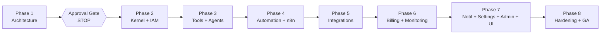

# Project Roadmap — Nizam AIOS

One-line purpose: The phased delivery plan for **Nizam — the Bayan AI Operating System**, establishing that Phase 1 (Architecture & Foundation) is complete and defining all future phases at an architectural level only.

> **Status: Approved (Phase 1) | Version: 1.0.0 | Last updated: 2026-07-01 | Owner: Architecture (Nizam Core)**

---

## 1. Purpose & Reading Guide

This roadmap sequences the construction of Nizam — the execution layer that receives *intents* from **Bayan** (the external AI Brain) and executes them safely, observably, and multi-tenant. It exists so that every stakeholder shares one mental model of *what is being built, in what order, and why*.

The canonical layer chain governs the entire roadmap:

```
User → Bayan (Brain) → Nizam (AI OS) → Agent Framework → Tool Registry → Automation Engine → n8n → External Systems
```

> **CRITICAL — STOP AFTER PHASE 1.** This document is produced during Phase 1, which delivers *architecture and foundational documentation only*. **No application, business, or runtime code is produced in Phase 1.** All phases 2–8 below are described at an architecture level for planning purposes; **none of them are to be built now.** Work halts at the end of Phase 1 and awaits explicit approval before Phase 2 begins.

---

## 2. Phase Overview

| Phase | Name | Status | Builds Code? | Primary Bounded Contexts |
|-------|------|--------|--------------|--------------------------|
| **1** | Architecture & Foundation | **Complete (this phase)** | **No** | All (design only) |
| 2 | Core Kernel + IAM + Multi-Tenant Foundation | Not started (awaiting approval) | Yes | Core (Kernel), Identity & Access (IAM) |
| 3 | Tool Registry + Agent Framework Runtime | Planned | Yes | Tools, Agents, AI (Bayan Gateway) |
| 4 | Automation Engine + n8n Integration | Planned | Yes | Automation |
| 5 | Integrations Connectors | Planned | Yes | Integrations |
| 6 | Billing / Metering + Monitoring | Planned | Yes | Billing, Monitoring & Observability |
| 7 | Notifications + Settings + Administration + UI | Planned | Yes | Notifications, Settings, Administration, Frontend |
| 8 | Hardening / Scale / GA | Planned | Yes | Cross-cutting |

The phase ordering is deliberately **dependency-driven**: no phase begins until the substrate it stands on exists. IAM and the Kernel precede everything because tenancy, identity, and the event backbone are prerequisites for all higher contexts.

---

## 3. Phase Details

### Phase 1 — Architecture & Foundation (THIS PHASE — COMPLETE)

**Goals**
- Establish the single source of truth for architecture, naming, and technology.
- Prove that Nizam's design satisfies SOLID, DDD, EDA, Clean Architecture, and multi-tenant isolation *before any code exists*.
- De-risk the build by recording decisions (ADRs), risks, and assumptions up front.

**Key Deliverables**
- Vision, roadmap, architecture, bounded-context, data, and UX design documents.
- Architecture Decision Records (`16-ADR.md`) for every fixed decision.
- Risk register (`18-Risks.md`) and Assumptions/Open-Questions register (`19-Assumptions.md`).
- Database design (design-only ERD), API/event contract conventions (OpenAPI 3.1 / AsyncAPI 2.6), UI/UX guidelines.
- Audit reports validating completeness.

**Exit Criteria**
- All Phase 1 documents Approved at Version 1.0.0.
- No open contradictions with `CANON.md`; every gap recorded as an Assumption or Open Question, never as a silent invention or TODO.
- **Zero application/business code produced** (producing any = phase failure).
- Explicit stakeholder approval recorded before Phase 2 is authorized.

**Dependencies:** None (foundational).

---

### Phase 2 — Core Kernel + IAM + Multi-Tenant Foundation

**Goals**
- Stand up the modular monolith skeleton (NestJS) with Clean Architecture layering per module.
- Implement the shared **Core (Kernel)**: base entities, value objects, event-bus abstractions, result/error types, clock, UUID v7 generation, tenant context propagation, Transactional Outbox scaffolding.
- Implement **Identity & Access (IAM)**: tenants, users, orgs, roles, permissions, sessions, OAuth2/OIDC, JWT access+refresh, mTLS for service-to-service, and the RBAC+ABAC policy engine.
- Enforce tenant isolation via PostgreSQL 16 **Row-Level Security** on shared-schema tables.

**Key Deliverables**
- Kernel module + tenant-context middleware.
- IAM module with AuthN/AuthZ enforced at API and DB (RLS) layers.
- Outbox → NATS JetStream publisher (Redis Streams fallback for dev).
- Baseline migrations (expand/contract), audit columns, soft delete, `audit_log`.
- Tenant tiering model (Pool/Bridge/Silo) provisioning hooks.

**Exit Criteria**
- A tenant can be provisioned; users authenticate; RLS provably prevents cross-tenant reads/writes (isolation tests pass).
- Domain events flow through the outbox to NATS and are observable via OpenTelemetry.

**Dependencies:** Phase 1 (approved architecture).

---

### Phase 3 — Tool Registry + Agent Framework Runtime

**Goals**
- Implement the **Tools** context (Tool Registry): tool definitions, JSON Schema contracts, capability metadata, versioning, permission scopes, sandboxed invocation contracts.
- Implement the **Agents** context (Agent Framework): agent definitions, runtime/orchestration, planning-to-execution, agent runs (event-sourced), memory scoping, guardrails.
- Implement the **AI (Bayan Gateway)** ACL: intent intake, contract validation, context assembly, plus the `LlmProvider` port (Claude via Anthropic API) for tool-argument synthesis.

**Key Deliverables**
- Tool Registry with plugin manifests (versioned, hot-loadable, sandboxed).
- Agent runtime executing plans; each step resolves a permission-checked, tenant-scoped tool.
- Bayan Gateway validating the Intent contract; `LlmProvider` port with a Claude adapter.
- Saga/Process Manager for multi-step agent flows with compensation.

**Exit Criteria**
- An intent from Bayan is routed to an agent, which selects a plan and invokes a registered tool end-to-end (mock external systems).
- Agent runs and tool executions are event-sourced and metered-ready.

**Dependencies:** Phase 2 (Kernel, IAM, event backbone).

---

### Phase 4 — Automation Engine + n8n Integration

**Goals**
- Implement the **Automation** context: workflow definitions, triggers, run history, retries, idempotency keys, compensation.
- Build the internal Automation Engine that owns and drives self-hosted **n8n** as the workflow executor, behind an adapter (n8n is replaceable).

**Key Deliverables**
- Automation Engine service + n8n adapter (ACL boundary).
- Idempotent, retryable workflow execution with compensation on failure.
- Tool → Automation delegation path wired per the canonical execution flow.

**Exit Criteria**
- A tool call can delegate to the Automation Engine, which executes an n8n workflow reaching a (sandboxed) external system, with retries and idempotency proven.

**Dependencies:** Phase 3 (Tools/Agents that trigger automations).

---

### Phase 5 — Integrations Connectors

**Goals**
- Implement the **Integrations** context: external connectors (ACLs) for CRM, email, messaging, calendars, storage.
- Provide credential binding (via the abstracted secrets manager) and connection-health monitoring.

**Key Deliverables**
- Connector plugins registered against stable contracts (manifest + JSON Schema).
- Credential binding through the Vault-style secrets abstraction.
- Connection health checks and event emission on degradation.

**Exit Criteria**
- At least the core connector set is live behind ACLs; credentials are stored via the secrets manager; health is observable.

**Dependencies:** Phase 4 (Automation Engine + n8n as an execution substrate for many connectors).

---

### Phase 6 — Billing / Metering + Monitoring

**Goals**
- Implement the **Billing** context: plans, subscriptions, metering (agent runs, tool calls, automation executions, LLM tokens), quotas, invoices.
- Implement **Monitoring & Observability** read-side: health, metrics, traces, audit read models, SLO tracking, alerting rules.

**Key Deliverables**
- Usage metering consuming integration events (CQRS read models).
- Quota enforcement and invoicing.
- Grafana/Loki/Tempo dashboards, SLO definitions, alert rules.

**Exit Criteria**
- Every billable action is metered from events; quotas enforce; SLOs are tracked and alertable.

**Dependencies:** Phases 3–5 (events to meter and monitor).

---

### Phase 7 — Notifications + Settings + Administration + UI

**Goals**
- Implement **Notifications** (in-app, email, push, webhook; templates, preferences, digests).
- Implement **Settings** (tenant/user config, feature flags, Basic/Advanced mode, localization).
- Implement **Administration** (tenant lifecycle, global feature flags, audited impersonation, announcements, marketplace approval).
- Deliver the **Frontend** (Next.js 15 App Router, React 19, Tailwind, bilingual AR/EN RTL/LTR) with Wizard-driven, non-technical-friendly UX.

**Key Deliverables**
- Multi-channel notification delivery.
- Settings + feature-flag surfaces; Basic/Advanced mode.
- Admin back-office; audited impersonation.
- Bilingual UI honoring the UX rules (per-field help, wizards over long forms).

**Exit Criteria**
- Non-technical operators can configure a tenant, connect an integration via a wizard, and receive notifications — all in AR or EN.

**Dependencies:** Phases 2–6 (everything the UI surfaces).

---

### Phase 8 — Hardening / Scale / GA

**Goals**
- Performance, security, and resilience hardening across all contexts.
- Scale-out: Kubernetes HPA, tenant-tier scaling (Pool→Bridge→Silo), load/chaos testing.
- General Availability readiness: DR, backups, compliance posture, runbooks.

**Key Deliverables**
- Security review, penetration testing, threat-model closure.
- Scale and chaos test results; capacity plan.
- DR/backup validation; GA runbooks and on-call.

**Exit Criteria**
- SLOs met under target load; DR tested; security sign-off; GA approved.

**Dependencies:** All prior phases.

---

## 4. Milestone Diagram (relative ordering — no calendar dates)

```mermaid
gantt
    title Nizam AIOS — Phase Ordering (relative, dependency-driven; NOT a calendar)
    dateFormat  X
    axisFormat  P%s
    section Foundation
    Phase 1 Architecture & Foundation (COMPLETE)      :done, p1, 0, 1
    section Await Approval
    Approval Gate (STOP HERE)                          :milestone, gate, 1, 0
    section Build
    Phase 2 Kernel + IAM + Multi-Tenant                :p2, after gate, 1
    Phase 3 Tool Registry + Agent Runtime              :p3, after p2, 1
    Phase 4 Automation Engine + n8n                    :p4, after p3, 1
    Phase 5 Integrations Connectors                    :p5, after p4, 1
    Phase 6 Billing/Metering + Monitoring              :p6, after p5, 1
    Phase 7 Notifications + Settings + Admin + UI       :p7, after p6, 1
    Phase 8 Hardening / Scale / GA                     :p8, after p7, 1
```



> The x-axis encodes **ordering only**. No real durations or calendar dates are implied; inventing them would violate the canon.

### Dependency Flow



---

## 5. Governance

- **Phase gates:** Each phase ends with its exit criteria met and an explicit approval before the next begins.
- **No look-ahead building:** Describing future phases here does **not** authorize building them. Only Phase 1 is delivered.
- **Change control:** Any deviation from the phase scope must be recorded as an ADR (`16-ADR.md`) and, if it introduces uncertainty, as an Open Question (`19-Assumptions.md`).

---

## Related Documents

- `docs/00-Vision.md` — Product vision and north star.
- `docs/16-ADR.md` — Architecture Decision Records.
- `docs/18-Risks.md` — Risk register.
- `docs/19-Assumptions.md` — Assumptions & open questions.
- `docs/21-Database-Design.md` — Data model (design only).
- `docs/22-UIUX-Guidelines.md` — UX rules for non-technical users.
- `docs/audit/Architecture-Audit-Report.md` — Phase 1 completeness audit.

---

## Change Log

| Version | Date | Author | Change |
|---------|------|--------|--------|
| 1.0.0 | 2026-07-01 | Architecture (Nizam Core) | Initial approved roadmap; Phase 1 complete, Phases 2–8 defined at architecture level only. |
