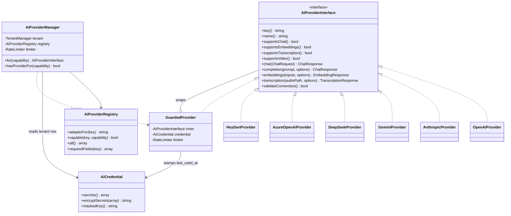
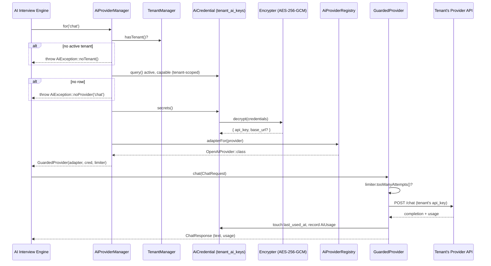

# 16 — AI Architecture: The Tenant AI Provider Layer

The provider-agnostic layer through which every AI call in HalaOps is routed, using **only the current tenant's encrypted credentials — never system keys**.

## Related Documents

- [17 — AI Providers](17-AI-Providers.md) — the concrete adapters (OpenAI, Anthropic, Gemini, DeepSeek, Azure OpenAI, HeyGen) that implement the interface defined here.
- [18 — AI Interview Engine](18-AI-Interview-Engine.md) — the primary consumer of this layer.
- [07 — RBAC](07-RBAC.md) — the `ai.view` / `ai.manage` permissions that gate credential management.
- [08 — Multi-Tenant](08-Multi-Tenant.md) — the `workspace_id` row-level isolation this layer depends on.
- [34 — Security](34-Security.md) — encryption-at-rest, key handling, and threat model.

---

## 1. Purpose (الهدف)

This document specifies the **Tenant AI Provider Layer** (طبقة مزوّد الذكاء الاصطناعي): the single abstraction every feature in HalaOps uses to reach a Large Language Model, an embeddings model, an audio transcription model, or a video-avatar service.

The layer lives at `app/Services/AI/` and consists of three parts:

1. **`AiProviderInterface`** — a uniform contract every provider adapter implements (`chat()`, `completion()`, `embeddings()`, `transcription()`, plus capability flags).
2. **`AiProviderManager`** — the resolver/factory that, given a *capability* (e.g. "chat"), loads the active tenant's credentials from `tenant_ai_keys`, decrypts them, instantiates the right adapter, and returns it ready to call.
3. **`Providers/`** — one final class per provider implementing the interface.

The single most important rule this document encodes:

> **HalaOps stores NO AI keys of its own. Every AI request is authenticated with the API key belonging to the workspace that is the active tenant for the request. There is no system-wide fallback key, no environment variable holding a provider key, and no code path that can call a provider without first reading that tenant's `tenant_ai_keys` row.**

## 2. Why It Exists (سبب وجوده)

HalaOps is sold to thousands of companies. Three forces make a tenant-owned, provider-agnostic layer mandatory:

- **Cost & liability isolation.** If the platform held one shared key, every tenant's AI usage would bill to HalaOps, and one tenant's abuse could exhaust the quota for all. By requiring each tenant to bring its own key, each company pays its own provider directly and bears its own rate limits. The platform never fronts AI cost.
- **Data governance & compliance.** Many enterprise and government customers (the Arabic-market HR sector especially) require that candidate data only ever reaches AI vendors *they* have contracted and signed a DPA with. Tenant-owned keys mean tenant-owned data-processing agreements.
- **Vendor freedom & resilience.** Models, prices, and regional availability change constantly. A uniform interface lets a tenant switch from OpenAI to Anthropic to a locally-hosted DeepSeek deployment by editing a settings form — with **zero code changes** — and lets HalaOps add a brand-new provider by dropping in one class.

Without this layer, AI calls would be scattered, hard-coded to one vendor, and would leak the platform's own keys — violating the core product rule and the security posture in [34 — Security](34-Security.md).

## 3. Architecture

### 3.1 Component responsibilities

| Component | Path | Responsibility |
|-----------|------|----------------|
| `AiProviderInterface` | `app/Services/AI/AiProviderInterface.php` | The contract: `chat`, `completion`, `embeddings`, `transcription`, capability flags, `validateConnection`, identity. |
| `AiProviderManager` | `app/Services/AI/AiProviderManager.php` | Resolves the active provider for a capability from the **current tenant's** `tenant_ai_keys`; instantiates the adapter; central error handling, usage logging, and rate-limit gating. |
| `AiProviderRegistry` | `app/Services/AI/AiProviderRegistry.php` | Static map of provider key → adapter class + metadata (capabilities, required credential fields). Data-driven; adding a provider edits only this map. |
| Provider adapters | `app/Services/AI/Providers/*.php` | One `final` class per vendor (`OpenAiProvider`, `AnthropicProvider`, `GeminiProvider`, `DeepSeekProvider`, `AzureOpenAiProvider`, `HeyGenProvider`). |
| DTOs | `app/Services/AI/Dto/` | `ChatRequest`, `ChatResponse`, `EmbeddingResponse`, `TranscriptionResponse`, `AiUsage` — vendor-neutral value objects. |
| `AiCredential` (model) | `app/Models/AiCredential.php` | Active-record over `tenant_ai_keys`; owns `secrets()` (decrypt) and `encryptSecrets()` (encrypt). Tenant-scoped. |
| `AiException` | `app/Services/AI/AiException.php` | Typed failure (auth, rate-limit, timeout, capability-unsupported, no-provider, transport). |

### 3.2 The interface

```php
namespace App\Services\AI;

use App\Services\AI\Dto\ChatRequest;
use App\Services\AI\Dto\ChatResponse;
use App\Services\AI\Dto\EmbeddingResponse;
use App\Services\AI\Dto\TranscriptionResponse;

interface AiProviderInterface
{
    /** Stable registry key, e.g. "openai", "anthropic", "heygen". */
    public function key(): string;

    /** Human label for Settings UI, e.g. "OpenAI", "Anthropic Claude". */
    public function name(): string;

    /** Capability flags so callers/UI can degrade gracefully. */
    public function supportsChat(): bool;
    public function supportsCompletion(): bool;
    public function supportsEmbeddings(): bool;
    public function supportsTranscription(): bool;
    public function supportsVideo(): bool;

    /** Multi-turn chat (the primary path for the interview engine). */
    public function chat(ChatRequest $request): ChatResponse;

    /** Single-prompt completion (legacy/simple generation). */
    public function completion(string $prompt, array $options = []): ChatResponse;

    /** Vector embeddings for semantic search / answer similarity. */
    public function embeddings(array $inputs, array $options = []): EmbeddingResponse;

    /** Audio → text for recorded/live interview answers. */
    public function transcription(string $audioPath, array $options = []): TranscriptionResponse;

    /**
     * Lightweight, cheap call to prove the tenant's key works
     * (used by Settings "Test Connection"). Throws AiException on failure.
     */
    public function validateConnection(): bool;
}
```

A provider that does not support a capability returns `false` from the corresponding flag and **throws `AiException::unsupported()`** if the matching method is called — callers must check the flag first (see §5).

### 3.3 The manager

`AiProviderManager` is registered as a container singleton (alongside `tenant`, `auth`, `access` in `Application`). It never accepts a key as an argument; it always derives it from the active tenant:

```php
namespace App\Services\AI;

use App\Models\AiCredential;
use App\Services\Tenancy\TenantManager;
use App\Support\RateLimiter;

final class AiProviderManager
{
    public function __construct(
        private readonly TenantManager $tenant,
        private readonly AiProviderRegistry $registry,
        private readonly RateLimiter $limiter,
    ) {}

    /** Resolve the provider the tenant has chosen for a capability. */
    public function for(string $capability): AiProviderInterface
    {
        // FAIL CLOSED: no active tenant => no AI, ever.
        if (! $this->tenant->hasTenant()) {
            throw AiException::noTenant();
        }

        $credential = $this->resolveCredential($capability);
        if ($credential === null) {
            throw AiException::noProvider($capability); // graceful degradation upstream
        }

        $class  = $this->registry->adapterFor($credential->provider);
        $secrets = $credential->secrets();          // decrypted in-memory only
        $config  = (array) ($credential->meta ?? []);

        $provider = new $class($secrets, $config);

        if (! $this->registry->capable($credential->provider, $capability)) {
            throw AiException::unsupported($credential->provider, $capability);
        }

        return new GuardedProvider($provider, $credential, $this->limiter);
    }

    public function hasProviderFor(string $capability): bool
    {
        return $this->tenant->hasTenant()
            && $this->resolveCredential($capability) !== null;
    }

    private function resolveCredential(string $capability): ?AiCredential
    {
        // Active credentials for this tenant whose provider advertises $capability.
        // Prefer is_default, then most-recently-used. Tenant scope is automatic
        // because AiCredential::$tenantScoped = true.
        foreach (AiCredential::query()
            ->where('is_active', '=', 1)
            ->orderByDesc('is_default')
            ->orderByDesc('last_used_at')
            ->get() as $row) {
            $cred = AiCredential::hydrate($row);
            if ($this->registry->capable($cred->provider, $capability)) {
                return $cred;
            }
        }

        return null;
    }
}
```

`GuardedProvider` is a thin decorator that wraps every real call with rate-limiting, usage capture, `last_used_at` stamping, and error normalization (§3.5).

### 3.4 Class diagram



### 3.5 The guard decorator (cross-cutting concerns)

`GuardedProvider` centralizes everything that must happen on *every* call regardless of vendor:

- **Rate limiting** via `App\Support\RateLimiter` keyed by `ai:{workspace_id}:{provider}:{capability}` (see §3.6 and [16] Performance).
- **Usage tracking** — captures token counts / audio seconds / video credits from each `*Response` DTO into `AiUsage`, persisted by the calling engine into `ai_interview_sessions.tokens_used` and optionally an aggregate counter in `settings`.
- **`last_used_at` stamping** on the `AiCredential` row for round-robin/default resolution.
- **Error normalization** — any vendor exception is wrapped in `AiException` with a typed category so upstream code never sees vendor-specific exceptions.

### 3.6 Where tenant configuration lives

Tenants manage providers under **Settings → AI Settings** (`resources/views/app/settings/ai.php`, controller `app/Controllers/App/AiSettingsController.php`). The form:

- lists provider cards from `AiProviderRegistry::all()`;
- shows, for each configured provider, its `label`, `maskedKey()`, capabilities, and a **Test Connection** button;
- lets a user with `ai.manage` add/update/remove credentials and mark one `is_default`.

Non-secret knobs (default chat model, temperature ceiling, monthly token soft-cap, whether to allow live interviews) are stored in the credential's `meta` JSON or in tenant `settings` rows keyed like `ai.chat.default_model`.

## 4. Workflow

### 4.1 Resolving and calling a provider (chat)



### 4.2 Adding a credential in Settings → AI Settings

1. User with `ai.manage` opens Settings → AI Settings.
2. Picks a provider (e.g. Anthropic), enters `api_key` (and `base_url`/`deployment` if required by the registry's `requiredFields`).
3. Controller validates required fields, then calls `AiCredential::encryptSecrets([...])` and writes/updates the `(workspace_id, provider)` row.
4. The controller immediately calls `validateConnection()` through the manager; on failure the row is saved as `is_active = 0` and the user is shown the typed error.
5. On success the row is `is_active = 1`; if it is the tenant's first provider it is also set `is_default = 1`.

### 4.3 Graceful degradation when nothing is configured

Every AI-touching feature must first ask `AiProviderManager::hasProviderFor($capability)`. When it returns `false`, the UI renders an **"AI not configured"** state (a call-to-action linking to Settings → AI Settings for users with `ai.manage`, or an informational note for those without) instead of a broken button. Recruitment flows continue fully **without** AI — interviews can be conducted and evaluated by humans (see [18 — AI Interview Engine](18-AI-Interview-Engine.md) §human-in-the-loop).

## 5. Business Rules

1. **No system keys, ever.** No `.env` variable, config value, or constant holds a provider key. The only source of a key is the active tenant's `tenant_ai_keys.credentials` (encrypted). Code review and the test suite enforce this (§12).
2. **Tenant binding is mandatory.** `AiProviderManager::for()` throws `AiException::noTenant()` if `TenantManager::hasTenant()` is false. AI is impossible without an active tenant; this fails closed exactly like the Model layer.
3. **One row per provider per tenant** — enforced by the DB unique key `(workspace_id, provider)`.
4. **Exactly one default** per capability family per tenant; setting a new default clears the previous one in the same transaction.
5. **Capability gating.** Callers must check `supports*()` / `hasProviderFor()` before invoking; calling an unsupported capability raises `AiException::unsupported()`.
6. **Keys are never returned to the client.** Only `maskedKey()` is ever rendered; the decrypted secret exists only transiently in server memory during a call.
7. **Inactive credentials are invisible to resolution.** `is_active = 0` rows are skipped by `resolveCredential()`; they remain so the user can fix and re-enable them.
8. **Usage is the tenant's.** All tokens/seconds/credits consumed are attributed to the tenant and surfaced in their AI Settings usage panel; the platform never aggregates billable usage onto itself.
9. **AI output is advisory.** Nothing produced through this layer auto-decides hiring outcomes (reinforced in [18]).

## 6. Database Relations

Primary table — **`tenant_ai_keys`** (tenant-scoped, built as `ai_credentials`), per [05 — Database-Architecture](05-Database-Architecture.md) §11.11 and `database/migrations/0011_create_ai_credentials_table.php`:

| Column | Type | Notes |
|--------|------|-------|
| `id` | BIGINT UNSIGNED PK | |
| `workspace_id` | BIGINT UNSIGNED | FK → `workspaces(id)` ON DELETE CASCADE; the tenant binding |
| `provider` | VARCHAR(40) | registry key: `openai`, `anthropic`, `gemini`, `deepseek`, `azure_openai`, `heygen` |
| `label` | VARCHAR(120) NULL | tenant-friendly name |
| `credentials` | TEXT NOT NULL | **AES-256-GCM** ciphertext of `{ "api_key": "...", "base_url": "...", ... }` |
| `meta` | JSON NULL | non-secret config (default model, region, deployment, soft-cap) |
| `is_active` | TINYINT(1) | resolution skips `0` |
| `is_default` | TINYINT(1) | preferred provider for its capability |
| `last_used_at` | TIMESTAMP NULL | stamped by `GuardedProvider` |
| `created_at`/`updated_at` | TIMESTAMP NULL | |

Constraints: `UNIQUE (workspace_id, provider)`, FK on `workspace_id`. Consuming tables that store the resolved provider/model and usage: **`ai_interview_sessions`** (`provider`, `model`, `tokens_used`) and **`interview_responses`** (`ai_score`, `ai_feedback`) — see §11 of the canonical schema and [18].

No new tables are introduced by this layer; usage aggregates reuse tenant `settings` rows.

## 7. Permissions

Per [07 — RBAC](07-RBAC.md), credential management is gated by the built `ai` group:

| Action | Permission |
|--------|------------|
| View AI Settings, see configured providers + masked keys + usage | `ai.view` |
| Add / edit / remove credentials, set default, run Test Connection | `ai.manage` |

Default role mapping: `owner` and `admin` get `ai.manage`; `hr-manager` typically gets `ai.view`. Consuming AI within a feature (e.g. running an interview) is gated by that feature's own permissions (`interviews.conduct`, `evaluations.manage`), **not** by `ai.*` — the AI layer is infrastructure, not a user-facing action by itself.

## 8. Validation

Credential writes (in `AiSettingsController`) validate using the core `Validator`:

- `provider` — `required|in:<keys from AiProviderRegistry::all()>`.
- `api_key` — `required|min:8` for all key-based providers; trimmed; never logged.
- `base_url` — `required|url` only when the registry marks it required (Azure OpenAI, self-hosted DeepSeek).
- `deployment` / `api_version` — `required` for Azure OpenAI.
- `label` — `nullable|max:120`.
- `meta.default_model` — `nullable|max:120`; if present, validated against the provider's known model list where the adapter exposes one.

Cross-field: the controller rejects a save if the registry's `requiredFields(provider)` are not all present. After validation passes structurally, a live `validateConnection()` is the final gate (see §4.2).

## 9. Edge Cases

| Case | Handling |
|------|----------|
| No active tenant when an AI call is attempted | `AiException::noTenant()` — fails closed; never falls back to a platform key (there is none). |
| Tenant has zero providers configured | `hasProviderFor()` → `false`; feature renders "AI not configured"; no exception in the happy path. |
| Configured provider lacks the requested capability | `AiException::unsupported()`; manager tries the next capable active credential before giving up. |
| Stored key is invalid/revoked at the vendor | Vendor 401 → `AiException::auth()`; `GuardedProvider` may auto-set `is_active = 0` and notify `ai.manage` users. |
| Corrupted/undecryptable `credentials` (wrong APP_KEY, tampering) | `AiCredential::secrets()` returns `[]`; manager treats the row as unusable and skips it; logged as a security event. |
| Vendor timeout / 5xx | `AiException::transport()`; engine marks the session `failed` with the error; retried via the queue where applicable. |
| Tenant exceeds its own provider rate limit | Vendor 429 → `AiException::rateLimit()`; surfaced with retry-after; our own pre-limiter (§11) usually prevents this. |
| Provider removed from registry but a row still references it | `adapterFor()` returns null → row skipped and flagged in Settings as "unknown provider". |

## 10. Security

- **Encryption at rest.** `credentials` is AES-256-GCM ciphertext produced by `App\Core\Encrypter` (12-byte IV + 16-byte GCM tag + ciphertext, base64) keyed by `APP_KEY`. GCM is authenticated, so tampering is detected on decrypt (`Unable to decrypt … tampered or wrong key`).
- **No plaintext persistence or transit to the client.** Decryption happens only in `AiCredential::secrets()`, in-memory, for the duration of one call. The UI sees only `maskedKey()`.
- **No system key surface.** Because no platform key exists, there is nothing to leak platform-wide; a breach of one tenant's row exposes only that tenant's key, and only if `APP_KEY` is also compromised.
- **Tenant isolation.** `AiCredential` is `$tenantScoped`; queries auto-filter by `workspace_id` and **throw if no tenant is active**, so one tenant can never resolve another's key.
- **Least logging.** Keys are never written to `storage/logs`; `AiException` messages and `activity_logs` entries carry provider + masked hint only.
- **Audit.** Add/update/remove/test events are recorded in `activity_logs` with actor, `workspace_id`, action, and masked metadata.
- **Outbound TLS.** All adapter HTTP calls require TLS verification on (no `CURLOPT_SSL_VERIFYPEER => false`).

See [34 — Security](34-Security.md) for the platform-wide posture.

## 11. Performance

- **Pre-emptive rate limiting** via the file-backed `App\Support\RateLimiter` (no Redis required), key `ai:{workspace_id}:{provider}:{capability}`, protects the tenant's vendor quota and smooths bursts before a 429 ever occurs.
- **Lazy resolution & adapter caching.** Adapters are instantiated only when a capability is actually requested; within one request the resolved credential is memoized.
- **Heavy work is queued.** Long operations (full interview scoring, transcription of long audio, HeyGen video render) run via `queued_jobs`, keeping web requests fast — see [35 — Performance](35-Performance.md) and [36 — Scalability](36-Scalability.md).
- **Indexes.** Resolution relies on `(workspace_id, provider)` (unique) and the implicit `workspace_id` filter; `is_active` / `is_default` are low-cardinality and filtered after the tenant scope, which is selective enough on a per-tenant working set.
- **Token economy.** `ChatRequest` carries `max_tokens` and the engine trims prompts/transcripts to model context windows to control cost and latency.

## 12. Testing

**Unit**
- `AiProviderManager::for()` throws `noTenant()` with no active tenant (fail-closed).
- `for()` throws `noProvider()` when the tenant has no capable active credential.
- Default/most-recently-used ordering picks the expected credential.
- `AiCredential::encryptSecrets()` → `secrets()` round-trips; tampered ciphertext yields `[]`.
- `GuardedProvider` stamps `last_used_at`, records usage, and wraps vendor errors as `AiException`.

**Feature (HTTP)**
- Settings → AI Settings: add credential happy path persists encrypted, runs Test Connection, sets default.
- `ai.manage` required to write; `ai.view` sufficient to read; unauthenticated/cross-tenant denied.
- "AI not configured" state renders when no provider is set.

**Security**
- No code path reads a provider key from env/config (static assertion / grep test in CI).
- Cross-tenant: tenant A cannot resolve or read tenant B's credential (isolation test).
- Decrypted keys never appear in responses, logs, or `activity_logs` (masking test).
- CSRF enforced on all credential writes.

## 13. Future Expansion

- **More providers** — add a class in `Providers/` and one registry entry; nothing else changes (see [17]).
- **Multiple keys per provider** — relax the unique key to `(workspace_id, provider, label)` to allow, e.g., separate dev/prod OpenAI keys with weighted routing.
- **Streaming responses** — add an optional `chatStream()` to the interface (capability-flagged) for token-by-token live interviews.
- **Spend governance** — promote usage aggregates into a dedicated `ai_usage` table with monthly hard caps and alerts.
- **Bring-your-own-endpoint** — the existing `base_url`/`meta` plumbing already supports self-hosted/OpenAI-compatible gateways; expose it as a generic "Custom (OpenAI-compatible)" provider.
- **Failover chains** — let a tenant order providers so the manager auto-falls-back to the next on `transport()`/`rateLimit()` errors.

## 14. Open Questions

None at this time. Multi-key-per-provider and a dedicated `ai_usage` table are tracked as Future Expansion and intentionally deferred to keep the first release's schema minimal.
