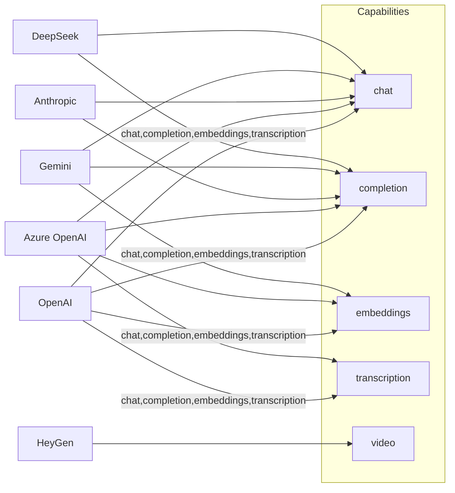
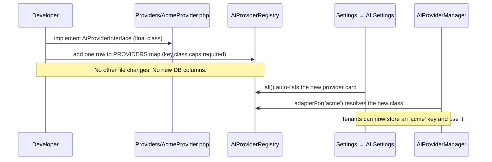
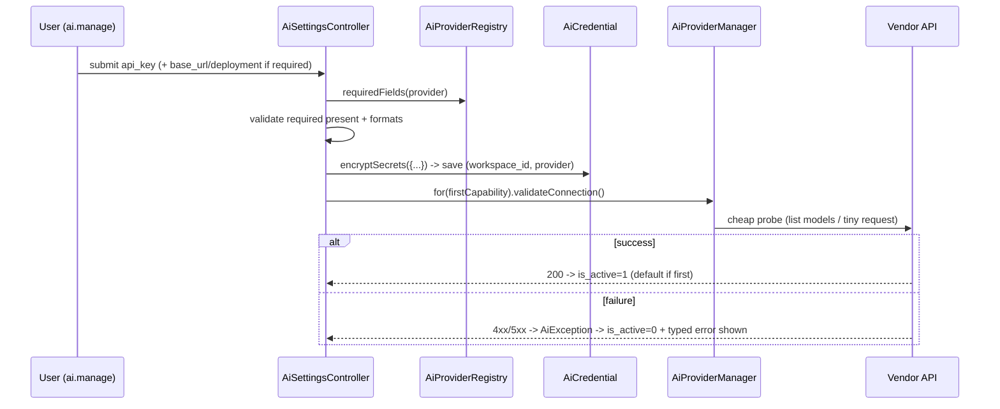

# 17 — AI Providers: Pluggable Adapters

Each AI vendor (OpenAI, Anthropic, Gemini, DeepSeek, Azure OpenAI, HeyGen) is a **pluggable adapter** behind `AiProviderInterface`, configured with the tenant's own encrypted key and added by writing one class plus one registry row.

## Related Documents

- [16 — AI Architecture](16-AI-Architecture.md) — the interface, manager, and "no system keys" rule these adapters live under.
- [18 — AI Interview Engine](18-AI-Interview-Engine.md) — the consumer that calls these adapters for question generation, transcription, and scoring.
- [34 — Security](34-Security.md) — encryption-at-rest and key-handling requirements every adapter must honor.

---

## 1. Purpose (الهدف)

This document specifies the **provider adapter layer** (طبقة المُحوِّلات): the concrete classes under `app/Services/AI/Providers/` that translate HalaOps' vendor-neutral DTOs (`ChatRequest`, `ChatResponse`, `EmbeddingResponse`, `TranscriptionResponse`) into each vendor's HTTP API and back, authenticating **with the active tenant's own credentials only**.

It defines, for every supported provider:

- its **capabilities** (chat / completion / embeddings / transcription / video);
- the **required credential fields** it reads from `tenant_ai_keys`;
- representative **models**;
- exactly **how a new provider is added** (one class + one registry entry, no changes elsewhere);
- the **registry table** that makes the set data-driven;
- **validation / test-connection** behavior per provider;
- the **security** rules for stored keys.

## 2. Why It Exists (سبب وجوده)

The AI market is volatile: prices, models, and regional availability change monthly, and HalaOps' Arabic-market customers vary widely in which vendor they are allowed to use. A single hard-coded vendor would be a commercial dead end.

The adapter pattern solves this:

- **Uniformity for callers.** The interview engine only ever programs against `AiProviderInterface`; it never knows or cares which vendor answered.
- **Open/closed extensibility.** Supporting a new vendor is additive — write one adapter, register it — so existing, tested code is never touched (the data-driven principle in the canonical context §2).
- **Tenant choice.** Because each adapter authenticates with the tenant's key, a tenant can switch vendors from a settings form, and different tenants on the same deployment can use entirely different vendors simultaneously.

## 3. Architecture

### 3.1 How an adapter is shaped

Every adapter is a `final` class implementing `AiProviderInterface`, constructed with the decrypted secrets array and the non-secret `meta` config:

```php
namespace App\Services\AI\Providers;

use App\Services\AI\AiProviderInterface;
use App\Services\AI\AiException;
use App\Services\AI\Dto\ChatRequest;
use App\Services\AI\Dto\ChatResponse;
use App\Services\AI\Dto\EmbeddingResponse;
use App\Services\AI\Dto\TranscriptionResponse;
use App\Services\AI\Http\JsonClient; // thin cURL wrapper, TLS verify ON

final class OpenAiProvider implements AiProviderInterface
{
    private string $apiKey;
    private string $baseUrl;

    public function __construct(array $secrets, array $config = [])
    {
        $this->apiKey  = (string) ($secrets['api_key'] ?? '');
        $this->baseUrl = rtrim((string) ($secrets['base_url'] ?? 'https://api.openai.com/v1'), '/');
        if ($this->apiKey === '') {
            throw AiException::auth('openai'); // never call the vendor without a key
        }
    }

    public function key(): string  { return 'openai'; }
    public function name(): string { return 'OpenAI'; }

    public function supportsChat(): bool          { return true; }
    public function supportsCompletion(): bool    { return true; }
    public function supportsEmbeddings(): bool     { return true; }
    public function supportsTranscription(): bool { return true; }  // Whisper
    public function supportsVideo(): bool         { return false; }

    public function chat(ChatRequest $r): ChatResponse { /* POST /chat/completions */ }
    public function completion(string $p, array $o = []): ChatResponse { /* maps to chat */ }
    public function embeddings(array $in, array $o = []): EmbeddingResponse { /* POST /embeddings */ }
    public function transcription(string $audio, array $o = []): TranscriptionResponse { /* POST /audio/transcriptions */ }

    public function validateConnection(): bool { /* GET /models, throws on failure */ return true; }
}
```

Adapters do **not** read `tenant_ai_keys` themselves and never touch `TenantManager` — `AiProviderManager` owns resolution and hands the adapter its already-decrypted secrets. This keeps the "no system keys" guarantee in exactly one place ([16] §3.3).

### 3.2 The registry

`app/Services/AI/AiProviderRegistry.php` is the single, data-driven source of truth that maps a provider key to its adapter class, capabilities, and required credential fields. The Settings UI and the manager both read it.

```php
namespace App\Services\AI;

final class AiProviderRegistry
{
    /** key => [class, label, capabilities, required, optional] */
    private const PROVIDERS = [
        'openai' => [
            'class'        => Providers\OpenAiProvider::class,
            'label'        => 'OpenAI',
            'capabilities' => ['chat', 'completion', 'embeddings', 'transcription'],
            'required'     => ['api_key'],
            'optional'     => ['base_url'],
        ],
        'anthropic' => [
            'class'        => Providers\AnthropicProvider::class,
            'label'        => 'Anthropic Claude',
            'capabilities' => ['chat', 'completion'],
            'required'     => ['api_key'],
            'optional'     => ['base_url', 'anthropic_version'],
        ],
        'gemini' => [
            'class'        => Providers\GeminiProvider::class,
            'label'        => 'Google Gemini',
            'capabilities' => ['chat', 'completion', 'embeddings'],
            'required'     => ['api_key'],
            'optional'     => ['base_url'],
        ],
        'deepseek' => [
            'class'        => Providers\DeepSeekProvider::class,
            'label'        => 'DeepSeek',
            'capabilities' => ['chat', 'completion'],
            'required'     => ['api_key'],
            'optional'     => ['base_url'],
        ],
        'azure_openai' => [
            'class'        => Providers\AzureOpenAiProvider::class,
            'label'        => 'Azure OpenAI',
            'capabilities' => ['chat', 'completion', 'embeddings', 'transcription'],
            'required'     => ['api_key', 'base_url', 'deployment', 'api_version'],
            'optional'     => [],
        ],
        'heygen' => [
            'class'        => Providers\HeyGenProvider::class,
            'label'        => 'HeyGen (Video Avatar)',
            'capabilities' => ['video'],
            'required'     => ['api_key'],
            'optional'     => ['base_url', 'avatar_id', 'voice_id'],
        ],
    ];

    public function all(): array { return self::PROVIDERS; }
    public function adapterFor(string $key): ?string { return self::PROVIDERS[$key]['class'] ?? null; }
    public function requiredFields(string $key): array { return self::PROVIDERS[$key]['required'] ?? []; }
    public function capable(string $key, string $capability): bool
    {
        return in_array($capability, self::PROVIDERS[$key]['capabilities'] ?? [], true);
    }
}
```

### 3.3 Provider registry table (authoritative)

| Key | Label | Chat | Completion | Embeddings | Transcription | Video | Required fields | Representative models |
|-----|-------|:----:|:----------:|:----------:|:-------------:|:-----:|-----------------|-----------------------|
| `openai` | OpenAI | ✅ | ✅ | ✅ | ✅ | — | `api_key` (+ `base_url`) | GPT-4o, GPT-4o-mini, `text-embedding-3-large`, `whisper-1` |
| `anthropic` | Anthropic Claude | ✅ | ✅ | — | — | — | `api_key` (+ `base_url`, `anthropic_version`) | Claude Opus, Claude Sonnet, Claude Haiku |
| `gemini` | Google Gemini | ✅ | ✅ | ✅ | — | — | `api_key` (+ `base_url`) | Gemini Pro, Gemini Flash, `text-embedding-004` |
| `deepseek` | DeepSeek | ✅ | ✅ | — | — | — | `api_key` (+ `base_url`) | `deepseek-chat`, `deepseek-reasoner` |
| `azure_openai` | Azure OpenAI | ✅ | ✅ | ✅ | ✅ | — | `api_key`, `base_url`, `deployment`, `api_version` | Tenant's deployed GPT-4o / embeddings / Whisper deployments |
| `heygen` | HeyGen (Video Avatar) | — | — | — | — | ✅ | `api_key` (+ `avatar_id`, `voice_id`, `base_url`) | Avatar video generation, streaming avatar |

Models are illustrative; the actual model id is chosen per-tenant via `meta.default_model` (or per-call options) so model refreshes need no code change.

### 3.4 Capability mapping diagram



## 4. Workflow

### 4.1 Adding a new provider (the only steps)



1. Create `app/Services/AI/Providers/AcmeProvider.php` implementing `AiProviderInterface`.
2. Add one entry to `AiProviderRegistry::PROVIDERS`.
3. Done. The Settings UI renders the new card from the registry; `AiProviderManager` resolves it; the `tenant_ai_keys` schema already accommodates it (`provider` VARCHAR, generic `credentials` blob, generic `meta`). **No controller, view, migration, or manager edits are required.**

### 4.2 Configuring & testing a provider (per tenant)



### 4.3 Per-provider test-connection probes

| Provider | Test-connection probe |
|----------|------------------------|
| OpenAI | `GET {base_url}/models` with `Authorization: Bearer {api_key}` |
| Anthropic | Minimal `POST {base_url}/v1/messages` (1-token request) with `x-api-key` + `anthropic-version` |
| Gemini | `GET {base_url}/models?key={api_key}` (or a 1-token generateContent) |
| DeepSeek | `GET {base_url}/models` with `Authorization: Bearer {api_key}` (OpenAI-compatible) |
| Azure OpenAI | `GET {base_url}/openai/deployments?api-version={api_version}` with `api-key` header |
| HeyGen | `GET {base_url}/v1/avatar.list` (or account/quota endpoint) with `X-Api-Key` |

A probe that returns 2xx → `validateConnection()` returns `true`; otherwise it throws the appropriate `AiException` category (auth / transport / rate-limit) which the controller surfaces.

## 5. Business Rules

1. **Adapters are stateless and tenant-fed.** They receive decrypted secrets via the constructor; they never read `tenant_ai_keys`, env, or config for keys.
2. **One adapter per vendor**, one registry key per adapter; the key is also the value stored in `tenant_ai_keys.provider`.
3. **Capabilities are declared in two consistent places** — the adapter's `supports*()` methods and the registry's `capabilities` list — and must agree (tested in §12).
4. **HeyGen is video-only.** It declares only the `video` capability; the interview engine treats video-avatar features as optional and degrades when no `video`-capable provider is configured.
5. **OpenAI-compatible vendors reuse one HTTP shape.** DeepSeek and self-hosted gateways set `base_url`; Azure OpenAI additionally needs `deployment` + `api_version`. This is data, not new code.
6. **No vendor exception escapes the adapter** — everything is normalized to `AiException`.
7. **Adding/removing a provider never alters the database** — the schema is generic by design.

## 6. Database Relations

All providers share the single tenant-scoped table **`tenant_ai_keys`** (built as `ai_credentials`; see [05 — Database-Architecture](05-Database-Architecture.md) §11.11 and [16] §6). Per-provider differences are carried entirely by data:

- `provider` — the registry key (`openai` … `heygen`).
- `credentials` — encrypted JSON whose shape varies by provider (`api_key` always; `base_url`, `deployment`, `api_version`, `anthropic_version`, `avatar_id`, `voice_id` as needed).
- `meta` — non-secret per-provider config: `default_model`, `region`, soft token cap, default HeyGen avatar/voice.
- `UNIQUE (workspace_id, provider)` guarantees one configuration per provider per tenant.

Downstream, the chosen provider/model is recorded on **`ai_interview_sessions`** (`provider`, `model`, `tokens_used`) so each session is auditable to the exact vendor that processed it.

## 7. Permissions

Identical to the AI layer's gating (see [07 — RBAC](07-RBAC.md)):

| Action | Permission |
|--------|------------|
| View provider cards, masked keys, capabilities | `ai.view` |
| Add / edit / remove a provider credential, run Test Connection, set default | `ai.manage` |

No provider can be configured or tested without `ai.manage`; all such actions are CSRF-protected and audited.

## 8. Validation

Driven by `AiProviderRegistry::requiredFields()` so it stays correct as providers are added:

- **Universal:** `provider in <registry keys>`; `api_key required|min:8` (trimmed, never logged).
- **OpenAI / Gemini / DeepSeek:** `base_url nullable|url` (defaults applied when blank).
- **Anthropic:** `anthropic_version nullable` (sane default applied); `base_url nullable|url`.
- **Azure OpenAI:** `base_url required|url`, `deployment required`, `api_version required` (e.g. a dated version string).
- **HeyGen:** `api_key required`; `avatar_id`/`voice_id`/`base_url` `nullable`.
- **meta.default_model:** `nullable|max:120`.

Structural validation is followed by a live `validateConnection()` probe (§4.3) before a credential is marked active.

## 9. Edge Cases

| Case | Handling |
|------|----------|
| Azure save missing `deployment`/`api_version` | Rejected by required-field validation with a field-level message; nothing saved. |
| OpenAI-compatible self-hosted gateway with custom URL | Set `base_url`; adapter targets it; TLS still verified. |
| HeyGen used for text capabilities | Manager's capability check raises `unsupported()`; UI never offers it for chat. |
| Vendor changes/deprecates a model | Tenant edits `meta.default_model`; no code change. |
| Two requests racing to set default | `is_default` toggled inside a transaction; unique resolution preserved. |
| Provider key valid but quota exhausted at vendor | 429 → `AiException::rateLimit()` with retry-after surfaced. |
| Registry references a class that fails to load | `adapterFor()` returns null; manager skips and Settings flags it. |
| Tenant stores a key for a provider later removed from the registry | Row remains but is unresolvable; shown as "unknown provider" and ignored by resolution. |

## 10. Security

- **Keys are encrypted at rest** in `tenant_ai_keys.credentials` via `App\Core\Encrypter` (AES-256-GCM, authenticated) and decrypted only transiently inside an adapter call ([16] §10, [34 — Security](34-Security.md)).
- **No system keys.** Adapters cannot function without a tenant-supplied key (the constructor throws `auth()` on an empty `api_key`); there is no environment/config fallback.
- **Strict transport security.** The shared `JsonClient` always verifies TLS and sets per-call timeouts; secrets travel only in the Authorization header to the vendor, never in query logs (Gemini's `?key=` requests are sent but never written to our logs).
- **Masking everywhere.** Only `AiCredential::maskedKey()` reaches a template; full secrets are never echoed back, even to `ai.manage` users.
- **Tenant isolation.** Resolution is via the tenant-scoped `AiCredential` model, so an adapter is only ever built from the active tenant's row.
- **Audit & least logging.** Configure/test/remove are logged to `activity_logs` with provider + masked hint; raw keys never appear in logs or error pages.

## 11. Performance

- **Shared, pooled HTTP client.** One `JsonClient` with connection reuse and tuned timeouts serves all adapters; heavy calls (transcription, HeyGen renders) are dispatched to `queued_jobs` ([35 — Performance](35-Performance.md)).
- **Cheap probes.** Test-connection uses the lightest endpoint per vendor (model list / 1-token request) to keep Settings responsive.
- **Pre-emptive rate limiting** is applied by `GuardedProvider` before the adapter runs ([16] §11), protecting each tenant's vendor quota.
- **No per-call DB chatter beyond the single credential read** already performed by the manager; adapters hold their config in memory for the request.

## 12. Testing

**Unit**
- Each adapter maps `ChatRequest` → vendor payload and vendor response → `ChatResponse`/usage correctly (mocked `JsonClient`).
- `supports*()` flags exactly match the registry `capabilities` for every provider (parity test).
- Empty `api_key` → constructor throws `AiException::auth()`.
- `validateConnection()` returns true on a 2xx mock and throws the right category on 401/429/5xx.
- Azure adapter builds the deployment+api-version URL correctly.

**Feature (HTTP)**
- Adding each provider via Settings persists encrypted creds and runs the correct probe.
- Required-field validation per provider (e.g. Azure deployment) blocks bad saves.
- `ai.manage` enforced; cross-tenant configuration denied.

**Security**
- No adapter reads keys from env/config (CI grep/static test).
- Decrypted keys never surface in responses or logs; only masked hints appear.
- TLS verification cannot be disabled in `JsonClient`.

## 13. Future Expansion

- **New vendors** (e.g. Mistral, Cohere, AWS Bedrock, locally-hosted LLMs) — add a class + registry row; zero ripple.
- **Generic "Custom (OpenAI-compatible)" provider** exposing `base_url` so tenants can point at any compatible gateway without a bespoke adapter.
- **Streaming adapters** — opt-in `chatStream()` capability for real-time live interviews.
- **More video/voice providers** alongside HeyGen (e.g. additional avatar or TTS vendors) under the same `video` capability.
- **Capability auto-discovery** — adapters could report live model lists to populate `meta.default_model` dropdowns dynamically.

## 14. Open Questions

None at this time. The set of launch providers is fixed by the canonical context; everything beyond it is additive via the registry and tracked under Future Expansion.
