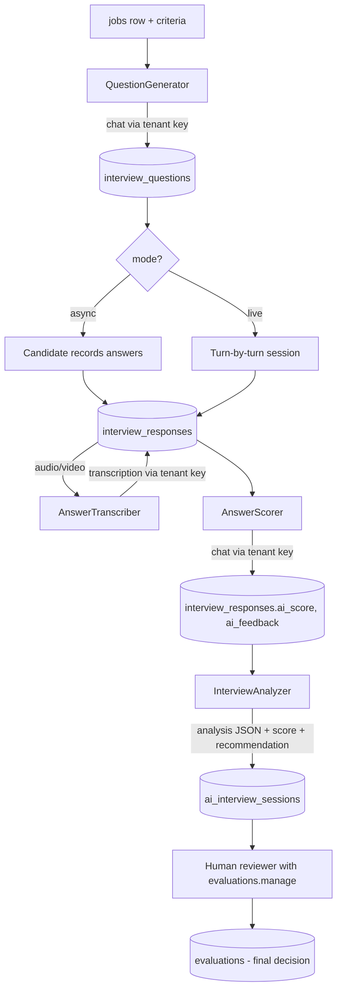
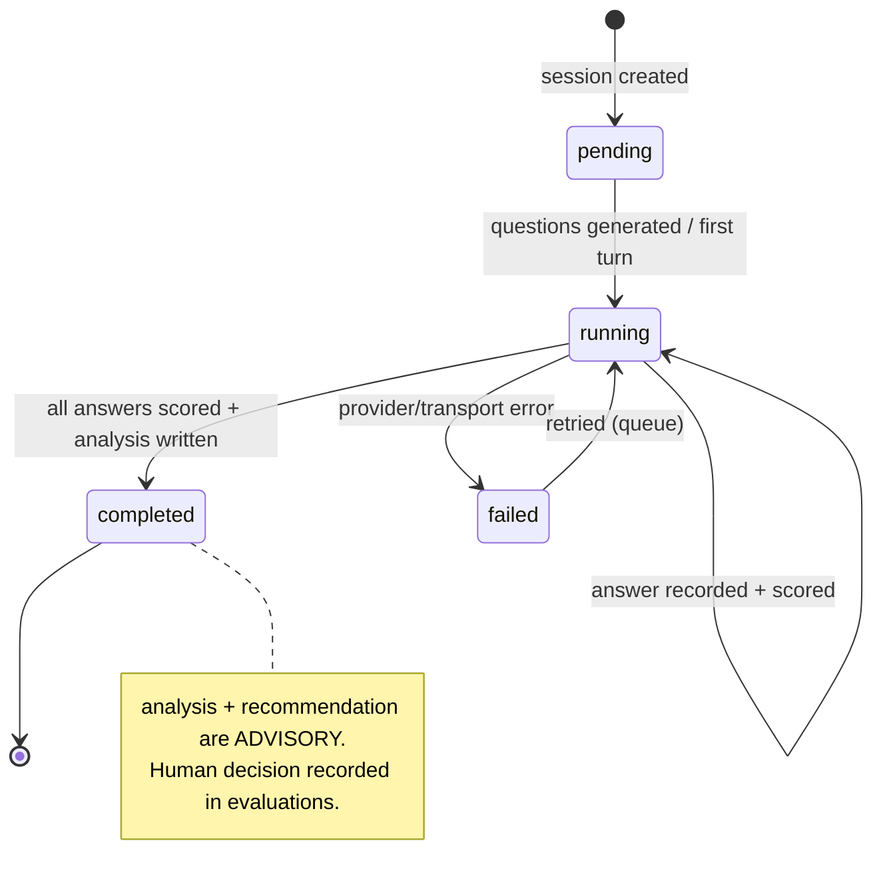
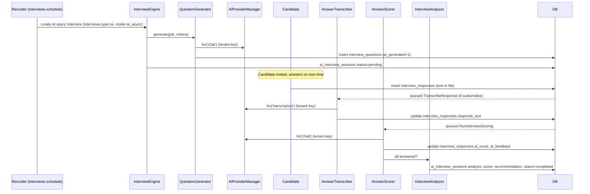

# 18 — AI Interview Engine

The engine that generates role-aware questions, conducts recorded (async) and live AI interviews, transcribes and scores answers against criteria, and produces a structured, **advisory** recommendation — with the final hiring decision always made by a human holding `evaluations.manage`.

## Related Documents

- [16 — AI Architecture](16-AI-Architecture.md) — the tenant provider layer (`AiProviderManager`) every call in this engine routes through, using the tenant's own keys only.
- [17 — AI Providers](17-AI-Providers.md) — the chat/transcription/video adapters the engine relies on.
- [23 — Interview-Workflow](23-Interview-Workflow.md) — how AI interviews sit inside the broader human/panel interview workflow.
- [25 — Application-Lifecycle](25-Application-Lifecycle.md) — where interviews fit in the candidate pipeline.
- [07 — RBAC](07-RBAC.md) — the `interviews.*` and `evaluations.*` permissions that gate this engine.

---

## 1. Purpose (الهدف)

This document specifies the **AI Interview Engine** (محرّك المقابلات بالذكاء الاصطناعي): the subsystem under `app/Services/AI/Interview/` that

1. **generates** interview questions tailored to a specific job and role;
2. **conducts** interviews in two modes — **async/recorded** (candidate answers on their own time) and **live** (turn-by-turn conversation);
3. **transcribes** audio/video answers to text;
4. **scores** each answer against defined criteria;
5. **synthesizes** a structured analysis plus an overall recommendation;
6. **persists** everything in `ai_interview_sessions`, `interview_questions`, and `interview_responses`, linked to an `interviews` row;
7. keeps a strict **human-in-the-loop**: AI output is advisory only.

Every model call is made through `AiProviderManager` with the **active tenant's** credentials — the engine itself holds no keys and has no system fallback ([16] §3.3).

## 2. Why It Exists (سبب وجوده)

Recruiters at HalaOps' customer companies screen large candidate volumes, often bilingually (Arabic/English). Manual first-round screening is slow, inconsistent, and prone to unstructured bias. The engine exists to:

- **Scale screening** — generate consistent, job-relevant questions and let candidates answer asynchronously, removing scheduling friction.
- **Standardize evaluation** — score every candidate against the *same* explicit criteria, producing comparable scorecards instead of gut feelings.
- **Keep humans in charge** — surface a transparent, evidence-linked recommendation while reserving the actual hire/reject decision for an authorized human, satisfying fairness and legal expectations.
- **Respect tenant data boundaries** — because all inference uses the tenant's own provider key, candidate data only reaches the vendor the tenant has approved ([16] §2).

## 3. Architecture

### 3.1 Components

| Component | Path | Responsibility |
|-----------|------|----------------|
| `InterviewEngine` | `app/Services/AI/Interview/InterviewEngine.php` | Orchestrator: start session, drive turns, finalize analysis. |
| `QuestionGenerator` | `app/Services/AI/Interview/QuestionGenerator.php` | Builds job/role-aware questions via `chat()`; persists `interview_questions`. |
| `AnswerTranscriber` | `app/Services/AI/Interview/AnswerTranscriber.php` | Audio/video → text via `transcription()`; stores onto `interview_responses`. |
| `AnswerScorer` | `app/Services/AI/Interview/AnswerScorer.php` | Scores a response against criteria; writes `ai_score`, `ai_feedback`. |
| `InterviewAnalyzer` | `app/Services/AI/Interview/InterviewAnalyzer.php` | Aggregates per-answer scores into `analysis` + recommendation on the session. |
| `LiveInterviewController` | `app/Controllers/App/LiveInterviewController.php` | Turn-by-turn live mode endpoints. |
| `AsyncInterviewController` | `app/Controllers/App/AsyncInterviewController.php` | Recorded-mode submission endpoints. |
| Queue jobs | `app/Jobs/Ai/*` | `RunInterviewScoring`, `TranscribeResponse`, `GenerateQuestions` (heavy work off the request). |
| Models | `app/Models/{Interview,InterviewQuestion,InterviewResponse,AiInterviewSession}.php` | Active-record over the four tables, all tenant-scoped. |

### 3.2 How it uses the provider layer

The engine never instantiates an adapter. For each operation it asks the manager for a capability and degrades if absent:

```php
final class QuestionGenerator
{
    public function __construct(private readonly AiProviderManager $ai) {}

    public function generate(Job $job, array $criteria, int $count = 6): array
    {
        if (! $this->ai->hasProviderFor('chat')) {
            // Graceful degradation: fall back to the tenant's question template
            // bank (interview_questions where interview_id IS NULL).
            return $this->templateBank($job, $count);
        }

        $provider = $this->ai->for('chat'); // tenant's key, GuardedProvider
        $response = $provider->chat($this->buildPrompt($job, $criteria, $count));

        return $this->parseQuestions($response);
    }
}
```

### 3.3 Data flow diagram



### 3.4 Session state machine



This maps directly to `ai_interview_sessions.status ∈ {pending, running, completed, failed}` from the canonical schema (§11.25).

## 4. Workflow

### 4.1 Async (recorded) interview



### 4.2 Live interview (turn-by-turn)

1. Recruiter starts a live AI interview (`interviews.mode = video`, `type = ai`); engine creates the session (`running`) and emits the first question.
2. Each candidate turn posts an answer; if audio/video, `AnswerTranscriber` transcribes inline (short clips) and `AnswerScorer` scores it.
3. `InterviewEngine` chooses the next question (optionally adaptive — follow-ups based on prior answers, still within the approved criteria) and continues until the question set is exhausted or time elapses.
4. On completion, `InterviewAnalyzer` writes the session analysis and recommendation.
5. Optional video-avatar presentation of questions is rendered via a `video`-capable provider (HeyGen) when one is configured; absent that, questions are shown as text/audio.

### 4.3 Human review (final decision)

The completed session surfaces in the application's interview view with: transcript, per-question scores + feedback, overall score, structured analysis, and the advisory recommendation. A user with `evaluations.manage` reviews the evidence and records the binding outcome in `evaluations` (rating + `recommendation` + notes). The AI recommendation is shown clearly **labeled as advisory** and is never written into `evaluations` automatically.

## 5. Business Rules

1. **AI is advisory; humans decide.** No engine output sets an application to `hired`/`rejected`. Only a user with `evaluations.manage` records the binding `evaluations` row ([07 — RBAC]).
2. **Tenant-key-only inference.** Every `chat`/`transcription`/`video` call goes through `AiProviderManager` with the active tenant's credentials; no system keys ([16]).
3. **Questions are job/role-aware** and generated from the `jobs` row + explicit criteria; AI-generated ones are flagged `interview_questions.ai_generated = 1`.
4. **Two modes** are first-class: async (`mode = ai_async`) and live (`mode = video`), both recorded as `interviews.type = ai`.
5. **Scoring is criteria-bound.** Each answer is scored only against the declared criteria; scores (`0–100` normalized, stored in `ai_score`) and rationale (`ai_feedback` JSON) are always stored together for auditability.
6. **One AI session per interview run** (`ai_interview_sessions.interview_id`); re-running creates a new session rather than mutating history.
7. **Graceful degradation.** With no capable provider, the engine falls back to the tenant's question template bank and the interview proceeds as a human interview; nothing breaks.
8. **Bias mitigation is mandatory** (see §10) — prompts exclude protected attributes and require evidence-linked justifications.
9. **Bilingual.** Questions, transcription, and analysis honor the job/candidate locale (AR/EN, RTL/LTR).
10. **Retention is bounded** (§ Security / data retention).

## 6. Database Relations

All tables are tenant-scoped (carry `workspace_id`, FK → `companies`, indexed) per the canonical schema (§11):

- **`interviews`** (§11.21): `application_id`→applications, `job_id`→jobs, `type[ai|human|panel]`, `mode[video|phone|onsite|ai_async]`, `status[scheduled|in_progress|completed|canceled|no_show]`, `scheduled_at`, `duration_minutes`, `created_by`. IDX(`workspace_id,application_id,status`). The parent of an AI run.
- **`interview_questions`** (§11.23): `interview_id`→interviews (NULL = reusable template/bank), `text`, `type[text|video|mcq|coding]`, `options` JSON, `expected` JSON, `ai_generated`, `sort_order`. The generated/curated question set.
- **`interview_responses`** (§11.24): `interview_id`→interviews, `question_id`→interview_questions, `user_id`→users (the candidate), `response_text`, `response_file_id`→files (recorded audio/video), `ai_score` DECIMAL, `ai_feedback` JSON. One row per answered question.
- **`ai_interview_sessions`** (§11.25): `interview_id`→interviews, `provider`, `model`, `status[pending|running|completed|failed]`, `transcript` LONGTEXT, `analysis` JSON, `score` DECIMAL(5,2), `tokens_used`, `error`, `started_at`, `completed_at`. The run record + aggregate result.
- **`evaluations`** (§11.26): `application_id`, `interview_id`, `evaluator_id`, `criteria` JSON, `rating`, `recommendation[strong_yes|yes|neutral|no|strong_no]`, `notes`. The **human** scorecard / final decision — written only by `evaluations.manage`.

Files for recorded answers live in **`files`** (tenant-scoped, checksummed, visibility `private`/`company`), referenced by `interview_responses.response_file_id` ([27 — Storage-System]).

## 7. Permissions

Per [07 — RBAC](07-RBAC.md):

| Action | Permission |
|--------|------------|
| View interviews, questions, responses, AI analysis | `interviews.view` |
| Schedule / set up an AI interview, trigger question generation | `interviews.schedule` |
| Conduct / run a live AI interview, transcribe/score | `interviews.conduct` |
| Cancel an interview | `interviews.cancel` |
| View evaluations / scorecards | `evaluations.view` |
| Create a scorecard entry | `evaluations.create` |
| **Record the binding hire/reject decision** | `evaluations.manage` |
| Candidate answering a recorded interview (candidate portal) | `candidate.apply` (own application only, via policy gate) |
| Manage the tenant's AI provider keys (prerequisite infra) | `ai.manage` |

The candidate's ability to answer is constrained by an `AccessControl` policy gate ("answer own application's interview"), never a broad permission.

## 8. Validation

- **Question generation:** `count` `integer|min:1|max:25`; `criteria` `required|array`; `job_id` `exists:jobs` (tenant-scoped); locale `in:ar,en`.
- **Async answer submission:** `response_text` `required_without:response_file|max:20000`; `response_file` `nullable|mimes:webm,mp4,mp3,wav,m4a|max:51200` (50 MB) and validated via the `files` pipeline (mime/size/checksum, [27]).
- **Live turn:** `interview_id` and `question_id` must belong to the active tenant and the candidate's interview; out-of-order or duplicate answers rejected.
- **Scoring inputs:** criteria weights must sum to a sane total; missing criteria default to equal weighting; AI returns are schema-checked — a non-conforming model response marks the session `failed` rather than storing garbage.
- **Recommendation enum** on `evaluations` constrained to `strong_yes|yes|neutral|no|strong_no`.

## 9. Edge Cases

| Case | Handling |
|------|----------|
| No AI provider configured | Engine uses the template question bank; interview proceeds human-led; UI shows "AI not configured" with a link for `ai.manage` users ([16] §4.3). |
| Provider lacks transcription (e.g. Anthropic) | Engine resolves a different capable active credential for `transcription`; if none, audio answers are stored and flagged "transcription unavailable" for manual review. |
| Candidate uploads corrupt/oversized media | Rejected at the `files` validation layer; candidate re-prompted; no response row created. |
| Model returns non-JSON / off-schema analysis | `InterviewAnalyzer` marks session `failed` with `error`; queue retries; never persists malformed analysis. |
| Vendor timeout / 5xx mid-run | Session → `failed`; `RunInterviewScoring` retried via `queued_jobs`/`failed_jobs`; partial per-answer scores already saved are preserved. |
| Tenant exceeds its provider quota (429) | `AiException::rateLimit()`; run paused with retry-after; recruiter notified. |
| Candidate abandons an async interview | Session stays `pending`/`running`; unanswered questions excluded from scoring; analysis notes incompleteness; reminder notifications sent ([26]). |
| Re-running an interview | New `ai_interview_sessions` row; prior session retained for audit. |
| Cross-tenant access attempt to a session | Blocked by tenant scoping on all four models (fails closed). |
| Bias-sensitive content detected in a question | Flagged by the fairness check (§10) and excluded before presentation. |

## 10. Security

**Bias mitigation & fairness (عدالة وتخفيف التحيّز)** — a first-class security/ethics control:

- **Attribute exclusion.** Generation and scoring prompts explicitly instruct the model to ignore and never infer protected attributes (gender, age, nationality, religion, marital status, disability, photo-derived traits). Candidate PII beyond the answer content is not sent to the model.
- **Evidence-linked scoring.** `ai_feedback` must cite the specific answer text justifying each score; unsupported scores are rejected. This makes the recommendation auditable and contestable.
- **Consistent criteria.** All candidates for a job are scored against the identical criteria set and weights, enabling apples-to-apples comparison and downstream fairness review.
- **Human override is binding.** The AI recommendation is labeled advisory in the UI; the `evaluations` row authored under `evaluations.manage` is the record of truth.
- **Auditability.** Provider, model, and `tokens_used` are stored per session; question generation, scoring, and human overrides are logged to `activity_log` with actor + `workspace_id`.

**Data protection:**

- All inference uses the **tenant's encrypted key** ([16] §10) — candidate data only reaches the tenant-approved vendor.
- Transcripts/analysis are tenant-scoped; recorded media in `files` is `private`/`company` visibility with checksum integrity ([27]).
- CSRF on all write endpoints; candidate answer endpoints additionally bound to the candidate's own application via policy gate.
- Secrets never logged; `ai_interview_sessions.error` stores normalized messages, never keys.

**Data retention (الاحتفاظ بالبيانات):** transcripts, recorded media, and AI analysis are retained per a tenant-configurable retention window (default 24 months) after the application is decided, then purged by a scheduled `queued_jobs` task; candidates may request deletion subject to the tenant's policy. Retention settings live in tenant `settings` (`ai.interview.retention_months`).

## 11. Performance

- **All heavy AI work is queued** (`GenerateQuestions`, `TranscribeResponse`, `RunInterviewScoring`) via DB-backed `queued_jobs`, keeping HTTP requests fast and absorbing vendor latency ([35], [36]).
- **Per-answer scoring is parallelizable** across queue workers; the analyzer runs once all answers are scored.
- **Prompt/transcript trimming** to the model's context window controls token cost and latency; `max_tokens` is always set on `ChatRequest`.
- **Pre-emptive rate limiting** via `GuardedProvider` protects the tenant's quota and avoids 429 stalls ([16] §11).
- **Indexes:** lookups use `interviews(workspace_id,application_id,status)`, `interview_responses(interview_id)`, and the `workspace_id` tenant filter; `ai_interview_sessions` is queried by `interview_id`. Transcripts (`LONGTEXT`) are fetched only on the detail view, not in lists.
- **Caching:** generated template-bank questions are reusable across interviews (rows with `interview_id IS NULL`), avoiding repeat generation cost.

## 12. Testing

**Unit**
- `QuestionGenerator` parses model output into `interview_questions` rows and falls back to the template bank when `hasProviderFor('chat')` is false.
- `AnswerScorer` writes `ai_score` + evidence-linked `ai_feedback`; rejects off-schema model output.
- `InterviewAnalyzer` aggregates scores and sets session `completed`; sets `failed` on malformed analysis.
- State transitions pending→running→completed/failed are enforced.

**Feature (HTTP)**
- Async flow: schedule → candidate answers → transcribe → score → analysis appears for reviewer.
- Live flow: turn-by-turn endpoints reject out-of-order/duplicate answers.
- Human-in-the-loop: AI recommendation never writes `evaluations`; only `evaluations.manage` can record the decision.
- Graceful degradation: with no provider, interview runs human-led with template questions.

**Security**
- Tenant isolation across all four tables (no cross-tenant read/write).
- Inference always uses the tenant's key; no system-key path.
- Candidates can only answer their own application's interview (policy gate).
- Fairness: prompts exclude protected attributes; scores without supporting evidence are rejected.
- CSRF on all writes; retention purge removes transcripts/media after the window.

## 13. Future Expansion

- **Adaptive questioning** — deeper follow-up generation driven by prior answers, bounded by approved criteria.
- **Streaming live mode** — token-streaming via a `chatStream()` capability for lower-latency conversation ([16] §13).
- **Multi-modal scoring** — incorporate video/voice cues (with explicit fairness review and tenant opt-in) once supported by a capable provider.
- **Calibration analytics** — compare AI scores vs. human outcomes per tenant to surface and correct drift/bias.
- **Question bank intelligence** — auto-curate reusable banks per department/role from high-signal historical questions.
- **Dedicated `ai_usage`** table for per-interview cost reporting (tracked in [16] Future Expansion).

## 14. Open Questions

None at this time. Adaptive/streaming/multi-modal capabilities are intentionally deferred to Future Expansion; default retention (24 months) and scoring scale (0–100 normalized) are set here and can be overridden per tenant via `settings`.
