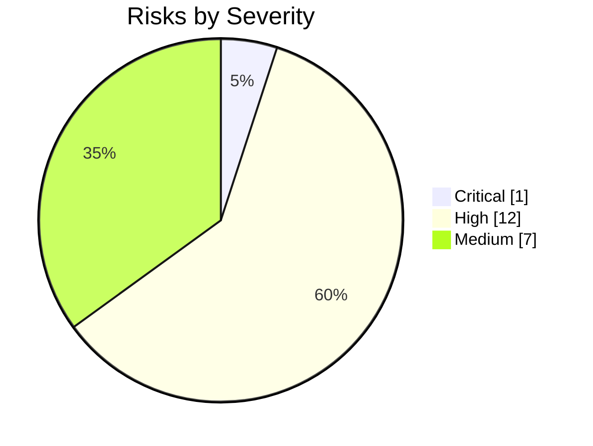

# Risk Register — Nizam AIOS

One-line purpose: The consolidated register of technical, security, operational, business, vendor, and compliance risks for **Nizam — the Bayan AI Operating System**, with likelihood, impact, severity, mitigations, and owners.

> **Status: Approved (Phase 1) | Version: 1.0.0 | Last updated: 2026-07-01 | Owner: Architecture (Nizam Core)**

---

## 1. Purpose & Method

This register identifies risks arising from the fixed architecture (see `16-ADR.md`) and the canonical execution flow, so that mitigations are designed *before* code exists. It is reviewed at every phase gate.

**Scoring.** Likelihood and Impact are rated **Low / Medium / High**. **Severity** is derived:

| Impact \ Likelihood | Low | Medium | High |
|---------------------|-----|--------|------|
| **High** | Medium | High | Critical |
| **Medium** | Low | Medium | High |
| **Low** | Low | Low | Medium |

**Owner roles** are architectural role labels (not individuals): *Architecture (Nizam Core)*, *Security*, *Platform/SRE*, *AI/Agents*, *Product*.

---

## 2. Risk Register

| ID | Risk | Category | Likelihood | Impact | Severity | Mitigation | Owner | Status |
|----|------|----------|-----------|--------|----------|------------|-------|--------|
| R-01 | **Prompt injection** — agents act on untrusted content (emails, web, documents) that contains adversarial instructions, causing unintended tool/automation calls. | security | High | High | **Critical** | Treat all external content as untrusted data, never instructions; strict separation of instructions vs. data in prompts; tool allow-lists per agent; human-in-the-loop for high-impact actions; output/action validation against the plan; guardrails in the Agent Framework and at the `LlmProvider` port. | AI/Agents | Open |
| R-02 | **Over-privileged tools** — a tool holds broader scopes than a task needs; a compromised or misled agent causes outsized damage. | security | Medium | High | **High** | Least-privilege tool scopes in the Tool Registry; per-tool permission metadata; permission checks at invocation (RBAC+ABAC); sandboxed invocation contracts; scope review in marketplace/plugin approval. | Security | Open |
| R-03 | **Cross-tenant data leakage via RLS misconfiguration** — a missing/incorrect RLS policy or unset tenant context exposes one tenant's data to another. | security | Medium | High | **High** | RLS mandatory on all tenant tables; tenant context guard rejects queries without a tenant; automated isolation tests in CI (attempt cross-tenant read/write and assert denial); default-deny policies; DB-layer enforcement independent of app code (ADR-0002/0008). | Security | Open |
| R-04 | **n8n as a single point of failure** — the automation executor becomes unavailable and workflows stall. | operational | Medium | High | **High** | Run n8n HA (multiple workers, queue mode); Automation Engine owns retries, idempotency, and dead-letter handling; adapter boundary allows failover/replacement; health checks and alerts; graceful degradation of dependent flows. | Platform/SRE | Open |
| R-05 | **n8n arbitrary-code execution risk** — code nodes / custom functions run untrusted or dangerous logic. | security | Medium | High | **High** | Disable or restrict code nodes by default; run n8n in a locked-down sandbox (network egress controls, resource limits, non-root, seccomp); review/approve custom workflows via Administration; no secrets exposed to arbitrary nodes; egress allow-lists. | Security | Open |
| R-06 | **Bayan coupling / availability** — Bayan (external Brain) is unavailable or changes its intent contract, breaking intent intake. | vendor | Medium | High | **High** | Anti-Corruption Layer (Bayan Gateway) isolates coupling to a versioned Intent contract (ADR-0006); contract validation and versioning; circuit breakers and graceful degradation; queue/backpressure for intents; contract tests against Bayan. | AI/Agents | Open |
| R-07 | **Event ordering & duplicate side-effects** — at-least-once delivery plus per-subject ordering leads to reprocessed events causing duplicate charges, notifications, or actions. | technical | High | Medium | **High** | Idempotency keys on all side-effecting consumers; dedup store; design side effects to be commutative/idempotent; outbox ensures no lost events; sagas with compensation; explicit ordering only where required (ADR-0004). | Architecture (Nizam Core) | Open |
| R-08 | **LLM / automation cost overruns** — high volume of agent runs, tool calls, automations, or tokens produces unexpected spend. | business | Medium | High | **High** | Metering of runs/calls/executions/tokens (Billing); per-tenant quotas and rate limits enforced before execution; budget alerts; model/parameter selection via config; cost dashboards (Monitoring); caching where safe. | Product | Open |
| R-09 | **Scaling bottlenecks** — shared Postgres (Pool tier), NATS, Redis, or n8n saturate under load; noisy-neighbor tenants degrade others. | technical | Medium | High | **High** | Tenant tiering (Pool/Bridge/Silo) to isolate heavy tenants (ADR-0013); horizontal scaling (K8s HPA); read replicas/CQRS read models; connection pooling; load and chaos testing in Phase 8; per-tenant rate limits. | Platform/SRE | Open |
| R-10 | **Vendor lock-in (n8n / LLM provider / NATS)** — deep coupling makes replacement costly. | vendor | Medium | Medium | **Medium** | Ports & adapters isolate each vendor (Automation Engine adapter, `LlmProvider` port, broker abstraction); avoid vendor-proprietary features leaking through ports; document exit paths; keep alternatives evaluated (Temporal, other models, Kafka). | Architecture (Nizam Core) | Open |
| R-11 | **Non-technical users misconfiguring integrations** — wrong credentials, scopes, or workflow wiring causes failures or data exposure. | operational | High | Medium | **High** | Wizard-driven UX with per-field help, examples, and security warnings (ADR-0012); Basic mode defaults; validation and connection-health checks before activation; safe defaults; confirmation for sensitive/destructive steps. | Product | Open |
| R-12 | **Secret leakage** — API keys, tokens, and credentials exposed via logs, events, error messages, or over-privileged nodes. | security | Medium | High | **High** | Vault-style secrets manager (abstracted); never store secrets in code/DB in plaintext; redaction in logs/traces; scoped, short-lived credentials; secrets never passed to arbitrary n8n nodes; secret scanning in CI. | Security | Open |
| R-13 | **Migration / data-integrity risk** — schema migrations (across many schemas/DBs at Bridge/Silo tiers) corrupt or lose data. | technical | Medium | High | **High** | Expand/contract migration strategy; backward-compatible changes; migration fan-out tooling across tiers; pre-prod rehearsal; backups + tested restore; optimistic concurrency (`version`); no destructive migrations without a reversible plan. | Platform/SRE | Open |
| R-14 | **Observability blind spots** — failures in async/event flows or cross-context sagas are hard to trace and diagnose. | operational | Medium | Medium | **Medium** | OpenTelemetry traces/metrics/logs end-to-end; correlation IDs propagated through events and sagas; structured JSON logging (pino); dashboards and SLO/alerting (Monitoring); trace intents from Bayan Gateway to n8n and back. | Platform/SRE | Open |
| R-15 | **Compliance / data-residency** — tenant data must reside in specific regions or meet regulatory controls not yet fully specified. | compliance | Medium | High | **High** | Silo tier for region-pinned tenants (ADR-0013); data classification and audit trail (ADR-0011); residency requirements captured as Open Questions (`19-Assumptions.md`); encryption at rest/in transit; DPA/retention policy design. | Security | Open |
| R-16 | **Saga compensation gaps** — a multi-context flow (Agents→Tools→Automation→Integrations) fails midway and compensation is incomplete, leaving inconsistent state. | technical | Medium | High | **High** | Explicit saga/process managers with defined compensations per step; idempotent compensations; event-sourced critical aggregates for reconstruction; timeouts and dead-letter handling; reconciliation jobs. | Architecture (Nizam Core) | Open |
| R-17 | **Authorization policy drift** — RBAC+ABAC policies grow inconsistent, granting or denying access incorrectly. | security | Medium | Medium | **Medium** | Central policy model; policy tests; least-privilege defaults; periodic access review; RLS as an independent backstop at the DB layer (ADR-0008); audited changes. | Security | Open |
| R-18 | **Modular monolith boundary erosion** — modules reach into each other's internals, eroding extractability and creating a "big ball of mud." | technical | Medium | Medium | **Medium** | Enforced module boundaries via architecture tests/lint; communication only via contracts and integration events; code review gates; Clean Architecture dependency rule (ADR-0001/0007). | Architecture (Nizam Core) | Open |
| R-19 | **Agent runaway / cost-and-safety loop** — an agent loops or fans out actions unbounded. | technical | Medium | Medium | **Medium** | Step/iteration limits and budget caps per agent run; guardrails and kill-switch; human approval thresholds; run-level metering and alerts; event-sourced run history for post-mortem. | AI/Agents | Open |
| R-20 | **Dependency/supply-chain vulnerabilities** — third-party libraries or n8n community nodes introduce vulnerabilities. | security | Medium | Medium | **Medium** | Dependency scanning and SBOM; pin and review versions; restrict community n8n nodes to approved list; regular patching; least-privilege runtime. | Security | Open |

---

## 3. Severity Summary

The single **Critical** risk (R-01, prompt injection) reflects the defining hazard of an agentic system that acts on untrusted data; its mitigation is a first-class concern of the Agent Framework and the `LlmProvider` port design.

---

## 4. Review Cadence

- Reviewed at every **phase gate** (see `15-Project-Roadmap.md`).
- Any new fixed decision (`16-ADR.md`) that introduces or changes a risk updates this register.
- Risks move to **Mitigated** only when the controlling design/controls are implemented and verified in the relevant phase.

---

## Related Documents

- `docs/16-ADR.md` — Decisions these risks derive from.
- `docs/19-Assumptions.md` — Assumptions and open questions related to several risks.
- `docs/15-Project-Roadmap.md` — Phase gates where risks are reviewed.
- `docs/22-UIUX-Guidelines.md` — UX mitigations for user-misconfiguration risks.
- `docs/audit/Risks-Report.md` — Audit view of risk coverage.

---

## Change Log

| Version | Date | Author | Change |
|---------|------|--------|--------|
| 1.0.0 | 2026-07-01 | Architecture (Nizam Core) | Initial risk register: R-01 through R-20 identified, scored, and assigned mitigations/owners. |
