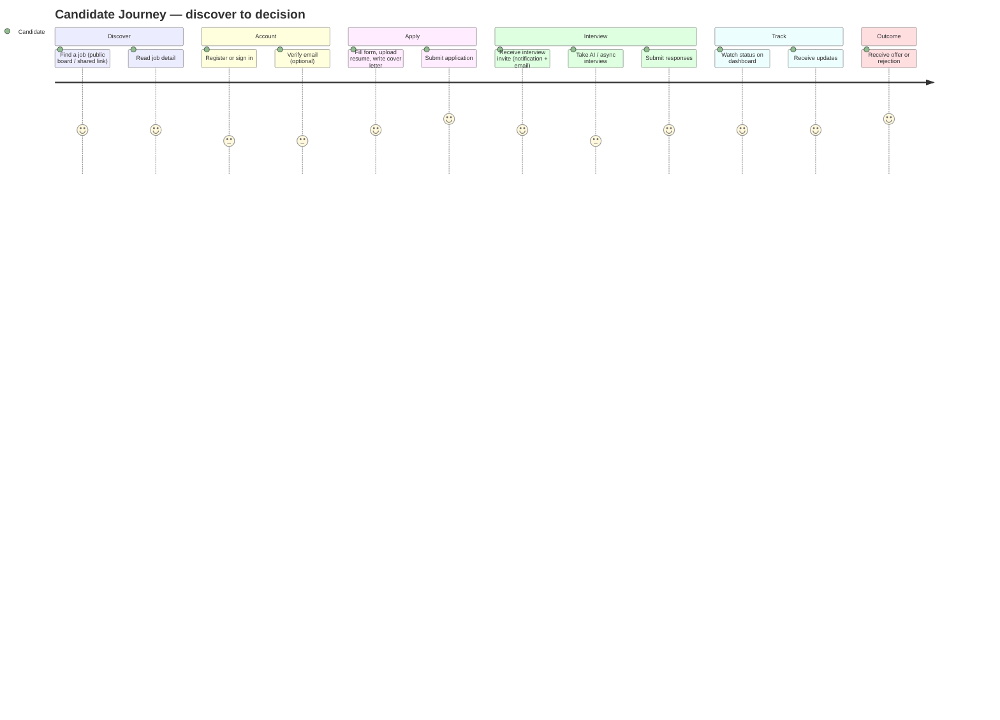

# 19 — Candidate Journey (رحلة المرشّح)

End-to-end experience of a **user acting in the Candidate role**: discovering a job, registering or signing in, applying (resume + cover letter), completing an AI / async interview, tracking status, receiving notifications, and reaching an offer or rejection — all inside the candidate-facing portal, with their personal data isolated across the companies they apply to.

> **Personas are roles, not tables.** A "candidate" is simply a `users` row whose membership in a hiring company carries the `candidate` role (or who applies through the public portal before any membership exists). There is no `candidates` table; an **application** links a user to a job within a company (§10, §11).

## Related Documents

- [25 — Application Lifecycle](25-Application-Lifecycle.md) — the server-side state machine this journey drives.
- [23 — Interview Workflow](23-Interview-Workflow.md) — how AI/async/human interviews are conducted and scored.
- [18 — AI Interview Engine](18-AI-Interview-Engine.md) — question generation, transcription, analysis.
- [26 — Notification System](26-Notification-System.md) — the events that keep the candidate informed.
- [27 — Storage System](27-Storage-System.md) — resume upload, validation, visibility.
- [11 — Permissions Matrix](11-Permissions-Matrix.md) — the `candidate.*` and related permissions.
- [20 — Recruiter Journey](20-Recruiter-Journey.md) — the counterpart who reviews these applications.
- [09 — Authentication](09-Authentication.md) — register/login/reset flows reused here.
- [08 — Multi-Tenant](08-Multi-Tenant.md) — the cross-company isolation this journey depends on.

---

## Purpose (الهدف)

This document specifies every screen, state, rule and permission a person encounters when they participate in HalaOps **as a candidate**: from the public job listing through to a hiring decision. It defines the candidate portal scope, the data the candidate owns, and how that data is kept private when the same human applies to multiple unrelated tenant companies.

## Why It Exists (سبب وجوده)

The candidate is the only actor who is *outside* a tenant's staff yet must interact deeply with tenant-owned data (jobs, interviews, decisions). Two problems make a dedicated journey necessary:

1. **Privacy across tenants.** One person may apply to Company A and Company B. Each company must see only *its own* application, never the candidate's activity elsewhere. The shared-database, row-level model (§5, §8) makes this a correctness-and-security concern, not a UI preference.
2. **A frictionless, fail-safe funnel.** A confusing apply/interview flow loses candidates. The journey must handle the unauthenticated visitor, the returning user, the half-finished AI interview, the expired link, and the rejected applicant — each with a defined empty/error/loading state.

Treating the candidate as "just a user with the candidate role" keeps the one-users-table invariant (§2) intact while still giving a tailored portal.

## Architecture

The candidate experience is a **distinct portal surface** layered on the same core framework, kept separate from the staff application shell (`resources/views/layouts/app.php`).

| Concern | Component | Notes |
|---|---|---|
| Public job board | `App\Controllers\Portal\JobBoardController` (planned) | Lists `open` jobs across companies via `withoutTenantScope()`, read-only, public. |
| Apply flow | `App\Controllers\Portal\ApplicationController` (planned) | Creates/updates `applications`; gated by `candidate.apply`. |
| Candidate dashboard | `App\Controllers\Portal\CandidateDashboardController` (planned) | "My applications" across all companies for the signed-in user. |
| Interview runner | `App\Controllers\Portal\InterviewController` (planned) | Renders async/AI interview, captures `interview_responses`. |
| Auth | existing `Auth\RegisterController`, `Auth\LoginController`, `Auth\PasswordController` | Reused unchanged (§7); registration here does **not** auto-create a company. |
| Files | `App\Services\Storage` + `files` table (§27) | Resume upload, mime/size validation, `visibility=private`. |
| AI | `AiProviderManager` resolved from the **hiring company's** credentials (§9) | Candidate never supplies keys; the tenant pays for and owns the AI. |
| Layout | `resources/views/layouts/candidate.php` (planned) | Lightweight RTL/LTR shell, no staff sidebar/nav registry. |

Key architectural decisions:

- **The candidate dashboard is the one place that deliberately spans tenants** for a single user. It is implemented as a query over `applications` filtered by `user_id = auth()->id()` using `Application::withoutTenantScope()`, never by selecting a tenant. This is safe because the filter is the *user's own* id, not another tenant's data.
- **All interview/job reads inside a specific application are tenant-pinned** to that application's `workspace_id`, so a candidate viewing Application #5 at Company A cannot see Company B's pipeline or other candidates.
- The portal renders only what exists; no dead buttons (§2). "Take interview" appears only when an `interviews` row in status `scheduled` exists for the application.

## Workflow



Detailed step-by-step flow with screens and permission checks:

```mermaid
flowchart TD
    A[Public job board /jobs] -->|public, no auth| B[Job detail /jobs/{company}/{slug}]
    B -->|click Apply| C{Authenticated?}
    C -- no --> D[Login or Register]
    D --> E[Auth\RegisterController.register<br/>no company created]
    C -- yes --> F[Apply form]
    E --> F
    F -->|POST, requires candidate.apply| G[ApplicationController.store]
    G -->|validate + store resume file| H[applications row created<br/>status=applied]
    H --> I[Notification: application received]
    I --> J[Candidate dashboard: My applications]
    J -->|recruiter schedules interview| K[Notification + email: interview invite]
    K --> L[Interview runner /portal/interviews/{id}]
    L -->|requires interviews.conduct as candidate participant| M[Answer questions<br/>interview_responses]
    M --> N[ai_interview_sessions runs async]
    N --> O[Status: interviewing -> offer/rejected]
    O --> P[Offer letter screen / Rejection notice]
```

**Screens / pages involved**

| Step | Page | Layout | Auth |
|---|---|---|---|
| Discover | `/jobs` (board), `/jobs/{company}/{slug}` (detail) | candidate / public | none |
| Account | `/login`, `/register`, `/forgot-password`, `/reset-password` | guest | none |
| Apply | `/jobs/{company}/{slug}/apply` | candidate | auth + `candidate.apply` |
| Track | `/portal/applications` (list), `/portal/applications/{id}` (detail) | candidate | auth (own rows) |
| Interview | `/portal/interviews/{id}` | candidate | auth + participant + `interviews.conduct` |
| Profile | `/profile` (reused) | candidate | auth + `candidate.profile` |
| Outcome | `/portal/applications/{id}` (offer/reject panel) | candidate | auth (own rows) |

**Onboarding for the Candidate role.** First-time candidates get a 3-step `onboarding_progress` flow (`flow = 'candidate'`, `workspace_id` NULL because it is platform-wide for the person): (1) complete profile (name, phone, locale, optional avatar); (2) upload a default resume to reuse across applications; (3) set notification preferences (`notification_preferences`). The flow is dismissible and resumable; completion sets `is_completed = 1`. Onboarding never blocks applying — a candidate can apply before finishing it.

## Business Rules

1. The public job board lists only jobs with `status = 'open'` and whose owning company has `status IN ('trial','active')` (suspended/canceled companies disappear from the board).
2. Applying requires authentication and the `candidate.apply` permission; an unauthenticated visitor is sent to login/register with a return URL back to the apply form.
3. **One application per (company, job, candidate)** — enforced by `UQ(workspace_id, job_id, user_id)` on `applications`. A second attempt shows "You have already applied" and links to the existing application.
4. A new account created from the portal does **not** create a company (unlike staff self-registration in §7); the user becomes a pure candidate with no membership until/unless a company adds them.
5. The candidate may **withdraw** an application while its `status NOT IN ('hired','rejected')`; this sets `status = 'withdrawn'` and writes an `application_events` row. Withdrawn applications are read-only thereafter.
6. A candidate sees **only their own** applications, interviews, responses, and files — across all companies — and never any other candidate's data or the company's internal pipeline/scorecards.
7. Interview links are valid only while the related `interviews` row is `scheduled` (async) or within the live window; expired/cancelled interviews render an explanatory state, not the runner.
8. AI interview cost and provider belong to the **hiring company** (§9); if that company has no active AI credential, the recruiter schedules a human interview instead and the candidate simply sees a human interview invite — never an error about missing keys.
9. Offer and rejection are **company decisions** surfaced to the candidate read-only; the candidate cannot change `status`, `score`, or stage.
10. Resume files default to `visibility = 'private'` and are accessible only to the candidate and to staff of the owning company with `applications.view`.
11. Email and in-app notifications respect the candidate's `notification_preferences`; transactional security messages (password reset) are always sent.

## Database Relations

Tables touched (all consistent with §11):

- **users** (GLOBAL) — the candidate identity; `name, email, phone, avatar, locale, status`. No type column.
- **applications** (tenant) — core record. `workspace_id`, `job_id` → `jobs`, `user_id` → `users` (the candidate), `current_stage_id` → `pipeline_stages`, `status`, `source`, `resume_file_id` → `files`, `cover_letter`, `score`, `applied_at`, `decided_at`. `UQ(workspace_id, job_id, user_id)`; `IDX(workspace_id, job_id, status, current_stage_id)`.
- **application_events** (tenant) — audit trail of every status/stage change and the candidate's own actions (apply, withdraw). `application_id` → `applications` CASCADE; `actor_id` → `users` SET NULL.
- **jobs** (tenant) — read for discovery and detail; only `status='open'` shown publicly. `UQ(workspace_id, slug)`.
- **pipeline_stages** (tenant) — the candidate sees a simplified label of `current_stage_id`, not the full internal pipeline.
- **interviews** (tenant) — `application_id`, `type[ai|human|panel]`, `mode[video|phone|onsite|ai_async]`, `status`, `scheduled_at`, `location_or_link`.
- **interview_participants** (tenant) — the candidate is a participant with `role = 'candidate'`; gate on interview access checks this row.
- **interview_questions** / **interview_responses** (tenant) — questions shown to the candidate; responses (`response_text`, `response_file_id`) captured per question.
- **ai_interview_sessions** (tenant) — created when an AI interview runs; the candidate never reads its `transcript`/`analysis` (advisory, staff-only).
- **files** (tenant) — resume / response uploads; `visibility='private'`, `checksum`, `mime`, `size`.
- **notifications** + **notification_preferences** — delivery of updates.
- **onboarding_progress** — candidate onboarding flow (`flow='candidate'`).
- **activity_logs** — security/business events (registration, application submitted) with actor + ip.

## Permissions

Gated by the `candidate.*` group plus participant-scoped interview rights (§6, §11):

| Action | Permission | Policy gate (AccessControl::define) |
|---|---|---|
| Edit own profile / resume | `candidate.profile` | "user is the profile owner" |
| Submit an application | `candidate.apply` | — |
| View an application | (none flag) | gate: `application.user_id === auth()->id()` |
| Withdraw an application | (none flag) | gate: owner **and** `status NOT IN ('hired','rejected')` |
| Take an interview | `interviews.conduct` | gate: candidate is an `interview_participants` row with `role='candidate'` |
| Upload resume/response file | `files.upload` | gate: file attaches to the candidate's own application |

The `candidate` tenant role (data-driven in `config/rbac.php`, added when the recruitment module ships) maps to `dashboard.view` (portal-scoped), `candidate.apply`, `candidate.profile`, `notifications.view`, `files.view`, `files.upload`, and the participant-scoped `interviews.conduct`. It explicitly holds **no** `jobs.*`, `applications.move/reject`, or `evaluations.*` permissions. Super admins bypass all checks (`AccessControl::allows`) but, per §22, must never browse candidate PII without the audited system path.

## Validation

- **Registration** (reuses `RegisterController`): `name required|min:2|max:150`; `email required|email|max:190|unique:users,email`; `password required|min:8|confirmed`. Email lower-cased before insert.
- **Apply form**: `cover_letter nullable|max:5000`; `resume` file `required_without:existing_resume`, mime in `pdf,doc,docx`, `max:5MB`; `job_id exists:jobs,id` (and job must be `open`); `consent` (privacy acknowledgement) `accepted`.
- **Profile**: `phone nullable|regex` (E.164-ish), `locale in:en,ar`, `avatar nullable|image|max:2MB`.
- **Interview responses**: `response_text required_without:response_file|max:10000` per text question; video/file responses validated for mime/size per question `type`.
- All writes carry a CSRF token (§4, §13). Server-side validation is authoritative; client hints are convenience only.

## Edge Cases

- **Already applied** — duplicate apply caught by the unique key → friendly "already applied" with a link, not a 500.
- **Job closed mid-apply** — if the job flips to `paused/closed` between rendering and POST, the apply is rejected with "This job is no longer accepting applications."
- **Company suspended** — applications to a now-suspended company become read-only; the candidate keeps their record but cannot act, and the job vanishes from the board.
- **Resume upload fails** (bad mime, oversize, disk error) — inline field error; the partial application is not persisted, old input retained.
- **Interview link expired / interview cancelled** — runner shows an empty state ("This interview is no longer available; your recruiter will be in touch"), never a stack trace.
- **AI provider error / timeout** — the `ai_interview_sessions` row goes `failed`; the candidate's submitted responses are still saved, and the candidate sees "Responses received" while staff are alerted to re-run analysis (human-in-the-loop, §9).
- **Half-finished async interview** — partial `interview_responses` are saved per question; the candidate can resume until the deadline.
- **Withdraw after decision** — blocked by the policy gate; button is hidden once `hired/rejected`.
- **Same email, different person** — not allowed; `email` is unique platform-wide, so accounts are per-person, and the same person reuses one account across companies.
- **Deleted job/company** — `applications.job_id` cascades; the candidate dashboard simply stops showing orphaned rows.

## Security

- **Tenant isolation of PII**: an application read is authorized by the ownership gate (`user_id === auth id`) *and* pinned to its `workspace_id`; there is no code path where a candidate parameter selects another tenant's rows. Cross-company "my applications" uses `withoutTenantScope()` filtered strictly by the user's own id.
- **IDOR protection**: every `/portal/applications/{id}` and `/portal/interviews/{id}` resolves the row, then asserts the ownership/participant gate before rendering; mismatches `abort(403)`.
- **File access**: resumes are `private`; downloads stream through an authorizing controller that re-checks ownership/company membership — never a guessable public URL.
- **CSRF** on all POST/PUT (apply, withdraw, response submit, profile update).
- **Anti-enumeration** on register/reset (§7): no "email exists" leak beyond the standard unique-email message at registration.
- **Rate limiting** on apply and interview submission (`throttle:` middleware) to deter abuse/scraping; the public board is cache-friendly and rate-limited.
- **AI keys** are never exposed to the candidate; all AI calls run server-side with the tenant's encrypted credentials (§9).
- **Output escaping** via `e()` for cover letters and any candidate-supplied text rendered back to staff.
- **Audit**: registration, application submit/withdraw, and interview completion are written to `activity_logs` with actor and ip.

## Performance

- Public board uses `IDX(workspace_id, status)` on `jobs` plus FULLTEXT search (§28); results paginated (`QueryBuilder::paginate`) and safe to cache for anonymous users.
- "My applications" uses `applications.user_id` (covered by the join indexes) and paginates; status/stage labels resolved with a single join to `pipeline_stages` to avoid N+1.
- Resume thumbnails/metadata read from `files` by `resume_file_id` (indexed).
- AI interview scoring is offloaded to the queue (`queued_jobs`, §12) so the candidate's submit returns immediately; the dashboard reflects results when the session completes.
- Notification fan-out is queued; the in-app badge reads `notifications` by `IDX(user_id, read_at)`.

## Testing

- **Unit**: ownership gate returns true only for the application owner; withdraw gate blocks once `hired/rejected`; board query excludes non-`open` jobs and suspended companies.
- **Feature**: full apply flow (register → apply → resume upload → row created, event logged, notification queued); duplicate-apply hits the unique key gracefully; withdraw transitions status and is then read-only; interview runner saves responses and resumes partial async interviews.
- **Security**: candidate A cannot GET/POST candidate B's application or interview (expect 403); resume download requires ownership; CSRF rejected without token; cross-tenant "my applications" returns only the caller's rows even with two companies; suspended-company applications are read-only.
- **AI**: provider failure marks `ai_interview_sessions=failed` but preserves responses and shows the candidate a success state; no AI key in any candidate-facing response.
- **i18n**: portal renders correctly in RTL (ar) and LTR (en); validation messages localized.

## Future Expansion

- **Candidate profile as a reusable CV** — a structured profile (experience, skills) that pre-fills applications; an opt-in talent pool a company can search (still tenant-consented).
- **Saved jobs & job alerts** — notification preferences extended to keyword/location alerts.
- **One-click apply** with a default resume already on file (the onboarding step seeds this).
- **Self-scheduling** of live interviews via recruiter-published availability.
- **Multi-resume / portfolio** attachments and richer response types (coding sandbox via `interview_questions.type='coding'`).
- **Public API** (`/api/v1`, §29) for partner job boards to post applications, still passing through `candidate.apply` and tenant scoping.
- **Accessibility & assistive interview modes** (extended time, captions on AI video via HeyGen, §9).

## Open Questions

- Should a candidate be allowed to **re-apply** to the same job after rejection (new application vs. reopen)? Current rule: blocked by the unique key; a "re-apply after N days" policy may be added as company-configurable.
- Whether candidates may **delete** (not just withdraw) their data per data-subject requests, and how that interacts with the company's hiring audit trail — likely an anonymization path rather than hard delete; to be aligned with the audit system (§38).
