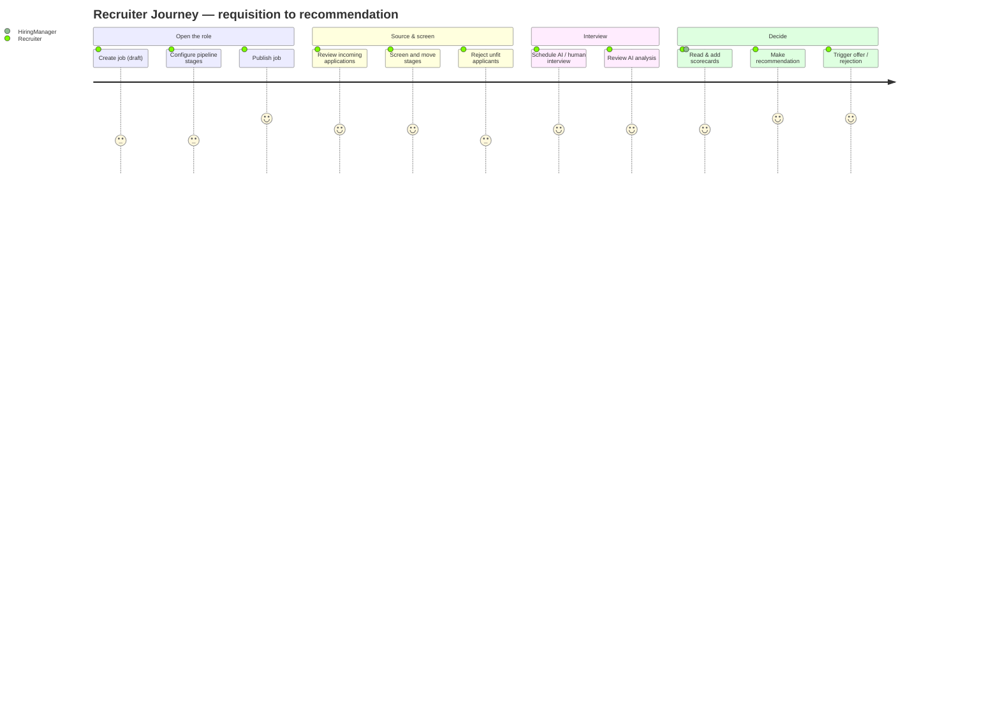

# 20 — Recruiter Journey (رحلة المسؤول عن التوظيف)

End-to-end experience of a **user acting in the Recruiter role**: creating and publishing jobs, reviewing incoming applications in a pipeline, moving candidates between stages, scheduling interviews, reviewing AI analysis, collaborating with hiring managers via scorecards, and making hiring recommendations — all within one tenant company.

> **Personas are roles, not tables.** A "recruiter" is a `users` row whose active `membership` in a company carries the `recruiter` role. The same human could be a recruiter at Company A and a candidate at Company B; capabilities come only from roles + permissions (§2, §6).

## Related Documents

- [24 — Job Lifecycle](24-Job-Lifecycle.md) — the job state machine (draft → open → closed) this journey drives.
- [25 — Application Lifecycle](25-Application-Lifecycle.md) — the pipeline and application states the recruiter operates.
- [23 — Interview Workflow](23-Interview-Workflow.md) — scheduling, conducting, and scoring interviews.
- [18 — AI Interview Engine](18-AI-Interview-Engine.md) — the AI analysis the recruiter reviews (advisory).
- [11 — Permissions Matrix](11-Permissions-Matrix.md) — the `jobs.*`, `applications.*`, `interviews.*`, `evaluations.*` permissions.
- [19 — Candidate Journey](19-Candidate-Journey.md) — the counterpart this journey services.
- [21 — HR Journey](21-HR-Journey.md) — the manager who oversees recruiters and configures the workspace.
- [26 — Notification System](26-Notification-System.md) — events fired as the recruiter acts.

---

## Purpose (الهدف)

This document specifies the recruiter's complete workflow and every screen, rule, validation and permission involved in turning an open requisition into a hiring recommendation. It defines what the recruiter can do, the collaboration surface (scorecards), and how AI output is presented as advisory input to a human decision.

## Why It Exists (سبب وجوده)

The recruiter is the **operational heart of the recruitment module** — the role that spends the most time in HalaOps day to day. Their journey must be explicit because:

1. **Throughput depends on a clean pipeline.** Moving dozens of candidates across stages, scheduling interviews, and reading evaluations has to be fast, unambiguous, and auditable.
2. **AI is advisory, never autonomous.** Per §9 the AI scores and analyses, but the *decision* belongs to humans with `evaluations.manage`. The journey must show exactly where the recruiter sees AI output and where their own judgement is recorded.
3. **Collaboration is multi-actor.** Recruiters, hiring managers, and interviewers all touch one application; the journey defines who can do what so collaboration doesn't become a permissions tangle.
4. **Tenant scoping is implicit and total.** Every job/application/interview the recruiter sees is automatically the active company's (§5); the journey documents that this is enforced by the Model layer, not by the controller remembering to filter.

## Architecture

The recruiter works inside the **authenticated staff shell** (`resources/views/layouts/app.php`), whose navigation registry renders a section only when its module has shipped and the user holds the gating permission (so no dead links, §2).

| Concern | Component | Notes |
|---|---|---|
| Jobs CRUD + publish | `App\Controllers\App\JobController` (planned) | `jobs.*`; create/edit/publish/close. |
| Pipeline board | `App\Controllers\App\PipelineController` (planned) | Kanban over `pipeline_stages` for a job. |
| Applications | `App\Controllers\App\ApplicationController` (planned) | View/move/reject; writes `application_events`. |
| Interviews | `App\Controllers\App\InterviewController` (planned) | Schedule/cancel; `interviews.*`. |
| AI analysis view | reads `ai_interview_sessions` via `AiProviderManager` results | Advisory display only. |
| Scorecards | `App\Controllers\App\EvaluationController` (planned) | `evaluations.*`; per-interview ratings. |
| Search | `App\Services\Search` (FULLTEXT, §28) | Tenant-filtered job/candidate search. |
| Notifications | `App\Services\Notifications` (§26) | Fired on publish, move, schedule, decision. |

Architectural decisions:

- **Tenant scope is automatic.** `Job`, `Application`, `Interview`, `Evaluation` models are `tenantScoped = true`; `query()` adds `WHERE company_id = :active` and throws if no tenant is active (§4). A recruiter literally cannot query another company's data through the normal model path.
- **The pipeline is data-driven.** Stages come from `pipeline_stages` (per-job, or a company default template when `job_id IS NULL`), so a company can reshape its hiring funnel without code (§2).
- **AI results are read-only artifacts.** `ai_interview_sessions.analysis` / `score` render in a clearly-labelled "AI insight" panel; the recruiter's own input lives in `evaluations`. The two are never merged silently.
- **Every state change is logged.** Moves/rejections/schedules write `application_events` and `activity_log`, giving an auditable history per candidate.

## Workflow



Detailed flow with screens and per-step permissions:

```mermaid
flowchart TD
    A[Jobs list /jobs] -->|jobs.create| B[New job form -> draft]
    B -->|jobs.update| C[Edit + set pipeline_stages]
    C -->|jobs.publish| D[Job status=open, published_at set]
    D --> E[Notification: job live]
    E --> F[Pipeline board /jobs/{id}/pipeline]
    F -->|applications.view| G[Application detail /applications/{id}]
    G -->|applications.move| H[Drag to next stage<br/>application_events row]
    G -->|applications.reject| R[Reject -> status=rejected, notify candidate]
    H -->|interviews.schedule| I[Schedule interview<br/>interviews + interview_participants]
    I --> J[Notify candidate + interviewers]
    J --> K[AI/async interview runs -> ai_interview_sessions]
    K -->|interviews.view| L[AI analysis panel - advisory]
    L -->|evaluations.create| M[Add scorecard - rating, recommendation]
    M -->|evaluations.manage| N[Consolidated recommendation]
    N -->|applications.move| O[Move to offer -> notify candidate]
```

**Screens / pages involved**

| Step | Page | Permission |
|---|---|---|
| Jobs list | `/jobs` | `jobs.view` |
| Create/edit job | `/jobs/create`, `/jobs/{id}/edit` | `jobs.create` / `jobs.update` |
| Publish/close | action on `/jobs/{id}` | `jobs.publish` |
| Pipeline board | `/jobs/{id}/pipeline` | `applications.view` |
| Application detail | `/applications/{id}` | `applications.view` |
| Move stage | inline on board / detail | `applications.move` |
| Reject | action on `/applications/{id}` | `applications.reject` |
| Schedule interview | `/applications/{id}/interviews/create` | `interviews.schedule` |
| AI analysis | `/interviews/{id}` (AI panel) | `interviews.view` |
| Scorecard | `/interviews/{id}/evaluate` | `evaluations.create` |
| Recommendation | `/applications/{id}` (decision panel) | `evaluations.manage` |

**Onboarding for the Recruiter role.** A newly-added recruiter gets an `onboarding_progress` flow (`flow='recruiter'`, scoped to the company): (1) tour the pipeline board; (2) create or clone the first job; (3) confirm the company has an AI provider configured (or learn that human interviews are the fallback — links to HR if AI is missing, §21). The flow is resumable and never blocks work. The staff sidebar reveals Jobs/Pipeline links only once the recruitment module is shipped and the recruiter holds `jobs.view`/`applications.view`.

## Business Rules

1. A job is created in `status = 'draft'`; it is invisible to candidates until **published** (`jobs.publish`), which sets `status = 'open'` and `published_at`.
2. Only jobs in `open` accept applications; `paused` hides the board entry from candidates but keeps existing applications; `closed`/`archived` are terminal for intake.
3. Pipeline stages are ordered by `sort_order`; an application's `current_stage_id` must reference a stage belonging to that job (or the company default template).
4. Moving a stage requires `applications.move` and writes an `application_events` row capturing `from_stage_id`, `to_stage_id`, `actor_id`. Backward moves are allowed and logged.
5. Rejection (`applications.reject`) sets `status='rejected'` and `decided_at`, and triggers a candidate notification; rejected applications are read-only except for notes.
6. Scheduling an interview (`interviews.schedule`) creates an `interviews` row plus `interview_participants` (candidate as `role='candidate'`, staff as `interviewer`/`observer`) and notifies all participants.
7. **AI is advisory.** `ai_interview_sessions.score`/`analysis` may inform but never set the application's final `status`. The decision is recorded by a user with `evaluations.manage`.
8. Any participant interviewer may submit a scorecard (`evaluations.create`); consolidating/overriding scorecards into a recommendation requires `evaluations.manage`.
9. A recruiter operates **only within the active tenant**; switching companies (topbar switcher) changes which jobs/applications are visible. There is no cross-company view for recruiters.
10. Closing a job does not delete its applications; historical pipeline and evaluations remain for audit (`application_events`, `activity_log`).
11. A recruiter cannot edit a candidate's profile or resume (that is candidate-owned, §19); they only read it in context of the application.

## Database Relations

Consistent with §11:

- **jobs** (tenant) — `company_id`, `title`, `slug`, `description`, `department`, `location`, `employment_type`, `status[draft|open|paused|closed|archived]`, `openings`, `salary_min/max`, `currency`, `is_remote`, `created_by`→users, `published_at`, `closed_at`. `UQ(company_id, slug)`, `IDX(company_id, status)`.
- **pipeline_stages** (tenant) — `job_id` (NULL = company default), `name`, `type[applied|screening|interview|offer|hired|rejected]`, `sort_order`. `IDX(company_id, job_id)`.
- **applications** (tenant) — the records being worked; `current_stage_id`→`pipeline_stages`, `status`, `score`, `resume_file_id`, `cover_letter`, `applied_at`, `decided_at`. `UQ(company_id, job_id, user_id)`, `IDX(company_id, job_id, status, current_stage_id)`.
- **application_events** (tenant) — append-only history of moves/rejects/notes; `actor_id`→users SET NULL, `from_stage_id`, `to_stage_id`, `note`, `properties`. `IDX(application_id)`.
- **interviews** (tenant) — `application_id`, `job_id`, `type[ai|human|panel]`, `mode[video|phone|onsite|ai_async]`, `status`, `scheduled_at`, `duration_minutes`, `location_or_link`, `created_by`. `IDX(company_id, application_id, status)`.
- **interview_participants** (tenant) — staff + candidate links; `role`, `response[accepted|declined|tentative]`. `UQ(interview_id, user_id)`.
- **interview_questions** / **interview_responses** (tenant) — question bank and captured answers (with `ai_score`, `ai_feedback`).
- **ai_interview_sessions** (tenant) — `provider`, `model`, `status`, `transcript`, `analysis`, `score`, `tokens_used` — the advisory artifact the recruiter reads.
- **evaluations** (tenant) — scorecards; `interview_id`, `evaluator_id`, `criteria JSON`, `rating`, `recommendation[strong_yes|yes|neutral|no|strong_no]`, `notes`. `IDX(company_id, application_id)`.
- **files** (tenant) — candidate resumes (read), interview attachments.
- **notifications** (§26) — fired to candidate/interviewers on publish, move, schedule, decision.
- **activity_log** — every recruiter action with actor + ip.

## Permissions

Gated by the recruitment permission groups (§6, §11):

| Capability | Permission |
|---|---|
| See jobs | `jobs.view` |
| Create job | `jobs.create` |
| Edit job | `jobs.update` |
| Publish/close job | `jobs.publish` |
| Delete job (draft) | `jobs.delete` |
| View applications/pipeline | `applications.view` |
| Update application fields/notes | `applications.update` |
| Move stages | `applications.move` |
| Reject candidate | `applications.reject` |
| Export pipeline | `applications.export` |
| View interviews & AI analysis | `interviews.view` |
| Schedule interview | `interviews.schedule` |
| Conduct (live) interview | `interviews.conduct` |
| Cancel interview | `interviews.cancel` |
| Create scorecard | `evaluations.create` |
| View scorecards | `evaluations.view` |
| Consolidate / final recommendation | `evaluations.manage` |

The default `recruiter` tenant role (data-driven in `config/rbac.php`) maps to `dashboard.view`, `jobs.view/create/update/publish`, `applications.view/update/move/reject/export`, `interviews.view/schedule/conduct/cancel`, `evaluations.view/create`, `notifications.view`, `files.view/upload`. It does **not** include `evaluations.manage` by default (final decision authority sits with `hiring-manager`/`hr-manager` unless granted), nor any `members.*`/`roles.*`/`billing.*`/`settings.*`. Policy gates (`AccessControl::define`) add context rules such as "manage interview only if you are a participant or created it." Super admins bypass checks but should act through the audited platform path (§22).

## Validation

- **Job**: `title required|min:3|max:150`; `description required|min:20`; `employment_type in:full_time,part_time,contract,intern,remote`; `openings integer|min:1`; `salary_min/max nullable|numeric` with `salary_max >= salary_min`; `slug` auto-generated unique per company.
- **Publish**: job must have a title, description, and at least one pipeline stage of type `applied`; cannot publish an `archived` job.
- **Stage move**: `to_stage_id exists` and belongs to the job; cannot move a `withdrawn`/`hired`/`rejected` application.
- **Interview schedule**: `scheduled_at required|date|after:now` (for live); `mode in:video,phone,onsite,ai_async`; `type in:ai,human,panel`; at least one interviewer participant for human/panel; AI interview requires an active `ai_credentials` row or it is blocked with guidance to use a human interview.
- **Scorecard**: `rating required|numeric|between:0,5`; `recommendation in:strong_yes,yes,neutral,no,strong_no`; `criteria` validated against the job's rubric JSON.
- CSRF on all writes; server-side validation authoritative.

## Edge Cases

- **Publishing an incomplete job** — blocked with field-level guidance (missing stages/description).
- **Two recruiters move the same application concurrently** — last write wins on `current_stage_id`, but both moves are recorded in `application_events`; optimistic `updated_at` check warns on stale board state.
- **Scheduling into the past / double-booking an interviewer** — validation rejects past times; a soft conflict warning shows if an interviewer already has an overlapping `interviews` row.
- **AI provider missing or failing** — schedule falls back to human interview; an in-progress `ai_interview_sessions` that fails is flagged `failed` and the recruiter is prompted to re-run or proceed on human scorecards (human-in-the-loop, §9).
- **Candidate withdraws mid-pipeline** — application becomes `withdrawn`, drops out of active board counts, interviews auto-cancelled with participant notifications.
- **Closing a job with active candidates** — confirmation required; open applications are not auto-rejected (recruiter decides), but no new applications are accepted.
- **Permission downgrade mid-session** — if a recruiter loses `evaluations.manage`, the consolidate action 403s on next request (permission cache is per-request, §6).
- **Tenant switch** — switching companies clears the active job context; deep links to another company's job 403 unless the user is a member there.
- **Export of large pipelines** — streamed/queued to avoid timeouts.

## Security

- **Tenant isolation**: all reads/writes go through tenant-scoped models that fail closed; a recruiter cannot reach another company's jobs/applications even by guessing ids (the `WHERE company_id` filter plus `abort(403)` on cross-tenant ids).
- **IDOR**: `/applications/{id}`, `/interviews/{id}`, `/jobs/{id}` resolve then assert the row's `company_id === tenant()->id()` and the relevant permission/gate.
- **Least privilege**: recruiters get exactly the recruitment permissions; no members/roles/billing access. Final-decision authority is a separate permission (`evaluations.manage`).
- **CSRF** on publish/move/reject/schedule/evaluate.
- **Audit**: every status/stage change, schedule, and decision is in `application_events` + `activity_log` with actor and ip — supporting compliance and dispute resolution.
- **AI key confidentiality**: the recruiter triggers AI but never sees the tenant's encrypted credentials (§9); calls run server-side.
- **PII handling**: candidate resumes streamed through an authorizing controller (`files.view` + company membership), never via public URLs; cover letters escaped on render (`e()`).
- **Rate limiting** on bulk actions and search to prevent scraping.

## Performance

- Pipeline board reads applications by `IDX(company_id, job_id, status, current_stage_id)`; stage columns rendered from a single grouped query (no N+1 per card).
- Job lists use `IDX(company_id, status)` and pagination.
- AI analysis and transcription run on the queue (`queued_jobs`, §12); the recruiter UI shows a "processing" state and updates when `ai_interview_sessions` completes.
- Scorecard aggregation computed with one query over `evaluations` keyed by `IDX(company_id, application_id)`.
- Search via tenant-filtered FULLTEXT (§28) behind a search abstraction for later Meilisearch/Elasticsearch swap.
- Notification fan-out queued so recruiter actions stay snappy.

## Testing

- **Unit**: publish requires an `applied` stage and core fields; stage-move gate rejects terminal-status applications; scorecard consolidation requires `evaluations.manage`.
- **Feature**: create→publish job appears to candidates; application appears on the board; move writes an event and notifies; schedule creates interview + participants + notifications; AI session result renders in the advisory panel without altering `status`; reject sets status and notifies.
- **Security**: recruiter at Company A gets 403 on Company B's job/application/interview ids; missing permission (`applications.move`) blocks the action; CSRF rejected; AI credentials never appear in any response.
- **Concurrency**: two simultaneous stage moves both logged; stale-board warning fires.
- **Fallback**: scheduling AI interview with no `ai_credentials` falls back to human path with guidance.

## Future Expansion

- **Bulk pipeline actions** (multi-select move/reject/email) and saved board filters.
- **Interview kits & rubrics** as reusable templates per job family, feeding `interview_questions` and `evaluations.criteria`.
- **Calendar integration** (ICS / Google) for scheduling, with self-scheduling links for candidates.
- **Sourcing & talent pool** search across past applicants (consented), powered by the search abstraction (§28).
- **Analytics**: time-in-stage, source effectiveness, funnel conversion dashboards.
- **AI-assisted shortlisting** that surfaces ranked candidates (still advisory, decision by `evaluations.manage`).
- **Collaborative comments / @mentions** on applications feeding the notification system.
- **REST API** (`/api/v1`, §29) for ATS integrations, same RBAC + tenant scoping.

## Open Questions

- Default home for **final-decision authority**: should `recruiter` include `evaluations.manage`, or always require a `hiring-manager`/`hr-manager` sign-off? Current default keeps consolidation out of `recruiter` and configurable per company.
- Whether **panel interview** scoring should auto-aggregate to a single application score or remain individual scorecards until a human consolidates — leaning toward explicit human consolidation (§9).
- Cross-company recruiter operating for an agency-style tenant — out of scope for the row-level model now; would follow the sharding path (§36).
