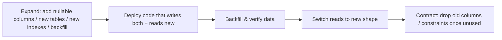

# Database Design

One-line purpose: The DESIGN-ONLY reference for Nizam AIOS's PostgreSQL data model — principles, ERD, entities, relationships, indexing, constraints, audit/event-sourcing, soft delete, tenant isolation, and migration strategy.

> Status: Approved (Phase 1) | Version: 1.0.0 | Last updated: 2026-07-01 | Owner: Architecture (Nizam Core)

---

> **Scope note:** This document presents the **data design only** — tables, columns, relationships, ERD, and constraints described narratively and in tables. SQL snippets appear solely to illustrate design intent and are explicitly marked **"illustrative — design only"**. This is **not** a runnable product schema; no executable DDL / `.sql` product schema is delivered in Phase 1. Physical implementation is a later phase governed by the migration strategy in §12.

---

## 1. Design Principles

| Principle | Rule | Rationale |
|-----------|------|-----------|
| **UUID v7 primary keys** | Every table's PK is `id UUID` generated as **UUID v7** (time-sortable) | Globally unique, non-guessable, index-friendly (near-sequential ⇒ low B-tree fragmentation), safe to expose vs. serial IDs (§11) |
| **`tenant_id` everywhere** | Every tenant-scoped table has `tenant_id UUID NOT NULL`, leading column of composite indexes/uniques | Enables RLS + tenant pruning (see `09-Multi-Tenant.md`) |
| **snake_case** | All DB identifiers snake_case (camelCase in TS, mapped by the ORM) | Canon §3 naming |
| **Soft delete** | `deleted_at TIMESTAMPTZ NULL`; rows are hidden, not physically removed, by default | Reversibility, audit, referential safety (§10) |
| **Audit columns** | Every table: `created_at, updated_at, created_by, updated_by` | Traceability (§9) |
| **Optimistic concurrency** | `version INT NOT NULL DEFAULT 0` where concurrent edits are possible | Lost-update prevention without long locks |
| **Timestamps** | `TIMESTAMPTZ`, UTC | Correctness across regions/residency |
| **Explicit DTO mapping** | No `SELECT *` in app; columns are explicit | Avoids over-exposure (see `10-Security-Strategy.md`) |
| **Immutability for facts** | Event/audit tables are append-only | Non-repudiation (§9) |

Standard column set present on tenant-scoped mutable tables:

| Column | Type | Notes |
|--------|------|-------|
| `id` | `UUID` | PK, UUID v7 |
| `tenant_id` | `UUID NOT NULL` | Tenant scope; RLS + indexes |
| `created_at` | `TIMESTAMPTZ NOT NULL` | Set on insert |
| `updated_at` | `TIMESTAMPTZ NOT NULL` | Set on update |
| `created_by` | `UUID NULL` | User/actor id (nullable for system) |
| `updated_by` | `UUID NULL` | Last modifier |
| `deleted_at` | `TIMESTAMPTZ NULL` | Soft delete marker |
| `version` | `INT NOT NULL DEFAULT 0` | Optimistic concurrency (where applicable) |

---

## 2. Global ERD (Core Entities Across Contexts)

```mermaid
erDiagram
    TENANT ||--o{ USER : has
    TENANT ||--o{ ROLE : defines
    TENANT ||--o{ AGENT_DEFINITION : owns
    TENANT ||--o{ TOOL_DEFINITION : registers
    TENANT ||--o{ WORKFLOW_DEFINITION : owns
    TENANT ||--o{ INTEGRATION : configures
    TENANT ||--o{ SUBSCRIPTION : holds
    TENANT ||--o{ USAGE_RECORD : accrues
    TENANT ||--o{ NOTIFICATION : receives
    TENANT ||--o{ AUDIT_LOG : records
    TENANT ||--o{ OUTBOX_EVENT : emits
    TENANT ||--o{ EVENT_STORE : sources

    ROLE ||--o{ ROLE_PERMISSION : grants
    PERMISSION ||--o{ ROLE_PERMISSION : in
    USER ||--o{ USER_ROLE : assigned
    ROLE ||--o{ USER_ROLE : to

    AGENT_DEFINITION ||--o{ AGENT_RUN : instantiates
    AGENT_RUN ||--o{ AGENT_RUN_STEP : contains
    AGENT_RUN_STEP ||--o{ TOOL_EXECUTION : triggers
    TOOL_DEFINITION ||--o{ TOOL_EXECUTION : executed_as

    WORKFLOW_DEFINITION ||--o{ AUTOMATION_RUN : executes
    TOOL_EXECUTION ||--o{ AUTOMATION_RUN : may_delegate

    INTEGRATION ||--o{ CREDENTIAL : uses
    INTEGRATION ||--o{ AUTOMATION_RUN : targets

    PLAN ||--o{ SUBSCRIPTION : sold_as
    SUBSCRIPTION ||--o{ USAGE_RECORD : meters

    USER ||--o{ NOTIFICATION : addressed_to

    TENANT {
        uuid id PK
        text name
        text status
        text tier
        text region
    }
    USER {
        uuid id PK
        uuid tenant_id FK
        text email_normalized
        text status
    }
    ROLE {
        uuid id PK
        uuid tenant_id FK
        text name
    }
    PERMISSION {
        uuid id PK
        text scope_key
    }
    ROLE_PERMISSION {
        uuid id PK
        uuid tenant_id FK
        uuid role_id FK
        uuid permission_id FK
    }
    USER_ROLE {
        uuid id PK
        uuid tenant_id FK
        uuid user_id FK
        uuid role_id FK
    }
    AGENT_DEFINITION {
        uuid id PK
        uuid tenant_id FK
        text name
        text version
    }
    AGENT_RUN {
        uuid id PK
        uuid tenant_id FK
        uuid agent_definition_id FK
        text status
    }
    AGENT_RUN_STEP {
        uuid id PK
        uuid tenant_id FK
        uuid agent_run_id FK
        int step_no
    }
    TOOL_DEFINITION {
        uuid id PK
        uuid tenant_id FK
        text name
        jsonb input_schema
    }
    TOOL_EXECUTION {
        uuid id PK
        uuid tenant_id FK
        uuid tool_definition_id FK
        uuid agent_run_step_id FK
        text status
    }
    WORKFLOW_DEFINITION {
        uuid id PK
        uuid tenant_id FK
        text name
    }
    AUTOMATION_RUN {
        uuid id PK
        uuid tenant_id FK
        uuid workflow_definition_id FK
        text status
    }
    INTEGRATION {
        uuid id PK
        uuid tenant_id FK
        text provider
        text status
    }
    CREDENTIAL {
        uuid id PK
        uuid tenant_id FK
        uuid integration_id FK
        text secret_ref
    }
    PLAN {
        uuid id PK
        text code
        jsonb quotas
    }
    SUBSCRIPTION {
        uuid id PK
        uuid tenant_id FK
        uuid plan_id FK
        text status
    }
    USAGE_RECORD {
        uuid id PK
        uuid tenant_id FK
        uuid subscription_id FK
        text meter
        numeric quantity
    }
    NOTIFICATION {
        uuid id PK
        uuid tenant_id FK
        uuid user_id FK
        text channel
    }
    AUDIT_LOG {
        uuid id PK
        uuid tenant_id FK
        text action
        timestamptz occurred_at
    }
    OUTBOX_EVENT {
        uuid id PK
        uuid tenant_id FK
        text event_type
        text status
    }
    EVENT_STORE {
        uuid id PK
        uuid tenant_id FK
        text aggregate_type
        uuid aggregate_id
        bigint sequence_no
    }
```

---

## 3. Key Entities — Columns & Constraints

Standard audit/soft-delete/version columns (§1) are implied on tenant-scoped mutable tables and omitted below for brevity except where noteworthy. `PLAN` and `PERMISSION` are **platform-global** (no `tenant_id`).

### 3.1 Tenant (Administration / IAM)

Purpose: the root aggregate; represents a customer organization and its isolation placement.

| Column | Type | Notes |
|--------|------|-------|
| `id` | `UUID` PK | UUID v7 |
| `name` | `TEXT NOT NULL` | Display name |
| `slug` | `TEXT NOT NULL` | Human handle; `UNIQUE (slug)` (global) |
| `status` | `TEXT NOT NULL` | `provisioning|active|suspended|offboarding|purged` |
| `tier` | `TEXT NOT NULL` | `pool|bridge|silo` (see `09-Multi-Tenant.md`) |
| `region` | `TEXT NULL` | Residency region for Bridge/Silo |
| `placement_ref` | `TEXT NULL` | Connection/schema/database routing key |

Constraints: `CHECK (status IN (...))`, `CHECK (tier IN ('pool','bridge','silo'))`, `UNIQUE (slug)`.

### 3.2 User (IAM)

| Column | Type | Notes |
|--------|------|-------|
| `id` | `UUID` PK | |
| `tenant_id` | `UUID NOT NULL` | |
| `email_normalized` | `TEXT NOT NULL` | Lower-cased/normalized |
| `display_name` | `TEXT NULL` | |
| `status` | `TEXT NOT NULL` | `active|invited|disabled` |
| `mfa_enabled` | `BOOLEAN NOT NULL DEFAULT false` | |

Constraints: `UNIQUE (tenant_id, email_normalized)` **partial** `WHERE deleted_at IS NULL`; FK `tenant_id → tenant(id)`.

### 3.3 Role / Permission / RolePermission / UserRole (IAM — RBAC)

| Entity | Key columns | Constraints |
|--------|-------------|-------------|
| `role` | `id`, `tenant_id`, `name`, `is_system BOOLEAN` | `UNIQUE (tenant_id, name)` partial `WHERE deleted_at IS NULL` |
| `permission` *(global)* | `id`, `scope_key` (e.g. `tool:email.send`), `description` | `UNIQUE (scope_key)` |
| `role_permission` | `id`, `tenant_id`, `role_id`, `permission_id` | `UNIQUE (tenant_id, role_id, permission_id)`; FKs to `role`, `permission` |
| `user_role` | `id`, `tenant_id`, `user_id`, `role_id` | `UNIQUE (tenant_id, user_id, role_id)`; FKs to `user`, `role` |

Rationale: scopes live in `permission.scope_key` and drive tool/agent authorization (see `10-Security-Strategy.md` §4).

### 3.4 AgentDefinition (Agents)

| Column | Type | Notes |
|--------|------|-------|
| `id` | `UUID` PK | |
| `tenant_id` | `UUID NOT NULL` | |
| `name` | `TEXT NOT NULL` | |
| `version` | `TEXT NOT NULL` | SemVer manifest version |
| `manifest` | `JSONB NOT NULL` | Skills, guardrails, budgets |
| `required_scopes` | `TEXT[] NOT NULL` | Capability scopes needed |
| `status` | `TEXT NOT NULL` | `draft|active|retired` |

Constraints: `UNIQUE (tenant_id, name, version)` partial `WHERE deleted_at IS NULL`; FK `tenant_id`.

### 3.5 AgentRun (Agents — event-sourced aggregate)

| Column | Type | Notes |
|--------|------|-------|
| `id` | `UUID` PK | |
| `tenant_id` | `UUID NOT NULL` | |
| `agent_definition_id` | `UUID NOT NULL` | |
| `intent_ref` | `UUID NULL` | Originating Bayan intent |
| `status` | `TEXT NOT NULL` | `pending|running|awaiting_approval|succeeded|failed|compensated` |
| `correlation_id` | `UUID NOT NULL` | Trace chain |
| `started_at` / `finished_at` | `TIMESTAMPTZ NULL` | |
| `version` | `INT` | Optimistic concurrency |

Constraints: composite FK `(tenant_id, agent_definition_id) → agent_definition(tenant_id, id)` (same-tenant guarantee); `CHECK (status IN (...))`.

### 3.6 AgentRunStep (Agents)

| Column | Type | Notes |
|--------|------|-------|
| `id`, `tenant_id` | | |
| `agent_run_id` | `UUID NOT NULL` | Parent run |
| `step_no` | `INT NOT NULL` | Ordered within run |
| `kind` | `TEXT NOT NULL` | `plan|tool_call|approval|observation` |
| `status` | `TEXT NOT NULL` | |
| `input` / `output` | `JSONB NULL` | Redacted per classification |

Constraints: `UNIQUE (tenant_id, agent_run_id, step_no)`; composite FK to `agent_run`.

### 3.7 ToolDefinition (Tools)

| Column | Type | Notes |
|--------|------|-------|
| `id`, `tenant_id` | | |
| `name`, `version` | `TEXT NOT NULL` | SemVer |
| `input_schema` / `output_schema` | `JSONB NOT NULL` | JSON Schema |
| `required_scopes` | `TEXT[] NOT NULL` | Authorization scopes |
| `delegates_to_automation` | `BOOLEAN NOT NULL DEFAULT false` | Direct adapter vs. Automation Engine |

Constraints: `UNIQUE (tenant_id, name, version)` partial `WHERE deleted_at IS NULL`.

### 3.8 ToolExecution (Tools — event-sourced)

| Column | Type | Notes |
|--------|------|-------|
| `id`, `tenant_id` | | |
| `tool_definition_id` | `UUID NOT NULL` | |
| `agent_run_step_id` | `UUID NULL` | Origin step (nullable for direct calls) |
| `status` | `TEXT NOT NULL` | `pending|running|succeeded|failed` |
| `idempotency_key` | `TEXT NOT NULL` | Dedupe side effects |
| `args` / `result` | `JSONB NULL` | Redacted |

Constraints: `UNIQUE (tenant_id, idempotency_key)`; composite FK to `tool_definition`.

### 3.9 WorkflowDefinition & AutomationRun (Automation)

| Entity | Key columns | Notes |
|--------|-------------|-------|
| `workflow_definition` | `id`, `tenant_id`, `name`, `version`, `n8n_ref`, `status` | `n8n_ref` = handle to n8n workflow; `UNIQUE (tenant_id, name, version)` partial |
| `automation_run` | `id`, `tenant_id`, `workflow_definition_id`, `tool_execution_id NULL`, `status`, `idempotency_key`, `attempt INT`, `n8n_execution_ref` | `status IN (queued|running|succeeded|failed|compensating|compensated)`; `UNIQUE (tenant_id, idempotency_key)` |

### 3.10 Integration & Credential (Integrations)

| Entity | Key columns | Notes |
|--------|-------------|-------|
| `integration` | `id`, `tenant_id`, `provider`, `status`, `health_checked_at` | `UNIQUE (tenant_id, provider, name)` partial |
| `credential` *(reference only)* | `id`, `tenant_id`, `integration_id`, `secret_ref`, `status`, `rotated_at` | **`secret_ref` points to the secrets manager — no plaintext secret stored** (see `10-Security-Strategy.md` §5) |

### 3.11 Plan / Subscription / UsageRecord (Billing)

| Entity | Key columns | Notes |
|--------|-------------|-------|
| `plan` *(global)* | `id`, `code`, `name`, `quotas JSONB`, `tier_mapping` | `UNIQUE (code)`; `tier_mapping` links plan → Pool/Bridge/Silo |
| `subscription` | `id`, `tenant_id`, `plan_id`, `status`, `current_period_start/end` | FK to `plan`; `UNIQUE (tenant_id)` for active subscription (partial `WHERE status='active'`) |
| `usage_record` | `id`, `tenant_id`, `subscription_id`, `meter`, `quantity NUMERIC`, `window_start/end` | Meters: `agent_run|tool_call|automation_run|llm_tokens`; feeds quota checks (see `09` §7) |

### 3.12 Notification (Notifications)

| Column | Type | Notes |
|--------|------|-------|
| `id`, `tenant_id` | | |
| `user_id` | `UUID NULL` | Recipient |
| `channel` | `TEXT NOT NULL` | `in_app|email|push|webhook` |
| `template_key` | `TEXT NOT NULL` | |
| `status` | `TEXT NOT NULL` | `pending|sent|failed|read` |
| `payload` | `JSONB NULL` | Redacted per classification |

### 3.13 AuditLog (Monitoring/Administration — append-only)

| Column | Type | Notes |
|--------|------|-------|
| `id`, `tenant_id` | | |
| `actor_id` | `UUID NULL` | User/service/agent |
| `action` | `TEXT NOT NULL` | e.g. `tool.execute`, `credential.read` |
| `resource_type` / `resource_id` | `TEXT` / `UUID NULL` | |
| `occurred_at` | `TIMESTAMPTZ NOT NULL` | |
| `metadata` | `JSONB NULL` | Redacted; optional `prev_hash` for tamper-evident chaining |

Constraints: **append-only** (no UPDATE/DELETE by app role); index `(tenant_id, occurred_at DESC)`.

### 3.14 OutboxEvent (Core — Transactional Outbox)

| Column | Type | Notes |
|--------|------|-------|
| `id`, `tenant_id` | | |
| `event_type` | `TEXT NOT NULL` | e.g. `agent_run.succeeded` |
| `aggregate_type` / `aggregate_id` | `TEXT` / `UUID` | |
| `payload` | `JSONB NOT NULL` | AsyncAPI-versioned |
| `status` | `TEXT NOT NULL` | `pending|dispatched|failed` |
| `occurred_at` / `dispatched_at` | `TIMESTAMPTZ` | |

Constraints: written in the **same transaction** as the state change; relay publishes to NATS JetStream; partial index `WHERE status='pending'`.

### 3.15 EventStore (Core — event sourcing for critical aggregates)

| Column | Type | Notes |
|--------|------|-------|
| `id`, `tenant_id` | | |
| `aggregate_type` | `TEXT NOT NULL` | `agent_run|tool_execution|automation_run` |
| `aggregate_id` | `UUID NOT NULL` | |
| `sequence_no` | `BIGINT NOT NULL` | Per-aggregate ordering |
| `event_type` | `TEXT NOT NULL` | |
| `payload` | `JSONB NOT NULL` | |
| `occurred_at` | `TIMESTAMPTZ NOT NULL` | |

Constraints: `UNIQUE (tenant_id, aggregate_type, aggregate_id, sequence_no)` — enforces gap-free, ordered, append-only history (optimistic append).

---

## 4. Relationships & Cardinalities

| Parent | Child | Cardinality | Notes |
|--------|-------|-------------|-------|
| Tenant | User, Role, AgentDefinition, ToolDefinition, WorkflowDefinition, Integration, Subscription, Notification, AuditLog, OutboxEvent, EventStore | 1 → many | Tenant root |
| Role ↔ Permission | RolePermission | many ↔ many | Junction |
| User ↔ Role | UserRole | many ↔ many | Junction |
| AgentDefinition | AgentRun | 1 → many | |
| AgentRun | AgentRunStep | 1 → many | Ordered by `step_no` |
| AgentRunStep | ToolExecution | 1 → many (0..*) | A step may call ≥0 tools |
| ToolDefinition | ToolExecution | 1 → many | |
| ToolExecution | AutomationRun | 1 → 0..1 (opt) | When tool delegates to Automation |
| WorkflowDefinition | AutomationRun | 1 → many | |
| Integration | Credential | 1 → many | Refs only |
| Integration | AutomationRun | 1 → many (target) | |
| Plan | Subscription | 1 → many | |
| Subscription | UsageRecord | 1 → many | Metering |
| User | Notification | 1 → many | |

All cross-entity FKs between tenant-scoped tables are **same-tenant** (composite FK including `tenant_id`, or CHECK/trigger), preventing cross-tenant references (see `09-Multi-Tenant.md`).

---

## 5. Indexing Strategy

| Index type | Design | Purpose |
|------------|--------|---------|
| **Per-tenant composite** | Leading `tenant_id`: e.g. `(tenant_id, created_at DESC)`, `(tenant_id, status)` | Tenant pruning first; matches RLS access pattern |
| **Partial (soft-delete aware)** | `... WHERE deleted_at IS NULL` on hot lookup/unique indexes | Excludes tombstones; keeps live-row queries small |
| **Unique constraints** | Always tenant-scoped + partial: `UNIQUE (tenant_id, <natural key>) WHERE deleted_at IS NULL` | Per-tenant uniqueness; allows re-use of a key after soft delete |
| **Foreign-key support** | Index every FK column set (composite incl. `tenant_id`) | Join & referential-integrity performance |
| **Event/audit ordering** | `(tenant_id, aggregate_type, aggregate_id, sequence_no)`; `(tenant_id, occurred_at DESC)` | Fast replay & audit reads |
| **Outbox dispatch** | Partial `WHERE status='pending'` | Efficient relay polling |
| **pgvector (agent memory)** | Vector column with an ANN index (e.g. HNSW/IVFFlat) on agent memory embeddings, **combined with `tenant_id` filtering** | Tenant-scoped semantic retrieval for agent memory (Agents context) |
| **JSONB** | GIN indexes on queried `JSONB` (schemas, quotas) where needed | Attribute lookups |

> Illustrative — design only:
> ```sql
> -- illustrative — design only
> CREATE UNIQUE INDEX ux_user_email
>   ON "user" (tenant_id, email_normalized)
>   WHERE deleted_at IS NULL;
>
> CREATE INDEX ix_agent_run_tenant_status
>   ON agent_run (tenant_id, status, created_at DESC)
>   WHERE deleted_at IS NULL;
>
> -- agent memory (pgvector), tenant-scoped ANN
> CREATE INDEX ix_agent_memory_embedding
>   ON agent_memory USING hnsw (embedding vector_cosine_ops);
> -- queries always add: WHERE tenant_id = current_setting('app.current_tenant')::uuid
> ```

---

## 6. Constraints (FKs, Unique, Checks)

| Constraint category | Design |
|---------------------|--------|
| **Primary keys** | `id UUID` (v7) on every table |
| **Foreign keys** | Between tenant-scoped tables, composite FKs include `tenant_id` (same-tenant); global FKs (`plan`, `permission`) are simple |
| **Unique** | Tenant-scoped + partial (`WHERE deleted_at IS NULL`); idempotency keys unique per tenant |
| **Check** | Enumerations (`status`, `tier`, `channel`, `meter`) via `CHECK (... IN (...))`; non-negative quantities (`CHECK (quantity >= 0)`); `sequence_no > 0` |
| **Not null** | `tenant_id`, timestamps, and business-required fields |
| **Referential actions** | Generally `ON DELETE RESTRICT`; soft delete is preferred over cascade; purge (hard delete) is an operational, ordered process (see `09` §5) |

---

## 7. UUID v7 Strategy

- **Why v7:** UUID v7 encodes a Unix-millisecond timestamp in its high bits, making values **time-sortable** while remaining globally unique and unpredictable. This yields near-sequential inserts (low index bloat / fewer page splits vs. random v4), natural chronological ordering for time-series-like tables (runs, events, audit), and safe external exposure vs. guessable serials.
- **Generation:** IDs generated in the application (Core kernel ID service) so the domain can assign identity before persistence (DDD) and remain DB-agnostic (port/adapter). PKs are `UUID`.
- **Consistency:** All PKs and FK references use `UUID`; no mixed int/uuid keys.

---

## 8. Tenant Isolation at the Data Layer

Summary (full detail in `09-Multi-Tenant.md`):

- Every tenant-scoped table has `tenant_id UUID NOT NULL`.
- **RLS enabled AND forced** on every tenant-scoped table; policies for SELECT/INSERT/UPDATE/DELETE keyed on `tenant_id = current_setting('app.current_tenant')::uuid` (`USING` + `WITH CHECK`).
- App connects as a **non-owner, non-BYPASSRLS** role.
- **`tenant_id` participates in every composite index and every unique constraint.**
- Missing tenant context ⇒ **fail closed** (zero rows / error).
- CI **tenant-isolation gate** rejects any new tenant-scoped table lacking `tenant_id`, RLS policies, and tenant-scoped indexes.

---

## 9. Audit Strategy

Three complementary layers:

1. **Audit columns** — `created_at/updated_at/created_by/updated_by` on every mutable table (the "who/when" of the current state).
2. **`audit_log`** — append-only, tenant-scoped record of security-/business-relevant actions (authz decisions, tool executions, credential access, admin/impersonation, lifecycle). Optional `prev_hash` chaining for tamper evidence. No UPDATE/DELETE by app role.
3. **Event sourcing** (`event_store`) for **critical aggregates** — AgentRun, ToolExecution, AutomationRun — giving a gap-free, replayable, ordered history per aggregate (`UNIQUE (tenant_id, aggregate_type, aggregate_id, sequence_no)`).
4. **Transactional Outbox** (`outbox_event`) — domain/integration events written in the same transaction as state changes, then relayed to NATS JetStream, guaranteeing no lost or ghost events.

This satisfies non-repudiation and forensic reconstruction (see `10-Security-Strategy.md` §11).

---

## 10. Soft Delete Strategy

- **Marker:** `deleted_at TIMESTAMPTZ NULL`; `NULL` = live, non-null = deleted-at timestamp.
- **Default read exclusion:** repositories filter `deleted_at IS NULL`; **partial indexes** back these queries and keep hot indexes free of tombstones.
- **Uniqueness interplay:** unique constraints are partial `WHERE deleted_at IS NULL`, so a natural key can be reused after a soft delete without collision.
- **RLS interplay (orthogonal):** RLS gates *tenant* visibility; soft delete gates *live-row* visibility. RLS is **not** overloaded with `deleted_at`, keeping security policies simple/auditable (see `09` §4.3).
- **Hard delete:** reserved for offboarding/purge (retention-driven, ordered, audited) — see `09` §5.

---

## 11. Design Rationale Notes

- **JSONB for schemas/manifests/payloads** keeps plugin contracts (tool/agent manifests, event payloads) flexible and versionable without schema churn, while relational columns hold queryable/constrained facts.
- **Reference-only credentials** ensure secrets never live in the primary DB.
- **Global vs. tenant-scoped tables** are explicitly enumerated (`plan`, `permission`) so the tenant-isolation gate can whitelist them.

---

## 12. Migration Strategy (Expand / Contract)

Zero-downtime evolution using the **expand/contract** (parallel-change) pattern, aligned with SemVer + CI gates.



| Rule | Design |
|------|--------|
| **Additive first** | New columns nullable or defaulted; new tables/indexes added before code depends on them |
| **Backwards compatible** | Old and new code coexist during rollout; no destructive change in the same release as the code needing it |
| **Backfill separately** | Data backfills run as controlled, resumable jobs (batched, tenant-aware) |
| **Concurrent index builds** | Indexes created without long locks; validated before use |
| **Contract last** | Drops/renames happen only after all consumers migrated, in a later release |
| **RLS preserved** | Every migration adding a tenant-scoped table also adds `tenant_id`, RLS policies, and tenant-scoped indexes (enforced by CI gate) |
| **Versioned & reversible** | Migrations versioned, ordered, and reversible where feasible; tested in CI (see `09` §10) |
| **Residency-aware** | Silo/region-pinned tenants migrate within their placement |

---

## Related Documents

- `09-Multi-Tenant.md` — RLS, `tenant_id`, tiers, isolation testing.
- `10-Security-Strategy.md` — Encryption, audit/non-repudiation, secret references.
- `00-Vision.md` — Product vision.
- Architecture docs — Bounded contexts owning these entities.
- `19-Assumptions.md` — Recorded assumptions and gaps.
- `20-Project-State.md` — Phase 1 status.

## Change Log

| Version | Date | Author | Change |
|---------|------|--------|--------|
| 1.0.0 | 2026-07-01 | Architecture (Nizam Core) | Initial approved Phase 1 database design (design-only). |
