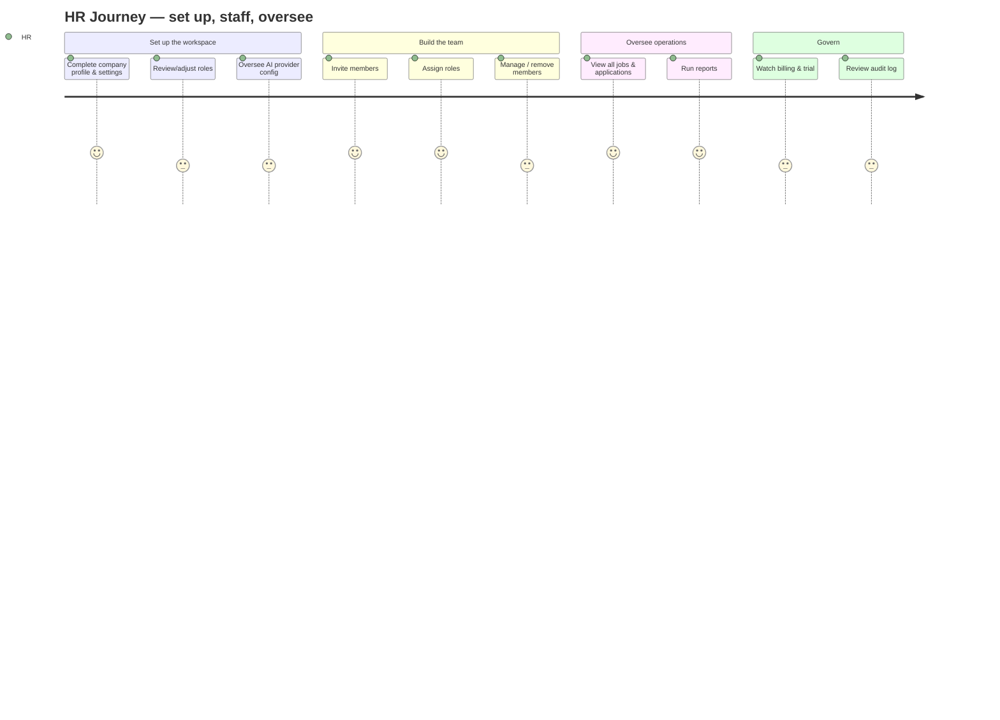
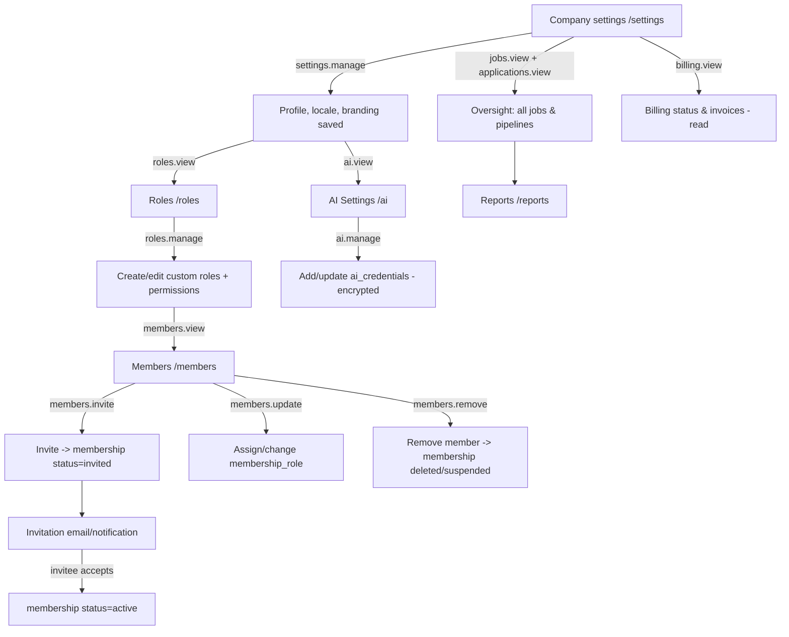

# 21 — HR Journey (رحلة مدير الموارد البشرية)

End-to-end experience of a **user acting in the HR Manager role**: setting up the company workspace, managing the team and roles, inviting members, overseeing all jobs and applications, running reports, configuring company settings, overseeing AI configuration, and watching billing — the administrative and oversight layer of one tenant.

> **Personas are roles, not tables.** An "HR Manager" is a `users` row whose active `membership` carries the `hr-manager` role. The role is a bundle of permissions on the company; it is not a separate user type or table (§2, §6).

## Related Documents

- [24 — Job Lifecycle](24-Job-Lifecycle.md) — the jobs HR oversees across all recruiters.
- [12 — Company Management](12-Company-Management.md) — company profile, settings, ownership.
- [11 — Permissions Matrix](11-Permissions-Matrix.md) — the `members.*`, `roles.*`, `settings.*` permissions.
- [07 — RBAC](07-RBAC.md) — roles, inheritance, and how HR edits them.
- [13 — Subscription System](13-Subscription-System.md) — plan/trial state HR can view.
- [16 — AI Architecture](16-AI-Architecture.md) — the per-tenant AI layer HR oversees.
- [20 — Recruiter Journey](20-Recruiter-Journey.md) — the operators HR supervises.
- [22 — SuperAdmin Journey](22-SuperAdmin-Journey.md) — the platform layer above HR.
- [38 — Audit System](38-Audit-System.md) — the activity log HR reviews for oversight.

---

## Purpose (الهدف)

This document specifies the HR Manager's full administrative journey: how they shape the workspace (settings, roles, AI), bring in and manage people (members & invitations), oversee the recruitment pipeline company-wide, and consume reporting and billing visibility — every screen, rule, validation and permission involved.

## Why It Exists (سبب وجوده)

The HR Manager is the **tenant administrator for the people and process**, distinct from both the operational recruiter (§20) and the platform Super Admin (§22). The journey is needed because:

1. **Someone must own company configuration** — roles, members, settings, and AI oversight — without holding ownership/billing-change power that belongs to the Owner. HR sits between Member and Owner in authority.
2. **Oversight requires breadth, not depth-of-action.** HR needs to *see* all jobs/applications/reports across recruiters, but doesn't necessarily run each pipeline. The journey separates oversight (`*.view`) from operation.
3. **Team management is high-risk.** Inviting, role-assigning, and removing members touches access control directly; the journey defines the guardrails (system-role protection, owner protection, self-removal rules).
4. **AI and settings governance.** Per §9 each tenant configures its own AI; HR is the natural overseer of that configuration and of company-wide settings, while billing changes stay with the Owner.

## Architecture

HR works in the authenticated staff shell (`resources/views/layouts/app.php`); the nav registry shows Members, Roles, AI Settings, Billing, and Company Settings once those built flags are true and the user holds the gating permission (§2, no dead links).

| Concern | Component | Notes |
|---|---|---|
| Company profile/settings | `App\Controllers\App\CompanyController` (+ settings, planned) | `company.*`, `settings.*`. |
| Members & invitations | `App\Controllers\App\MemberController` (planned) | `members.*`; manages `memberships` + `membership_role`. |
| Roles & permissions | `App\Controllers\App\RoleController` (planned) | `roles.*`; edits `roles`/`permission_role` (data-driven, §6). |
| Oversight of jobs/apps | reuses `Job`/`Application` models (read) | `jobs.view`, `applications.view` across the tenant. |
| Reports | `App\Controllers\App\ReportController` (planned) | Aggregates over recruitment + activity data. |
| AI oversight | `App\Services\AI\AiProviderManager` + `ai_credentials` | `ai.view`/`ai.manage`. |
| Billing visibility | reads `subscriptions`/`invoices` | `billing.view` (not `billing.manage` by default). |
| Audit | `ActivityLog` model (§38) | HR reviews actor/subject/ip history. |

Architectural decisions:

- **HR is a tenant role, fully data-driven** in `config/rbac.php`. Its permission set is editable per company; nothing in code says "if HR." Effective permissions resolve through `AccessControl` (§6).
- **Oversight reads are tenant-scoped automatically** — `Job`/`Application` models add `WHERE company_id` and fail closed (§4). HR sees *all* of its company's recruitment data and *none* of any other company's.
- **Role editing respects system flags.** `roles.is_system` (Owner, Admin, Member, and the recruitment system roles) cannot be deleted; HR can create/edit custom roles and assign permissions from the catalogue (§6).
- **Billing is view-by-default for HR.** `billing.manage` (changing plans, ownership) stays with the Owner; HR sees status/invoices so they can flag issues without being able to alter the subscription.

## Workflow

Detailed flow with screens and permissions:

**Screens / pages involved**

| Step | Page | Permission |
|---|---|---|
| Company settings | `/settings`, `/company` | `settings.view`/`settings.manage`, `company.view`/`company.update` |
| Roles | `/roles`, `/roles/{id}/edit` | `roles.view` / `roles.manage` |
| Members | `/members` | `members.view` |
| Invite member | `/members/invite` | `members.invite` |
| Edit member role | `/members/{id}/edit` | `members.update` |
| Remove member | action on `/members/{id}` | `members.remove` |
| AI settings | `/ai` | `ai.view` / `ai.manage` |
| Oversight | `/jobs`, `/applications` | `jobs.view`, `applications.view` |
| Reports | `/reports` | `reports.view` (planned) / derived from `dashboard.view` + module perms |
| Billing | `/billing` | `billing.view` |

**Onboarding for the HR Manager role.** HR (often the second person after the Owner) gets an `onboarding_progress` flow (`flow='hr-manager'`, company-scoped): (1) complete company profile (name, logo, locale, timezone); (2) configure at least one AI provider or acknowledge human-interview fallback (§9); (3) invite the first recruiters/hiring managers and assign roles; (4) review the role catalogue. Steps deep-link to the relevant screens; the flow is resumable and reflected on the dashboard until `is_completed`.

## Business Rules

1. HR can view and edit **company profile and settings** (`company.update`, `settings.manage`) but cannot change the subscription plan or transfer ownership (those require `billing.manage` / owner).
2. **Invitations** create a `memberships` row with `status='invited'`, `invited_by`, `invited_at`; acceptance flips it to `active` and sets `joined_at`. A pending invite to an existing platform user links to their account; a brand-new email provisions a user on acceptance (§7).
3. **Role assignment** attaches `membership_role` rows; a member may hold multiple roles, and effective permissions are the union expanded up `parent_id` (§6).
4. **System roles** (`is_system=1`: owner, admin, member, and recruitment system roles) cannot be deleted or have their slug changed; HR may create custom roles and assign any permission from the catalogue.
5. HR **cannot remove or demote the Owner**, and cannot remove themselves if doing so would leave the company without an Owner (owner protection).
6. HR has **company-wide oversight**: it can view every job and application in the tenant regardless of which recruiter created them, but performing pipeline actions still requires the corresponding `applications.*`/`interviews.*` permissions.
7. **AI oversight**: HR can add/update `ai_credentials` (encrypted, one row per provider, §9); switching the default provider affects all subsequent AI interviews. HR never sees plaintext stored keys after save.
8. **Billing visibility**: HR sees subscription status, trial end, and invoices read-only; changing plans is escalated to the Owner.
9. All HR administrative actions (invite, role change, removal, settings change, AI credential change) are written to `activity_log` for audit (§38).
10. Everything HR does is **scoped to the active company**; switching companies (topbar) changes the entire administrative context.

## Database Relations

Consistent with §11:

- **companies** (GLOBAL/tenant root) — `name`, `slug`, `owner_id`, `logo`, `locale`, `timezone`, `status[trial|active|suspended|canceled]`, `settings JSON`. HR edits profile fields; cannot change `owner_id`.
- **memberships** (tenant) — `company_id`, `user_id`, `status[active|invited|suspended]`, `title`, `invited_by`→users, `invited_at`, `joined_at`. `UQ(company_id, user_id)`, `IDX(user_id, status)`.
- **roles** (tenant) — `company_id`, `parent_id`, `name`, `slug`, `description`, `is_system`, `priority`. `UQ(company_id, slug)`, `IDX(parent_id)`.
- **permissions** (GLOBAL) + **permission_role** — the catalogue and role grants HR edits via the role editor.
- **membership_role** — links members to roles (HR assigns).
- **settings** (tenant) — `key`/`value` per company; HR manages.
- **ai_credentials** (tenant) — `provider`, `label`, `credentials` (encrypted), `meta`, `is_active`, `is_default`. `UQ(company_id, provider)`.
- **subscriptions** (tenant) — read for billing visibility; `status`, `trial_ends_at`, `plan_id`.
- **invoices** (tenant) — read-only list for HR; `number`, `status`, `total`, `due_at`, `paid_at`.
- **jobs** / **applications** / **interviews** / **evaluations** (tenant) — read for oversight; actions need module permissions.
- **onboarding_progress** — HR onboarding (`flow='hr-manager'`).
- **activity_log** — HR reviews; every HR action recorded with actor/subject/ip.

## Permissions

Gated primarily by `members.*`, `roles.*`, `settings.*`, plus oversight read permissions (§6, §11):

| Capability | Permission |
|---|---|
| View members | `members.view` |
| Invite members | `members.invite` |
| Edit member roles/details | `members.update` |
| Remove members | `members.remove` |
| View roles | `roles.view` |
| Create/edit/delete custom roles | `roles.manage` |
| View company | `company.view` |
| Edit company profile | `company.update` |
| View settings | `settings.view` |
| Manage settings | `settings.manage` |
| View AI providers | `ai.view` |
| Manage AI providers | `ai.manage` |
| View billing/invoices | `billing.view` |
| Oversee jobs | `jobs.view` |
| Oversee applications | `applications.view` |

The default `hr-manager` tenant role (data-driven in `config/rbac.php`) maps to all of the above: `dashboard.view`, `company.view/update`, `members.view/invite/update/remove`, `roles.view/manage`, `settings.view/manage`, `ai.view/manage`, `billing.view`, plus oversight `jobs.view`/`applications.view` and `notifications.view`. It deliberately **excludes** `billing.manage` and ownership transfer (Owner-only). Policy gates (`AccessControl::define`) protect the Owner from removal/demotion and prevent self-lockout. Super admins bypass checks but operate via the platform path (§22).

## Validation

- **Company profile**: `name required|min:2|max:150`; `locale in:en,ar`; `timezone` valid IANA zone; `logo nullable|image|max:2MB`; `slug` unique per platform (auto-managed).
- **Invitation**: `email required|email|max:190`; `role_id exists:roles,id` and the role must belong to this company; cannot invite an already-active member (caught by `UQ(company_id, user_id)`).
- **Role create/edit**: `name required|min:2|max:80`; `slug` unique per company; `permissions[]` each `exists:permissions,key`; cannot edit `is_system` slug; `parent_id` must be a role in the same company and must not create a cycle.
- **AI credential**: `provider in:openai,anthropic,gemini,deepseek,azure,heygen`; `credentials` validated by the provider adapter before save; stored encrypted (AES-256-GCM, §9); `UQ(company_id, provider)`.
- **Settings**: per-key validation against the settings schema.
- CSRF on all writes; server-side validation authoritative.

## Edge Cases

- **Inviting an existing user** — links the invite to their account; on accept, a membership is created without duplicating the user.
- **Removing the last admin / the Owner** — blocked with a clear message; owner protection prevents leaving the company headless.
- **Self-removal / self-demotion** — HR cannot strip its own last administrative role if it would orphan the company; otherwise allowed with confirmation.
- **Deleting a role still assigned to members** — blocked (or requires reassignment first); system roles never deletable.
- **Role inheritance cycle** — validation rejects `parent_id` that would create a loop.
- **AI credential invalid/expired** — save is rejected by the adapter's validation; existing interviews relying on it surface a fallback to human interviews (§9), and HR is alerted.
- **Trial expiry** — HR sees the trial countdown and a banner; only the Owner can convert/upgrade (escalation path shown).
- **Permission change mid-session** — effective permissions recompute per request (cache is per-request, §6); a just-revoked capability 403s on next action.
- **Company suspended by platform** (§22) — HR retains read access to data per policy but write actions are blocked; a suspension notice is shown.

## Security

- **Tenant isolation**: all HR data access is tenant-scoped and fails closed; HR cannot read or modify another company's members/roles/settings/AI even by id (model-layer `WHERE company_id` + `abort(403)`).
- **Privilege boundaries**: HR holds administrative-but-not-ownership power; `billing.manage` and ownership transfer are withheld so a compromised HR account cannot change the plan or seize ownership.
- **System-role protection**: `is_system` roles cannot be deleted/renamed; the role editor only offers catalogue permissions (no arbitrary strings), preventing privilege injection.
- **AI key confidentiality**: credentials encrypted at rest (AES-256-GCM); never returned in plaintext after save; decrypted only server-side at call time (§9).
- **CSRF** on invites, role edits, removals, settings, AI changes.
- **Audit**: every administrative mutation logged to `activity_log` with actor, subject, ip — supporting insider-threat detection and compliance (§38).
- **Anti-lockout**: owner/last-admin protection prevents accidental or malicious removal of the only privileged account.
- **Input escaping** (`e()`) on all rendered company/member-supplied text.

## Performance

- Member lists read by `IDX(user_id, status)` / `UQ(company_id, user_id)` with pagination; roles joined once to avoid N+1 on the members table.
- Role editor loads the permission catalogue (`permissions`, indexed by `group`) once; grant toggles diff against `permission_role`.
- Oversight dashboards aggregate `applications`/`jobs` by their composite indexes; heavy reports run on the queue (`queued_jobs`, §12) and cache results where safe.
- AI credential reads are infrequent and cached per request; encryption/decryption is on-demand only.
- Activity-log views paginate by `IDX(company_id, user_id, action)`.

## Testing

- **Unit**: owner-protection gate blocks removing/demoting the Owner and last admin; system-role deletion blocked; inheritance-cycle validation; HR has `billing.view` but not `billing.manage`.
- **Feature**: invite → invited membership + notification → accept → active; role create with catalogue permissions reflects in effective permissions; settings/company update persists; AI credential add stores encrypted and never returns plaintext; oversight lists show all tenant jobs/applications.
- **Security**: HR at Company A gets 403 on Company B's members/roles/settings; HR cannot hit `billing.manage` routes; CSRF rejected; AI credentials never appear in responses or logs; suspended-company writes blocked.
- **Edge**: deleting an assigned role blocked; self-lockout prevented; trial-expiry banner and Owner-only upgrade path.

## Future Expansion

- **Org structure**: departments/teams and team-scoped roles for larger companies.
- **Delegated billing**: an optional `billing.manage` grant to a finance role without full ownership.
- **Advanced reporting**: configurable dashboards, exports, DEI metrics, hiring SLAs.
- **Policy templates**: pre-built role bundles per industry, seeded as data (§6).
- **Approval workflows**: requisition approvals before a job can be published.
- **SSO / SCIM provisioning** for enterprise member lifecycle.
- **Granular AI governance**: per-job provider/model selection, usage budgets and `tokens_used` reporting (§9).
- **Audit exports & alerts** integrated with the audit system (§38).

## Open Questions

- Should `hr-manager` ever include `billing.manage`, or remain strictly view-only with a delegated finance role? Current default: view-only, escalate to Owner.
- Granularity of **oversight without action**: do we need a dedicated read-only `applications.view`-style "auditor" preset distinct from HR? Likely a custom role using existing catalogue permissions.
- How **member removal** interacts with that member's authored data (jobs created, scorecards) — keep records with `created_by`/`evaluator_id` set NULL (current FK policy) vs. reassign; leaning on SET NULL to preserve history (§11).
