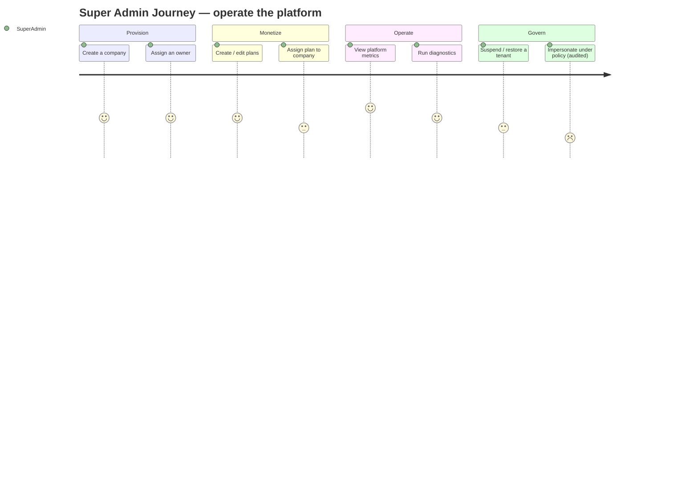
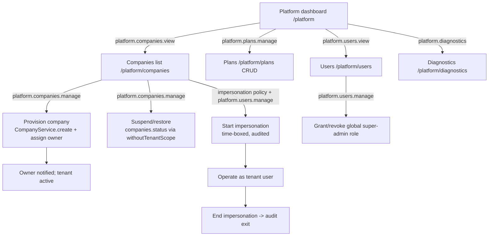

# 22 — Super Admin Journey (رحلة مدير المنصّة)

End-to-end experience of a **user acting in the platform Super Admin role**: provisioning and suspending companies, assigning owners, managing plans, viewing platform-wide metrics, running diagnostics, exercising a controlled impersonation policy, and performing cross-tenant operations only through the one explicit, audited system path — with tenant-isolation safeguards that apply *even to super admins*.

> **Personas are roles, not tables.** A "Super Admin" is a `users` row that holds the **global** `super-admin` role (a `roles` row with `company_id = NULL`, assigned via `user_role`). There is no super-admin table or `type` column; the capability is purely a global role grant (§2, §6).

## Related Documents

- [33 — System Diagnostics](33-System-Diagnostics.md) — health checks and environment reports the Super Admin runs.
- [12 — Company Management](12-Company-Management.md) — company provisioning/lifecycle the Super Admin drives platform-wide.
- [13 — Subscription System](13-Subscription-System.md) — plans the Super Admin manages.
- [11 — Permissions Matrix](11-Permissions-Matrix.md) — the `platform.*` permissions.
- [08 — Multi-Tenant](08-Multi-Tenant.md) — the isolation model and the `withoutTenantScope()` escape hatch.
- [07 — RBAC](07-RBAC.md) — global vs. tenant roles and super-admin bypass.
- [38 — Audit System](38-Audit-System.md) — the audit trail that makes cross-tenant access accountable.
- [34 — Security](34-Security.md) — platform-wide threat model and safeguards.

---

## Purpose (الهدف)

This document specifies the Super Admin's platform-operations journey and the **safeguards that constrain it**: what platform staff can do (provision/suspend tenants, assign owners, manage plans, see metrics, diagnose, impersonate under policy), exactly which path crosses tenant boundaries, how every such action is audited, and where even an all-powerful role must still be deliberate rather than implicit.

## Why It Exists (سبب وجوده)

A multi-tenant SaaS sold to thousands of companies needs platform operators, but an unconstrained "god mode" is the single largest insider-threat and privacy risk. This journey exists to:

1. **Make platform power explicit and auditable.** Super admins bypass tenant scoping by design (§6); that power must therefore be funneled through one named, logged code path (`withoutTenantScope()`), never sprinkled implicitly through controllers.
2. **Protect tenant privacy even from staff.** Customers trust HalaOps with candidate PII and hiring decisions. The journey defines *when* a super admin may touch tenant data (operational necessity, impersonation under policy) and *how* it is recorded.
3. **Separate platform operations from tenant operations.** A super admin running platform-wide (no active tenant) sees a platform dashboard, not a company's pipeline; the boundary is structural.
4. **Keep the one-users-table invariant.** Even the most privileged actor is "just a user with a global role," proving the RBAC design end to end (§2).

## Architecture

The Super Admin uses a **platform-operations surface** distinct from any tenant. When a super admin has no active company, the dashboard controller already renders the platform overview (`resources/views/app/dashboard-platform.php`) instead of a tenant dashboard.

| Concern | Component | Notes |
|---|---|---|
| Platform dashboard | `App\Controllers\App\DashboardController` (platform branch) | Counts of companies/users/plans, recent companies (existing). |
| Company provisioning | `App\Controllers\Platform\CompanyAdminController` (planned) + `CompanyService` | Reuses atomic `CompanyService::create()`; can assign any user as owner. |
| Suspend/restore tenant | `CompanyAdminController` (planned) | Flips `companies.status`; `withoutTenantScope()`. |
| Plan management | `App\Controllers\Platform\PlanController` (planned) | `plans` are data; CRUD without code (§8). |
| Platform users | `App\Controllers\Platform\UserAdminController` (planned) | View/manage users, grant/revoke global roles. |
| Diagnostics | `App\Controllers\Platform\DiagnosticsController` (planned, §33) | DB/storage/cache/queue/mail/cron health. |
| Impersonation | `App\Services\Auth\Impersonation` (planned) | Policy-gated, time-boxed, fully audited. |
| Cross-tenant data | `withoutTenantScope()` on models (§4) | The single, explicit isolation escape hatch. |

Architectural decisions:

- **Super-admin = global role, resolved by `User::isSuperAdmin()`** — a join over `user_role`→`roles` where `slug='super-admin'` and `company_id IS NULL`. `AccessControl::allows()` short-circuits to `true` for super admins, but **only after** that explicit global-role check.
- **No active tenant is a first-class state.** `TenantManager::bootFor()` leaves a super admin with no company if they have none; the app then operates platform-wide. Tenant-scoped queries still fail closed unless `withoutTenantScope()` is used.
- **The escape hatch is the boundary.** `withoutTenantScope()` is the *only* way to read across tenants; it is confined to platform/system controllers and is the hook where audit logging is mandatory. Tenant staff code never calls it.
- **Plans, roles, providers are data** (§2) so platform operations (e.g. launching a new plan) require no deploys.
- **Impersonation is a service, not a back door.** It issues a clearly-marked, time-boxed session that records who impersonated whom and writes `activity_log` entries on entry and exit.

## Workflow

Detailed flow with screens and per-step permissions:

**Screens / pages involved**

| Step | Page | Permission |
|---|---|---|
| Platform overview | `/platform` (or `/dashboard` with no tenant) | global super-admin |
| Companies | `/platform/companies`, `/platform/companies/{id}` | `platform.companies.view` |
| Provision / suspend | actions on company detail | `platform.companies.manage` |
| Plans | `/platform/plans`, `/platform/plans/{id}/edit` | `platform.plans.manage` |
| Users | `/platform/users`, `/platform/users/{id}` | `platform.users.view` |
| Grant/revoke global role | action on user detail | `platform.users.manage` |
| Diagnostics | `/platform/diagnostics` | `platform.diagnostics` |
| Impersonate | action on user/company | `platform.users.manage` + impersonation policy |

**Onboarding for the Super Admin role.** The first super admin is created during installation (`/install` admin step, §12/§32) — assigned the global `super-admin` role directly. There is no self-service path to become a super admin; the role is granted only by an existing super admin via `platform.users.manage` or by the installer. First-login onboarding (`flow='super-admin'`, `company_id` NULL) covers: (1) review diagnostics/health; (2) confirm at least one plan exists; (3) read the impersonation/cross-tenant access policy (acknowledgement recorded). The platform dashboard is the home; super admins are encouraged *not* to keep an active tenant unless operating on a specific company.

## Business Rules

1. Super-admin authority comes **only** from the global `super-admin` role (`company_id IS NULL` in `roles`, assigned via `user_role`). It is never inferred from email, a type column, or company ownership.
2. A super admin may operate with **no active tenant**; in that state they see the platform dashboard and platform-only screens, not any company's tenant data.
3. **Provisioning** a company reuses the atomic `CompanyService::create()` (company row, owner membership, default roles, owner role assignment, trial subscription) and may assign *any existing user* as Owner (§8).
4. **Suspending** a company sets `companies.status='suspended'`; suspended tenants' staff lose write access (and jobs vanish from the public board, §19) while data is retained; restore returns `status` to its prior active/trial value.
5. **Plans are data**: super admins create/edit/retire plans (`plans`) without code changes; existing subscriptions keep their snapshotted `amount`/`currency` (§8).
6. **Cross-tenant reads/writes happen only via `withoutTenantScope()`** in platform/system controllers; this is the single sanctioned boundary crossing and every use that touches tenant data must write an `activity_log` entry.
7. **Impersonation** is policy-gated, time-boxed, and audited: a super admin may assume a tenant user's session for support, but entry and exit are logged with both identities, and impersonated sessions are visibly marked and cannot perform a configurable set of destructive actions (e.g. deleting the company, changing the Owner) without re-authentication.
8. Granting/revoking the **global super-admin role** requires `platform.users.manage`; a super admin **cannot revoke their own** last super-admin grant (prevents platform lockout), and at least one super admin must always remain.
9. Super admins **bypass tenant scoping by design** (§6) but are still expected to act through the explicit platform path; ad-hoc `withoutTenantScope()` outside platform/system code is a coding-standard violation (§14) caught in review.
10. All platform operations (provision, suspend, plan change, role grant, impersonation, diagnostics that expose env) are recorded in `activity_log` with `company_id` NULL or the target company, actor, subject, and ip (§38).

## Database Relations

Consistent with §11 (note: platform operations frequently use `withoutTenantScope()`):

- **users** (GLOBAL) — the super admin and all platform users; managed via `/platform/users`. No type column.
- **roles** (`company_id IS NULL`) — the global `super-admin` role; `is_system=1`, high `priority`. Created/maintained by `RbacManager::ensureSuperAdminRole()` which grants it **every** permission.
- **user_role** — the grant that makes a user a super admin; managed by `platform.users.manage`.
- **companies** (GLOBAL/tenant root) — provisioned, suspended, restored; `owner_id`→users RESTRICT, `status[trial|active|suspended|canceled]`. `IDX(owner_id, status)`.
- **memberships** — created during provisioning (owner membership); inspected during support.
- **plans** (GLOBAL) — CRUD by super admins; `price`, `currency`, `interval`, `trial_days`, `features`/`limits` JSON, `is_active`, `is_public`.
- **subscriptions** (tenant) — assigned/inspected via `withoutTenantScope()`; snapshotted amounts preserved.
- **activity_log** — the spine of accountability; platform actions written with actor/subject/ip, `company_id` NULL for platform-wide events or the target company id for tenant-targeted ones. `IDX(company_id, user_id, action)`.
- **onboarding_progress** — super-admin onboarding (`flow='super-admin'`, `company_id` NULL).
- **(diagnostics)** read-only checks against `queued_jobs`/`failed_jobs`, storage, cache, mail, and a cron heartbeat (§33) — no persistent writes beyond logs.

## Permissions

Gated by the `platform.*` group; super admins additionally **bypass** all tenant checks via `AccessControl::allows()` (§6):

| Capability | Permission |
|---|---|
| View companies platform-wide | `platform.companies.view` |
| Provision / suspend / restore companies | `platform.companies.manage` |
| View platform users | `platform.users.view` |
| Manage users / grant-revoke global roles / impersonate | `platform.users.manage` |
| Create / edit / retire plans | `platform.plans.manage` |
| Run diagnostics / view env report | `platform.diagnostics` |

These permissions belong to the global `super-admin` role (which, per `RbacManager::ensureSuperAdminRole()`, holds **all** permissions including every tenant permission). Crucially, holding `platform.*` does **not** weaken isolation: the permission authorizes reaching the platform controllers, but actually reading another tenant's rows still requires the explicit `withoutTenantScope()` call — and that call is the audited boundary. Policy gates (`AccessControl::define`) enforce the impersonation policy and the "cannot revoke own last super-admin" rule. No tenant role can ever grant `platform.*`.

## Validation

- **Provision company**: `name required|min:2|max:150`; `owner_user_id required|exists:users,id`; the chosen owner must be an `active` user; slug auto-generated unique.
- **Assign owner**: target user exists and is active; assigning ownership creates/ensures an owner membership + owner role for that user in the company.
- **Suspend/restore**: target company exists; suspend requires a reason (stored in `activity_log.properties`); restore only from `suspended`.
- **Plan**: `name required`; `slug` unique; `price numeric|min:0`; `interval in:monthly,yearly`; `trial_days integer|min:0`; `features`/`limits` valid JSON.
- **Grant/revoke global role**: target user exists; revoke blocked if it would remove the last super admin or the actor's own last grant.
- **Impersonation**: requires policy acknowledgement, a reason, a time-box (max duration from config), and re-auth for protected actions.
- CSRF on all writes; server-side validation authoritative.

## Edge Cases

- **Last super admin self-revoke** — blocked; the platform must always retain at least one super admin.
- **Suspending a company mid-operation** — in-flight tenant writes for that company are rejected once `status='suspended'`; queued AI/email jobs for it pause or fail gracefully.
- **Provisioning with an owner who already owns companies** — allowed; the user simply gains another owner membership.
- **Impersonation of a super admin** — disallowed (no privilege escalation chaining); impersonation targets tenant users only.
- **Cross-tenant data exposure attempt outside the platform path** — a tenant-scoped model with no active tenant **throws** (fail-closed, §4); the only legitimate cross-tenant read is the explicit, audited `withoutTenantScope()`.
- **Deleting a plan in use** — blocked or soft-retired (`is_active=0`); existing subscriptions keep working on snapshotted terms.
- **Diagnostics exposing secrets** — env reports redact secrets (APP_KEY, gateway/AI keys); only presence/health is shown (§33).
- **Restore of a canceled company** — distinguished from suspended; cancellation may have a separate recovery policy.
- **Stale super-admin session after role revoke** — `isSuperAdmin()` is re-evaluated per request; a revoked super admin loses bypass immediately on next request.

## Security

- **Explicit, audited boundary**: cross-tenant access exists *only* through `withoutTenantScope()` in platform/system code; every such access that touches tenant data writes `activity_log` (actor, subject, ip, reason). There is no implicit cross-tenant read anywhere (§8).
- **Fail-closed by default even for super admins**: tenant-scoped models throw without an active tenant; the platform path is deliberate, not accidental — a super admin cannot "leak into" a tenant by forgetting to scope.
- **Least-privilege within god mode**: impersonation is time-boxed, marked, reason-logged, and blocks the most destructive actions without re-auth; this limits blast radius of a compromised platform account.
- **No platform-held secrets exposure**: the platform holds no AI keys (§9); diagnostics redact env secrets; plaintext credentials are never displayed.
- **Lockout prevention**: at least one super admin always remains; self-revoke of the last grant is blocked.
- **CSRF** on provision/suspend/plan/role/impersonation actions.
- **Strong audit**: `activity_log` is the accountability spine; platform events are queryable by `IDX(company_id, user_id, action)` for incident review (§38).
- **Separation of duties (future)**: sensitive actions (suspend, impersonate) can require a second approver and/or step-up MFA.
- **Output escaping** and prepared statements apply identically; super-admin status grants no SQL/escaping exemptions.

## Performance

- Platform dashboard counts (companies/users/active plans) are simple aggregates; recent-companies list is `ORDER BY created_at DESC LIMIT n` (already implemented) and cacheable for short TTLs.
- Cross-tenant admin lists paginate (`QueryBuilder::paginate`) and use the global indexes (`companies` `IDX(owner_id, status)`, `users` `IDX(status)`).
- Diagnostics run lightweight, bounded health probes (§33), not full table scans; results cached briefly.
- Audit-log queries for incident review use `IDX(company_id, user_id, action)` and time-bounded ranges.
- Bulk platform operations (e.g. mass plan migration) run on the queue (`queued_jobs`, §12) to avoid request timeouts.

## Testing

- **Unit**: `isSuperAdmin()` true only for a global `super-admin` grant (`company_id IS NULL`); `AccessControl::allows()` bypass triggers only for that grant; last-super-admin self-revoke blocked.
- **Feature**: provision company creates the full atomic set and assigns the chosen owner; suspend blocks tenant writes and restore re-enables them; plan CRUD is data-only (no deploy); grant/revoke global role changes effective access on next request.
- **Security**: a non-super-admin cannot reach `platform.*` routes (403); cross-tenant read attempted *without* `withoutTenantScope()` throws (fail-closed); every `withoutTenantScope()` platform action writes an `activity_log` row; impersonation entry/exit audited and destructive actions blocked without re-auth; impersonating a super admin denied.
- **Diagnostics**: env report redacts secrets; health checks report db/storage/cache/queue/mail/cron status.
- **Isolation regression**: ensure no tenant role can be granted `platform.*` and that suspended companies disappear from the public job board (§19).

## Future Expansion

- **Granular platform roles**: split super-admin into support / billing-ops / SRE presets, each with a `platform.*` subset, so most staff are not omnipotent.
- **Approval & step-up MFA** for suspend/impersonate (separation of duties).
- **Read-only "audited view"** of a tenant for support, distinct from full impersonation, with redacted PII by default.
- **Platform analytics**: MRR/churn, usage by plan, AI token consumption across tenants (aggregated, privacy-preserving).
- **Tenant lifecycle automation**: scheduled suspension on non-payment via the billing system (§14), with notifications.
- **Sharding / DB-per-tenant migration tooling** for large tenants, following the scalability path (§36) — the explicit-scope boundary makes this evolution safe.
- **Tamper-evident audit** (hash-chained `activity_log`) for high-assurance compliance (§38).

## Open Questions

- Exact **impersonation policy**: maximum session duration, which actions require re-auth, and whether tenant Owners are notified when their company is impersonated (leaning toward owner notification for transparency).
- Whether **suspended** vs. **canceled** companies follow different data-retention and restore windows — to be aligned with billing (§14) and data-retention policy.
- Degree of **PII redaction** in the support/audited-view mode before GA, and whether candidate-level PII is ever visible to platform staff without explicit tenant consent.
- Whether to require **two super admins** (separation of duties) for the most destructive platform actions from day one or as a later hardening step.
