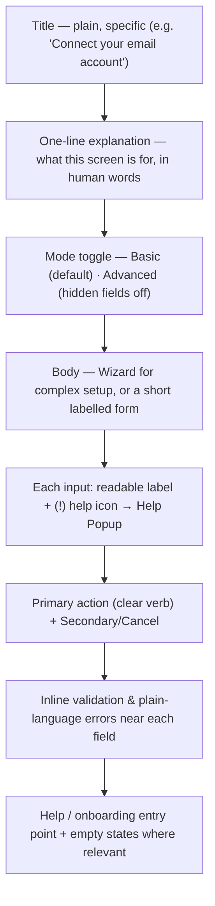

# UI/UX Guidelines

> How every Nizam screen must look, read, and behave so that a non-technical operator can do real work confidently — in plain language, bilingual AR/EN, with help built into every field.

**Status: Approved (Phase 1) | Version: 1.0.0 | Last updated: 2026-07-01 | Owner: Architecture (Nizam Core)**

---

## 1. Who We Design For (and the One Rule)

Nizam's users are **non-technical operators, managers, and admins** — people who run a business, not engineers. They should never see JSON, a broker topic, a stack trace, or a raw error code.

**The one rule that overrides all others:** *If a non-technical person cannot understand a screen without help, the screen is wrong.* Everything below exists to serve that rule.

These guidelines are **normative** (MUST / SHOULD, RFC 2119). They are the acceptance criteria the design system (`packages/ui`) and every product screen are reviewed against.

---

## 2. Language & Bilingual (AR/EN) Requirements

- **Human language, no jargon.** Say "Connect your email" not "Configure SMTP credentials." Where a technical term is unavoidable, it MUST be explained inline via the Help Popup (§6).
- **Fully bilingual Arabic + English.** Every string ships in both languages; nothing is hard-coded. No mixed-language screens.
- **Direction follows language:** Arabic renders **RTL**, English renders **LTR**. Layout, icons, progress steppers, and the `(!)` help affordance all mirror correctly. Numbers, dates, and currency localize per locale.
- **Tone:** calm, respectful, plain, active voice. Address the user directly ("You can…"). Never blame the user.

---

## 3. Standard Screen Anatomy

Every screen MUST present these elements in this order. Nothing is optional.



| Element | Requirement |
|---------|-------------|
| **Title** | Plain, specific, describes the outcome ("Connect your email account"), not the system ("SMTP Configuration"). |
| **One-line explanation** | Directly under the title. Says what the screen does and why, in one human sentence. |
| **Mode toggle** | Basic (default) / Advanced. Advanced fields are hidden until switched (§5). |
| **Body** | Complex setup → **Wizard** (§4). Simple setup → short form, grouped, never a wall of fields. |
| **Inputs** | Every input has a readable label **and** a `(!)` help icon (§6). No bare/placeholder-only fields. |
| **Actions** | One clear primary verb ("Connect", "Save", "Create"). Secondary actions are visually subordinate. |
| **Feedback** | Inline, plain-language validation and errors near the field (§7); success is confirmed explicitly. |
| **Help/empty states** | Onboarding and empty states guide the first action (§8, §9). |

---

## 4. Wizard Pattern (for complex settings)

**Rule:** Any setup with more than a handful of fields, any multi-system connection, or anything with prerequisites **MUST be a Wizard, not a long form.**

A Wizard:

- Breaks the task into **short, ordered steps**, one focused decision per step.
- Shows a **stepper** with clear step names and where the user is ("Step 2 of 4 — Enter your API key").
- Explains each step in a plain sentence before asking for input.
- **Validates each step before advancing**; the user cannot carry an error forward.
- Allows **Back** without losing entered data; saves progress so a user can resume.
- Ends with a **Review** step summarizing what will happen, then a **Confirm**.
- Confirms success with a clear "Done" state and an obvious next action.
- Never blocks the user in a dead end: every step offers help and a safe way out.

```
[ 1 Connect ]──[ 2 Enter key ]──[ 3 Test ]──[ 4 Review ]
   ▲ done          ▲ current       ○ next     ○ next
   "Step 2 of 4 — Enter your API key"
   <one-line explanation>   [ field + (!) ]   [ Back ]  [ Next ]
```

---

## 5. Basic Mode (default) vs Advanced Mode

- **Basic Mode is the default** on every screen. It shows only what a non-technical user needs to succeed, with sensible defaults pre-filled.
- **Advanced Mode is hidden by default** behind a clearly labelled toggle ("Advanced settings"). Turning it on reveals power-user fields (timeouts, custom endpoints, headers, concurrency).
- Advanced fields **MUST have safe defaults** so a Basic user never has to touch them. Leaving Advanced untouched always produces a working configuration.
- The chosen mode is **remembered per user** (a Settings preference). Switching to Basic hides advanced fields but preserves their values.
- Advanced fields still follow all rules: readable label + `(!)` Help Popup, plain errors, bilingual.

---

## 6. The Help Popup (the core convention)

**Rule (FIXED by canon):** Every input has a readable label **and** a `(!)` help icon. Clicking `(!)` opens a Help Popup that **MUST contain all nine fields below.** No field may be omitted; if one truly doesn't apply, it says so explicitly (e.g., "Not required for this field").

### 6.1 Help Popup content spec (the 9 required fields)

| # | Field | Purpose | Rule |
|---|-------|---------|------|
| 1 | **What is this field?** | Plain definition of the value being asked for. | Required. No jargon. |
| 2 | **Why is it needed?** | What Nizam does with it / what breaks without it. | Required. |
| 3 | **Example value** | A realistic, safe sample (masked if sensitive). | Required. Never a real credential. |
| 4 | **Is it required?** | Required or optional, and the effect of leaving it blank. | Required. |
| 5 | **Where can I get this value?** | Where the value comes from (which platform/page/person). | Required. |
| 6 | **Step-by-step instructions** | If obtained from another platform, numbered steps to find it. | Required when value comes from elsewhere; else "You can type this yourself." |
| 7 | **Link or page name** | The exact page name and/or link to reach the source. | Required when applicable. |
| 8 | **Common mistakes** | The 1–3 most frequent errors and how to avoid them. | Required. |
| 9 | **Security warning** | Warning if the value is sensitive (keys, passwords, tokens). | Required when sensitive; otherwise "This value is not sensitive." |

### 6.2 Reusable Help Popup schema (`illustrative — convention only`)

This schema is the shape `packages/ui`'s Help Popup consumes; content is authored per field and translated AR/EN.

```jsonc
// illustrative — convention only
{
  "fieldKey": "integration.email.apiKey",
  "help": {
    "whatIsThis": "…",            // 1
    "whyNeeded": "…",             // 2
    "exampleValue": "…",          // 3 (masked if sensitive)
    "required": true,             // 4
    "whereToGet": "…",            // 5
    "stepByStep": ["…", "…"],     // 6 (empty ⇒ 'you can type this yourself')
    "linkOrPageName": "…",        // 7
    "commonMistakes": ["…"],      // 8
    "securityWarning": "…"        // 9 (required when 'sensitive' is true)
  },
  "sensitive": true
}
```

### 6.3 Worked example — Help Popup for an API key field

**Field label:** *Email provider API key*  ·  `(!)`

| Section | Content |
|---------|---------|
| **What is this field?** | It's a secret access key from your email provider that lets Nizam send and read emails on your behalf. Think of it as a password made just for apps. |
| **Why is it needed?** | Without it, Nizam cannot connect to your email account, so it can't send messages or read replies for you. |
| **Example value** | `sk_live_a1b2••••••••••••7f9d` (yours will be a long string of letters and numbers; we only show the first and last few characters). |
| **Is it required?** | Yes. If you leave it blank, the email connection won't work and this step can't be completed. |
| **Where can I get this value?** | From your email provider's dashboard, in the **API Keys** area of your account settings. |
| **Step-by-step instructions** | 1. Sign in to your email provider's website. 2. Open **Settings → API Keys**. 3. Click **Create API Key** (name it "Nizam"). 4. Copy the key shown **once** — you can't see it again later. 5. Come back here and paste it into this field. |
| **Link or page name** | Page name: **"API Keys"** (under Account Settings). If your provider gave you a direct link, it usually ends in `/settings/api-keys`. |
| **Common mistakes** | • Copying an extra space at the start or end — paste exactly. • Using a "test" key instead of a "live" key. • Pasting your login password instead of the API key. |
| **Security warning** | ⚠️ This is a secret. Never share it, screenshot it, or send it by chat/email. Nizam stores it encrypted and shows it masked. If it leaks, delete it at your provider and create a new one. |

Every sensitive field in Nizam (API keys, passwords, tokens, webhook secrets, connection strings) MUST ship a fully completed Help Popup of this quality before its screen is considered done.

---

## 7. Error Messaging (plain language)

- Errors are **near the field** that caused them and appear as the user leaves the field or submits.
- Every error says, in plain words: **what went wrong** and **how to fix it** — never a code, never a stack trace, never "invalid input."
  - Bad: *"Error 422: validation failed."*  Good: *"That doesn't look like a full email address. It should look like name@example.com."*
- System failures (a connection couldn't be reached, a service is down) are shown as **honest, reassuring** messages with a next step (retry, or "we saved your work — try again shortly"), plus a quiet way to get help. Technical detail is logged, never shown.
- Errors never blame the user; they describe the problem and the path forward.

---

## 8. Empty States

- Every list/dashboard that can be empty MUST show a **helpful empty state**, not a blank area.
- An empty state has: a friendly one-line explanation of what would appear here, **why it's empty**, and a **single clear primary action** to fill it (e.g., "You haven't connected any tools yet. Connect your first tool →").
- Empty states may include a tiny illustration and a link to relevant help; they never show error styling.

---

## 9. Help & Onboarding Patterns

- **First-run onboarding:** a short, skippable guided tour on first login that orients the user to the main areas and starts them on one meaningful action.
- **Contextual help everywhere:** the `(!)` Help Popup on fields (§6); a persistent "Help" entry per screen linking to plain-language guides.
- **Progressive disclosure:** show the minimum first; reveal depth on demand (Advanced Mode, "Show more"). Never overwhelm.
- **Confirmations of success:** every completed action is acknowledged ("Your email is connected ✓") with an obvious next step.
- Onboarding and help text are bilingual and follow the plain-language tone (§2).

---

## 10. Confirmation for Destructive / Irreversible Actions

- Any **destructive or irreversible** action (delete, disconnect, revoke access, cancel a run, remove a tenant) MUST require an explicit confirmation step.
- The confirmation dialog MUST state, in plain language: **what will happen**, **what is lost**, and **whether it can be undone**.
- For **high-consequence or irreversible** actions, require a deliberate confirmation (e.g., typing the item's name, or a clearly labelled "Yes, delete permanently" that is visually distinct and not the default focus).
- Destructive primary buttons are visually distinct (danger styling); the safe choice (Cancel) is easy and default-focused.
- Where the platform can, offer **undo** or a soft-delete grace window instead of hard deletion, and say so.

This UI rule mirrors the platform rule that **high-consequence actions require human approval** (see the execution/governance model in the Vision and Security docs).

---

## 11. Accessibility (WCAG 2.1 AA)

Nizam UI MUST meet **WCAG 2.1 Level AA**:

| Area | Requirement |
|------|-------------|
| Contrast | Text ≥ 4.5:1 (≥ 3:1 for large text and meaningful UI/graphics). |
| Keyboard | Every interactive element is reachable and operable by keyboard; visible focus states; logical tab order (mirrored for RTL). |
| Screen readers | Semantic HTML/ARIA; every input has a programmatic label; the `(!)` help control is announced and its popup is reachable and dismissible. |
| Targets & motion | Adequate touch-target size; respect `prefers-reduced-motion`; no essential info conveyed by color alone. |
| Forms | Errors are associated with their field programmatically (`aria-describedby`) and announced. |
| Language | `lang`/`dir` set correctly per AR/EN so assistive tech reads and mirrors properly. |
| Content | Plain-language copy also serves users with cognitive load; supports translation and text resizing to 200% without loss. |

Accessibility is part of Definition of Done for any UI work, not a later pass.

---

## 12. Summary Checklist (a screen is done when…)

- [ ] Plain, specific **title** + one-line explanation.
- [ ] Bilingual AR/EN with correct RTL/LTR mirroring; no jargon.
- [ ] Every input has a readable **label** + `(!)` **Help Popup** with all **9 fields**.
- [ ] Sensitive fields carry a security warning and are masked.
- [ ] Complex setup uses a **Wizard**, not a long form.
- [ ] **Basic Mode** default; **Advanced Mode** hidden with safe defaults.
- [ ] Errors are near the field, plain-language, actionable; system failures honest.
- [ ] Helpful **empty states** with a single clear next action.
- [ ] Destructive/irreversible actions require explicit, informative **confirmation** (+ undo where possible).
- [ ] **WCAG 2.1 AA** met (contrast, keyboard, screen reader, focus, forms).
- [ ] Onboarding/help entry present; success is confirmed.

---

## Related Documents

- [00-Vision.md](./00-Vision.md) — Non-technical-first design bias
- [22-UIUX-Guidelines.md](./22-UIUX-Guidelines.md) — How `apps/web` implements these patterns
- [14-Folder-Structure.md](./14-Folder-Structure.md) — `packages/ui` (Help Popup, Wizard, form kit)
- [10-Security-Strategy.md](./10-Security-Strategy.md) — Sensitive-value handling behind the UI
- [../README.md](../README.md) — Project entry point

---

## Change Log

| Version | Date | Author | Change |
|---------|------|--------|--------|
| 1.0.0 | 2026-07-01 | Architecture (Nizam Core) | Initial UI/UX guidelines for non-technical users (Phase 1). |
