# 23 — Agent Hierarchy (Department Managers & Worker Agents)

> The two-tier agent organization inside the Agents bounded context: how a Bayan intent, once routed to Nizam, is orchestrated by a **Department Manager Agent** that dispatches **Worker Agents**, audits their evidence, and returns the single approved result upward — deepening the generic Agent Framework of [06](06-Agent-Architecture.md) with an org model.

**Status:** Approved (Phase 1) | **Version:** 1.0.0 | **Last updated:** 2026-07-01 | **Owner:** Architecture (Nizam Core)

---

## 1. Overview & Principles

The Agent Framework of [06-Agent-Architecture.md](06-Agent-Architecture.md) defines *what an agent is* — a typed, permissioned executor of Bayan intents, never a reasoner. This document **deepens** that framework with the **organizational structure** the executors are arranged into. It does not contradict [06]; a Manager and a Worker are both `AgentDefinition`-backed agents with `AgentRun` execution semantics, distinguished by an **agent role/kind** (see §8).

The two-tier org sits *entirely inside the Agents bounded context*. It changes nothing about the canonical layer chain or the boundary rules of [05-Bounded-Contexts.md](05-Bounded-Contexts.md); it refines the internal shape of the "Agent Framework" link:

```
User → Bayan (Brain) → Nizam (AI OS) → Agent Framework → Tool Registry → Automation Engine → n8n → External Systems
                                        └──────────── this document expands here ────────────┘
```

The **canonical internal flow** of the agent org is:

```
Bayan → Nizam (AI OS) → Department Manager Agents → Worker Agents → Tool Registry
      → Automation Selector → n8n → Results → Manager Audit → Return Response
```

### 1.1 The five governing principles

1. **Users never touch agents.** A non-technical user (canon §7) talks *only* to Bayan. They never name, address, configure, or receive output from an agent directly. Agents are an implementation detail of Nizam.
2. **Bayan speaks only to Nizam via structured intents.** Bayan reasons, plans, and emits an **Intent** (validated by the Bayan Gateway ACL, [05] §4.7). Nizam receives that intent — it never receives free-form reasoning.
3. **Inside Nizam, a Department Manager Agent orchestrates.** The intent is routed to exactly one department; that department's **Manager Agent** owns the intent end to end: it decomposes the work, dispatches **Worker Agents**, coordinates them, and audits their results.
4. **Only the Manager returns the final result upward.** Workers return **evidence** to their Manager, not to Nizam. The Manager runs the **Manager Audit** (§6) and only on **Approve** does a single, consolidated result flow up: Manager → Nizam → Bayan → User.
5. **Agents are executors, not reasoners** (restating [06] §1, §5). The Manager *orchestrates and audits* within a bounded, declarative policy; it does not invent goals or perform open-ended reasoning. All decomposition derives from the intent, a plan template, or bounded arg-synthesis — exactly as [06] §4.2 constrains plan resolution. The Manager's "judgement" during audit is a **deterministic, rule-driven evaluation of evidence against declared criteria**, not emergent cognition.

> Mental model: **Bayan is the executive who decides *what*. The Department Manager is a disciplined operations lead who decides *who does it and whether it passed*. Workers are specialists who *do one thing and prove they did it*.** All three obey the executor discipline of [06].

### 1.2 Two-tier org at a glance

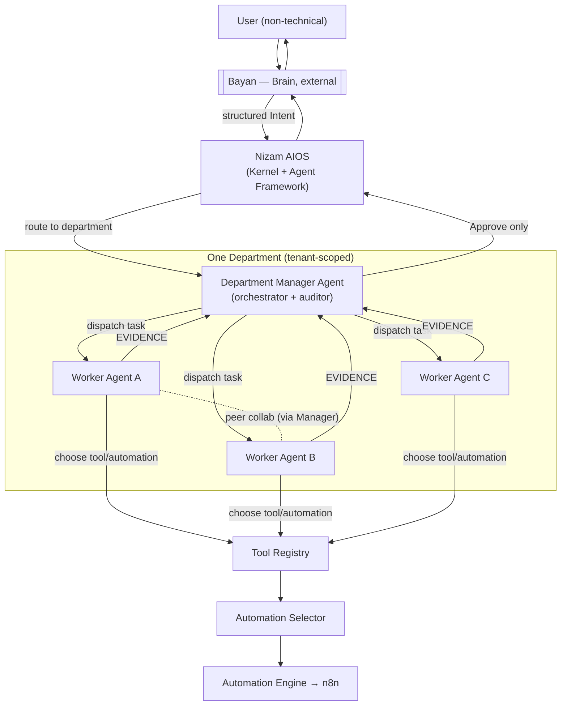

---

## 2. Department Manager Agents

There is **one Manager Agent per department**. A department is a first-class aggregate (§8) that scopes a bounded domain of work, owns a set of Worker Agents, and is addressed by exactly one Manager.

### 2.1 The departments (Phase 1 first-class set)

| Department | Manager Agent | Illustrative remit |
|---|---|---|
| HR | **HR Manager** | Hiring, screening, interviews, offers, onboarding |
| Marketing | **Marketing Manager** | Campaigns, content, audience segmentation, outreach |
| Sales | **Sales Manager** | Lead qualification, pipeline actions, quotes, follow-ups |
| Finance | **Finance Manager** | Invoicing, reconciliation, expense checks, reporting |
| Support | **Support Manager** | Ticket triage, responses, escalations, knowledge lookups |
| Developer | **Developer Manager** | Repo tasks, CI actions, issue/PR operations, code checks |
| CEO | **CEO Manager** | Cross-department coordination, executive summaries, arbitration |

The **CEO Manager** is special: it coordinates **cross-department intents** by delegating sub-intents to peer Department Managers rather than owning workers of its own (see §10.3). All other Managers own a concrete worker set.

> This set is the Phase-1 baseline. New departments are added as plugins (§10) without changing the runtime — the executor stays closed for modification, open for extension ([06] §12).

### 2.2 Manager responsibilities

A Department Manager Agent:

1. **Receives the routed intent.** Nizam routes the validated intent to the department whose scope matches the intent's capability domain. The Manager is the single entry point for that department.
2. **Decomposes into worker tasks.** It resolves the intent into an ordered/parallel set of **`AgentTask`** units (§8), each targeting a capability owned by one of its workers. Decomposition is a **plan resolution** in the sense of [06] §4.2 — sourced from the intent, a plan template bound to the department capability, or bounded arg-synthesis — never invented.
3. **Selects & dispatches Worker Agents.** For each task it selects the owned worker whose capabilities match and dispatches it (emitting `WorkerDispatched`).
4. **Coordinates collaboration.** Where tasks are interdependent, the Manager acts as the **coordinator** for peer-worker collaboration and hand-offs (§4).
5. **Runs the Manager Audit.** When workers submit evidence, the Manager evaluates it against declared audit criteria and reaches an `AuditDecision` (§6): Approve, Reject, Retry, Request More Information, or Run Another Worker.
6. **Owns the final response.** Only on **Approve** does the Manager assemble and return the consolidated result upward to Nizam. Workers never respond upward.

### 2.3 Manager anatomy

A Manager is an `AgentDefinition` of kind `manager` (§8) with these facets layered on the six generic facets of [06] §3:

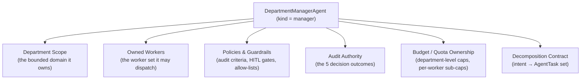

- **Department scope** — the bounded set of capabilities/intents the department handles; the routing key Nizam matches against.
- **Owned workers** — the explicit list of Worker `AgentDefinition`s the Manager may dispatch. A Manager cannot dispatch a worker it does not own.
- **Policies & guardrails** — declarative audit criteria, evidence-validation rules, HITL escalation thresholds, and the department's tool allow-list intersection (§9). Enforced by the same Guardrail Engine as [06] §8.
- **Audit authority** — the Manager is the *only* actor permitted to emit an `AuditDecision` for its department's run; audit authority is a first-class permission (§9).
- **Budget/quota ownership** — the Manager owns the department's run budget (max workers dispatched, aggregate tool-calls, wall-clock, token budget) and allocates per-worker sub-caps, metered via Billing ([05] §4.8).

> Illustrative — design only.

```yaml
# illustrative — design only
departmentManagerAgent:
  id: "0198f4a1-...-v7"
  kind: "manager"
  name: "hr-manager"
  department: "hr"
  version: "1.2.0"
  visibility: "tenant"
  scope:
    capabilities: ["hr.candidate.screen", "hr.candidate.shortlist", "hr.offer.prepare", "hr.onboarding.start"]
  ownedWorkers:
    - "cv-screening-agent"
    - "recruitment-agent"
    - "interview-agent"
    - "offer-agent"
    - "onboarding-agent"
  auditAuthority: true
  auditCriteria:
    requireEvidenceSchema: true
    minConfidence: 0.75
    disallowUnverifiedWrites: true
  guardrails:
    maxWorkersDispatched: 6
    maxAggregateToolCalls: 60
    maxWallClockSeconds: 600
    maxTokenBudget: 200000
    humanInTheLoop:
      - onDecision: "Approve"
        whenSideEffectClass: "irreversible"     # e.g. sending an offer
        require: "tenant-approver"
  perWorkerSubCaps:
    default: { maxToolCalls: 15, deadlineMs: 60000 }
```

---

## 3. Worker Agents

A Worker Agent is owned by **exactly one Manager**. It executes a single `AgentTask`, may collaborate with peers, chooses the best automation via the Automation Selector, executes through the Tool Registry, and returns **evidence** to its Manager.

### 3.1 The HR worker set (illustrative)

| Worker | Owned by | Task it executes |
|---|---|---|
| **CV Screening Agent** | HR Manager | Parse and score CVs against role criteria |
| **Recruitment Agent** | HR Manager | Source/rank candidates, maintain the candidate pool |
| **Interview Agent** | HR Manager | Schedule interviews, prepare interview kits |
| **Offer Agent** | HR Manager | Prepare and dispatch offer packages |
| **Onboarding Agent** | HR Manager | Kick off onboarding tasks and provisioning |

Every department has its **own worker set** (e.g. Sales has a Lead-Qualification Agent, a Quote Agent, a Follow-up Agent; Finance has an Invoice Agent, a Reconciliation Agent; and so on). The HR set above is the running example for the flows in §7.

### 3.2 Worker responsibilities

A Worker Agent:

1. **Works independently** on its assigned `AgentTask`, within its own bounded local sequencing ([06] §5.1).
2. **May collaborate with peer workers** — but only via the Manager as coordinator and/or via integration events; **never** via hidden direct coupling (§4).
3. **Chooses the best automation** for its task by consulting the **Automation Selector** through the Tool Registry (§5) — it does not hard-code which n8n workflow or adapter to use.
4. **Executes** the selected tool/automation under the standard invocation contract ([06] §5.3), permission- and budget-checked.
5. **Returns evidence** — a structured `WorkerEvidence` value object (§3.4) that is *proof of what it did*: inputs consulted, tools/automations invoked, outputs produced, and a self-asserted confidence — not a free-form narrative.

A worker **never** returns its result to Nizam or Bayan; its terminal action is submitting evidence to its Manager (`WorkerEvidenceSubmitted`).

### 3.3 Worker anatomy

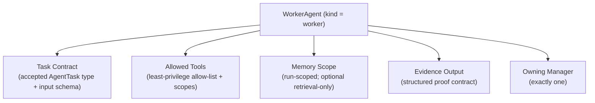

- **Task contract** — the `AgentTask` types the worker accepts and their input JSON Schema. A worker refuses a task outside its contract (mirrors capability refusal in [06] §3).
- **Allowed tools** — an explicit, least-privilege allow-list; the worker's *effective* tools are the intersection of its allow-list, the department allow-list, and the invoking principal's granted scopes (§9, [06] §8).
- **Memory scope** — run-scoped short-term memory (Redis, keyed by sub-run id) plus optional retrieval-only pgvector, tenant-isolated by RLS — identical semantics to [06] §7.
- **Evidence output** — the mandatory structured `WorkerEvidence` the worker emits; its schema is validated by the Manager during audit (§6.3).

> Illustrative — design only.

```yaml
# illustrative — design only
workerAgent:
  id: "0198f4b2-...-v7"
  kind: "worker"
  name: "cv-screening-agent"
  ownedBy: "hr-manager"
  version: "2.0.1"
  taskContract:
    accepts: ["hr.candidate.screen"]
    inputSchema: "hr.candidate.screen.input.v1"   # JSON Schema ref
  allowedTools:
    - tool: "storage.file.read"
      scopes: ["storage:file:read"]
    - tool: "hr.cv.parse"
      scopes: ["hr:cv:parse"]
    - tool: "hr.candidate.score"
      scopes: ["hr:candidate:score"]
  memory:
    runMemory: true
    retrieval: { enabled: true, store: "pgvector", readOnly: true }
  evidence:
    schema: "hr.candidate.screen.evidence.v1"
    mustInclude: ["inputsConsulted", "toolsInvoked", "outputs", "confidence"]
```

### 3.4 The evidence contract

Evidence is the currency between Workers and the Manager Audit. It is **structured proof**, schema-validated, and event-sourced.

> Illustrative — design only.

```json
// illustrative — design only
{
  "evidenceId": "0198f4c3-...-v7",
  "workerSubRunId": "0198f4c3-...-run",
  "task": "hr.candidate.screen",
  "tenantId": "<tenant UUID>",
  "inputsConsulted": [{ "kind": "cv", "ref": "storage://cv/1042.pdf" }],
  "toolsInvoked": [
    { "tool": "hr.cv.parse", "execId": "...", "status": "Completed" },
    { "tool": "hr.candidate.score", "execId": "...", "status": "Completed" }
  ],
  "automationsUsed": [{ "selector": "hr.screen.batch", "chosen": "n8n:wf-hr-screen", "automationRunId": "..." }],
  "outputs": { "shortlist": [{ "candidateId": "c-77", "score": 0.91 }], "rejected": 12 },
  "confidence": 0.88,
  "assertions": ["all CVs parsed", "scores within [0,1]", "no PII written externally"],
  "producedAt": "2026-07-01T09:14:22Z"
}
```

---

## 4. Worker Collaboration Model

Workers may collaborate, but collaboration is **explicit, mediated, and observable** — never hidden coupling. Two sanctioned channels exist, plus a Manager-driven escalation.

1. **Via the Manager as coordinator (default).** When task B needs task A's output, the worker returns evidence to the Manager, which passes the relevant slice into task B's input when dispatching worker B. The Manager is the join point; there is no worker-to-worker call.
2. **Via integration events.** Loosely-coupled collaboration happens through domain/integration events on the outbox → NATS (canon §5). Worker A emits a domain event; worker B (dispatched by the Manager) reacts to a projection of it. No synchronous, undeclared coupling.
3. **Hand-off.** A worker that determines the task belongs to a peer does not call the peer; it returns evidence flagged `handoffRequested: <capability>` to the Manager, which decides whether to **Run Another Worker** (§6).
4. **Manager "Run Another Worker".** As an audit outcome (§6), the Manager may dispatch an additional worker — to fill a gap, add a second opinion, or complete a hand-off — before re-auditing.

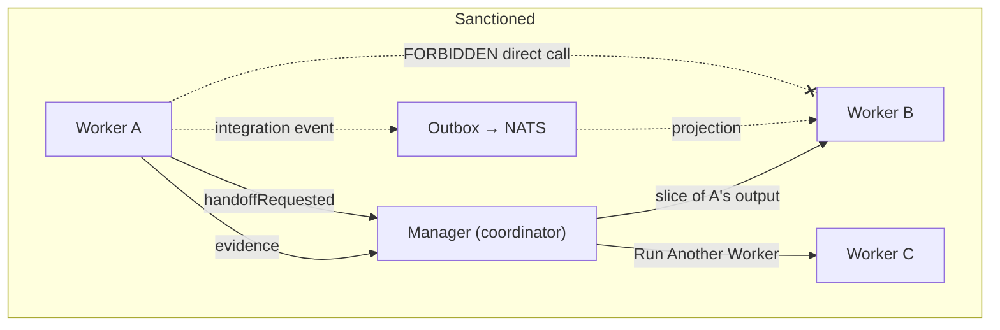

> The forbidden edge (dashed, crossed) is the key rule: **no worker invokes another worker directly.** All coordination flows through the Manager or through declared events, preserving auditability, blast-radius containment, and the boundary rules of [05].

---

## 5. Automation Selector

The **Automation Selector** is a component of the **Automation** bounded context ([05] §4.5) that, given a concrete worker task, **selects the best way to execute it** — an n8n workflow, a direct tool adapter, or a composed automation. Workers invoke it **through the Tool Registry**, never directly, so authorization, schema validation, and metering still apply.

### 5.1 Where it sits vs. generic tool invocation

[07-Tool-Architecture.md](07-Tool-Architecture.md) and [08-Automation-Architecture.md](08-Automation-Architecture.md) describe how a *chosen* tool/automation is invoked and executed. The Automation Selector adds the **choice** step *before* that: rather than a worker hard-binding to one workflow, it declares a **capability need** and the Selector resolves it to the best available executor. It contrasts with generic invocation as follows:

| Concern | Generic tool invocation ([07]/[08]) | Automation Selector (this doc) |
|---|---|---|
| Question answered | "Run *this* tool/workflow with this input" | "Which tool/workflow *best* satisfies this need?" |
| Binding | Worker/plan names the exact tool | Worker names a capability; Selector picks |
| Output | A `ToolExecution` / `AutomationRun` | A **selection** that then becomes an invocation |
| Owner | Tools / Automation execution | Automation context's selection service |

### 5.2 Selection criteria

The Selector scores candidate executors on:

- **Capability match** — does the candidate satisfy the declared capability and input/output schema?
- **Cost** — estimated token/execution cost (Billing signals, [05] §4.8).
- **Reliability** — recent success rate / SLO health from Monitoring ([05] §4.9).
- **Tenant permissions** — the candidate's required scopes must be held by the invoking principal, and the workflow/tool must be enabled for the tenant (IAM + Settings OHS).

### 5.3 Selection contract & fallbacks

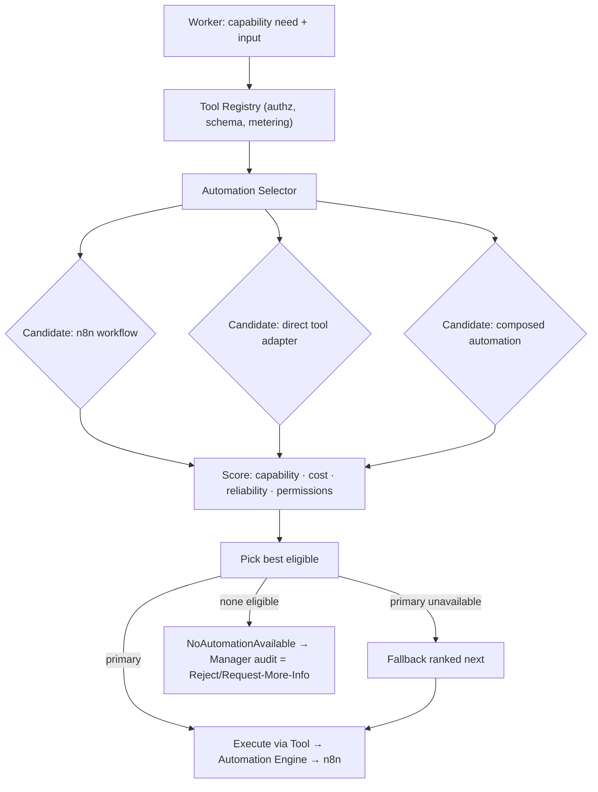

> Illustrative — design only.

```yaml
# illustrative — design only
automationSelection:
  request:
    capability: "hr.screen.batch"
    tenantId: "<tenant UUID>"
    input: { role: "backend-eng", cvBatchRef: "storage://batch/2026-07" }
    constraints: { maxCostUnits: 100, maxDeadlineMs: 120000 }
  candidatesConsidered:
    - { kind: "n8n-workflow", ref: "wf-hr-screen@1.3.0", capabilityMatch: 1.0, costUnits: 42, reliability: 0.99, permitted: true }
    - { kind: "direct-adapter", ref: "hr.candidate.score",  capabilityMatch: 0.7, costUnits: 60, reliability: 0.97, permitted: true }
  chosen: { kind: "n8n-workflow", ref: "wf-hr-screen@1.3.0", reason: "highest capability×reliability within cost" }
  fallbacks: [{ kind: "direct-adapter", ref: "hr.candidate.score" }]
```

- **Fallbacks** — if the primary is unavailable (degraded SLO, disabled for tenant, over cost), the Selector returns the next-ranked eligible candidate.
- **No eligible candidate** — the Selector returns `NoAutomationAvailable`; the worker records this in evidence and the Manager Audit resolves to **Reject** or **Request More Information** (§6). The Selector never fabricates an executor.

---

## 6. The Manager Audit Loop

The Manager Audit is **the heart of the design**. After workers submit evidence, the Manager reviews **everything** and reaches one of five outcomes. Only **Approve** releases a result upward; the other four loop back.

### 6.1 The five outcomes

| Outcome | Meaning | Effect |
|---|---|---|
| **Approve** | Evidence satisfies all criteria | Assemble final result, return to Nizam → Bayan → User |
| **Reject** | Evidence is invalid/unrecoverable, or no path exists | End run as failed with a typed reason; surface upward |
| **Retry** | Transient/fixable failure | Re-dispatch the same worker (idempotency-keyed) |
| **Request More Information** | Evidence incomplete/ambiguous | Ask the worker (or Bayan, via Nizam) for more input, then re-dispatch |
| **Run Another Worker** | A gap/hand-off/second opinion is needed | Dispatch an additional owned worker, then re-audit |

### 6.2 Audit as a state machine

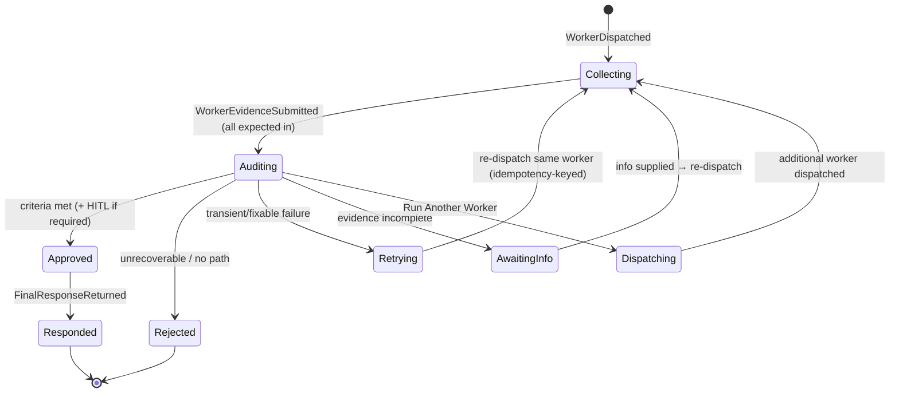

Every transition emits an `AuditDecisionMade` event (with the outcome) plus the corresponding orchestration event; the run is event-sourced exactly like an `AgentRun` ([06] §6.2), so the whole loop is replayable.

### 6.3 Decision table

| Condition observed in evidence | Decision |
|---|---|
| All evidence schema-valid, criteria met, confidence ≥ threshold, no policy breach | **Approve** |
| Evidence schema-valid but a required output missing / ambiguous | **Request More Information** |
| Transient tool/automation failure recorded (timeout, rate-limit) | **Retry** |
| Worker flagged `handoffRequested`, or a needed capability wasn't covered | **Run Another Worker** |
| `NoAutomationAvailable`, invalid evidence, budget exhausted, or policy violation with no remedy | **Reject** |
| Approve reached but action is high-impact/irreversible | **Approve → HITL gate** (human approver) before release |

### 6.4 Audit criteria & evidence validation

The Manager validates that: every `WorkerEvidence` conforms to its declared schema; asserted tool/automation executions actually exist as `ToolExecution`/`AutomationRun` records (evidence integrity, §9); outputs satisfy the department's criteria (completeness, confidence threshold, no disallowed side-effects); and no guardrail was breached. Evidence that cannot be corroborated against the event stream is treated as invalid → **Reject**.

### 6.5 Guardrails & human-in-the-loop

The Manager reuses the Guardrail Engine of [06] §8. For **high-impact actions** (irreversible or above a threshold — e.g. sending an offer, issuing an invoice, deleting data), an **Approve** does not release immediately: the run parks in a HITL gate (`AgentRunApprovalRequested`, [06] §8), notifies a tenant approver via Notifications ([05] §4.11), and only a granted approval releases the result. Denial converts the outcome to **Reject**.

### 6.6 Observability

Every audit decision is **event-sourced and observable**: `AuditDecisionMade` (with outcome, criteria snapshot, and evidence refs) publishes via the Outbox → NATS, feeding Monitoring read models and SLOs ([05] §4.9) and Billing metering ([05] §4.8). An operator can replay the exact sequence of evidence and decisions that led to any response.

---

## 7. Full Flows

Each sub-flow below is one facet of the canonical internal flow of §1. They compose into the end-to-end sequence of §7.7.

### 7.1 Request Flow — Bayan intent → Nizam → Manager → Workers

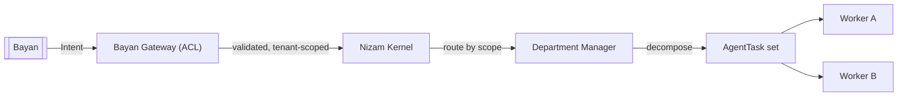

### 7.2 Execution Flow — worker picks automation → executes

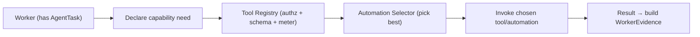

### 7.3 Automation Flow — Automation Selector → n8n → external → results

```mermaid
graph LR
    SEL["Automation Selector"] -->|chosen workflow| AE["Automation Engine"]
    AE -->|dispatch (queue)| N8N["n8n worker"]
    N8N -->|authenticated calls| EXT["External Systems"]
    EXT --> N8N
    N8N -->|execution events| AE
    AE -->|AutomationRunCompleted| W["Worker (evidence)"]
```

### 7.4 Tool Flow — worker → Tool Registry → tool/automation

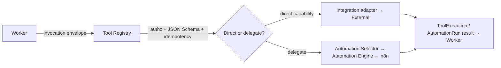

### 7.5 Audit Flow — evidence → Manager Audit loop → decision

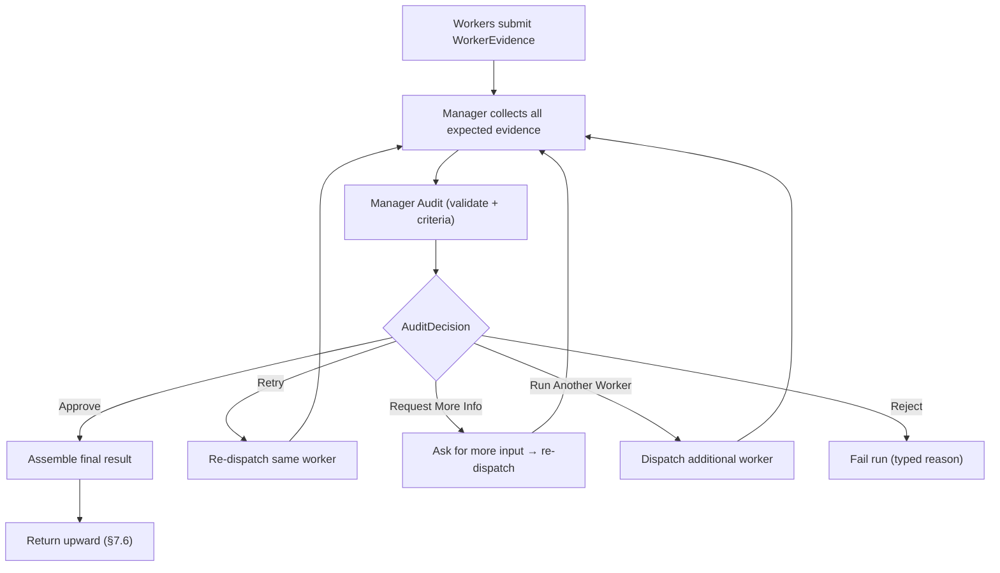

### 7.6 Response Flow — Manager approves → result returned upward

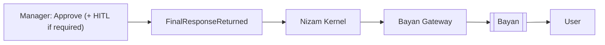

### 7.7 End-to-end sequence — HR: "screen and shortlist candidates for a role" (with one Retry)

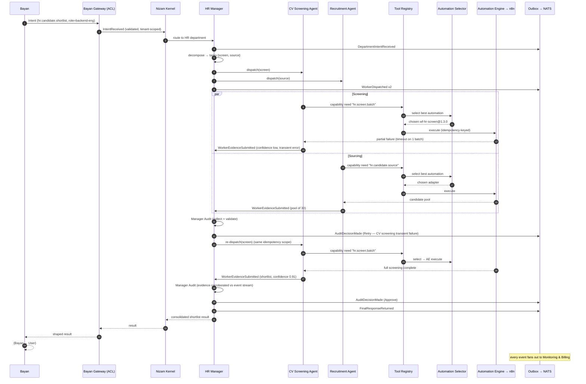

### 7.8 Component Diagram — the agent org

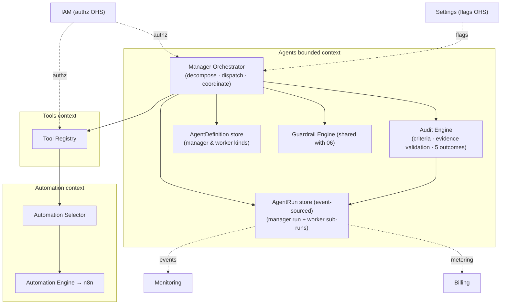

### 7.9 Context Diagram — the agent org in its surroundings

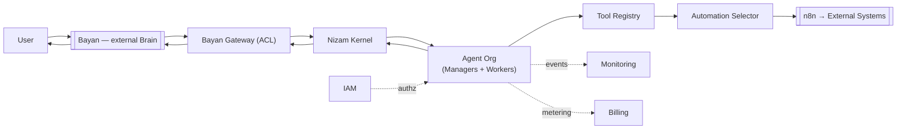

---

## 8. Domain Model Additions

These additions live **inside the Agents bounded context** and extend the `AgentDefinition`/`AgentRun` model of [06] §6 — they do not create a new context.

### 8.1 Relationship to AgentDefinition / AgentRun

- **Manager and Worker are agent *roles/kinds*.** `DepartmentManagerAgent` and `WorkerAgent` are `AgentDefinition`s carrying a `kind ∈ {manager, worker}` discriminator. All [06] facets (capabilities, allowed tools, memory, guardrails, planning contract) still apply.
- **A Manager-led execution is an `AgentRun` composed of Worker sub-runs.** The Manager's `AgentRun` is the parent; each dispatched worker executes as a **child `AgentRun`** correlated by the parent `runId`. The parent's event stream includes the audit decisions; the children's streams include their tool/automation steps. State is the fold of both, preserving the event-sourcing guarantees of [06] §6.2 and §10.

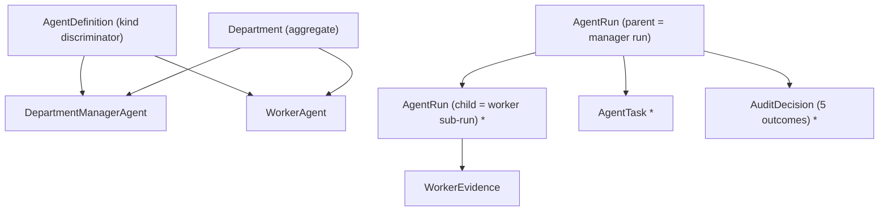

### 8.2 New / extended aggregates & value objects

| Element | Type | Notes |
|---|---|---|
| **Department** | Aggregate | Bounded domain; owns one Manager + a worker set; tenant-scoped; canon §3 columns |
| **DepartmentManagerAgent** | `AgentDefinition` (kind=manager) | Adds scope, owned workers, audit authority, budget ownership |
| **WorkerAgent** | `AgentDefinition` (kind=worker) | Owned by exactly one Manager; task contract + evidence output |
| **AgentTask** | Value object / entity | A unit of decomposed work: capability, input (schema-valid), sub-caps |
| **WorkerEvidence** | Value object | Structured proof (§3.4); schema-validated; corroborated vs event stream |
| **AuditDecision** | Value object | One of `Approve │ Reject │ Retry │ RequestMoreInformation │ RunAnotherWorker`, with reason + evidence refs |

Invariants (in addition to [06] §6): a Worker belongs to exactly one Manager; a Manager may dispatch only owned workers; only the owning Manager may emit an `AuditDecision` for its run; a child sub-run inherits and cannot exceed the parent department budget.

### 8.3 Domain events (naming per canon: `nizam.<context>.<aggregate>.<event>.vN`)

| Event | When |
|---|---|
| `nizam.agents.department.intent-received.v1` | Manager receives the routed intent |
| `nizam.agents.agent-task.decomposed.v1` | Intent decomposed into `AgentTask` set |
| `nizam.agents.worker.dispatched.v1` | Manager dispatches a worker sub-run |
| `nizam.agents.worker.evidence-submitted.v1` | Worker submits `WorkerEvidence` |
| `nizam.agents.audit.decision-made.v1` | Manager reaches an `AuditDecision` (carries the outcome) |
| `nizam.agents.response.final-returned.v1` | Approved result returned upward |

Shorthand names used narratively above (`DepartmentIntentReceived`, `WorkerDispatched`, `WorkerEvidenceSubmitted`, `AuditDecisionMade`, `FinalResponseReturned`) map onto these fully-qualified, versioned event types. All publish via the Transactional Outbox → NATS JetStream (canon §5) and are AsyncAPI-described.

---

## 9. Governance & Safety

The org model tightens the guarantees of [06] §8 and [05] boundary rules — with the **Manager Audit as the single control point** where they converge.

- **Least-privilege tool scopes (per department & per worker).** A worker's *effective* tools are the intersection of its own allow-list, its department's allow-list, and the invoking principal's IAM scopes — never a superset ([06] §8). New capabilities require a new definition version, not a runtime grant.
- **Budget & step caps.** The Manager owns department-level caps (`maxWorkersDispatched`, aggregate tool-calls, wall-clock, token budget) and allocates per-worker sub-caps. Sub-runs cannot exceed the parent budget; breaches transition the run to `Failed`/`Reject` with a typed reason and Billing metering ([05] §4.8).
- **Manager-enforced approval gates.** High-impact/irreversible outcomes route through HITL before release (§6.5); approval/denial is an audited event.
- **Evidence integrity.** Every asserted tool/automation execution in `WorkerEvidence` must correspond to a real `ToolExecution`/`AutomationRun` in the event stream; uncorroborated evidence is invalid → **Reject** (§6.4). Evidence is append-only and event-sourced.
- **Multi-tenant isolation.** Managers, workers, departments, tasks, and evidence are all **tenant-scoped** (`tenant_id`, RLS — canon §3). No Manager can dispatch, and no worker can read evidence, across tenants; RLS enforces this at the DB in addition to application tenant context ([06] §7.2).
- **The Manager Audit as control point.** Permission, budget, evidence integrity, and HITL all funnel through the audit before any result is released — a single, observable choke point for department-level safety.

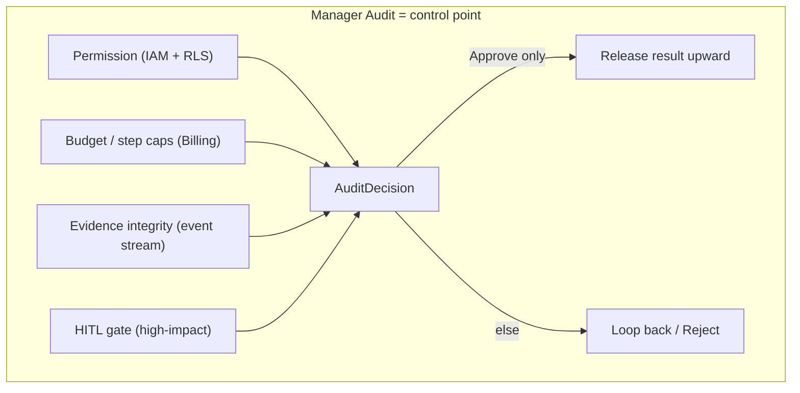

---

## 10. Extensibility

### 10.1 New departments as plugins

A new department is added by registering a **Department manifest** plus a Manager `AgentDefinition` (kind=manager) — no runtime change ([06] §12, canon §5 plugin strategy). Marketplace/third-party departments pass the Administration approval workflow ([05] §4.12).

> Illustrative — design only.

```yaml
# illustrative — design only
departmentManifest:
  department: "legal"
  version: "1.0.0"
  manager: "legal-manager@1.0.0"
  scope: { capabilities: ["legal.contract.review", "legal.clause.extract"] }
  workers:
    - "clause-extraction-agent@1.0.0"
    - "contract-review-agent@1.0.0"
  guardrails: { maxWorkersDispatched: 4, maxWallClockSeconds: 400 }
```

### 10.2 New workers as plugins & versioning

A worker is added by registering a **Worker manifest** (task contract, allow-list, evidence schema) against the owning Manager. All manifests are **SemVer-versioned**, hot-loadable, and sandboxed; a published version is immutable, edits produce a new version, and runs pin the version they executed — identical lifecycle to tool/agent/workflow versioning ([06] §12, [08] §6). A worker plugin cannot broaden permissions beyond what IAM grants.

### 10.3 CEO Manager & cross-department intents

The **CEO Manager** coordinates intents that span departments. Instead of owning workers, it decomposes a cross-cutting intent into **sub-intents**, routes each to the relevant Department Manager, then runs a **meta-audit** over the departments' approved results before returning a single consolidated response. Each Department Manager still audits its own workers; the CEO Manager audits the *departments*. This is the same Manager-Audit pattern applied one tier up, keeping the org uniformly recursive and observable.

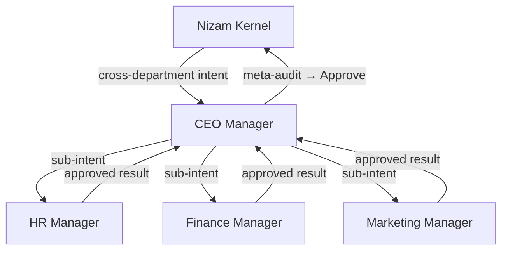

---

## Related Documents

- **[06-Agent-Architecture.md](06-Agent-Architecture.md)** — the generic Agent Framework this document deepens (executor discipline, AgentDefinition/AgentRun, guardrails, memory).
- **[05-Bounded-Contexts.md](05-Bounded-Contexts.md)** — the Agents context boundary, events, and cross-context rules.
- **[07-Tool-Architecture.md](07-Tool-Architecture.md)** — the Tool Registry that workers invoke and through which the Automation Selector is reached.
- **[08-Automation-Architecture.md](08-Automation-Architecture.md)** — the Automation Engine / n8n that the Automation Selector dispatches to.
- **[21-Database-Design.md](21-Database-Design.md)** — Department / Manager / Worker / AgentTask / WorkerEvidence / AuditDecision schema and RLS design.
- **[19-Assumptions.md](19-Assumptions.md)** — recorded gaps and assumptions.

## Change Log

| Version | Date | Author | Change |
|---|---|---|---|
| 1.0.0 | 2026-07-01 | Architecture (Nizam Core) | Initial approved Phase 1 architecture for the two-tier agent hierarchy (Department Manager Agents & Worker Agents) inside the Agents bounded context. |
