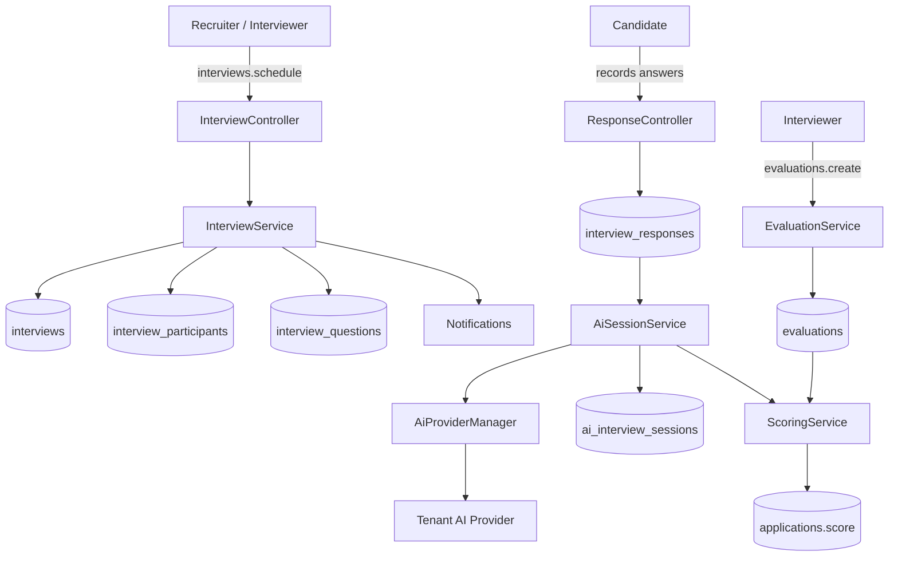
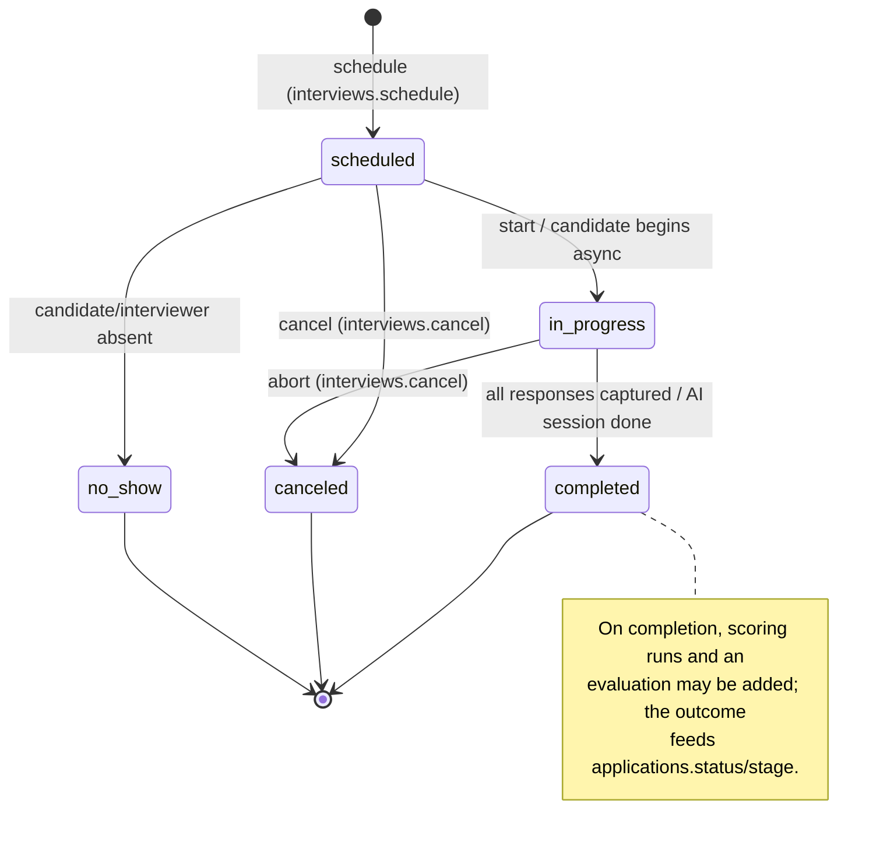
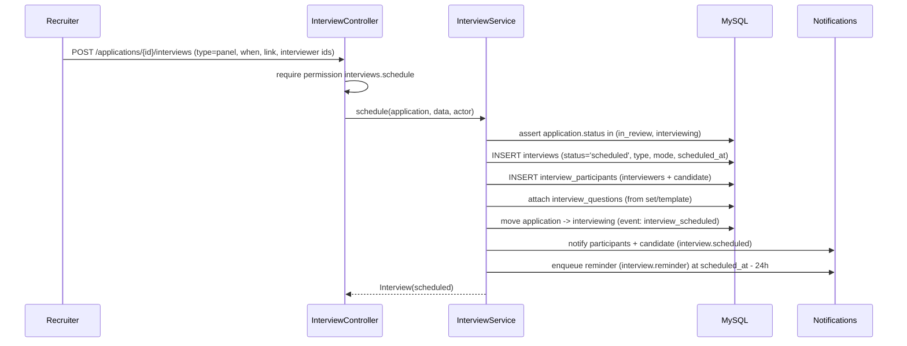
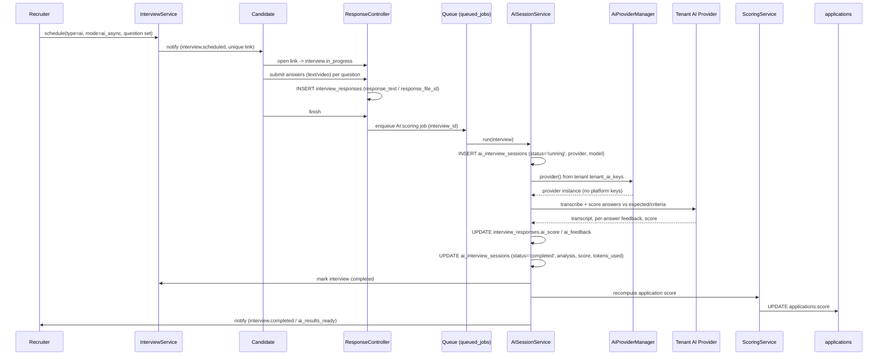

# 23 — Interview Workflow (سير عمل المقابلات)

End-to-end specification for HalaOps interviews: scheduling human/panel and AI/async interviews, participants, question sets, conducting, capturing responses, executing AI sessions, scoring, evaluations/scorecards, and feeding the outcome back into the application's pipeline stage.

## Related Documents

- [18 — AI Interview Engine](18-AI-Interview-Engine.md) — how AI questions are generated, transcribed, and scored.
- [25 — Application Lifecycle](25-Application-Lifecycle.md) — interviews drive an application's `interviewing` status and stage.
- [26 — Notification System](26-Notification-System.md) — interview scheduled / reminder / decision notifications.
- [16 — AI Architecture](16-AI-Architecture.md) — the tenant-provider model used by AI sessions.
- [24 — Job Lifecycle](24-Job-Lifecycle.md) — interviews belong to an application on a job.
- [06 — ERD](06-ERD.md) — relationships across the `interview_*` tables.
- [11 — Permissions Matrix](11-Permissions-Matrix.md) — the `interviews.*` / `evaluations.*` keys.

---

## 1. Purpose (الهدف)

An **interview** is a structured assessment of a candidate for a specific application. HalaOps supports three kinds:

- **human** — one interviewer, live (`video`/`phone`/`onsite`).
- **panel** — multiple interviewers on the same session.
- **ai** — automated, typically **`ai_async`** (the candidate records answers on their own time), executed by the tenant's AI provider.

This document defines the interview **status** state machine, participants, **question sets** (`interview_questions`), conducting and **capturing responses** (`interview_responses`), **AI session execution** (`ai_interview_sessions`), scoring, human **evaluations/scorecards** (`evaluations`), and how the outcome moves the application forward.

## 2. Why It Exists (سبب وجوده)

Interviews are the highest-signal, highest-cost step in hiring, and HalaOps's differentiator is AI-assisted interviewing. The workflow must:

- **Standardise assessment** so every candidate for a role answers a comparable question set and is scored against the same criteria — reducing bias and improving defensibility.
- **Support async at scale.** Recruiters cannot live-interview thousands of applicants; `ai_async` interviews let candidates respond on their schedule and let AI pre-score, surfacing the strongest candidates.
- **Keep humans in control.** Per canonical §9, AI output is **advisory**; final hiring decisions are made by users with `evaluations.manage`. The schema separates machine output (`ai_*`, `interview_responses.ai_score`, `ai_interview_sessions.analysis`) from human judgement (`evaluations.rating`/`recommendation`).
- **Use the tenant's own AI keys.** The platform holds no AI keys; every AI call resolves through `AiProviderManager` from the current tenant's `tenant_ai_keys` (canonical §9).
- **Stay auditable.** Every scheduling, conducting, and decision step is recorded against the application timeline ([25 — Application Lifecycle](25-Application-Lifecycle.md)).

## 3. Architecture

| Component | Responsibility |
| --- | --- |
| `InterviewController` (`app/Controllers/App/InterviewController.php`, planned) | Schedule, reschedule, cancel, show, conduct. Gated by `interviews.*`. |
| `InterviewService` (`app/Services/Recruitment/InterviewService.php`, planned) | Interview state machine, participant management, question-set assembly, side effects. |
| `ResponseController` / candidate portal | Captures candidate answers (`interview_responses`) for async/AI interviews. |
| `AiSessionService` (`app/Services/AI/AiSessionService.php`, planned) | Creates and runs `ai_interview_sessions` via the queue; calls the tenant provider; stores transcript/analysis/score; handles failures/retries. |
| `EvaluationService` (`app/Services/Recruitment/EvaluationService.php`, planned) | Persists human scorecards (`evaluations`) and recommendations. |
| `ScoringService` | Blends AI session score, per-response `ai_score`, and human `evaluations.rating` into `applications.score`. |
| `AiProviderManager` (`app/Services/AI/AiProviderManager.php`, built per canonical §9) | Resolves the active provider from the **tenant's** `tenant_ai_keys` only. |

All interview models are tenant-scoped (`$tenantScoped = true`), exactly like `app/Models/Membership.php`.

## 4. Workflow

### 4.1 Interview status state machine

`interviews.status` ENUM = `scheduled | in_progress | completed | canceled | no_show`. For `ai_async`, "start" happens when the candidate opens the interview link; "completed" happens when the AI session finishes (`ai_interview_sessions.status='completed'`).

### 4.2 Scheduling (human / panel)

### 4.3 AI async interview (sequence)

On provider failure the session is set to `status='failed'` with `error`, the interview stays `in_progress`, the job is retried (with backoff) up to a limit, then moved to `failed_jobs`; a recruiter notification flags manual review.

### 4.4 Conducting & capturing responses (human/panel)

During a live interview, each interviewer records answers/notes; on finish the interview moves to `completed`. Each interviewer then submits a scorecard (`evaluations`) with `criteria`, `rating`, `recommendation`, and `notes`. `ScoringService` aggregates ratings (e.g. mean) into `applications.score`.

### 4.5 Outcome feeding the application

When an interview completes, the recruiter decides the next move on the application ([25 — Application Lifecycle](25-Application-Lifecycle.md)): advance to the next `interview` stage, move to `offer`, or `reject`. The interview never auto-decides; it produces signal (AI score + human scorecards) that informs an explicit `applications.move`/`applications.reject` action, recorded as an `application_events` row.

## 5. Business Rules

1. An interview always belongs to exactly one `application` (and its `job`); scheduling requires the application to be in `in_review` or `interviewing`.
2. Scheduling an interview moves the application to `interviewing` (if not already) and logs an `interview_scheduled` event.
3. `type` ∈ {`ai`,`human`,`panel`}; `mode` ∈ {`video`,`phone`,`onsite`,`ai_async`}. `panel` requires ≥ 2 `interviewer` participants; `ai` requires the tenant to have an active AI credential.
4. The candidate is always an `interview_participants` row with `role='candidate'`; `UQ(interview_id, user_id)` prevents duplicate participants.
5. Question sets are assembled from `interview_questions` (job/company templates where `interview_id IS NULL`, AI-generated where `ai_generated=1`); each question has a `type` (`text`/`video`/`mcq`/`coding`) and an order.
6. AI calls **always** use the current tenant's provider via `AiProviderManager`; the platform never uses its own keys (canonical §9). No active credential ⇒ AI interviews cannot be scheduled.
7. AI outputs (`interview_responses.ai_score`, `ai_feedback`, `ai_interview_sessions.analysis`/`score`) are **advisory**; only `evaluations.manage` holders make final decisions.
8. Cancelling an interview (`interviews.cancel`) requires a reason, notifies participants, and cancels any pending reminder; it does not by itself change the application status.
9. `no_show` is a distinct terminal status (for analytics and rescheduling), separate from `canceled`.
10. Reminders are enqueued at `scheduled_at − 24h` (configurable) and only sent if the interview is still `scheduled`.
11. One AI interview maps to at most one *active* `ai_interview_sessions` row; reruns create a new session (history preserved).
12. Each interviewer may submit at most one `evaluation` per interview (re-submission updates it); evaluations persist even if the interview is later canceled.

## 6. Database Relations

- **`interviews`** (#21): `application_id`→`applications` CASCADE, `job_id`→`jobs` CASCADE; `type`, `mode`, `status`, `scheduled_at`, `duration_minutes`, `location_or_link`, `created_by`→`users` SET NULL. `IDX(workspace_id, application_id, status)`.
- **`interview_participants`** (#22): `interview_id`→`interviews` CASCADE, `user_id`→`users` CASCADE; `role` (`interviewer`/`observer`/`candidate`), `response` (`accepted`/`declined`/`tentative`). `UQ(interview_id, user_id)`.
- **`interview_questions`** (#23): `interview_id`→`interviews` CASCADE (NULL = template); `text`, `type` (`text`/`video`/`mcq`/`coding`), `options` JSON, `expected` JSON, `ai_generated`, `sort_order`.
- **`interview_responses`** (#24): `interview_id`→`interviews` CASCADE, `question_id`→`interview_questions` CASCADE, `user_id`→`users` CASCADE; `response_text`, `response_file_id`→`files` SET NULL, `ai_score`, `ai_feedback` JSON.
- **`ai_interview_sessions`** (#25): `interview_id`→`interviews` CASCADE; `provider`, `model`, `status` (`pending`/`running`/`completed`/`failed`), `transcript` LONGTEXT, `analysis` JSON, `score` DECIMAL(5,2), `tokens_used`, `error`, `started_at`, `completed_at`.
- **`evaluations`** (#26): `application_id`→`applications` CASCADE, `interview_id`→`interviews` SET NULL, `evaluator_id`→`users` SET NULL; `criteria` JSON, `rating` DECIMAL(3,1), `recommendation` (`strong_yes`…`strong_no`), `notes`. `IDX(workspace_id, application_id)`.

All tables carry `workspace_id` (FK→`workspaces`, indexed) and are tenant-scoped at the model layer.

## 7. Permissions

| Action | Permission |
| --- | --- |
| View interviews & responses | `interviews.view` |
| Schedule / reschedule | `interviews.schedule` |
| Conduct (start, capture responses, run AI) | `interviews.conduct` |
| Cancel | `interviews.cancel` |
| View scorecards | `evaluations.view` |
| Submit a scorecard | `evaluations.create` |
| Manage evaluations / make the final call | `evaluations.manage` |

Default mapping ([11 — Permissions Matrix](11-Permissions-Matrix.md)): `owner`/`hr-manager` hold all interview + evaluation perms; `recruiter` holds `interviews.view/schedule/cancel` and `evaluations.view`; `interviewer` holds `interviews.view/conduct` and `evaluations.view/create`; `hiring-manager` holds `interviews.view` and `evaluations.view/manage` (final decision); `candidate` holds none of these — the candidate accesses their own async interview through a signed link plus the `candidate.profile` permission, not the recruiter `interviews.*` keys. A policy gate restricts `interviews.conduct`/`evaluations.create` to interviewers actually listed in `interview_participants` for that interview.

## 8. Validation

- **Schedule**: `type` `required|in:ai,human,panel`; `mode` `required|in:video,phone,onsite,ai_async`; `scheduled_at` `required_unless:mode,ai_async|date|after:now`; `duration_minutes` `nullable|integer|min:5|max:480`; `interviewer_ids` `required_if:type,panel|array`; for `type=ai`, an active `tenant_ai_keys` row must exist.
- **Participants**: each `user_id` `exists:users,id` and an active member of the tenant; candidate auto-added.
- **Questions**: `text` `required|min:3`; `type` `in:text,video,mcq,coding`; `mcq` requires non-empty `options`; `sort_order` integer.
- **Responses**: `response_text` `required_without:response_file` for `text`; `response_file` `mimes:mp4,webm,mov,...|max:51200` for `video`; `mcq` answer must be one of `options`.
- **Evaluation**: `rating` `required|numeric|min:0|max:5` (matches `DECIMAL(3,1)`); `recommendation` `required|in:strong_yes,yes,neutral,no,strong_no`; `criteria` valid JSON; `notes` `nullable|max:5000`.
- **Cancel**: `reason` `required|min:3`.

## 9. Edge Cases

- **No active AI credential** when scheduling `type=ai` → blocked with guidance to configure a provider ([17 — AI Providers](17-AI-Providers.md)).
- **AI provider failure / rate limit** → session `failed` with `error`; retried with backoff; on exhaustion the job goes to `failed_jobs` and a recruiter is notified to score manually. The candidate's responses are never lost.
- **Candidate never opens the async link by the deadline** → interview auto-transitions to `no_show` via a scheduled queue job; a follow-up notification (and optional re-invite) is offered.
- **Partial async submission** (some questions unanswered) → on deadline, the AI session scores what exists and flags incompleteness in `analysis`.
- **Interviewer removed from the company before scoring** → `evaluator_id` is SET NULL; the scorecard remains attached to the interview.
- **Rescheduling** → updates `scheduled_at`, re-notifies, replaces the pending reminder; old time recorded in `application_events.properties`.
- **Duplicate AI runs** (recruiter clicks "re-score") → a new `ai_interview_sessions` row; previous sessions kept for comparison; `ScoringService` uses the latest completed session.
- **Large video uploads** → chunked/resumable upload to `files`; AI transcription reads from storage, not the request.
- **Timezone**: `scheduled_at` stored UTC; displayed in each participant's `users.timezone`.

## 10. Security

- All interview tables are tenant-scoped → automatic `workspace_id` isolation, fail-closed (per `app/Core/Model.php`).
- Candidate async access is via a **signed, expiring** link tied to the interview + candidate; opening it does not grant any recruiter permissions; the candidate sees only their own interview and questions.
- AI keys never leave the tenant boundary; `AiProviderManager` reads encrypted `tenant_ai_keys` (AES-256-GCM) and never platform keys.
- Response media files are `private`, tenant-scoped, served only via authorized signed download routes.
- `interviews.conduct`/`evaluations.create` are restricted by policy gate to listed participants — an interviewer cannot score an interview they were not on.
- CSRF on all writes; transcripts/PII in `ai_interview_sessions` are access-controlled by the same tenant scope and never exposed to candidates.
- Every schedule/cancel/decision writes to the application timeline and `activity_logs` for audit.

## 11. Performance

- `IDX(workspace_id, application_id, status)` drives "interviews for this candidate" and "today's interviews" queries.
- AI execution is fully offloaded to the queue (`queued_jobs`) so the candidate's submit returns instantly and the web tier is never blocked on a provider round-trip.
- Reminders and `no_show` sweeps are batched queue jobs.
- `interview_responses` and `interview_questions` for an interview are batch-loaded (`whereIn`) to avoid N+1 when rendering the interview page.
- `tokens_used` per session enables per-tenant AI cost tracking and rate budgeting.
- LONGTEXT transcripts are stored in `ai_interview_sessions` but excluded from list queries (selected only on the detail view).

## 12. Testing

**Unit:**
- Interview state machine: legal transitions pass, illegal ones throw; `ai_async` start/complete semantics correct.
- `AiSessionService` uses the tenant provider, writes transcript/analysis/score, and handles `failed` + retry.
- Scheduling a `panel` requires ≥ 2 interviewers; `ai` requires an active credential.
- `ScoringService` aggregates per-response AI scores + human ratings deterministically.

**Feature (HTTP):**
- Recruiter schedules a human interview → participants and candidate are notified; reminder enqueued.
- Candidate completes an async AI interview → session runs on the queue → `applications.score` updates → recruiter notified.
- Interviewer submits a scorecard; aggregate score reflects it.
- Cancel notifies participants and cancels the reminder.

**Security:**
- Candidate cannot access another candidate's interview link or any recruiter `interviews.*` route.
- Interviewer not on the panel cannot submit an evaluation (gate denies).
- Cross-tenant isolation across all `interview_*` tables.
- AI calls never fall back to platform keys when a tenant credential is missing (they are blocked instead).

## 13. Future Expansion

- **Live AI interviews** (real-time, beyond `ai_async`) and AI video avatars (HeyGen provider, already in canonical §9 provider list).
- **Calendar integration** (Google/Microsoft) with availability and auto-scheduling.
- **Structured competency frameworks**: reusable `criteria` templates per job family, feeding consistent scorecards.
- **Interview kits**: bundled question sets + rubrics per role, reusing the `interview_questions` template mechanism (`interview_id IS NULL`).
- **Bias/quality analytics** across interviewers (using anonymised aggregate evaluation data).
- **Coding interview execution** sandbox for `type=coding` questions.

## 14. Open Questions

None at this time. The interview workflow is fully specified by the canonical `interview_*`, `ai_interview_sessions`, and `evaluations` schema (#21–#26) and the `interviews.*` / `evaluations.*` permission groups.
