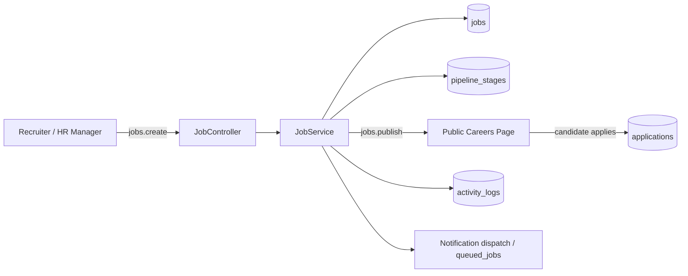
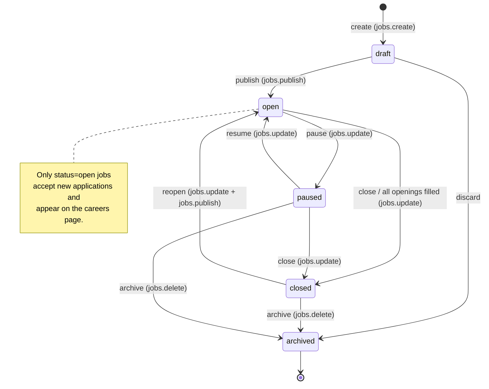
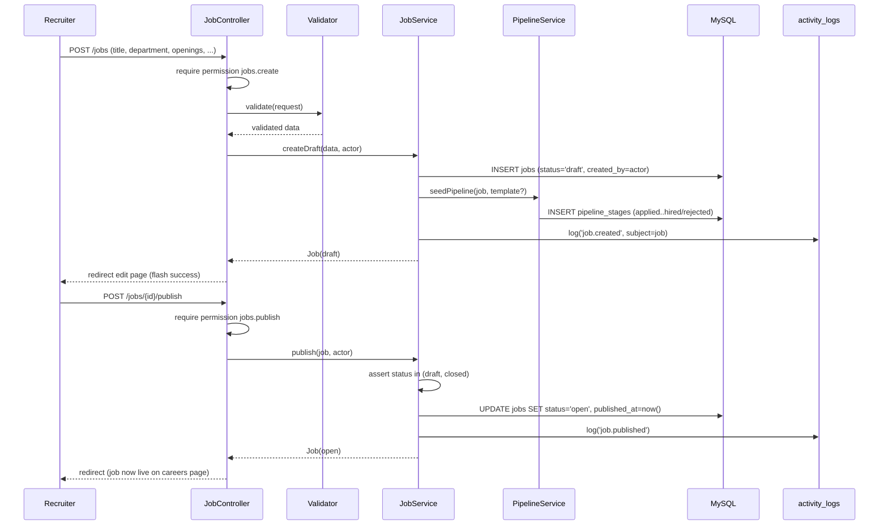

# 24 — Job Lifecycle (دورة حياة الوظيفة)

End-to-end specification for how a **job posting** (`jobs`) is created, configured with a pipeline, published to the public careers page, filled, closed, reopened, cloned, and archived inside a HalaOps tenant.

## Related Documents

- [25 — Application Lifecycle](25-Application-Lifecycle.md) — what happens after a candidate applies to a job.
- [20 — Recruiter Journey](20-Recruiter-Journey.md) — the recruiter-facing UX that drives this lifecycle.
- [23 — Interview Workflow](23-Interview-Workflow.md) — interviews are attached to applications on a job.
- [06 — ERD](06-ERD.md) — full entity-relationship view of `jobs` / `pipeline_stages`.
- [11 — Permissions Matrix](11-Permissions-Matrix.md) — the `jobs.*` permission keys used here.
- [08 — Multi-Tenant](08-Multi-Tenant.md) — `workspace_id` scoping that isolates every job.
- [02 — Business Rules](02-Business-Rules.md) — global recruitment business rules.

---

## 1. Purpose (الهدف)

A **job** is the anchor of the entire recruitment domain. Every application, interview, evaluation, and decision exists *because of* a job. This document defines the job as a finite-state object: its statuses (`draft → open → paused → closed → archived`), the legal transitions between them, who may trigger each transition, what side effects fire (publishing, notifications, openings accounting), and how a job is configured with a hiring **pipeline** of `pipeline_stages`.

The job is the unit that:

- Is authored by a recruiter or HR manager (`jobs.create`).
- Carries a hiring pipeline (`pipeline_stages`) that all its applications flow through.
- Becomes **public** on the tenant careers page when published (`jobs.publish`).
- Tracks how many `openings` remain and auto-suggests closing when filled.
- Owns its applications (`applications.job_id`) and, transitively, the interviews/evaluations under them.

## 2. Why It Exists (سبب وجوده)

Recruitment without an explicit job state machine devolves into ambiguity: candidates apply to roles that are no longer hiring, recruiters interview for positions that were already filled, and public careers pages advertise stale openings. By modelling the job as a strict lifecycle we get:

- **A single source of truth for "is this role hiring?"** — only `status = open` jobs accept new applications and appear publicly.
- **Auditability** — every status change is recorded (timestamps `published_at`, `closed_at`, and an `activity_logs` entry), so HR can answer "when did we stop hiring for X?".
- **Safe public exposure** — the careers page renders exactly the set of currently-open jobs, never drafts or closed roles, and never another tenant's jobs.
- **Capacity control** — `openings` enforces how many hires a job represents, preventing over-hiring and giving headcount visibility.
- **Data-driven pipelines** — each job can use the company default pipeline template or a job-specific one, without code changes (per §2 of the canonical context: extensible without code changes).

## 3. Architecture

| Component | Responsibility |
| --- | --- |
| `JobController` (`app/Controllers/App/JobController.php`, planned) | HTTP entry points: index, create, store, edit, update, publish, pause, close, reopen, clone, archive. Enforces `jobs.*` permissions via the `permission:` middleware. |
| `JobService` (`app/Services/Recruitment/JobService.php`, planned) | All state-machine logic and side effects. The controller never mutates status directly; it calls the service so transitions stay in one place (no duplicated logic — §14). |
| `PipelineService` (`app/Services/Recruitment/PipelineService.php`, planned) | Creates/reorders `pipeline_stages`, seeds the default template, guards against deleting non-empty stages. |
| `Job` model (`app/Models/Job.php`, planned) | Tenant-scoped active record (`$tenantScoped = true`), `$casts` for `openings`/`is_remote`, slug generation. |
| `PipelineStage` model (`app/Models/PipelineStage.php`, planned) | Tenant-scoped; ordered by `sort_order`. |
| Public careers controller (`app/Controllers/Public/CareersController.php`, planned) | Renders open jobs via `withoutTenantScope()` filtered explicitly by the requested company slug — the one place a job is read outside the logged-in tenant context, still company-bounded. |

The `Job` model follows the same shape as `app/Models/Membership.php`: `protected static bool $tenantScoped = true;` so `Job::query()` automatically appends `WHERE workspace_id = :active` and fails closed when no tenant is active.

## 4. Workflow

### 4.1 Job status state machine

### 4.2 Creating and publishing a job (sequence)

### 4.3 Closing when filled

When an application transitions to `hired` (see [25 — Application Lifecycle](25-Application-Lifecycle.md)), `JobService::onApplicationHired()` decrements the *remaining* openings (computed as `openings - count(applications WHERE status='hired')`). When remaining reaches zero it does **not** auto-close silently; it sets an advisory flag and dispatches an in-app notification to the job owner suggesting closure, preserving human-in-the-loop control. A user with `jobs.update` confirms the close.

### 4.4 Cloning

`JobService::clone(job, actor)` copies the job row (new slug `{slug}-copy`, `status='draft'`, `published_at=NULL`, `closed_at=NULL`, `created_by=actor`) and deep-copies its `pipeline_stages`. Applications, interviews, and evaluations are **never** copied — only the job definition and its pipeline template.

## 5. Business Rules

1. A job is always created in `draft`; it is invisible to candidates until published.
2. Only `status = open` jobs accept new applications and appear on the public careers page.
3. `publish` is allowed only from `draft` or `closed`; it stamps `published_at` (first time) and clears `closed_at`.
4. `pause` (from `open`) hides the job from the careers page and stops new applications but **keeps existing applications fully workable** — interviews and evaluations continue.
5. `close` stamps `closed_at`, removes the job from the careers page, and stops new applications; in-flight applications may still be progressed to a decision.
6. `reopen` (from `closed`) requires both `jobs.update` and `jobs.publish`; it returns the job to `open` and re-exposes it publicly.
7. `archive` is a soft retirement: archived jobs are hidden from all default lists, are read-only, and cannot be reopened (must be cloned instead).
8. `openings` must be `>= 1`. "Remaining openings" = `openings − hired count`; it may reach 0 but the job is not force-closed automatically.
9. A job's `slug` is unique per company (`UQ(workspace_id, slug)`), generated from the title and de-collided with a numeric suffix.
10. Deleting (hard) a job is **not** a normal operation; `jobs.delete` performs *archive*. True deletion is reserved for super-admin tooling and cascades to applications/interviews/evaluations via FK `ON DELETE CASCADE`.
11. A job must have at least one `pipeline_stage` of type `applied` and one terminal stage (`hired` or `rejected`) before it can be published.
12. Every status transition writes an `activity_logs` entry (`action` = `job.published`, `job.paused`, `job.closed`, `job.reopened`, `job.archived`, `job.cloned`).
13. Ownership: `created_by` is the author; the job belongs to the **company**, so any user with the relevant `jobs.*` permission in that tenant may manage it (capability comes from roles, never from `created_by` — §2 of canonical context).

## 6. Database Relations

Primary table — **`jobs`** (tenant, planned #17):

| Column | Type / Notes |
| --- | --- |
| `id` | BIGINT UNSIGNED PK |
| `workspace_id` | FK → `workspaces(id)` ON DELETE CASCADE, indexed (tenant scope) |
| `title`, `description` | VARCHAR / TEXT |
| `slug` | VARCHAR — `UQ(workspace_id, slug)` |
| `department`, `location` | VARCHAR NULL |
| `employment_type` | ENUM(`full_time`,`part_time`,`contract`,`intern`,`remote`) |
| `status` | ENUM(`draft`,`open`,`paused`,`closed`,`archived`) DEFAULT `draft` |
| `openings` | INT DEFAULT 1 |
| `salary_min`, `salary_max`, `currency` | DECIMAL / VARCHAR(3) NULL |
| `is_remote` | TINYINT(1) |
| `created_by` | FK → `users(id)` ON DELETE SET NULL |
| `published_at`, `closed_at` | TIMESTAMP NULL |
| `created_at`, `updated_at` | TIMESTAMP NULL |

Indexes: `UQ(workspace_id, slug)`, `IDX(workspace_id, status)` (drives both the dashboard job list and the careers-page query).

Related tables:

- **`pipeline_stages`** (#18): `job_id` → `jobs(id)` ON DELETE CASCADE; `job_id = NULL` rows are the **company default template** cloned into every new job. `type` ENUM(`applied`,`screening`,`interview`,`offer`,`hired`,`rejected`); ordered by `sort_order`. `IDX(workspace_id, job_id)`.
- **`applications`** (#19): `job_id` → `jobs(id)` ON DELETE CASCADE. The `UQ(workspace_id, job_id, user_id)` constraint enforces one application per candidate per job.
- **`interviews`** (#21) and **`evaluations`** (#26) reference `job_id` / `application_id` and cascade from the job.

## 7. Permissions

Gated by the `jobs.*` group (canonical §6 planned domain groups):

| Action | Permission |
| --- | --- |
| List / view jobs and pipelines | `jobs.view` |
| Create a draft job, edit a draft pipeline | `jobs.create` |
| Update job fields, pause, resume, close, reopen, edit pipeline of a live job | `jobs.update` |
| Publish / unpublish (careers-page exposure), reopen exposure | `jobs.publish` |
| Archive (the user-facing "delete") | `jobs.delete` |

Default role mapping (from canonical §6 default role catalogue, refined in [11 — Permissions Matrix](11-Permissions-Matrix.md)): `owner` and `hr-manager` hold all `jobs.*`; `recruiter` holds `jobs.view/create/update/publish` but typically not `jobs.delete`; `hiring-manager` holds `jobs.view` (and `jobs.update` for their own departments via a policy gate); `interviewer`/`member`/`candidate` hold none (candidates see the public careers page, which is unauthenticated).

Policy gates (`AccessControl::define`) add context: a `hiring-manager` may `jobs.update` only jobs in their department; the careers page bypasses RBAC entirely but is bounded to a single company slug and `status = open`.

## 8. Validation

- `title`: `required|min:3|max:160`.
- `slug`: auto-generated; if user-supplied, `regex:/^[a-z0-9-]+$/|unique:jobs,slug,company`. (Uniqueness is per-company.)
- `employment_type`: `required|in:full_time,part_time,contract,intern,remote`.
- `status`: never accepted from the client on create (forced to `draft`); transitions go through dedicated endpoints, not a free-form status field.
- `openings`: `required|integer|min:1|max:9999`.
- `salary_min` / `salary_max`: `nullable|numeric|min:0`; if both present, `salary_max >= salary_min`.
- `currency`: `nullable|in:SAR,USD,EUR,AED,...` (3-letter ISO, default `SAR`).
- `description`: `required|min:20` before publish (a draft may be saved with a shorter description, but `publish` re-validates).
- Pipeline: at least one `applied` stage and one terminal stage required to publish (server-enforced in `JobService::publish`).

## 9. Edge Cases

- **Publish with empty pipeline** → blocked with a validation error pointing at pipeline configuration.
- **Two recruiters create the same slug concurrently** → DB `UQ(workspace_id, slug)` rejects the second; service catches the duplicate-key error and retries with an incremented suffix.
- **Applicant submits to a job that was paused/closed mid-session** → application endpoint re-checks `status = open` at write time and returns a friendly "this position is no longer accepting applications" error.
- **Closing a job with open interviews** → allowed; interviews and decisions continue. Closing only stops *new* applications and public exposure.
- **Deleting a pipeline stage that has applications** → blocked; the user must first move applications to another stage (`PipelineService` checks `applications.current_stage_id`).
- **Reopening an archived job** → not permitted; UI offers "Clone" instead.
- **Tenant has no default pipeline template** → `PipelineService::seedPipeline` falls back to a built-in canonical template (`applied → screening → interview → offer → hired`/`rejected`).
- **`created_by` user removed from company** → FK `SET NULL`; the job remains owned by the company and fully manageable by others.

## 10. Security

- Every read/write goes through the tenant-scoped `Job` model → automatic `workspace_id` filter, fail-closed when no tenant (per `app/Core/Model.php`).
- The careers page is the only unauthenticated read path; it uses `withoutTenantScope()` but **must** bind to the resolved company id from the requested slug and `status = open`, never returning drafts, paused, closed, archived, or other tenants' jobs.
- All state-changing routes are POST with CSRF tokens (`csrf_field()`), gated by `permission:` middleware.
- Status is never mass-assigned from request input (kept out of `$fillable`-driven create paths for client data); transitions are explicit service calls — prevents a forged `status=open` field from bypassing publish rules.
- `activity_logs` captures actor, ip, and user-agent for every transition for audit ([38 — Audit-System](38-Audit-System.md)).

## 11. Performance

- `IDX(workspace_id, status)` makes both the tenant job list (`WHERE workspace_id=? AND status=?`) and the careers-page query covering and fast.
- Job lists are paginated via `QueryBuilder::paginate`.
- The careers page is a high-traffic public hot path: cache the rendered open-jobs list per company with a short TTL, invalidated on any job transition.
- `pipeline_stages` are few per job (typically 4–7) and eager-loaded in a single `WHERE job_id IN (...)` query to avoid N+1 when rendering a job board.
- FULLTEXT search on `jobs(title, description)` (see [28 — Search-System](28-Search-System.md)) is always tenant-filtered.

## 12. Testing

**Unit (JobService / PipelineService):**
- `createDraft` always yields `status='draft'`, stamps `created_by`, and seeds a pipeline.
- `publish` rejects jobs missing an `applied`/terminal stage.
- Each illegal transition (e.g. `archived → open`) throws.
- `clone` copies job + stages but no applications/interviews; new status is `draft`.
- Remaining-openings math: hiring the Nth candidate fires the "suggest close" notification exactly once.

**Feature (HTTP):**
- A recruiter can create → publish → pause → resume → close → reopen a job.
- A published job appears on `/careers/{company}`; a paused/closed one does not.
- Slug collision is auto-resolved.

**Security:**
- A user without `jobs.publish` is `403` on the publish route.
- Tenant isolation: company A cannot view/edit company B's job by guessing its id (404 via scoped `findOrFail`).
- The careers page never leaks non-open jobs or cross-tenant jobs.
- Forged `status` form field cannot move a job to `open` without going through `publish`.

## 13. Future Expansion

- **Approval workflow**: an optional `pending_approval` status between `draft` and `open` for tenants that require a hiring manager sign-off (additive enum value + one gate).
- **Scheduled publish/close**: `publish_at` / `close_at` processed by the queue worker (`queued_jobs`).
- **Job templates library**: reusable job definitions at the company level, building on the existing pipeline-template mechanism.
- **Requisition headcount linkage**: tie `openings` to a future `requisitions` table for budget approval.
- **Multi-location postings**: normalise `location` into a related table without altering the core state machine.

## 14. Open Questions

None at this time. The job lifecycle is fully specified by the canonical schema (#17–#18) and the `jobs.*` permission group; any future statuses are additive enum values that do not break existing transitions.
