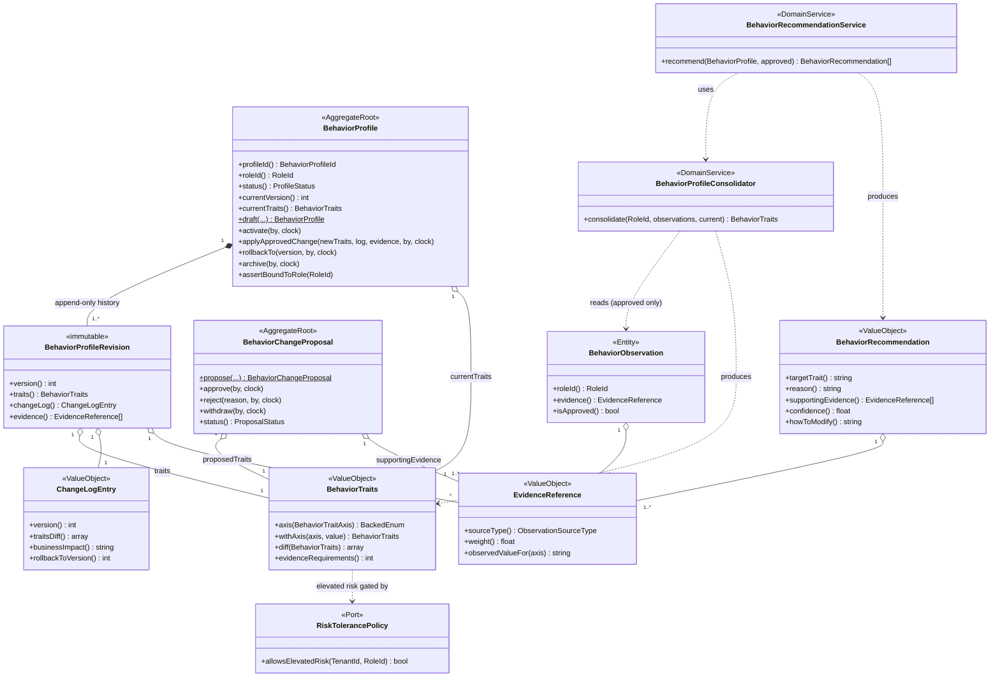
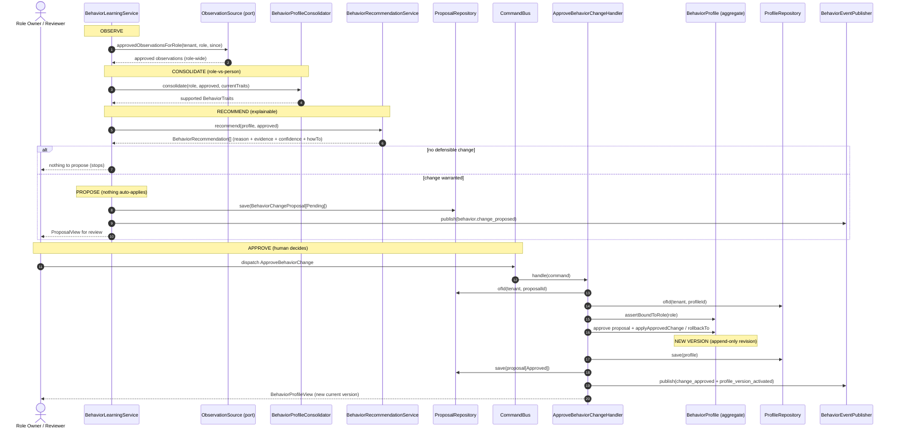
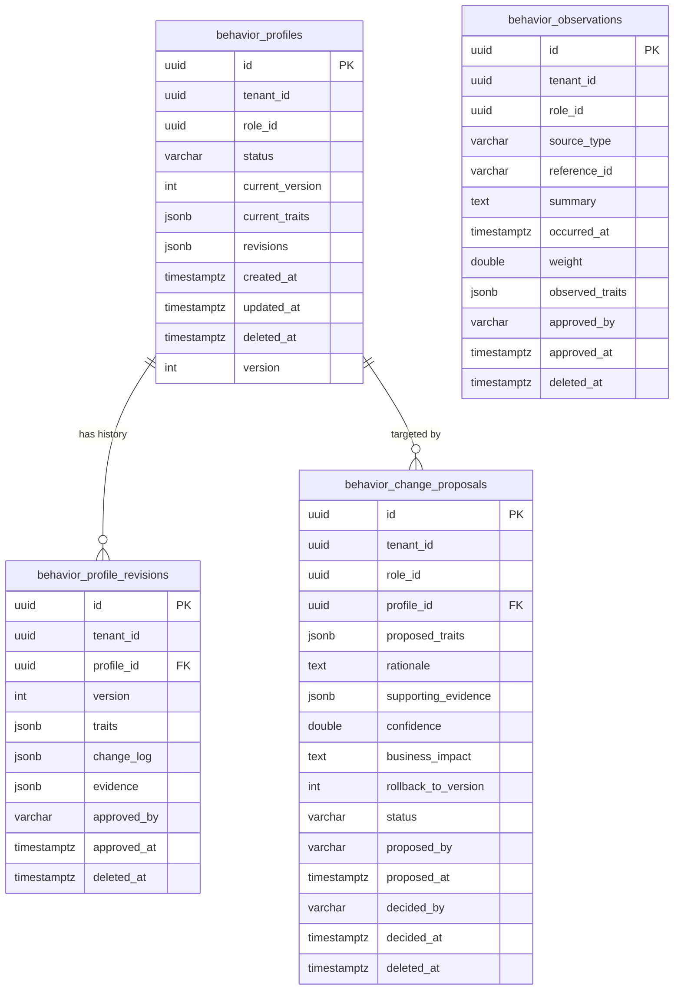

# 24 — Professional Behavior Engine (Behavior Bounded Context)

> How Nizam models *the way work is performed* as transparent, versioned, explainable, approval-gated **professional behavior profiles** — learned only from approved business practice and bound to the **role**, never to a person. The engine recommends; the owner decides.

**Status:** Implemented (Phase — Behavior Engine) | **Version:** 1.0.0 | **Last updated:** 2026-07-01 | **Owner:** Architecture (Nizam Core)

---

## 1. Purpose

The Professional Behavior Engine is the Behavior bounded context (`Nizam\Behavior\*`, `src/Behavior/`). It answers a question every other context assumes but none owns: **how** should a given role behave when it performs work — how it decides, communicates, escalates, delegates, documents, negotiates, tolerates risk, and holds quality?

It models that "how" as a **behavior profile**: a structured, machine-readable description of a role's professional conduct, expressed across fourteen orthogonal *style axes*. A profile is:

- **Learned from approved practice, never invented.** The only inputs that may shape a role's behavior are *approved observations* — pieces of real business practice (an approved decision, a passed quality review, a standard operating procedure) that a human has signed off on.
- **Bound to the role, not the person.** A profile belongs to a `RoleId`. It is consolidated from the approved practice of *all* the people performing that role, so it captures how the *role* is done well, not how any one individual works. See §3.
- **Versioned, append-only, and reversible.** Every change appends an immutable revision; nothing is ever overwritten; any earlier version can be restored as a new version. See §5.
- **Explainable.** Every recommended change carries a reason, the approved evidence behind it, a confidence, and concrete how-to guidance. See §5.4.
- **Approval-gated.** The engine only ever *recommends*. It raises a **proposal**; a human approves it; only then is a new version activated. Nothing auto-applies. See §5.

This is the operational embodiment of the product principle **"AI recommends, the owner decides"** (see `docs/PRODUCT_PRINCIPLES.md`) applied to organizational behavior, and it is codified in **ADR-0019** (`docs/16-ADR.md`).

### 1.1 Where it sits

The context is pure Hexagonal / DDD per **ADR-0007** and framework-independent per **ADR-0015**: the domain depends only on PHP and `Nizam\Kernel\*`; all I/O is behind ports in `Infrastructure/`. It is a modular-monolith module (**ADR-0001**), UUIDv7-keyed (**ADR-0003**), tenant-scoped and soft-delete/audit-column aware (**ADR-0002**, **ADR-0011**), and event-recording (**ADR-0004**) — every state change records a domain event for the platform to publish.

---

## 2. The role-vs-person principle

> **Behavior belongs to a role, not to an individual.**

This is the single most important design decision in the context, and it is enforced structurally rather than merely documented.

- A `BehaviorProfile` is bound to a `RoleId` at creation and can **never** be re-bound (the binding is `readonly`; `assertBoundToRole()` rejects any change whose role differs, throwing `ImmutableRoleBindingException`).
- Behavior is derived by **consolidating the approved practice of every employee performing the role** (`BehaviorProfileConsolidator`, §4). No single person's practice is copied; instead, each of the fourteen axes is decided by a **weighted majority vote** across all approved observations for the role. The "star performer" and the "new hire" both feed the same consolidation; the role's behavior is what the *approved corpus* supports, not what any one person does.
- Observations are keyed by `(tenant_id, role_id)`, never by a person identifier. The engine has no concept of, and stores no reference to, *who* an observation belongs to — only the *role* and the *approved evidence*. This is deliberate: it protects individual privacy and avoids the brittleness of cloning a specific person's behavior (see ADR-0019, *Alternatives*).

The practical payoff: when a person leaves, joins, or moves roles, the role's behavior profile is unaffected in kind — it continues to reflect the consolidated approved practice of whoever now performs the role. Behavior is an asset of the organization, attached to the function, not a fragile imprint of an individual.

---

## 3. Domain model

All types below live under `Nizam\Behavior\Domain\`. The domain is pure PHP on `Nizam\Kernel\*` (identifiers, `AggregateRoot`/`Entity`/`ValueObject`, `DomainEvent`, `Clock`, `TenantId`).

### 3.1 Aggregates, entities, and records

| Type | Kind | Responsibility |
|------|------|----------------|
| `BehaviorProfile` | Aggregate root | The versioned, role-bound behavior of a role. Owns an append-only list of revisions; enforces every state-change invariant; records domain events. |
| `BehaviorChangeProposal` | Aggregate root | A reviewable, approval-gated request to change a profile. Holds proposed traits + full justification; `approve()`/`reject()`/`withdraw()`. Nothing auto-applies. |
| `BehaviorObservation` | Entity | One recorded, role-bound piece of business practice, with its approval state. Only `isApproved() === true` observations may drive evolution. |
| `BehaviorProfileRevision` | Immutable record | One versioned snapshot in a profile's history: the traits in force, the change-log entry, the approver + instant, and the approved evidence relied upon. Created once, never mutated. |

### 3.2 Identifiers

`RoleId`, `BehaviorProfileId`, `ProposalId`, `ObservationId` — each an empty `final class … extends Nizam\Kernel\Domain\Identifier {}` (UUIDv7; minted via `::generate()`, rehydrated via `::fromString()`). Tenancy uses `Nizam\Kernel\Domain\TenantId`.

### 3.3 Value objects

| Value object | What it captures |
|--------------|------------------|
| `BehaviorTraits` | The complete, immutable trait set: the fourteen style axes + `evidenceRequirements` (minimum approved evidences a change must supply). `with*()` copy-methods, `withAxis()`/`axis()` generic access, `diff()`, `equals()`, `toArray()`. Elevated risk can only be constructed through the policy-guarded factory. |
| `EvidenceReference` | An immutable pointer to one approved practice: `sourceType`, `referenceId`, `summary`, `occurredAt`, normalized `weight` (0..1), and the per-axis `observedTraits` signal the consolidator votes on. |
| `BehaviorRecommendation` | A fully explainable suggestion to change one trait: `targetTrait`, `currentValue`, `recommendedValue`, `reason`, non-empty `supportingEvidence`, `confidence` (0..1), `howToModify`. Every field is required (explainability invariant). |
| `ChangeLogEntry` | The audit record for one version: `version`, `changedAt`, `changedBy`, `summary`, `traitsDiff`, `businessImpact`, optional `rollbackToVersion`. |

### 3.4 Style axes and status enums

Native backed string enums under `Domain/Enum/`. The **fourteen behavior style axes**:

`DecisionStyle`, `CommunicationStyle`, `ApprovalStyle`, `EscalationStyle`, `RiskTolerance`, `PriorityStrategy`, `DelegationStrategy`, `PlanningStrategy`, `FollowUpStrategy`, `DocumentationStyle`, `MeetingStyle`, `NegotiationStyle`, `CustomerInteractionStyle`, `QualityExpectation`.

`BehaviorTraitAxis` is the registry enum that lets the domain address any axis generically (its `enumClass()`/`accepts()` drive deterministic, type-safe consolidation). Lifecycle enums: `ProfileStatus{Draft, Active, Superseded, Archived}`, `ProposalStatus{Pending, Approved, Rejected, Withdrawn}`. Provenance: `ObservationSourceType{ApprovedDecision, TaskExecution, ManagerReview, BusinessPolicy, StandardOperatingProcedure, KnowledgeBase, ApprovedException, Escalation, CommunicationOutcome, QualityReview}`.

> **Elevated risk is privileged.** `RiskTolerance::Elevated` can only be adopted when a `RiskTolerancePolicy` permits it; the plain `BehaviorTraits::create()` forbids it outright, and the consolidator clamps any winning elevated vote back to `Balanced` because it has no policy authority.

### 3.5 Domain events

All implement `Nizam\Kernel\Domain\DomainEvent` (`occurredAt()`, `eventName()`, `aggregateId()`), recorded by aggregate mutators and pulled by handlers for publication.

| Event | `eventName()` | Emitted when |
|-------|---------------|--------------|
| `BehaviorProfileDrafted` | `behavior.profile_drafted` | A profile is drafted at version 1. |
| `BehaviorProfileActivated` | `behavior.profile_activated` | A draft profile is activated. |
| `BehaviorChangeProposed` | `behavior.change_proposed` | A proposal is raised. |
| `BehaviorChangeApproved` | `behavior.change_approved` | A proposal is approved. |
| `BehaviorChangeRejected` | `behavior.change_rejected` | A proposal is rejected. |
| `BehaviorChangeWithdrawn` | `behavior.change_withdrawn` | A proposal is withdrawn. |
| `BehaviorProfileVersionActivated` | `behavior.profile_version_activated` | An approved change is applied as a new version. |
| `BehaviorProfileRolledBack` | `behavior.profile_rolled_back` | A profile is rolled back to an earlier version. |
| `BehaviorProfileArchived` | `behavior.profile_archived` | A profile is archived. |

### 3.6 Domain services and ports

- `BehaviorProfileConsolidator` — folds approved observations across all employees in a role into one `BehaviorTraits` by deterministic per-axis weighted majority vote (§4).
- `BehaviorRecommendationService` — compares a profile's current traits against what the approved evidence supports and emits one explainable `BehaviorRecommendation` per trait that should change.
- `RiskTolerancePolicy` (port) — `allowsElevatedRisk(TenantId, RoleId): bool`.
- Persistence ports: `BehaviorProfileRepository`, `BehaviorChangeProposalRepository`, `ObservationSource` (approved practice source), `BehaviorEventPublisher` (dispatches pulled events).

### 3.7 Class diagram



---

## 4. Role-vs-person consolidation (how learning is computed)

`BehaviorProfileConsolidator::consolidate(RoleId, approvedAcrossEmployees, ?current)` is deterministic and explainable:

1. **Reject anything unapproved.** Every input must be an approved `BehaviorObservation` for the given role, or consolidation asserts and fails. Unapproved practice can never shape behavior.
2. **Per-axis weighted majority vote.** For each of the fourteen axes, every observation whose evidence attests a value casts a vote weighted by that evidence's normalized `weight`. The highest-weighted value wins and is applied over the baseline. **Ties, and axes on which no approved practice speaks, keep the baseline** — the engine only moves an axis when approved practice justifies it, and never invents a value from nothing. Vote order is fixed (axis registry order, then enum case order), so the result is reproducible.
3. **Conservative baseline.** When a role has no existing profile, consolidation starts from a low-risk default (`Consultative`, `Concise`, `SingleApprover`, `OnThreshold`, `Low` risk, …) rather than from nothing.
4. **Evidence bar scales with corroboration.** The number of distinct approved practices and their cumulative weight set the resulting `evidenceRequirements` (clamped to 1..5): a well-established role is not cheaply re-shaped by thin evidence.
5. **No elevated risk here.** The consolidator has no policy authority, so a winning `Elevated` vote is clamped to at most `Balanced`; any true elevation must go through the policy-gated path.

`BehaviorRecommendationService` uses the *same* consolidation to compute the traits the evidence supports, diffs them against the profile's current traits, and emits one recommendation per differing trait — each carrying reason, supporting evidence, a confidence derived from evidence strength, and how-to guidance.

---

## 5. Versioning, approval, explainability, and rollback

### 5.1 The learning loop (observe → consolidate → recommend → propose → approve → new version)

The whole cycle is orchestrated by `Application\Service\BehaviorLearningService::learn()`, which **only ever creates a pending proposal** — it reads the profile but never saves it, and never activates, applies, or rolls back anything. Approval and application are separate, deliberate steps taken by a human through the command bus.



### 5.2 Versioning (append-only)

A profile is the ordered sequence of its `BehaviorProfileRevision`s. `draft()` creates version 1. `applyApprovedChange()` increments the version, appends a new immutable revision (traits + change-log + approver + evidence), and updates `currentTraits`. **Past revisions are never mutated or deleted** — history is a permanent audit ledger.

### 5.3 Approval gate

`BehaviorLearningService` and `ProposeBehaviorChange` produce a **pending** `BehaviorChangeProposal` and nothing more. Only `ApproveBehaviorChange` (dispatched by a human) approves the proposal and applies it; `RejectBehaviorChange` closes it without effect. Applying is guarded: the profile must accept changes (`Draft`/`Active`), the new traits must actually differ (`NoBehaviorChangeException`), and the approved evidence count must meet `evidenceRequirements` (`InsufficientEvidenceException`).

### 5.4 Explainability

Every recommendation carries `reason`, non-empty `supportingEvidence`, `confidence`, and `howToModify` (enforced in the VO constructor). Every applied change carries a `ChangeLogEntry` with a per-trait `traitsDiff` and a stated `businessImpact`. The `ExplainBehaviorProfile` query returns the current recommendations + evidence for a profile without mutating anything, so a reviewer can always see *why* a change is suggested and *what* it would alter.

### 5.5 Rollback (reversible, append-only)

`rollbackTo(version, by, clock)` restores an earlier revision's traits **as a brand-new, higher version** whose change-log records the rollback source (`rollbackToVersion`). History is never rewritten, so a rollback can itself be rolled back. An unknown target version throws `UnknownRevisionException`.

---

## 6. Database schema

Design source of record: `src/Behavior/Infrastructure/Migration/001_create_behavior_tables.sql` (PostgreSQL 16). A structurally-equivalent runnable schema for integration tests lives in `SqliteSchema::apply(PDO)`. Conventions per ADR-0002/0003/0011: UUIDv7 PKs, `tenant_id UUID NOT NULL` on every table, `created_at`/`updated_at`/`created_by`/`updated_by`, nullable `deleted_at` (soft delete), `version` optimistic-concurrency counter, and JSONB documents for trait sets / revision history / evidence (encoded by `BehaviorMapper`). Reads filter `(tenant_id, …, deleted_at IS NULL)`; a partial unique index enforces one live profile per `(tenant_id, role_id)`.



- **`behavior_profiles`** — the aggregate. Embeds `revisions` as JSONB for single-read hydration; partial unique + lookup indexes on `(tenant_id, role_id)` and `(tenant_id, status)` where `deleted_at IS NULL`.
- **`behavior_profile_revisions`** — normalized, durable, queryable audit ledger of the append-only history; FK to the profile, unique `(profile_id, version)`; rows are never updated or deleted.
- **`behavior_change_proposals`** — the reviewable, approval-gated request; FK to the profile; index on `(tenant_id, status, proposed_at)` for the pending queue; `confidence` checked to `[0,1]`.
- **`behavior_observations`** — approved business practice; only rows with `approved_at IS NOT NULL` drive evolution (the read adapter's partial index enforces this).

---

## 7. Public surface

A host installs the context once via the module facade:

```php
BehaviorModule::register($container);                          // in-memory adapters
BehaviorModule::register($container, PersistenceDriver::Pdo);  // durable PDO adapters (bind a shared PDO)
```

`BehaviorServiceProvider` binds ports → adapters and registers all handlers on the platform buses. After installation the context is driven **only** through its stable seam:

### 7.1 Command bus (`Nizam\Kernel\Application\CommandBus`)

Dispatch the `Application\Command` DTOs:

| Command | Effect |
|---------|--------|
| `DraftBehaviorProfile` | Draft a new profile (v1, Draft) for a role. |
| `ProposeBehaviorChange` | Build a pending proposal from a role's approved practice (observe → consolidate → recommend). Nothing auto-applies. |
| `ApproveBehaviorChange` | Approve a pending proposal and apply it — a new appended version, or a rollback if the proposal targets an earlier version. |
| `RejectBehaviorChange` | Reject a pending proposal (no effect on behavior). |
| `RollbackBehaviorProfile` | Roll a profile back to an earlier version as a new version. |
| `ArchiveBehaviorProfile` | Archive a profile, retiring it while retaining its history. |

### 7.2 Query bus (`Nizam\Kernel\Application\QueryBus`)

Dispatch the `Application\Query` DTOs, returning scalar-only read models (`Dto/`):

| Query | Returns |
|-------|---------|
| `GetBehaviorProfile` | `BehaviorProfileView` — current status/version/traits. |
| `GetBehaviorProfileHistory` | `BehaviorRevisionView[]` — the append-only revision history. |
| `ListPendingProposals` | `ProposalView[]` — the tenant's pending review queue. |
| `ExplainBehaviorProfile` | `RecommendationView[]` — current explainable recommendations + evidence. |

### 7.3 Application service

`Application\Service\BehaviorLearningService::learn(tenant, role, proposedBy, ?since)` — the learning loop that raises a `ProposalView` from a role's approved practice, and **creates a proposal only** (never mutates a profile).

### 7.4 Deferred Interface layer

HTTP/Console adapters are the outermost pluggable layer and will sit on top of this surface once the HTTP/Console platform lands (ADR-0007). The `BehaviorModule` facade is the seam; the context is architecturally complete without them.

---

## 8. Non-technical screen spec — "Behavior Review"

> This section specifies the operator-facing screen per **ADR-0012** and `docs/22-UIUX-Guidelines.md` (Basic/Advanced mode, plain language, bilingual AR/EN, a `(!)` Help Popup on every input). It is the human window onto the approval gate: this is where the owner *decides*.

### 8.1 What does this page do?

**Behavior Review** shows you how a **role** in your company is set to work — its way of deciding, communicating, escalating, delegating, documenting, and holding quality — and any **suggested improvements** the system has learned from your own approved work. It shows each suggestion in plain words, with the real approved examples behind it, and lets you **Approve** or **Decline** each one. Nothing changes on its own: a suggestion becomes real only after *you* approve it.

### 8.2 When to use it

- When the system tells you it has **new suggestions** for a role (a pending proposal).
- When you want to **see how a role currently behaves** and why.
- When you want to **undo** a recent change and go back to how the role worked before (rollback).
- Periodically, to keep a role's behavior aligned with your best approved practice.

### 8.3 What happens if you change it

- Approving a suggestion creates a **new version** of the role's behavior. The old version is **kept** — nothing is lost, and you can go back to it at any time.
- Declining a suggestion changes nothing; it is simply closed.
- Every change records **who** approved it, **when**, **what** changed, and **why**, so there is always a clear trail.
- Changes affect the **role**, so they apply to everyone doing that role — not to any one person.

### 8.4 Basic vs Advanced mode

- **Basic mode (default).** Shows the role name, a one-line plain summary of each suggestion ("Decisions: from *Directive* to *Consultative* — because 6 approved decisions were reached by consulting the team"), the confidence as **Low / Medium / High**, and two buttons: **Approve** and **Decline**. The fourteen technical axes are hidden; the current behavior is summarized in friendly language.
- **Advanced mode.** Reveals the full fourteen-axis trait table with the exact before → after diff, the numeric confidence, the full evidence list (each approved item, its type, date, and weight), the `evidenceRequirements` bar, the version history with rollback controls, and the raw business-impact statement. Elevated risk is only offered here, and only when policy allows it.

### 8.5 Inputs and their Help Popups

Every input carries a `(!)` icon opening a Help Popup. Per this screen's convention, **each Help Popup MUST contain all 8 required fields** below (a focused adaptation of the platform Help Popup in `docs/22-UIUX-Guidelines.md` §6):

| # | Help Popup field | What it answers |
|---|------------------|-----------------|
| 1 | **What is this?** | A plain definition of the input (e.g., "The role whose way of working you are reviewing"). No jargon. |
| 2 | **Why does it matter?** | What the system does with it / what this decision affects. |
| 3 | **Example** | A realistic, safe sample value or choice. |
| 4 | **Is it required?** | Whether you must set it, and what happens if you leave it. |
| 5 | **Where does this come from?** | The source of the value or suggestion (e.g., "learned from your approved decisions and reviews"). |
| 6 | **How do I decide?** | Step-by-step guidance for making the choice (e.g., how to read the evidence before approving). |
| 7 | **Common mistakes** | The 1–3 most frequent errors and how to avoid them (e.g., "Approving without opening the evidence"). |
| 8 | **What if I change it?** | The effect of changing/approving, including that a new version is created and the old one is kept (reversible). |

Screen inputs, each with the 8-field Help Popup:

| Input | Purpose |
|-------|---------|
| **Role selector** | Choose which role's behavior to review. |
| **Suggestion Approve / Decline** | The decision control for each pending suggestion (proposal). |
| **Evidence viewer** | Opens the approved examples behind a suggestion (read-only). |
| **Confidence indicator** | Shows how strongly the evidence supports the suggestion (Low/Medium/High). |
| **Version history / Rollback** | View past versions and restore an earlier one as a new version. |
| **(Advanced) Trait axis editors** | The fourteen style axes, each editable with its own before → after. |
| **(Advanced) Risk tolerance** | Only shows "Elevated" when policy allows it; explained in its Help Popup. |
| **(Advanced) Evidence requirement** | The minimum approved examples a future change must supply. |

Empty states guide the first action ("No suggestions right now — the role's behavior already matches your approved practice"). The Review step of any approval summarizes exactly what will change before the final **Confirm**, never leaving the user in a dead end.

---

## 9. Testing & quality gate

The context ships with a green suite (unit + integration): `BehaviorTraits` equality/diff/immutability/elevated-risk guard; `BehaviorProfile` draft/activate/apply/rollback/role-immutability + insufficient-evidence; consolidation across multiple employees' approved observations; recommendation explainability; proposal approve/reject with nothing auto-applying; `BehaviorLearningService` producing a proposal only; and PDO round-trip + tenant-isolation integration tests on an in-memory SQLite schema. `composer dump-autoload -o` is clean, `php -l` passes on every file, and the full `vendor/bin/phpunit` run is green.

---

## 10. Related documents

- `docs/16-ADR.md` — **ADR-0019** (Professional Behavior modeled per-role, evolved only via approved observations), plus ADR-0001/0002/0003/0007/0011/0012/0015.
- `docs/PRODUCT_PRINCIPLES.md` — "AI recommends, the owner decides."
- `docs/22-UIUX-Guidelines.md` — the Help Popup convention and Basic/Advanced mode this screen realizes.
- `docs/21-Database-Design.md` — platform-wide data conventions the schema follows.
- `docs/05-Bounded-Contexts.md` — the context map this module fits into.
- `src/Behavior/README.md` — the module's in-code layer map and public surface.
