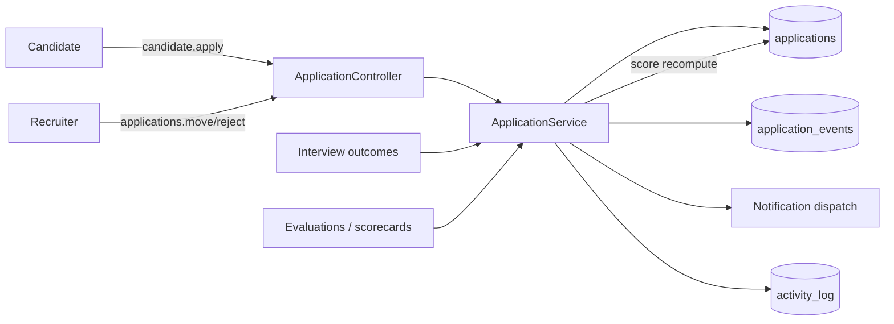
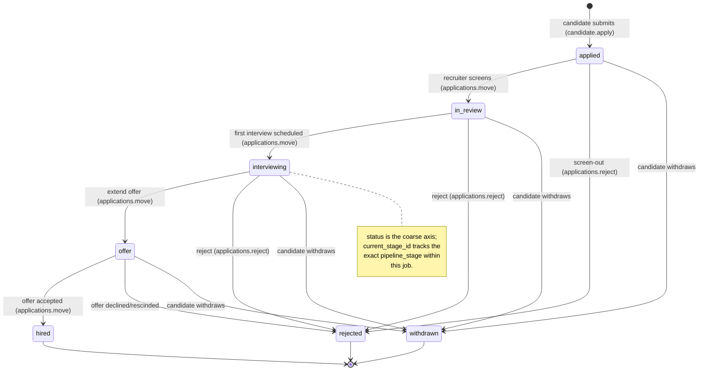
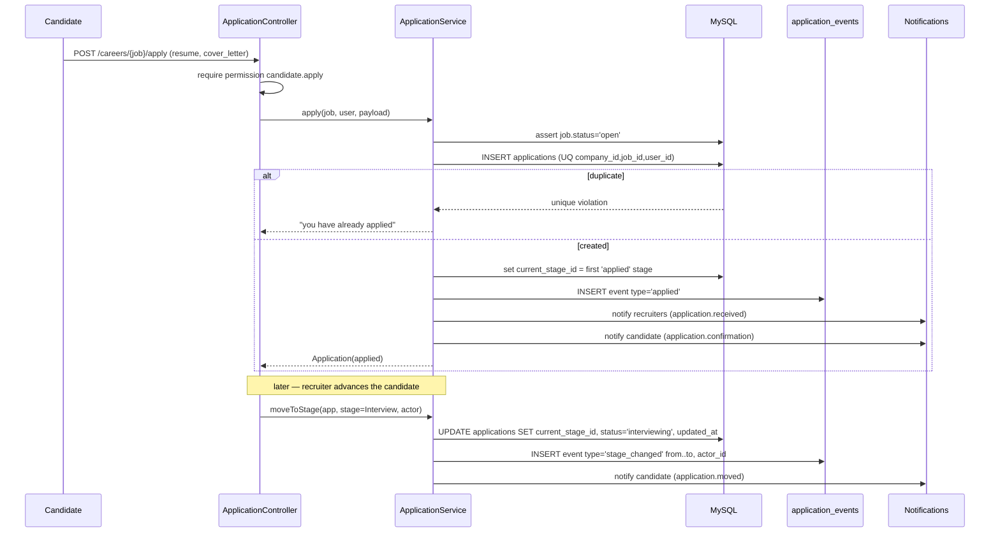

# 25 — Application Lifecycle (دورة حياة الطلب)

End-to-end specification for a candidate **application** (`applications`): its state machine (`applied → in_review → interviewing → offer → hired/rejected/withdrawn`), movement through pipeline stages, the immutable `application_events` timeline, de-duplication, scoring, bulk actions, GDPR/PDPL handling, and the `applications.*` permissions that gate it.

## Related Documents

- [24 — Job Lifecycle](24-Job-Lifecycle.md) — the job and its `pipeline_stages` an application flows through.
- [23 — Interview Workflow](23-Interview-Workflow.md) — interviews created against an application drive the `interviewing` state.
- [26 — Notification System](26-Notification-System.md) — events here emit candidate/recruiter notifications.
- [19 — Candidate Journey](19-Candidate-Journey.md) — the candidate-portal experience that creates and tracks applications.
- [06 — ERD](06-ERD.md) — relationships of `applications` / `application_events`.
- [11 — Permissions Matrix](11-Permissions-Matrix.md) — the `applications.*` keys used here.
- [02 — Business Rules](02-Business-Rules.md) — global recruitment rules.

---

## 1. Purpose (الهدف)

An **application** links a candidate (a row in the single `users` table — there is no candidate table) to a **job** within a **company**. It is the central object recruiters work on day to day. This document defines:

- The application **status** state machine and how it relates to **pipeline-stage** movement.
- The **`application_events`** timeline — an append-only audit of everything that happened to the application.
- **De-duplication** so a candidate cannot apply twice to the same job.
- **Scoring** (`applications.score`) blending AI and human inputs.
- **Bulk actions** (move/reject/export many applications at once).
- **GDPR / PDPL** (Saudi Personal Data Protection Law) handling for candidate personal data.

## 2. Why It Exists (سبب وجوده)

The application is where hiring actually happens, so it must be rigorous:

- **Two complementary axes.** `status` is the coarse business state (for reporting, candidate-facing messaging, and analytics); `current_stage_id` is the fine-grained position in *this job's* configurable pipeline. Recruiters reorder pipeline stages freely; the high-level `status` stays stable, so dashboards and SLAs do not break when a tenant customises its pipeline.
- **An immutable timeline.** Hiring decisions can be challenged (legally and internally). `application_events` records who moved a candidate, when, from which stage to which, and why — providing defensible audit.
- **No double-counting.** The `UQ(company_id, job_id, user_id)` constraint guarantees one application per candidate per job, keeping pipeline metrics honest.
- **Privacy by design.** Candidate data is personal data under GDPR and PDPL; the lifecycle defines retention, withdrawal, export, and erasure so the platform is compliant by default.

## 3. Architecture

| Component | Responsibility |
| --- | --- |
| `ApplicationController` (`app/Controllers/App/ApplicationController.php`, planned) | HTTP: index (Kanban + list), show, store (candidate apply), move, reject, withdraw, bulk, export. Gated by `applications.*`. |
| `ApplicationService` (`app/Services/Recruitment/ApplicationService.php`, planned) | All status/stage transitions, event logging, score recomputation, de-dup enforcement. Single place for transition logic (no duplication — §14). |
| `Application` model (`app/Models/Application.php`, planned) | Tenant-scoped active record; `$casts` for `score` (float); relations to job, candidate user, current stage. |
| `ApplicationEvent` model (`app/Models/ApplicationEvent.php`, planned) | Tenant-scoped, append-only; never updated or deleted in normal flow. |
| `ScoringService` (`app/Services/Recruitment/ScoringService.php`, planned) | Combines `ai_interview_sessions.score`, `interview_responses.ai_score`, and human `evaluations.rating` into `applications.score`. |
| Candidate portal controller | Lets a candidate create, view status of, and withdraw their own applications via the `candidate.*` permissions. |

The `Application` model mirrors `app/Models/Membership.php`: `$tenantScoped = true`, so `Application::query()` auto-scopes to `company_id` and fails closed without a tenant.

## 4. Workflow

### 4.1 Application status state machine

`hired`, `rejected`, and `withdrawn` are **terminal**. `decided_at` is stamped on entry to any terminal state.

### 4.2 Status ↔ pipeline-stage mapping

`pipeline_stages.type` maps onto `status` so the two axes stay consistent:

| Stage `type` | Implied `status` |
| --- | --- |
| `applied` | `applied` |
| `screening` | `in_review` |
| `interview` | `interviewing` |
| `offer` | `offer` |
| `hired` | `hired` (terminal) |
| `rejected` | `rejected` (terminal) |

When a recruiter drags a card to a stage, `ApplicationService::moveToStage()` sets `current_stage_id` and derives the new `status` from the stage `type` (a tenant may have several `interview`-type stages, e.g. "Phone Screen", "Onsite" — all map to `status = interviewing`).

### 4.3 Apply + move sequence

## 5. Business Rules

1. One application per `(company_id, job_id, user_id)` — enforced by DB unique key and re-checked in the service.
2. A candidate may only apply to a job whose `status = open` (re-validated at write time).
3. `status` is derived from the destination pipeline-stage `type`; the two are never set independently.
4. **Every** mutation appends an `application_events` row (`applied`, `stage_changed`, `status_changed`, `note_added`, `interview_scheduled`, `evaluation_added`, `score_updated`, `rejected`, `withdrawn`, `hired`). Events are append-only and never edited or deleted.
5. `withdrawn` may be triggered only by the candidate (self) or an `applications.update` holder acting on their behalf; the reason is captured in the event `note`.
6. `rejected` requires `applications.reject`; a rejection reason (event `note`) is mandatory; an optional candidate notification is sent.
7. Moving a candidate forward to `interviewing` is the natural trigger to schedule an interview (see [23 — Interview Workflow](23-Interview-Workflow.md)), but scheduling is a separate explicit action.
8. `applications.score` (0–100, `DECIMAL(5,2)`) is **advisory**: it informs but never auto-decides. Final decisions are made by users with `evaluations.manage` (human-in-the-loop, canonical §9).
9. Entering `hired` notifies `JobService::onApplicationHired()` to recompute remaining openings on the job ([24 — Job Lifecycle](24-Job-Lifecycle.md)).
10. Bulk actions (move/reject/export) are transactional per item with a per-item permission check; a partial failure reports which items failed without rolling back successful ones.
11. A candidate sees only their **own** applications and a candidate-safe subset of fields (never internal scores, notes, or evaluations).
12. Re-applying after `rejected`/`withdrawn` to the *same* job is blocked by the unique key; the recruiter may reopen the existing application instead (event `reopened`, status back to `in_review`) — reopening is the only escape from a terminal state and requires `applications.update`.

## 6. Database Relations

Primary table — **`applications`** (tenant, planned #19):

| Column | Type / Notes |
| --- | --- |
| `id` | BIGINT UNSIGNED PK |
| `company_id` | FK → `companies(id)` CASCADE (tenant scope) |
| `job_id` | FK → `jobs(id)` CASCADE |
| `user_id` | FK → `users(id)` CASCADE — the candidate |
| `current_stage_id` | FK → `pipeline_stages(id)` SET NULL |
| `status` | ENUM(`applied`,`in_review`,`interviewing`,`offer`,`hired`,`rejected`,`withdrawn`) |
| `source` | VARCHAR — e.g. `careers_page`, `referral`, `import` |
| `resume_file_id` | FK → `files(id)` SET NULL |
| `cover_letter` | TEXT NULL |
| `score` | DECIMAL(5,2) NULL |
| `applied_at`, `decided_at` | TIMESTAMP NULL |
| `created_at`, `updated_at` | TIMESTAMP NULL |

Keys/indexes: `UQ(company_id, job_id, user_id)` (de-dup); `IDX(company_id, job_id, status, current_stage_id)` (drives the Kanban board and stage counts).

**`application_events`** (tenant, planned #20): `application_id` → `applications(id)` CASCADE; `actor_id` → `users(id)` SET NULL; `type`, `from_stage_id`, `to_stage_id`, `note`, `properties` JSON, `created_at`. `IDX(application_id)`. Append-only timeline.

Related: **`interviews`** (`application_id` CASCADE), **`evaluations`** (`application_id` CASCADE, `interview_id` SET NULL), **`files`** (resume via `resume_file_id`), **`jobs`** / **`pipeline_stages`** (parents). Decisions cascade so deleting a job removes its applications and their children.

## 7. Permissions

Gated by `applications.*` (canonical §6):

| Action | Permission |
| --- | --- |
| View applications, Kanban, candidate profile within an application | `applications.view` |
| Edit application fields, add notes, withdraw-on-behalf, reopen | `applications.update` |
| Move between pipeline stages / change status | `applications.move` |
| Reject a candidate | `applications.reject` |
| Export applications (CSV) | `applications.export` |
| Candidate self-apply (candidate portal) | `candidate.apply` |
| Candidate view/manage own profile + applications | `candidate.profile` |

Default mapping ([11 — Permissions Matrix](11-Permissions-Matrix.md)): `owner`, `hr-manager`, `recruiter` hold the full `applications.*` set; `hiring-manager` holds `view`/`move` (often scoped to their jobs via a policy gate); `interviewer` holds `applications.view` (read-only on assigned candidates); `candidate` holds only `candidate.apply`/`candidate.profile`. A policy gate (`AccessControl::define('applications.view', ...)`) lets a candidate read an application **only if** `application.user_id === auth()->id()`.

## 8. Validation

- **Apply**: `resume_file` `required_without:profile_resume|mimes:pdf,doc,docx|max:5120` (KB); `cover_letter` `nullable|max:5000`; `job_id` must resolve to an `open` job in the tenant; candidate must not already have an application for it.
- **Move**: `to_stage_id` `required|exists:pipeline_stages,id` and must belong to the same `job_id`; the resulting transition must be legal per the state machine.
- **Reject**: `reason` `required|min:3|max:1000`.
- **Withdraw**: `reason` `nullable|max:1000`; only by candidate or `applications.update` holder.
- **Score**: system-computed; if manually overridden (`applications.update`), `numeric|min:0|max:100`.
- **Bulk**: `ids` `required|array|min:1`; every id resolved within the tenant; action `in:move,reject,export`.
- **Export**: enforce a max row cap per request; large exports go through the queue.

## 9. Edge Cases

- **Duplicate apply** → unique-key violation caught and surfaced as "you have already applied to this job".
- **Apply to a job that just closed** → re-check `status='open'` at write time; reject gracefully.
- **Resume upload fails mid-apply** → application is created with `resume_file_id = NULL` only if a profile resume exists; otherwise the whole apply is rolled back in one transaction.
- **Concurrent stage moves by two recruiters** → last write wins on `current_stage_id`, but **both** moves are recorded as `application_events`, so the history is never lost; an optimistic `updated_at` check warns on stale boards.
- **Candidate deleted** (GDPR erasure) → `applications.user_id` is CASCADE, so applications are removed; aggregate hiring metrics are preserved separately (anonymised counters) so deletion does not corrupt historical reporting.
- **Job deleted** → applications cascade-delete; recruiters are warned before a (super-admin) hard delete.
- **Moving to a terminal stage then needing to undo** → cannot edit history; instead a `reopened` event returns status to `in_review` (requires `applications.update`).
- **Bulk reject of 500 candidates** → chunked, each with its own event and optional notification dispatched via the queue to avoid request timeouts.

## 10. Security

- Tenant isolation via the scoped `Application`/`ApplicationEvent` models (fail-closed, per `app/Core/Model.php`).
- Candidate access strictly limited by a policy gate to `user_id === auth()->id()`; candidates can never enumerate or read others' applications, scores, notes, or evaluations.
- All mutations are CSRF-protected POSTs behind `permission:` middleware.
- Internal fields (`score`, evaluator notes, AI feedback) are stripped from any candidate-facing serialization (`$hidden` + dedicated candidate DTO).
- `application_events` provides a tamper-evident audit; combined with `activity_log` for security-level events (who exported candidate data, who rejected).
- Resume files are private (`files.visibility='private'`, tenant-scoped path) and served only via authorized, signed download routes ([27 — Storage System](27-Storage-System.md)).

### GDPR / PDPL data handling

- **Lawful basis & consent**: the careers-page apply form records consent (timestamp + version in `application_events.properties`).
- **Right of access / portability**: `applications.export` for recruiters; a candidate self-export of their own data via the candidate portal.
- **Right to withdraw**: candidate-initiated `withdrawn` transition.
- **Right to erasure**: candidate-initiated account/data deletion cascades applications; a documented retention window (configurable per company, default e.g. 24 months after `decided_at`) after which a scheduled queue job anonymises or purges stale candidate applications.
- **Data minimisation**: only fields needed for hiring are stored; sensitive special-category data is never solicited by default.
- **Residency**: shared-DB row isolation keeps tenant data together; the scalability doc ([36 — Scalability](36-Scalability.md)) describes a path to regional sharding for residency requirements.

## 11. Performance

- `IDX(company_id, job_id, status, current_stage_id)` powers the Kanban board (per-stage counts) and filtered lists without table scans.
- Kanban columns are paginated/virtualised per stage; counts come from a single grouped query (`GROUP BY current_stage_id`).
- `application_events` is read newest-first via `IDX(application_id)` with `ORDER BY created_at DESC LIMIT`.
- Score recomputation is debounced/queued so adding one evaluation does not block the request.
- Bulk actions and large exports run on the queue (`queued_jobs`), streaming CSV to a file in `storage`.
- N+1 avoidance: candidate/job/stage data for a board is batch-loaded with `whereIn`.

## 12. Testing

**Unit (ApplicationService / ScoringService):**
- De-dup: second `apply` for the same `(company,job,user)` throws.
- Stage→status derivation is correct for every `pipeline_stages.type`.
- Each illegal transition (e.g. `hired → applied`) throws.
- Every transition appends exactly one `application_events` row with correct `from/to` stage and actor.
- `ScoringService` blends AI + human inputs deterministically.

**Feature (HTTP):**
- Candidate applies via careers page → application appears in the recruiter board.
- Recruiter moves a card across stages; the candidate sees an updated status and gets a notification.
- Reject requires a reason; withdraw works from the candidate portal.
- Bulk reject of N items records N events and N (optional) notifications.

**Security:**
- Candidate A cannot view candidate B's application (403/404 via gate).
- A user without `applications.move` cannot change stage.
- Cross-tenant isolation on every read/write.
- Candidate-facing payloads never include `score`/notes/evaluations.
- GDPR: erasure cascades; export is permission-gated and audited.

## 13. Future Expansion

- **Configurable stage-to-status mapping** per tenant (already data-shaped via `pipeline_stages.type`).
- **SLA timers & stage aging** highlighting candidates stuck in a stage too long (computed from the latest `stage_changed` event).
- **Application scoring models** pluggable behind a scoring strategy interface.
- **Talent pool / re-engagement**: surface past `rejected`/`withdrawn` candidates for new jobs (respecting consent).
- **Webhooks / ATS export** to external systems via the API ([29 — API Architecture](29-API-Architecture.md)).
- **Automated stage rules** (e.g. auto-move to `in_review` when an AI screen scores above a threshold), always advisory and reversible.

## 14. Open Questions

None at this time. The application lifecycle, its dual status/stage model, the de-dup constraint, and the `applications.*` permissions are fully specified by the canonical schema (#19–#20) and §6.
