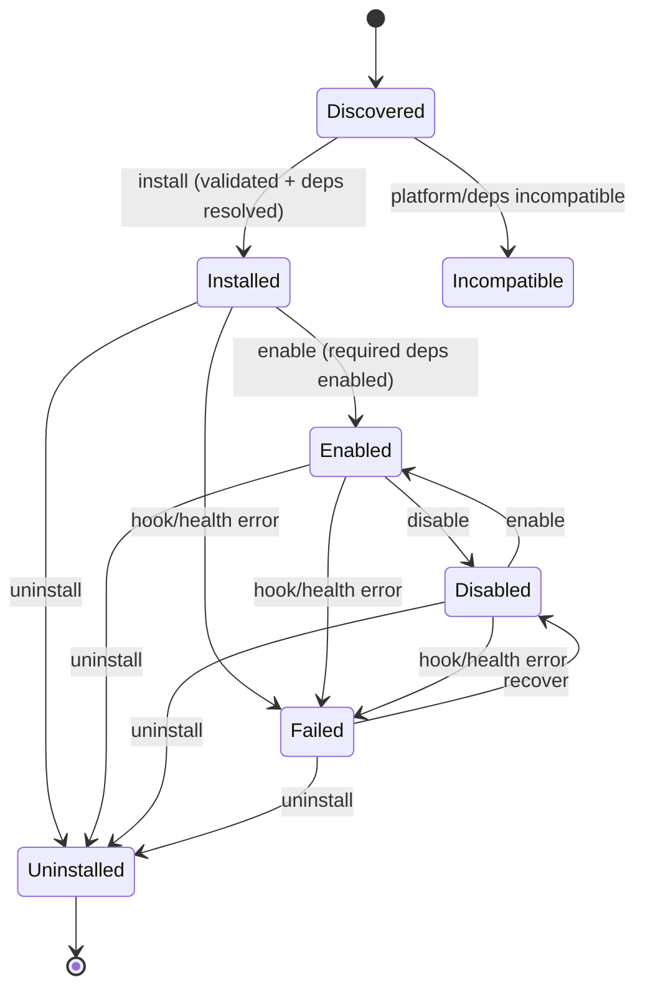
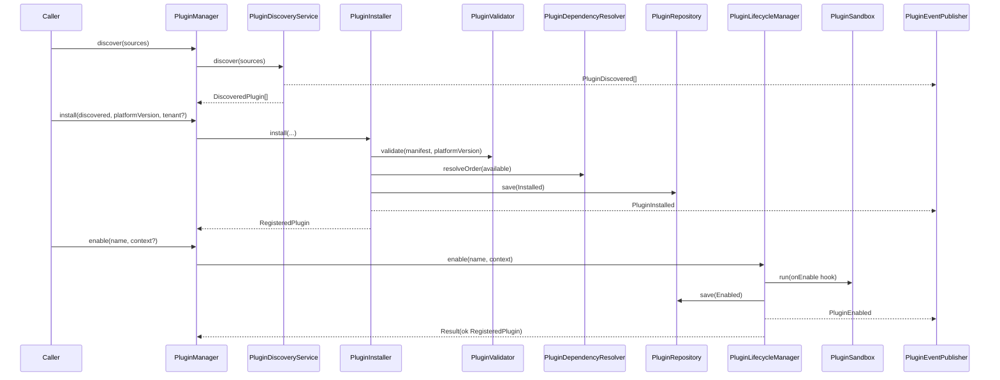
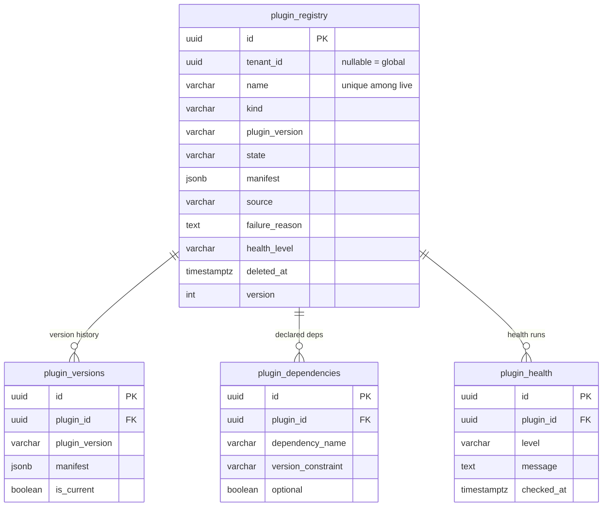

# 25 — Plugin Platform

> **Status: Implemented | Version 1.0.0 | Last updated 2026-07-01 | Owner: Architecture (Nizam Core)**

> Module: **Plugin Platform** (`Nizam\Platform\Plugin\*`, path `src/Platform/Plugin/`).
> The core extensibility substrate: **everything is a Plugin** (ADR-0016), governed by
> ADR-0020 (plugin platform mechanics). Native PHP 8.4, Hexagonal/DDD (ADR-0007),
> framework-independent (ADR-0015), UUIDv7-keyed (ADR-0003), tenant-scoped and
> soft-delete/audit aware (ADR-0002, ADR-0011).

---

## 1. What this module does

The Plugin Platform lets a company **install, enable, disable, upgrade, replace and
uninstall** Agents and capabilities as **versioned plugins — without modifying the
Core**. It is the substrate every later capability (Managers, Workers, Tools,
Integrations, Automations, Departments, Providers, Knowledge Sources) plugs into.

It provides:

- a **Plugin SDK** — the stable, typed contracts a plugin implements;
- a **Manifest** — the self-validating descriptor a plugin publishes (`plugin.json`);
- **discovery** across pluggable sources;
- **validation** (manifest shape, SemVer, kind ↔ entry-point contract by reflection,
  platform compatibility, permission/capability declarations, config-schema shape);
- **SemVer 2.0.0 versioning** and **constraint** resolution (`^`, `~`, ranges, `x`, `*`);
- **dependency resolution** (topological install order, cycle detection, missing/
  incompatible required-dependency detection, satisfied-optional skipping);
- a **permission/isolation model** (a plugin acts only within granted permissions;
  a faulting plugin is caught and converted to a failure Result + event — the Core
  never crashes because a plugin did);
- **lifecycle management** (install / enable / disable / update / uninstall) with
  lifecycle hooks run under a fault-isolating sandbox;
- **health checks**;
- **persistence** (in-memory + PDO for SQLite/PostgreSQL) and a container-driven
  instantiator.

Concrete business plugins are **out of scope** here (later phases). The module ships a
single, real, test-only **ReferencePlugin** used exclusively by the test suite.

---

## 2. Architecture & layering

Pure Hexagonal/DDD. Contracts depend only on the Kernel and PHP; all I/O lives in
`Infrastructure/` behind ports.

```
src/Platform/Plugin/
├── PluginKind, PluginState, SemanticVersion, VersionConstraint, VersionBound
├── PluginId, PluginPermission, PermissionSet, PluginDependency
├── PluginManifest, PluginInterface, PluginLifecycleHooks
├── PluginContext, RegisteredPlugin, PluginHealthStatus, HealthLevel
├── Contract/     — the SDK kind contracts (ManagerPlugin … KnowledgeSourcePlugin)
├── Event/        — PluginDiscovered/Installed/Enabled/Disabled/Updated/Uninstalled/Failed
├── Exception/    — PluginException + typed subtypes (codes PLUGIN.*)
├── Port/         — PluginRepository, PluginSource, PluginEventPublisher,
│                   HealthCheck, HealthCheckResolver, PluginInstantiator, DiscoveredPlugin
├── Service/      — PluginValidator, PluginDependencyResolver, PluginHealthChecker,
│                   PluginPermissionGate, PluginSandbox
├── Manager/      — PluginRegistry, PluginDiscoveryService, PluginInstaller,
│                   PluginLifecycleManager, PluginManager (façade), UpdateOutcome
└── Infrastructure/
    ├── Persistence/InMemory/  — InMemoryPluginRepository
    ├── Persistence/Pdo/       — PdoPluginRepository + PluginHydrator
    ├── Source/                — DirectoryPluginSource, ArrayPluginSource
    ├── Event/                 — DispatchingPluginEventPublisher
    ├── Container/             — ContainerPluginInstantiator, ContainerHealthCheckResolver
    ├── Migration/             — 001_create_plugin_tables.sql + SqliteSchema
    ├── Testing/               — ReferencePlugin (test-only, real)
    ├── PersistenceDriver, PluginServiceProvider
```

---

## 3. The SDK — plugin kinds & contracts

Every plugin implements `PluginInterface` (`manifest(): PluginManifest`) and MAY
implement `PluginLifecycleHooks` (`onInstall/onEnable/onDisable/onUninstall/onUpdate`).
A plugin's **kind** fixes the SDK contract its entry-point class must implement; the
validator verifies this by reflection.

| Kind (`PluginKind`) | Contract (`Contract/`) | Minimal method(s) |
|---|---|---|
| `Manager` | `ManagerPlugin` | `managedRoles(): array` |
| `TeamLeader` | `TeamLeaderPlugin` | `coordinatedCapabilities(): array` |
| `Worker` | `WorkerPlugin` | `describe(): array` |
| `Tool` | `ToolPlugin` | `toolName(): string`, `inputSchema(): array` |
| `Integration` | `IntegrationPlugin` | `externalSystem(): string` |
| `Automation` | `AutomationPlugin` | `triggers(): array` |
| `Department` | `DepartmentPlugin` | `providedRoles(): array` |
| `Provider` | `ProviderPlugin` | `providedCapability(): string` |
| `KnowledgeSource` | `KnowledgeSourcePlugin` | `knowledgeDomains(): array` |

Example — the worker contract:

```php
interface WorkerPlugin extends PluginInterface
{
    /** @return array<string, mixed> machine-readable description of the work it performs */
    public function describe(): array;
}
```

---

## 4. The manifest schema (`plugin.json`)

The manifest is the published plugin descriptor. `PluginManifest::fromArray()` /
`toArray()` round-trip it losslessly; construction validates the shape and throws
`PluginManifestException` on any violation.

| Field | Type | Required | Meaning |
|---|---|---|---|
| `name` | string (kebab/dotted, lowercase) | yes | unique plugin identifier |
| `displayName` | string | yes | human-readable name for UI |
| `version` | string (SemVer 2.0.0) | yes | the plugin's own version |
| `kind` | enum string | yes | which SDK contract it fulfils |
| `description` | string | no | human description |
| `author` | string | yes | plugin author |
| `license` | string (SPDX/free-form) | yes | licence identifier |
| `entryPointClass` | string (FQCN) | yes | class the platform instantiates |
| `platformConstraint` | string (VersionConstraint) | yes | platform versions supported |
| `requiredPermissions` | array of `{key, description}` | no | permissions the plugin needs granted |
| `requiredCapabilities` | array of string | no | platform capabilities it needs present |
| `dependencies` | array of `{plugin, constraint, optional}` | no | other plugins it depends on |
| `configSchema` | object | no | declarative config schema |
| `healthCheckClass` | string \| null | no | FQCN of a `HealthCheck` |
| `tags` | array of string | no | search/grouping tags |

Illustrative `plugin.json`:

```json
{
  "name": "nizam.reference-worker",
  "displayName": "Nizam Reference Worker",
  "version": "1.0.0",
  "kind": "worker",
  "description": "A minimal reference worker plugin.",
  "author": "Nizam Platform",
  "license": "MIT",
  "entryPointClass": "Nizam\\Platform\\Plugin\\Infrastructure\\Testing\\ReferencePlugin",
  "platformConstraint": ">=1.0.0",
  "requiredPermissions": [
    { "key": "worker.execute", "description": "Perform assigned units of work." }
  ],
  "requiredCapabilities": [],
  "dependencies": [],
  "configSchema": { "prefix": { "type": "string", "default": "" } },
  "healthCheckClass": null,
  "tags": ["reference", "worker", "test"]
}
```

---

## 5. Versioning — SemVer & constraints

`SemanticVersion` implements strict **SemVer 2.0.0**: `parse('1.2.3[-pre][+build]')`,
`major/minor/patch`, `compareTo` (build metadata ignored, pre-release precedence
honoured), `equals`, `__toString`. `VersionConstraint` parses `^1.2`, `~1.2.3`,
`>=1.0 <2.0`, `1.x`, `*` and answers `satisfies(SemanticVersion): bool`. These drive
platform-compatibility checks, dependency resolution and the "update must be strictly
newer" rule.

---

## 6. Lifecycle

### 6.1 State machine



`RegisteredPlugin` guards every transition and records the matching domain event
(`install()/enable()/disable()/markFailed()/markIncompatible()/uninstall()`).
`Uninstalled` is terminal.

### 6.2 Discovery → install → enable sequence



---

## 7. Permission & isolation model

Isolation is **permission-gated + fault-catching**, not OS-level (see §11):

- **Permission gate** — `PluginPermissionGate::authorize(plugin, permissionKey, granted)`
  throws `PluginPermissionDeniedException` unless the plugin was granted a permission it
  declared/needs. A plugin can only ever act within the `PermissionSet` handed to it via
  its `PluginContext`.
- **Fault-isolating sandbox** — `PluginSandbox::run(plugin, callable): Result` executes a
  plugin call catching any `Throwable`, converting it to a failure `Result`, marking the
  plugin `Failed` and emitting `PluginFailed`. A plugin crash therefore **never takes down
  the Core**. No `eval`, no process spawning.

Lifecycle hooks (`onEnable`, etc.) always run inside the sandbox, so a misbehaving hook
degrades to a captured failure rather than an uncaught exception.

---

## 8. Persistence — DB schema

Design source of record: `Infrastructure/Migration/001_create_plugin_tables.sql`
(PostgreSQL 16). The structurally-equivalent `SqliteSchema` runs it for tests. UUIDv7
PKs, `tenant_id` **nullable** (a plugin installs for one tenant or globally), audit
columns, `deleted_at` soft-delete, optimistic `version`, JSONB manifest, `unique(name)`
among live rows, and `(kind)`/`(state)` indexes.



---

## 9. Public surface — `PluginManager`

The single façade the rest of the platform talks to. Tenant-aware where a tenant scope
applies (install/update take an optional owning `TenantId`; `null` installs globally).

| Method | Purpose |
|---|---|
| `discover(sources): DiscoveredPlugin[]` | scan sources, de-duplicate, emit `PluginDiscovered` |
| `install(discovered, platformVersion, tenant?): RegisteredPlugin` | validate → resolve deps → persist Installed → emit event |
| `update(name, discovered, platformVersion): UpdateOutcome` | move to a strictly-newer version; keep prior for rollback; emit `PluginUpdated` |
| `rollback(outcome): RegisteredPlugin` | restore the previous version |
| `enable(name, context?): Result` | enable + run `onEnable` under sandbox |
| `disable(name, context?): Result` | disable + run `onDisable` under sandbox |
| `uninstall(name, context?): Result` | uninstall + run `onUninstall` under sandbox |
| `health(name, context?): PluginHealthStatus` | run the plugin's health check, record last-known health |
| `get(name)/find(name)` | lookup (throw / nullable) |
| `all()/byKind(kind)/enabled()` | listings |

Wired into the platform container by `PluginServiceProvider`, which binds every
port → adapter and registers the `PluginManager` + services. `PersistenceDriver` selects
in-memory vs PDO adapters.

---

## 10. Non-technical screen spec — "Marketplace / Plugins"

> For the UX conventions (Basic/Advanced, wizards, (!) Help popups) see
> `docs/22-UIUX-Guidelines.md` and ADR-0012.

**What does this page do?** It is the shop and control panel for everything your Nizam
system can *do*. Each "plugin" is a capability — an assistant, a tool, an integration, or
a whole department — that you can **add**, **turn on**, **turn off**, **update** or
**remove**, without any developer touching the system. Think of it like the app store on
a phone: browse, install, and switch things on and off safely.

**Layout.**

- A searchable, filterable **list of plugins** (filter by *kind* and *status*), each card
  showing its display name, kind, version, author, and a coloured **status pill**
  (Installed / **Enabled** / Disabled / Failed / Incompatible) and a **health dot**
  (Healthy / Degraded / Unhealthy).
- Per-card buttons: **Install**, **Enable**, **Disable**, **Update** (shown when a newer
  version exists, with an **Undo update** option), **Uninstall** (asks for confirmation),
  and **View details**.
- A details drawer showing the plugin's description, permissions it will be granted,
  capabilities it needs, its dependencies, and its latest health check.

**(!) Help popups** — a small (!) beside each of the 8 core manifest fields, in plain
language:

1. **Name** — "The system's unique code-name for this plugin. You won't usually type it."
2. **Version** — "Which release this is. Higher numbers are newer; updates move you up."
3. **Kind** — "What sort of capability this is: an assistant, a tool, an integration, a
   department, and so on."
4. **Author** — "Who made this plugin."
5. **License** — "The legal terms it's provided under."
6. **Required permissions** — "What this plugin is allowed to do. It can *never* act
   outside these — that's how we keep it safe."
7. **Dependencies** — "Other plugins this one needs in order to work. We turn them on in
   the right order for you."
8. **Health** — "A live check that the plugin is working. Green is good; amber means
   working-but-watch; red means it needs attention."

**Basic vs Advanced.**

- **Basic** — shows the card, the status pill, the health dot, and the four everyday
  buttons (Install / Enable / Disable / Uninstall). Everything technical is hidden behind
  the (!) popups.
- **Advanced** — additionally reveals the raw manifest (`plugin.json`), the platform
  compatibility constraint, the full dependency graph, the version/update history, and the
  health-check log — for operators who want the detail.

**Safety promises surfaced in the UI.** Enabling a plugin only ever grants the exact
permissions it declared; if a plugin fails while turning on or off, the system catches it,
marks it **Failed**, and keeps running — nothing else breaks.

---

## 11. Isolation posture & deferred work

Current isolation = **permission gate + fault-catching sandbox** (in-process). True
**OS-process / container isolation** for untrusted third-party plugins is **deferred**
(revisitable per ADR-0016's microkernel-with-services alternative and ADR-0020). Until
then, plugins are trusted-but-scoped: they run in-process but only within their granted
permissions, and any fault is contained.

---

## Related Documents

- `docs/16-ADR.md` — **ADR-0016** (everything is a plugin) and **ADR-0020** (plugin
  platform mechanics).
- `docs/audit/PHASE_PLUGIN_AUDIT.md` — delivery audit for this module.
- `docs/07-Tool-Architecture.md`, `docs/06-Agent-Architecture.md` — kinds that plug in here.
- `docs/21-Database-Design.md` — platform-wide data conventions.

---

## Change Log

| Version | Date | Author | Change |
|---------|------|--------|--------|
| 1.0.0 | 2026-07-01 | Architecture (Nizam Core) | Initial Plugin Platform module doc: SDK contracts + kinds, manifest schema + `plugin.json`, SemVer/constraints, lifecycle (state + sequence diagrams), permission/isolation model, DB schema (ER), `PluginManager` surface, and the non-technical "Marketplace / Plugins" screen spec. Cross-links ADR-0016 / ADR-0020. |
</content>
