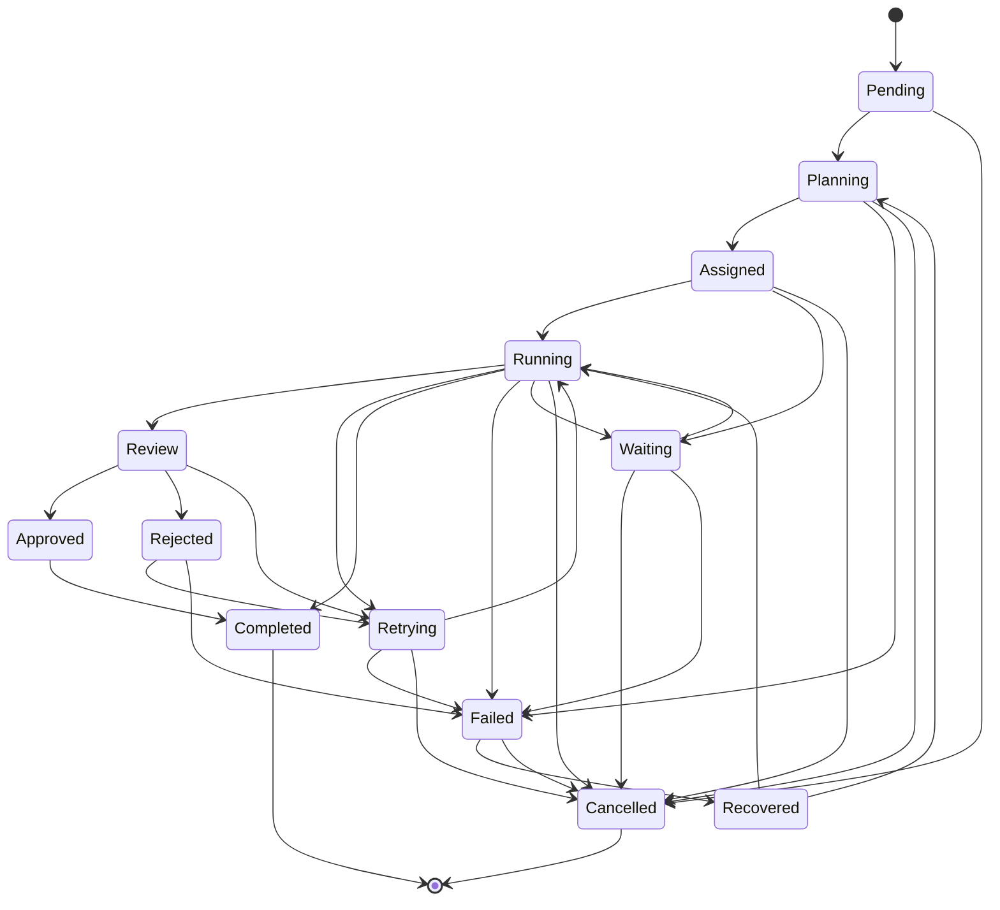
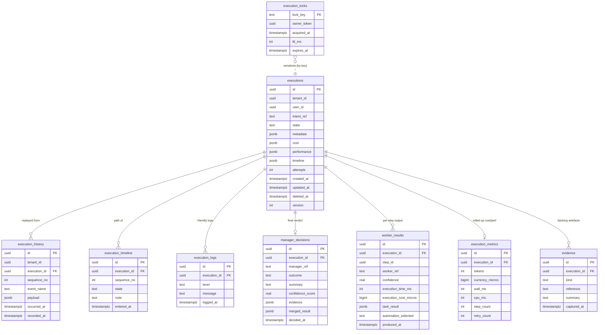

# 26 — AI Runtime (Execution Engine + Master Orchestrator)

> **Status: Implemented | Version 1.0.0 | Last updated 2026-07-01 | Owner: Architecture (Nizam Core)**

> Module: **Runtime** (`Nizam\Runtime\*`, path `src/Runtime/`).
> The single path through which all work executes. Realizes **ADR-0017** (single Master
> Orchestrator as the sole execution entry point) and **ADR-0018** (AI Runtime Execution
> Engine with an explicit execution state machine); its persistence and event-sourcing
> mechanics are governed by **ADR-0021** (runtime execution persistence & event-sourced
> state store). Native PHP 8.4, Hexagonal/DDD (ADR-0007), framework-independent
> (ADR-0015), UUIDv7-keyed (ADR-0003), tenant-scoped and soft-delete/audit aware
> (ADR-0002, ADR-0011), event-driven (ADR-0004).

---

## 1. What this module does

The Runtime is the **only** way work runs in Nizam. Nothing — no controller, no event
consumer, no worker — executes business work except by entering the Runtime through its
one front door, the **Master Orchestrator**. Every execution is:

- **State-machine-driven** — it lives in exactly one of thirteen legal states at a time,
  and only legal transitions are permitted (ADR-0018);
- **Event-sourced** — every transition appends an immutable event to an append-only
  history from which the execution can be replayed exactly (ADR-0021);
- **Auditable** — the full path an execution took (its timeline) is human-readable and
  persisted;
- **Cost- and performance-tracked** — tokens, money, wall-clock and retry counts are
  accumulated as work happens;
- **Retryable, recoverable, replayable** — a failed execution can retry under a policy,
  be rebuilt from history after a crash, and be replayed read-only for audit/debug.

**Workers never talk to users, to each other, or to automation engines directly.**
Everything passes through the Runtime. Only **Managers** decide, and only Managers speak
back to Bayan (via the Bayan Gateway, ADR-0006).

### Layout

```
src/Runtime/
├── Execution/          # the execution aggregate, its state machine, and the engine
│   ├── Domain/         # Execution, ExecutionState(Machine), ExecutionStep, WorkerResult,
│   │                   #   value objects (RetryPolicy, TimeoutPolicy, CostSnapshot, …),
│   │                   #   13 domain events, exceptions, and ports
│   └── Application/    # ExecutionEngine, ExecutionPipeline (+ stages), RetryEngine,
│                       #   TimeoutManager, RecoveryService, ReplayService, trackers, DTOs
├── Orchestration/      # MasterOrchestrator (sole entry point), WorkerCoordinator,
│                       #   ResultMerger, ConfidenceEvaluator, ManagerDecision, ports
└── Infrastructure/     # InMemory + PDO persistence, event publisher, provider adapters,
                        #   migrations, RuntimeServiceProvider, RuntimeModule facade
```

---

## 2. The single-entry Master Orchestrator

`Nizam\Runtime\Orchestration\MasterOrchestrator::handle(OrchestrationRequest): OrchestrationResponse`
is **the sole entry point** into the Runtime (ADR-0017). Every request is governed
identically. For each request the orchestrator, recording each step on the execution's
timeline:

1. **Validates** the request (tenant present, intent shape, permissions declared);
2. **Resolves context** — tenant, user, permissions, and department — through injected
   ports (`TenantProvider`, `UserProvider`, `PermissionProvider`, `DepartmentResolver`);
3. **Resolves the Manager plugin** for the department via `ManagerPluginResolver`
   (a `Nizam\Platform\Plugin\Contract\ManagerPlugin`);
4. **Builds an `ExecutionRequest`** and runs it through the **`ExecutionEngine`** inside a
   lock, with retry/timeout policies applied;
5. The **Manager coordinates Workers** through the **`WorkerCoordinator`** — never
   worker-to-worker — collecting a `WorkerResult` per task;
6. **`ResultMerger`** merges the worker results (dedupes evidence, combines
   recommendations, aggregates cost/perf) into a `MergedResult`;
7. **`ConfidenceEvaluator`** scores the merged result into a `ConfidenceAssessment`
   (score + rationale + whether a retry or more workers are needed);
8. The **Manager decides** — `Approved`, `Rejected`, `RetryRequested`,
   `MoreWorkersRequested`, or `Escalated` — returning a **`ManagerDecision`**;
9. On `MoreWorkersRequested`, the coordinator is **re-entered** (workers may request more
   workers, satisfied only by re-entering the coordinator, never by direct worker-to-worker
   calls); on `RetryRequested`, the retry engine applies the retry policy.

The orchestrator is **not** a god-object: it delegates heavy lifting to Runtime services
and the execution state machine, and returns the Manager's decision as the single
authority per request.

### Worker isolation is enforced by the API

Workers are invoked **only** through `WorkerCoordinator::dispatch(...)`. There is no API by
which a worker can obtain and call another worker; a worker that needs help returns a
`recommendations`/more-workers signal, and the coordinator (re-entered by the manager)
satisfies it. Direct worker-to-worker invocation is structurally impossible.

---

## 3. The execution state machine (ADR-0018)

Every execution is driven through exactly these **thirteen** states. The legal transition
graph is the single source of truth in
`Nizam\Runtime\Execution\Domain\ExecutionStateMachine`; the `Execution` aggregate guards
every mutation against it. Terminal states — **Completed** and **Cancelled** — have no
outgoing edges.



| State | Meaning |
|-------|---------|
| **Pending** | Created and validated; not yet planned. |
| **Planning** | The manager is planning the work (deciding steps/workers). |
| **Assigned** | Work steps have been assigned but not yet started. |
| **Waiting** | Paused, awaiting an external signal or an in-flight dependency. |
| **Running** | Actively executing assigned steps. |
| **Retrying** | A failure occurred; a retry is being prepared under the retry policy. |
| **Review** | Held for human or manager review before it may complete. |
| **Approved** | Reviewed and approved; ready to complete. |
| **Rejected** | Reviewed and rejected; awaiting retry or failure. |
| **Cancelled** | *(terminal)* Terminated before completion by an explicit actor. |
| **Completed** | *(terminal)* Finished successfully. |
| **Failed** | Ended in failure (retries exhausted or unrecoverable). |
| **Recovered** | Reconstructed from the event store after a crash and made resumable. |

Each transition is performed by a guarded aggregate mutator (`plan`, `assign`, `run`,
`retry`, `toReview`, `approve`, `reject`, `complete`, `fail`, `recover`, `cancel`) that
records a matching domain event (see §7).

---

## 4. Execution lifecycle (sequence)

The end-to-end path of one execution, from an intent arriving at the front door to the
Manager's decision returning. Bayan produces the intent; the Master Orchestrator is the
sole entry point; the Manager coordinates Workers *only* through the Runtime's coordinator.

```mermaid
sequenceDiagram
    autonumber
    participant Bayan as Bayan (Gateway, ADR-0006)
    participant Orch as MasterOrchestrator
    participant Eng as ExecutionEngine
    participant Mgr as Manager plugin
    participant Coord as WorkerCoordinator
    participant W as Worker plugins
    participant Rt as Runtime (state machine + store)

    Bayan->>Orch: handle(OrchestrationRequest{intent, tenant, payload})
    Orch->>Orch: validate + resolve tenant/user/permissions/department
    Orch->>Mgr: resolve Manager plugin for department
    Orch->>Eng: execute(ExecutionRequest)  [inside advisory lock]
    Eng->>Rt: Execution.start → Pending (ExecutionStarted)
    Eng->>Mgr: plan work
    Mgr-->>Eng: WorkTask[]
    Eng->>Rt: plan → Planning; assign → Assigned; run → Running
    Eng->>Coord: dispatch(Worker[], WorkTask[], ExecutionContext)
    loop each task (sequential / deterministic parallel fan-out)
        Coord->>W: invoke(task, context)
        W-->>Coord: WorkerResult{taskResult, evidence, confidence, cost, …}
    end
    Coord-->>Eng: WorkerResult[]
    Eng->>Rt: completeStep(...) per result (records cost/perf)
    Eng->>Eng: ResultMerger.merge → MergedResult
    Eng->>Eng: ConfidenceEvaluator.evaluate → ConfidenceAssessment
    Eng->>Mgr: decide(MergedResult, ConfidenceAssessment)
    alt MoreWorkersRequested
        Mgr-->>Coord: re-enter coordinator (never worker→worker)
    else RetryRequested
        Mgr-->>Eng: retry under RetryPolicy (may throw RetryExhausted)
    else Approved / Rejected / Escalated
        Mgr-->>Eng: ManagerDecision
    end
    Eng->>Rt: complete / fail (append events, persist snapshot + projections)
    Eng-->>Orch: ExecutionResult{finalState, ManagerDecision, cost, perf, timeline}
    Orch-->>Bayan: OrchestrationResponse{ManagerDecision}
```

---

## 5. The `WorkerResult` contract

A worker returns exactly one **`WorkerResult`** per unit of work
(`Nizam\Runtime\Execution\Domain\ValueObject\WorkerResult`). It is a self-validating,
immutable value object — the **only** thing a worker communicates back to the Runtime.
It carries **all** mandated fields:

| Field | Type | Meaning |
|-------|------|---------|
| `taskResult` | `array<string,mixed>` | The concrete result payload of the work. |
| `evidence` | `list<EvidenceItem>` | The evidence backing the result. |
| `reasoningSummary` | `string` | Human-readable summary of how the result was reached. |
| `confidence` | `float` | The worker's confidence, validated to lie in **[0, 1]**. |
| `executionTimeMs` | `int` | Wall-clock time the work took, in ms (**≥ 0**). |
| `executionCostMicros` | `int` | Monetary cost in currency micros (**≥ 0**). |
| `resourcesUsed` | `array<string,mixed>` | Free-form map of resources consumed (e.g. token counts). |
| `automationSelected` | `?string` | The automation the worker chose, if any (selected via the Runtime, never called directly). |
| `toolsUsed` | `list<string>` | Names of tools the worker invoked. |
| `warnings` | `list<string>` | Non-fatal warnings. |
| `errors` | `list<string>` | Recoverable errors the worker encountered. |
| `recommendations` | `list<string>` | Recommendations the worker offers to the manager. |
| `logs` | `list<string>` | Free-form, friendly log lines for audit/debug. |

Each **`EvidenceItem`** carries `kind`, `reference`, `summary`, `capturedAt`. The value
object rejects a confidence outside [0, 1] and any negative time/cost at construction, and
exposes a scalar-only `toArray()` for JSONB persistence and read models.

---

## 6. Retry, timeout, lock, recovery, replay

- **Retry.** `RetryPolicy` (VO) caps attempts, sets the base delay, chooses a
  `BackoffStrategy` (`Fixed` / `Exponential`), and toggles jitter: `shouldRetry(attempt)`
  and deterministic `nextDelayMs(attempt)`. The application-layer **`RetryEngine`** applies
  the policy (and any jitter, kept out of the deterministic domain); `Execution.retry()`
  throws **`RetryExhausted`** at the limit.
- **Timeout.** `TimeoutPolicy` (VO) sets `wallClockMs` and `perStepMs`; the
  **`TimeoutManager`** enforces both against a monotonic **`Clock`** and throws
  **`ExecutionTimedOut`** when exceeded.
- **Lock.** `ExecutionLock` (VO: key, ownerToken, acquiredAt, ttlMs) and the
  **`ExecutionLockManager`** port serialize work on a single execution. The engine runs
  inside the lock so the **same `ExecutionId` cannot be double-run**; an idempotency guard
  short-circuits a re-entered execution. The PDO adapter uses an advisory lock row with a
  TTL (`expires_at`) so a crashed holder cannot block a key forever.
- **Recovery.** **`RecoveryService`** reconstructs an `Execution` from the event store
  after a crash and marks it `Recovered` (from which it may resume to `Running` or
  `Planning`).
- **Replay.** **`ReplayService`** rebuilds an execution's state and timeline **read-only**
  from its event stream (`Execution::replay(DomainEvent[])`) and returns an
  `ExecutionReplayView` for audit and debugging — no side effects, no persistence.

Idempotency and legality are the invariants ADR-0021 protects: the same execution never
runs twice, and no illegal transition is ever persisted.

---

## 7. Domain events (event sourcing)

Every transition emits exactly one domain event (implementing `Nizam\Kernel\Domain\DomainEvent`,
carrying `executionId` + `occurredAt` + payload), appended to the append-only history:

`ExecutionStarted`, `ExecutionPlanned`, `WorkTaskAssigned`, `ExecutionStepStarted`,
`ExecutionStepCompleted`, `ExecutionRetried`, `ExecutionSentToReview`, `ExecutionApproved`,
`ExecutionRejected`, `ExecutionCompleted`, `ExecutionFailed`, `ExecutionRecovered`,
`ExecutionCancelled`.

Events are published to the platform Event Dispatcher (ADR-0004) by
`DispatchingExecutionEventPublisher`, and are the authoritative stream from which an
execution is replayed or recovered.

---

## 8. Cost & performance tracking

- **`CostSnapshot`** (VO): `tokens`, `currencyMicros`, and a per-provider breakdown.
- **`PerformanceSnapshot`** (VO): `wallMs`, optional `cpuMs`, `stepCount`, `retryCount`.

As each step completes, the `Execution` records the worker's `executionTimeMs` /
`executionCostMicros` / `resourcesUsed`; the application-layer **`CostTracker`** and
**`PerformanceTracker`** aggregate the per-step snapshots into the execution's rolled-up
`CostSnapshot` and `PerformanceSnapshot`, projected into `execution_metrics` for reporting.
This feeds Billing metering and the Execution Monitor without a separate instrumentation
pass.

---

## 9. Persistence + append-only event store (ADR-0021)

Two InMemory and PDO (SQLite + PostgreSQL 16) adapter sets back the domain ports. The
`executions` row is a **queryable snapshot**; the authoritative behaviour is rebuilt from
`execution_history`, the **append-only, never-mutated, never-soft-deleted** event stream.
All tables are **tenant-scoped** and carry audit columns; every table except the event
store is soft-deletable.



Hot read paths are indexed: `(tenant_id, state)` to list/monitor a tenant's executions and
`(execution_id, sequence_no)` to replay one execution's history in order. `execution_locks`
is keyed by `lock_key` with `expires_at` implementing the TTL.

---

## 10. Non-technical screen spec — the "Execution Monitor"

> This screen is written for the **non-technical operator** (ADR-0012). Plain language,
> bilingual AR/EN with correct RTL/LTR, Basic mode by default. **No stack traces, no
> jargon, no raw error dumps ever appear on this page** — only friendly business messages.

### What does this page do?

**"Execution Monitor"** shows you, in plain language, **the work Nizam is doing for you
right now and the work it has already done.** Each item is one piece of work (an
"execution"). You can see where each one is, how it is going, what it cost, and — if
something went wrong — a friendly explanation of what happened and what to do next. You do
**not** need to understand anything technical to read this page.

### Live status

A live list of current and recent work items. Each card shows:

- **A friendly title** — what the work is (e.g. *"Preparing this month's sales summary"*).
- **A status badge** in plain words, mapped from the internal state:
  *Waiting to start* (Pending), *Planning the work* (Planning/Assigned),
  *In progress* (Running/Waiting/Retrying), *Needs your review* (Review),
  *Approved* (Approved), *Finished* (Completed), *Stopped* (Cancelled),
  *Didn't finish* (Failed/Rejected), *Recovered after a hiccup* (Recovered).
- **A simple progress feel** — "Nizam is working on it…", "Almost done", "Waiting for
  your OK".
- **Cost so far**, shown as money (not micros) and, if the user wants detail, an
  approximate token count.
- **How long it took / has been running**, in friendly units (seconds/minutes).

### Timeline

Clicking a work item opens its **Timeline** — the human-readable path it took, one line per
step, newest or oldest first:

> *10:02 — Started.*
> *10:02 — Planned the work (3 steps).*
> *10:03 — Working on it…*
> *10:04 — Needed a second look, tried again.*
> *10:05 — Finished and approved.*

Each line is a friendly sentence, never a state code. If something needs the operator, the
timeline says so clearly (*"Waiting for your approval"*) with an **Approve** / **Reject**
action inline.

### (!) Help popups — the 8 fields

Every field on the page carries a **(!)** help icon. Each popup answers, in plain language:
**(1) What is this?** · **(2) Why does it matter?** · **(3) Example** · **(4) Is it
required?** · **(5) Where does this come from?** · **(6) Common mistakes** ·
**(7) A security note** · **(8) What to do next.** For example, the **Cost** field's popup:

> **(1) What is this?** The money this piece of work has cost so far.
> **(2) Why it matters?** It helps you keep spending under control.
> **(3) Example:** "$0.14 so far."
> **(4) Required?** No — it's shown for your information.
> **(5) Where from?** Added up automatically as the work runs.
> **(6) Common mistakes:** Comparing a big job to a tiny one — costs differ by size.
> **(7) Security note:** Only people in your organisation can see your costs.
> **(8) What next?** If a job costs more than expected, open its Timeline to see why, or
> ask Nizam to stop it.

### No stack traces — friendly business messages

When work doesn't finish, the operator sees a **friendly business message**, never a
technical error:

| What happened internally | What the operator sees |
|--------------------------|------------------------|
| `ExecutionTimedOut` | *"This took longer than expected, so Nizam paused it. You can try again."* |
| `RetryExhausted` | *"Nizam tried a few times but couldn't complete this. No changes were saved. Please try again later or contact support."* |
| `IllegalExecutionTransition` / internal fault | *"Something unexpected happened and Nizam stopped safely. Nothing was left half-done."* |
| Manager `Rejected` | *"The result didn't meet the quality bar, so it wasn't accepted. You can ask Nizam to try a different approach."* |
| Manager `Escalated` | *"This needs a person to decide. It's been sent for review."* |

Under the hood these come from the execution's state, its friendly `execution_logs`, and
the Manager's decision summary — but the operator only ever sees the plain-language
version. Full technical detail remains available to engineers via **Execution Replay**
(read-only rebuild from the event store), never on this screen.

---

## 11. Related decisions & documents

- **ADR-0017** — Single Master Orchestrator as the sole execution entry point.
- **ADR-0018** — AI Runtime Execution Engine with an explicit execution state machine.
- **ADR-0021** — Runtime execution persistence & event-sourced state store (append-only
  history, advisory locks, idempotent execution). *(This module implements it.)*
- **ADR-0004** — Event-driven backbone (transition events).
- **ADR-0011** — Soft delete + audit + event sourcing for critical aggregates.
- **ADR-0016 / ADR-0020** — Plugin platform; Managers and Workers are plugin kinds.
- `docs/16-ADR.md` — the ADR log. · `docs/25-Plugin-Platform.md` — the plugin substrate. ·
  `docs/23-Agent-Hierarchy.md` — Managers/Workers/Departments. ·
  `docs/21-Database-Design.md` — the data-model conventions this module follows.
