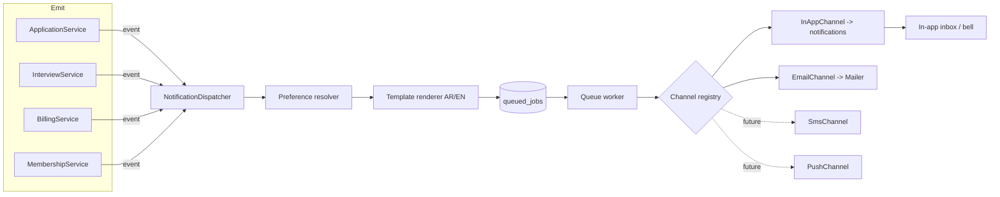
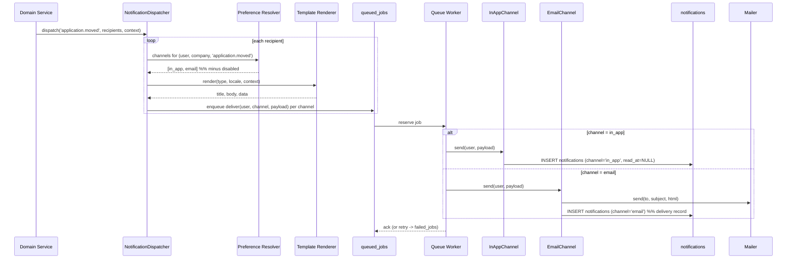

# 26 — Notification System (نظام الإشعارات)

Event-driven notification system delivering **in-app** and **email** messages across HalaOps, with per-user preferences, templating, queue-based delivery, batching/digest, and pluggable channels (future SMS/push).

## Related Documents

- [25 — Application Lifecycle](25-Application-Lifecycle.md) — emits application-moved / decision events.
- [23 — Interview Workflow](23-Interview-Workflow.md) — emits interview scheduled / reminder / completed events.
- [27 — Storage System](27-Storage-System.md) — attachments referenced in notifications.
- [12 — Supporting Systems / Queue](31-Backend-Architecture.md) — the `queued_jobs` worker that delivers notifications.
- [06 — ERD](06-ERD.md) — `notifications` / `notification_preferences` relationships.
- [11 — Permissions Matrix](11-Permissions-Matrix.md) — the `notifications.view` permission.
- [14 — Billing System](14-Billing-System.md) — billing events that notify owners.

---

## 1. Purpose (الهدف)

The notification system is the platform's **communication backbone**. It turns domain events (an application moved, an interview scheduled, a decision made, an invoice issued, a member invited) into messages delivered to the right users on the right channels, honouring each user's preferences and language. It defines:

- The **event catalogue** and how events become notifications.
- Two delivery **channels** today — `in_app` and `email` — behind a pluggable channel abstraction (future SMS/push).
- **Templating** (bilingual AR/EN) and **batching/digest**.
- Per-user **preferences** (`notification_preferences`).
- Asynchronous **delivery via the queue** so no request waits on email I/O.

## 2. Why It Exists (سبب وجوده)

Recruitment is time-sensitive and multi-party: candidates, recruiters, interviewers, hiring managers, and owners all need timely, relevant updates. Without a unified system, notification logic scatters across controllers, channels are hard-coded, users get spammed, and there is no record of what was sent. A centralised, event-driven system gives:

- **Decoupling.** Domain services *emit events*; they do not know about email, in-app, or future channels. Adding a channel never touches `ApplicationService` or `InterviewService`.
- **User control.** `notification_preferences` lets each user pick which events reach them on which channel, per company — essential for thousands of tenants and reducing noise.
- **Reliability & speed.** Delivery runs on the queue (`queued_jobs`), so a slow SMTP server never slows a recruiter's click, and failed sends retry.
- **Auditability & UX.** In-app notifications persist in `notifications` with `read_at`, powering the bell/inbox and an "unread count".
- **Bilingual, tenant-aware messaging** consistent with HalaOps's AR/EN, RTL/LTR nature.

## 3. Architecture

| Component | Responsibility |
| --- | --- |
| `NotificationDispatcher` (`app/Services/Notifications/NotificationDispatcher.php`, planned) | Single entry point: `dispatch(eventKey, recipients, context)`. Resolves preferences, renders templates, enqueues per-channel delivery jobs. |
| Event/notification classes (`app/Notifications/*`, planned) | One small class per event type defining its key, default channels, template keys, and `data` payload shape. |
| Channel registry + `NotificationChannelInterface` (`app/Services/Notifications/Channels/`, planned) | `send(User $user, RenderedNotification $n)`. Implementations: `InAppChannel`, `EmailChannel`; future `SmsChannel`/`PushChannel`. Adding a channel = a new class + registry entry (data-driven, canonical §2/§12). |
| `Notification` model (`app/Models/Notification.php`, planned) | Persists in-app notifications; `data` cast to array; `read_at` controls unread state. Tenant-aware (`workspace_id` nullable for platform-wide). |
| `NotificationPreference` model (`app/Models/NotificationPreference.php`, planned) | Per-user/company/type/channel toggle. |
| `Mailer` (`app/Core/Mailer.php`, built per canonical §4) | Sends email; the `EmailChannel` is a thin adapter over it. |
| Queue worker (`queued_jobs`, canonical §12) | Executes delivery jobs asynchronously with retries via `failed_jobs`. |
| `Translator` (`app/Core/Translator.php`, built) | Renders templates in the recipient's locale (AR/EN, RTL/LTR). |

The dispatcher is the **only** thing services call; channels are resolved at delivery time so the emitting code is channel-agnostic.

## 4. Workflow

### 4.1 Event → delivery sequence

### 4.2 Batching / digest

For high-frequency, low-urgency events a user may choose **digest** delivery in preferences. The dispatcher then writes the in-app record immediately but, instead of sending an email per event, accumulates email-eligible events into a pending bucket. A scheduled queue job (hourly/daily) collates each user's pending events into a single rendered digest email and marks them sent. Urgent events (e.g. `interview.reminder`, `billing.payment_failed`) bypass digest and send immediately.

### 4.3 Reading in-app notifications

The in-app inbox lists the current user's `notifications` (newest first) with an unread count (`read_at IS NULL`). Opening one or clicking "mark all read" stamps `read_at`. The bell badge polls (or uses SSE in future) the unread count.

## 5. Business Rules

1. Services never deliver directly; they call `NotificationDispatcher::dispatch(eventKey, recipients, context)`.
2. A notification is delivered on a channel **only if** that `(user, company, type, channel)` is enabled (or has no explicit row — defaults apply).
3. Defaults: every catalogued event has sensible default channels (e.g. `in_app` always on; `email` on for important events). A user override row in `notification_preferences` wins over defaults.
4. `notifications.workspace_id` is set for tenant events and **NULL** for platform-wide events (e.g. super-admin broadcasts); the in-app inbox shows both the user's tenant and platform notifications.
5. In-app notifications persist with `read_at = NULL` until read; email "notifications" rows are delivery records (no unread semantics).
6. Delivery is asynchronous via `queued_jobs`; a request that triggers an event must not block on sending.
7. Failed deliveries retry with backoff; permanent failures land in `failed_jobs` and (for critical events) raise a diagnostic alert.
8. Templates are bilingual; each notification renders in the recipient's `users.locale` (AR/EN), with RTL/LTR handled by the layout.
9. Digest applies only to channels and event types that permit it; urgent events always send immediately regardless of digest settings.
10. Candidates receive only candidate-appropriate events (application confirmation/moved/decision, interview invite/reminder) and never internal recruiter notifications.
11. Sending a notification never throws into the caller; dispatch failures are logged and queued, so domain transactions are not rolled back by a notification problem.
12. Adding a new channel requires only a new `NotificationChannelInterface` implementation + registry entry; no change to dispatcher callers (canonical §12 "pluggable channels").

## 6. Database Relations

**`notifications`** (planned #28):

| Column | Type / Notes |
| --- | --- |
| `id` | BIGINT UNSIGNED PK |
| `workspace_id` | FK → `companies(id)` CASCADE, **NULL** = platform-wide |
| `user_id` | FK → `users(id)` CASCADE — recipient |
| `type` | VARCHAR — the event key, e.g. `application.moved` |
| `title`, `body` | VARCHAR / TEXT (rendered, localized) |
| `data` | JSON — structured payload (ids, links, names) |
| `channel` | ENUM(`in_app`,`email`) |
| `read_at` | TIMESTAMP NULL (in-app unread state) |
| `created_at` | TIMESTAMP |

Index: `IDX(user_id, read_at)` — powers the inbox and unread count.

**`notification_preferences`** (planned #29): `user_id` → `users(id)` CASCADE; `workspace_id` NULL (global default for the user) or set (per-tenant override); `type`, `channel`, `enabled`. `UQ(user_id, workspace_id, type, channel)` — one explicit toggle per combination.

Supporting: **`queued_jobs`** / **`failed_jobs`** (#35/#36) carry delivery jobs; **`files`** referenced via `data` for attachments; `activity_log` records that critical notifications (e.g. decisions) were dispatched.

> Note: `notifications` is intentionally **not** tenant-scoped at the model layer (it is keyed by `user_id` and may be platform-wide with `workspace_id = NULL`); access is always filtered by `user_id = auth()->id()`, which provides the isolation a candidate/member needs across the companies they belong to.

## 7. Permissions

- **`notifications.view`** — view the in-app inbox/bell. Granted broadly (every authenticated role, including `candidate`, holds it) because notifications are inherently personal — a user only ever sees rows where `user_id = auth()->id()`.
- **Managing one's own preferences** is governed by ownership (you may edit only your own `notification_preferences`), enforced by a policy gate, not a separate permission.
- **Platform broadcasts** (creating a platform-wide `workspace_id = NULL` notification to many users) require a super-admin platform permission (`platform.diagnostics` / a dedicated `platform.broadcast` if added) — ordinary tenant users cannot create notifications for other users; they can only *trigger* catalogued domain events through their normal permissioned actions.

No notification is ever readable by a user other than its `user_id` recipient, regardless of permissions.

## 8. Validation

- **Preference update**: `type` must be a known event key; `channel` `in:in_app,email` (extensible as channels are added); `enabled` boolean; the `(user, company, type, channel)` tuple is upserted (respecting `UQ`).
- **Dispatch input** (internal): `eventKey` must exist in the catalogue; `recipients` resolve to valid `users`; `context` must satisfy the event's required payload shape (the event class validates its own `data`).
- **Template rendering**: required placeholders present; missing data falls back to a safe generic string rather than leaking raw keys; all interpolated values are escaped (`e()`) for the in-app/email HTML.
- **Mark read**: notification id must belong to the current user.

## 9. Edge Cases

- **User disabled all channels for a type** → no delivery; the event is silently skipped for them (still logged at debug). An in-app record may still be written if `in_app` is forced for legally/operationally required messages (e.g. account security).
- **Email send fails (SMTP down)** → job retried with backoff; the in-app record (if any) is unaffected; after retries, lands in `failed_jobs`.
- **Recipient deleted between emit and delivery** → delivery job no-ops gracefully (recipient lookup returns null).
- **Duplicate events** (e.g. double-click moving a card) → debounced at the dispatcher by an idempotency key derived from `(type, subject, actor, minute)` to avoid double notifications.
- **Huge fan-out** (e.g. notify 1,000 candidates a job closed) → recipients chunked into multiple queue jobs.
- **Locale missing a string** → falls back to English, then to the raw default template.
- **Platform-wide broadcast** (`workspace_id = NULL`) → appears in every targeted user's inbox regardless of active tenant.
- **Digest with zero pending events** → the scheduled digest job sends nothing.
- **Candidate not in any company** → still receives candidate notifications (their `notifications` rows may have `workspace_id` of the hiring company while they have no membership there).

## 10. Security

- A user can read/mark only notifications where `user_id = auth()->id()` (enforced in every query and a policy gate); IDs are never trusted from the client without this check.
- All preference and mark-read writes are CSRF-protected POSTs.
- Rendered content is escaped (`e()`); `data` JSON is treated as untrusted on render to prevent stored XSS in the in-app inbox.
- Email contains no secrets/tokens beyond signed, expiring action links; sensitive details (scores, internal notes) are never emailed to candidates.
- Tenant boundaries respected: a recruiter triggering an event can only target users appropriate to that event in their tenant; cross-tenant targeting requires platform privileges.
- Unsubscribe/preference links in emails are signed and tied to the user.
- Delivery records and critical dispatches are auditable via `activity_log`.

## 11. Performance

- `IDX(user_id, read_at)` makes the inbox query and the unread-count badge cheap.
- All delivery is offloaded to `queued_jobs`; the web request only enqueues, returning immediately.
- Fan-out is chunked; digest collapses many emails into one, cutting SMTP load.
- In-app list is paginated; the bell fetches only the unread count (a single indexed count query).
- Templates are compiled/cached; localized strings come from the in-memory `Translator`.
- Old, read notifications can be pruned by a scheduled queue job (retention window) to keep the table lean.

## 12. Testing

**Unit:**
- Preference resolver returns the correct channel set given defaults + overrides (override wins; disabled removed).
- Dispatcher enqueues one delivery job per (recipient × enabled channel) and renders the right template/locale.
- Idempotency key suppresses duplicate dispatches.
- Channel registry resolves `in_app`/`email`; an unknown channel is rejected.

**Feature (HTTP / worker):**
- Moving an application creates an in-app notification for the candidate and (if enabled) sends an email via the worker.
- Interview scheduled → participants notified; reminder enqueued and sent only if still scheduled.
- Marking read updates `read_at` and the unread count.
- Digest job batches a user's pending email events into one message.

**Security:**
- User A cannot read or mark User B's notifications.
- Candidate never receives internal recruiter notifications.
- Preference/mark-read writes require CSRF and ownership.
- Rendered `data` cannot inject script into the inbox (XSS escaped).

## 13. Future Expansion

- **New channels**: `SmsChannel` (Saudi-friendly SMS providers), `PushChannel` (web/mobile push) — each a new `NotificationChannelInterface` + registry entry, with matching `channel` enum values and preference toggles; no dispatcher/caller changes.
- **Real-time delivery**: replace polling with SSE/WebSocket for instant in-app updates.
- **Rich templates & branding**: per-tenant email branding (logo/colors) and a template editor.
- **Notification center analytics**: open/click tracking per channel.
- **Scheduling & quiet hours**: per-user quiet hours and timezone-aware send windows (using `users.timezone`).
- **Webhook channel**: deliver events to tenant-configured external endpoints via the API ([29 — API Architecture](29-API-Architecture.md)).

## 14. Open Questions

None at this time. The notification system is fully specified by the canonical `notifications` / `notification_preferences` schema (#28–#29), the queue (#35–#36), and the event catalogue in canonical §12; new channels and event types are additive.
