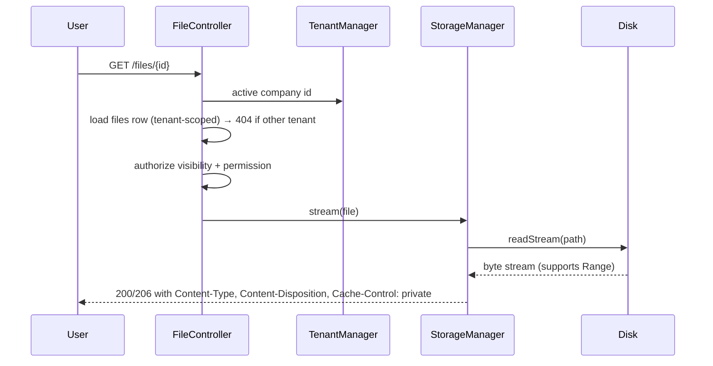

# 27 — Storage System

HalaOps file & media storage: the `files` table, a disk abstraction (local by default under `storage/app`, S3-compatible later), upload validation, checksums, visibility levels, tenant-scoped paths, secure serving/streaming, cleanup, and per-plan quotas.

## Related Documents

- [34 — Security](34-Security.md) — upload threats, access control, and serving safely.
- [05 — Database Architecture](05-Database-Architecture.md) — conventions for the `files` table and FK behavior.
- [06 — ERD](06-ERD.md) — the exact `files` schema and its relationships.
- [25 — Application Lifecycle](25-Application-Lifecycle.md) — résumés attached to `applications.resume_file_id`.
- [13 — Subscription System](13-Subscription-System.md) — `plans.limits` storage quota.

---

## Purpose (الهدف)

The Storage System is HalaOps's single, uniform way to **persist, validate, secure, serve, and clean up files** — résumés, avatars, company logos, interview recordings/attachments, and any future media. It is built around one metadata table, `files`, and a **disk abstraction** so the same application code works whether bytes live on the local filesystem (the default for shared-hosting buyers) or on S3-compatible object storage (future, for scale), with **strict per-tenant isolation** and **plan-based quotas**.

## Why It Exists (سبب وجوده)

Recruitment is file-heavy: every application carries a résumé, interviews produce recordings, companies upload logos. Letting modules write files ad hoc would scatter validation, leak files between tenants, and make backups, quotas, and cleanup impossible. The constraints make a dedicated system mandatory:

- **No CLI / shared hosting**: the default disk must be a plain folder under `storage/app` writable by PHP — no object-store account required to run.
- **Multi-tenant isolation**: a company must never read another company's files, so paths and DB rows are scoped by `workspace_id` and serving is authorized, never a guessable public URL by default.
- **Pluggable future**: large customers will outgrow local disk, so the same `files` rows and the same upload/serve API must transparently move to S3 by changing a `disk` value — not by rewriting callers.
- **Cost control**: plans sell storage, so usage must be measurable and enforceable per tenant.

## Architecture

```mermaid
flowchart TD
    Req[Upload request<br/>multipart/form-data] --> Ctrl[Controller + RequirePermission files.upload]
    Ctrl --> Val[UploadValidator<br/>mime / size / extension]
    Val -->|ok| Store[StorageManager.put]
    Store --> Disk{Disk driver}
    Disk -->|local| Local[LocalDisk<br/>storage/app/tenants/ID/...]
    Disk -->|s3| S3[S3Disk<br/>bucket/tenants/ID/...]
    Store --> Sum[sha256 checksum]
    Store --> Row[(files row<br/>workspace_id, disk, path,<br/>mime, size, checksum, visibility)]
    Row --> Resp[Return file id + reference]

    Get[Serve request /files/{id}] --> Authz[Authorize: tenant + visibility + permission]
    Authz -->|ok| Read[StorageManager.stream]
    Read --> Disk
    Read --> Out[Streamed response<br/>Content-Type, Content-Disposition]
```

**Components and responsibilities:**

- **`files` table** (planned, table #27 in [06-ERD.md](06-ERD.md)) — the source of truth for *what* is stored and *who owns it*. Application code references files by `files.id`, never by raw path.
- **`StorageManager`** (`app/Services/Storage/StorageManager.php`) — the façade. `put()`, `get()`, `stream()`, `delete()`, `url()`, `exists()`, `size()`. Resolves the active disk per file from its `disk` column and delegates byte I/O.
- **`StorageDiskInterface`** — the contract every disk implements: `put(path, stream): void`, `readStream(path)`, `delete(path): bool`, `exists(path): bool`, `size(path): int`. New backends = a new class + registry entry; no caller changes.
- **`LocalDisk`** — default driver writing under `storage/app` (outside the web root; never directly served by Apache). Honors a configurable base path.
- **`S3Disk`** — future driver for any S3-compatible endpoint (AWS S3, MinIO, Wasabi), using signed requests; selected by `disk = 's3'`.
- **`UploadValidator`** — enforces allowed MIME types, max size, extension/MIME agreement, and re-derives the real MIME from file content (never trusts the client header).
- **`File` model** (`app/Models/File.php`) — `$tenantScoped = true`, `$tenantColumn = 'workspace_id'`; casts and helpers (`isImage()`, `humanSize()`, `download()` reference builder). Tenant scope guarantees a query only ever sees the active company's files.
- **`FileController`** — upload, serve/stream, delete endpoints, all gated by RBAC and tenant scope.
- **Cleanup worker** — a queued job (`queued_jobs`) that removes orphaned blobs and enforces retention.

**Configuration** lives in `config/storage.php`: `default` disk, per-disk settings, `max_upload_size`, the allowed-MIME allowlist per category (résumé/image/recording/generic), and a `tenant_path_prefix`.

## Workflow

### Upload

1. A request hits an upload endpoint with `multipart/form-data`. CSRF is verified ([34-Security.md](34-Security.md)); the user must have the relevant permission (`files.upload`, or a domain permission like `candidate.apply` for a résumé).
2. `UploadValidator` checks the PHP upload error code, size against `max_upload_size` and the plan quota, the **content-derived MIME** (via `finfo`), and that the extension matches an allowed type for the category.
3. `StorageManager::put()` computes a **tenant-scoped path** — `tenants/{workspace_id}/{yyyy}/{mm}/{ulid}.{ext}` — streams the bytes to the active disk, and computes a **SHA-256 checksum** while streaming.
4. A `files` row is inserted: `workspace_id` (active tenant), `user_id` (uploader, SET NULL on user delete), `disk`, `path`, `original_name`, `mime`, `size`, `checksum`, `visibility`.
5. The new `files.id` is returned to the caller, which links it (e.g. sets `applications.resume_file_id`).

### Serve / stream



- Files are **never** served by a direct static URL from `storage/app`. The `/files/{id}` route loads the row through the tenant-scoped model (so cross-tenant ids 404), checks visibility, then streams via `StorageManager`, honoring HTTP `Range` for large media (interview recordings) so the browser can seek without downloading the whole file.

### Delete & cleanup

1. Deleting a file (permission `files.delete`, or owner/visibility policy) removes the blob via the disk driver and then the `files` row.
2. Rows that point a file via SET NULL (`applications.resume_file_id`, `interview_responses.response_file_id`) keep working with a NULL pointer.
3. A scheduled cleanup job reconciles: removes blobs with no `files` row (orphans), and `files` rows whose blob is missing, and enforces retention windows for transient categories.

## Business Rules

1. **Every file belongs to exactly one tenant.** `files.workspace_id` is required and is set from the active tenant on upload; cross-tenant access is impossible through the model.
2. **The DB is the index; the disk holds bytes.** Code references files by `files.id`; raw paths are an implementation detail owned by `StorageManager`.
3. **Visibility has three levels** (`files.visibility`):
   - `private` — only the uploader (and roles with explicit access, e.g. recruiters on that application) may read it. Default for résumés and recordings.
   - `company` — any active member of the owning company with the relevant permission may read it (e.g. a shared company document).
   - `public` — readable without authentication (e.g. a public company logo) via a stable, non-enumerable URL.
4. **MIME and size are validated server-side from content**, not from the client-supplied type or filename.
5. **Checksums are mandatory** (`files.checksum`, SHA-256) — used for integrity verification and de-duplication hints.
6. **Quotas are per plan and per tenant.** Total `SUM(files.size)` for a company must not exceed the plan's storage limit (`plans.limits.storage_mb`); uploads that would exceed it are rejected.
7. **The default disk is `local`** under `storage/app`, which must be outside the public web root and writable by PHP. `s3` is opt-in per deployment/file.
8. **Original filenames are preserved for display only** (`original_name`); the on-disk name is a generated ULID to avoid collisions, path traversal, and information leaks.
9. **Deletion is explicit and audited** — file deletes write an `activity_logs` entry (actor, subject, ip).

## Database Relations

Primary table — **`files`** (TENANT, planned #27):

| Column | Type | Notes |
|--------|------|-------|
| id | BIGINT UNSIGNED AI | PK |
| workspace_id | BIGINT UNSIGNED | FK → `workspaces(id)` **CASCADE**; tenant scope |
| user_id | BIGINT UNSIGNED NULL | FK → `users(id)` **SET NULL** (uploader) |
| disk | VARCHAR | `local` / `s3` |
| path | VARCHAR | tenant-scoped relative path |
| original_name | VARCHAR | display name |
| mime | VARCHAR | content-derived MIME |
| size | BIGINT UNSIGNED | bytes (for quota) |
| checksum | VARCHAR | SHA-256 |
| visibility | ENUM(`private`,`company`,`public`) | access level |
| created_at | TIMESTAMP NULL | append-only |

**Indexes:** PK; KEY `(workspace_id, user_id)` for "my files / company files" lookups and quota sums.

**Referencing tables (SET NULL so files can be deleted without breaking owners):**
- `applications.resume_file_id → files(id) SET NULL`
- `interview_responses.response_file_id → files(id) SET NULL`

Other modules may store a `files.id` (e.g. avatars/logos referenced from `users.avatar` / `workspaces.logo` may migrate from a plain path to a `files` reference). Quota reads `plans.limits` via the company's active `subscriptions` row. See [06-ERD.md](06-ERD.md) for the full diagram.

## Permissions

Governed by the Files permission group and domain policies (see [07-RBAC.md](07-RBAC.md), 11-Permissions-Matrix):

- `files.view` — list/read files within the active tenant (subject to per-file visibility).
- `files.upload` — upload new files.
- `files.delete` — delete files (plus an ownership/policy gate so users can delete their own uploads).
- Domain-specific gates layer on top: a candidate uploads a résumé under `candidate.apply`; recruiters read it under `applications.view`. A `private` interview recording requires `interviews.view` on that interview.
- **Tenant scope is enforced regardless of permission** — even a user with `files.view` only sees files where `workspace_id` = the active tenant.
- `public` files bypass authentication for read only, via a dedicated unguessable route; they still belong to a tenant for quota/cleanup.

## Validation

- **Presence & upload integrity**: PHP `$_FILES` error code is `UPLOAD_ERR_OK`; the temp file is an actual uploaded file (`is_uploaded_file`).
- **Size**: `size ≤ config('storage.max_upload_size')` AND `current_usage + size ≤ plan storage limit`.
- **MIME allowlist by category** (examples): résumés → `application/pdf`, `application/msword`, `application/vnd.openxmlformats-officedocument.wordprocessingml.document`; images → `image/png`, `image/jpeg`, `image/webp`, `image/svg+xml` (sanitized); recordings → `video/mp4`, `audio/mpeg`, `audio/webm`. The **real** MIME is derived with `finfo_file`; if it disagrees with the extension or is not in the allowlist, the upload is rejected.
- **Filename**: extension whitelisted; stored name is a generated ULID, never the user's filename; `original_name` is stored escaped for display.
- **Path safety**: `StorageManager` builds the path; no user input ever reaches the filesystem path (prevents `../` traversal).
- **Visibility**: must be one of the three enum values; defaults to `private` if absent.

## Edge Cases

1. **Quota exceeded** → upload rejected with a clear, localized error before any bytes are persisted; partial writes are cleaned up.
2. **Disk write fails** (permissions/full disk) → no `files` row is created; the user sees a storage error; the event is logged. The DB never references a blob that was not fully written.
3. **Orphaned blob / orphaned row** → reconciled by the cleanup job (blob without row is deleted; row without blob is flagged/removed).
4. **Deleting a user** who uploaded files → `files.user_id` becomes NULL (SET NULL); the files remain owned by the company.
5. **Deleting a company** → CASCADE removes its `files` rows; the cleanup job removes the corresponding blobs (and, for `local`, the tenant folder).
6. **Large media** → served with HTTP Range support so seeking/streaming works; the response streams from disk rather than loading the whole file into memory.
7. **SVG / HTML-ish images** → sanitized or served with `Content-Disposition: attachment` and a restrictive `Content-Type` to prevent stored-XSS.
8. **Duplicate content** → checksum lets the system detect identical uploads; de-duplication is optional and never breaks per-tenant accounting.
9. **Switching a file's disk** (local→s3 migration) → `StorageManager` copies bytes, updates `disk`/`path` atomically; readers always resolve the current `disk` column.

## Security

- **No direct file URLs.** `storage/app` is outside the document root; all private/company reads go through `/files/{id}`, which authorizes tenant + visibility + permission before streaming ([34-Security.md](34-Security.md)).
- **Tenant isolation** via the `files.workspace_id` scope (fail-closed) — cross-tenant ids return 404, not 403, to avoid existence leaks.
- **Content-type spoofing** is defeated by deriving MIME from content and serving with the correct `Content-Type` + `X-Content-Type-Options: nosniff`.
- **Path traversal / arbitrary write** is impossible because callers never supply paths; names are generated.
- **Executable upload protection**: PHP/script types are never in any allowlist, and the storage folder is not executable by the web server.
- **Integrity**: SHA-256 checksums detect tampering/corruption.
- **Least exposure for `public`**: public URLs are unguessable (ULID-based) and read-only; sensitive categories may never be `public`.
- **Audit**: uploads and deletions are recorded in `activity_logs`.

## Performance

- **Streaming I/O** for both upload (checksum computed on the stream) and download (Range support), keeping memory flat regardless of file size.
- **Index** `(workspace_id, user_id)` powers "my files", "company files", and `SUM(size)` quota checks without table scans.
- **Quota caching**: per-company total size is cached (and updated on insert/delete) so uploads do not run a full `SUM` every time on large tenants.
- **CDN/offload path**: with `s3`, public/company assets can be fronted by a CDN; `StorageManager::url()` returns the CDN/signed URL so the app never proxies those bytes.
- **Cleanup runs off the request path** via `queued_jobs`, so user-facing requests are never blocked by reconciliation.
- **Pagination** on file listings; thumbnails for images can be generated lazily and cached as derived `files`.

## Testing

- **Unit**: `UploadValidator` accepts/rejects by content MIME, size, and quota; `StorageManager` builds correct tenant-scoped paths and computes correct SHA-256; disk drivers implement the interface (local round-trip put/read/delete/exists/size).
- **Feature**: upload → `files` row created with right tenant/uploader/visibility; serve returns correct headers and bytes; Range request returns 206; delete removes blob + row.
- **Security**: a user from company A cannot fetch company B's file id (404); a `private` file is not readable without the right permission; a spoofed `.php` disguised as PDF is rejected; path-traversal filenames cannot escape the tenant folder; SVG is served safely.
- **Quota**: upload that would exceed the plan limit is rejected with no bytes written; deletion frees quota.
- **Cleanup**: orphaned blob and orphaned row are both reconciled; deleting a company removes its files/blobs; deleting an uploader nulls `user_id`.

## Future Expansion

- **S3-compatible disk** ships behind the same `StorageDiskInterface`; per-file `disk` allows gradual migration (new uploads to S3 while old stay local) with a background mover.
- **Signed, expiring URLs** for direct-to-storage downloads/uploads (presigned) to offload bandwidth from the app tier.
- **Image pipeline**: on-the-fly/cached resizing and format conversion (WebP/AVIF) stored as derived `files`.
- **Antivirus/scanning** hook in the upload pipeline (e.g. ClamAV or a cloud scanner) before a file becomes readable.
- **Per-category retention policies** and legal-hold flags for compliance.
- **Multi-region / CDN** for public assets; **chunked/resumable uploads** for very large interview recordings.

## Open Questions

None at this time. Exact MIME allowlists per category and the plan storage-limit key (`plans.limits.storage_mb`) are finalized in `config/storage.php` and [13-Subscription-System.md](13-Subscription-System.md); any change is reflected back into [06-ERD.md](06-ERD.md) and this document.
