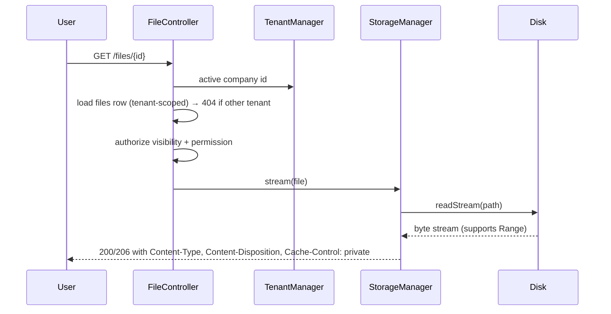

# 27 — Storage System

HalaOps file & media storage: the `files` table, a disk abstraction (local by default under `storage/app`, S3-compatible later), upload validation, checksums, visibility levels, tenant-scoped paths, secure serving/streaming, cleanup, and per-plan quotas.

## Related Documents

- [34 — Security](34-Security.md) — upload threats, access control, and serving safely.
- [05 — Database Architecture](05-Database-Architecture.md) — conventions for the `files` table and FK behavior.
- [06 — ERD](06-ERD.md) — the exact `files` schema and its relationships.
- [25 — Application Lifecycle](25-Application-Lifecycle.md) — résumés attached to `applications.resume_file_id`.
- [13 — Subscription System](13-Subscription-System.md) — `plans.limits` storage quota.

---

## Purpose (الهدف)

The Storage System is HalaOps's single, uniform way to **persist, validate, secure, serve, and clean up files** — résumés, avatars, company logos, interview recordings/attachments, and any future media. It is built around one metadata table, `files`, and a **disk abstraction** so the same application code works whether bytes live on the local filesystem (the default for shared-hosting buyers) or on S3-compatible object storage (future, for scale), with **strict per-tenant isolation** and **plan-based quotas**.

## Implementation status (built — Phase 16)

The storage system is **built on the local disk** end to end. `App\Services\Files\FileStorage` is the local-disk driver — rooted at `storage/app/uploads/<workspace_id>/`, **traversal-safe** (rejects `..` segments, absolute/drive paths and NUL bytes, then re-checks `realpath` containment under the uploads root); real uploads are relocated with `move_uploaded_file()`. `App\Services\Files\FileService` is the tenant-scoped orchestrator (`store` / `list` / `find` / `delete`) over `App\Models\File`, and `App\Controllers\App\FileController` (`index` / `upload` / `download` / `delete`) serves the `app/files` view. Routes: `files`, `files/upload`, `files/download`, `files/delete` — **reads gated by `recruitment.view`, writes by `recruitment.manage`** (files are treated as recruitment artifacts, so they reuse the recruitment permission group rather than a separate `files.*` group).

On upload: a **10 MB** cap, an **extension + MIME allowlist** (pdf/doc/docx/xls/xlsx/csv/txt/png/jpg/jpeg/gif/webp/zip; MIME re-derived from content via `finfo`, extension is the primary gate), a **SHA-256 checksum**, the seeded **local `storage_provider_id`** (the `storage_providers` row with `driver = 'local'`), `visibility_id` = `file_visibility:private`, and a generated `uuid`-prefixed on-disk name under the per-workspace folder. Downloads stream the file back as an `attachment` with safe headers (`Content-Disposition`, `X-Content-Type-Options: nosniff`, `Cache-Control: private, no-store`); a file id from another tenant resolves to **404** (the `File` model is tenant-scoped). Delete is a soft-delete plus best-effort disk cleanup, and uploads/deletes are written to `activity_logs`. **No new tables** were added (the `files` table already existed).

**Honest limitation.** Only the **local** disk driver is implemented. The S3 / GCS / Azure rows in `storage_providers` are **catalogued but NOT implemented** — there is no cloud disk class, no presigned URL, and no CDN/`url()` path beyond an optionally configured static base. The pluggable `StorageManager` / `StorageDiskInterface` / per-file `disk` migration described below is the **design**; today's code is the single local driver. Plan-based storage quotas are likewise design, not yet enforced by the built `FileService`.

**Background processing (built).** The same queue/cron that the rest of the platform uses is built: background jobs in `queued_jobs` and the no-terminal **token-gated cron** at `GET /cron/run` drain `queued_jobs` and tick `scheduled_tasks` (no SSH/CLI needed). The built-in **`mail` job handler** sends email off the queue via the `Mailer` (which now has a real SMTP transport — see [26 — Notification System](26-Notification-System.md)). The storage **cleanup worker** described under Delete & cleanup is design, not yet a registered job.

## Why It Exists (سبب وجوده)

Recruitment is file-heavy: every application carries a résumé, interviews produce recordings, companies upload logos. Letting modules write files ad hoc would scatter validation, leak files between tenants, and make backups, quotas, and cleanup impossible. The constraints make a dedicated system mandatory:

- **No CLI / shared hosting**: the default disk must be a plain folder under `storage/app` writable by PHP — no object-store account required to run.
- **Multi-tenant isolation**: a company must never read another company's files, so paths and DB rows are scoped by `workspace_id` and serving is authorized, never a guessable public URL by default.
- **Pluggable future**: large customers will outgrow local disk, so the same `files` rows and the same upload/serve API must transparently move to S3 by changing a `disk` value — not by rewriting callers.
- **Cost control**: plans sell storage, so usage must be measurable and enforceable per tenant.

## Architecture

```mermaid
flowchart TD
    Req[Upload request<br/>multipart/form-data] --> Ctrl[Controller + RequirePermission files.upload]
    Ctrl --> Val[UploadValidator<br/>mime / size / extension]
    Val -->|ok| Store[StorageManager.put]
    Store --> Disk{Disk driver}
    Disk -->|local| Local[LocalDisk<br/>storage/app/tenants/ID/...]
    Disk -->|s3| S3[S3Disk<br/>bucket/tenants/ID/...]
    Store --> Sum[sha256 checksum]
    Store --> Row[(files row<br/>workspace_id, disk, path,<br/>mime, size, checksum, visibility)]
    Row --> Resp[Return file id + reference]

    Get[Serve request /files/{id}] --> Authz[Authorize: tenant + visibility + permission]
    Authz -->|ok| Read[StorageManager.stream]
    Read --> Disk
    Read --> Out[Streamed response<br/>Content-Type, Content-Disposition]
```

**Components and responsibilities** (✅ = built today; the rest are the forward-looking design — see Implementation status):

- **`files` table** (table #27 in [06-ERD.md](06-ERD.md), **✅ exists**) — the source of truth for *what* is stored and *who owns it*. Application code references files by `files.id`, never by raw path.
- **`FileStorage`** (`app/Services/Files/FileStorage.php`, **✅ built — local only**) — the local-disk driver rooted at `storage/app/uploads/<workspace_id>/`: `store()`, `path()`, `exists()`, `delete()`, `url()`, `root()`. Builds and re-checks every path for traversal safety; this is the concrete stand-in for the planned multi-disk `StorageManager` below.
- **`FileService`** (`app/Services/Files/FileService.php`, **✅ built**) — tenant-scoped orchestration over `files`: validates and persists an upload, lists the workspace's files (with the uploader's name resolved in one batched query — no N+1), and soft-deletes a file plus its bytes. Owns the 10 MB cap and the extension/MIME allowlist (no separate `UploadValidator` class exists).
- **`StorageManager`** (`app/Services/Storage/StorageManager.php`, planned) — the design's multi-disk façade (`put`/`get`/`stream`/`url`/…) that would resolve the active disk per file. **Not built**; `FileStorage` covers the local case today.
- **`StorageDiskInterface`** (planned) — the contract every disk would implement so new backends are a new class + registry entry. **Not built** — there is a single local implementation.
- **`S3Disk` / GCS / Azure** (planned, **NOT implemented**) — future drivers selected by the file's `disk`/`storage_provider_id`. The cloud rows in `storage_providers` are catalogued only; no driver exists.
- **`File` model** (`app/Models/File.php`, **✅ built**) — `$tenantScoped = true`, `$tenantColumn = 'workspace_id'`. Tenant scope guarantees a query only ever sees the active company's files; cross-tenant ids resolve to 404.
- **`FileController`** (`app/Controllers/App/FileController.php`, **✅ built**) — `index` / `upload` / `download` / `delete`, each re-checking its permission (`recruitment.view` for reads, `recruitment.manage` for writes) and operating through the tenant-scoped `FileService`.
- **Cleanup worker** (planned) — a queued job that would remove orphaned blobs and enforce retention. **Not yet registered.**

**Configuration**: `config/filesystems.php` carries an optional `uploads_url` (for an external/CDN base) and the local root resolves via `storage_path('app/uploads')`. The planned `config/storage.php` with per-disk settings, a category MIME allowlist and a `tenant_path_prefix` is design; today the cap (10 MB) and allowlist live in `FileService`.

## Workflow

### Upload (built)

1. A request hits `POST /files/upload` with `multipart/form-data`. CSRF is verified ([34-Security.md](34-Security.md)); the user must hold **`recruitment.manage`** (the write gate for these recruitment artifacts).
2. `FileService` validates the PHP upload error code, the size against the **10 MB** cap, the extension against the allowlist (the primary gate), and re-derives the **content MIME** via `finfo`. (Per-plan storage quota is not yet enforced — design only.)
3. `FileStorage::store()` builds the **tenant-scoped relative path** `<workspace_id>/<uuid>-<sanitised original name>`, verifies it is traversal-safe, and relocates the bytes with `move_uploaded_file()`; `FileService` computes the **SHA-256 checksum**.
4. A `files` row is inserted via the tenant-scoped `File` model: `workspace_id` (active tenant), `user_id` (uploader), `storage_provider_id` (the seeded **local** provider), `disk = 'local'`, `path`, `original_name`, `mime`, `size`, `checksum`, and `visibility_id` = `file_visibility:private`. The upload is recorded in `activity_logs`.
5. The created `File` is returned; other modules may store its `files.id` (e.g. `applications.resume_file_id`).

### Serve / stream



- Files are **never** served by a direct static URL from `storage/app`. The built `GET /files/download?id=…` route (gated by `recruitment.view`) loads the row through the tenant-scoped `File` model — so a cross-tenant id resolves to **404** — resolves a traversal-safe absolute path via `FileStorage::path()`, and sends the bytes back as an `attachment` with `Content-Type`, `Content-Disposition`, `X-Content-Type-Options: nosniff` and `Cache-Control: private, no-store`. (The built download reads the file and returns it with these safe headers; per-file visibility enforcement and HTTP `Range`/seek streaming for large media are part of the design, not yet in the built path.)

### Delete & cleanup

1. Deleting a file (permission `files.delete`, or owner/visibility policy) removes the blob via the disk driver and then the `files` row.
2. Rows that point a file via SET NULL (`applications.resume_file_id`, `interview_responses.response_file_id`) keep working with a NULL pointer.
3. A scheduled cleanup job reconciles: removes blobs with no `files` row (orphans), and `files` rows whose blob is missing, and enforces retention windows for transient categories.

## Business Rules

1. **Every file belongs to exactly one tenant.** `files.workspace_id` is required and is set from the active tenant on upload; cross-tenant access is impossible through the model.
2. **The DB is the index; the disk holds bytes.** Code references files by `files.id`; raw paths are an implementation detail owned by `StorageManager`.
3. **Visibility is config-driven** via `files.visibility_id` → the `file_visibility` lookup (`key`s `private` / `workspace` / `public`; **no ENUM column**). Every built upload is stamped **`private`**. The per-level read semantics below are the intended design; the built download path enforces tenant scope but does **not** yet branch on visibility:
   - `private` — only the uploader (and roles with explicit access) may read it. The current default for every upload.
   - `workspace` — any active member of the owning workspace with the relevant permission may read it (a shared company document).
   - `public` — readable without authentication (e.g. a public logo) via a stable, non-enumerable URL.
4. **MIME and size are validated server-side from content**, not from the client-supplied type or filename.
5. **Checksums are mandatory** (`files.checksum`, SHA-256) — used for integrity verification and de-duplication hints.
6. **Quotas are per plan and per tenant.** Total `SUM(files.size)` for a company must not exceed the plan's storage limit (`plans.limits.storage_mb`); uploads that would exceed it are rejected.
7. **The default disk is `local`** under `storage/app`, which must be outside the public web root and writable by PHP. `s3` is opt-in per deployment/file.
8. **Original filenames are preserved for display only** (`original_name`); the on-disk name is a generated ULID to avoid collisions, path traversal, and information leaks.
9. **Deletion is explicit and audited** — file deletes write an `activity_logs` entry (actor, subject, ip).

## Database Relations

Primary table — **`files`** (TENANT, #27, **exists**) — the columns the built code reads/writes:

| Column | Type | Notes |
|--------|------|-------|
| id | BIGINT UNSIGNED AI | PK |
| uuid | CHAR(36) | public identifier; also forms the on-disk name prefix |
| workspace_id | BIGINT UNSIGNED | FK → `workspaces(id)` **CASCADE**; tenant scope |
| user_id | BIGINT UNSIGNED NULL | FK → `users(id)` **SET NULL** (uploader) |
| storage_provider_id | BIGINT UNSIGNED | FK → `storage_providers(id)`; the seeded **local** provider today |
| disk | VARCHAR | `'local'` (the only built driver) |
| path | VARCHAR | tenant-scoped relative path `<workspace_id>/<uuid>-<name>` |
| original_name | VARCHAR | display name (sanitised) |
| mime | VARCHAR | content-derived MIME |
| size | BIGINT UNSIGNED | bytes (for future quota) |
| checksum | VARCHAR | SHA-256 |
| visibility_id | BIGINT UNSIGNED | FK → `file_visibility` lookup (`key`s `private`/`workspace`/`public`); set to `private` on upload. **No ENUM column** — visibility is config-driven per the platform rule. |
| created_at / deleted_at | TIMESTAMP NULL | append-only; soft-delete supported |

**Indexes:** PK; tenant index on `workspace_id` (the built listing/quota path filters on `workspace_id` + `deleted_at`).

**Referencing tables (SET NULL so files can be deleted without breaking owners):**
- `applications.resume_file_id → files(id) SET NULL`
- `interview_responses.response_file_id → files(id) SET NULL`

Other modules may store a `files.id` (e.g. avatars/logos referenced from `users.avatar` / `workspaces.logo` may migrate from a plain path to a `files` reference). Quota reads `plans.limits` via the company's active `subscriptions` row. See [06-ERD.md](06-ERD.md) for the full diagram.

## Permissions

As built, files are treated as **recruitment artifacts** and reuse the recruitment permission group (see [07-RBAC.md](07-RBAC.md), 11-Permissions-Matrix); there is no separate `files.*` group today:

- **`recruitment.view`** — list and download files within the active tenant (`GET /files`, `GET /files/download`). (Built.)
- **`recruitment.manage`** — upload and delete files (`POST /files/upload`, `POST /files/delete`). (Built.)
- **Tenant scope is enforced regardless of permission** — even a user with `recruitment.view` only sees files where `workspace_id` = the active tenant, and a cross-tenant id returns 404.
- A dedicated **Files permission group** (`files.view` / `files.upload` / `files.delete`), per-file **visibility** enforcement (a `private` recording requiring `interviews.view`, a `public` file on an unguessable unauthenticated route), and domain gates such as `candidate.apply` for a résumé are the **design** — they are documented below/here but not yet the built gates.

## Validation

- **Presence & upload integrity**: PHP `$_FILES` error code is `UPLOAD_ERR_OK`; the temp file is an actual uploaded file (`is_uploaded_file`).
- **Size**: `size ≤ config('storage.max_upload_size')` AND `current_usage + size ≤ plan storage limit`.
- **MIME allowlist by category** (examples): résumés → `application/pdf`, `application/msword`, `application/vnd.openxmlformats-officedocument.wordprocessingml.document`; images → `image/png`, `image/jpeg`, `image/webp`, `image/svg+xml` (sanitized); recordings → `video/mp4`, `audio/mpeg`, `audio/webm`. The **real** MIME is derived with `finfo_file`; if it disagrees with the extension or is not in the allowlist, the upload is rejected.
- **Filename**: extension whitelisted; stored name is a generated ULID, never the user's filename; `original_name` is stored escaped for display.
- **Path safety**: `StorageManager` builds the path; no user input ever reaches the filesystem path (prevents `../` traversal).
- **Visibility**: must be one of the three enum values; defaults to `private` if absent.

## Edge Cases

1. **Quota exceeded** → upload rejected with a clear, localized error before any bytes are persisted; partial writes are cleaned up.
2. **Disk write fails** (permissions/full disk) → no `files` row is created; the user sees a storage error; the event is logged. The DB never references a blob that was not fully written.
3. **Orphaned blob / orphaned row** → reconciled by the cleanup job (blob without row is deleted; row without blob is flagged/removed).
4. **Deleting a user** who uploaded files → `files.user_id` becomes NULL (SET NULL); the files remain owned by the company.
5. **Deleting a company** → CASCADE removes its `files` rows; the cleanup job removes the corresponding blobs (and, for `local`, the tenant folder).
6. **Large media** → served with HTTP Range support so seeking/streaming works; the response streams from disk rather than loading the whole file into memory.
7. **SVG / HTML-ish images** → sanitized or served with `Content-Disposition: attachment` and a restrictive `Content-Type` to prevent stored-XSS.
8. **Duplicate content** → checksum lets the system detect identical uploads; de-duplication is optional and never breaks per-tenant accounting.
9. **Switching a file's disk** (local→s3 migration) → `StorageManager` copies bytes, updates `disk`/`path` atomically; readers always resolve the current `disk` column.

## Security

- **No direct file URLs.** `storage/app` is outside the document root; all private/company reads go through `/files/{id}`, which authorizes tenant + visibility + permission before streaming ([34-Security.md](34-Security.md)).
- **Tenant isolation** via the `files.workspace_id` scope (fail-closed) — cross-tenant ids return 404, not 403, to avoid existence leaks.
- **Content-type spoofing** is defeated by deriving MIME from content and serving with the correct `Content-Type` + `X-Content-Type-Options: nosniff`.
- **Path traversal / arbitrary write** is impossible because callers never supply paths; names are generated.
- **Executable upload protection**: PHP/script types are never in any allowlist, and the storage folder is not executable by the web server.
- **Integrity**: SHA-256 checksums detect tampering/corruption.
- **Least exposure for `public`**: public URLs are unguessable (ULID-based) and read-only; sensitive categories may never be `public`.
- **Audit**: uploads and deletions are recorded in `activity_logs`.

## Performance

- **Streaming I/O** for both upload (checksum computed on the stream) and download (Range support), keeping memory flat regardless of file size.
- **Index** `(workspace_id, user_id)` powers "my files", "company files", and `SUM(size)` quota checks without table scans.
- **Quota caching**: per-company total size is cached (and updated on insert/delete) so uploads do not run a full `SUM` every time on large tenants.
- **CDN/offload path**: with `s3`, public/company assets can be fronted by a CDN; `StorageManager::url()` returns the CDN/signed URL so the app never proxies those bytes.
- **Cleanup runs off the request path** via `queued_jobs`, so user-facing requests are never blocked by reconciliation.
- **Pagination** on file listings; thumbnails for images can be generated lazily and cached as derived `files`.

## Testing

- **Unit**: `UploadValidator` accepts/rejects by content MIME, size, and quota; `StorageManager` builds correct tenant-scoped paths and computes correct SHA-256; disk drivers implement the interface (local round-trip put/read/delete/exists/size).
- **Feature**: upload → `files` row created with right tenant/uploader/visibility; serve returns correct headers and bytes; Range request returns 206; delete removes blob + row.
- **Security**: a user from company A cannot fetch company B's file id (404); a `private` file is not readable without the right permission; a spoofed `.php` disguised as PDF is rejected; path-traversal filenames cannot escape the tenant folder; SVG is served safely.
- **Quota**: upload that would exceed the plan limit is rejected with no bytes written; deletion frees quota.
- **Cleanup**: orphaned blob and orphaned row are both reconciled; deleting a company removes its files/blobs; deleting an uploader nulls `user_id`.

## Future Expansion

- **S3-compatible disk** ships behind the same `StorageDiskInterface`; per-file `disk` allows gradual migration (new uploads to S3 while old stay local) with a background mover.
- **Signed, expiring URLs** for direct-to-storage downloads/uploads (presigned) to offload bandwidth from the app tier.
- **Image pipeline**: on-the-fly/cached resizing and format conversion (WebP/AVIF) stored as derived `files`.
- **Antivirus/scanning** hook in the upload pipeline (e.g. ClamAV or a cloud scanner) before a file becomes readable.
- **Per-category retention policies** and legal-hold flags for compliance.
- **Multi-region / CDN** for public assets; **chunked/resumable uploads** for very large interview recordings.

## Open Questions

None at this time. Exact MIME allowlists per category and the plan storage-limit key (`plans.limits.storage_mb`) are finalized in `config/storage.php` and [13-Subscription-System.md](13-Subscription-System.md); any change is reflected back into [06-ERD.md](06-ERD.md) and this document.
