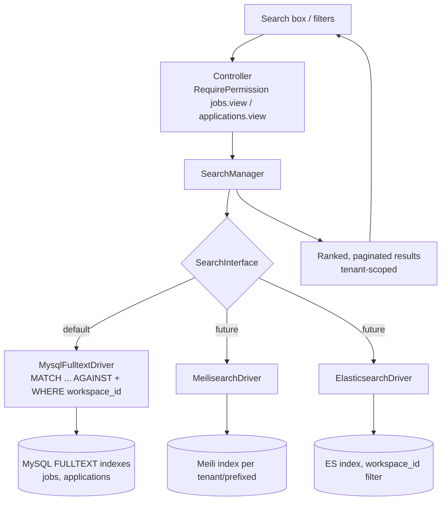
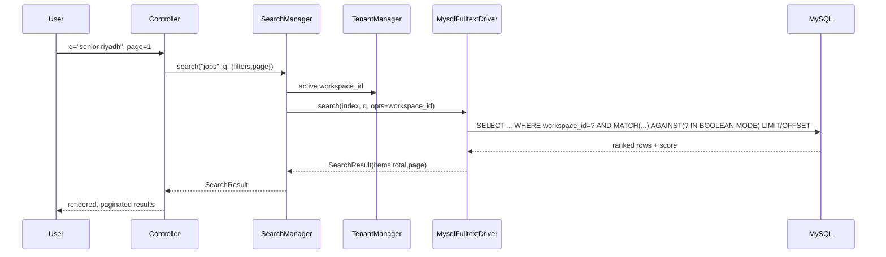

# 28 — Search System

HalaOps search: MySQL FULLTEXT over `jobs` and `applications` today, hidden behind a `SearchInterface` abstraction so Meilisearch/Elasticsearch can replace it later — always tenant-filtered, with a defined indexing strategy, ranking, pagination, and performance budget.

## Related Documents

- [05 — Database Architecture](05-Database-Architecture.md) — table conventions, indexing strategy, and the FULLTEXT indexes used here.
- [35 — Performance](35-Performance.md) — query budgets, caching, and how search fits the performance story.
- [24 — Job Lifecycle](24-Job-Lifecycle.md) — the `jobs` data that is searched.
- [25 — Application Lifecycle](25-Application-Lifecycle.md) — the `applications` data that is searched.
- [08 — Multi-Tenant Architecture](08-Multi-Tenant.md) — the tenant filter every search must apply.

---

## Purpose (الهدف)

The Search System gives users fast, relevant, **tenant-isolated** full-text search across the recruitment domain — primarily **jobs** (title, description, department, location) and **applications** (candidate name, cover letter, source). It is delivered behind a single `SearchInterface` so the underlying engine (MySQL FULLTEXT now; Meilisearch/Elasticsearch later) can change without touching callers. Every query is **always** scoped to the active company.

## Why It Exists (سبب وجوده)

Recruiters and HR managers work over growing lists of jobs and applications and need to find records by free text ("senior backend Riyadh", a candidate's name, a keyword in a cover letter) — `LIKE '%term%'` cannot do this at scale (no index usage, no relevance ranking, poor Arabic handling). At the same time the platform must run on **plain shared MySQL** with no extra services for the buyer, yet allow large tenants to upgrade to a dedicated search engine. The resolution:

- **Use MySQL FULLTEXT** as the zero-dependency default — it ships with the database every buyer already has.
- **Abstract it behind `SearchInterface`** so the same controller code can be pointed at Meilisearch/Elasticsearch by configuration, with no rewrite, when a deployment needs typo-tolerance, faceting, or higher throughput.
- **Bake tenant scoping into the abstraction** so no search path can ever leak another company's data — search is a classic place isolation bugs hide.

## Architecture



**Components and responsibilities:**

- **`SearchInterface`** (`app/Services/Search/SearchInterface.php`) — the contract: `search(string $index, string $query, array $opts): SearchResult` plus index maintenance hooks `index(string $index, array $doc)`, `delete(string $index, string|int $id)`, `flush(string $index)`. `$opts` carries `workspace_id` (mandatory), `filters`, `sort`, `page`, `perPage`. `$index` is a logical name (`jobs`, `applications`).
- **`SearchManager`** (`app/Services/Search/SearchManager.php`) — the façade callers use. Resolves the configured driver, **injects the active tenant's `workspace_id`**, normalizes the query, and returns a uniform `SearchResult` (items + total + paging). It is the only thing controllers talk to.
- **`MysqlFulltextDriver`** — the default. Builds a parameterized `SELECT … WHERE workspace_id = :company AND MATCH(<cols>) AGAINST(:q IN BOOLEAN MODE)` via the `QueryBuilder`, ordered by relevance, with `LIMIT/OFFSET`. Uses the FULLTEXT indexes declared on `jobs` and `applications`.
- **`MeilisearchDriver` / `ElasticsearchDriver`** (future) — implement the same interface; documents are pushed on write and queried with a hard `workspace_id` filter; they add typo-tolerance, facets, and synonyms.
- **`SearchResult`** — a small DTO: `items[]`, `total`, `page`, `perPage`, `query`, `tookMs`.
- **Indexer hooks** — model lifecycle events on `Job`/`Application` call `SearchManager::index()/delete()` so external engines stay in sync; for the MySQL driver this is a no-op because the FULLTEXT index is maintained by the database itself.

**Configuration** (`config/search.php`): `driver` (`mysql` default; `meilisearch`/`elasticsearch` later), per-driver connection settings, `min_query_length`, `per_page`, and the searchable-column map per index.

## Workflow

### Query flow (MySQL FULLTEXT, default)

1. User submits a query and optional filters (status, department, stage) from a list screen. The controller checks the right permission (`jobs.view` or `applications.view`).
2. `SearchManager::search('jobs', $q, $opts)` normalizes the term, enforces `min_query_length`, and **sets `$opts['workspace_id']` from `TenantManager`** (ignoring any client-supplied value).
3. `MysqlFulltextDriver` builds:
   ```sql
   SELECT *, MATCH(title, description) AGAINST(:q IN BOOLEAN MODE) AS score
   FROM jobs
   WHERE workspace_id = :company
     AND status IN (:statuses)            -- optional filters
     AND MATCH(title, description) AGAINST(:q IN BOOLEAN MODE)
   ORDER BY score DESC, published_at DESC
   LIMIT :limit OFFSET :offset;
   ```
   All values are bound parameters (no interpolation).
4. Results are wrapped in `SearchResult` with the total (a parallel `COUNT` honoring the same `WHERE`) and returned paginated to the view.



### Indexing flow (for external engines)

1. On create/update of a `Job` or `Application`, the model fires a hook → `SearchManager::index('jobs', $doc)` where `$doc` includes `id`, `workspace_id`, and the searchable fields.
2. On delete, `SearchManager::delete('jobs', $id)` removes the document.
3. A reindex command (admin/diagnostics) can `flush()` and rebuild an index from the database — used on engine switch or schema change.
4. For the **MySQL driver these hooks are no-ops**: FULLTEXT indexes update transactionally with the row, so there is nothing to push.

## Business Rules

1. **Every search is tenant-scoped.** `workspace_id` is injected by `SearchManager` from the active tenant and added as a hard filter (or per-tenant index for external engines). A search with no active tenant fails closed (no results / error), never returns cross-tenant rows.
2. **The engine is pluggable, the API is fixed.** Callers depend only on `SearchInterface`/`SearchManager`; switching to Meilisearch/Elasticsearch is a config change plus a reindex.
3. **Default searchable fields**: `jobs` → `title`, `description` (with `department`/`location` filterable); `applications` → candidate name (joined from `users`), `cover_letter`, `source`. The searchable map is config-driven so fields can be added without touching drivers.
4. **Boolean mode** is used for MySQL FULLTEXT so users can do `+required -excluded "exact phrase"`; bare terms are OR-ed and ranked by relevance.
5. **Minimum query length** (`min_query_length`, default 2–3 chars) prevents pathological scans; shorter input falls back to a simple prefix filter on indexed columns.
6. **Results respect domain permissions and visibility** — a user only searches records they may list (e.g. `applications.view`), and tenant scope is applied on top.
7. **Pagination is mandatory**; search never returns an unbounded set.
8. **Relevance is the primary sort**, with a deterministic tiebreaker (`published_at`/`applied_at`/`id`) so paging is stable.

## Database Relations

Search reads existing domain tables; it adds **FULLTEXT indexes**, not new tables:

- **`jobs`** (TENANT, planned #17): FULLTEXT index on `(title, description)`; filtered by `workspace_id` and `status` (which already has `KEY (workspace_id, status)`).
- **`applications`** (TENANT, planned #19): FULLTEXT index on `(cover_letter)` and a join to `users(name)` for candidate-name search; filtered by `workspace_id`, `job_id`, `status`, `current_stage_id` (covered by `KEY (workspace_id, job_id, status, current_stage_id)`).
- **`users`** (GLOBAL): joined for candidate name on application search; matching is still constrained to the tenant via the `applications.workspace_id` filter, so global `users` rows are only reachable through a tenant's applications.

These FULLTEXT indexes are declared in the `jobs`/`applications` migrations (see [06-ERD.md](06-ERD.md)). MySQL maintains them transactionally with row writes. For external engines, the per-tenant documents mirror these fields plus `workspace_id`.

## Permissions

Search inherits the permission model of the data it searches (see [07-RBAC.md](07-RBAC.md), 11-Permissions-Matrix):

- **Job search** requires `jobs.view`.
- **Application search** requires `applications.view`.
- **Candidate self-service** searching their own applications is gated by `candidate.profile`/`candidate.apply` and scoped to their own `user_id`.
- **Super admin** platform-wide search (across tenants) is a distinct capability under `platform.*` and uses `withoutTenantScope()`; it is the only path that may omit the `workspace_id` filter and is never reachable by tenant users.
- Regardless of permission, the tenant `workspace_id` filter is always applied for tenant users.

## Validation

- **Query length**: trimmed length must be ≥ `min_query_length`; otherwise fall back to prefix filtering or return an empty, explained result.
- **Sanitization for FULLTEXT boolean mode**: special operators (`+ - > < ( ) ~ * "`) are handled deliberately — either honored as user operators or stripped/escaped to avoid syntax errors; the final string is always passed as a **bound parameter**, never concatenated.
- **Pagination params**: `page ≥ 1`, `perPage` clamped to a max (e.g. 100) and defaulted from config.
- **Filters**: each filter value validated against allowed enum sets (status/type/stage) before being added to the `WHERE`.
- **Index name**: only known logical indexes (`jobs`, `applications`) are accepted by `SearchManager`.
- **Encoding**: input normalized to UTF-8/`utf8mb4`; Arabic input handled consistently (see Edge Cases).

## Edge Cases

1. **No active tenant** → `SearchManager` refuses to run a tenant search (fail closed); only `platform.*` paths may search without a `workspace_id`.
2. **Empty / too-short query** → return an empty result with a hint, or a simple recent/filtered list, rather than a full scan.
3. **MySQL FULLTEXT min token length** (`innodb_ft_min_token_size`, default 3) means very short tokens may not match; the driver falls back to a prefix `LIKE` on the indexed column for such tokens and documents the limitation.
4. **Stopwords** — common words may be ignored by FULLTEXT; boolean mode and the prefix fallback mitigate this for the buyer's default install.
5. **Arabic & RTL** — MySQL FULLTEXT tokenizes on whitespace and is diacritic-sensitive; the system normalizes Arabic (strip tatweel/diacritics where appropriate) before matching, and this is exactly the scenario that motivates the optional Meilisearch/Elasticsearch driver (better Arabic + typo tolerance).
6. **No results** → return an empty `SearchResult` (not an error) so the UI can show an empty state.
7. **Engine switch mid-flight** → after changing `config('search.driver')`, a reindex (`flush()` + rebuild) is required for external engines; MySQL needs none.
8. **Large tenants** → relevance + filter + pagination keep result sets bounded; very large/noisy queries are length- and page-limited; heavy tenants are the upgrade case for an external engine.
9. **Deleted/closed records** → filters (e.g. exclude `archived` jobs) are applied so search reflects the intended visibility.

## Security

- **Tenant isolation is the top search threat**; it is mitigated by injecting `workspace_id` inside `SearchManager` (clients cannot override it) and, for external engines, per-tenant indexes or mandatory `workspace_id` filters ([08-Multi-Tenant.md](08-Multi-Tenant.md)).
- **SQL injection** is prevented by always binding the query and filter values as parameters through `QueryBuilder` — even FULLTEXT `AGAINST(:q ...)` uses a placeholder.
- **No information leakage**: search honors per-record permissions/visibility, so a user cannot infer the existence of records they may not see.
- **DoS resistance**: minimum length, page caps, and (optionally) rate limiting on the search endpoint via `ThrottleRequests` prevent expensive query floods.
- **Output escaping**: result fields (titles, snippets) are escaped via `e()` in views; highlighted snippets never inject raw HTML.
- **External engine credentials** (Meilisearch/ES keys) are stored in `.env`/config, not in tenant data, and the app holds only what the deployment configures.

## Performance

- **FULLTEXT indexes** turn free-text search from an O(n) `LIKE '%...%'` scan into an index lookup; they are the core performance lever for the default driver.
- **Composite filter indexes** already on `jobs (workspace_id, status)` and `applications (workspace_id, job_id, status, current_stage_id)` let the `workspace_id`/status filters use indexes alongside the FULLTEXT match.
- **Pagination** (`LIMIT/OFFSET`) bounds every response; deep paging can later move to keyset pagination if needed.
- **Result/count caching**: identical (tenant, query, filters, page) tuples can be cached briefly to absorb repeated typing/paging; cache keys include `workspace_id` so tenants never share cached results.
- **Query budget**: search endpoints target a small, indexed query count (one search + one count, optionally cached); N+1 is avoided by joining `users` for candidate names instead of per-row lookups.
- **Offload at scale**: moving to Meilisearch/Elasticsearch removes search load from the primary MySQL, adds typo-tolerance/faceting, and scales horizontally — all behind the same `SearchInterface`.
- **Async indexing** for external engines runs through `queued_jobs` so writes are not slowed by index pushes.

## Testing

- **Unit**: `SearchManager` always injects the active `workspace_id` and ignores client-supplied tenant ids; query normalization and boolean-mode sanitization behave as specified; `min_query_length` fallback works.
- **Driver**: `MysqlFulltextDriver` builds a parameterized `MATCH … AGAINST` with the `workspace_id` filter and correct ordering/paging; future `Meilisearch`/`Elasticsearch` drivers satisfy the same `SearchInterface` contract tests.
- **Feature**: searching `jobs`/`applications` returns relevant, ranked, paginated results; filters (status/department/stage) narrow correctly; empty query returns a sensible empty/recent result.
- **Security/isolation**: a user in company A never receives company B's jobs/applications via search (including via the `users` join); search with no active tenant fails closed; injection-style queries are safely parameterized; result fields are escaped.
- **i18n**: Arabic queries return expected matches after normalization; RTL terms work; the documented FULLTEXT min-token/stopword limitations are covered by the prefix fallback test.
- **Engine swap**: switching the configured driver and reindexing yields equivalent tenant-scoped results.

## Future Expansion

- **Meilisearch / Elasticsearch drivers** behind the existing `SearchInterface` for typo-tolerance, synonyms, faceted filters, and much better Arabic handling — selected per deployment via `config('search.driver')`.
- **More searchable entities**: extend the searchable-column map to `candidates' profiles`, interview notes, and evaluations as those modules mature — no driver changes required.
- **Faceted/aggregated search** (counts by status/department/stage) once an engine that supports facets is in use.
- **Saved searches & alerts** (notify when a new application matches a recruiter's saved query) layered on `notifications`.
- **Suggestions/autocomplete** and "did you mean" powered by the external engine.
- **Per-tenant relevance tuning** (boost recent/open jobs) configurable without code changes.

## Open Questions

None at this time. The default driver, searchable fields, and tenant-scoping rules are fixed by the canonical context; the exact Arabic-normalization steps and the external-engine indexing schema will be finalized in `config/search.php` and the respective driver's implementation, and reflected back here and in [05-Database-Architecture.md](05-Database-Architecture.md).
